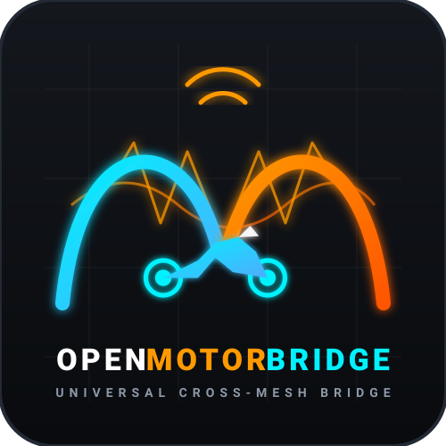
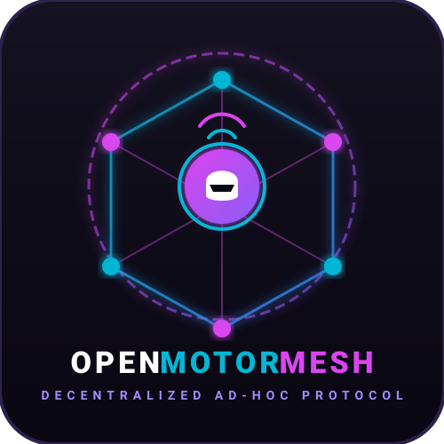

# OpenMotorBridge (v8.0) – Universelle Motorrad-Intercom- & Telemetrie-Bridge

  
  &nbsp;&nbsp;&nbsp;&nbsp;&nbsp;&nbsp;&nbsp;&nbsp;
  

  
  
  
  
  

Die **OpenMotorBridge (OMB)** ist eine offene, herstellerübergreifende Kommunikations- und Telemetrieplattform für Motorräder. Sie verbindet proprietäre Funk- und Mesh-Systeme (z. B. **Sena Mesh 3.0** und **Cardo DMC Gen2**) galvanisch getrennt mit einem offenen **2,4-GHz / 868-MHz OpenMotorMesh (OMM)**, hochpräzisem **GNSS-Tour-Logging (Automotive Dead Reckoning)** und einem **kabellosen WebBLE PWA Cockpit**.

---

## 📚 Inhaltsverzeichnis der Dokumentation

Die umfassende technische Spezifikation gliedert sich in 19 modulare Kapitel:

1. [**01 - Systemarchitektur & Satelliten-Topologie**](docs/de/01_system_architecture.md)  
   *Überblick über die 4-Punkt-Topologie, räumliche HF-Diversität und das Multi-Domain-Konzept.*

2. [**02 - PCB-Hardware & HD26-Pinout**](docs/de/02_pcb_hardware_pinout.md)  
   *Zentralplatinen-Schaltplan, ESP32-S3 GPIO-Mapping und 26-polige IP67-Gehäuseschnittstelle.*

3. [**03 - Isoliertes Audio-Frontend & Pegelanpassung**](docs/de/03_audio_frontend_isolated.md)  
   *Galvanische Trennung via Bourns-Übertrager und PhotoMOS-PTT-Tastensimulation (TLP222A).*

4. [**04 - Automotive Powermanagement & USV**](docs/de/04_power_management_ups.md)  
   *LM5164-Q1 Schaltregler, BQ24075 USV mit JEITA-NTC-Überwachung und 5 Akku-Ladeprofile.*

5. [**05 - Mechanisches Gehäusedesign & Wechselkassetten**](docs/de/05_mechanical_enclosure_pods.md)  
   *IP67-Gehäusekonzept (Typ A Zentralbox, Typ B Pods) in PA12 MJF mit Mill-Max Pogo-Bays.*

6. [**06 - Dynamische Profile & 1-Wire DS2401 Erkennung**](docs/de/06_dynamic_profiles_spec.md)  
   *Automatische Hardware-Erkennung via DS2401 Silicon Serial Number und LittleFS JSON-Profile.*

7. [**07 - MicroSD BGH-Ringspeicher & WebDAV-Sync**](docs/de/07_microsd_bgh_webdav.md)  
   *4-Bit SDIO FAT32-Dateisystem, DSGVO-konformer Ringspeicher und verschlüsselter TLS 1.3 Sync.*

8. [**08 - DSP-Audio-Engine & Raised-Cosine-Ducking**](docs/de/08_dsp_audio_engine.md)  
   *I2S DMA Audio-Pipeline, Raised-Cosine-Überblendung, geschwindigkeitsabhängige Lautstärke.*

9. [**09 - Firmware-Architektur & FreeRTOS-Design**](docs/de/09_firmware_architecture.md)  
   *Dual-Core FreeRTOS Task-Architektur, sperrenfreie Ringpuffer und Task-Supervisoren.*

10. [**10 - Web-Bluetooth-Dashboard & PWA-Architektur**](docs/de/10_web_bluetooth_dashboard.md)  
    *Cloudfreie Offline-PWA, Web Bluetooth API (WebBLE), Fahrdynamik-HUD und i18n-Sprachumschaltung.*

11. [**11 - OpenMotorMesh (OMM), DLE & Cluster Relay**](docs/de/11_openmotormesh_dle_election.md)  
    *Dual-PHY (2.4 GHz Sidelink + 868 MHz LoRa), Adaptives QoS, DLE-Scoring und Relaisknoten.*

12. [**12 - GNSS Multi-Konstellation, ADR & Video-Sync**](docs/de/12_gnss_track_lifecycle_video.md)  
    *u-blox MAX-M10S, 15-Zustands-EKF Koppelnavigation, Map-Matching und Actioncam-Fernsteuerung.*

13. [**13 - Heck-Pod 3 & Digitale Transceiver-Architektur**](docs/de/13_rear_pod3_transceiver_arch.md)  
    *Heck-Pod-Integration von GNSS, SX1262 LoRa 868 MHz und ESP32-C3 RISC-V Co-Prozessor.*

14. [**14 - EMV, HF- & Umwelthärtung**](docs/de/14_emv_rf_hardening.md)  
    *Automotive-Transientenschutz, Schutzlackierung (IPC-CC-830B) und 35 dB Gehäuse-Schirmdämpfung.*

15. [**15 - BOM (Stückliste) & Fertigungsleitfaden**](docs/de/15_bom_manufacturing.md)  
    *Vollständige 3-Ebenen-BOM für JLCPCB SMT-Bestückung (Main Box, Pod 3, Kassetten) & CPL-Daten.*

16. [**16 - Simulation & Digitale Testbench**](docs/de/16_simulation_testbench.md)  
    *Automotive-Simulations-Suite: Audio DSP, Raised-Cosine Ducking, Powermanagement, 15-State ADR-EKF & 1-Wire.*

17. [**17 - Rechtliche Compliance, Lizenzen, Regularien & DSGVO**](docs/de/17_legal_compliance_dsgvo.md)  
    *ECE R10, RED 2014/53/EU Konformität, Funk-Regularien, Lizenzen und Haftungsausschluss.*

18. [**18 - Quellen- & Normenverzeichnis**](docs/de/18_standards_references.md)  
    *Fundstellen für ISO 7637-2, Bluetooth SIG Battery Service (0x180F), UBX-M10 und Intercom-Protokolle.*

19. [**19 - Bauanleitung & Kit-Stückliste**](docs/de/19_build_instructions_kit.md)  
    *Praxisorientierte Schritt-für-Schritt-Bauanleitung, 3D-Druck-Bedarf, Normteile, Dichtungen & Inbetriebnahme.*

---

## 🛠️ Repository-Übersicht

* **`docs/de/`**: Sämtliche technische Spezifikationen und Designdokumente auf Deutsch.
* **`docs/en/`**: Vollständige technische Spezifikationen auf Englisch.
* **`firmware/main_controller/`**: ESP-IDF / C++ Quellcode für die zentrale Steuerbox (ESP32-S3).
* **`firmware/rear_coprocessor/`**: ESP-IDF / C++ Quellcode für den Heck-Pod 3 Co-Prozessor (ESP32-C3).
* **`webapp_pwa/`**: Offlinefähiges WebBLE Dashboard (HTML5, Vanilla JS, CSS3, Service Worker, i18n).
* **`hardware/`**: KiCad Schaltpläne, Gerber-Dateien und 3D-Modelle für das Gehäuse.

---

## 📜 Lizenzen

* **Hardware & PCB-Layouts:** [CERN-OHL-S v2](https://ohwr.org/project/cernohl/wikis/Documents/CERN-OHL-version-2) (Strongly Reciprocal)
* **Firmware & Web-Dashboard:** [GNU General Public License v3.0 (GPL-3.0)](https://www.gnu.org/licenses/gpl-3.0.html)
* **Dokumentation & 3D-Modelle:** [Creative Commons Attribution-ShareAlike 4.0 International (CC BY-SA 4.0)](https://creativecommons.org/licenses/by-sa/4.0/)

---

## ⚠️ Haftungsausschluss (Disclaimer)

Die in diesem Projekt veröffentlichten Inhalte werden unentgeltlich und auf "AS IS"-Basis zur Verfügung gestellt. Der Nachbau, Einbau und Betrieb erfolgt vollumfänglich auf eigene Verantwortung und eigenes Risiko des Anwenders. Alle genannten Markennamen (Harley-Davidson®, BMW®, Garmin®, Sena®, Cardo®, Apple CarPlay®) sind eingetragene Warenzeichen ihrer jeweiligen Eigentümer.