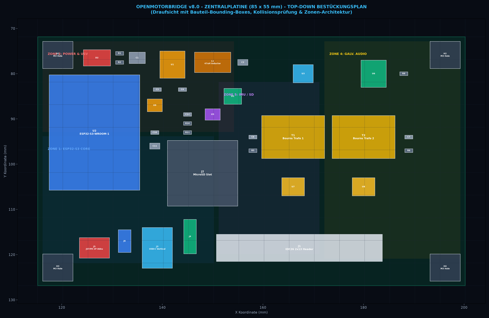
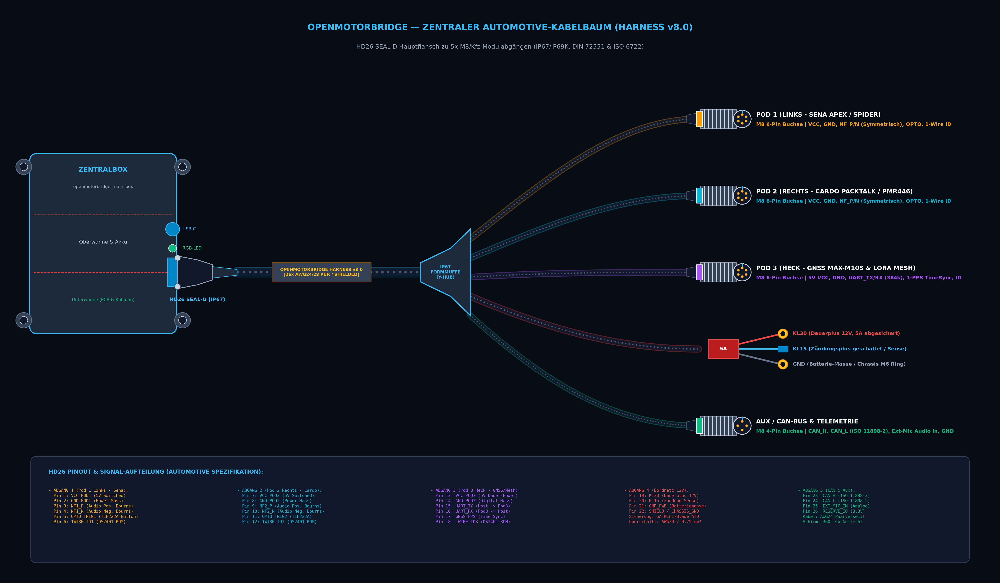

# 02 - PCB Hardware, Layout & Pinout-Spezifikation

Dieses Dokument spezifiziert das 4-Lagen-Platinenlayout der zentralen Steuerbox (`openmotorbridge_main_box`), die EMV-Zonierung, den barrierefreien 10-mm-Steckkorridor, die Schwingungsentkopplung sowie die vollständigen Pin- und GPIO-Belegungen.

---

## 1. 3D-Board-Visualisierung & Photorealistisches Render

Die Hauptplatine vereint auf kompakten **$85{,}0 \times 55{,}0\,\text{mm}$** die komplette Automotive-Stromversorgung, die unterbrechungsfreie LiPo-USV, den digitalen DSP-Host-Core sowie das galvanisch getrennte Audio-Frontend:


*Abbildung 2.1: Photorealistisches 3D-Raytracing-Render der OpenMotorBridge Zentralbox-Platine (KiCad 8.0, 4-Lagen FR4 TG150 ENIG).*

---

## 2. Platinenabmessungen, Lagenaufbau & Fertigungsspezifikation

| Parameter | Spezifikation | Norm / Fertigungsstandard |
| :--- | :--- | :--- |
| **Abmessungen** | $85{,}0\,\text{mm} \times 55{,}0\,\text{mm} \times 1{,}6\,\text{mm}$ | DIN ISO 2768-m (Toleranz $\pm 0{,}1\,\text{mm}$) |
| **Lagenanzahl** | **4 Kupferlagen** | Symmetrischer Lagenaufbau |
| **Basismaterial** | FR4 High-TG ($T_g \ge 150\,^\circ\text{C}$) | Automotive-Grade Temperaturbeständigkeit |
| **Oberflächenfinish** | **ENIG (Electroless Nickel Immersion Gold)** | Korrosionsbeständig, planare SMD-Pads |
| **Kupferstärke** | $35\,\mu\text{m}$ (1.0 oz) Außen / $35\,\mu\text{m}$ Innen | Hohe Stromtragfähigkeit für Buck & Power-Path |
| **Lötstoppmaske** | Mattschwarz (Matte Black) | Reflexionsarm, UV-beständig |
| **Bestückungsdruck** | Weiß (Crisp White High-Res) | Eindeutige Bauteil- & Steckerbeschriftung |
| **Min. Leiterbahn / Abstand** | $0{,}127\,\text{mm}$ (5 mil) / $0{,}127\,\text{mm}$ (5 mil) | JLCPCB Standard / Prototypen-kompatibel |
| **Min. Bohrung (Via)** | $0{,}30\,\text{mm}$ Bohrung / $0{,}50\,\text{mm}$ Pad | Tenting auf allen Durchkontaktierungen |

### 2.1 4-Lagen Stackup-Architektur
```
┌─────────────────────────────────────────────────────────────┐
│ Layer 1 (F.Cu - Top): High-Speed Signale, I2S, Bauteile    │  (35 µm Cu)
├─────────────────────────────────────────────────────────────┤
│ ── Prepreg 7628 (Dielektrikum, Er = 4.4, Dicke 0.2 mm) ──   │
├─────────────────────────────────────────────────────────────┤
│ Layer 2 (In1.Cu): Durchgängige Massefläche (GND_PWR / AGND) │  (35 µm Cu)
├─────────────────────────────────────────────────────────────┤
│ ── FR4 Core (Isolationskern, Dicke 1.0 mm) ──────────────   │
├─────────────────────────────────────────────────────────────┤
│ Layer 3 (In2.Cu): Power-Planes (5.0V, 3.3V, VBAT Polygone)  │  (35 µm Cu)
├─────────────────────────────────────────────────────────────┤
│ ── Prepreg 7628 (Dielektrikum, Er = 4.4, Dicke 0.2 mm) ──   │
├─────────────────────────────────────────────────────────────┤
│ Layer 4 (B.Cu - Bottom): Sekundär-Routing & Kupfer-Masse    │  (35 µm Cu)
└─────────────────────────────────────────────────────────────┘
```

---

## 3. Zonierungs-Architektur (Zero-Cross-Talk & Zero-Collision Topologie)



*Abbildung 2.1: Kollisionsfreier 2D-Top-Down-Bestückungsplan der Zentralplatine ($85 \times 55\,\text{mm}$). Farbcodierte Zonen mit $100\,\%$ Überschneidungsfreiheit (geprüfte Bounding-Boxes).*

Um gegenseitige Störungen zwischen der Schaltnetzteil-HF ($2{,}1\,\text{MHz}$), dem 2,4-GHz-Bluetooth-Funk und den hochempfindlichen analogen Audioleitungen vollständig zu eliminieren, ist die Platine in **5 strikt voneinander getrennte Funktionszonen** unterteilt:

```
┌───────────────────┬──────────────────────────┬─────────────────────────┐
│ ZONE 2: POWER &   │ ZONE 5: SENSORIK & IMU   │ ZONE 4A: AUDIO CODEC    │
│ AUTOMOTIVE USV    │ • Bosch BMI270 6-Achsen  │ • Everest ES8388 Codec  │
│ • PPTC 500mA      │ • MicroSD Ringspeicher   │ • TI TCAN334G CAN-FD    │
│ • SMBJ33CA TVS    ├──────────────────────────┼─────────────────────────┤
│ • TI LM5164 Buck  │ ZONE 3: DIGITAL CORE     │ ZONE 4B: GALV. ISOLATION│
│ • TI BQ24075 USV  │ • ESP32-S3 Dual-Core     │ • 2x Bourns Übertrager  │
│ • LC-PI-Filter    │ • 2.4 GHz PCB-Antenne    │ • 2x TLP222A PhotoMOS   │
├───────────────────┴──────────────────────────┼─────────────────────────┤
│ ZONE 1A: POWER, USB-C & STATUS-LED (LINKS)   │ ZONE 1B: SYSTEM I/O     │
│ [J5: BAT] [J6: NTC] [J3: USB-C] [J4: 3P LED] │ [J1: 26-POL IDC26]      │
└──────────────────────────────────────────────┴─────────────────────────┘
```

1. **Zone 1 (Vorderkante – 2 funktionale Stecker-Cluster):**
   * **Zone 1A (Links – Power, Service & Signalisierung):**
     * `J5`: 2-Pin JST-PH LiPo-Akkubuchse ($6{,}0 \times 4{,}5\,\text{mm}$) bei $X = 126{,}5\,\text{mm}$
     * `J6`: 2-Pin Micro-Header für NTC-Sensor ($2{,}5 \times 5{,}0\,\text{mm}$, vertikal in Y) bei $X = 132{,}5\,\text{mm}$
     * `J3`: Vertikale USB-C Service-Buchse ($6{,}0 \times 9{,}0\,\text{mm}$, $90^\circ$ gedreht) bei $X = 139{,}0\,\text{mm}$
     * `J4`: 3-Pin RGB-LED-Anschluss ($2{,}5 \times 7{,}6\,\text{mm}$, vertikal in Y) bei $X = 145{,}5\,\text{mm}$ ($4{,}5\,\text{mm}$ Luft zur 26-Pin-Leiste `J1`)
   * **Zone 1B (Rechts – Galvanischer System-Hauptanschluss):**
     * `J1`: 2x13 Pin IDC26 Wannenstecker ($33{,}0 \times 6{,}0\,\text{mm}$, horizontal in X) – Pin 1 bei $X = 152{,}0\,\text{mm}$, Gehäuse erstreckt sich von $X = 152{,}0$ bis $X = 185{,}0\,\text{mm}$ direkt unter `T1`/`T2` und `U7`/`U8`.
   * **10-mm-Einführkorridor:** Barrierefreier Steckzugang für alle Stecker ohne gegenseitige Behinderung.
2. **Zone 2 (Linke Flanke oben – Automotive Power & USV):**
   * Nimmt die raue Bordnetzspannung von KL30/KL15 auf. Enthält die Bourns PPTC-Sicherung, die SMBJ33CA TVS-Diode, den Verpolschutz-MOSFET, das $10\,\mu\text{H}$ PI-Filter sowie den TI LM5164-Q1 Step-Down-Regler und das BQ24075 USV-Lademanagement.
3. **Zone 3 (Linke Flanke unten – Digitaler Host-Core):**
   * Beherbergt das ESP32-S3-WROOM-1 Modul (240 MHz Dual-Core), **nach unten versetzt** für großzügigen Freiraum zur oberen Spannungsversorgung. Die PCB-Mäanderantenne ragt über die linke untere Kante hinaus; darunterliegende Kupferflächen sind auf allen 4 Lagen vollständig ausgespart.
4. **Zone 4 (Rechte Flanke – Audio-Frontend, Codec & Galvanische Trennung):**
   * **Optimierte Vertikal- & Quer-Staffelung (Nach rechts und unten versetzt):**
     * **Zone 4A (Oben rechts):** Der Everest ES8388 Audio-Codec (`U3`) und der TI TCAN334G CAN-Transceiver (`U6`) sitzen im oberen rechten Quadranten. Dies garantiert ultrakurze $I^2S$-Takt- und Datenleitungen ($< 15\,\text{mm}$) mit minimalem Jitter und ohne HF-Abstrahlung.
     * **Zone 4B (Rechtsflanke unten):** Die beiden schweren Bourns LM-NP-1001-B1L Übertrager (`T1`, `T2`) sowie die beiden Toshiba TLP222A PhotoMOS-Optokoppler (`U7`, `U8`) sind **nach rechts an die Außenkante und nach unten** direkt über den 2x13 Wannenstecker `J1` versetzt.
   * **Signalintegrität:** Die galvanisch getrennten, symmetrischen Audiosignale (`NF1_P/N`, `NF2_P/N`, $1500\,\text{V}_{\text{RMS}}$ Isolation) und Tasten-Triggersignale führen kreuzungsfrei auf kürzestem Weg direkt auf `J1`. Die analoge Masse `AGND` ist über einen $100\,\mu\text{m}$ Isolationsgraben von der Powermasse `GND_PWR` getrennt.
5. **Zone 5 (Zentrum – IMU Fahrdynamiksensorik & MicroSD):**
   * Der Bosch BMI270 6-Achsen-Sensor sitzt im Schwerpunkt der Platine zur minimierten Hebelarmdrift.

---

## 4. Mechanische Montage & Schwingungsentkopplung

* **4× Eckbohrungen ($\varnothing\,3{,}2\,\text{mm}$ für M3-Schrauben):**
  * Positioniert bei $(4{,}0\,\text{mm}, 4{,}0\,\text{mm})$, $(81{,}0\,\text{mm}, 4{,}0\,\text{mm})$, $(4{,}0\,\text{mm}, 51{,}0\,\text{mm})$ und $(81{,}0\,\text{mm}, 51{,}0\,\text{mm})$.
  * **$6{,}0\,\text{mm}$ kreisrunde Sperrflächen (Keep-Out):** Garantiert Platz für **Shore 50A Silikon-Dämpfungsringe**, die Motorvibrationen ($50\dots 500\,\text{Hz}$, bis zu $20\,\text{g}$) absorbieren und die Lötstellen vor Dauerwechselbelastung schützen.

---

### 5.1 Zentraler HD26-Kabelbaum & M8-Breakout-Pigtail



*Abbildung 2.2: Technische Skizze des zentralen Automotive-Kabelbaums (Harness v8.0). Links: Zentralbox mit HD26 SEAL-D Flansch; Mitte: 26-poliger Hauptstamm mit IP67-Formmuffe; Rechts: 5 Modulabgänge zu Pod 1 (Sena), Pod 2 (Cardo), Pod 3 (Heck GNSS/LoRa), Bordnetz (12V KL30/KL15) und CAN/Aux-Telemetrie.*

Die zentrale 26-Pin-Schnittstelle der Steuerbox teilt sich über eine hochflexible, flammhemmende Kfz-Kabelbaumpeitsche (Pigtail Breakout) in **5 standardisierte, wasserdichte M8-Buchsen** auf:

```
                                  ┌───────────────────────────────┐
                                  │ ZENTRALBOX HD26 / IDC26 PORT  │
                                  └───────────────┬───────────────┘
                                                  │ (26-polig gebündelt)
                                                  ▼
                         ┌─────────────────────────────────────────────────┐
                         │ AUTOMOTIVE BREAKOUT-PIGTAIL (Formverpresst IP67)│
                         └──────┬──────────┬──────────┬──────────┬─────────┘
                                │          │          │          │
           ┌────────────────────┘          │          │          └────────────────────┐
           ▼                               ▼          ▼                               ▼
    ┌──────────────┐                ┌──────────────┐ ┌──────────────┐          ┌──────────────┐
    │ BUCHSE 1:    │                │ BUCHSE 2:    │ │ BUCHSE 3:    │          │ BUCHSE 4:    │
    │ POD 1 LINKS  │                │ POD 2 RECHTS │ │ POD 3 HECK   │          │ BORDNETZ     │
    │ (M8 6-Pin)   │                │ (M8 6-Pin)   │ │ (M8 6-Pin)   │          │ (M8 4-Pin)   │
    │ • Pins 1..6  │                │ • Pins 7..12 │ │ • Pins 13..18│          │ • KL30, KL15 │
    │ • Audio Sena │                │ • Audio Cardo│ │ • GNSS / OMM │          │ • GND, Schirm│
    └──────────────┘                └──────────────┘ └──────────────┘          └──────────────┘
                                                                                      │
                                                                                      ▼
                                                                               ┌──────────────┐
                                                                               │ BUCHSE 5:    │
                                                                               │ TELEMETRIE   │
                                                                               │ (M8 4-Pin)   │
                                                                               │ • CAN_H/L    │
                                                                               │ • Mic-In     │
                                                                               │ • Reserve    │
                                                                               └──────────────┘
```

* **Modulares Verlegekonzept:** Für die 3 Pods werden handelsübliche **M8 6-Pin Stecker-zu-Stecker PUR-Kabel** verwendet. Am Motorrad muss kein starrer Gesamtbaum mehr verlegt werden, sondern einzelne, schlanke Kabel.
* **Servicefreundlichkeit:** Tritt an einem Kabel oder Stecker ein mechanischer Defekt auf, wird lediglich das betroffene M8-Kabel in Minuten werkzeuglos getauscht.

---

## 6. GPIO-Mapping ESP32-S3

| GPIO | Signalname | Richtung | Funktion & Angeschlossene Peripherie |
| :--- | :--- | :---: | :--- |
| **GPIO 1** | `ADC_BAT` | Input (ADC) | Messung USV-Akkuspannung via Teiler 1:2 (TI BQ24075) |
| **GPIO 2** | `POD1_1WIRE_ID`| Bidir (OD) | 1-Wire Bus zur Erkennung der Kassette an Port 1 (DS2401) |
| **GPIO 3** | `ADC_LINE_LVL` | Input (ADC) | NF-Pegelerkennung (Audio-Sense & Quittungston-Check) |
| **GPIO 4** | `ADC_VIGN` | Input (ADC) | Bordnetzüberwachung Zündung KL15 via Präzisionsteiler 1:11 |
| **GPIO 5** | `PORT1_KEY` | Output | Optokoppler TLP222A Trigger Port 1 (Sena Intercom Toggle) |
| **GPIO 6** | `PORT1_VCC_EN` | Output | High-Side MOSFET Port 1 Speisespannung (Power-Gating) |
| **GPIO 7** | `PORT2_KEY` | Output | Optokoppler TLP222A Trigger Port 2 (Cardo Channel Next) |
| **GPIO 8** | `PORT2_VCC_EN` | Output | High-Side MOSFET Port 2 Speisespannung (Power-Gating) |
| **GPIO 9** | `I2S_MCLK` | Output | Master Clock für Everest ES8388 Audio Codec (12.288 MHz) |
| **GPIO 10** | `I2S_BCLK` | Output | Bit Clock Audio (3.072 MHz) |
| **GPIO 11** | `I2S_WS` | Output | Word Select / LRCLK (48 kHz) |
| **GPIO 12** | `I2S_DOUT` | Output | Audio Data Out (DSP zum ES8388 DAC) |
| **GPIO 13** | `I2S_DIN` | Input | Audio Data In (Vom ES8388 ADC zum DSP) |
| **GPIO 14** | `I2C_SDA` | Bidir (OD) | I2C Datenbus (Bosch BMI270 IMU & ES8388 Konfiguration) |
| **GPIO 15** | `I2C_SCL` | Output | I2C Takt (400 kHz Fast-Mode) |
| **GPIO 16** | `CHG_STAT_N` | Input | Ladezustands-Rückmeldung BQ24075 (Low = Laden aktiv) |
| **GPIO 17** | `GNSS_RX` | Input (UART) | u-blox MAX-M10S UART RX (vom Heck-Pod 3 Co-Prozessor) |
| **GPIO 18** | `GNSS_TX` | Output (UART)| u-blox MAX-M10S UART TX (zum Heck-Pod 3 Co-Prozessor) |
| **GPIO 19** | `CAN_TX` | Output (TWAI)| TWAI / CAN-Bus Sendedaten zum TI TCAN334G |
| **GPIO 20** | `CAN_RX` | Input (TWAI) | TWAI / CAN-Bus Empfangsdaten vom TI TCAN334G |
| **GPIO 21** | `GNSS_PPS` | Input (IRQ) | 1-PPS Hardware-Zeitnormal (Jitter < 1 µs) |
| **GPIO 22** | `POD2_1WIRE_ID`| Bidir (OD) | 1-Wire Bus zur Erkennung der Kassette an Port 2 (DS2401) |
| **GPIO 38** | `RESERVE_A` | Input/Output| Externer Multifunktions-I/O Pin A (HD26 Pin 25) |
| **GPIO 39** | `RESERVE_B` | Output | Externer Multifunktions-I/O Pin B (HD26 Pin 26) |
| **GPIO 48** | `STATUS_LED` | Output | WS2812B RGB Statusanzeige (Gehäusedeckel) |
