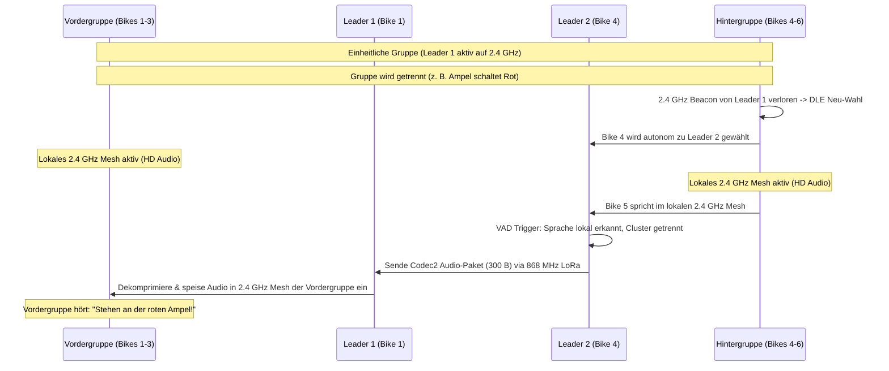

# 04 - Funk-Mesh (IEEE 802.15.4), LoRa 868MHz & Koppelnavigation (GNSS/ADR)

Dieses Dokument spezifiziert die Dual-PHY Funk-Mesh-Architektur des **OpenMotorMesh (OMM)**, den dynamischen Leader-Wahl-Algorithmus (**Dynamic Leader Election - DLE**), die Sub-Mesh-Relay-Funktion sowie die hochpräzise Koppelnavigation (**Automotive Dead Reckoning - ADR**) mit Sensorfusion und Actioncam-Zeitsynchronisation.

---

## 1. Dual-PHY Architektur: 2.4 GHz Proximity & 868 MHz LoRa Backbone

OpenMotorMesh kombiniert zwei komplementäre Funkschnittstellen, um sowohl HiFi-Sprachübertragung im Nahbereich als auch ausfallsicheren Kolonnenfunk über viele Kilometer zu gewährleisten:

```
┌─────────────────────────────────────────────────────────────────────────────┐
│                    DUAL-PHY HIERARCHIE IN OPENMOTORBRIDGE                   │
├──────────────────────────────────────┬──────────────────────────────────────┤
│ 1. NAHBEREICH: 2.4 GHz Proximity     │ 2. WEITBEREICH: 868 MHz LoRa         │
│ (Intra-Cluster / Intercoms & OMM)    │ (Zentralbox PCBA 01 / 1 - 15 km)     │
├──────────────────────────────────────┼──────────────────────────────────────┤
│ • Vollduplex-Audio (Sena/Cardo/OMM)  │ • Semtech SX1262 LoRa (+22 dBm PA)   │
│ • Stereo Music-Sharing & Navi-Ducking│ • Schmalband PTT-Sprache (Codec2)    │
│ • Dedizierte HF-Flanken Pod 1 & 2    │ • Taktisches 25-Byte GPS-Gruppenradar│
│ • 100 % Duty-Cycle erlaubt           │ • ETSI 1 % / 10 % Duty-Cycle konform │
└──────────────────────────────────────┴──────────────────────────────────────┘
```

### 1.1 2.4-GHz Proximity High-Speed PHY (SC-FDMA TDMA / Intercom-Bridges)
* **Superframe (10 ms):** Unterteilt in 10 Subframes à 1 ms (Slotted TDMA) angelehnt an LTE-V2X Sidelink bei Nutzung der OMM 2.4 GHz Wechselkassette.
* **Synchronisation:** Der Cluster Leader sendet alle 100 ms ein primäres Synchronisationssignal (SLSS), auf das sich alle Gruppenmitglieder einrasten.
* **Kontrollkanal (PSCCH-Light):** In Subframe 0 werden Sprecherankündigungen und Zeitschlitz-Zuweisungen übertragen.
* **Kollisionsfreier Sprachkanal (PSSCH-Light):** Subframes 1–9 transportieren komprimierte Opus-Audio-Pakete ohne Kanalüberbuchung oder Jitter.

### 1.2 868-MHz Sub-GHz Long-Range PHY (SX1262 LoRa auf Zentralbox PCBA 01)
* **Frequenzband:** 868.0 – 868.6 MHz (EU ISM, bis zu +22 dBm Sendeleistung, interne Taoglas FXP895 Flexantenne im Zentralbox-Deckel).
* **Ausfallsicherung:** Reißt die 2,4-GHz-Intercomverbindung in Pässen, Kehren oder Kolonnensplits für $> 5\,\text{s}$ ab, schaltet OMB automatisch auf die LoRa Fallback Engine um.
* **Sprachübertragung:** Schmalband-Sprachtunnel via Codec2 (1200 bps) für taktische Notfall-PTT-Sprachbursts (3 s Sprache in 450 Bytes, ~120 ms Airtime).
* **Taktisches Gruppenradar:** 25-Byte GPS-Kompaktpaket (15 ms Airtime, 100 % ETSI 1 % konform) mit Positions- und Statusdaten im 5-Sekunden-Intervall.

### 1.3 Universelle, störungsfreie HF-Architektur & Spektrums-Entflechtung
Das System entflechtet alle Funkbänder ohne gegenseitige Beeinflussung (De-Sensing):
* **6.489 GHz (UWB Kanal 5):** Fahrzeug-Backbone zwischen Front Node (PCBA 05) und Zentralbox (PCBA 01) über Qorvo DW3110 ($< 0{,}4\,\text{ms}$ Latenz, keine Duty-Cycle-Beschränkung nach ETSI EN 302 065-3). Taoglas FXUWB10 Flexantennen in Gehäuseboden-Taschen ($11 \times 11 \times 0{,}6\,\text{mm}$) sorgen für durchgehende Masseflächen und kabelfreies Öffnen des Deckels.
* **868 MHz LoRa (Zentralbox PCBA 01):** Direkt auf der Zentralbox integriert und über die USV-Batterieschiene versorgt. Gewährleistet 24/7 Sentry-Diebstahlüberwachung und Notfall-Fallback mit der im Gehäusedeckel integrierten Taoglas FXP895 Flexantenne.
* **Multi-GNSS & Cockpit-Sensorik (Front Node PCBA 05):** u-blox SAM-M10Q (mit integrierter $15 \times 15\,\text{mm}$ Patchantenne), TI TMP117 ($\pm 0{,}1\,^\circ\text{C}$ Temperatur) und TI OPT3001 (Licht) im laminaren Fahrtwind-Einlass über Qwiic-Port `J12` angebunden.
* **2.4 GHz:** Ausschließlich für externe Audioverbindungen zu den Fahrerhelmen (Pod 1 Sena SPIDER X Slim, Pod 2 Cardo Packtalk Edge) und Smartphone-BLE reserviert. OMM 2.4 GHz fungiert als optionale Wechselkassette in Pod 1 oder Pod 2 (niemals im selben Pod mit Sena/Cardo ko-lokiert).

---

## 2. Layer 2: 802.11s-Light Loop-Prevention & Managed Forwarding

OpenMotorMesh implementiert Routing- und Schleifenschutz-Mechanismen aus IEEE 802.11s direkt auf Layer 2:

```
 0                   1                   2                   3
 0 1 2 3 4 5 6 7 8 9 0 1 2 3 4 5 6 7 8 9 0 1 2 3 4 5 6 7 8 9 0 1
+-+-+-+-+-+-+-+-+-+-+-+-+-+-+-+-+-+-+-+-+-+-+-+-+-+-+-+-+-+-+-+-+
| Mesh Control  |   Hop Limit   |     Mesh Sequence Number      |
+-+-+-+-+-+-+-+-+-+-+-+-+-+-+-+-+-+-+-+-+-+-+-+-+-+-+-+-+-+-+-+-+
|                     Originator Node MAC                       |
|                       (Bytes 0..3)                            |
+-+-+-+-+-+-+-+-+-+-+-+-+-+-+-+-+-+-+-+-+-+-+-+-+-+-+-+-+-+-+-+-+
|  Originator MAC (4..5)        |      Target Node MAC (0..1)   |
+-+-+-+-+-+-+-+-+-+-+-+-+-+-+-+-+-+-+-+-+-+-+-+-+-+-+-+-+-+-+-+-+
|                      Target MAC (2..5)                        |
+-+-+-+-+-+-+-+-+-+-+-+-+-+-+-+-+-+-+-+-+-+-+-+-+-+-+-+-+-+-+-+-+
| Payload: 6LoWPAN / IPv6 Multicast / RTP / Opus Audio ...      |
```

* **Hop Limit (TTL):** Wird bei jedem Relais-Hop dekrementiert ($T_{\text{max}} = 5$).
* **Sequence-Cache:** Jeder Knoten speichert die letzten 64 Sequence-Numbers empfangener Pakete; Duplikate werden in Hardware sofort verworfen.

### 2.1 Layer-2 Frame-Header C++ Struct & Duplicate Filter
```cpp
struct MeshHeader_t {
    uint8_t  meshFlags;     // Priority & Type Flags (Bit 0..2: Prio, Bit 3..7: Type)
    uint8_t  hopLimit;      // TTL Dekrement pro Hop (Loop-Schutz, Default = 5)
    uint16_t meshSeqNum;    // Fortlaufende ID des Senders
    uint8_t  originMac[6];  // Erzeuger-Node MAC (aus DS2401 UID abgeleitet)
    uint8_t  targetMac[6];  // Multicast (ff:ff:...) oder Unicast Node MAC
} __attribute__((packed));

void onRawPacketReceived(uint8_t* rawData, size_t len) {
    if (len < sizeof(MeshHeader_t)) return;
    
    MeshHeader_t* meshHdr = (MeshHeader_t*)rawData;
    uint8_t* payload = rawData + sizeof(MeshHeader_t);
    size_t payloadLen = len - sizeof(MeshHeader_t);

    // 1. Layer-2 Loop & Duplicate Filter
    if (meshHdr->hopLimit == 0) return;
    if (checkAndRegisterL2Duplicate(meshHdr->originMac, meshHdr->meshSeqNum)) {
        return; // Duplikat verworfen -> Spart CPU- und DMA-Last
    }

    // 2. Lokale Verarbeitung (Audio Playout oder Radar-Dekodierung)
    processL3Payload(payload, payloadLen);

    // 3. Managed Forwarding: Weiterleitung wenn wir Relay-Master sind
    if (currentRideMode == MODE_RELAY_AR) {
        meshHdr->hopLimit--;
        broadcastForward(rawData, len);
    }
}
```

---

## 3. Layer 3 & 4: 6LoWPAN, IPv6 Multicast & Audio-Streaming

* **Multicast-Routing:** Sprachdaten werden via IPv6-Multicast an Gruppen-Adressen (z. B. `ff02::1`) gesendet. Ein einziges Paket erreicht alle Gruppen-Teilnehmer ohne ressourcenfressende Unicast-Duplikation.
* **Header-Kompression (6LoWPAN nach RFC 6282):** Komprimiert den 40-Byte IPv6-Header auf 2 bis 4 Bytes für minimale Funk-Overheads.
* **Autonome Adressierung (SLAAC):** Jeder Node generiert seine eigene Link-Local-Adresse (`fe80::/64`) autonom aus der 64-Bit DS2401 Chip-UID.

---

## 4. Dynamic Leader Election (DLE) Algorithmus

Das Mesh wählt vollautomatisch und autonom den optimalen Gateway-Knoten der Gruppe. Innerhalb jeder Funkzelle wird autonom genau ein zentraler Gateway-Master (Cluster Head) gewählt:

$$\text{Score}_{\text{DLE}} = S_{\text{HW}} + S_{\text{PWR}} + S_{\text{GNSS}} + S_{\text{LORA}} + S_{\text{UPTIME}} + S_{\text{MIC}}$$

| Parameter | Bedingung | Punkte |
| :--- | :--- | :---: |
| **S_HW (Hardware Tier)** | Sena Apex (Mesh 3.0) ODER Cardo Edge (DMC Gen2) gesteckt | **+60 Pkt.** |
| | Sena Legacy / Cardo DMC Gen1 gesteckt | +30 Pkt. |
| **S_PWR (Stromversorgung)** | Zündung aktiv (KL15 > 12.5 V via LM5164) | **+20 Pkt.** |
| | Pufferbetrieb (USV-Akku > 3.8 V) | +5 Pkt. |
| **S_GNSS (Positionsstabilität)**| 3D Fix mit PDOP < 1.5 & 1-PPS Lock | **+10 Pkt.** |
| **S_LORA (Link-Qualität)** | Durchschnittlicher Nachbar-RSSI > -85 dBm | **+10 Pkt.** |
| **S_MIC (Akustik-Sensor)** | IP67 Front Ambient-Mikrofon aktiv (`FEAT_ENV_MIC`) | **+5 Pkt.** |
| **S_UPTIME (Hysterese-Schutz)** | Bereits aktiver Leader (verhindert Flattern) | **+15 Pkt.** |

### 4.1 Node Capability Vector & Smarte Kolonnen-Funktionen
Im periodischen DLE-Beacon kündigt jeder Knoten seine Ausstattungsmerkmale an:

```cpp
enum OmmFeatureBits : uint8_t {
    FEAT_DUAL_MESH_BRIDGE  = (1 << 0), // Sena + Cardo aktiv (+60 Pkt)
    FEAT_LORA_HIGH_POWER   = (1 << 1), // SX1262 +22 dBm PA
    FEAT_GNSS_1PPS_LOCK    = (1 << 2), // Zeitnormal-Master
    FEAT_CAN_TELEMETRY     = (1 << 3), // OBD2 / CAN-Bus aktiv
    FEAT_ENV_MIC_ACTIVE    = (1 << 4), // Front Ambient-Mikrofon aktiv (+5 Pkt)
    FEAT_USV_BAT_BUFFER    = (1 << 5)  // USV Pufferbetrieb möglich
};
```

1. **🚨 Kolonnen-Sirenen-Frühwarnung (Siren Early Warning):**
   * Erkennt das Frontmikrofon des Führungs-Bikes an einer Kreuzung ein Martinshorn ($350\dots 1000\,\text{Hz}$ Frequenzwechsel eines herannahenden Einsatzfahrzeugs), sendet der Node ein `ALERT_SIREN_APPROACHING`-Paket an die gesamte Kolonne.
   * Alle nachfolgenden Fahrer erhalten einen Warnton im Helm, bevor die Sirene für sie direkt hörbar ist.
2. **🎙️ Guide Pass-Through (Maut-/Grenzkontroll-Kanal):**
   * Der Leader kann bei Stillstand an Mautstellen oder Grenzen sein geregeltes Frontmikrofon per Tastendruck für 10 Sekunden ins Gruppen-Mesh schalten, um Anweisungen des Personals für alle hörbar zu machen.

### 4.2 Adaptive Tiered QoS (Stufenweises Bandbreiten- & Reichweiten-Modell)
Um Verbindungsabrisse im Keim zu ersticken, greift ein 3-stufiges Kaskaden-Modell:
1. **Stufe 1 - Nahbereich (< 500 m, 2.4 GHz):** Full-Duplex HD-Voice, A2DP Music-Sharing und Navi-Ducking aktiv. LoRa sendet im Hintergrund Pings (Duty-Cycle $< 0{,}1\,\%$).
2. **Stufe 2 - Randbereich (500 m - 1.2 km):** Bei sinkendem Link-Quality-Index wird Music-Sharing automatisch pausiert, um die volle Kanalbandbreite der Sprache zu widmen.
3. **Stufe 3 - Weitbereich / Abgerissen (1 km - 15 km, 868 MHz LoRa):**
   * Music-Sharing: AUS.
   * GPS-Gruppenradar & Telemetrie: 100 % aktiv auf dem Dashboard.
   * Sprache: Automatischer Fallback auf Codec2 (1200 bps PTT-Funk).

### 4.3 Cluster Partitioning & Inter-Cluster Gateway Relay (LTE-Sidelink Adaption)
Wird eine Gruppe durch äußere Einflüsse (rote Ampel, Bahnübergang, Passkuppe) getrennt, greift die automatische Cluster-Teilung:



1. **Autonome Sub-Leader Wahl:** Die Hintergruppe erkennt den Verlust des primären Leaders (Beacon-Timeout $> 500\,\text{ms}$) und wählt sofort Bike 4 zum lokalen Leader 2.
2. **Lokale HD-Sprache bleibt aktiv:** Innerhalb beider Teilgruppen läuft das 2.4-GHz-Mesh ununterbrochen weiter.
3. **LoRa Cross-Gateway Voice Tunnel:** Sprudelt in einer Teilgruppe Sprache auf, encodiert der lokale Leader diese in Codec2 (1200 bps) und sendet sie über 868 MHz LoRa an den entfernten Leader, welcher sie lokal wieder einspeist.
4. **Cluster-Fusion (Re-Merge):** Sobald die Hintergruppe aufschließt ($< 400\,\text{m}$), erkennt Leader 2 den primären Leader 1, tritt in den Normalmodus zurück und schließt den LoRa-Tunnel.

### 4.4 OpenMotorMesh Paketformate & Binärspezifikation
Alle OMM-Pakete nutzen ein kompaktes, byteweise gepacktes Binärformat:

#### Kompaktes 16-Byte Gruppenradar-Telemetriepaket (`TYPE_RADAR = 0x03`)
```cpp
struct __attribute__((packed)) OmmRadarPacket_t {
    uint8_t  packet_type;       // 0x03 = TYPE_RADAR
    uint8_t  node_id_short;     // Untere 8-Bit der DS2401 ID
    int32_t  latitude_1e7;      // Breitengrad * 10.000.000
    int32_t  longitude_1e7;     // Längengrad * 10.000.000
    int16_t  altitude_m;        // Höhe über Meer (-500 .. +8000 m)
    uint8_t  speed_kmh;         // 0 .. 255 km/h
    uint8_t  heading_div2;      // Kurs / 2 (0..179 entspricht 0..358 Grad)
    int8_t   lean_angle_deg;    // Schräglage (-60..+60 Grad)
    uint8_t  status_flags;      // Bit 0: 1-PPS Lock, Bit 1: KL15, Bit 2..7: Batt%
};
```

#### Notfall- & Sirenen-Frühwarnpaket (`TYPE_EMERGENCY = 0xFF`)
```cpp
struct __attribute__((packed)) OmmEmergencyAlert_t {
    uint8_t  packet_type;       // 0xFF = TYPE_EMERGENCY
    uint8_t  alert_subtype;     // 0x01: Martinshorn/Sirene, 0x02: Sturzerkennung (eCall)
    uint64_t sender_uid;        // 64-Bit Chip UID des erzeugenden Bikes
    int32_t  event_lat_1e7;     // GPS-Koordinaten des Notfall-Events
    int32_t  event_lon_1e7;
    uint16_t alert_duration_ms; // Gültigkeitsdauer des Alarms (z. B. 10.000 ms)
    uint8_t  crc8_checksum;     // CRC-8/AUTOSAR Prüfsumme
};
```

#### Bike-Alarm & Smart-Keyfob Notrufpaket (`TYPE_BIKE_ALARM = 0xFE`)
Das Diebstahl- und Sabotagepaket wird bei Erschütterung im Parkmodus, Kofferöffnung oder Kassettenhebeln über SX1262 LoRa 868 MHz (SF11, +22 dBm) mit bis zu 4,5 km Reichweite direkt an den 2-in-1 Smart-Keyfob des Fahrers gesendet.

```cpp
struct __attribute__((packed)) OmmBikeAlarmAlert_t {
    uint8_t  packet_type;       // 0xFE = TYPE_BIKE_ALARM
    uint8_t  alarm_source;      // 0x01: OEM BCM Alarm, 0x02: IMU Erschütterung, 0x03: Kassettenhebeln, 0x04: Test-Alarm
    uint32_t msg_seq;           // Monoton steigender 32-Bit Nonce (Anti-Replay Schutz)
    uint64_t bike_uid;          // 64-Bit Chip UID des betroffenen Motorrads
    int32_t  park_lat_1e7;      // Letzter bekannter GPS-Parkstandort
    int32_t  park_lon_1e7;
    uint8_t  battery_soc_pct;   // Ladezustand der internen USV-Zelle (0..100 %)
    uint8_t  flags;             // Bit 0: Buddy-Mesh-Relay (an Gruppenmitglieder weiterleiten)
    uint8_t  auth_tag[4];       // 32-Bit Authentifizierungs-Tag (AES-128 GCM keyed)
    uint8_t  crc8_checksum;     // CRC-8/AUTOSAR Prüfsumme
};
```

##### Sicherheits- & Entriegelungskonzept (Smart-Keyfob Token):
1. **AES-128 GCM Verschlüsselung & Anti-Replay:**
   * Jeder Smart-Keyfob wird beim ersten Pairing mit einem 128-Bit Pre-Shared Key (PSK) versehen, der sicher im NVS des ESP32-S3 und des Keyfob-Controllers abgelegt ist.
   * Der monoton steigende `msg_seq` Zähler verhindert Replay-Angriffe durch Funkaufzeichnung.
2. **Zero-False-Alarm bei Kassettenentnahme:**
   * Entnimmt der Fahrer eine Wechselkassette mit dem 2-in-1 Smart-Keyfob, registriert die Zentralbox gleichzeitig die unmittelbare BLE-Nahfeldpräsenz des Keyfobs ($d < 1{,}5\,\text{m}$, $\text{RSSI} > -60\,\text{dBm}$).
   * Das Öffnen der Kassettenwippe wird als legitim erkannt $\rightarrow$ **kein Fehlalarm**.
   * Wird die Wippe ohne anwesenden Keyfob aufgehebelt, wird sofort ein Prioritäts-Notruf `0xFE` mit `alarm_source = 0x03` ausgelöst.
3. **Buddy-Alarm (Gruppen-Mesh Weiterleitung):**
   * Ist das Flag `flags & 0x01` gesetzt, empfangen und quittieren auch benachbarte Motorräder der OMM-Gruppe den Alarm und leiten ihn weiter, falls sich der Fahrer weiter vom Parkplatz entfernt hat.

---

## 5. Universal Group-Split LoRa Fallback Engine & OMM 2.4 GHz Swap Cartridge

OpenMotorBridge löst das kritische Problem des Abreißens von Gruppenverbindungen bei Kolonnenfahrten im Gebirge durch eine autarke, mehrstufige Fallback-Engine:

### 5.1 Automatische Umschalt-Hierarchie (Group-Split Rescue Engine)
1. **Verbindungsüberwachung (Heartbeat):**
   * Die Zentralbox überwacht kontinuierlich den Status der primären Intercom-Verbindungen (Pod 1 Sena, Pod 2 Cardo oder OMM).
   * Reißt die Funkverbindung zu einem Gruppenmitglied für **$> 5{,}0\,\text{s}$** ab (z. B. durch Abbiegen hinter eine Felswand oder Motorstopp), triggert OMB sofort Stufe 1:
2. **Stufe 1 – Taktischer 25-Byte GPS-Kompakt-Ping (LoRa 868 MHz):**
   * Sendet ein hochkomprimiertes Not-Telemetriepaket mit 25 Bytes Nutzlast (Airtime nur **$\approx 15\,\text{ms}$**, 100 % konform mit der ETSI 1 % Duty-Cycle-Vorgabe).
   * Inhalt: Node-ID, präzise GPS-Koordinaten (SAM-M10Q), Geschwindigkeit, Kurs, Batteriestatus und Stop-Flag.
3. **Stufe 2 – Akustische Text-to-Speech (TTS) Helm-Durchsage:**
   * Die Zentralbox der verbleibenden Gruppenmitglieder generiert sofort eine glasklare Sprachansage direkt ins Headset des Tourguides und der Gruppe:
     > *„🚨 Achtung: Lukas 1,4 km zurückgefallen, Fahrzeug steht.“*
   * Zero-Distraction: Der Tourguide muss weder anhalten noch auf ein Display starren.
4. **Stufe 3 – Taktischer PTT-Sprachburst via Codec2 (1200 bps):**
   * Benötigt der zurückgefallene Fahrer Hilfe, drückt er die Lenker-PTT:
   * OpenMotorBridge komprimiert eine **3-sekündige Sprachnachricht** mit dem Ultra-Low-Bitrate-Sprachcodec **Codec2 (1200 bps)** in lediglich **450 Bytes**.
   * Die Übertragung erfolgt über LoRa 868 MHz in nur **$\approx 120\,\text{ms}$ Airtime** – legal, robust und über Distanzen von $1\dots 15\,\text{km}$ durch Gebirgstäler hindurch!

### 5.2 OMM 2.4 GHz als optionale Wechselkassette (Pod 1 / Pod 2)
* Bei reinen OpenMotorMesh-Fahrten oder Begleitfahrzeug-Konvois (Modus B) kann anstelle eines Sena/Cardo-Adapters die **OMM 2.4 GHz Kassette** (PCBA 03 Variante mit ESP32-C3 / CH32V003 ID `0x03`) eingesteckt werden.
* Sie wird über die symmetrische Trägerplatine PCBA 02 mit Strom und Audio versorgt und niemals im selben Pod mit Sena/Cardo ko-lokiert.

### 5.3 Architekturentscheidung: Warum dezentrales LoRa-Mesh statt Mobilfunk (LTE-M / Cloud)?

Klassische Telematiksysteme setzen auf Mobilfunkmodems (LTE-M / NB-IoT) mit zentralen Cloud-Servern. Für Motorrad-Gruppenfahrten wurde dieser Ansatz nach eingehender Evaluierung bewusst verworfen:

| Kriterium | Zentraler Cloud-Ansatz (LTE-M / NB-IoT) | OpenMotorBridge Dezentral (UWB + 868 MHz LoRa) |
| :--- | :--- | :--- |
| **Verfügbarkeit in Gebirgsregionen** | **Häufig 0 %** (Funklöcher in Alpenpässen, Tälern, Wäldern) | **100 % Autark** (Direkte Fahrzeug-zu-Fahrzeug Peer-to-Peer-Verbindung) |
| **Laufende Kosten** | SIM-Karten-Gebühren, monatliche Cloud-Abos | **Dauerhaft 0 €** (Lizenzfreies ISM-Band, keine laufenden Kosten) |
| **Datenschutz & Privatsphäre** | Bewegungsprofile liegen auf fremden Servern | **100 % DSGVO-konform** (Lokaler Speicher, keine externen Datenspuren) |
| **Audio-Latenz für Notrufe** | 400–1500 ms (über Server & Mobilfunkzelle) | **< 35 ms** (Direkte LoRa-Transceiver-Übertragung) |
| **System-Autonomie** | Totalschaden bei Serverabschaltung oder Insolvenz | **Lebenslang funktionsfähig** (Vollständig dezentraler Open-Source Stack) |

---

## 6. Automotive Dead Reckoning (ADR) & Sensorfusion

Das GNSS-Subsystem im Front Node (**u-blox SAM-M10Q** an `J12` im Fahrtwind-Einlass) ist mit der 6-Achsen-IMU (**Bosch BMI270**) und den Fahrzeug-Raddrehzahlen über einen **15-State Error-State Kalman-Filter (ES-EKF)** gekoppelt:

```
[ u-blox SAM-M10Q GNSS (10 Hz) ] ──(I2C / UWB)──────┐
[ CAN-Bus Raddrehzahl / Speed ] ────(10-20 Hz)───────┼─► [ 15-State Extended Kalman Filter ] ──► [ MicroSD: tour.gpx ]
[ Bosch BMI270 Gyro / Accel (I2C) ] ─(50-100 Hz)─────┘        (Dead Reckoning Engine)            (Mit Schräglage & G-Force)
```

### 4.1 Tunnel- und Schlucht-Navigation
* Fällt das Satellitensignal in Tunneln oder Gebirgsschluchten aus, integriert der Kalman-Filter Raddrehzahl und Gyroskop-Winkelgeschwindigkeiten kontinuierlich weiter.
* Der Track läuft ohne Positions-Einfrieren oder Zick-Zack-Muster absolut präzise auf der Fahrbahnlinie.

### 4.2 MotoGP-Style Telemetrie im GPX 2.0 Format
Jeder Wegpunkt speichert die vollständige Fahrzeugdynamik:
* **Kurvenschräglage links/rechts (°):** $\text{Lean\_Angle} = \arctan\left(\frac{v \cdot \dot{\psi}}{g}\right)$
* **Längs- und Querbeschleunigung (Brems- und Beschleunigungs-G-Kräfte)**
* **Bordnetzspannung und Satelliten-Metriken**

```xml
<trkpt lat="47.3769" lon="8.5417">
  <ele>408.2</ele>
  <time>2026-08-23T09:15:00.100Z</time>
  <extensions>
    <omb:telemetry>
      <omb:lean_angle>44.2</omb:lean_angle>
      <omb:speed_kmh>84.6</omb:speed_kmh>
      <omb:accel_g_lon>-0.72</omb:accel_g_lon>
      <omb:battery_v>12.6</omb:battery_v>
      <omb:satellites>18</omb:satellites>
    </omb:telemetry>
  </extensions>
</trkpt>
```

---

## 7. Actioncam-Steuerung & 1-PPS Framegenaue Zeitsynchronisation

OpenMotorBridge steuert gekoppelte Actioncams drahtlos über den Lenkertaster und bettet Sensordaten direkt in die Videoaufnahmen ein:

1. **1-PPS Hardware-Zeitstempel:** Das GNSS-Modul liefert an `PIN_GNSS_PPS` einen 1-Hz-Impuls mit $< 15\,\text{ns}$ Jitter, wodurch Video-Footage und Schräglagendaten über Stunden framegenau synchron bleiben.
2. **Unterstützte Kamera-Protokolle:**
   * **GoPro (Hero 9/10/11/12/13):** Open GoPro BLE API (GATT Service `0xFEA6`).
   * **Insta360 (X3 / X4 / Ace Pro):** Emulation der offiziellen Insta360 GPS Smart Remote; Telemetriedaten werden nativ in den Videocontainer (GPMF/INSV) eingebettet.
   * **DJI (Osmo Action 3/4/5 Pro):** DJI BLE Remote Protokoll.
3. **Lenkertaster-Gesten (Dual-Input: OEM CAN TRIP-Taste oder Hardware-Taster an `J3`):**
   * **Kurzer Klick (< 300 ms):** Aufnahme Start/Stopp (weckt die Kamera via BLE aus dem Tiefschlaf auf; Doppel-Beep Bestätigung im Helm).
   * **Gedrückt halten (> 300 ms):** PTT Push-to-Talk (Mesh-Intercom Sprachkanal aktiv solange gehalten).
   * **Doppelklick:** Video-Highlight Marker (HiLight-Tag in MP4/INSV-Metadaten und GPX-Track setzen).
   * **Apex-Auto-Trigger:** Schräglagen über $45^\circ$ setzen vollautomatisch einen Highlight-Tag.
