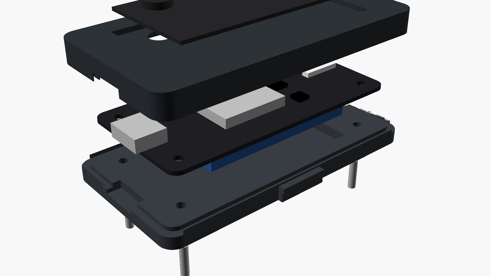
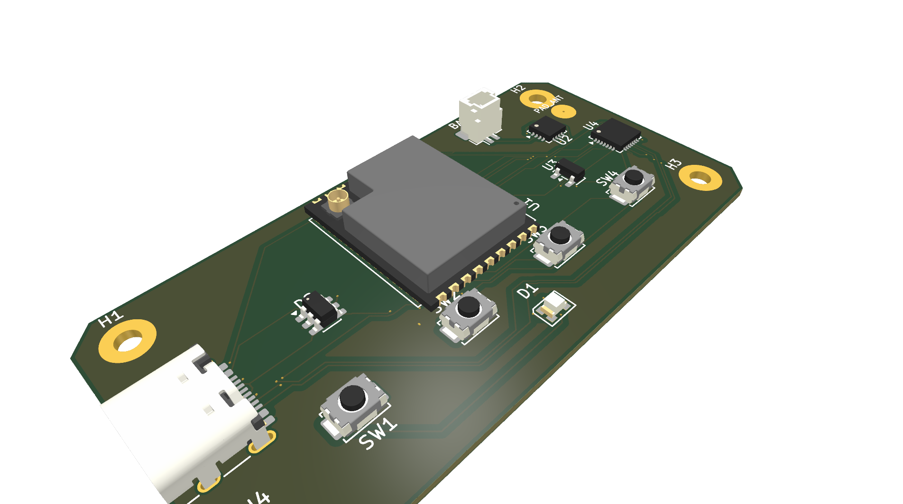
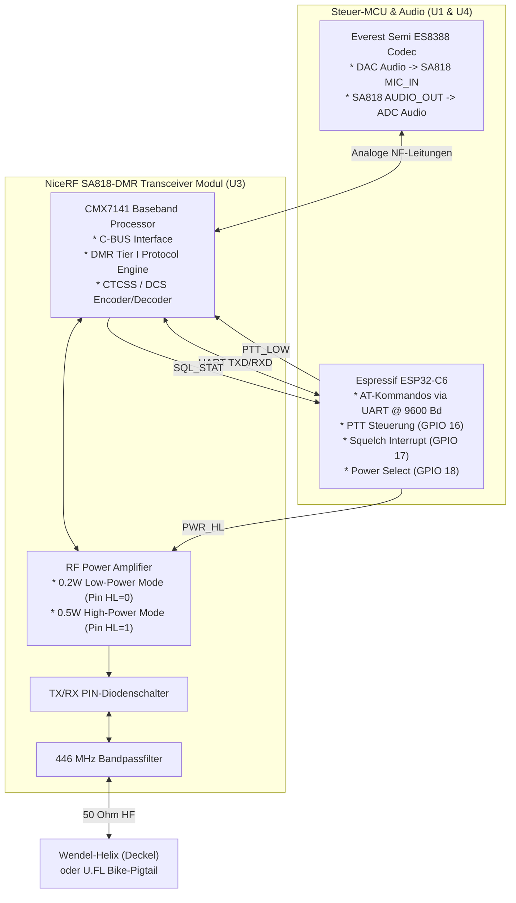

# 04b - OpenMotorMesh (OMM) Intercom-Module & Autonome OEM-Kassetten: 2.4 GHz HD-Mesh & 446 MHz PMR/DMR Tier I

Dieses Dokument ist die verbindliche Architekturspezifikation für die **zwei nativen, quelloffenen OpenMotorMesh (OMM) Intercom-Module**:
1. **OMM 2.4 GHz HD-Mesh Intercom (`PCBA 09`):** High-Definition Ad-hoc-Mesh über 2.4 GHz Wi-Fi 6 / 802.15.4 TDMA mit 6LoWPAN/IPv6-Multicast und Opus-Audio für bis zu 32 Fahrer.
2. **OMM 446 MHz Analog & Digital PMR446 / DMR Tier I Funkmodul (`PCBA 10`):** Universelles Jedermannfunk-Modul auf Basis des NiceRF SA818-DMR Transceivers für 100%ige Interoperabilität mit analogen Handfunkgeräten (z. B. Midland G7/G9 Pro) und digitalen DMR-Geräten (z. B. Midland D-10).

Beide Baugruppen nutzen den standardisierten **ECE 22.06 UCS-Formfaktor** ($68{,}0 \times 36{,}0 \times 9{,}5\,\text{mm}$) und können sowohl als **autarke Helm-Headsets** als auch formschlüssig als **Wechselkassetten in Bucht 1 oder Bucht 2 (`PCBA 03`)** am Motorrad betrieben werden.

---

# TEIL A: Systemüberblick & Die zwei nativen OMM-Module

## 1. Modul-Konzept, ECE 22.06 UCS-Formfaktor & Trennung der Baugruppen

Um Missverständnissen zwischen der Träger-Mechatronik und den Intercom-Modulen vorzubeugen, trennt OpenMotorBridge v9.6 strikt zwischen **zwei physischen Funktionsebenen**:

```
+---------------------------------------------------------------------------------------------------+
|                        ARCHITEKTUR-TRENNUNG: TRÄGERPLATINE VS. OMM-MODULE                         |
+----------------------------------------------------+----------------------------------------------+
| 1. KASSETTEN-TRÄGERPLATINE (PCBA 03 im Pod)        | 2. OMM INTERCOM-MODULE (PCBA 09 / PCBA 10)   |
+----------------------------------------------------+----------------------------------------------+
| * Verbleibt dauerhaft im Pod-Schlitten am Bike     | * Entnehmbare, standardisierte UCS-Module    |
| * Qorvo DW3110 UWB Transceiver (6.5 GHz Ch. 5)     | * Standardisierte Abmessungen: 68 x 36 mm    |
| * Deterministischer Backbone zur Zentralbox        | * ECE 22.06 Helmnorm-konforme Rasten         |
|   (Latenz < 0.4 ms, jitterfrei)                    | * Integrierter 600-mAh-LiPo-Akku (USV)       |
| * Everest Semi ES8388 24-Bit / 48 kHz Audio-Codec  | * 4x taktile IP67-Taster an Gehäuseoberseite |
| * 4x AO3400A MOSFETs + Mechatronik-Stößel (J_ACT)  | * Wasserdichte stirnseitige USB-C Buchse     |
| * 12V -> 3.8V/5V DC-DC Bordnetz-Speisung           | * Modul A: OMM 2.4 GHz Mesh (PCBA 09)        |
| * 8-Pin Kelvin Audio & Power Interface (J_AUDIO)   | * Modul B: OMM 446 PMR/DMR Radio (PCBA 10)   |
| * Null 2.4-GHz/446-MHz-Funk auf Trägerplatine!     | * Null UWB am Modul (Backbone rein im Pod)   |
+----------------------------------------------------+----------------------------------------------+
```

### 1.1 Gegenüberstellung der beiden nativen OMM-Module

| Spezifikation | OMM 2.4 GHz HD-Mesh (`PCBA 09`) | OMM 446 MHz PMR/DMR Funkmodul (`PCBA 10`) |
| :--- | :--- | :--- |
| **Architektur** | **Dual-Engine („OMB Lite“)** | **Dual-Engine („OMB Lite“)** |
| **Mesh- / Funk-Engine** | Espressif ESP32-C6-MINI-1U (Wi-Fi 6 / ESP-NOW) | NiceRF SA818-DMR (CMX7141 Baseband DSP + PA) |
| **Bluetooth Co-Prozessor** | **ESP32-PICO-V3-02** (Dual-Core 240 MHz, 8 MB Flash, 2 MB PSRAM) | **ESP32-PICO-V3-02** (Dual-Core 240 MHz, 8 MB Flash, 2 MB PSRAM) |
| **Bluetooth-Standards** | **BT Classic (BR/EDR)**: HFP 1.7 mSBC, OMI, A2DP + **BLE 5.3** | **BT Classic (BR/EDR)**: HFP 1.7 mSBC, OMI, A2DP + **BLE 5.3** |
| **Bridge-Fähigkeit** | **Cardo DMC-Bridge, Sena Mesh-Bridge, Universal Intercom** | **Cardo DMC-Bridge, Sena Mesh-Bridge, Universal Intercom** |
| **Betriebsmodi** | TDMA Slotted Mesh (Open / Private) | **Dual-Mode:** Analog FM (PMR446) + Digital (DMR Tier I) |
| **Kanäle / Subtöne** | 6 Multicast-Kanäle + AES-128 Privatgruppen | 16x PMR446 (38 CTCSS / 83 DCS) + 16x DMR (Color 1-16) |
| **Sendeleistung** | $+20\,\text{dBm}$ ($100\,\text{mW}$ EIRP) | **Dual-Power:** $0{,}2\,\text{W}$ (Helm) / $0{,}5\,\text{W}$ (Bike) |
| **Interoperabilität** | Autonomes OMM-Ökosystem + Sena/Cardo Bridge | **100% kompatibel zu Midland G7/G9 Pro & Midland D-10** |
| **Sprachqualität** | Opus HD ($24\,\text{kHz}$ Breitband, $< 18\,\text{ms}$) | Analog FM ($300\dots 3000\,\text{Hz}$) / DMR AMBE+2 ($2450\,\text{bps}$) |
| **Antennen-System** | U.FL Dipol (C6 Mesh) + 2.45 GHz Chip-Antenne (PICO BT) | $\lambda/4$-Wendel / U.FL (DMR) + 2.45 GHz Chip-Antenne (PICO BT) |
| **Platinen-Maße** | $60{,}0 \times 30{,}0 \times 1{,}0\,\text{mm}$ (2/4 Lagen FR4) | $60{,}0 \times 30{,}0 \times 1{,}0\,\text{mm}$ (4 Lagen FR4 TG150) |
| **Gehäuse** | ECE 22.06 UCS ($68 \times 36 \times 9{,}5\,\text{mm}$) | ECE 22.06 UCS ($68 \times 36 \times 9{,}5\,\text{mm}$) |

---

## 2. Mechanik, Gehäusedesign & ECE 22.06 UCS-Formfaktor

Das Gehäuse beider OMM-Module ist absolut identisch aufgebaut und erfüllt exakt die internationale **Universal Communication Solution (UCS) Spezifikation** nach **Helmnorm ECE 22.06**.



*Abbildung 4b.1: 3D-CAD-Ansicht des universellen OMM UCS-Moduls (`omm_ucs_module.scad`). Sichtbar sind die zweischalige PA12-Monocoque-Konstruktion ($68 \times 36 \times 9{,}5\,\text{mm}$), die 4x formschlüssigen DIN 934 M2 Sechskant-Mutterntaschen in der Oberschale, die monolithische Shore 50A Silikon-Tastmatte mit Haptiknoppen, die frontale wasserdichte USB-C Schnittstelle sowie die seitlichen ECE 22.06 Schnapprastnasen.*

```
+-----------------------------------------------------------------------------------------+
|                  UCS-GEHÄUSEABMESSUNGEN & ECE 22.06 RASTMECHANIK                        |
+-----------------------------------------------------------------------------------------+
|                                                                                         |
|       |<--------------------------- 68,0 mm -------------------------->|                |
|       +----------------------------------------------------------------+  ^             |
|       | [Rastnase L]                                      [Rastnase R] |  |             |
|       |   |                                                    |       |  |             |
|       |   v                                                    v       |  | 36,0 mm     |
|   (=) |   +---+   [BTN 1]       [BTN 2]      [BTN 3]      [BTN 4]  +---+   |  |             |
|   USB |   |   |     (o)          (o)          (+)          (-)     |   |   |  |             |
|   -C  |   +---+                                                +---+   |  v             |
|       +----------------------------------------------------------------+                |
|                                                                                         |
|       |<----------------- 9,5 mm Gehäusedicke (Ultraschlank) ---------->|                |
|       +----------------------------------------------------------------+                |
|       | 1. OBERSCHALE (PA12 MJF, Dichtnut & 4x DIN 934 M2 Mutterntaschen)              |
|       | ~~~~~~~~~~~~~~~~~ Shore 40A Silikondichtschnur (IP67) ~~~~~~~~~~~~~~~~~        |
|       | 2. PCBA 09 / PCBA 10 & 600-mAh-LiPo mit EPDM-Dämpfungspolster                  |
|       | 3. UNTERSCHALE (PA12 MJF mit 4x M2 Senkschrauben & ECE 22.06 Helmrasten)       |
|       +----------------------------------------------------------------+                |
+-----------------------------------------------------------------------------------------+
```

### 2.1 Verbindliche Befestigungs-Philosophie: Formschlüssige DIN 934 Mutterntaschen
> [!IMPORTANT]
> **Strikter Ausschluss selbstschneidender Schrauben:**
> Das Einschneiden von Gewinden direkt in Kunststoff führt bei mobilen Geräten nach wenigen Wartungszyklen zum Ausleiern des Kunststoffs und zum Totalverlust der Dichtigkeit (IP67-Versagen).
> 
> Beide OMM-Gehäuse nutzen daher **ausnahmslos formschlüssige DIN 934 M2 Sechskantmutter-Taschen** in der Oberschale. Das Modul kann über die 4x M2-Edelstahlschrauben **beliebig oft zerstörungsfrei geöffnet und wieder verschraubt werden** (z. B. für Akkutausch nach Jahren, Reinigung oder Hardware-Upgrades).

### 2.2 Multi-Use Schnittstellen-Architektur (USB-C)

Der UCS-Standard nach ECE 22.06 normiert die mechanische Kavität, lässt den elektrischen Steckverbinder jedoch bewusst frei. OpenMotorBridge setzt auf einen universellen, IP67-versiegelten **Multi-Use USB-C Port an der Stirnseite** (`J1`):

```
+-----------------------------------------------------------------------------------------+
|                  OMM MULTI-USE SCHNITTSTELLEN-ARCHITEKTUR (USB-C J1)                    |
+-----------------------------------------------------------------------------------------+
|                                                                                         |
|  [ OMM UCS-Modul: PCBA 09 oder PCBA 10 ]                                                |
|        |                                                                                |
|        +---> 1x IP67-versiegelte 16-Pin USB-C Buchse (Gerätestirnseite J1)              |
|                    |                                                                    |
|                    +--- MODUS A: EINSATZ IM HELM (STANDALONE)                           |
|                    |    USB-C auf Helm-Kabelpeitsche:                                   |
|                    |    * Lautsprecher: Standard 3,5 mm Klinkenbuchse (Stereo TRS)      |
|                    |      - Tip (CC1): Audio Links (ES8388 LOUT1)                       |
|                    |      - Ring (CC2): Audio Rechts (ES8388 ROUT1)                     |
|                    |      - Sleeve (SBU2): Stromlose Audiomasse (AGND_SPK, I = 0 mA)    |
|                    |    * Mikrofon: Wasserdichter 2-Pin Verriegelungsstecker (JST-JWPF) |
|                    |      - Pin 1 (SBU1): MIC_IN+ (ES8388 MIC1P)                        |
|                    |      - Pin 2 (SBU2): Stromlose Mikrofonmasse (AGND_SPK, I = 0 mA)  |
|                    |                                                                    |
|                    +--- MODUS B: EINSATZ IM POD (SMART CARTRIDGE PCBA 03)               |
|                    |    USB-C auf 8-Pin JST-SH Adapterkabel (Länge 5 cm, 90° gewinkelt):|
|                    |    * Pin 1: PGND (Leistungs-Rückstrom, bis 600 mA Sendepeak)       |
|                    |    * Pin 2: VCC_5V (Bordnetz-Speisung & BQ24075 USV-Ladung)        |
|                    |    * Pin 3 & 6: AGND_SPK (Audio-Massebezug, stromlos I = 0 mA)     |
|                    |    * Pin 4 & 5: Stereo Audio Line-In Links / Rechts (CC1 & CC2)    |
|                    |    * Pin 7: MIC_OUT (Fahrer-Sprachsignal ins Modul < 1 ms, SBU1)   |
|                    |    * Pin 8: PTT_IO (Hardware-PTT-Tastung gegen Masse)              |
|                    |                                                                    |
|                    +--- MODUS C: FLASHING, DFU & SERVICE (WARTUNG)                      |
|                         Standard USB-C Datenkabel am PC / Web-Browser (WebUSB):         |
|                         * VBUS (A4/B4/A9/B9) & GND (A1/B1/A12/B12): 5V Versorgung/Laden|
|                         * D+ (A6/B6) & D- (A7/B7): ESP32-C6 Nativer USB PHY (GPIO 13/12)|
|                           Vollwertiges WebUSB/DFU-Flashing, Logging & Firmware-Updates! |
+-----------------------------------------------------------------------------------------+
```

---

# TEIL B: OMM 2.4 GHz HD-Mesh Intercom (`PCBA 09`)

## 3. OMM 2.4 GHz Hardware- & Platinen-Design (`PCBA 09`)

Das Herzstück des digitalen 2.4-GHz-Netzwerks bildet die Platine `openmotorbridge_omm_ucs` (**`PCBA 09`**):


```mermaid
flowchart TD
    subgraph Power["Power & Battery Management (TI BQ24075)"]
        USBC["IP67 USB-C Port\n(5V VBUS & Data)"] -->|5V In| PMIC["TI BQ24075 PMIC\n(Dynamic Power Path)"]
        BAT["1S LiPo 600 mAh\n(3.7V / 2.22 Wh\nmit DW01A PCM)"] <-->|Charge/Discharge| PMIC
        NTC["NTC 10k Thermistor\n(JEITA 0..45°C)"] -->|Temp Sense| PMIC
        PMIC -->|System Rail 3.8..4.4V| LDO["3.3V LDO Regulator\n(500 mA, Low-Iq)"]
        LDO -->|3.3V Rail| VDD["3.3V Systemnetz"]
    end

    subgraph MCU["Host MCU & RF Core"]
        C6["Espressif ESP32-C6-MINI-1U\n(160 MHz RISC-V, 4 MB Flash)\n* 2.4 GHz Wi-Fi 6 (802.11ax)\n* 802.15.4 TDMA Mesh Radio\n* Bluetooth 5.3 LE\n* U.FL Goldbuchse"]
        ANT["Taoglas FXP73\n2.4 GHz Flex-Dipol (+3.0 dBi)\n(Direkt an U1 U.FL-Port)"] <-->|2.4 GHz RF| C6
        RGB["WS2812B-2020\nRGB Status-LED"] <--|GPIO 11| C6
        KEYS["4x IP67 Mikrotaster\n(Power, Mesh, Vol+, Vol-)"] -->|GPIO 0..3| C6
    end

    subgraph Audio["Audio Frontend (Everest Semi ES8388)"]
        C6 <-->|I2S Bus (MCLK, BCLK, WS, DOUT, DIN)\n+ I2C Control (SCL, SDA)| CODEC["Everest Semi ES8388\n(24-Bit / 96 kHz Stereo Codec)"]
        CODEC -->|Stereo HP Amp (2x 45 mW @ 16 Ohm)| HP["Helmlautsprecher L/R\n(40 mm JBL / Sena HD\nvia 3.5 mm Klinke)"]
        MIC["Mikrofon (ECM / Schwanenhals)\nvia 2-Pin JST-JWPF"] -->|Low-Noise Preamp + MICBIAS| CODEC
    end

    USBC <-->|USB 2.0 D+/D- & WebUSB Flashing| C6
    VDD --> C6
    VDD --> CODEC
```

### 3.1 TDMA Superframe & Protokoll-Stack (Layer 1 bis 4)
* **Layer 1 (TDMA Superframe):** $10{,}0\,\text{ms}$ Superframe-Zyklus (100 Hz). Subframe 0 überträgt Sidelink Synchronization Signals (SLSS); Subframes 1–9 bieten kollisionsfreie Zeitschlitze für bis zu 6 gleichzeitige Vollduplex-Sprecher.
* **Layer 2 (802.11s-Light Duplicate Filter):** 16-Byte Header mit monoton steigender Sequenznummer und 64-Entry Cache verwirft Mehrwege-Duplikate in $< 5\,\mu\text{s}$.
* **Layer 3 (6LoWPAN / IPv6 Multicast):** Komprimiert 40-Byte IPv6 Header auf 2–4 Bytes. Vollständig kollisionsfreies Multicast ohne TCP Head-of-Line Blocking.
* **Layer 4 (Opus over RTP):** 24 kHz Breitband HD mit adaptivem Jitter-Puffer ($20\dots 50\,\text{ms}$) und Packet Loss Concealment (PLC). Systemlatenz: **$< 18\,\text{ms}$**.

### 3.2 Bluetooth 5.3 LE Audio mit LC3 & BLE GATT Remote Control

### 3.2 Die Dual-Engine Architektur: Trennung von Mesh und Bluetooth („OMB Lite“)

> [!IMPORTANT]
> **Das Flaschenhals-Problem des „Shared Radio“ auf Single-Chip-Systemen:**
> Der ESP32-C6 besitzt hardwareseitig nur **einen einzigen physikalischen 2.4-GHz-Transceiver (LNA/PA/Mischer)**, den sich Wi-Fi 6 (ESP-NOW Mesh) und Bluetooth Low Energy (BLE 5.3) im Time-Division-Multiplexing (TDM) teilen müssen. Zudem beherrscht der ESP32-C6 hardwarebedingt **kein Bluetooth Classic (BR/EDR)**.
> 
> Wenn ein einzelner Chip gleichzeitig Echtzeit-Audio im Mesh (Opus-Frames alle 10–20 ms) und BLE (Smartphone PWA-App, Telemetrie, Scanning) verarbeiten soll, erzwingt der interne Hardware-Coexistence-Arbiter regelmäßige Funk-Umschaltzeiten. Dies führt bei mobilen Funknetzen unweigerlich zu **Mikro-Jitter, Pufferunterläufen und hörbaren Audio-Aussetzern**.

Zur vollständigen Beseitigung dieses Flaschenhalses setzt OpenMotorBridge auf beiden Modulen (`PCBA 09` und `PCBA 10`) auf eine kompromisslose **Dual-Engine-Architektur**:

```
+---------------------------------------------------------------------------------------------------+
|                        DUAL-ENGINE ARCHITEKTUR: OMM 2.4 GHz & OMM 446 („OMB LITE“)                |
+----------------------------------------------------+----------------------------------------------+
| 1. HOST / MESH-ENGINE: ESP32-C6-MINI-1U            | 2. BLUETOOTH CO-PROZESSOR: ESP32-PICO-V3-02  |
+----------------------------------------------------+----------------------------------------------+
| * 100% dediziertes Wi-Fi 6 / ESP-NOW Mesh (PCBA 09)| * Dual-Core 240 MHz Xtensa LX6 MCU           |
| * Oder DMR Tier I / PMR446 Controller (PCBA 10)    | * Integriert: 8 MB SPI Flash + 2 MB PSRAM    |
| * Bluetooth in C6-Firmware KOMPLETT deaktiviert     | * Bluetooth Classic (BR/EDR) + BLE 4.2 / 5.x |
|   (`CONFIG_BT_ENABLED=0`)                          | * Universal Intercom (HFP 1.7 mSBC HD Voice) |
| * Transceiver permanent auf Mesh-Kanal gelockt     | * Cardo DMC-Bluetooth Bridge & Sena Bridge   |
| * Null Radio-Konkurrenz, null CoEx Time-Slicing    | * A2DP HiFi Stereo-Streaming (Musik/Navi)    |
| * Garantierte Audio-Latenz < 15 ms                 | * Smartphone PWA Companion App (BLE GATT)    |
| * Externe U.FL-Dipol-Antenne (Taoglas Flex)        | * Eigene 2.45 GHz Keramik-Chipantenne (ANT1) |
+----------------------------------------------------+----------------------------------------------+
                         |                                          |
                         +------------ High-Speed UART (3 Mbps) ----+
                         |             (Hardware Flow Control)      |
                         v                                          v
                   +------------------------------------------------------+
                   | Everest Semi ES8388 HiFi Stereo Audio Codec (U4)     |
                   | * Hardware & Digital Audio Mixing                    |
                   | * Vollduplex Stereo Headset & Mikrofon-Vorverstärker |
                   +------------------------------------------------------+
```

### 3.3 Simultane Doppel-Verbindung & Cross-Over Bridge (Cardo DMC / Sena)

Weil der ESP32-C6 und der ESP32-PICO-V3-02 über **zwei völlig getrennte physikalische HF-Frontends und Antennen** verfügen, entsteht ein echter **Dual-Radio Vollduplex-Betrieb**:

1. **Gleichzeitige Konversation ohne Umschalten:**
   * Der Fahrer spricht kontinuierlich in der OpenMotorMesh-Gruppe (2.4 GHz ESP-NOW oder 446 MHz DMR).
   * **Gleichzeitig** bleibt die Bluetooth-Universal-Intercom-Verbindung zu einem externen Headset (z. B. Sena oder Cardo ohne Mesh) aktiv. Beide Audio-Streams werden im Codec bzw. DSP verzerrungsfrei überlagert.

2. **OpenMotorBridge als Gateway (DMC- und Sena-Bridge):**
   * **Cardo DMC-Bluetooth Bridge Integration:** Ein Cardo Packtalk Fahrer aktiviert in der Cardo-App die offizielle Funktion *„DMC-Bluetooth Bridge“*. Das OMB-Lite-Modul koppelt sich per Bluetooth an diesem Packtalk. Der Audiostream der gesamten Cardo-DMC-Gruppe wird nun live in das OpenMotorMesh eingespeist – und das OMM-Mesh zurück in die Cardo-Gruppe!
   * **Sena Mesh Intercom Bridge:** Dasselbe Prinzip bindet Sena-Mesh-Gruppen über ein einzelnes gebrücktes Bluetooth-Glied in das OpenMotorMesh ein.
   * **Eigene OMM-Bridge für Fremdfahrer:** Ein Gastfahrer ohne OpenMotorBridge wird per Bluetooth Classic Universal Intercom an das Helm-Modul gekoppelt und von diesem automatisch für alle OMM-Mesh-Teilnehmer hörbar gemacht.

3. **Autarkes „OMB Lite“ für Reisen & Leihfahrzeuge (z. B. USA-Tour):**
   * Das Modul im ECE 22.06 UCS-Helm benötigt **kein Motorrad und keine Zentralbox**, um voll funktionsfähig zu sein.
   * Mit dem integrierten 600-mAh-LiPo-Akku, BQ24075 PMIC, ES8388 Codec und den zwei Funkstufen ist das Helm-Modul ein vollwertiges, eigenständiges High-End-Intercom für Leihmotorräder, Fahrräder oder Mietwagen.

### 3.4 Inter-MCU Pinbelegung (ESP32-C6 <-> ESP32-PICO-V3-02)

| Signal | ESP32-C6 (`U1`) | ESP32-PICO-V3-02 (`U5/U6`) | Funktion |
| :--- | :--- | :--- | :--- |
| `BT_UART_TX` | GPIO 16 (Pad 18) | IO1 / U0TXD (Pad 41) | Serieller Telemetrie- & Audio-Datenstrom (PICO -> C6) |
| `BT_UART_RX` | GPIO 17 (Pad 19) | IO3 / U0RXD (Pad 40) | Serieller Telemetrie- & Audio-Datenstrom (C6 -> PICO) |
| `BT_UART_RTS` | GPIO 15 (Pad 17) | IO15 / MTDO (Pad 21) | Hardware Flow Control RTS |
| `BT_UART_CTS` | GPIO 14 (Pad 16) | IO13 / MTCK (Pad 20) | Hardware Flow Control CTS |
| `BT_RESET` | GPIO 18 (Pad 20) | EN / CHIP_PU (Pad 9) | Hardware-Reset & Wakeup des Co-Prozessors |
| `BT_BOOT` | GPIO 2 (Pad 8) | IO0 (Pad 23) | Boot-Strap für WebUSB DFU-In-Circuit-Flashing |
| `BT_ANT` | – | LNA_IN (Pad 2) | $50\,\Omega$ HF-Leitung zur Johanson 2450AT18 Chip-Antenne |

---

# TEIL C: OMM 446 MHz Analog & Digital PMR/DMR Modul (`PCBA 10`)

## 4. OMM 446 Motivation & System-Architektur

Das **OMM 446 MHz Intercom-Modul (`PCBA 10`)** schließt die gravierende Lücke zwischen modernen Motorrad-Mesh-Systemen und dem weltweit verbreiteten Jedermannfunk im 446-MHz-Band:

```
+-----------------------------------------------------------------------------------------+
|                  DAS PROBLEM MIT KLASSISCHEN HANDFUNKGERÄTEN AM MOTORRAD                |
+----------------------------------------------------+------------------------------------+
| TRADITIONELLE HANDFUNKGERÄTE (Midland G9 / D-10)   | DIE OPENMOTORBRIDGE-LÖSUNG: PCBA 10|
+----------------------------------------------------+------------------------------------+
| * Klobige Ziegelstein-Gehäuse (122 x 58 x 34 mm)   | * Flache UCS-Modulform: 68 x 36 mm |
| * Dicke Gürtelclips & Drehpotentiometer            | * Passt mechanisch in Helmkavität  |
| * Passen physisch in keinen Kassetten-Schlitten!   | * Passt formschlüssig in Kassetten-|
| * Lange, starre Peitschenantennen (12 bis 24 cm)   |   Schlitten von Bucht 1 und Bucht 2|
| * Teardown zerstört Garantie, Dichtung & Wert      | * Dual-Mode: Analog FM + DMR Tier I|
| * Keine direkte Einbindung ins Cockpit-Display     | * 100% digital steuerbar via UART  |
+----------------------------------------------------+------------------------------------+
```



### 4.1 Technische Platinen-Kenndaten & Lagenaufbau (`PCBA 10`)
* **Platinen-ID:** `openmotorbridge_omm446_ucs` (**`PCBA 10`**).
* **Abmessungen:** $60{,}0 \times 30{,}0 \times 1{,}0\,\text{mm}$ ($R = 2{,}5\,\text{mm}$ Eckenverrundung) – exakt deckungsgleich zu `PCBA 09`.
* **Lagenaufbau:** 4-Lagen FR4 TG150 ($1{,}0\,\text{mm}$ Materialstärke):
  - Top Layer ($35\,\mu\text{m}$ Cu): Signalleitungen, ES8388 Audio-Frontend, ESP32-C6 Microcontroller.
  - Inner Layer 1 ($17{,}5\,\mu\text{m}$ Cu): Durchgehende, ununterbrochene Massefläche (`AGND` & `GND` Shielding unter dem SA818-DMR Transceiver).
  - Inner Layer 2 ($17{,}5\,\mu\text{m}$ Cu): Niederohmige Stromversorgungs-Planes ($3{,}3\,\text{V}$, $4{,}4\,\text{V}$ PA-Versorgung).
  - Bottom Layer ($35\,\mu\text{m}$ Cu): NiceRF SA818-DMR SMD-Modul, BQ24075 Lade-IC, U.FL Koaxialbuchse.
* **Oberflächenfinish:** ENIG (Electroless Nickel Immersion Gold) für maximale Korrosionsbeständigkeit gegen Schweiß und Kondenswasser.

---

## 5. NiceRF SA818-DMR Transceiver & Funk-Architektur

Das HF-Herzstück von `PCBA 10` ist das ultrakompakte **NiceRF SA818-DMR SMD-Transceiver-Modul** ($38 \times 16 \times 3{,}2\,\text{mm}$):



### 5.1 Die zwei Betriebsmodi: Analog PMR446 vs. Digital DMR Tier I

#### Modus 1: Analog PMR446 (Klasse 3a Kompatibilität)
* **Frequenzbereich:** $446{,}00625\,\text{MHz}$ bis $446{,}19375\,\text{MHz}$ (16 Kanäle im $12{,}5\,\text{kHz}$ Raster).
* **Modulation:** Schmalband-FM (11K0F3E) mit $\pm 2{,}5\,\text{kHz}$ Maximalhub.
* **Subaudio-Selektivruf (Squelch-Kodierung):**
  - **38 CTCSS-Töne:** $67{,}0\,\text{Hz}$ bis $250{,}3\,\text{Hz}$ kontinuierlicher Subton.
  - **83 DCS-Codes:** Digitale 23-Bit-Telegramme zur Vermeidung fremder Funksprüche.
* **100% Interoperabilität:** Voll kompatibel zu allen handelsüblichen PMR446-Funkgeräten im Feld (**Midland G7 Pro, G9 Pro, G11, G13, G15, G18**, Motorola TLKR / T82, Retevis, Baofeng).

#### Modus 2: Digital DMR Tier I (Klasse 3b Kompatibilität)
* **Standard:** ETSI TS 102 361-1 konform (lizenzfreier Digitalfunk im 446-MHz-Band).
* **Modulation:** 2-Slot TDMA mit 4FSK Modulation ($4{,}8\,\text{kbaud} / 9{,}6\,\text{kbps}$ Brutto-Bitrate).
* **Sprachcodec:** AMBE+2 ($2450\,\text{bps}$ Vocoder + $1150\,\text{bps}$ FEC Fehlerschutz).
* **Selektivruf & Adressierung:**
  - 16 programmierbare Digital-Kanäle.
  - **Color Codes 1 bis 16:** Trennt verschiedene Gruppen auf derselben Frequenz digital voneinander.
  - **DMO Direktmodus (Peer-to-Peer):** Volldigitale Sprachübertragung direkt von Modul zu Modul ohne Repeater oder Relaisstationen.
* **Der entscheidende Vorteil gegenüber Analog:** **Glasklare, vollkommen rauschfreie Sprachübertragung bis an die physikalische Empfangsgrenze.** Während Analogfunk bei schwächerem Signal zunehmend verrauscht und unleserlich wird, bleibt DMR glasklar verständlich – erst bei vollständigem Signalabriss bricht die Verbindung digital ab.
* **100% Interoperabilität:** Voll kompatibel zu digitalen Handfunkgeräten wie dem **Midland D-10**, Retevis RT3S, TyT MD-380.

---

## 6. Sendeleistung, Antennensystem & SAR-Konformität

### 6.1 Dual-Power Sendeleistungsumschaltung (0.2 W vs. 0.5 W ERP)
Das SA818-DMR Modul verfügt über einen dedizierten Umschaltpin `HL` (`SA818_PWR_HL`, gesteuert über ESP32-C6 `GPIO 18`):

| Betriebsmodus | Steuersignal `SA818_PWR_HL` | ERP-Sendeleistung | Reichweite (Freifeld) | Anwendungsbereich / Zulassung |
| :--- | :--- | :--- | :--- | :--- |
| **Helm-Modus (Standalone)** | **`LOW` (0 V)** | **$0{,}2\,\text{W}$ ($200\,\text{mW}$)** | **$1{,}5\dots 2{,}5\,\text{km}$** | **SAR-Safe:** Minimale HF-Absorption am Kopf; schont den 600-mAh-LiPo-Akku (Laufzeit 8–10 h). |
| **Bike-Modus (Kassette im Pod)** | **`HIGH` ($3{,}3\,\text{V}$)** | **$0{,}5\,\text{W}$ ($500\,\text{mW}$)** | **$3{,}0\dots 6{,}0\,\text{km}$** | **Maximales PMR446-Gesetzeslimit:** Speisung über 5V-Bordnetz; maximale Reichweite bei Überlandfahrten. |

* **Autonome Modus-Erkennung:** Wird das Modul in den Kassetten-Schlitten (`PCBA 03`) gesteckt, erkennt der ESP32-C6 die Docking-Signale über Header `J_AUDIO_PWR` (Pin 8) und schaltet die Sendeleistung automatisch von 0,2 W auf 0,5 W um. Außerhalb des Pods fällt das Modul sicherheitshalber in den 0,2-W-Helm-Modus zurück.

### 6.2 Antennen-Architektur: Interne Deckel-Helix vs. Externe Fahrzeugantenne
1. **Standalone-Helmeinsatz (Interne Wendel-Helix):**
   * Im Gehäusedeckel der Oberschale befindet sich eine präzise auf $446\,\text{MHz}$ resonanzabgestimmte Kupfer-Wendelantenne ($\lambda/4$ verkürzt, $32\,\text{mm}$ Länge, $\varnothing 5\,\text{mm}$).
   * Die Wendel ist im 3D-Druck-Labyrinth rüttelfest und wasserdicht mit Polyurethan-Gießharz vergossen.
   * Ein federnder Goldkontakt verbindet die Antenne beim Verschrauben der Gehäusehälften direkt mit dem Antennenpad von `PCBA 10`.
2. **Kassetten-Betrieb im Motorrad-Pod (Externe Fahrzeugantenne):**
   * Auf `PCBA 10` ist eine **U.FL-Goldbuchse (`J_RF`)** bestückt.
   * Im Pod wird ein kurzes, verlustarmes RG-178 Koaxial-Pigtail von der U.FL-Buchse zu einer wasserdichten SMA-Buchse an der Gehäuseaußenseite geführt.
   * **Reichweiten-Vorteil:** Die Antenne kann am Fahrzeugheck (z. B. am Kennzeichenträger oder Kofferhalter) montiert werden. Dadurch wird die massive Abschattung durch den Körper des Fahrers vollständig eliminiert!

---

## 7. Vollständiges Pinout & Schaltkreis-Verdrahtung (`PCBA 10`)

### 7.1 ESP32-C6 zu SA818-DMR, Audio-Codec & Peripherie

| Pad / Pin | Signal-Name | Richtung | Peripherie / Funktion | Elektrische Parameter |
| :---: | :--- | :---: | :--- | :--- |
| **`GPIO 2`** | `BTN_PTT` | Input | SW1: Push-To-Talk / MFB (Low-aktiv) | Interner Pullup $45\,\text{k}\Omega$, Boot-Pin |
| **`GPIO 3`** | `BTN_MODE` | Input | SW2: Mode Toggle (Analog FM <-> DMR) | Interner Pullup $45\,\text{k}\Omega$ |
| **`GPIO 4`** | `BTN_CH_UP` | Input | SW3: Kanalwahl Aufwärts (CH 1–16) | Interner Pullup $45\,\text{k}\Omega$ |
| **`GPIO 5`** | `BTN_CH_DOWN` | Input | SW4: Kanalwahl Abwärts (CH 16–1) | Interner Pullup $45\,\text{k}\Omega$ |
| **`GPIO 6`** | `WS2812_DATA` | Output | D1: WS2812B-2020 RGB Statusanzeige | $800\,\text{kHz}$ NZR-Protokoll, 3.3V Pegel |
| **`GPIO 7`** | `CHG_STAT` | Input | BQ24075 /STAT Ladeanzeige | Open-Drain, Pullup auf 3.3V |
| **`GPIO 8`** | `I2C_SDA` | I/O | ES8388 Audio-Codec I2C Control SDA | $4{,}7\,\text{k}\Omega$ Pullup auf 3.3V |
| **`GPIO 9`** | `I2C_SCL` | Output | ES8388 Audio-Codec I2C Control SCL | $4{,}7\,\text{k}\Omega$ Pullup auf 3.3V ($400\,\text{kHz}$) |
| **`GPIO 12`** | `USB_DN` | I/O | USB-C Datenleitung D- | Native USB 2.0 Full-Speed PHY (DFU Flashing) |
| **`GPIO 13`** | `USB_DP` | I/O | USB-C Datenleitung D+ | Native USB 2.0 Full-Speed PHY (DFU Flashing) |
| **`GPIO 14`** | `SA818_TXD` | Output | UART TX -> SA818 RXD (AT-Befehle) | $9600\,\text{Bd}$, 8N1, 3.3V CMOS |
| **`GPIO 15`** | `SA818_RXD` | Input | UART RX <- SA818 TXD (Telemetrie/Status) | $9600\,\text{Bd}$, 8N1, 3.3V CMOS |
| **`GPIO 16`** | `SA818_PTT` | Output | SA818 Sende-Aktivierung | **Low = TX Senden aktiv**, High = RX Empfang |
| **`GPIO 17`** | `SA818_SQL` | Input | SA818 Rauschsperren-Status (Squelch) | **Low = Träger erkannt (Empfang)**, High = Stumm |
| **`GPIO 18`** | `SA818_PWR_HL` | Output | SA818 RF Power Umschaltung | **Low = 0.2W (Helm)**, High = 0.5W (Bike) |
| **`GPIO 19`** | `I2S_MCLK` | Output | ES8388 Master Clock | $12{,}288\,\text{MHz}$ ($256 \times f_s$) |
| **`GPIO 20`** | `I2S_BCLK` | Output | ES8388 Bit Clock | $1{,}536\,\text{MHz}$ ($32 \times f_s$) |
| **`GPIO 21`** | `I2S_WS` | Output | ES8388 Word Select / Frame Sync | $48{,}0\,\text{kHz}$ Audio-Framerate |
| **`GPIO 22`** | `I2S_DOUT` | Output | ES8388 DAC Audio Stream (Sprachausgabe) | I2S Standard Format |
| **`GPIO 23`** | `I2S_DIN` | Input | ES8388 ADC Audio Stream (Mikrofonaufnahme) | I2S Standard Format |

---

## 8. Audio-Frontend, PTT-Steuerung & 8-Pin Kelvin Grounding

### 8.1 Das Brummschleifen-Problem bei Schmalband-Funktransceivern
Sendet das SA818-DMR Modul mit $0{,}5\,\text{W}$ ERP im 446-MHz-Band, zieht die HF-Endstufe Stromspitzen von bis zu **$600\,\text{mA}$** aus dem 5V-Bordnetz.
* Würde dieser Rückstrom über eine gemeinsame Masse mit dem Audiosignal fließen, erzeugt der Spannungsabfall ($I \times R_{\text{GND}} \approx 600\,\text{mA} \times 0{,}08\,\Omega = 48\,\text{mV}$) ein verheerendes Knattern und Brummen im empfindlichen Mikrofonpfad ($5\dots 15\,\text{mV}$ Nutzsignal).
* **Die Lösung: 8-Pin Kelvin Grounding auf Header `J_AUDIO_PWR`:**
  - `Pin 1: PGND` führt die $600\,\text{mA}$ Leistungsrückströme direkt zum Schaltregler auf `PCBA 03` ab.
  - `Pin 3: AGND_SPK` und `Pin 6: AGND_MIC` sind **vollkommen stromlos** ($I = 0\,\text{mA}$). Es gibt keinen Spannungsabfall ($\Delta V = 0\,\text{mV}$) – das Audiosignal bleibt absolut brumm- und störungsfrei!

```
+---------------------------------------------------------------------------------------------------+
|               8-PIN KELVIN GROUNDING BEI PCBA 10 SENDEBETRIEB (SA818-DMR TX BURST)                |
+---------------------------------------------------------------------------------------------------+
|                                                                                                   |
|  [ PCBA 10 OMM 446 MODUL ]                                          [ SMART CARTRIDGE PCBA 03 ]   |
|                                                                                                   |
|  SA818 HF-Endstufe (600 mA Peak) --(Pin 1: PGND)-----------------> LM5164 DC-DC Rückstrommasse    |
|  5V USV-Ladung & PA-Versorgung <---(Pin 2: VCC_5V)---------------- 5V Bordnetz-Speisung (1.5 A)   |
|                                                                                                   |
|  ES8388 Lautsprecher-DAC Masse ----(Pin 3: AGND_SPK, I = 0 mA)----> Analoge Audio-Masse (ES8388)  |
|  ES8388 Audio-Ausgang Links -------(Pin 4: AUDIO_L_IN)------------> ES8388 Codec Line-In Links    |
|  ES8388 Audio-Ausgang Rechts ------(Pin 5: AUDIO_R_IN)------------> ES8388 Codec Line-In Rechts   |
|                                                                                                   |
|  ES8388 Mikrofon-ADC Masse --------(Pin 6: AGND_MIC, I = 0 mA)----> Rauscharme Mikrofon-Masse     |
|  Mikrofon-Signal vom Helm/DSP -----(Pin 7: MIC_OUT)---------------> Differenzieller Preamp       |
|                                                                                                   |
|  SA818 PTT Schalteingang ---------(Pin 8: PTT_IO)----------------- Q4 Open-Drain PTT-MOSFET      |
|                                                                                                   |
+---------------------------------------------------------------------------------------------------+
```

### 8.2 Schnelle Rauschsperre (Fast-Attack Squelch) & PTT-Latenz
* **Empfangs-Erkennung (`SA818_SQL` an GPIO 17):** Erkennt das Modul einen analogen Träger mit passendem CTCSS-Ton bzw. einen DMR-Burst mit passendem Color Code, schaltet Pin `SQL` in **$< 4\,\text{ms}$** auf Low.
* **Unterbrechungsfreies Audio-Routing:** Der ESP32-C6 detektiert die fallende Flanke per GPIO-Interrupt und aktiviert unverzüglich den I2S-Audiopfad zur Zentralbox (`PCBA 01`).
* **Sende-Tastung (PTT):** Wird am Lenker der PTT-Taster gedrückt oder das VAD-Schwellenwert-Event ausgelöst, zieht GPIO 16 `SA818_PTT` auf Low. Die HF-Endstufe schwingt in $< 12\,\text{ms}$ stabil an – keine abgeschnittenen Silben am Satzanfang!

---

## 9. Cockpit-Integration: CarPlay, Android Auto & PWA Funk-Dashboard

Im Kassetten-Betrieb am Motorrad entfällt die Notwendigkeit, das Modul manuell zu bedienen. Alle Parameter werden vom ESP32-S3 der Zentralbox über den UWB-Backbone digital gesteuert und im Dashboard visualisiert:

```
+-----------------------------------------------------------------------------------------+
|                  CARPLAY / PWA DASHBOARD: PMR446 & DMR KONTROLLZENTRALE                 |
+-----------------------------------------------------------------------------------------+
|                                                                                         |
|   +---------------------------------------------------------------------------------+   |
|   |  MODUS: [ (o) ANALOG PMR446 ]   [ ( ) DIGITAL DMR TIER I ]                      |   |
|   +---------------------------------------------------------------------------------+   |
|                                                                                         |
|   KANALWAHL:  < [ KANAL 08 : 446.09375 MHz ] >     (Bergrettung / Wanderkanal)         |
|                                                                                         |
|   SUBTON / CODE: [ CTCSS: 16 (114.8 Hz) v ]        RAUSCHSPERRE: [----||-------] 3/8    |
|                                                                                         |
|   SENDELEISTUNG: [ 0.5 W HIGH (BIKE) ]             STATUS: [ RX: SIGNAL -82 dBm ]       |
|                                                                                         |
|   +---------------------------------------------------------------------------------+   |
|   |                  [  PTT SPRECHEN (LENKERTASTER AKTIV)  ]                        |   |
|   +---------------------------------------------------------------------------------+   |
|                                                                                         |
+-----------------------------------------------------------------------------------------+
```

### 9.1 Automatisierte AT-Kommando-Steuerung (UART-Protokoll)
Der ESP32-C6 übersetzt Touchscreen- und Taster-Eingaben direkt in AT-Kommandos an das SA818-DMR:

1. **Modul-Initialisierung:**
   ```
   TX -> AT+DMOCONNECT\r\n
   RX <- +DMOCONNECT:0\r\n   (Verbindung erfolgreich bestätigt)
   ```
2. **Kanal- und Subton-Konfiguration (Analog FM):**
   ```
   TX -> AT+DMOSETGROUP=0,446.09375,446.09375,0016,3,0\r\n
   RX <- +DMOSETGROUP:0\r\n  (BW=12.5kHz, TX=446.09375, RX=446.09375, CTCSS=16, SQ=3)
   ```
3. **Kanal- und Color-Code-Konfiguration (Digital DMR Tier I):**
   ```
   TX -> AT+DMRSETGROUP=446.09375,446.09375,01,0,0,1\r\n
   RX <- +DMRSETGROUP:0\r\n  (TX=RX=446.09375, ColorCode=1, Slot=1, AllCall)
   ```
4. **Lautstärke & Filter setzen:**
   ```
   TX -> AT+DMOSETVOLUME=6\r\n
   TX -> AT+SETFILTER=1,1,1\r\n (Pre/De-Emphasis Ein, HPF Ein, LPF Ein)
   ```

---

# TEIL D: Vergleichsmatrix, Cross-Bridging & Verifikation

## 10. Cross-Bridging im System: Wie OMM 446 mit Sena, Cardo und OMM 2.4G spricht

Befindet sich in Bucht 1 ein Sena SPIDER X Slim (Mesh 3.0) und in Bucht 2 das OMM 446 Modul (`PCBA 10`), fungiert OpenMotorBridge als universelle Dolmetscher-Zentrale:

```mermaid
flowchart LR
    subgraph PMR["446 MHz Funkzelle (Jedermannfunk)"]
        G9["Midland G9 Pro\n(Analog FM Funker)"] <-->|446.09375 MHz| P10["OMM 446 Modul\n(PCBA 10 in Bucht 2)"]
        D10["Midland D-10\n(Digital DMR Funker)"] <-->|DMR TDMA 4FSK| P10
    end

    subgraph Central["Zentralbox (PCBA 01) DSP Routing Matrix"]
        P10 <-->|UWB Backbone Ch. 5 (< 0.4 ms)| DSP["ESP32-S3 Audio DSP\n* Raised-Cosine Filter\n* Ducking (-12 dB)\n* Voice Activity Detection (VAD)"]
    end

    subgraph SenaNet["Motorrad-Gruppe (Sena Mesh 3.0)"]
        DSP <-->|UWB Backbone Ch. 5| SLED["Sena SPIDER X Slim\n(PCBA 03 in Bucht 1)"]
        SLED <-->|2.4 GHz Sena Mesh| BIKES["Gruppe (15 Fahrer auf Sena 50S / 60S / Spider)"]
    end
```

1. Ein Wanderer, Streckenposten oder Fahrschüler spricht über ein analoges **Midland G9 Pro** oder ein digitales **Midland D-10** auf PMR Kanal 8.
2. Das OMM 446 Modul in Bucht 2 demoduliert das Signal in $< 4\,\text{ms}$ und streamt das Audiosignal digital über den Qorvo DW3110 UWB-Backbone zur Zentralbox (`PCBA 01`).
3. Der Audio-DSP auf der Zentralbox pegelt das Signal ein, wendet einen $300\dots 3400\,\text{Hz}$ Bandpassfilter an und injiziert es mit $< 1\,\text{ms}$ Latenz in die Trägerkassette von Bucht 1 (Sena SPIDER X Slim).
4. **Ergebnis:** Die gesamte Motorradgruppe hört den Funkspruch glasklar im Sena Mesh 3.0 auf ihren Helmen – **ohne dass ein einziger Fahrer ein PMR-Funkgerät am Helm montieren muss!**

---

## 11. Hardware-Vergleichstabelle: OMM 2.4 GHz vs. OMM 446 vs. OEM

| Kriterium | OEM-Intercoms (Sena Spider / Cardo Edge) | OMM 2.4 GHz HD-Mesh (`PCBA 09`) | OMM 446 PMR/DMR Funk (`PCBA 10`) |
| :--- | :--- | :--- | :--- |
| **Primärer Zweck** | Kompatibilität zu bestehenden Gruppen | Quelloffenes, freies HD-Gruppenmesh | Universelle Handfunk-Interoperabilität |
| **Funkfrequenz** | $2{,}4\,\text{GHz}$ (ISM) | $2{,}4\,\text{GHz}$ (Wi-Fi 6 / 802.15.4) | **$446{,}0\dots 446{,}2\,\text{MHz}$ (PMR446)** |
| **Funkprotokoll** | Proprietär (Sena Mesh 2/3, Cardo DMC) | **Standard: 6LoWPAN / IPv6 Multicast** | **Standard: Analog FM + DMR Tier I** |
| **Sendeleistung** | $100\,\text{mW}$ ($+20\,\text{dBm}$) | $100\,\text{mW}$ ($+20\,\text{dBm}$) | **$200\,\text{mW}$ (Helm) / $500\,\text{mW}$ (Bike)** |
| **Reichweite** | ca. $800\dots 1200\,\text{m}$ pro Hop | ca. $400\dots 800\,\text{m}$ (Mesh-Relay) | **$1{,}5\dots 6{,}0\,\text{km}$ (Schmalband)** |
| **Fremdgeräte** | Streng auf eigene Marke beschränkt | Nur OMM-Knoten & ESP32-C6 | **Alle PMR446- & DMR-Handfunkgeräte!** |
| **Audio-Qualität** | Breitband HD ($16\dots 24\,\text{kHz}$) | **Opus HD ($24\,\text{kHz}$, $< 18\,\text{ms}$)** | Analog Telefonie ($3\,\text{kHz}$) / DMR AMBE+2 |
| **Steckverbinder** | Proprietäre Klemmleiste / Pogo-Pins | IP67 USB-C Port | IP67 USB-C Port |
| **Gehäuseform** | Markenindividuell, inkompatibel | **ECE 22.06 UCS ($68 \times 36 \times 9{,}5\,\text{mm}$)** | **ECE 22.06 UCS ($68 \times 36 \times 9{,}5\,\text{mm}$)** |
| **Befestigung** | Verklebt / Schnapphaken | **4x formschlüssige DIN 934 M2 Muttern**| **4x formschlüssige DIN 934 M2 Muttern** |
| **Wartbarkeit** | Nach Garantieende Elektroschrott | **100% reparierbar, austauschbare LiPo**| **100% reparierbar, austauschbare LiPo** |
