# 05 - Mechanische Konstruktion: 3-Teiliges Sandwich-Gehäuse, Zwischenboden & Kassetten-Pods

Dieses Dokument spezifiziert die mechanische Konstruktion, das Thermomanagement und das IP67/IP69K-Gehäusedesign der zentralen Steuerbox (Typ A) im **3-teiligen Sandwich-Aufbau (Unterwanne, Oberwanne mit Zwischenboden, Gehäusedeckel)** mit **integrierter Akku-Fixierung auf dem Zwischenboden**, **stirnseitiger Anschlussleiste (HD26, USB-C & RGB-LED-Statusfenster)** in der Oberwanne, **Kupfer-Kühlbolzen-System** in der Unterwanne und **homogenem Gehäusedeckel mit Gore ePTFE-Druckausgleichsmembran**, sowie das universelle Satelliten-Pod-System (Typ B) mit Kassetten-Einschüben.

---

## 1. Gehäuse Typ A: Zentrale Steuerbox (3-Teiliges Sandwich-Design)

Das Basisgehäuse der Zentralbox ist als modulares, 3-teiliges IP67/IP69K-Sandwichgehäuse aus **PA12 (MJF-Verfahren)** oder **Aluminium-Druckguss** konzipiert, das speziell für raue Motorrad-Bedingungen (Vibrationen bis $20\,\text{g}$, Spritzwasser, Hitzestau unter der Sitzbank) ausgelegt ist:

- **Außenabmessungen:** $110{,}0 \times 74{,}0 \times 38{,}0\,\text{mm}$ (L x B x H; Unterwanne $17{,}0\,\text{mm}$, Oberwanne $15{,}0\,\text{mm}$, Deckel $6{,}0\,\text{mm}$).
- **Befestigung:** 4x integrierte Ecklaschen an der Unterwanne mit **Lochabstand $128{,}0 \times 56{,}0\,\text{mm}$** für schwingungsdämpfende **M4 Silentblöcke (Shore 50A EPDM)** zur Entkopplung hochfrequenter Motorvibrationen.
- **Lichte Innenmaße:** $102{,}0 \times 66{,}0 \times 32{,}0\,\text{mm}$ (optimiert für die $85{,}0 \times 55{,}0\,\text{mm}$ 4-Layer Hauptplatine).
- **Material & Fertigung:** PA12 im HP Multi Jet Fusion (MJF) 3D-Druck (min. $3{,}0\,\text{mm}$ Wandstärke), kugelgestrahlt, im Heißbad chemisch geglättet und hydrophob versiegelt.
- **Schutzart:** IP67 / IP69K (strahlwasser- und tauchdicht bis $1\,\text{m}$ Wassertiefe sowie dampfstrahlbeständig).

### 1.1 3D-CAD-Modell & 3-Schichten-Sandwichaufbau

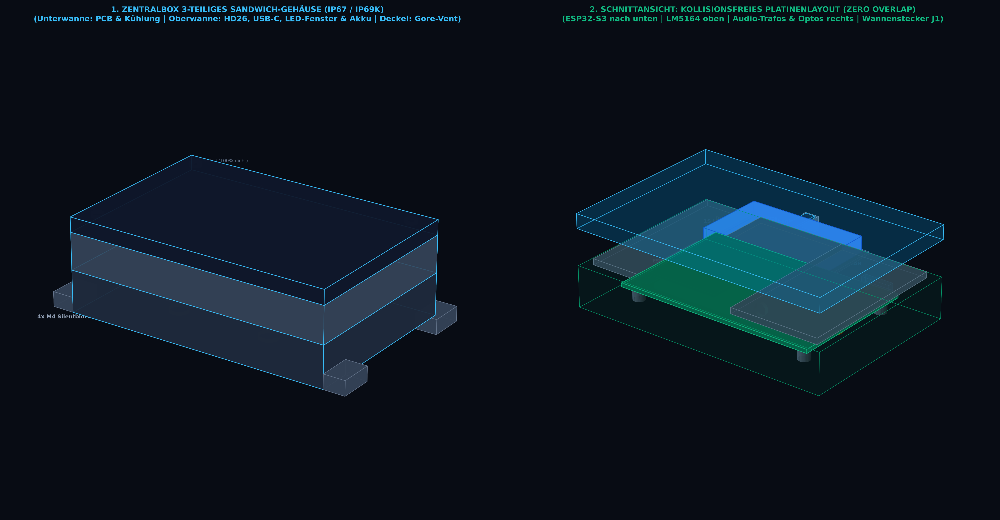

*Abbildung 5.1: 3D-CAD-Darstellung der zentralen Steuerbox. Links: Geschlossenes IP67-Gehäuse mit HD26-Kabelbaumflansch, USB-C Servicekappe und bündigem RGB-Statusfenster an der Stirnseite der Oberwanne, 4x M4 Silentblöcken an der Unterwanne und flachem Deckel mit Gore-Membran. Rechts: Schnittansicht mit den 3 Sandwich-Ebenen: 1. Unterwanne (4x Kupfer-Kühlbolzen, Silikonpad, 4-Layer PCB), 2. Oberwanne mit Zwischenboden (Akku mit EPDM-Spannband oben, 38x6 mm Flachband-Schlitz im Boden, Ports an Stirnwand), 3. Robuster Deckel mit Gore-Vent (100% dicht).*

```
┌────────────────────────────────────────────────────────────┐  ▲
│ 1. GEHÄUSEDECKEL (6,0 mm Höhe / 3,0 mm Wandstärke)         │  │
│    • Gore ePTFE Druckausgleichsmembran (Ø 7,0 mm)          │  │ 38,0 mm
│    • Umlaufende Nut mit Shore 40A Silikon-Profildichtung   │  │ Gesamt-
│    • 100% homogener, geschlossener Vollkunststoff-Deckel   │  │ höhe
├────────────────────────────────────────────────────────────┤  │
│ 2. OBERWANNE MIT ZWISCHENBODEN (15,0 mm Höhe)              │  │
│    • Stirnwand (Alle Anschlüsse & Anzeige):                │  │
│      - HD26 D-Sub Flansch (Haupt-Kabelbaum)                │  │
│      - Wasserdichter USB-C Service-Port (Alu-Schraubkappe) │  │
│      - Wasserdichtes RGB-Status-LED-Sichtfenster (Ø 3 mm)  │  │
│    • Oberes Fach (auf dem Zwischenboden):                  │  │
│      - 1S LiPo-USV-Pufferakku (52x36x6.5mm) in Akkuwanne   │  │
│      - EPDM-Gummispannband zur vibrationsfesten Fixierung  │  │
│    • Zwischenboden (Trennebene zur Unterwanne):            │  │
│      - 38,0 x 6,0 mm Flachbandkabel-Schlitz (R 1,5 mm)     │  │
│      - 4x Labyrinth-Druckausgleichsschlitze (15 x 2 mm)    │  │
├────────────────────────────────────────────────────────────┤  │
│ 3. UNTERWANNE (17,0 mm Höhe - Geschlossene Tauchwanne)     │  │
│    • 4-Layer Hauptplatine (85 x 55 mm) auf M2.5 Dämpfern   │  │
│    • 2,0 mm Silikon-Thermal-Gap-Pad (Shore 00 35, λ=3 W/mK)│  │
│    • 4x Massive Kupfer-Thermal-Pins (Ø 8 mm im Wannenboden)│  │
│    • 100% geschlossene Wanne ohne Gehäusedurchbrüche       │  │
└────────────────────────────────────────────────────────────┘  ▼
```

### 1.2 3D-Explosionsdarstellung & Schichtaufbau (1:1:1 CAD Fitting)

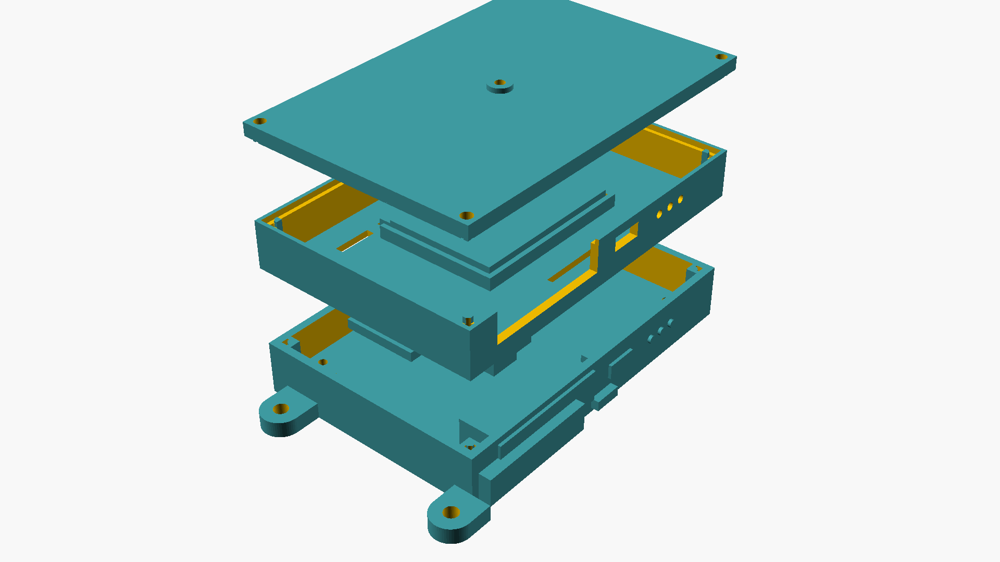

*Abbildung 5.1.1: 1:1:1 euklidische CAD-Explosionsdarstellung der Zentralbox. Gezeigt werden alle 6 Montageebenen entlang der vertikalen Z-Achse: Unterwanne mit 4x M4 Silentblöcken und 4x Cu-Thermal-Pins (Ø8mm), elastisches Silikon-Gap-Pad, 4-Layer Hauptplatine (85x55mm) mit J1 Wannenstecker, 26-poliges Flachbandkabel (AWG28), Oberwanne mit Zwischenboden und stirnseitigen Schnittstellen (HD26, USB-C, LED), 1S LiPo-Pufferakku im Konturbett mit EPDM-Spannband sowie der Gehäusedeckel mit Gore ePTFE-Membran.*

### 1.3 3D-Röntgenansicht & Zusammenbau-Fitting

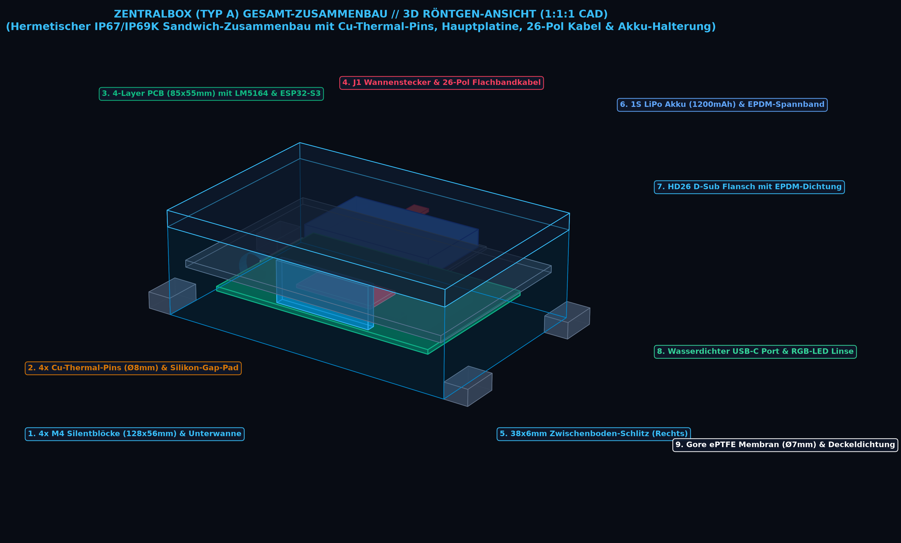

*Abbildung 5.1.2: Transparente 3D-Röntgenansicht der vollständig geschlossenen Zentralbox. Erkennbar sind die spielfreien Bauteilfreiräume, die geschützte Akku-Lagerung auf dem Zwischenboden und der scheuerfreie Bogen des 26-poligen Flachbandkabels durch den 38x6 mm Schlitz zum HD26-Flansch.*

### 1.4 Maßstabsgetreuer Längs- & Querschnitt (X-Z Thermik & Y-Z Kabelführung)


*Abbildung 5.1.3: Exakte 2D-Schnittansichten der Zentralbox. Oben: Längsschnitt (X-Z Ebene) mit vollständigem thermischem Pfad (Kupfer-Thermal-Pins $\rightarrow$ Silikon-Gap-Pad $\rightarrow$ LM5164/ESP32 Hotspots) und Akku-Kammer. Unten: Querschnitt (Y-Z Ebene) mit detailliertem Verlauf des 26-poligen Flachbandkabels von der Wannenbuchse J1 auf der Hauptplatine durch den abgerundeten 38x6 mm Zwischenbodenschlitz direkt zum abgedichteten HD26 SEAL-D Flansch an der Gehäusestirnwand.*

---

## 2. Thermomanagement & Kühlkonzept (In der Unterwanne)

Die untere Tauchwanne beherbergt die wärmeerzeugenden Komponenten: $100\,\text{V}$-Schaltregler (LM5164-Q1, bis zu $1{,}8\,\text{W}$), LiPo-Ladecontroller (BQ24075, bis zu $1{,}2\,\text{W}$) und ESP32-S3 DSP-Kern ($0{,}8\,\text{W}$). Zur Entwärmung verfügt die Unterwanne über ein **Solid-Copper-Thermal-Stud-System**:

```
      LEITERPLATTE (TOP & INNER LAYERS)
┌────────────────────────────────────────────────────────┐
│ [ LM5164 Buck ]     [ BQ24075 UPS ]     [ ESP32-S3 ]   │ ◄── Thermische Hotspots
│   (100V DCDC)       (Power-Path)        (Dual-Core)    │
├────────────────────────────────────────────────────────┤
│ ▓▓▓▓▓▓▓▓▓▓▓▓▓▓▓▓▓▓▓▓▓▓▓▓▓▓▓▓▓▓▓▓▓▓▓▓▓▓▓▓▓▓▓▓▓▓▓▓▓▓▓▓▓▓▓ │ ◄── Thermal Vias (GND Plane)
└──────────────────────────┬─────────────────────────────┘
                           │
 ┌─────────────────────────▼─────────────────────────────┐
 │ 2,0 mm Kompressibles Silikon-Gap-Pad (Shore 00 35)    │ ◄── λ = 3,0 W/(m·K)
 │ (Gleicht Bauteiltoleranzen & Vibrationen elastisch aus│
 └─────────────────────────┬─────────────────────────────┘
                           │
 ┌─────────────────────────▼─────────────────────────────┐
 │ 4x Solid Copper Thermal Studs (Ø 8,0 mm, Reinkupfer)  │ ◄── λ = 390 W/(m·K)
 │ Im Wannenboden eingepresst & hydrophob versiegelt     │     Direct Heat Sink
 └─────────────────────────┬─────────────────────────────┘
                           ▼
          Abgabe an Gehäuseboden / Motorradrahmen
```

### 2.1 Spezifikation der thermischen Komponenten:
1. **4x Massive Kupfer-Thermal-Pins ($\varnothing\,8{,}0\,\text{mm} \times 6{,}5\,\text{mm}$):**
   * Gefertigt aus Elektrolytkupfer (CW004A / E-Cu58, $\lambda = 390\,\text{W/(m}\cdot\text{K)}$).
   * Direkt im Boden der Unterwanne wasserdicht eingeschmolzen/eingepresst. Die Innenköpfe sind plan abgedreht ($\varnothing\,10\,\text{mm}$ Flachkopf), die Außenenden schließen plan mit der Wannenunterseite ab oder koppeln thermisch an den Fahrzeugrahmen.
   * Positioniert exakt unter den 3 primären Hotspots:
     - **Pin 1 & 2:** Unter der $100\,\text{V}$-Spannungsversorgung (LM5164-Q1 & Speicherdrossel $L_1$).
     - **Pin 3:** Unter dem USV-Ladecontroller BQ24075.
     - **Pin 4:** Unter dem ESP32-S3 Dual-Core DSP-Modul.
2. **Kompressibles Silikon-Thermal-Gap-Pad ($60 \times 40 \times 2{,}0\,\text{mm}$):**
   * Extrem weiches, vibrationsdämpfendes Silikon (*Bergquist Gap Pad 3000S30* / *Laird Tflex HD90000*, Shore 00 35, $\lambda = 3{,}0\,\text{W/(m}\cdot\text{K)}$).
   * Komprimiert sich bei Montage der Hauptplatine um ca. $30\,\%$ ($0{,}6\,\text{mm}$ Kompression), gleicht Fertigungstoleranzen spielfrei aus und verhindert mechanische Scherkräfte auf SMD-Lötstellen.
3. **Ergebnis:** Der thermische Gesamtwiderstand sinkt von $> 45\,\text{K/W}$ (reines Kunststoffgehäuse) auf **$< 5{,}8\,\text{K/W}$**. Die maximale Chiptemperatur des LM5164 bleibt selbst bei $+50\,^\circ\text{C}$ Umgebungstemperatur unter der Sitzbank sicher unter $+78\,^\circ\text{C}$ (zulässig bis $+125\,^\circ\text{C}$).

---

## 3. Oberwanne: Stirnseitige Schnittstellen, Akku & Zwischenboden

Die Oberwanne bildet das mittlere Funktionsmodul des Sandwich-Aufbaus: Sie bündelt an ihrer Stirnseite alle von außen zugänglichen Schnittstellen und Anzeigen und nimmt auf der Oberseite des integrierten Zwischenbodens den USV-Pufferakku auf.

```
┌─────────────────────────────────────────────────────────────┐
│                 OBERWANNE (Draufsicht auf Zwischenboden)    │
│                                                             │
│  ┌─────────────────────────┐  ┌──────────────────────────┐  │
│  │ 1. AKKU-AUFNAHMEWANNE   │  │ 2. Flachbandkabel-Schlitz│  │
│  │    (52 x 36 x 6.5 mm)   │  │    (38,0 x 6,0 mm, R1,5) │  │
│  │    mit EPDM-Spannband   │  │    führt zu J1 auf PCB   │  │
│  │    [4P JST-PH Tülle]    │  └──────────────────────────┘  │
│  └─────────────────────────┘                                │
│                                                             │
│  [Slot 1]              [Slot 2]              [Slot 3]       │
│  ◄──────── 4x Interne Druckausgleichsschlitze ─────────────►│
├─────────────────────────────────────────────────────────────┤
│  STIRNWAND: [ USB-C Port ]   [ RGB-LED ]   [ HD26 Flansch ] │
└─────────────────────────────────────────────────────────────┘
```

### 3.1 1S LiPo-Akkuaufnahme & 4-Poliger JST-PH Anschluss (Auf Zwischenboden)
* **Passgenaue Aufnahmewanne ($52{,}0 \times 36{,}0 \times 6{,}5\,\text{mm}$):** Auf der Oberseite des Zwischenbodens angeformte Wanne, ausgekleidet mit $1{,}0\,\text{mm}$ EPDM-Moosgummi zur Stoßdämpfung.
* **Elastisches EPDM-Gummispannband (Shore 50A, $10\,\text{mm}$ breit):** Spannt die Akkuzelle quer über die Wanne. Die Endösen klinken werkzeuglos in zwei Hinterschnitt-Rasthaken der Oberwannen-Seitenwände ein. Der Akku bleibt damit vibrationsfest und spielfrei fixiert, kann aber bei Wartungsarbeiten werkzeuglos getauscht werden.
* **Kombiniertes 4-Draht-Kabel (JST-PH 2.0 mm Wannenstecker):** 
  * Der Akku und der integrierte NTC-Sensor sind über einen einzigen, verpolsicheren **4-Pin JST-PH Stecker mit Verriegelungsnase** (`J5`) angeschlossen:
    * Pin 1: `BAT+` (+3.7V / +4.2V 1S LiPo)
    * Pin 2: `BAT-` (`GND_PWR`)
    * Pin 3: `NTC_JEITA` (10k NTC Temperaturüberwachung)
    * Pin 4: `NTC_GND` (Sensor-Masse)
  * Das Kabel führt durch eine abgerundete $\varnothing\,5\,\text{mm}$ Tülle im linken Zwischenboden direkt nach unten zur Buchse `J5` an der linken Vorderkante der Hauptplatine (mit $> 12\,\text{mm}$ Sicherheitsabstand zum ESP32-S3).

### 3.2 Spezifikation der Zwischenboden-Durchführungen
1. **Flachbandkabel-Durchführung für Haupt-Kabelbaum:**
   * **Abmessungen:** $38{,}0 \times 6{,}0\,\text{mm}$ mit beidseitig $R=1{,}5\,\text{mm}$ Kantenverrundung.
   * **Position:** Liegt auf der rechten Seite fluchtend direkt über der 2x13 Wannenbuchse `J1` auf der Hauptplatine.
   * **Kabelführung:** Das $45\,\text{mm}$ lange 26-polige Flachbandkabel führt vom stirnseitigen HD26-Flansch in der Oberwanne durch diesen Schlitz nach unten zur Hauptplatine.
2. **Labyrinth-Druckausgleichsschlitze:**
   * 4x Belüftungsschlitze ($15{,}0 \times 2{,}0\,\text{mm}$) verbinden den unteren Elektronikraum mit dem oberen Raum und der ePTFE-Membran im Deckel.

---

## 4. Stirnseitige Anschlüsse & Anzeige in der Oberwanne (USB-C, RGB-LED & HD26)

Alle drei Interaktions- und Anschlusselemente befinden sich kompakt und geschützt nebeneinander an der **vorderen Stirnwand der Oberwanne**:

```
                  VORDERE STIRNWAND DER OBERWANNE
┌─────────────────────────────────────────────────────────────┐
│ ┌────────────┐     ┌────────┐      ┌──────────────────────┐ │
│ │ 1. USB-C   │     │ 2. RGB │      │ 3. HD26 D-Sub Flansch│ │
│ │    Service │     │    LED │      │    (Kabelbaum-Buchse)│ │
│ │    Alukappe│     │    Ø3mm│      │    2x M3 Jackscrews  │ │
│ └────────────┘     └────────┘      └──────────────────────┘ │
└─────────────────────────────────────────────────────────────┘
```

### 4.1 HD26 D-Sub Gehäusewand-Flansch (Kabelbaum-Hauptanschluss)
* **Ausschnitt-Geometrie:** D-Sub High-Density 26-Pin Ausschnitt ($39{,}2 \times 15{,}4\,\text{mm}$) in der Stirnwand der Oberwanne.
* **Flanschdichtung:** Formgenaue EPDM-Flachdichtung ($1{,}5\,\text{mm}$ Stärke, Shore 60 A) zwischen Metallkragen der Amphenol LTW / NorComp SEAL-D Buchse und der Gehäusewand.
* **Verschraubung:** 2x M3 Edelstahl-Sechskantbolzen mit O-Ring-Dichtscheiben klemmen den Flansch mit $0{,}6\,\text{Nm}$ wasserdicht gegen die Wand.
* **Interne Entkopplung:** Verbindung zur Hauptplatine über das 26-polige Flachbandkabel durch den Zwischenboden-Schlitz zur 2x13 Wannenbuchse (`J1`).

### 4.2 Wasserdichter USB-C Programmier- & Service-Port
* **Zugang ohne Gehäuseöffnung:** Direkt neben dem HD26-Flansch befindet sich der wasserdichte USB-C Service-Port mit **blau eloxierter Aluminium-Schraubkappe** und rotem NBR/Silikon-O-Ring.
* **Funktion:** Ermöglicht Firmware-Updates, ESP-IDF JTAG-Debugging und Diagnose im eingebauten Zustand unter der Sitzbank, ohne dass das IP67-Gehäuse aufgeschraubt werden muss.

### 4.3 Wasserdichtes RGB-Status-LED-Sichtfenster
* **Frontbündige Linse:** Ein diffuser PMMA-Linsenkörper ($\varnothing\,3{,}0\,\text{mm}$, *Mentor 1292.1101*) ist mit umlaufendem NBR-O-Ring frontbündig in die Stirnwand der Oberwanne eingepresst und mit transparentem Polyurethan versiegelt.
* **Blickwinkel:** Zeigt den Betriebszustand direkt an der Frontseite an, sodass der Fahrer / Mechaniker beim Blick unter die Sitzbank auf die Stecker sofort den Status sieht.

### 4.4 Status-Farbcodierung (LED State Machine)

| LED-Farbe & Muster | Betriebszustand | Bedeutung |
| :--- | :--- | :--- |
| 🟢 **Grün pulsierend (1 Hz)** | **Normalbetrieb (Online)** | Bordnetz aktiv, alle gesteckten Pods aktiv, DLE OK |
| 🔵 **Blau blinkend (2 Hz)** | **BLE Dashboard / Pairing** | WebApp PWA aktiv verbunden / Datenaustausch |
| 🟡 **Gelb pulsierend (0.5 Hz)**| **USV-Akkubetrieb (KL15 AUS)**| Nachlauf-Modus: GPX Tour-Close & WebDAV Sync |
| 🔴 **Rot schnell blinkend** | **Warnung / Fehler** | Unterspannung Starterbatterie ($< 11{,}8\,\text{V}$) / Kassetten-Kurzschluss |
| 🟣 **Lila leuchtend** | **OMM DLE Leader** | Dieses Motorrad führt die Mesh-Koordination der Gruppe |
| ⚪ **Weiß Doppelblitz** | **Actioncam Marker** | Lenkertaster gedrückt: GPS Highlight-Marker gesetzt |

---

## 5. Gehäusedeckel: Robuste 100% dichte Schutzhaube mit Druckausgleich

Der Gehäusedeckel schließt die Oberwanne nach oben hermetisch ab. Da sich alle Anschlüsse und die Status-LED in der Oberwanne befinden, ist der Deckel als **robuste, homogene Schutzhaube** ohne bruchanfällige Lichtleiterbohrungen ausgeführt:

* **Geometrie & Wandstärke:** $110{,}0 \times 74{,}0 \times 6{,}0\,\text{mm}$, $3{,}0\,\text{mm}$ durchgehende PA12-Wandstärke.
* **Druckausgleich:** Ein zentrales Gore ePTFE-Schraubventil ($\varnothing\,7{,}0\,\text{mm}$, M8-Gewinde) gleicht Luftdruckschwankungen (Passfahrten bis $3.000\,\text{m}$ Höhe) und thermische Atmungseffekte zuverlässig aus.
* **Hermetische Abdichtung:** Umlaufende Shore 40A Silikon-Profildichtung in der Deckelnut, verschraubt über 4x M3 Edelstahlschrauben in Ruthex-Gewindeeinsätze der Unterwanne.
* **Wartungsvorteil:** Zum Tausch des Pufferakkus oder zur Inspektion kann der Deckel werkzeuglos abgenommen werden, ohne dass Kabel oder optische Lichtleiter gelöst werden müssen.

---


## 5. Gehaeuse Typ B: Universeller Satelliten-Pod (Identisch fuer Pod 1, 2 und 3)

- **Vollstaendige Modularitaet:** Alle 3 Pod-Positionen am Motorrad nutzen das identische, universelle Gehaeuse im **generischen Maximal-Envelope ($120{,}0 \times 64{,}0 \times 32{,}0\,\text{mm}$)**.
- **Abmessungen Schacht:** $96{,}0 \times 56{,}0 \times 24{,}0\,\text{mm}$ (PA12 MJF, $3{,}0\,\text{mm}$ Wandstärke).
- **Elektronik-Kassette / Schlitten:** $92{,}0 \times 54{,}0 \times 23{,}5\,\text{mm}$ (Lichter Innenbauraum: $88{,}0 \times 50{,}0 \times 23{,}5\,\text{mm}$).

### 5.1 2-Teilige modulare Kassetten-Architektur (Universal-Unterschlitten & Modul-Oberteil)

Um maximale Flexibilität bei minimalen Fertigungskosten zu erzielen, ist jede Wechselkassette als **2-teiliges modulares Baugruppensystem** aufgebaut:

```
                      MODULARE 2-TEILIGE WECHSELKASSETTE
┌─────────────────────────────────────────────────────────────────────────────┐
│ 1. AUSTAUSCHBARES MODUL-OBERTEIL (3D-Konturbett & Haltenest):               │
│    • Spezifisch für Sena 50S/60S, Cardo Air-Mount oder Midland XT30/PMR     │
│    • Integriertes Pogo-Pin Kontaktfeld / N52-Magnete / EPDM-Spannlasche     │
│    • 10.0 x 3.0 mm Kabeldurchbruchsschlitz (R=1.0 mm) in den Unterflurkanal │
├─────────────────────────────────────────────────────────────────────────────┤
│ 2. AKUSTISCHE TPU-DÄMPFUNGSZWISCHENLAGE (Shore 40A, 0.5 mm - Klapperschutz) │
├─────────────────────────────────────────────────────────────────────────────┤
│ 3. GENERISCHER UNIVERSAL-UNTERSCHLITTEN (Universal Base Sled):              │
│    • 100% identisch für ALLE Headset- und Funk-Varianten                    │
│    • Bodenfach für Trägerplatine (openmotorbridge_pod_cartridge, 35x25mm)   │
│    • Stirnseitiger Sitz für 6-Pin Buchse J1 & axialer JST-SH Header J2      │
│    • 1.5 mm tiefer Unterflur-Kabelkanal & 4x M2 Ruthex-Gewindeeinsätze      │
│    • Poka-Yoke Führungsrippen (1.5 / 2.0 mm) & Snap-Fit Schnellverriegelung │
└─────────────────────────────────────────────────────────────────────────────┘
```

#### Konstruktive Aufteilung & Dichtungskonzept:
1. **Generischer Universal-Unterschlitten (Base Sled, $92{,}0 \times 54{,}0 \times 23{,}5\,\text{mm}$):**
   * Bildet das robuste PA12-Grundchassis mit den seitlichen Poka-Yoke Führungsrippen und den Schnappriegel-Rastnasen.
   * Beherbergt im vorderen Bodenfach die standardisierte $35{,}0 \times 25{,}0\,\text{mm}$ Kassetten-Trägerplatine (`openmotorbridge_pod_cartridge`) mit dem Maxim DS2401 ID-Chip und der stirnseitigen 6-Pin Buchsenleiste `J1`.
   * Besitzt einen **$1{,}5\,\text{mm}$ tiefen und $8{,}0\,\text{mm}$ breiten Unterflur-Kabelkanal** im Boden sowie 4x eingelassene M2 Messing-Gewindeeinsätze (*Ruthex M2*).
2. **Austauschbares Modul-Oberteil (3D-Konturbett Inlay):**
   * Das Oberteil wird individuell an das jeweilige Headset-Modell angepasst (z. B. Sena 50S Klickbett mit Rastriegel, Cardo Packtalk Edge mit 2x N52 Magneten, Midland XT30 Klemmschiene).
   * Enthält den **$10{,}0 \times 3{,}0\,\text{mm}$ Kabeldurchbruchsschlitz** mit beidseitig $R=1{,}0\,\text{mm}$ verrundeten Kanten, durch den das 6-adrige JST-SH Flachbandkabel vom Unterflurkanal direkt an die Lötseite des Kontaktfeldes (Pogo-Array / Air-Mount) geführt wird.
   * Wird mit **4x M2 Senkkopfschrauben** (Edelstahl V4A) fest mit dem Unterschlitten verschraubt. Beim Wechsel des Headset-Herstellers muss der Fahrer lediglich das 3D-gedruckte Oberteil tauschen – die Elektronik-Trägerplatine bleibt erhalten.
3. **Dichtungskonzept (Klarstellung zur Gehäuseabdichtung):**
   * **Die IP67/IP69K-Wasserdichtigkeit wird vollständig am vorderen Stirnflansch des Pod-Gehäuses hergestellt:** Die umlaufende Shore 40A Silikondichtung der Kassettenblende dichtet den gesamten Wechselschacht beim Einrasten hermetisch gegen Strahlwasser und Staub ab.
   * Da das Innere des Pod-Schachts im Betrieb **zu 100 % trocken und geschützt** ist, ist **zwischen Kassetten-Unterteil und Kassetten-Oberteil keine druckdichte IP67-Flachdichtung erforderlich**.
   * Eine dünne $0{,}5\,\text{mm}$ Shore 40A TPU/Silikon-Zwischenlage zwischen Unter- und Oberteil dient rein der mechanischen Schwingungsentkopplung und dem Klapperschutz bei harten Fahrbahnstößen.

```
                  ◄──────────── 64.0 mm Pod-Breite ────────────►
 ┌─────────────────────────────────────────────────────────────┐ ▲
 │                    3.0 mm Gehäuse-Deckel                    │ │
 │ ┌───┬─────────────────────────────────────────────────┬───┐ │ │ 32.0 mm
 │ │   │                                                 │   │ │ │ Pod-
 │ │3.0│      OFFENER SCHLITTEN-BAURAUM (KEIN DECKEL!)   │3.0│ │ │ Höhe
 │ │mm │      Volle 23.5 mm lichte Bauhöhe für Antennen  │mm │ │ │
 │ │   │      Headset-Inlays & OMM-Transceiver-Module    │   │ │ │
 │ │Nut├───────────► ┌─────────────────────┐ ◄───────────┤Nut│ │ │
 │ │1.5│             │  6-PIN BUCHSE       │             │2.0│ │ │
 │ │mm │             │  (Piston-Einschub)  │             │mm │ │ │
 │ │   │             └─────────────────────┘             │   │ │ │
 │ └───┴─────────────────────────────────────────────────┴───┘ │ │
 │                    3.0 mm Gehäuse-Boden                     │ │
 └─────────────────────────────────────────────────────────────┘ ▼
```

#### Vorteile des offenen Großraum-Schlittens:
1. **100% generische Kompatibilität:** Passt für alle gängigen Headset-Formfaktoren (Sena 50S/60S, Cardo Packtalk Edge/Pro/Bold, Midland) sowie für das eigenständige OpenMotorMesh-Transceiver-Modul mit GNSS & LoRa.
2. **Keine Doppelwandung:** Es wird kein separater Kassetten-Deckel benötigt. Das spart Materialstärke und eliminiert eine dämpfende Luftschicht.
3. **Volle Innenraumhöhe ($23{,}5\,\text{mm}$):** GNSS-Keramik-Patchantennen ($25 \times 25 \times 4\,\text{mm}$), LoRa-Helical-Spulen, Akkus und Headset-Module haben uneingeschränkten Freiraum nach oben.
4. **Schutz durch Pod-Hülle:** Nach dem Einschieben übernimmt die geschlossene, wetterfeste PA12-Decke des Pod-Gehäuses ($3{,}0\,\text{mm}$) den robusten mechanischen und hermetischen Schutz nach oben.

---

### 5.2 IP67-Seitendichtung (Stirnflansch) & Snap-Fit Click-Verriegelung

```
    AUSSENSEITE (IP67)                        POD-EINSCHUB-SCHACHT
┌─────────────────────────┐               ┌─────────────────────────────────┐
│ PA12-Abschlussblende    │  Umlaufende   │ Offener U-Einschubschlitten     │
│ mit Griffleiste          ├── Flansch- ───┤ mit Kassettenplatine & Modul    │
│ Duale Snap-Fit Rasten   │  Dichtung     │ ──► Gleitet über Poka-Yoke Nut  │
│ (Taktiles "Klick")      │  (Shore 40A)  │ ──► Buchse gleitet in Shroud    │
└─────────────────────────┘               └─────────────────────────────────┘
```

1. **Umlaufende Stirnflansch-Dichtung (IP67 Seal):**
   * Die äußere Abschlussblende des Schlittens besitzt eine integrierte Nut mit einer **Shore 40A Silikon-Profildichtung** ($1{,}5\,\text{mm}$ Schnurstärke).
   * Beim vollständigen Einschieben presst die Stirnblende die Dichtung gegen den Gehäusekragen des Pods und dichtet den gesamten Schacht **zu 100% wasser- und staubdicht nach IP67** ab.
2. **Duale Snap-Fit Schnellverriegelung (Click-Lock):**
   * Integrierte POM/PA12-Rastnasen an den Seitenwänden des Schlittens rasten beim Erreichen des Endanschlags formschlüssig in die Rastkerben des Pod-Gehäuses ein.
   * Die elastische Kompression der Silikondichtung sorgt für ständige Zugspannung – **absolut vibrationsfest, rüttelsicher (> 20 g) und spielfrei**.
   * **Werkzeuglose Entriegelung:** Zwei seitliche ergonomische Entriegelungstaster an der Blende lösen die Rastung durch einfaches Zusammendrücken mit Daumen und Zeigefinger.
3. **Integrierte ePTFE-Druckausgleichsmembran an der Kassetten-Frontblende:**
   * Beim Einschieben des Schlittens dichtet die umlaufende Silikon-Flanschdichtung den Schacht bereits kurz vor Erreichen des Endanschlags ab. Ohne Druckausgleich würde die verdrängte Luft wie ein pneumatischer Kolben komprimieren und das Einrasten erschweren.
   * Direkt in die Kassetten-Frontblende ist eine **$\varnothing\,6{,}0\,\text{mm}$ Gore ePTFE-Membran** integriert. Sie lässt Luft beim Einschieben widerstandslos entweichen, gleicht thermische Druckdifferenzen bei Regen oder Sonneneinstrahlung aus und hält Wasser sowie Staub zu $100\,\%$ nach IP67 ab.

---

### 5.3 Kassetten-Trägerplatine (`openmotorbridge_pod_cartridge`)

Die universelle Kassetten-Trägerplatine bildet das Herzstück jeder Wechselkassette. Sie dient als mechanische und elektrische Brücke zwischen der fahrzeugseitigen Pod-Basis und den internen Docking-Kontakten der jeweiligen Headset-Schale:

#### Oberansicht (Inlay-Header, 1-Wire ID & Entkopplung):
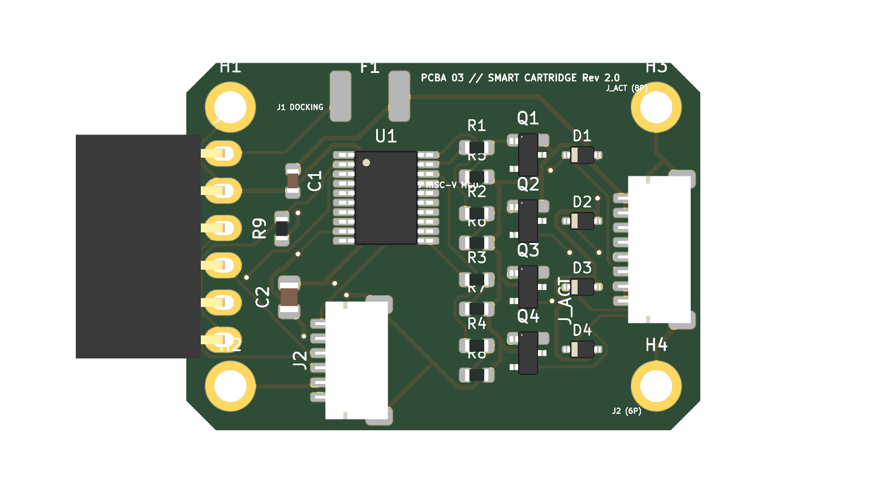

#### Unteransicht (6-Pin Buchsenleiste zum direkten Aufstecken auf die Pod-Basis):
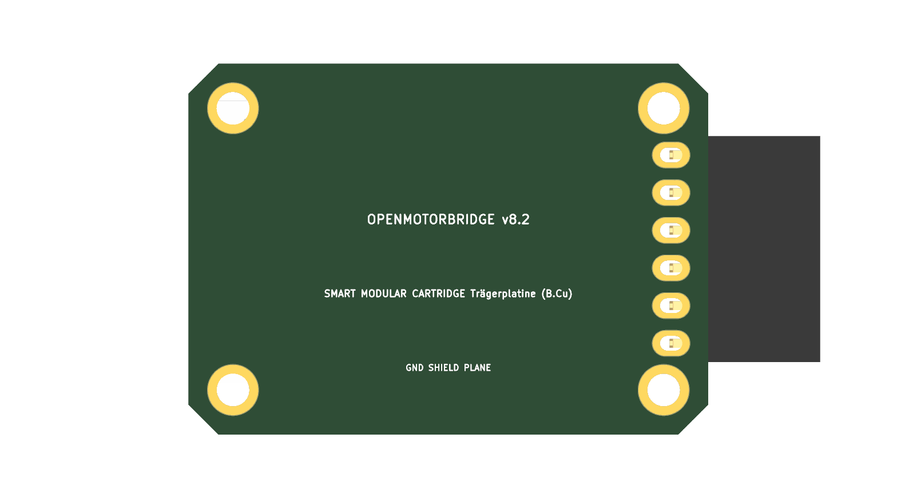

*Abbildung 5.1: Photorealistisches 3D-Raytracing-Render der Kassetten-Trägerplatine (KiCad 8.0, 35.0 x 25.0 mm, ENIG Gold mit nach unten öffnender 6-Pin Buchsenleiste auf B.Cu, Low-Profile JST-SH 1.0 mm Header auf F.Cu und Maxim DS2401 ID-Chip).*

#### Platinenaufbau im Detail:
* **Unterseite (`B.Cu` – Gegenstelle zur Pod-Basis):**
  * **6-Pin Buchsenleiste (`J1` / PinSocket 2.54 mm):** Sitzt zentriert auf der Unterseite und öffnet senkrecht nach unten. Beim Einschieben der Kassette gleiten die nach oben ragenden Pins der Pod-Basis direkt und formschlüssig in diese Buchse.
  * **Massefläche (`GND Shield Plane`):** Großflächige Kupferanbindung zur Abschirmung und Stabilisierung.
* **Oberseite (`F.Cu` – Docking-Schnittstelle & ID):**
  * **Low-Profile Inlay-Header (`J2`):** Um 90° gekippter **JST-SH 1.0 mm 6-Pin SMD-Steckverbinder** (Bauhöhe nur $1{,}8\,\text{mm}$). Ein kurzes internes Kabel verbindet diesen Header werkzeuglos mit dem im Kassetten-Deckel integrierten Docking-Schacht des Nutzers.
  * **Digitaler Kassetten-ID-Chip (`U1`):** **Maxim DS2401Z+** Silicon Serial ROM (SOT-23) speichert eine weltweit eindeutige 64-Bit ROM-ID. Die Zentralbox erkennt beim Einstecken in Millisekunden, welches Headset-Profil geladen werden muss (z. B. `sena_50_series.json`, `cardo_dmc_gen2.json`).
  * **Entkopplungskondensator (`C1`):** 100nF 0603 Keramikkondensator zur Filterung der 1-Wire-Busleitung.
* **Mechanische Schwingungsdämpfung (`H1`, `H2`):**
  * 2x M2-Befestigungsbohrungen mit Shore 40A Silikonhülsen lagern die Platine schwimmend im PA12-Kassettengehäuse gegen Fahrbahnstöße bis zu $20\,\text{g}$.

---

### 5.2 Benutzerzentrierte Plug & Play Docking-Architektur (0 Lötaufwand)

Ein zentrales Entwicklungsziel von OpenMotorBridge ist die **100 % zerstörungsfreie und löt-freie Nutzung** durch jeden Motorradfahrer:

```
┌─────────────────────────────────────────────────────────────┐
│ WECHSELKASSETTE (z. B. "Sena 50S" oder "Cardo Edge Edition")│
│                                                             │
│  ┌───────────────────────────────────────────────────────┐  │
│  │ DOCKING-SCHACHT & 3D-KONTUR-NEGATIVBETT               │  │
│  │ (Fahrer klickt sein Original-Headset hier ein)        │  │
│  │                                                       │  │
│  │  [ Originale Gegen-Federkontakte / Pogo-Pins ]        │  │
│  └──────────────────────────┬────────────────────────────┘  │
│                             │ Geschützter JST-SH Kabelkanal │
│                             │ (1.5mm Schacht unter Bettung) │
│                             ▼                               │
│  ┌───────────────────────────────────────────────────────┐  │
│  │ KASSETTEN-TRÄGERPLATINE (Carrier PCB, 60x36mm)        │  │
│  │  - J2: JST-SH 6P Header (Oberseite F.Cu)              │  │
│  │  - U1: DS2401 ID-Chip (Meldet Gerätetyp an ESP32)     │  │
│  │  - J1: 6-Pin Buchse (Unterseite B.Cu)                 │  │
│  └──────────────────────────┬────────────────────────────┘  │
└─────────────────────────────┼───────────────────────────────┘
                              ▼ (Steckt beim Kassetteneinschub)
┌─────────────────────────────┼───────────────────────────────┐
│ POD-BASISPLATINE            │                               │
│  - J1: 6-Pin PinHeader ◄────┘ (Oberseite)                   │
│  - U1: SP3012 TVS-Schutzmatrix                              │
│  - J2: Zentrierte M8 6-Pin IP67 Buchse (Unterseite)         │
└─────────────────────────────┬───────────────────────────────┘
                              ▼
        M8-Kabelbaum zum Motorrad / Zentralbox
```

#### 5.2.1 Geschützter interner JST-SH Kabelkanal & Anschlusspunkte an den Adaptern

Um die Signale vom 90°-abgewinkelten **JST-SH 1.0 mm 6-Pin SMD-Steckverbinder (`J2`)** auf der Kassetten-Trägerplatine absolut verwechslungs- und knickfrei zu den Kontaktpunkten des jeweiligen Adapters zu führen, besitzt der Kassetten-Schlitten folgende Struktur:

1. **Geschützter Unterflur-Kabelkanal & Zwischenboden-Durchführung (*Under-Bed Routing & Pass-Through Slot*):**
   * **Kabeldurchführung im Kassetten-Zwischenboden:** Ein präziser **$10{,}0 \times 3{,}0\,\text{mm}$ Durchbruch mit beidseitig $R=1{,}0\,\text{mm}$ verrundeten Kanten** im Zwischenboden des PA12-Schlittens führt das Flachbandkabel von Header `J2` auf der unteren Trägerplatine nach oben in das 3D-Konturbett.
   * **Unterflur-Kanal:** Im Boden des PA12-Schlittens ist eine **$1{,}5\,\text{mm}$ tiefe und $8{,}0\,\text{mm}$ breite Kabelführung** direkt unterhalb des 3D-Kontur-Negativbetts integriert.
   * Das hochflexible, silikonisolierte 6-adrige JST-SH Flachbandkabel liegt vollständig verdeckt unter dem Dämpfungsinlay. Beim Einsetzen oder Entnehmen des Intercoms besteht keinerlei Kontakt oder Quetschgefahr.
2. **Standardisierte Pin-Belegung am JST-SH 6P Header (`J2`):**

| Pin | Signal-Name | Funktion am Headset-Adapter | Sena 50S/60S Pad | Cardo Edge Pad | Midland XT / PMR |
| :---: | :--- | :--- | :--- | :--- | :--- |
| **1** | `GND` | Gemeinsamer Massebezug | Pin 1 (GND) | Pin 1 (GND) | Masse / Shield |
| **2** | `5V_VBUS` | Gefilterte Ladespeisung (500mA PTC) | Pin 2 (USB-5V) | Pin 2 (5V Charge)| 5V DC In |
| **3** | `AUDIO_R+` | Audio Diff-Out + (zum Lautsprecher-In) | Pin 4 (Spk R+) | Pin 3 (Spk +) | Speaker In + |
| **4** | `AUDIO_R-` | Audio Diff-Out - (Lautsprecher-Rückleiter)| Pin 5 (Spk R-) | Pin 4 (Spk -) | Speaker In - |
| **5** | `MIC_IN+` | Audio Diff-In + (vom Mikrofon-Out) | Pin 6 (Mic +) | Pin 5 (Mic +) | Mic Out + |
| **6** | `OPTO_PTT` | Optokoppler PTT / Button Synthesis | Pin 7 (Mesh-Btn)| N/C (Aux) | PTT Switch |

3. **Verbindungspunkte an den drei Ziel-Adaptern:**
   * **Sena 50S / 60S:** Das JST-SH Kabel mündet an der Lötseite der 7-Pin Federkontaktleiste (Pogo Pins) im Konturbett. Die Pins drücken federnd direkt auf die vergoldeten Sena-Außenkontakte.
   * **Cardo Packtalk Edge / Pro:** Das JST-SH Kabel kontaktiert die 5 Federpads des magnetischen Air Mounts von unten.
   * **Midland XT / PMR446:** Das JST-SH Kabel wird wahlweise mit einer 4-Pin Stiftleiste auf die entkernte Platine gesteckt oder direkt an die 2-Pin Doppelklinkenbuchse ($2{,}5\,\text{mm} + 3{,}5\,\text{mm}$) der Frontblende gelötet.

#### Modulare Kassetten-Varianten (Community- & 3D-Druck-Vorlagen):
1. **Sena 50S / 60S / 30K / 20S EVO Edition:** Nutzt die originale Federkontakt-Leiste des Helm-Klemmsatzes. Das Gerät wird einfach von oben eingerastet.
2. **Cardo Packtalk Edge / Pro Edition:** Integriert das magnetische *Air Mount*-Kontaktfeld für werkzeugloses Andocken.
3. **Cardo Packtalk Bold / Black Edition:** Nutzt die Schiebe-Gegenkontakte der Cardo-Audiokit-Basis.
4. **Midland Intercom Edition (BT Mini / BTR1 Advanced / Rush / Wave):** Docking-Aufnahme für Midland Bluetooth- und Wave-Mesh-Intercoms ($70\dots 85\,\text{mm}$ Baubreite).
5. **Midland XT / Compact PMR446 Bare-Board Edition:** Nimmt die entkernte Platine eines kompakten Midland-Handfunkgeräts (z. B. XT10/XT30/G5, $\approx 68 \times 42 \times 10\,\text{mm}$ ohne Batteriefach) direkt im Schlitten auf. Stromversorgung direkt über 5V-Bordnetz, PTT-Steuerung über PhotoMOS-Relais.
6. **Integrierte PMR446 Transceiver-Edition (SA818S / RDA1846):** Vollständig integriertes 500mW PMR446-Analogfunkmodul ($38 \times 20\,\text{mm}$) direkt auf der Kassetten-Trägerplatine – wahlweise mit interner 446-MHz-Helix oder robuster SMA-Frontbuchse.
7. **PMR446 Doppelklinken-Adapter Edition:** Spritzwassergeschützter Midland/Kenwood 2-Pin Anschluss ($2{,}5\,\text{mm} + 3{,}5\,\text{mm}$) an der Kassettenblende zum Anstecken externer Großgeräte (Midland G9 Pro / G13).

---

### 5.3 Detaillierte Fixiermechanismen: 3D-Kontur-Negativbett & EPDM-Spannlasche

Zur vibrationsfesten, spielfreien und werkzeuglosen Arretierung der Intercoms und Funkmodule kombiniert jede Kassette ein **dreistufiges Haltesystem**:

```
 ┌─────────────────────────────────────────────────────────────┐
 │       ELASTISCHE EPDM-SPANNLASCHE MIT SCHNELL-PULLTAB       │ ◄─── Zieht Gerät nach unten
 └──────────────────────────────┬──────────────────────────────┘
                                ▼
 ┌─────────────────────────────────────────────────────────────┐
 │        ORIGINAL-HEADSET (SENA 50S / CARDO EDGE / MIDLAND)   │
 └──────────────────────────────┬──────────────────────────────┘
                                ▼ (Form- & Kraftschluss)
 ┌─────────────────────────────────────────────────────────────┐
 │ 3D-KONTUR-NEGATIVBETT (Exaktes Negativ der Geräte-Rückseite)│ ◄─── 100% spielfrei & zentriert
 │  • Schwingungsdämpfende TPU/NBR-Bettung (Shore 40A, 0.8 mm) │
 │  • Integrierte OEM-Schnappriegel / Neodym-Magnete           │
 └─────────────────────────────────────────────────────────────┘
```

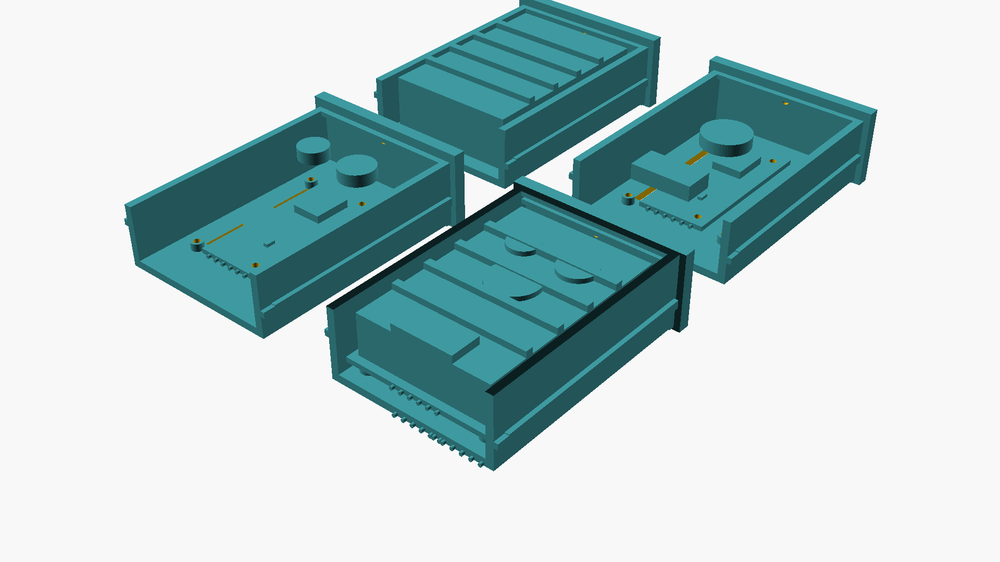

*Abbildung 5.2: 3D-CAD-Visualisierung der drei Referenz-Kassettenaufnahmen mit formschlüssigem 3D-Kontur-Negativbett und elastischer EPDM-Spannlasche im offenen Großraum-Schlitten ($92 \times 54 \times 23{,}5\,\text{mm}$): Sena Quick-Snap Cradle (links), Cardo Magnetic Air Mount (Mitte) und Midland Dovetail Slide / Bare-PCB Inlay (rechts).*

#### 1. Sena 50S / 60S Kontur-Nest & Snap-Cradle
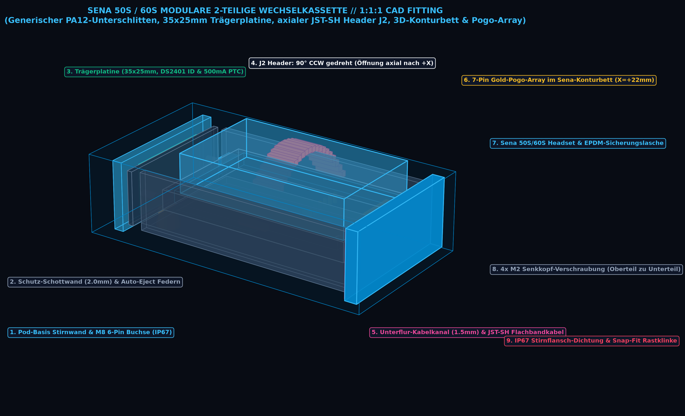

*Abbildung 5.2: 1:1:1 euklidische CAD-Visualisierung der Sena 50S/60S 2-teiligen Wechselkassette im Satelliten-Pod. Erkennbar sind der generische Unterschlitten mit Trägerplatine (35x25 mm) und axialem JST-SH Header J2, der 1.5 mm Unterflur-Kabelkanal, das austauschbare 3D-Konturbett mit 7-Pin Gold-Pogo-Array bei X = +22 mm und die EPDM-Spannlasche.*

* **3D-Kontur-Negativbett:** Der Schlittenboden ist als exaktes 3D-Negativ der Sena-Gehäuseunterseite ausgeformt. Das Gerät sinkt $4{,}0\,\text{mm}$ tief in die Aussparung ein und kann sich in $X$- und $Y$-Richtung nicht um einen Zehntelmillimeter verschieben.
* **OEM-Klick-Arretierung:** Formschlüssige untere Haltenase ($4{,}0\,\text{mm}$ *Bottom Hook*) und oberer federbelasteter POM-Rastriegel (*Top Release Latch*). Das Gerät klinkt mit einem satten Klick ein.
* **Elastische EPDM-Sicherungslasche (Gummilasche):** Eine $12\,\text{mm}$ breite, UV- und ölbeständige EPDM-Spannlasche spannt sich quer über die Gehäusemitte und wird an seitlichen T-Ankern eingehängt. Sie zieht das Sena permanent nach unten in das Konturbett – **100 % rüttel- und klapperfrei auch bei harten Offroad-Schlägen**.
* **Elektrischer Übergang:** 7-poliges vergoldetes Federkontaktfeld (Pogo-Array bei $X = +22{,}0\,\text{mm}$) greift direkt auf die originalen Gegenkontakte des Sena-Geräts; JST-SH 6P Flachbandkabel durch den Unterflurkanal zur Kassetten-Trägerplatine (`openmotorbridge_pod_cartridge`).

#### 2. Cardo Packtalk Edge / Pro Magnetic Air Mount & Kontur-Nest
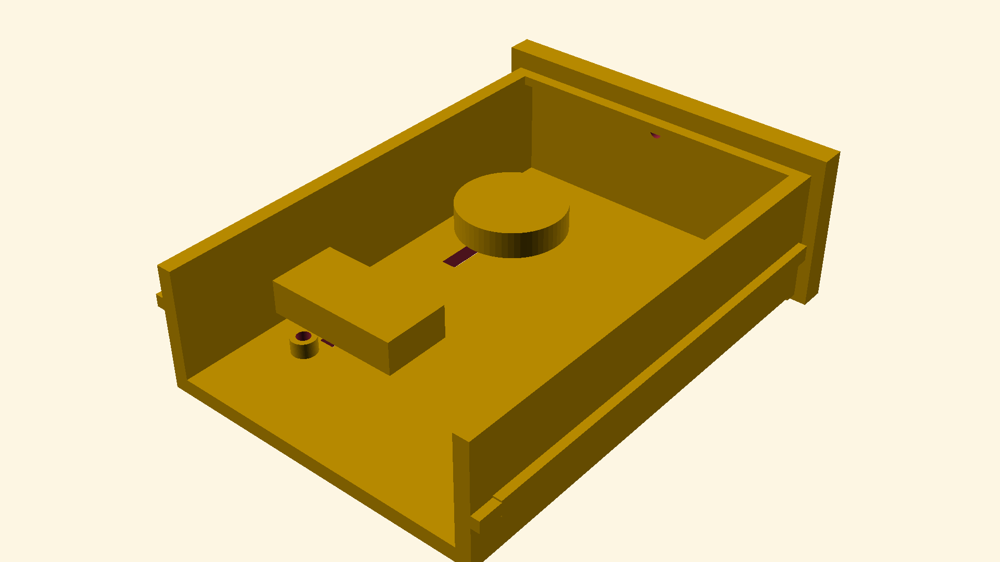

*Abbildung 5.3: 1:1:1 euklidische CAD-Visualisierung der Cardo Packtalk Edge 2-teiligen Wechselkassette im Satelliten-Pod. Gezeigt werden die dualen N52-Neodym-Magnete (Ø8x2 mm), das 5-Pin Federkontaktfeld bei X = +10 mm und der scheuerfreie Kabelverlauf unter dem Dämpfungsinlay.*

* **3D-Kontur-Negativbett:** Die Aufnahme bildet die geschwungene Unterseite des Packtalk Edge exakt nach. Eine $0{,}8\,\text{mm}$ Shore 40A Silikoneinlage dämpft Motor- und Fahrbahnstöße ab.
* **Dual-N52-Magnetanzug & Klickflanken:** Zwei Neodym-Magnete ($2\times \varnothing\,8 \times 2\,\text{mm}$ N52 bei $X = -8\,\text{mm}$ und $X = +28\,\text{mm}$) ziehen das Gerät passgenau in die Kontur. Zwei seitliche PA12/POM-Sicherungsflanken greifen formschlüssig in die Cardo-Haltenuten ($> 120\,\text{N}$ Abreißkraft).
* **Elastische EPDM-Sicherungslasche:** Zusätzliche elastische Gummilasche für extreme Bedingungen (Enduro/Gravel), die ein vertikales Ausfedern mechanisch unmöglich macht.
* **Elektrischer Übergang:** 5-Pin Federkontaktfeld bei $X = +10{,}0\,\text{mm}$ stellt blitzschnell den Kontakt zu Audio, Mic und 5V-Speisung her.

---

### 5.3.1 Mechanischer & Elektrischer Längsschnitt-Vergleich (Tolerance & Clearance Stack-Up)

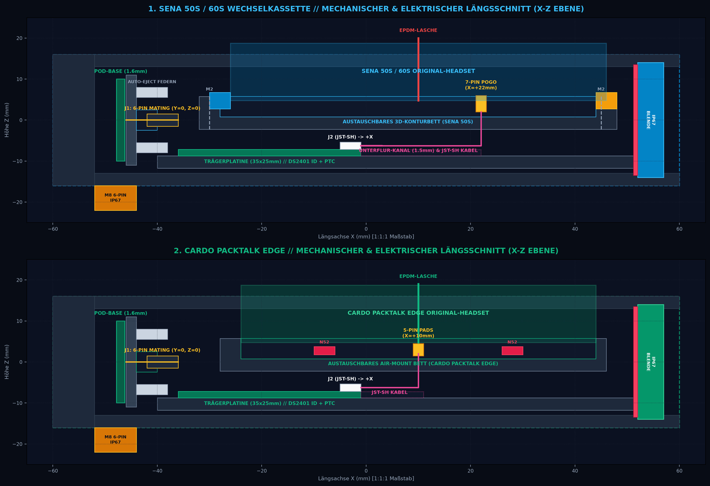

*Abbildung 5.4: Maßstabsgetreuer 2D-Längsschnitt (X-Z Ebene) durch die Sena 50S (oben) und Cardo Packtalk Edge (unten) Wechselkassetten im geschlossenen Pod-Gehäuse. Dargestellt sind die 2-teilige Schichtung, der axiale JST-SH Kabelabgang nach rechts (+X), die M2-Verschraubungsebenen und die exakte axiale Zentrierung der 6-Pin Steckverbindung auf Y=0, Z=0.*

#### 3. Midland BTR1 Advanced & XT30 Slide / Kontur-Klemme
* **Für Midland Intercoms (BTR1 Advanced / Rush / Wave):**
  * **Schwalbenschwanz-Führung (*Dovetail Slide*):** Das Gerät wird von oben auf die $72\,\text{mm}$ lange Führungsschiene aufgeschoben.
  * **Rastzahn & Gummilasche:** Ein federnder Rastzahn klinkt unten ein; die EPDM-Spannlasche sichert das Gerät zusätzlich gegen Vibrationen.
* **Für Midland XT-Serie & Bare-Board PMR446 (XT10 / XT30 / G5 entkernt):**
  * **4-Punkt-Silikondämpfung & Konturbett:** Das entkernte Board ($\approx 68 \times 42 \times 10\,\text{mm}$) liegt passgenau in einem gefrästen/gedruckten Konturnest auf 4 Silikonzapfen und wird von 2x M2 Schrauben sowie der Gummilasche vibrationsfrei fixiert.
  * **Integrierte Antenne / SMA-Port:** $32\,\text{mm}$ Helical-Wendelspule im Schlitten oder SMA-Buchse an der Blende. Direct-Wire Lötung oder JST-Verbinder auf die Kassettenplatine.

---

### 5.4 Einschraubbare Schutz-Schottwand mit integriertem Feder-Auswurf (Auto-Eject)
* **Mechanischer Berührungsschutz:** Nach dem Einsetzen der Pod-Base-Platine und dem Anziehen der M8-Rändelmutter wird eine **$2{,}0\,\text{mm}$ starke PA12-Schutz-Schottwand** mit zwei M2-Senkkopfschrauben fest mit dem Gehäuse verschraubt.
* **Vollständige Kapselung:** Die Schottwand riegelt die Platinenkammer der Pod-Basis (M8-Lötstellen, Littelfuse SP3012 TVS-Array, SMD-Filter) hermetisch gegen den Wechselschacht ab. Beim Hineinschieben oder Herausziehen der Kassette können weder Bauteile noch Leiterbahnen berührt, zerkratzt oder beschädigt werden.
* **Integrierter Schutzkragen:** Die Schottwand trägt den zentrischen PA12-Schutzkragen mit $45^\circ$-Fangtrichter, in dem die 6-Pin Präzisions-Stiftleiste sicher geschützt liegt.
* **Federgestützter Push-Out / Auto-Eject Mechanismus:**
  * Links und rechts neben dem Schutzkragen sitzen in der Schottwand **zwei federbelastete Auswerfer-Druckfedern (V4A Edelstahl 1.4310)** mit Führungsstiften.
  * **Beim Einschieben:** Die Stirnseite des Kassetten-Schlittens drückt die Federn um $5\dots 6\,\text{mm}$ zusammen, bis die 6-Pin Buchse voll im Schutzkragen sitzt und die Snap-Fit Rastnasen mit einem satten Klick einrasten. Die komprimierten Federn halten das System unter permanenter Vorspannung gegen die Silikondichtung – **100 % spielfrei und vibrationsfest**.
  * **Beim Entriegeln (Auto-Eject):** Sobald der Fahrer die beiden seitlichen Schnellentriegelungstaster an der Blende zusammendrückt, lösen sich die Rastnasen und **die Federn werfen die Kassette automatisch um $8\dots 10\,\text{mm}$ nach außen aus**.
  * Der Steckkontakt ist damit sauber getrennt und die Kassette lässt sich selbst mit dicken Motorrad-Winterhandschuhen mühelos und ohne Verkanten greifen und herausziehen.
* **Interne Konvektions- & Entwärmungsschlitze (Wärmebrücke im geschützten Innenraum):**
  * In der Schutz-Schottwand der Pod-Basis (2x $10{,}0 \times 2{,}0\,\text{mm}$) sowie im Kassettenboden unter der Trägerplatine (4x $12{,}0 \times 2{,}0\,\text{mm}$) sind interne Konvektionsschlitze eingebracht.
  * **Thermischer Vorteil:** Abwärme von Ladecontrollern, ESP32 und SX1262 LoRa-Endstufen staut sich nicht in isolierten Kunststofftaschen, sondern zirkuliert frei durch den gesamten Pod-Innenraum und koppelt an die seitlichen Aluminium-/Kupfer-Kühlschienen an.
  * **Garantierte IP67-Dichtheit:** Da die äußere Kassetten-Frontblende mit der umlaufenden Silikondichtung den gesamten Schacht nach außen hermetisch versiegelt, bleibt der Innenraum trocken und geschützt, während die Wärme sich optimal im gesamten Schacht verteilt.

---

### 5.5 Mittige Pod-Druckausgleichsmembran (ePTFE auf der Gehäuse-Oberseite)
* **Problemstellung:** Interne Abwärme (SX1262 LoRa $+22\,\text{dBm}$ PA, Ladeschaltung) und Sonneneinstrahlung erzeugen Druckdifferenzen im kleinen Pod-Volumen.
* **Positionierung:** Zentral auf der **langen Gehäuse-Oberseite** ($X = 0{,}0\,\text{mm}, Y = 0{,}0\,\text{mm}$) sitzt eine in eine Schutzsenkung integrierte **$\varnothing\,7{,}0\,\text{mm}$ ePTFE-Druckausgleichsmembran** (*Schreiner Air Vent* / *Gore Automotive Adhesive Vent*).
* **Funktion:** Belüftungsrate $> 25\,\text{ml/min}$ bei 70 mbar, Wassereintrittspunkt $> 1{,}5\,\text{bar}$ (IP67). Verhindert Vakuum-Wassersaugen bei Abkühlung durch Regengüsse und gleicht thermische Druckschwankungen im gesamten Pod-Innenraum symmetrisch aus.

---

### 5.6 Monolithisches Wärmemanagement: Seitliche Kühl-Gleitschienen & Kupfer-Gleitkontakte

Um die Wärmeübertragungsfläche drastisch zu vergrößern und gleichzeitig den mechanischen Verschleiß der 3D-Druck-Führungsnuten auf Null zu reduzieren, kombiniert das System ein **seitliches metallisches Kühl- und Führungsschienen-System (*Lateral Thermal Slide Rails*)**:

```
                    HERAUSNEHMBARER KASSETTEN-SCHLITTEN (PA12)
 ┌───────────────────────────────────────────────────────────────────────────┐
 │   PLATINE / HEADSET-AKKU (Ladeverluste 5V, SX1262 LoRa PA, ESP32)        │
 ├───────────────────────────────────────────────────────────────────────────┤
 │   FLEXIBLES SILIKON-GAP-PAD (Shore 00 35, 1.5 mm, λ = 3.0 W/m·K)          │ ◄── Schwingungsdämpfung & Heat-Flow
 ├─────────────────────────┬───────────────────────┬─────────────────────────┤
 │ KASSETTEN-FLANKENBLECH  │                       │ KASSETTEN-FLANKENBLECH  │ ◄── 0.8 mm Kupfer/Alu-Federblech
 └────────────┬────────────┴───────────────────────┴────────────┬────────────┘     (75 x 14 mm = 1050 mm² Fläche)
              │                                                 │
              ▼ (Großflächiger metallischer Gleitkontakt)       ▼
 ┌────────────┴────────────┬───────────────────────┬────────────┴────────────┐
 │ POD-KÜHL-FÜHRUNGSSCHIENE│                       │ POD-KÜHL-FÜHRUNGSSCHIENE│ ◄── In Pod-Seitenwand eingelassen
 ├─────────────────────────┴───────────────────────┴─────────────────────────┤
 │                  MONOCOQUE-POD-AUSSENGEHÄUSE (PA12)                       │
 └─────────────────────────┬───────────────────────┬─────────────────────────┘
                           │                       │
                           ▼                       ▼
              ═══════════════════════════════════════════════════
                 DIREKTER FAHRTWIND AN DER GEHÄUSE-AUSSENSEITE
              ═══════════════════════════════════════════════════
```

#### Konstruktive Vorteile der seitlichen Kühl- und Gleitschiene:

1. **Riesige Wärmeübertragungsfläche ($> 1.050\,\text{mm}^2$ pro Flanke):**
   * Statt nur punktueller kleiner Bolzen schiebt sich das $75 \times 14\,\text{mm}$ große **Kupfer-/Aluminium-Flankenblech** des Schlittens vollflächig in die korrespondierende Kühl-Gleitschiene der Pod-Seitenwand.
   * Der thermische Widerstand sinkt um mehr als das 5-Fache gegenüber reinen Punktkontakten.
2. **Verschleißfreie Metall-auf-Metall Führung:**
   * Bei wiederholtem Kassettenwechsel (Sena $\leftrightarrow$ Cardo $\leftrightarrow$ OMM) reibt kein 3D-Druck-Kunststoff auf Kunststoff. Die beiden metallischen Führungsschienen gleiten satt, präzise und dauerhaft spielfrei.
3. **Leichte Federvorspannung für satten Kontakt:**
   * Das Flankenblech an der Kassettenwange ist mit einer minimalen konvexen Wölbung ($0{,}3\,\text{mm}$ Federweg) ausgeführt und wird von innen durch das elastische Silikon-Wärmeleitpad gestützt. Beim Einschieben presst es sich mit konstantem Anpressdruck an die Pod-Schiene.
4. **Fahrtwind-Anbindung an der Pod-Außenseite:**
   * Die Pod-Kühlschiene ist an der Außenseite der Pod-Flanke dezent in den Strömungsbereich geführt (oder thermisch an den M5-Montagehalter angebunden) und gibt die Wärme direkt an den Fahrtwind ab.
5. **100 % Funk-Neutralität:**
   * Da die Schienen rein seitlich und unterhalb des oberen $180^\circ$-Halbraums liegen, bleibt das Antennenfeld für GNSS, LoRa und Wi-Fi nach oben und horizontal völlig frei. Gleichzeitig schirmen die Seitenbleche die Audio- und Digital-Signale gegen seitliche Zünd- und Generator-Störfelder ab.

### 5.7 IP67 Blind- / Leerkassette (`Pod_Dummy_Cartridge_IP67.stl`)

Wird ein Pod-Schacht temporär nicht für ein Headset genutzt (z. B. bei Einzelfahrer-Konfiguration mit nur 1 Intercom, bei Wartungsarbeiten oder während der Winterpause), verschließt die formidentische **IP67-Blindkassette** den Wechselschacht hermetisch:

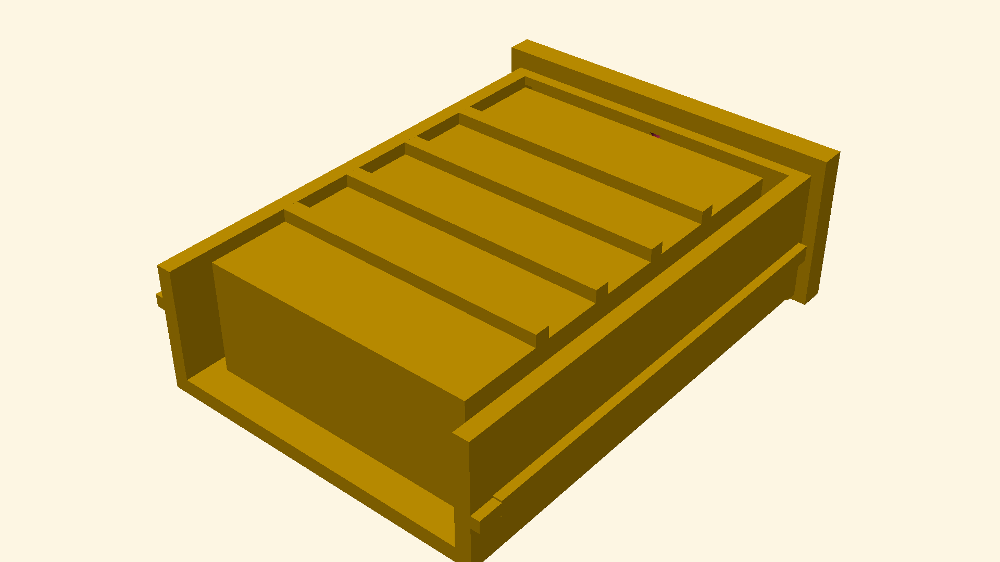

#### Mechanische Spezifikation & Dichtungskonzept:
* **100 % Formidentischer Schlittenkörper ($92{,}0 \times 54{,}0 \times 23{,}5\,\text{mm}$):**
  * Gleitet spielfrei auf denselben seitlichen Führungsbahnen wie aktive Kassetten.
  * Vollständig geschlossene, ergonomische Frontblende ($58{,}0 \times 28{,}0 \times 5{,}0\,\text{mm}$) mit griffiger Rändelstruktur und zentrierter Griffmulde.
* **Hermetische IP67/IP69K-Umlaufdichtung:**
  * In eine $2{,}5\,\text{mm}$ tiefe Nut hinter dem Frontkragen ist eine hochelastische Silikon-/EPDM-Profildichtung eingelegt.
  * Beim Einrasten der Kassette wird die Dichtung um 30 % komprimiert und schützt die innenliegenden Kontakte und Steckstifte dauerhaft vor Schmutz, Hochdruckreiniger-Wasser und Streusalz.
* **Duale Snap-Fit Rastnasen & Auto-Eject:**
  * Nutzt dieselben seitlichen PA12/POM-Schnappriegel. Beim Drücken der beiden seitlichen Riegeltasten werfen die internen Federn der Schottwand die Blindkassette automatisch $10\,\text{mm}$ aus.
* **Integriertes Notfall-Staufach (*Utility Dry Storage*):**
  * Da die Blindkassette keine Elektronik aufnehmen muss, bietet der hohle Innenraum ein **absolut wasserdichtes $80 \times 46 \times 16\,\text{mm}$ Mini-Staufach** (mit abnehmbarem Klick-Deckel) für Notfall-Bargeld, Kopie des Fahrzeugscheins, Inbusschlüssel oder Ersatz-O-Ringe.
* **Elektrisches Systemverhalten:**
  * Rein mechanischer Verschluss ohne Platinenbestückung. Die Buchse an der Schottwand bleibt berührsicher im Schutzkragen.
  * Der ESP32-S3 erkennt den offenen 1-Wire-Bus (Timeout) und lädt automatisch das Profil `disabled.json` (Audio-Relais hochohmig getrennt, 5V-Ladeschiene stromlos).

---

### 5.8 Pod-Basisplatine (`openmotorbridge_pod_base`) & Zentrische Kassetten-Führung

Der mechanische und elektrische Übergang von der Wechselkassette auf die M8-Kabelverbindung zum Motorradkabelbaum erfolgt über die zentrierte **Pod-Basisplatine (`openmotorbridge_pod_base`)**:

#### Oberansicht (Senkrechte/Horizontale 6-Pin Stiftleiste & SP3012 TVS-Schutzstufe):
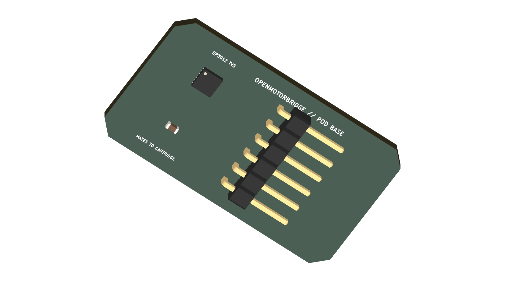

#### Unteransicht (Zentrierte M8 6-Pin IP67-Buchse & GND-Schirmfläche):
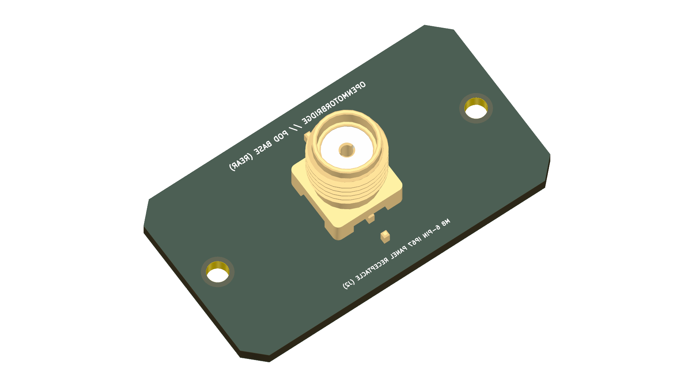

* **Abmessungen:** $48{,}0 \times 24{,}0\,\text{mm}$ (Kompakte 2-Layer FR4-Basisplatine mit großzügigen Leiterbahn- und Schutzabständen).
* **Zentrierte 6-Pin Stiftleiste (`J1`) mit PA12-Schutzkragen:** 6-poliges Präzisions-Pin-Array ($2{,}54\,\text{mm}$ Raster, vergoldet) exakt auf der horizontalen Mittelachse ($Y=0, Z=0$).
* **Integrierte PA12-Schutzwandung & Fangtrichter:** Die Schottwand bildet um die Stiftleiste `J1` eine **4-seitige, $1{,}2\,\text{mm}$ starke Schutzwand mit $45^\circ$-Einlaufschrägen**. Die Buchsenleiste der Wechselkassette gleitet formschlüssig und saugend wie ein Kolben in diese Wanne ein – die Stifte sind fingersicher gekapselt und können niemals verbogen oder verkantet werden.
* **Integrierte ESD-Schutzmatrix (`U1`):** **Littelfuse SP3012-06UTG** (6-Kanal TVS-Array mit $< 0{,}5\,\text{pF}$ parasitärer Kapazität) leitet elektrostatische Entladungen beim Berühren der Kontakte blitzschnell gegen Masse ab.
* **Zentrierte M8-Rundsteckverbinder-Buchse (`J2`):** Metallgekapselte **M8 6-Pin A-Coded IP67 Einbaubuchse** (IEC 61076-2-104) mit massivem Montagesockel und Gewindekragen exakt im geometrischen Zentrum der Platinenunterseite (`B.Cu`) verlötet.
* **Mechanische Entkopplung & Montage (`H1`, `H2`):** 2x M2 Montagebohrungen mit Shore 40A Silikondämpfung gegen Fahrbahnvibrationen. Steckkräfte werden zu 100% vom Gehäuseendanschlag aufgenommen.

---

### 5.8 Zentrischer Kassetteneinschub & Poka-Yoke Führungskonzept

Um Verkanten, schiefe Krafteinleitung und fehlerhaftes Einstecken physikalisch auszuschließen, ist der Kassetteneinschub **in allen Raumachsen exakt zentriert**:

```
                  ◄──────────── 64.0 mm Pod-Breite ────────────►
 ┌─────────────────────────────────────────────────────────────┐ ▲
 │                    3.0 mm Gehäuse-Deckel                    │ │
 │ ┌───┬─────────────────────────────────────────────────┬───┐ │ │ 32.0 mm
 │ │   │                                                 │   │ │ │ Pod-
 │ │3.0│         ZENTRISCHER KASSETTEN-EINSCHUB          │3.0│ │ │ Höhe
 │ │mm │                 (56 x 24 mm)                    │mm │ │ │
 │ │   │                                                 │   │ │ │
 │ │Nut├───────────► ┌─────────────────────┐ ◄───────────┤Nut│ │ │
 │ │1.5│             │  6-PIN STECKER      │             │2.0│ │ │
 │ │mm │             │  (Exakt zentriert)  │             │mm │ │ │
 │ │   │             └─────────────────────┘             │   │ │ │
 │ └───┴─────────────────────────────────────────────────┴───┘ │ │
 │                    3.0 mm Gehäuse-Boden                     │ │
 └─────────────────────────────────────────────────────────────┘ ▼
```

#### 4-Stufen-Sicherheit für perfekten Kassetten-Sitz:
1. **Vollkommen zentrische Geometrie:**
   * **Breite ($Y$):** Bei $64{,}0\,\text{mm}$ Pod-Außenbreite und $56{,}0\,\text{mm}$ Schachtbreite ergeben sich beidseitig symmetrische **$3{,}0\,\text{mm}$ Wandstärken**.
   * **Höhe ($Z$):** Bei $32{,}0\,\text{mm}$ Pod-Außenhöhe und $24{,}0\,\text{mm}$ Schachthöhe ergeben sich symmetrische **$3{,}0\,\text{mm}$ Decken- und Bodenstärken**.
   * Die Steckverbindung liegt exakt im Schnittpunkt der Symmetrieachsen $\rightarrow$ **Null Hebelwirkung oder Kippmomente**.
2. **Poka-Yoke Verpolschutz (Asymmetrische Führungsnuten):**
   * Linke Führungsnut: $1{,}5\,\text{mm}$ Breite.
   * Rechte Führungsnut: $2{,}0\,\text{mm}$ Breite.
   * Ein verkehrtes (über Kopf) Einschieben der Kassette ist mechanisch unmöglich.
3. **$45^\circ$-Zentriertrichter am Kassettenkopf:**
   * Die Kassettennase besitzt um den Steckerausschnitt eine umlaufende $45^\circ$-Einführschräge mit $\pm 1{,}5\,\text{mm}$ Fangbereich. Die Kontakte werden vor dem elektrischen Schluss perfekt zentriert.
4. **Formschlüssiger Endanschlag & Auto-Eject:**
   * Die Einschubkraft wird direkt von der massiven Schottwand (PA12) abgefangen – die Platinen-Lötstellen bleiben zu 100 % kräftefrei. Die beiden V4A-Edelstahlfedern halten das System permanent unter Vorspannung und werfen den Schlitten beim Entriegeln um $10\,\text{mm}$ aus.

```
┌─────────────────────────────────────────────────────────────────────────┐
│              SCHNITTSTELLEN-ÜBERGANG POD-BASIS & KASSETTE               │
├─────────────────────────────────────────────────────────────────────────┤
│ 1. DOCKING-AUFNAHME KASSETTEN-SCHLITTEN:                                │
│    • Original-Headset (Sena 50S/60S / Cardo Edge) werkzeuglos eingeklinkt│
│    • Internes JST-SH 6P Flachbandkabel zur Kassetten-Trägerplatine       │
│                               ▼                                         │
│ 2. KASSETTEN-TRÄGERPLATINE (openmotorbridge_pod_cartridge, 60x36mm):    │
│    • DS2401 1-Wire ID ROM (Meldet Headset-Typ an ESP32)                 │
│    • 500mA PTC-Sicherung + grüne 5V Power-Status-LED                    │
│    • 6-Pin Präzisionsbuchsenleiste (zentriert am Schlittenkopf)         │
│                               ▼ (Horizontaler Kassetteneinschub)        │
│ 3. POD-BASISPLATINE (openmotorbridge_pod_base, 48x24mm):                │
│    • 6-Pin Stiftleiste an der inneren Stirnwand (zentriert)             │
│    • Integrierte ESD-Schutzmatrix (Littelfuse SP3012, 6x TVS < 0.5pF)   │
│    • Zentrierte M8 6-Pin A-Coded IP67 Einbaubuchse auf Unterseite (B.Cu)│
│                               ▼ (M8-Außengewinde ragt nach unten)       │
│ 4. MODULARE M8-EINBAUBUCHSE (Gehäuseunterseite):                        │
│    • M8 6-Pin A-Coded IP67-Buchse mit Führungsnut (Poka-Yoke)           │
│    • Vollmetall-Schirmkragen für 360° EMV-Schirmung                     │
│                               ▼                                         │
│ 5. MODULARES M8-ZU-M8 PUR-VERBINDUNGSKABEL (0.5m .. 2.0m):              │
│    • Geschirmtes 6-adriges PUR-Kabel (Halogenfrei, Öl- & UV-beständig)  │
│    • 2x Power (0.34 mm²) + 2x Audio/UART verdrillt (0.14 mm²) + 2x Sign.│
│    • Beidseitig M8 6-Pin IP67 Stecker mit Rüttelsicherung               │
│                               ▼                                         │
│ 6. ZENTRALBOX HD26-KABELBAUMPEITSCHE (Unter der Sitzbank):              │
│    • 3x M8 6-Pin Buchsen (Pod 1 Links, Pod 2 Rechts, Pod 3 Heck)        │
│    • 1x M8 4-Pin / Superseal (Bordnetz KL30/KL15/GND/Schirm)            │
│    • 1x M8 4-Pin (CAN-Bus Telemetrie & Front-Umgebungsmikrofon)         │
└─────────────────────────────────────────────────────────────────────────┘
```

### 5.9 3D-Röntgen-Architektur (X-Ray CAD) & Baugruppen-Explosionsansicht

Zur ganzheitlichen Verifikation der Passungen, Dichtebenen und elektrischen Übergänge wurde die mechanische Gesamtanordnung des **Satelliten-Pods** und der **Wechselkassette** in einer transluzenten Röntgen-Darstellung (*Ghosted X-Ray*) sowie einer Explosionsansicht modelliert:

#### Transluzente 3D-Röntgenansicht (120 x 64 x 32 mm, Generic Max Envelope):
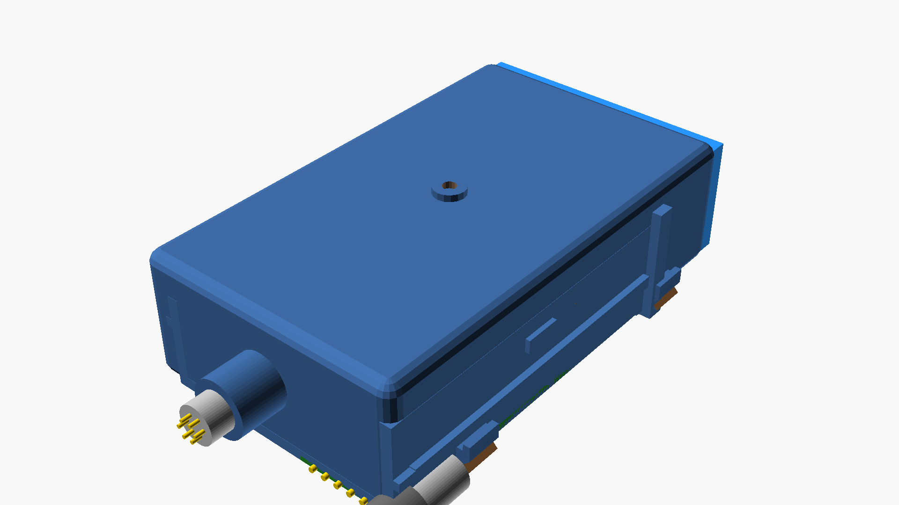

#### Baugruppen-Explosionsdarstellung (Hierarchie entlang der Einschubachse):
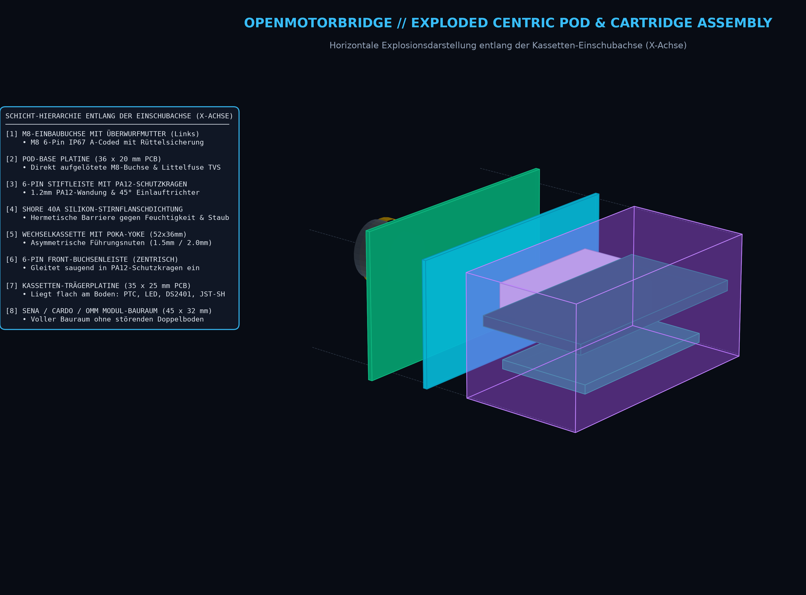

#### Mechanische Spezifikationen & Passungen:
* **Pod-Außengehäuse:** Makrolon 2805 Polycarbonat / PA12 MJF ($120{,}0 \times 64{,}0 \times 32{,}0\,\text{mm}$, Schacht-Innenmaß $96{,}0 \times 56{,}0 \times 24{,}0\,\text{mm}$).
* **Pod-Basisplatine (`openmotorbridge_pod_base`):** $48{,}0 \times 24{,}0 \times 1{,}6\,\text{mm}$ Adapterplatine mit zentrierter M8 6-Pin IP67 Vollmetallbuchse (B.Cu) und senkrechter 6-Pin Stiftleiste (F.Cu).
* **Einschraubbare Schottwand:** $56{,}0 \times 24{,}0 \times 2{,}0\,\text{mm}$ PA12 mit 2x M2 Senkkopfschrauben, Schutzkragen und 2x Edelstahl-Auswerferfedern ($10\,\text{mm}$ Auswurfhub).
* **Offener Kassetten-Schlitten:** $92{,}0 \times 54{,}0 \times 23{,}5\,\text{mm}$ U-Chassis ohne Deckel ($88{,}0 \times 50{,}0 \times 23{,}5\,\text{mm}$ nutzbarer Innenbauraum).
* **Kassetten-Trägerplatine (`openmotorbridge_pod_cartridge`):** $60{,}0 \times 36{,}0 \times 1{,}2\,\text{mm}$ FR4-Adapter mit DS2401 1-Wire ID, abgewinkeltem JST-SH 1.0mm 6P Flex-Verbinder (F.Cu) und 6-Pin Buchsenleiste (B.Cu).
* **IP67-Dichtebene:** Der umlaufende $58{,}0 \times 28{,}0\,\text{mm}$ Shore 40A Silikon-Stirnflansch wird beim Einschieben um $0{,}8\,\text{mm}$ vorkomprimiert und dichtet die Kassettenkammer hermetisch gegen Strahlwasser und Staub ab.

---


---

### 5.10 Pod 3 Baugruppen-Montage & 1:1:1 CAD-Fitting-Verifikation

Zur ganzheitlichen geometrischen und elektrischen Validierung des Gesamtsystems wurde die vollständige Baugruppe des **Heck-Pods (Pod 3 mit OMM-Transceiver und Wechselkassette)** im maßstabsgetreuen 1:1:1 euklidischen CAD-Raum modelliert und verifiziert:

#### 1. 3D-Baugruppen-Explosionsdarstellung (Hierarchie aller Komponenten):
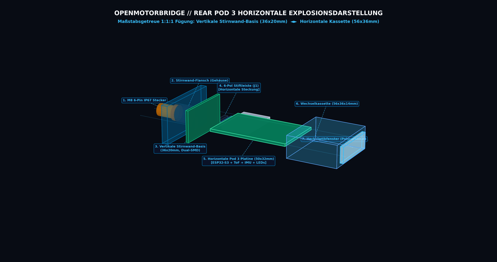

*Abbildung 5.3: Explosionsdarstellung des Satelliten-Pods 3 (120x64x32 mm Monocoque-Gehäuse, M8 6-Pin Einbaubuchse an der Gehäuseunterseite, vertikale Pod-Base-Platine an der inneren Stirnwand, einschraubbare PA12-Schutz-Schottwand mit 45°-Fangtrichter und dualen Auto-Eject Edelstahlfedern, sowie der einschiebbare Kassetten-Schlitten).*

#### 2. Nahaufnahme der zusammengesteckten Kontakt- & Dichtebene:
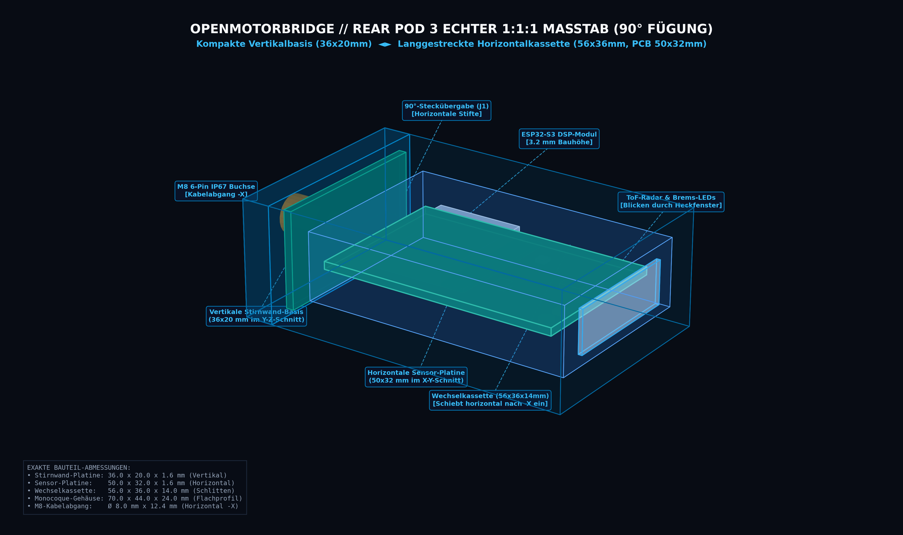

*Abbildung 5.4: Transparente Detailansicht des gesteckten Zustands. Die 6-Pin Präzisions-Stiftleiste der Pod-Base sitzt formschlüssig in der Buchsenleiste des Kassetten-Schlittens, umschlossen vom 4-seitigen Berührungsschutzkragen der Schottwand. Die Federn halten das System unter permanenter Vorspannung gegen die IP67-Flanschdichtung.*

#### 3. Längsschnitt-Fitting (Mechanische & Elektrische Ausrichtung):
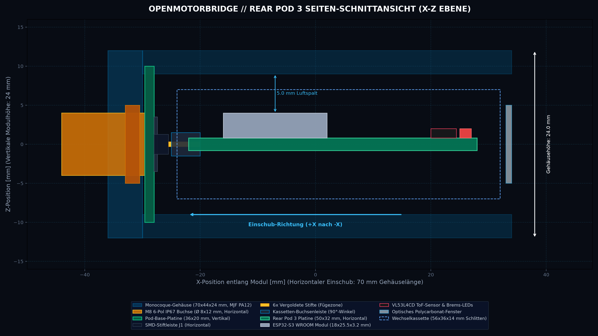

*Abbildung 5.5: Maßstabsgetreuer Längsschnitt (X-Z Ebene) durch den Satelliten-Pod. Erkennbar sind die zentrierte Lage der Steckverbindung auf der horizontalen Mittelachse, die Schachtführung und der spannungsfreie Übergang von der fahrzeugseitigen M8-Verschraubung zur internen Elektronik.*

### 5.11 CAD-Dateistruktur & Tinkercad-Modulbaukasten (STL-Bibliothek)

Alle 3D-Gehäusemodelle stehen im Verzeichnis [hardware/cad/stl/](file:///Users/schmidtm/openMotorBridge/hardware/cad/stl/) und [hardware/3d_models_mjf/](file:///Users/schmidtm/openMotorBridge/hardware/3d_models_mjf/) als fertige, monolithische Druckkörper sowie als **vollständig zerlegte, modulare Tinkercad-Baukästen** bereit:

```
hardware/cad/stl/
├── 01_main_box/                                 # Zentrale Steuerbox (3-Teiliges Sandwich)
│   ├── main_box_complete_assembly.stl           # Vollständiges 3D-Montagemodell
│   ├── main_box_lower_case.stl                  # Unterwanne mit Dichtnut & 4x M3 Eck-Spannsäulen
│   ├── main_box_mid_tray.stl                    # Oberwanne mit Zwischenboden & 4x M3 Eck-Pfosten
│   ├── main_box_lid.stl                         # Gehäusedeckel mit Dichtfeder & Gore-Vent Bohrung
│   └── components/                              # Tinkercad-Primitiven zum freien Editieren & Stanzen
│       ├── 01_lower_tub_empty.stl               # Leere Wanne (ohne Zylinder)
│       ├── 02_pcb_4_standoffs_group.stl         # 4x PCB-Schraubdome als Gruppe
│       ├── 03_single_m2_5_standoff.stl          # Einzelner M2.5 Schraubdom (im Nullpunkt)
│       ├── 04_single_m4_mounting_ear.stl        # Einzelnes M4-Montageohr
│       ├── 05_mid_tray_solid_frame.stl          # Mittelrahmen massiv geschlossen (105x75x15 mm)
│       ├── 06_mid_partition_floor_solid.stl     # Zwischenboden massiv geschlossen
│       ├── 07_lipo_battery_cradle_1000mah.stl   # LiPo-Akkuhalterung (1000 mAh Standard)
│       ├── 08_lipo_battery_cradle_1500mah_large.stl # LiPo-Akkuhalterung (1500 mAh Large)
│       ├── 09_cutout_tool_usb_c.stl             # Schneidkörper USB-C (in Tinkercad: "Bohrung")
│       ├── 10_cutout_tool_led_window.stl        # Schneidkörper RGB-LED Statusfenster
│       ├── 11_cutout_tool_hd26_dsub.stl         # Schneidkörper HD26 Kabelbaumflansch
│       ├── 12_cutout_tool_m16_round_gland.stl   # Schneidkörper M16 Rundsteckverbinder
│       ├── 13_cutout_tool_cable_slot.stl        # Schneidkörper Zwischenboden-Kabelschlitz
│       ├── 14_lid_plate_only.stl                # Reine Deckelplatte
│       ├── 15_lid_sealing_lip.stl               # Deckel-Einpress-Dichtlippe
│       ├── 16_lid_gore_vent_boss.stl            # Gore-Vent Sockel
│       ├── 17_corner_clamping_posts_mid_tray_4x.stl # 4x Eck-Pfostensäulen der Oberwanne
│       ├── 18_corner_clamping_posts_lower_case_4x.stl # 4x Eck-Schraubsäulen der Unterwanne
│       ├── 19_corner_screw_holes_cutout_tool_4x.stl # 4x M3 Bohrungszylinder
│       ├── 20_perimeter_sealing_groove_collar.stl   # Umlaufender Dichtungskragen (Nut)
│       ├── 21_perimeter_sealing_tongue_lip.stl      # Umlaufende Dichtungsfeder (Lippe)
│       ├── 22_silicone_o_ring_gasket_cord_1_5mm.stl # Ø 1.5 mm Silikon-O-Ring Prüfkörper
│       ├── 23_floor_vent_slots_cutout_tool_group.stl# 5x Zwischenboden-Belüftungsschlitze
│       └── 24_single_vent_slot_cutout_tool.stl      # Einzelner 15x2.5 mm Belüftungsschlitz
│
├── 02_pod_base/                                 # Satelliten-Pod Helmträger (5-seitiger Monocoque-Schacht)
│   ├── pod_base_housing.stl                     # Helmträgergehäuse mit Wechselschacht & M8-Rückanschluss
│   ├── pod_base_helmet_clamp.stl                # Helm-Klemmadapter
│   └── components/                              # Tinkercad-Primitiven zum freien Editieren
│       ├── 01_pod_base_monocoque_empty_tunnel.stl # 5-seitiger Monocoque-Tunnel (100x60x28 mm, nach vorne offen)
│       ├── 02_m8_horizontal_cable_gland_neck.stl # Horizontaler M8 6-Pin IP67 Kabelstutzen (Ø 8 mm Bohrung)
│       ├── 03_pod_bulkhead_partition_plate.stl  # Schutz-Schottwand / Zwischenboden
│       ├── 04_pin_guide_shroud_funnel.stl       # 6-Pin Schutzkragen mit 45°-Fangtrichter
│       ├── 05_pod_eptfe_membrane_boss.stl       # Gore ePTFE-Membranaufnahme für Gehäusedecke
│       ├── 06_pod_bulkhead_convective_vent_slots_tool.stl # Schneidkörper für Schottwand-Lüftungsschlitze
│       ├── 07_pod_lateral_cooling_rails_pair.stl # Metallische Kühl- und Gleitschienen (in Seitenwand)
│       └── 08_auto_eject_springs_pair.stl       # 2x V4A-Auswerferfedern
│
├── 03_pod_cartridges/                           # Kassetten-Einschübe
│   ├── cartridge_sena_sled.stl                  # Sena 50S/60S Kassetten-Schlitten (mit ePTFE-Membran)
│   ├── cartridge_cardo_sled.stl                 # Cardo Packtalk Edge Kassetten-Schlitten (mit ePTFE-Membran)
│   ├── cartridge_blindkassette_waterproof.stl   # Wasserdichte IP67 Blindkassette (Dry Box Dummy)
│   └── components/                              # Tinkercad-Primitiven zum freien Editieren
│       ├── 01_universal_base_sled.stl           # Universeller Grundschlitten (75x54x22 mm)
│       ├── 02_cartridge_faceplate_with_gasket_lip.stl # PA12-Frontblende mit Dichtkragen & Snap-Fit
│       ├── 03_cartridge_eptfe_membrane_boss.stl # Frontblenden ePTFE-Membransitz
│       ├── 04_cartridge_membrane_cutout_tool.stl # Schneidkörper für Frontblenden-Membran
│       ├── 05_cartridge_floor_convective_vent_slots_tool.stl # 4x Kassettenboden-Konvektionsschlitze
│       └── 06_cartridge_copper_thermal_slide_plates_pair.stl # Seitliche Kupfer-Kühlflankenbleche (0.8 mm)
│
└── 04_rear_pod3/                                # Heck-Satelliten-Pod (Pod 3)
    ├── rear_pod3_lower_housing.stl              # Heck-Untergehäuse mit horizontalem M8-Stutzen & GoPro-Rasten
    ├── rear_pod3_radome_lid.stl                 # Radomdeckel mit Antennenkuppel & Dichtlippe
    └── components/                              # Tinkercad-Primitiven zum freien Editieren
        ├── 01_rear_pod3_empty_tub.stl           # Leere Wanne (72x48x14 mm)
        ├── 02_rear_pod3_4_pcb_standoffs.stl     # 4x M2.5 PCB-Schraubdome
        ├── 03_m8_horizontal_cable_gland_neck.stl # Horizontaler M8-Kabelstutzen mit Ø 8 mm Bohrung
        ├── 04_gopro_mounting_cleats.stl         # 3x GoPro- / Gepäckträger-Montagerasten
        └── 05_m8_horizontal_hole_cutout_tool.stl# Schneidkörper für M8-Wanddurchbruch
```

---

## 6. Belegung der 6-Pin M8 / Pogo-Schnittstelle & PUR-Kabelbaum-Farbcodierung

| M8 / Pogo-Pin | Leitungsfarbe (PUR-Kabel) | Querschnitt | Signal Pod 1 & 2 (Audio & Intercom) | Signal Pod 3 (Heck-Transceiver) | Schirmung & Verdrillung |
| :---: | :--- | :---: | :--- | :--- | :--- |
| **Pin 1** | **Rot (RD)** | $0{,}34\,\text{mm}^2$ (AWG22) | **`VCC`** (5V geschaltete Speisespannung via MOSFET) | **`VCC`** (5V Dauer-Versorgung) | Einzelader (Power) |
| **Pin 2** | **Schwarz (BK)** | $0{,}34\,\text{mm}^2$ (AWG22) | **`GND`** (Dedizierte Power- & Signalmasse) | **`GND`** (Dedizierte Power- & Signalmasse) | Einzelader (Power Ground) |
| **Pin 3** | **Weiß (WH)** | $0{,}14\,\text{mm}^2$ (AWG26) | **`NF_P`** (Symmetrisches Audiosignal + via Bourns) | **`UART_TX`** (Heck-Co-Prozessor $\rightarrow$ Box) | **Paar 1 verdrillt** (mit Pin 4) |
| **Pin 4** | **Blau (BU)** | $0{,}14\,\text{mm}^2$ (AWG26) | **`NF_N`** (Symmetrisches Audiosignal - via Bourns) | **`UART_RX`** (Box $\rightarrow$ Heck-Co-Prozessor) | **Paar 1 verdrillt** (mit Pin 3) |
| **Pin 5** | **Gelb (YE)** | $0{,}14\,\text{mm}^2$ (AWG26) | **`OPTO`** (TLP222A Tastensimulations-Trigger) | **`GNSS_PPS`** (1-PPS Hardware-Zeitnormal) | Einzelader (Steuersignal) |
| **Pin 6** | **Grün (GN)** | $0{,}14\,\text{mm}^2$ (AWG26) | **`1-WIRE_ID`** (DS2401 Silicon Serial Number) | **`1-WIRE_ID`** (DS2401 Heck-Kassetten-Erkennung)| Einzelader (1-Wire Bus) |
| **M8-Gehäuse**| **Kupfergeflecht (BL)**| $> 85\,\%$ Geflecht | **`GND_SHIELD`** (360° Gehäuseschirmung) | **`GND_SHIELD`** (360° Gehäuseschirmung) | Gesamtschirm über M8-Metallkragen |

---

## 7. Zusammenfassende Konstruktions- & Fertigungsrichtlinien

```
┌────────────────────────────────────────────────────────────────────────────────────────┐
│             OPENMOTORBRIDGE MECHANISCHE SYSTEM-MATRIX (FERTIGUNGSÜBERSICHT)             │
├───────────────────┬───────────────────────────────┬────────────────────────────────────┤
│ BAUGRUPPE         │ HAUPTMERKMALE / MECHANIK       │ FERTIGUNG & MATERIAL               │
├───────────────────┼───────────────────────────────┼────────────────────────────────────┤
│ 1. ZENTRALBOX     │ • 3-Teiliges Sandwich-Design   │ • PA12 MJF oder Aluguss            │
│    (Unterwanne,   │ • 4x M3 durchgehende Ecksäulen│ • 4x Cu-Thermal-Pins (Ø 8 mm)      │
│     Oberwanne &   │ • Nut-und-Feder Dichtsystem   │ • Shore 00 35 Silikon-Gap-Pad      │
│     Deckel)       │ • LiPo-Bett auf Zwischenboden │ • EPDM-Dichtschnur (Ø 1.5 mm)      │
│                   │ • Kabelschlitz + 5x Lüftung   │ • Gore ePTFE-Ventil (Ø 7 mm)       │
│                   │ • Stirnwand: HD26, USB-C, LED │ • M4 Silentblöcke (Shore 50A)      │
├───────────────────┼───────────────────────────────┼────────────────────────────────────┤
│ 2. SATELLITEN-PODS│ • Monocoque-Schacht (ohne Deckel)│ • PA12 MJF kugelgestrahlt        │
│    (Pod 1, 2 & 3) │ • M8 6-Pin IP67 Rückanschluss │ • M8 Vollmetall-Einbaubuchse       │
│                   │ • Schutz-Schottwand (2x M2)   │ • 2x V4A-Auswerferfedern (10 mm Hub│
│                   │ • 45°-Fangtrichter für 6-Pin  │ • Seitliche metallische Gleitschiene│
│                   │ • Obere Gore ePTFE-Membran    │ • Asymmetrische Poka-Yoke Nuten    │
├───────────────────┼───────────────────────────────┼────────────────────────────────────┤
│ 3. WECHSEL-       │ • Universeller Unterschlitten │ • PA12 MJF (2-Teilige Kassette)    │
│    KASSETTEN      │ • Kassetten-PCB (DS2401 ID)   │ • Flanschdichtung Shore 40A        │
│    (Sena, Cardo,  │ • Stirnflansch-IP67-Dichtung  │ • Duale POM Snap-Fit Riegel        │
│     Midland, OMM) │ • Auto-Eject Schnellentrieglg.│ • Vergoldetes Pogo-Pin Array       │
│                   │ • Unterflur-Kabelkanal 1.5 mm │ • N52 Neodym-Magnete (Cardo Edge)  │
│                   │ • Modellspezifisches 3D-Nest  │ • EPDM-Sicherungslasche            │
└───────────────────┴───────────────────────────────┴────────────────────────────────────┘
```


