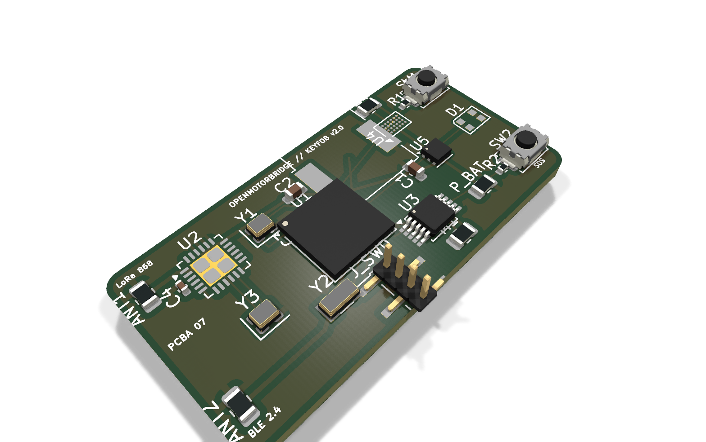
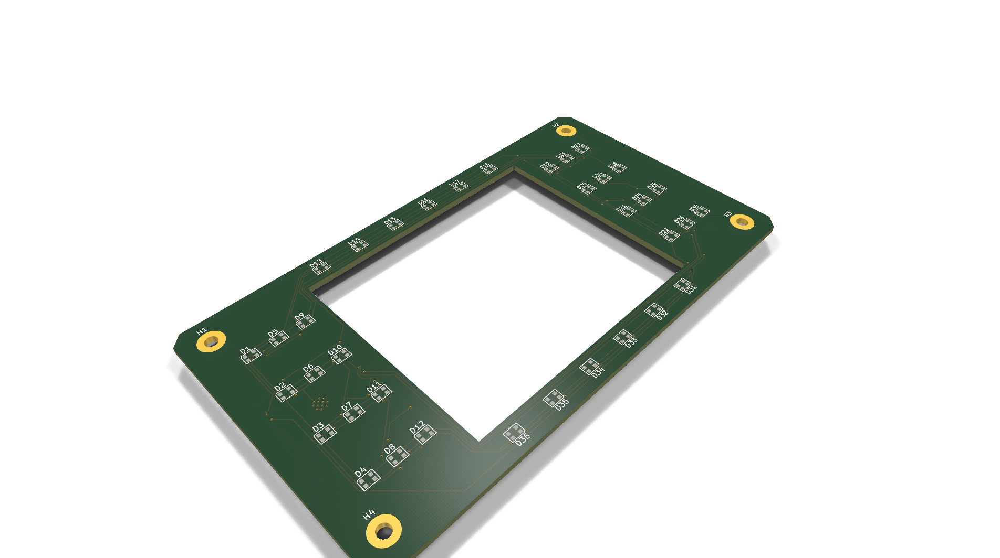
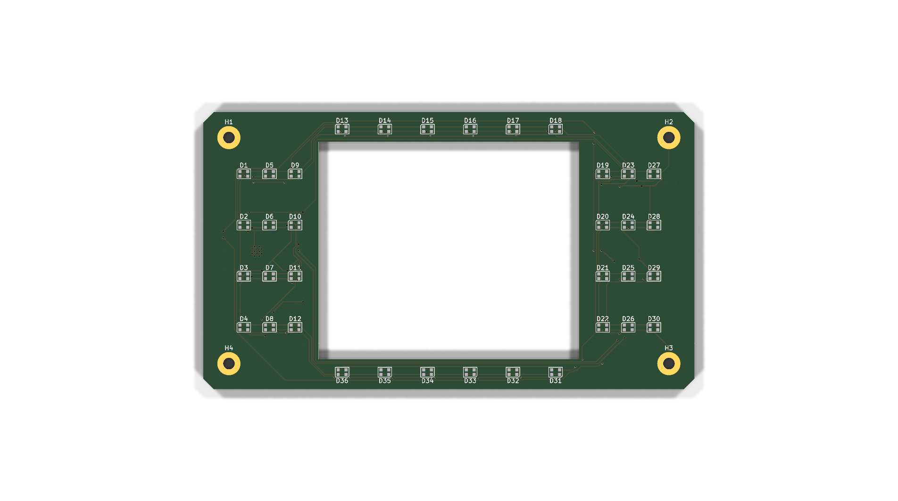

# 07 - Hardware-Architektur & Platinen-Pinouts (PCBA 01 bis 08)

Dieses Dokument bildet die **zentrale, autoritative Hardware-Spezifikation aller 8 Platinen-Baugruppen (PCBA 01 bis PCBA 08)** des OpenMotorBridge Gesamtsystems, einschließlich Lagenaufbau, Impedanzkontrolle, Net-Klassen, Funktionszonen und vollständigen Pinout-Tabellen.

---

## 1. Systemübersicht der 8 Platinen-Baugruppen

```
┌────────────────────────────────────────────────────────────────────────────────────────┐
│                   DIE 8 HARDWARE-BAUGRUPPEN (PCBAs) DER OPENMOTORBRIDGE                │
├───────┬───────────────────────────────┬───────────────┬─────────┬──────────────────────┤
│ Baugruppe │ Name & Funktion           │ Platinenmaße  │ Lagen   │ Kern-ICs / Bauteile  │
├───────┼───────────────────────────────┼───────────────┼─────────┼──────────────────────┤
│ **PCBA 01**│ **Zentralbox Main Controller** │ 85 x 55 mm    │ 4 Lagen │ ESP32-S3, LM5164,    │
│       │ (Unter der Sitzbank, Audio/USV)│ (77x47 mm M3) │ (ENIG)  │ BQ24075, ES8388, IMU │
├───────┼───────────────────────────────┼───────────────┼─────────┼──────────────────────┤
│ **PCBA 02**│ **Satelliten Pod Base Carrier**│ 36 x 20 mm    │ 2 Lagen │ SP3012 TVS, M8 6-Pin,│
│       │ (Sockel für Pod 1 & 2)        │ (30 mm M2)    │         │ Kassetten-Aufnahme   │
├───────┼───────────────────────────────┼───────────────┼─────────┼──────────────────────┤
│ **PCBA 03**│ **Smart Modular Cartridge**   │ 35 x 25 mm    │ 2 Lagen │ CH32V003 RISC-V MCU, │
│       │ (Rev 2.0 Mechatronik-Träger)  │ (29x19 mm M2) │         │ 4x MOSFETs, J_ACT 8P │
├───────┼───────────────────────────────┼───────────────┼─────────┼──────────────────────┤
│ **PCBA 04**│ **Rear Pod 3 Transceiver Hub** │ 55 x 48 mm    │ 4 Lagen │ ESP32-C3 Coprozessor,│
│       │ (Heckbürzel: LoRa & GNSS)     │ (46x19 mm M2) │ (ENIG)  │ SX1262 LoRa, MAX-M10S│
├───────┼───────────────────────────────┼───────────────┼─────────┼──────────────────────┤
│ **PCBA 05**│ **Universal Front-Knoten**    │ 82 x 50 mm    │ 4 Lagen │ ESP32-S3 Xtensa,     │
│            │ (Cockpit & Sensor Hub)        │               │         │ USB2514B 4-Port Hub, │
│            │                               │               │         │ USB-PD 20W, Qi/BSD   │
├───────┼───────────────────────────────┼───────────────┼─────────┼──────────────────────┤
│ **PCBA 06**│ **MagSafe Frame Dock Adapter** │ 28 x 11.5 mm  │ 2 Lagen │ 500mA PPTC Fuse, 5V  │
│       │ (Rahmendock: M8 auf MagSafe)  │ (Zentral M2.5)│         │ TVS, USBLC6-4SC6 ESD │
├───────┼───────────────────────────────┼───────────────┼─────────┼──────────────────────┤
| **PCBA 07**| **2-in-1 LoRa Smart-Keyfob**  | 38 x 19 mm    | 2 Lagen │ nRF52840 SoC, SX1262 │
│       │ (Silent Pager, N52 Key & Qi)  │ (Tasche M2)   │ (ENIG)  │ DRV2605L LRA, BQ51003│
├───────┼───────────────────────────────┼───────────────┼─────────┼──────────────────────┤
| **PCBA 08**| **Radar 2.0 Sub-MCU & Wings** | 115 x 65 mm   | 2 Lagen │ ESP32-C5 Dual-Band,  │
│       │ (Wheeltec MR20 & V2X Patch)   │ (Flügel M2.5) │ (ENIG)  │ 36x WS2812B, BinderM5│
└───────┴───────────────────────────────┴───────────────┴─────────┴──────────────────────┘
```

---

## 2. Fertigungsstandard & JLCPCB 4-Lagen Stackup (JLC04161H-7628)

Für alle 4-Lagen-Platinen (PCBA 01, PCBA 04, PCBA 05 und PCBA 08) wird der identische, streng impedanzkontrollierte Lagenaufbau verwendet:

```
┌─────────────────────────────────────────────────────────────┐
│ Layer 1 (F.Cu - Top): High-Speed Signale, USB-Diff, Bauteile│  (35 µm / 1 oz Cu)
├─────────────────────────────────────────────────────────────┤
│ ── Prepreg 7628 (Dielektrikum, Er = 4.4, Dicke 0.2 mm) ──   │
├─────────────────────────────────────────────────────────────┤
│ Layer 2 (In1.Cu): Durchgängige Massefläche (GND_PWR / AGND) │  (17.5 µm Standard / opt. 35 µm)
├─────────────────────────────────────────────────────────────┤
│ ── FR4 Core (Isolationskern, Dicke 1.0 mm) ──────────────   │
├─────────────────────────────────────────────────────────────┤
│ Layer 3 (In2.Cu): Power-Planes (VCC_3V3, VCC_5V Polygone)   │  (17.5 µm Standard / opt. 35 µm)
├─────────────────────────────────────────────────────────────┤
│ ── Prepreg 7628 (Dielektrikum, Er = 4.4, Dicke 0.2 mm) ──   │
├─────────────────────────────────────────────────────────────┤
│ Layer 4 (B.Cu - Bottom): Sekundär-Routing & SMD-Sensorik    │  (35 µm / 1 oz Cu)
└─────────────────────────────────────────────────────────────┘
```

### 2.1 Standardisierte Net-Klassen & Leiterbahn-Geometrien
* **`Default`:** Leiterbahnbreite $0{,}20\,\text{mm}$, Mindestabstand $0{,}20\,\text{mm}$ (Logiksignale, GPIOs).
* **`Power_5V_12V`:** Leiterbahnbreite $0{,}60\,\text{mm}$ (Stromtragfähigkeit bis $2{,}2\,\text{A}$ bei $\Delta T < 10\,^\circ\text{C}$).
* **`RF_50R`:** Leiterbahnbreite $0{,}35\,\text{mm}$, Koplanarabstand $0{,}20\,\text{mm}$ zur Massefläche (50 Ohm Wellenwiderstand für 868 MHz LoRa und GNSS).
* **`USB_90R_DIFF`:** Leiterbahnbreite $0{,}20\,\text{mm}$, differentieller Leiterbahnabstand $0{,}15\,\text{mm}$ ($90\,\Omega \pm 10\,\%$ Differenzimpedanz für USB 2.0 High-Speed 480 Mbps).
* **`Audio_Sensitive`:** Leiterbahnbreite $0{,}25\,\text{mm}$, Abstand $0{,}30\,\text{mm}$ (abgeschirmt durch flankierende GND-Leiterbahnen).

---

## 3. PCBA 01: Zentralbox Main Controller (`openmotorbridge_central_box`)


*Abbildung 7.1: Präzises KiCad 3D-Raytracing-Render der Zentralbox-Hauptplatine (PCBA 01, 85 x 55 mm, 4 Lagen) mit ESP32-S3 WROOM-1, LM5164-Q1 72V Buck, Bourns 1500V Audio-Übertragern, Box-Headers und ENIG-Goldpads.*

### 3.1 Technische Platinen-Kenndaten
* **Abmessungen:** $85{,}0 \times 55{,}0\,\text{mm}$ (Außenkontur mit 4x M2.5 Montagebohrungen, $77{,}0 \times 47{,}0\,\text{mm}$ Lochabstand).
* **Lagenaufbau:** 4 Lagen FR-4 High-TG150 ($1{,}6\,\text{mm}$ Gesamtdicke, $35\,\mu\text{m}$ Cu auf allen 4 Lagen).
  * Layer 1 (Top): Bauelemente, HF-Leiterbahnen und differentielle Audiopaare.
  * Layer 2 (Inner 1): Durchgehende, ununterbrochene GND-Bezugsebene.
  * Layer 3 (Inner 2): Split Power Planes ($+3{,}3\,\text{V}$, $+5{,}0\,\text{V}$, `VBUS`, `VBAT_LIPO`) und Audio-GND.
  * Layer 4 (Bottom): Sekundäre Signale, Schirmflächen und thermische Vias.
* **Oberflächenveredelung:** ENIG (Electroless Nickel Immersion Gold, $0{,}05\dots 0{,}1\,\mu\text{m}$ Au über $3\dots 5\,\mu\text{m}$ Ni).
* **Isolationsbarriere:** $4{,}0\,\text{mm}$ galvanischer Kriech- und Luftabstand unter den Audio-Übertragern `T1` und `T2`.

### 3.2 Pinbelegung des zentralen 26-poligen Flansch-Steckverbinders (`J1` / HD26)


*Abbildung 7.1b: CAD-Architektur des zentralen 26-poligen Automotive-Kabelbaums (HD26 Seal-D auf 5x Modulabgänge mit IP67 Formmuffe).*

| Pin (HD26/J1) | Signalname | Signalart / Spannungsbereich | Funktion & Schutzbeschaltung |
| :--- | :--- | :--- | :--- |
| **Pin 1** | `POD1_VCC` | $+5{,}0\,\text{V}$ geschaltet (max. 300 mA) | Stromversorgung Lenker-Pod 1 (High-Side Switch, PPTC 500mA) |
| **Pin 2** | `POD1_NF_P` | Audio Line-Out ($1{,}0\,\text{V}_{\text{RMS}}$ diff.) | Galvanisch getrennt via Trafo `T1` (Positiv) |
| **Pin 3** | `POD1_NF_N` | Audio Line-Out ($1{,}0\,\text{V}_{\text{RMS}}$ diff.) | Galvanisch getrennt via Trafo `T1` (Negativ) |
| **Pin 4** | `POD1_OPTO_KEY` | Optokoppler PTT-Keying | PhotoMOS `U7` Open-Collector / Schließer (< 1 ms prellfrei) |
| **Pin 5** | `POD2_VCC` | $+5{,}0\,\text{V}$ geschaltet (max. 300 mA) | Stromversorgung Helm-Pod 2 (High-Side Switch, PPTC 500mA) |
| **Pin 6** | `POD2_NF_P` | Audio Line-In ($1{,}0\,\text{V}_{\text{RMS}}$ diff.) | Galvanisch getrennt via Trafo `T2` (Positiv) |
| **Pin 7** | `POD2_NF_N` | Audio Line-In ($1{,}0\,\text{V}_{\text{RMS}}$ diff.) | Galvanisch getrennt via Trafo `T2` (Negativ) |
| **Pin 8** | `POD2_OPTO_KEY` | Optokoppler Mute/Keying | PhotoMOS `U8` Open-Collector / Schließer (< 1 ms prellfrei) |
| **Pin 9** | `POD3_VCC` | $+5{,}0\,\text{V}$ geschaltet (max. 500 mA) | Stromversorgung Heck-Transceiver Pod 3 |
| **Pin 10** | `POD3_UART_TX` | UART TX ($3{,}3\,\text{V}$, 460.800 Baud) | Datenleitung zu Pod 3 (GNSS/Telemetrie/LoRa) |
| **Pin 11** | `POD3_UART_RX` | UART RX ($3{,}3\,\text{V}$, 460.800 Baud) | Datenleitung von Pod 3 (GNSS/Telemetrie/LoRa) |
| **Pin 12** | `GND_PWR` | Power-Masse ($0\,\text{V}$) | Hauptmasse für Pod-Stromversorgungen |
| **Pin 13** | `GND_PWR` | Power-Masse ($0\,\text{V}$) | Paralleler Massepfad für minimalen Schleifenwiderstand |
| **Pin 14** | `KL30_IN` | $+9\,\text{V} \dots +72\,\text{V}$ DC (Dauerplus) | Batterie-Haupteingang (LM5164 Buck, SMBJ33CA TVS-Schutz) |
| **Pin 15** | `KL15_IGN` | $+9\,\text{V} \dots +72\,\text{V}$ DC (Zündungsplus) | Zündungssignal mit Spannungsteiler & Schmitt-Trigger |
| **Pin 16** | `GND_PWR` | Power-Masse ($0\,\text{V}$) | Fahrzeug-Bordnetz-Masse |
| **Pin 17** | `CAN_H` | CAN High (ISO 11898-2) | CAN-FD Busleitung High ($120\,\Omega$ Terminierung schaltbar) |
| **Pin 18** | `CAN_L` | CAN Low (ISO 11898-2) | CAN-FD Busleitung Low ($120\,\Omega$ Terminierung schaltbar) |
| **Pin 19** | `ONEWIRE_ID` | 1-Wire Datenbus ($3{,}3\,\text{V}$) | Automatische Pod- & Kassetten-Erkennung (DS2431 / DS2401) |
| **Pin 20** | `GND_SHIELD` | Gehäuse- & Schirmmasse | Direkte Verbindung zum Alugehäuse / Schirmgeflecht |
| **Pin 21** | `AGND` | Analoge Audiomasse | Ruhige Audiomasse für ES8388 Codec-Referenz |
| **Pin 22** | `RESERVE_GPIO_A`| GPIO Digital I/O ($3{,}3\,\text{V}$) | Frei programmierbarer GPIO / PWM-Ausgang (ESP32-S3) |
| **Pin 23** | `RESERVE_GPIO_B`| GPIO Digital I/O ($3{,}3\,\text{V}$) | Frei programmierbarer GPIO / ADC-Eingang (ESP32-S3) |
| **Pin 24** | `I2S_DOUT` | I2S Data Out ($3{,}3\,\text{V}$) | Digitaler Audio-Stream zu externem DSP/Verstärker |
| **Pin 25** | `I2S_BCLK` | I2S Bit Clock ($3{,}3\,\text{V}$) | Digitaler I2S Takt |
| **Pin 26** | `GND_SHIELD` | Gehäuse- & Schirmmasse | Zweiter Schirmkontakt für 360°-Rundumschirmung |

### 3.3 Interne Platinen-Steckverbinder & Service-Schnittstellen

| Stecker | Typ / Bauform | Polzahl | Funktion & Signalbelegung |
| :--- | :--- | :---: | :--- |
| **`J2`** | MicroSD Push-Push | 9-Pin | 4-Bit SDIO High-Speed Bus (`CLK`, `CMD`, `DAT0`-`DAT3`, `CD`, `3V3`, `GND`) für die gerichtsfeste Ringspeicher-Blackbox. |
| **`J3`** | IDC Wannenstecker ($2{,}54\,\text{mm}$) | 10-Pin | Service-, Programmier- und Debug-Header: Pin 1: `3V3`, Pin 2: `TXD0`, Pin 3: `RXD0`, Pin 4: `GND`, Pin 5: `USB_D-`, Pin 6: `USB_D+`, Pin 7: `EN`, Pin 8: `IO0`, Pin 9: `CAN_H`, Pin 10: `CAN_L`. |
| **`J_BAT`**| Molex Micro-Fit 3.0 | 2-Pin | USV-Pufferakku: Pin 1: `VBAT_LIPO` ($+3{,}7\dots 4{,}2\,\text{V}$), Pin 2: `GND` (überwacht via BQ24075 TS NTC). |
| **`J_AUD`**| JST-XH ($2{,}50\,\text{mm}$) | 4-Pin | Optionaler interner Audio-Messport: `LINE_L+`, `LINE_L-`, `LINE_R+`, `LINE_R-`. |

---

## 4. PCBA 02: Satelliten Pod Base Carrier (`openmotorbridge_pod_base`)


*Abbildung 7.2: KiCad 3D-Render der Pod-Basisplatine (PCBA 02, 36 x 20 mm, 2 Lagen) mit 6-poliger Präzisions-Stiftleiste, M8 6-Pin IP67 Buchsenanschluss und SP3012 TVS-Schutzarray.*

### 4.1 Technische Platinen-Kenndaten
* **Abmessungen:** $36{,}0 \times 20{,}0\,\text{mm}$ (Rechteckkontur mit 2x M2 Befestigungsbohrungen im Abstand $30{,}0\,\text{mm}$, passgenau für die Schottkammer des Pod-Gehäuses).
* **Lagenaufbau:** 2 Lagen FR-4 High-TG150 ($1{,}6\,\text{mm}$ Dicke, $35\,\mu\text{m}$ Kupfer beidseitig).
  * Layer 1 (Top): Präzisionskontaktleiste `J1`, TVS-Array `U1` und SMD-Entkoppelkondensatoren.
  * Layer 2 (Bottom): Vollflächige Masseebene (`GND`) zur HF- und Störunterdrückung.
* **Oberflächenveredelung:** ENIG (Goldauflage $0{,}05\,\mu\text{m}$ für langlebige Korrosionsbeständigkeit).

### 4.2 Pinbelegung der Dual-Port Eingänge (`J2` / Port A M8 & `J3` / Port B USB-C)

Die Pod-Bodenplatine verfügt über zwei galvanisch gekoppelte Eingangsports mit automatischem Power-Mux:
* **Port A (`J2`):** Robuste M8-Rundbuchse (A-kodiert, 6-polig, IP67) für exponierte Außenmontage (z. B. Heckradar Pod 3 oder Sturzbügel).
* **Port B (`J3`):** Schlanke 6-Pin USB-C SMD-Buchse für geschützte Koffer-Innenmontage und werkzeuglosen Begleitfahrzeug-Einsatz.

| Pin | Port A (`J2`, M8 6P) | Port B (`J3`, USB-C 6P) | Signalart / Spannungsbereich | Funktion & Schutz |
| :---: | :--- | :--- | :--- | :--- |
| **1** | `1_VCC_M8` | `A1/B12: GND` | Power-Masse ($0\,\text{V}$) | Zentraler Massepfad für Rückströme |
| **2** | `2_GND` | `A4/B9: VCC_USBC` | $+5{,}0\,\text{V}$ DC (max. 500 mA) | Speisung über LM66100 Ideal-Diode `U3` |
| **3** | `3_SIG_P` | `A6: SIG_P (D+)` | Audio Line Positiv ($1{,}0\,\text{V}_{\text{RMS}}$ diff.) | Differenzieller NF-Audiopfad Positiv (TVS Ch 2) |
| **4** | `4_SIG_N` | `A7: SIG_N (D-)` | Audio Line Negativ ($1{,}0\,\text{V}_{\text{RMS}}$ diff.) | Differenzieller NF-Audiopfad Negativ (TVS Ch 3) |
| **5** | `5_TRIGGER_PPS`| `A5: TRIGGER (CC1)` | Trigger / Timecode ($3{,}3\,\text{V}$ Logic) | Optokoppler-PTT-Tastung oder 1-PPS Timepulse (TVS Ch 4) |
| **6** | `6_1WIRE_ID` | `A8: 1WIRE_ID (SBU1)`| 1-Wire Datenbus ($3{,}3\,\text{V}$) | Datenleitung zur Kassetten-Erkennung (TVS Ch 5) |
| **Kragen**| `SHIELD` | `SH1/SH2: SHIELD` | Schirm- und Gehäusemasse | $360^\circ$-Rundumkontakt zum Metallgewinde / Gehäuse |

### 4.3 Pinbelegung der 6-poligen Präzisions-Stiftleiste (`J1` / Kassetten-Übergabe)

Vertikale, hochpräzise SMD-Stiftleiste ($2{,}54\,\text{mm}$ Raster, vergoldet, mechanischer Wipe-Weg $4{,}8\,\text{mm}$, mittig zentriert bei $X=118\,\text{mm}$):

| Pin (J1) | Signalname | Richtung | Beschreibung |
| :---: | :--- | :---: | :--- |
| **Pin 1** | `1_VCC` | Ausgang $\rightarrow$ Kassette | $+5{,}0\,\text{V}$ DC geschaltet vom aktiven Port über LM66100 Power-Mux |
| **Pin 2** | `2_GND` | Bidirektional | Massebezug für Signal und Versorgung |
| **Pin 3** | `3_SIG_P` | Bidirektional | Differenzielles NF-Audiosignal Positiv |
| **Pin 4** | `4_SIG_N` | Bidirektional | Differenzielles NF-Audiosignal Negativ |
| **Pin 5** | `5_TRIGGER_PPS`| Bidirektional | Prellfreie PTT-Schaltleitung zum Headset-Taster |
| **Pin 6** | `6_1WIRE_ID` | Bidirektional | 1-Wire ROM-ID Abfrageleitung zum DS2401-Chip der Kassette |

* **ESD-Schutzarray:** Littelfuse `SP3012-06UTG` schützt alle Signalleitungen gegen elektrostatische Entladungen nach IEC 61000-4-2 ($\pm 15\,\text{kV}$ Luftentladung, $\pm 8\,\text{kV}$ Kontaktentladung) bei vernachlässigbarer Kapazität von nur $0{,}5\,\text{pF}$.

### 4.4 Automatischer Power-Mux & Modulare Kabelpeitschen-Architektur

1. **Hardware-Arbitrierung (`U2`, `U3` / TI LM66100):**
   * Zwei Ideal-Dioden-ICs (SC-70-6) schalten verzögerungsfrei die jeweils aktive 5V-Quelle auf die interne `VCC`-Schiene durch ($R_{\text{ON}} \approx 79\,\text{m}\Omega$, Spannungsabfall nur wenige Millivolt).
   * Verhindert verlässlich Rückspeisungen von Port A auf Port B oder umgekehrt.
2. **Modulare Kabelpeitschen-Konfigurationen:**
   * **Typ A (Outdoor-Motorrad):** HD26 $\rightarrow$ 3x robuste M8 A-kodierte Leitungen zu den Pod-Schraubbuchsen.
   * **Typ B (Koffer mit MagSafe):** HD26 $\rightarrow$ M8 Leitung zum Rahmen-Dock unter der Sitzbank $\rightarrow$ 6-Pin IP67 MagSafe-Kupplung $\rightarrow$ Slim-Kabel durch 19 mm Kofferöffnung direkt in Port B.
   * **Typ C (Begleitfahrzeug / Auto-Cockpit / Labor):** HD26 $\rightarrow$ USB-C Slim-Kabelpeitsche für werkzeuglosen Direktanschluss der Pods am Armaturenbrett über Standard-Kfz-USB-Ports.

---

## 5. PCBA 03: Smart Modular Cartridge (`openmotorbridge_pod_cartridge` Rev 2.0)
*KiCad-Projektverzeichnis: [`hardware/kicad_pod_cartridge/`](../../hardware/kicad_pod_cartridge)*


*Abbildung 7.3: KiCad 3D-Render des Smart Modular Cartridge-Trägers (PCBA 03 Rev 2.0, 35 x 25 mm, 2 Lagen) mit horizontaler 6-Pin Docking-Buchse J1 an der hinteren Kante (zur formschlüssigen Kontaktierung der Gegenstelle auf PCBA 02 Pod-Base), WCH CH32V003 RISC-V Controller (native 1-Wire Emulation & ISP), 4x MOSFET-Treiberstufen für mechatronische Aktuatoren (J_ACT 8-Pin) und Headset-Schnittstelle (J2 6-Pin).*

### 5.1 Technische Platinen-Kenndaten
* **Abmessungen:** $35{,}0 \times 25{,}0\,\text{mm}$ (kompakte Trägerplatine mit 4x M2 Befestigungsbohrungen im Raster $29{,}0 \times 19{,}0\,\text{mm}$, formschlüssig integriert in den $116 \times 58\,\text{mm}$ Wechselschlitten mit vibrationsdämpfendem EPDM-Konturbett).
* **Formschlüssiges Docking:** Die horizontale 6-Pin Docking-Buchse `J1` fluchtet exakt auf $(X=14\,\text{mm}, Y=35\,\text{mm})$ mit der Gegensteckleiste `J2` der Pod-Base (PCBA 02). Die asymmetrischen Führungsschienen der Kassette ($Z=10\,\text{mm}$ links, $Z=18\,\text{mm}$ rechts) verhindern ein Verkanten und garantieren blindes Einstecken.
* **Lagenaufbau:** 2 Lagen FR-4 High-TG150 ($1{,}6\,\text{mm}$ Dicke, $35\,\mu\text{m}$ Kupfer beidseitig).
* **Ausstattung (Rev 2.0):**
  * `U1`: WCH `CH32V003F4P6` (32-Bit RISC-V, 48 MHz, 16 KB Flash, 2 KB SRAM, SOIC-8 oder QFN-20) zur autonomen Pattern-Steuerung, In-System-Flashing und nativen 1-Wire-ID-Emulation (DS2401 entfällt ersatzlos!).
  * `Q1` – `Q4`: 4x N-Kanal Power-MOSFETs (`AO3400`, SOT-23, $30\,\text{V} / 5{,}7\,\text{A}$, $R_{\text{ON}} < 28\,\text{m}\Omega$) zur unabhängigen, verlustfreien Ansteuerung von 4 diskreten Miniatur-Aktuatoren.
  * `F1`: Selbstrückstellende PPTC 500mA Sicherung (Bourns `MF-MSMF050-2`).
  * `D1`: Duo-Status-LED Grün/Blau (Grün = 1-Wire Active / Config Synced, Blau = Aktuator-Impuls).
  * **Rolle des TLP222A Optokopplers auf PCBA 01:** Auf der Zentralbox PCBA 01 bleiben die TLP222A PhotoMOS-Optokoppler bewusst erhalten. Sie dienen als potentialfreier Kontaktschluss für passive Kassetten (Rev 1.0), COTS-Helmeinbausätze (Klasse B) sowie analoge PMR446-Funkgeräte (Klasse E, z. B. Kenwood-PTT). Bei Smart Cartridges (Rev 2.0) schalten dagegen die nativen MOSFETs `Q1`..`Q4` direkt gegen Masse, während die galvanische Isolation über die isolierenden Kunststoff-Stößel zu den Tasten zu 100 % mechanisch gewährleistet ist.

### 5.2 Pinbelegung der horizontalen Docking-Buchse (`J1` / Verbindung zur Pod-Base)

| Pin (J1) | Signalname | Signalart | Funktion & Schutz |
| :---: | :--- | :--- | :--- |
| **Pin 1** | `1_VCC` | $+5{,}0\,\text{V}$ Eingang | Versorgungsspannung über rückstellbare PPTC-Sicherung `F1` (500mA) |
| **Pin 2** | `2_GND` | Power-Masse | Masseverbindung zum Pod-Sockel |
| **Pin 3** | `3_NF_P` | Audio Line In/Out | Differenzielles Audio Positiv zum Übertrager |
| **Pin 4** | `4_NF_N` | Audio Line In/Out | Differenzielles Audio Negativ zum Übertrager |
| **Pin 5** | `5_TRIGGER_PPS`| Single-Wire UART / Pattern | Bidirektionaler Konfigurations- und Opcode-Bus zum Kassetten-MCU `U1` (19.200 Baud) |
| **Pin 6** | `6_1WIRE` | 1-Wire Datenbus | Native 64-Bit ROM-ID Emulation durch `U1` (Kassetten- und Typ-Erkennung) |

### 5.3 Pinbelegung des internen 6-poligen JST-SH Headers (`J2` / Audio- & Speise-Kabelbaum)

| Pin (J2) | Signalname | Richtung | Funktion & Signalpegel |
| :---: | :--- | :---: | :--- |
| **Pin 1** | `VCC_DIRECT_DC` | Ausgang $\rightarrow$ Intercom | $+5{,}0\,\text{V}$ DC Dauerladespeisung bzw. $+3{,}85\,\text{V}$ Akkuspeisung |
| **Pin 2** | `GND` | Masse | Systemmasse (Akkumasse, Audiomasse) |
| **Pin 3** | `AUDIO_R+` | Ausgang $\leftarrow$ Headset | Lautsprecher/Line-Out vom Intercom $\rightarrow$ zu OMB Codec Line-In via Trafo |
| **Pin 4** | `AUDIO_R-` | Ausgang $\leftarrow$ Headset | Lautsprecher/Line-Out Masse/Negativ |
| **Pin 5** | `MIC_IN+` | Eingang $\rightarrow$ Headset | Mikrofon-Signal vom OMB Codec DAC $\rightarrow$ Intercom Mic-Eingang |
| **Pin 6** | `RESERVE_IO` | Bidirektional | Diagnose- und Programmierpin für Kassetten-MCU `U1` |

#### Modulare Kabelpeitschen-Varianten für `J2`:
* **Kabelbaum-Variante A (Sena SPIDER X Slim):** 2-Pin DC-Lötpigtail auf Akku-Terminal ⑧, 2-Pin Klinkenleitung auf Audio-Ausgang ⑩, 2-Pin Leitung auf Mikrofon-Eingang ⑨.
* **Kabelbaum-Variante B (Cardo Packtalk Edge Air Mount Cradle):** Verwendet die OEM-Kabelpeitsche des Cradles: 3,5 mm Klinkenbuchse (Lautsprecher) an Pin 3/4, 2-Pin Miniatur-Buchse (Mikrofon) an Pin 5/2, sowie USB-C 5V Ladekabel an Pin 1/2 für Dauerladung.
* **Kabelbaum-Variante C (Universal COTS / PMR446):** Freie Litzenenden (AWG28 geschirmt) zum direkten Konfektionieren an Kenwood 2-Pin Funkstecker oder universelle Bluetooth-Headsets.

### 5.4 Pinbelegung des mechatronischen 8-poligen Aktuator-Headers (`J_ACT` / $1{,}0\,\text{mm}$ JST-SH)
Um Geräte mit unterschiedlichen Tastenlayouts (Sena Spider X Slim vs. Cardo Packtalk Edge) flexibel zu steuern, werden **4 diskrete, unabhängig montierbare Miniatur-Aktuatoren** verwendet. Jeder Aktuator besitzt ein eigenes 2-adriges AWG30 Silikonkabel:

| Pin (J_ACT) | Signalname | Ansteuerung | Mapping: Sena SPIDER X Slim | Mapping: Cardo Packtalk Edge |
| :---: | :--- | :---: | :--- | :--- |
| **Pin 1 & 2** | `VCC_5V` | Dauer-5V | Gemeinsame $+5\,\text{V}$ Speiseschiene für alle 4 Aktuatoren | Gemeinsame $+5\,\text{V}$ Speiseschiene |
| **Pin 3** | `ACT1_OUT` | MOSFET `Q1` | **Plus (+)** (Lauter / Menü vor) | **Media Button** (Front/Top) |
| **Pin 4** | `ACT2_OUT` | MOSFET `Q2` | **Minus (-)** (Leiser / Menü zurück)| **Mobile Button** (Phone/Pairing) |
| **Pin 5** | `ACT3_OUT` | MOSFET `Q3` | **Center / Phone** (Bestätigen)   | **Intercom Button** (DMC Grouping) |
| **Pin 6** | `ACT4_OUT` | MOSFET `Q4` | **Mesh Button** (45° seitlich)    | **Control Wheel Center-Press** |
| **Pin 7 & 8** | `GND` | Power-Masse | Schirm- und Rückstrommasse | Schirm- und Rückstrommasse |

### 5.5 In-System Profil-Flashing (ISP / IAP via Single-Wire) & Klicksequenzen-Tabelle
* **Kein Programmiergerät erforderlich:** Sobald in der WebApp ein Profil (z. B. `sena_spider_x.json` oder `cardo_dmc_gen2.json`) zugewiesen wird, sendet der ESP32-S3 über Pin 5 (`TRIGGER_PPS`) ein Konfigurationspaket mit Timing-Werten, Impulsdauern und Makro-Schritten.
* **Permanente Speicherung:** Der Kassetten-MCU brennt die Tabelle in seinen internen EEPROM. Die Kassette arbeitet danach vollkommen autonom und führt Sequenzen selbstständig aus.

#### Autonome Smart Cartridge Klicksequenzen & Opcode-Tabelle:
| Opcode | Semantische Funktion | Sequenz: Sena SPIDER X Slim | Sequenz: Cardo Packtalk Edge |
| :---: | :--- | :--- | :--- |
| **`0x01`** | **Power Boot / Auto-On** | Simultan Plus + Center ($1000\,\text{ms}$) | Simultan Media + Mobile ($2000\,\text{ms}$) |
| **`0x02`** | **Power Off** | Simultan Plus + Center ($200\,\text{ms}$) | Simultan Media + Mobile ($2000\,\text{ms}$) |
| **`0x03`** | **Mute / Primärfunktion**| Einzeltastendruck Plus ($100\,\text{ms}$) | Wheel Center-Press $2000\,\text{ms}$ (DMC Group Mute) |
| **`0x04`** | **Stop / Sekundärfunktion**| Einzeltastendruck Minus ($100\,\text{ms}$) | Wheel Center-Press $150\,\text{ms}$ Klick (Audio Stop) |
| **`0x05`** | **Mesh Audio Toggle** | Mesh-Taste $200\,\text{ms}$ Klick (Open Mesh) | Intercom-Taste $200\,\text{ms}$ Klick (DMC Intercom) |
| **`0x06`** | **Group Pairing Mode** | Mesh-Taste $3000\,\text{ms}$ Haltepuls | Intercom-Taste $5000\,\text{ms}$ Haltepuls (Grouping) |
| **`0x07`** | **Kanal / Macro 1** | Autonom: 2x Mesh ($150\,\text{ms}$) + Pause + 1x Plus | Autonom: 2x Intercom ($150\,\text{ms}$) (Private Chat) |
| **`0x08`** | **Kanal / Macro 2** | Autonom: 2x Mesh ($150\,\text{ms}$) + Pause + 1x Minus | Autonom: 3x Intercom ($150\,\text{ms}$) (DMC Bridge) |
| **`0x09`** | **Phone / BLE Pairing** | Center-Taste $5000\,\text{ms}$ Haltepuls | Mobile-Taste $5000\,\text{ms}$ Haltepuls |


---

## 6. PCBA 04: Rear Pod 3 Transceiver & Coprozessor (`openmotorbridge_rear_pod3`)


*Abbildung 7.4: KiCad 3D-Render der Heck-Pod 3 Transceiverplatine (PCBA 04, 55 x 48 mm, 4 Lagen) mit ESP32-C3-WROOM-02U RISC-V Coprozessor (2.4 GHz OMM-Mesh), Semtech SX1262 LoRa, u-blox Multi-GNSS und U.FL/Murata MM8030 HF-Umschaltports.*

### 6.1 Technische Platinen-Kenndaten
* **Abmessungen:** $55{,}0 \times 48{,}0\,\text{mm}$ (4 Lagen FR-4 High-TG150, 4x M2 Montagebohrungen im Raster $46{,}0 \times 19{,}0\,\text{mm}$, formbündig im aerodynamischen Heck-Pod 3 Gehäuse montiert).
* **Lagenaufbau:** 4 Lagen FR-4 High-TG150 ($1{,}6\,\text{mm}$, $35\,\mu\text{m}$ Cu) mit kontrollierter $50\,\Omega$ Impedanz für alle HF-Pfade.
  * Layer 1 (Top): HF-Transceiver, GNSS-Modul, Murata MM8030 Buchsen, koplanare $50\,\Omega$ Wellenleiter.
  * Layer 2 (Inner 1): Durchgehende, unsegmentierte HF-Massebezugsebene.
  * Layer 3 (Inner 2): Split Power ($+3{,}3\,\text{V}_{\text{RF}}$, $+3{,}3\,\text{V}_{\text{DIG}}$, $+5{,}0\,\text{V}$).
  * Layer 4 (Bottom): ESP32-C3-WROOM-02U Coprozessor (2.4 GHz OMM Mesh), SPI-Flash, Entkopplung und sekundäres Signalrouting.

### 6.2 Pinbelegung der 6-poligen Schnittstelle zur Zentralbox (`J1`)

| Pin (J1) | Signalname | Signalart / Pegel | Funktion & Beschreibung |
| :---: | :--- | :--- | :--- |
| **Pin 1** | `1_VCC_5V` | $+5{,}0\,\text{V}$ DC geschaltet (max. 500 mA) | Hauptversorgung von der Zentralbox |
| **Pin 2** | `2_GND` | Power- & HF-Masse ($0\,\text{V}$) | Massebezug für Logik und Hochfrequenz |
| **Pin 3** | `3_UART_TX` | UART TX ($3{,}3\,\text{V}$, 460.800 Baud) | High-Speed Telemetrie- und NMEA-Daten zur Zentralbox |
| **Pin 4** | `4_UART_RX` | UART RX ($3{,}3\,\text{V}$, 460.800 Baud) | Steuerbefehle und LoRa-Payloads von der Zentralbox |
| **Pin 5** | `5_1PPS` | Digitaler Impuls ($3{,}3\,\text{V}$, active-high) | Sub-Mikrosekunden Zeitcode-Impuls vom NEO-M9N GNSS |
| **Pin 6** | `6_1WIRE_ID` | 1-Wire Datenbus ($3{,}3\,\text{V}$) | Kassetten- und Pod-Erkennung via DS2401 |

### 6.3 HF-Koaxialports mit Murata MM8030 Umschaltbuchsen

Die Platine verfügt über 3 automatische Koaxial-Umschaltbuchsen (`Murata MM8030-2610`), die beim Einstecken eines Steckers verlustarm auf externe Antennen umschalten ($< 0{,}15\,\text{dB}$ Einfügedämpfung, $> 25\,\text{dB}$ Isolation bis 6 GHz):

| HF-Port | Frequenzband | Interne Standardantenne | Externer Bypass-Pfad (MM8030) |
| :---: | :--- | :--- | :--- |
| **`J3`** | $2{,}4\,\text{GHz}$ ISM | Interne Inverted-F PCB-Antenne (IFA, $0\,\text{dBi}$) | Externe $+5\,\text{dBi}$ Stab- oder Haifischflossenantenne |
| **`J4`** | $868\,\text{MHz}$ LoRa | Interne Wendelspulenantenne ($+1{,}5\,\text{dBi}$) | Externe $\lambda/4$-Monopolantenne für extreme Reichweiten |
| **`J5`** | $1{,}575\,\text{GHz}$ GNSS | Interne $25 \times 25\,\text{mm}$ Keramik-Patchantenne | Externe Aktiv-Patchantenne mit $+3{,}3\,\text{V}$ Phantomspeisung |

### 6.4 ESP32-C3 RISC-V Coprozessor Pinbelegung & Funktions-Mapping

| ESP32-C3 Pin | Netzknoten | Funktion & Peripherie |
| :--- | :--- | :--- |
| **GPIO 20 / 21** | `POD3_UART_RX` / `TX` | High-Speed UART-Verbindung zur Zentralbox (460.800 Baud, ROM-SLIP Bootloader) |
| **GPIO 0 / 1** | `GNSS_RXD` / `TXD` | High-Speed UBX/NMEA Datenverbindung zum u-blox MAX-M10S GNSS-Modul |
| **GPIO 2** | `GNSS_1PPS` | Hardware-Capture Timer-Eingang für sub-µs Zeitstempel & Actioncam-Synchronisation |
| **GPIO 3** | `LORA_DIO1` | Semtech SX1262 IRQ (Packet Received / Packet Sent Interrupt) |
| **GPIO 4** | `LORA_BUSY` | SX1262 State-Flag (Hardware-Wartebedingung für SPI-Befehle) |
| **GPIO 6** | `LORA_NRST` | SX1262 Hardware-Reset Leitung |
| **GPIO 7** | `LORA_NSS` | SPI Chip Select (Active-Low) zum SX1262 LoRa-Transceiver |
| **GPIO 8** | `LORA_SCK` | SPI Serial Clock zum SX1262 |
| **GPIO 9** | `LORA_MISO` | SPI Master-In Slave-Out vom SX1262 |
| **GPIO 10** | `LORA_MOSI` | SPI Master-Out Slave-In zum SX1262 |
| **U.FL Port** | `ESP_RF_ANT` | 2.4 GHz RF-Port für integriertes OMM-Mesh & Wi-Fi Uplink |

### 6.5 Externer Antennenfuß-Sensorport (`J6` / `DS18B20_EXT_TEMP`)

Zur temperaturstabilen Erfassung der Außentemperatur ohne thermische Verfälschung durch Motorstauwärme unter der Heck-Abdeckung ($45\text{–}55\,^\circ\text{C}$) verfügt PCBA 04 über einen 3-Pin JST-SH Micro-Steckverbinder (`J6`, SM03B-SRSS-TB, 1.00 mm Raster, horizontal an der Platinen-Hinterkante montiert). Dessen Leitung wird formschlüssig durch die Kabeldurchführung des OMM-Radomfußes (`04_antenna_bracket_omm.scad`) in den laminaren Fahrtwindkanal der Telemetrieflosse (`cvo_st_telemetry_fin.stl`) geführt.

#### Multi-Drop 1-Wire Busarchitektur
Da sämtliche 11 GPIOs des ESP32-C3 vollständig durch GNSS-UART/1PPS und LoRa-SPI belegt sind, nutzt `J6` die **1-Wire Multi-Drop-Fähigkeit** des Dallas-Bus:
* Pin 2 von `J6` liegt direkt parallel zum On-Board 1-Wire ID-ROM `U4` (DS2401) auf dem Netz `POD3_1WIRE_ID` (Pin 6 der Zentralbox-Schnittstelle `J1`).
* Ein lokaler 4,7 kΩ Pull-Up-Widerstand (`R2`, 0603) auf PCBA 04 sorgt für steile Signalflanken auch bei abgesetzter Leitung.
* Der Zentralbox-Host (ESP32-S3) liest beide Bauteile über dieselbe Leitung anhand ihres 64-Bit ROM-Family-Codes aus:
  * **Family-Code `0x01`:** DS2401 Heck-Pod Hardware-Identifikation
  * **Family-Code `0x28`:** Dallas DS18B20 Digital-Temperatursensor ($\pm 0{,}5\,^\circ\text{C}$ Genauigkeit, $-55\dots +125\,^\circ\text{C}$)

| Pin (J6) | Signal | Pegel | Beschreibung |
| :---: | :--- | :--- | :--- |
| **Pin 1** | `VCC_3V3` | $+3{,}3\,\text{V}$ DC geschaltet | Sensor-Stromversorgung (Low-Noise LDO) |
| **Pin 2** | `POD3_1WIRE_ID` | $3{,}3\,\text{V}$ Open-Drain (4,7 kΩ On-Board Pull-up `R2`) | 1-Wire Datenleitung (Multi-Drop zu DS2401 `U4` und Zentralbox `J1:Pin 6`) |
| **Pin 3** | `GND` | $0\,\text{V}$ | Signal- und Schirmungsmasse |

* **Thermische Entkopplung:** Der wasserdichte Edelstahl-Tauchfühler ($\varnothing 6 \times 30\,\text{mm}$, IP67) sitzt geschützt vor Spritzwasser direkt im dynamischen Fahrtwindstrom.
* **Keine Lenkkopf-Kabel:** Die Erfassung am Heck bewahrt die vollständige Funkentkopplung des Frontknotens (ESP-NOW).

---

## 7. PCBA 05: Universal Front-Knoten (`openmotorbridge_front_node`)


*Abbildung 7.5: KiCad 3D-Render des Universal Front-Knotens (PCBA 05, 82 x 50 mm, 4 Lagen) mit ESP32-S3-WROOM-1U (U.FL), Microchip USB2514B 4-Port Hub, Southchip SC8102 USB-PD 20W Fast-Charge, TI TPS2051B Power-Gate, Knowles I2S MEMS Mikrofon, CPC1017N CAN Auto-Sensing Relais, Dual-MOSFET Spiegel-BSD Treibern und WS2812B RGB-Status-LED.*

### 7.1 Technische Platinen-Kenndaten
* **Abmessungen:** $82{,}0 \times 50{,}0\,\text{mm}$ (Gehäuseinnenmaß $86 \times 56 \times 24\,\text{mm}$, Gehäuseaußenmaß $98 \times 68 \times 25\,\text{mm}$ mit 4-in-1 Befestigung).
* **Lagenaufbau:** 4 Lagen FR-4 High-TG150 ($1{,}6\,\text{mm}$, $35\,\mu\text{m}$ Kupfer).
  * Layer 1 (Top): ESP32-S3 Controller, USB2514B Hub, Knowles MEMS, WS2812B RGB, $90\,\Omega$ USB-Differenzpaare.
  * Layer 2 (Inner 1): Durchgehende, niederohmige GND-Masseebene.
  * Layer 3 (Inner 2): Split Power ($+5{,}0\,\text{V}_{\text{MAIN}}$, $+5{,}0\,\text{V}_{\text{DONGLE}}$, $+5{,}0\,\text{V}_{\text{CAM}}$, $+9\dots 12\,\text{V}_{\text{PD}}$, $+12\,\text{V}_{\text{SW}}$, $+3{,}3\,\text{V}$).
  * Layer 4 (Bottom): LMR36015 / TPS54302 Buck, SC8102 USB-PD Controller, TPS2051B Lastschalter, CPC1017N Relais, DMN63D8 Dual-MOSFET, TVS-Dioden und Filter.
* **KL15-Pufferkondensator (`C_BUF`):** $470\dots 1000\,\mu\text{F}$ 10V Low-ESR Polymer-SMD (Bauform 7343 / D-Case) puffert den ESP32-S3 bei Zündungsaus für $1\dots 2\,\text{s}$ zum sauberen Senden des BLE-Shutter-Stop-Befehls an Action-Cams.
* **HF-Antennen-Konzept:** ESP32-S3-WROOM-1U mit U.FL-Kabelanschluss; die 2.4 GHz FPC-Dipolantenne wird an der hinteren Gehäuseflanke montiert – gerichtet entlang des Rahmentunnels zur Zentralbox unter der Sitzbank für maximale Reichweite und perfekte Entkopplung von Verkleidungselektronik.

### 7.2 Fahrzeug- & Peripherie-Schnittstellen (JST-PH Header)

| Stecker | Steckertyp | Polzahl | Signalbelegung & Funktion |
| :--- | :--- | :---: | :--- |
| **`J1`** | JST-PH / 2-Pin Schraubklemme | 2-Pin | **12V Bordnetz-Eingang:** Pin 1: `KL15_12V_SW` ($+9\dots 36\,\text{V}$ DC Zündungsplus), Pin 2: `GND` (Fahrzeugmasse). Gespeist über LMR36015 Buck-Regler. |
| **`J2`** | JST-PH ($2{,}00\,\text{mm}$) | 3-Pin | **Cockpit CAN-Bus:** Pin 1: `CAN_H`, Pin 2: `CAN_L`, Pin 3: `GND`. Ausgestattet mit **elektronischem Auto-Sensing $120\,\Omega$ Relais (`CPC1017N`)** (misst beim Booten Bus-Impedanz; schaltet nur zu, wenn $R_{\text{Bus}} > 100\,\Omega$) sowie hardwaremäßigem Listen-Only Mode Pin (`S`). |
| **`J3`** | JST-PH ($2{,}00\,\text{mm}$) | 4-Pin | **Lenker Multi-Button Schnittstelle:** Pin 1: `GND`, Pin 2: `PTT_INTERCOM` (Sprechfunk-Taste), Pin 3: `CAM_ACTION` (Action-Cam Bookmark/Highlight), Pin 4: `MEDIA_VOICE` (Titel weiter / Siri / Google Assistant). Alle Pins mit Schmitt-Trigger, Pull-Up und 3.3V Zener-/TVS-Überspannungsschutz gegen 12V-Kurzschluss. (Ein Standard 2-Pin Taster passt direkt auf Pin 1+2). |
| **`J9`** | JST-PH ($2{,}00\,\text{mm}$) | 3-Pin | **Totwinkel-Spiegel-LEDs (Radar BSD):** Pin 1: `+12V_PROT`, Pin 2: `BSD_LEFT_N` (geschaltet über N-MOSFET Ch A), Pin 3: `BSD_RIGHT_N` (geschaltet über N-MOSFET Ch B). Steuert unauffällige Bernstein/Rot-LEDs an den Spiegelarmen an (links/rechts unabhängig; Dauerlicht bei Fahrzeug im toten Winkel, 8 Hz Warnblitz bei Kollisionsgefahr). |
| **`J10`** | JST-PH ($2{,}00\,\text{mm}$) | 2-Pin | **12V Qi-Smartphone-Power:** Pin 1: `+12V_SW` (dauerhaft geschaltet über Zündungs-Gate, bis $2{,}0\,\text{A}$ / $24\,\text{W}$ Dauerlast), Pin 2: `GND`. Versorgt SP Connect / QuadLock Qi-Ladeköpfe am Lenker ohne Ruhestromverlust bei Zündung-Aus. |
| **`J11`** | JST-PH ($2{,}00\,\text{mm}$) | 2-Pin | **Zusatzscheinwerfer / Aux-Light (Adventure):** Pin 1: `+12V_AUX` (geschaltet über Smart High-Side Switch `TPS1H100`, bis $3{,}5\,\text{A}$ / $40\,\text{W}$), Pin 2: `GND`. Für Nebelscheinwerfer oder automatischen 4–5 Hz Stroboskop-Warnblitz bei Notbremsung. Bei Tourern/Cruisern unbestückt/ungenutzt. |
| **`J12`** | JST-SH ($1{,}00\,\text{mm}$) | 4-Pin | **I2C Sensor-Erweiterungsport (Qwiic / STEMMA QT):** Pin 1: `GND`, Pin 2: `+3V3`, Pin 3: `I2C_SDA`, Pin 4: `I2C_SCL` mit $4{,}7\,\text{k}\Omega$ Pull-ups. Ermöglicht den werkzeuglosen Anschluss von Umgebungslichtsensoren (`OPT3001` für automatische Tag/Nacht-Umschaltung des Displays im Tunnel) oder Höhensensoren. |

### 7.3 Automotive USB 2.0 Subsystem & Hub-Architektur (`Microchip USB2514B`)

Der Front-Node nutzt einen Automotive-zertifizierten 4-Port High-Speed Hub (`USB2514B`), der Engpässe vollständig eliminiert:

| Port | Steckertyp | Funktion & Leistungsdaten |
| :--- | :--- | :--- |
| **`J4`** | JST-PH (4-Pin) | **Upstream Host Port:** Führt `USB_UP_VBUS` ($+5{,}0\,\text{V}$), `USB_UP_DM`, `USB_UP_DP`, `GND` zur Verbindung mit dem Motorrad-Infotainment (Harley Skyline OS / Boom! Box GTS USB-Eingang). |
| **`J5`** | JST-PH (5-Pin) | **Downstream Port 1 (Smartphone am Lenker):** High-Speed USB-Datenleitung kombiniert mit **Automotive USB Power Delivery (USB-PD 20W, 9V/2.2A, QC 4+ & PPS)** über den vollintegrierten `SW3526` Fast-Charge Wandler. Inklusive nativer CC1/CC2-Aushandlung über Pin 4. Lädt Smartphones bei aktiver Navigation in voller Sommersonne zuverlässig schnell. |
| **`J6`** | JST-PH (4-Pin) | **Downstream Port 2 (Fairing Pigtail zum CP2AA Dongle):** Geschalteter $+5{,}0\,\text{V}$ VBUS über `TI TPS2051B` Lastschalter mit **1-Klick Kaltstart-Funktion** (2,5s Reset) und Auto-Café Timer. Führt über ein geschirmtes $25\dots 30\,\text{cm}$ Kabel zu einem handelsüblichen Wireless-Adapter (Carlinkit / Ottocast), der mit **3M Dual-Lock Klettband** im Verkleidungshohlraum montiert wird (garantiert $> 30\,\text{dB}$ HF-Entkopplung zum ESP32-S3 und werkzeuglosen Tausch). |
| **`J5_MP3`**| JST-PH (5-Pin) | **Downstream Port 3 (Handschuhfach / Jukebox & Beifahrer-Ladeport):** Führt als USB-Kabel in das originale Handschuhfach. Ausgestattet mit **unabhängigem Automotive USB Power Delivery (USB-PD 20W, 9V/2.2A)** über einen zweiten `SW3526` Wandler. Erlaubt schnelles Beifahrer-Laden oder Smartphone-Laden im Fach bei gleichzeitigem Qi-Laden des Fahrers. Bleibt zu **$100\,\%$ voll kompatibel für lokale USB-Sticks mit MP3/FLAC-Musik** sowie offizielle **Infotainment-Firmware-Updates per USB-Stick** (automatischer Fallback auf sichere $5{,}0\,\text{V}$ VBUS). |
| **`J6_AUX`**| JST-PH (4-Pin) | **Downstream Port 4 (Cockpit-Zubehör):** High-Speed Datenport für Dashcam-Massenspeicher, externes Zūmo-Navi oder Chigee/Carpuride Cockpit-Displays. |
| **`J7`** | USB-C 16-Pin Receptacle | **Service- & Flash-Port (rechte Außenflanke):** Nativer ESP32-S3 USB-JTAG / CDC-Serial Port für Firmware-Updates und Kalibrierung (geschützt durch TPU-Dichtstopfen). |
| **`J8`** | JST-PH (2-Pin / 4-Pin) | **Action-Cam Power-Port (Charge-Only):** Reine $+5{,}0\,\text{V}$ Speisung (bis $2{,}0\,\text{A}$) für GoPro / Insta360 / DJI – bewusst ohne USB-Daten, um Massenspeicher-Lockups an der Headunit zu verhindern. |

### 7.4 ESP32-S3 Controller Pinbelegung & Funktions-Mapping

| ESP32-S3 Pin | Signalname | Richtung | Funktion & Peripherie |
| :--- | :--- | :---: | :--- |
| **GPIO 0** | `BOOT_BTN_N` | Eingang | Boot-Modus-Taster (Active-Low) |
| **GPIO 1** | `OTTOCAST_PWR_EN` | Ausgang | Enable-Steuersignal für den TPS2051B VBUS-Lastschalter (High = Aktiv) |
| **GPIO 2** | `OTTOCAST_FAULT_N`| Eingang | Überstrom- & Thermoflag vom TPS2051B (Active-Low Interrupt) |
| **GPIO 3** | `CAN_TERM_EN` | Ausgang | Schaltet das CPC1017N Solid-State-Relais für den 120-Ohm CAN-Abschluss (Auto-Sensing) |
| **GPIO 4** | `KL15_SENSE` | Eingang | Bordnetz-Zündungsüberwachung über 10:1 Spannungsteiler & Schmitt-Trigger |
| **GPIO 5** | `CAN_SILENT` | Ausgang | Steuert Pin 8 (S) des CAN-Transceivers für hardwaremäßigen Listen-Only Modus |
| **GPIO 6** | `MIC_I2S_WS` | Ausgang | I2S Word Select (LRCLK, 48 kHz) für MSM261S4030H0R / SPH0645 Digitalmikrofon |
| **GPIO 7** | `MIC_I2S_BCLK` | Ausgang | I2S Bit Clock ($3{,}072\,\text{MHz}$) für MSM261S4030H0R / SPH0645 Digitalmikrofon |
| **GPIO 8** | `MIC_I2S_DATA` | Eingang | I2S Serial Audio Data vom MEMS-Mikrofon (Standard Philips I2S, Fahrtwind-Erfassung) |
| **GPIO 9** | `I2C_SDA` | Bidir | I2C Datenleitung für Qwiic Sensorport J12 (OPT3001 Lichtsensor) |
| **GPIO 10** | `I2C_SCL` | Ausgang | I2C Taktleitung für Qwiic Sensorport J12 |
| **GPIO 11** | `WS2812B_DIN` | Ausgang | Datensignal für die Onboard WS2812B-2020 RGB-Status-LED (Lichtleiter im Deckel) |
| **GPIO 12** | `BSD_LED_LEFT` | Ausgang | Gate-Steuerung für linken Totwinkel-Spiegel-LED MOSFET (J9) |
| **GPIO 13** | `BSD_LED_RIGHT` | Ausgang | Gate-Steuerung für rechten Totwinkel-Spiegel-LED MOSFET (J9) |
| **GPIO 14** | `AUX_LIGHT_EN` | Ausgang | Enable-Steuerung für den TPS1H100 High-Side Switch (J11 Zusatzscheinwerfer / Strobe) |
| **GPIO 15** | `PTT_IN1_N` | Eingang | Lenkertaster 1: PTT Intercom Sprechfunk (Active-Low Interrupt, Schmitt-Trigger) |
| **GPIO 16** | `PTT_IN2_N` | Eingang | Lenkertaster 2: Action-Cam Bookmark / Highlight (Active-Low Interrupt) |
| **GPIO 17** | `PTT_IN3_N` | Eingang | Lenkertaster 3: Media Next / Siri / Voice Assist (Active-Low Interrupt) |
| **GPIO 18** | `USB_SERV_DM` | Bidir | Nativer USB D- für JTAG / CDC-Flashport (J7) |
| **GPIO 19** | `USB_SERV_DP` | Bidir | Nativer USB D+ für JTAG / CDC-Flashport (J7) |
| **GPIO 20** | `TWAI_RX` | Eingang | CAN-Bus Empfangsleitung vom TI TCAN334G Transceiver |
| **GPIO 21** | `TWAI_TX` | Ausgang | CAN-Bus Sendeleitung zum TI TCAN334G Transceiver |

### 7.5 Status- & Diagnose-LED (WS2812B mit Lichtleiter)

Über eine bündig in den Gehäusedeckel eingelassene Polycarbonat-Lichtleiter-Linse zeigt die WS2812B RGB-LED den Betriebszustand direkt am Motorrad an:
* **Grün pulsierend (1 Hz):** Normalbetrieb, 12V stabil, CAN-Bus aktiv, ESP-NOW synchron zur Zentralbox.
* **Blau blinkend:** Bluetooth LE Kopplung aktiv (Action-Cam Suche oder PWA-Verbindung).
* **Gelb leuchtend:** CP2AA CarPlay/Android Auto Dongle bootet gerade an Port 2.
* **Rot blinkend (4 Hz):** USB-Überstrom oder Kaltstart-Reset (Hard-Reboot des Dongles läuft).
### 7.6 Geräte-Erkennung & Docking-Logik (Qi J10 vs. Lenker-USB J5 vs. Handschuhfach J5_MP3)

Um im Fahrbetrieb und beim Abstellen des Motorrads zwischen USB-Sticks mit Musik, Standalone-MP3-Playern und ladenden Smartphones zu unterscheiden, nutzt der Front-Knoten eine 3-stufige Erkennungsmatrix:

```
┌───────────────────────────────────────────────────────────────────────────────────────────────────┐
│                        GERÄTE-ERKENNUNG AN DEN PORTS (PCBA 05 FRONT-KNOTEN)                       │
├────────────────────┬──────────────────┬─────────────────┬─────────────────┬───────────────────────┤
│ Angestecktes Gerät │ USB-Enumeration  │ Ladeleistung    │ BLE-Fahrer-Link │ Systemreaktion        │
├────────────────────┼──────────────────┼─────────────────┼─────────────────┼───────────────────────┤
│ **USB-Stick**      │ **Class 0x08**   │ Minimal         │ Nein / Irrelevant│ • Mountet MP3/FLAC    │
│ (Handschuhfach)    │ (Mass Storage)   │ < 100 mA (0.5W) │                 │ • Kein Fehlalarm!     │
├────────────────────┼──────────────────┼─────────────────┼─────────────────┼───────────────────────┤
│ **MP3-Player**     │ **Class 0x08**   │ Gering          │ Nein / Irrelevant│ • Liest Musikdatenbank│
│ (iPod / Clip)      │ oder MTP         │ 200 - 500 mA    │                 │ • Lädt langsam (5V)   │
├────────────────────┼──────────────────┼─────────────────┼─────────────────┼───────────────────────┤
│ **Fahrer-Handy**   │ Gesperrt (Daten  │ **USB-PD 20W**  │ **JA (Aktiv)**  │ • Fahrmodus aktiv     │
│ (Handschuhfach/J5) │ geblockt)        │ 9V / 1.5 - 2.2A │ Handy meldet    │ • **"Handy vergessen!"│
│                    │                  │ (> 15 Watt)     │ 'charging=true' │    bei Zündung AUS**  │
├────────────────────┼──────────────────┼─────────────────┼─────────────────┼───────────────────────┤
│ **Fahrer-Handy**   │ Keine (Reines Qi)│ **12V Qi-Last** │ **JA (Aktiv)**  │ • Fahrmodus aktiv     │
│ (am Qi-Dock J10)   │                  │ 10W - 15W Qi    │ Handy meldet    │ • **"Handy vergessen!"│
│                    │                  │                 │ 'charging=true' │    bei Zündung AUS**  │
├────────────────────┼──────────────────┼─────────────────┼─────────────────┼───────────────────────┤
│ **Beifahrer-Handy**│ Gesperrt         │ USB-PD oder Qi  │ **NEIN**        │ • Neutrales Laden     │
│ (Gast-Gerät)       │                  │ Schnellladung   │ (Kein Handshake)│ • Kein Tacho-Wechsel  │
└────────────────────┴──────────────────┴─────────────────┴─────────────────┴───────────────────────┘
```

1. **USB-Stick / Jukebox im Handschuhfach (`J5_MP3`):**
   * Enumeriert über den `USB2514B` als USB Mass Storage Class (`0x08`). Die Stromaufnahme bleibt minimal ($< 0{,}5\,\text{W}$).
   * Das Dateisystem wird gemountet und an die Infotainment-Headunit oder den lokalen Audiocodec übergeben.
   * **Kein Fehlalarm beim Verlassen des Fahrzeugs:** Da das Gerät als permanenter USB-Speicher erkannt wird und kein Smartphone-Ladehandshake vorliegt, wird bei Zündung AUS kein "Handy vergessen"-Alarm ausgelöst.
2. **Smartphone am Lenker (`J5` / `J10`) oder im Handschuhfach (`J5_MP3`):**
   * Erkennt der Ladecontroller hohe Ladelast (USB-PD $9\,\text{V}$ oder Qi $12\,\text{V}$) und meldet das gekoppelte Fahrer-Handy über Bluetooth LE gleichzeitig `battery.charging == true`, weiß OMB verlässlich: *Das autorisierte Fahrer-Handy dockt*.
   * **Flankengetriggerter Wechsel in den Fahrmodus:** Die WebApp wechselt **einmalig bei Ladebeginn (steigende Flanke)** in die Cockpit-Ansicht. Navigiert der Fahrer anschließend manuell in Einstellungen, Medien oder Diagnose, wird diese Auswahl respektiert – das System erzwingt keinen Rücksprung.
   * **"Handy vergessen"-Warnung:** Schaltet der Fahrer die Zündung ab und entfernt sich vom Motorrad (BLE-Link bricht ab), während Qi oder USB weiterhin Last melden, quittiert das Motorrad dies sofort mit einem Doppel-Hupton bzw. der LoRa-Pager vibriert energisch.

---

---

## 8. PCBA 06: MagSafe Frame Dock Adapter (`openmotorbridge_magsafe_dock`)


*Abbildung 7.6: KiCad 3D-Raytracing-Render der MagSafe Rahmendock-Adapterplatine (PCBA 06, 28 x 11,5 mm, 2 Lagen) mit 1206 PPTC-Selbstrückstellender Sicherung (F1, 500 mA), SOD-323 TVS-Diode (D1), SOT-23-6 4-Kanal ESD-Schutzarray (U1, USBLC6-4SC6), 100nF Entkopplung (C1), horizontalem M8-Kabelanschluss (J1), 6-Pin MagSafe-Kontaktpad (J2) sowie zentraler M2.5 Montagebohrung (H1).*

### 8.1 Zweck & Schutzarchitektur bei Koffer-Demontage
Wird der Koffer bei montiertem Koffer-Pod abgenommen (z. B. zum Waschen oder im Hotel), liegt die fahrzeugseitige MagSafe-Kupplung unter der Sitzbank frei. PCBA 06 schützt die Zentralbox und das Bordnetz vor:
1. **Kurzschlüssen an freiliegenden Pogo-Pins:** Regenwasser, Gischt, lose Schlüssel oder metallische Werkzeuge lösen die selbstrückstellende **1206 PPTC-Polyfuse `F1`** aus ($I_{\text{hold}} = 500\,\text{mA}$, $I_{\text{trip}} = 1000\,\text{mA}$, $V_{\text{max}} = 16\,\text{V}$). Sobald der Fremdkörper entfernt wird oder die Kontakte abtrocknen, stellt sich die Stromversorgung ohne Sicherungswechsel selbsttätig wieder her.
2. **Induktiven Spannungsspitzen:** Die **unidirektionale 5V TVS-Diode `D1`** (SOD-323) kappt Schaltspitzen auf der $+5\,\text{V}$ Versorgungsleitung auf $< 7{,}0\,\text{V}$.
3. **Elektrostatischer Entladung (ESD):** Das **4-Kanal Ultra-Low-Capacitance TVS-Array `U1`** (USBLC6-4SC6 in SOT-23-6, $C_{\text{io}} < 0{,}8\,\text{pF}$) schützt die Audio-Differenzleitungen (`SIG_P`, `SIG_N`), die Optokoppler-Triggerleitung (`TRIGGER_PPS`) und den 1-Wire ID-Bus (`1WIRE_ID`) zuverlässig nach **IEC 61000-4-2 Level 4** ($\pm 15\,\text{kV}$ Luft, $\pm 8\,\text{kV}$ Kontakt).

### 8.2 Technische Platinen-Kenndaten
* **Abmessungen:** $28{,}0 \times 11{,}5 \times 1{,}6\,\text{mm}$ (FR-4 2 Lagen, $35\,\mu\text{m}$ Cu, ENIG Goldfinish).
* **Zentrale M2.5 Verschraubung:** Mittige Montagebohrung $\varnothing 2{,}7\,\text{mm}$ (Bohrungszentrum bei $X = 114{,}0\,\text{mm}, Y = 75{,}75\,\text{mm}$) mit beidseitigem $\varnothing 4{,}5\,\text{mm}$ GND-Ringpad und Sperrzone. Die Platine wird durch einen einzelnen zentralen M2.5 Zylinderkopf-Schraubdom vibrationsfest und verzugfrei zwischen den beiden Halbschalen des Rahmendocks verklemmt.
* **Layout- & Routing-Status:** Alle Bauteil-Footprints, 3D-Körper (M8-Flansch, MagSafe-Kupplung, SMD-Bauteile), Netzverbindungen und Designregeln sind vollständig im KiCad-Projekt definiert und vorbereitet für das manuelle interaktive Routing im KiCad GUI.
* **Lagenstruktur:**
  * **Top (F.Cu):** Bauteilplatzierung (F1, D1, U1, C1, J1, J2), Signal- und Power-Leiterbahnen.
  * **Bottom (B.Cu):** Durchgehende Masseebene (GND) mit thermischer Entlastung und Massevias.
* **DFM/DRC:** 100 % konform mit dem JLCPCB 2-Lagen Standard-Fertigungsprozess.

### 8.3 Pinbelegung & Schnittstellen-Mapping

| Pin | Signalname | Polarität / Typ | Funktion & Schutzpfad |
| :---: | :--- | :--- | :--- |
| **`J1.1`** | `VCC_IN` | $+5{,}0\,\text{V}$ DC In | Rohspannung von M8-Kabelbaum der Zentralbox (gespeist über LM5164 / BQ24075 USV) |
| **`J1.2`** | `GND` | Power / Signal GND | Zentraler Massebezugspunkt, über Vias niederohmig an B.Cu-Massefläche angebunden |
| **`J1.3`** | `SIG_P` | Audio Diff + / D+ | Differentielles Audio Positiv (gefiltert über U1 Ch 1, geschützt bis $\pm 15\,\text{kV}$) |
| **`J1.4`** | `SIG_N` | Audio Diff - / D- | Differentielles Audio Negativ (gefiltert über U1 Ch 2, geschützt bis $\pm 15\,\text{kV}$) |
| **`J1.5`** | `TRIGGER_PPS`| 3.3V Opto-Trigger | Boot-/Wake-Triggerimpuls vom TLP222A PhotoMOS (gefiltert über U1 Ch 3) |
| **`J1.6`** | `1WIRE_ID` | Digital 1-Wire Bus| Kassetten-Identifikationsbus für DS2401 Silicon Serial ROM (gefiltert über U1 Ch 4) |
| **`J1.7`** | `GND_SHIELD`| Kabelschirm | Geflechtschirm des M8-Kabels, direkt auf der Platine mit Systemmasse geerdet |
| **`J2.1`** | `VCC_PROT` | $+5{,}0\,\text{V}$ DC Out | Gesicherter MagSafe-Ausgang: Nach PPTC-Fuse `F1`, TVS `D1` und 100nF Puffer `C1` |
| **`J2.2`** | `GND` | Power / Signal GND | MagSafe Massekontakt (geerdet über massive B.Cu Kupferfläche) |
| **`J2.3`** | `SIG_P` | Audio Diff + | MagSafe Pogo-Pin 3: Differentieller Audioausgang zum Koffer-Pod |
| **`J2.4`** | `SIG_N` | Audio Diff - | MagSafe Pogo-Pin 4: Differentieller Audioausgang zum Koffer-Pod |
| **`J2.5`** | `TRIGGER_PPS`| 3.3V Opto-Trigger | MagSafe Pogo-Pin 5: Einschalt- und Boot-Impuls zur Koffer-Pod Kassettenelektronik |
| **`J2.6`** | `1WIRE_ID` | Digital 1-Wire Bus| MagSafe Pogo-Pin 6: 1-Wire Bus zur Erkennung des eingesteckten OEM-Intercoms |

### 8.4 Stückliste (BOM) PCBA 06
| Ref | Bauteil / Typ | Gehäuse | Spezifikation & Funktion | LCSC Part |
| :--- | :--- | :--- | :--- | :--- |
| **`F1`** | 0ZCG0050FF2C | SMD 1206 | 500 mA Hold / 1000 mA Trip, 16V PPTC Selbstrückstellende Sicherung | `C207936` |
| **`D1`** | ESD5Z5.0T1G | SOD-323 | 5,0V Unidirektionale TVS-Diode (Transient-Schutz) | `C2834585` |
| **`U1`** | USBLC6-4SC6 | SOT-23-6 | 4-Kanal ESD-Schutzarray ($<0{,}8\,\text{pF}$, $\pm 15\,\text{kV}$ ESD) | `C7519` |
| **`C1`** | 100nF 50V X7R | SMD 0603 | Keramischer Entkoppelkondensator auf VCC_PROT | `C14663` |
| **`J1`** | M8 Wire Pads | SMD/THT 1x07 | 7-poliges Lötpad-Array mit 0,6mm Durchkontaktierung für M8-Kabeladern | Custom |
| **`J2`** | MagSafe 6P Pads | SMD 1x06 | 6-polige vergoldete Kontaktflächen für MagSafe Magnet-Pogo-Kupplung | `C224376` |
| **`H1`** | MountingHole_Pad | M2.5 (Ø 2.7 mm) | Bohrung Ø 2.7 mm, Pad Ø 4.5 mm, geerdet an System-GND | Hardware |

---

## 9. PCBA 07: 2-in-1 LoRa Smart-Keyfob (`openmotorbridge_smart_keyfob`)

Die Baugruppe PCBA 07 bildet die elektronische Seele des kompakten Schlüsselanhängers (`smart_keyfob_pager.scad`, $58 \times 34 \times 13\,\text{mm}$) und löst die gravierenden Schwächen herkömmlicher Motorrad-Schlüsseltransponder (schwache CR2032-Knopfzellen, Kälteempfindlichkeit, fehlender Rückkanal):



*Abbildung 7.7: 3D-Render der ultrakompakten PCBA 07 Trägerplatine ($38{,}0 \times 19{,}0\,\text{mm}$) mit Nordic nRF52840 SoC, Semtech SX1262 LoRa Transceiver, TI DRV2605L Haptik-Treiber, BQ51003 Qi-Ladecontroller und BQ25100 LiPo-Ladeschaltung.*

```
                                PCBA 07 SYSTEMARCHITEKTUR
┌────────────────────────────────────────────────────────────────────────────────────────┐
│                        NORDIC nRF52840 BLUETOOTH LE 5.4 SoC                           │
│ • ARM Cortex-M4F @ 64 MHz, 1 MB Flash, 256 KB RAM • AES-128 Hardware-Crypto          │
│ • Verwaltet BLE-Fahrer-Präsenztoken, Pager-Status, Batterieanzeige & Smartphone-Bridge │
└──────────────┬─────────────────────────┬─────────────────────────┬─────────────────────┘
               │ SPI                     │ I2C                     │ PWM / GPIO
               ▼                         ▼                         ▼
┌───────────────────────────┐ ┌─────────────────────┐ ┌──────────────────────────────────┐
│ SEMTECH SX1262 LoRa       │ │ TI DRV2605L HAPTIK  │ │ STATUS-ANZEIGE & AKUSTIK         │
│ • 868 MHz Notrufempfang   │ │ • I2C Haptic Driver │ │ • WS2812B RGB Status-LED         │
│ • Bis zu 4,5 km Reichweite│ │ • 10x3.6mm LRA Coin │ │ • Murata SMD-Piezosummer (85 dB) │
│ • Empfängt 0xFE Notruf    │ │   (Vybronics LRA)   │ │ • Diffuse Lichtleiteroptik       │
└───────────────────────────┘ └─────────────────────┘ └──────────────────────────────────┘
               ▲
               │ DC 3.3V Power Rail
┌──────────────┴─────────────────────────────────────────────────────────────────────────┐
│                           ENERGIE- & INDUKTIONSLADESYSTEM                              │
│ • 180–200 mAh 1S LiPo-Pouchzelle (25 x 18 x 3.8 mm) mit Schutzschaltung (PCM)          │
│ • TI BQ51003 Qi Wireless Power Receiver: Lädt induktiv am PCBA 06 Cockpit-Dock         │
│ • TI BQ25100 Linearer LiPo-Ladecontroller mit Ruhestrom < 50 nA (Monatelange Standzeit)│
│ • 2x Vergoldete Pogo-Pads auf der Unterseite für optionale Direktladung                │
└────────────────────────────────────────────────────────────────────────────────────────┘
```

### 9.1 Technische Platinen-Kenndaten
* **Abmessungen:** $38{,}0 \times 19{,}0 \times 1{,}0\,\text{mm}$ (Ultrakompaktes 2-Lagen FR-4, $35\,\mu\text{m}$ Cu, ENIG Goldfinish, Kantenradius $R = 3\,\text{mm}$).
* **Magnetabschirmung:** Direkt neben der Platine sitzt die Aussparung für den $20 \times 10 \times 5\,\text{mm}$ N52-Neodym-Schlüssel. Ein $0{,}5\,\text{mm}$ Weicheisen-/Mu-Metall-Schirmblech schirmt die Hochfrequenz-Leiterbahnen, den LRA-Aktor und den LiPo-Puffer vollständig gegen magnetische Sättigung ab.
* **LRA-Haptikmuster:** Der TI DRV2605L erzeugt scharfe, unverwechselbare Vibrationsmuster:
  * *Vor-Alarm (Erschütterung):* 2 kurze Klicks ($150\,\text{Hz}$).
  * *Diebstahl / Kassettenhebeln:* Durchdringendes Crescendo-Stakkato (spürbar selbst durch dicke Kordura-Motorradjacken oder auf dem Nachttisch).
* **Induktives Cockpit-Laden:** Beim Aufstecken des Schlüsselbunds auf das MagSafe-Rahmendock (PCBA 06) am Lenker richtet der rückseitige Neodymring die 28-mm-Empfängerspule zentrisch aus $\rightarrow$ der Keyfob lädt während jeder Fahrt automatisch nach und ist niemals leer.

### 9.2 Schnittstellen & Pin-Mapping des nRF52840

| nRF52840 Pin | Signalname | Richtung | Funktion & Peripherie |
| :--- | :--- | :---: | :--- |
| **P0.02** | `AIN0_VBAT` | Eingang | Batteriemessung über hochohmigen 1M/1M Teiler ($< 1\,\mu\text{A}$ Last) |
| **P0.05** | `LRA_SDA` | Bidir | I2C Data zum TI DRV2605L Haptiktreiber |
| **P0.06** | `LRA_SCL` | Ausgang | I2C Clock zum TI DRV2605L Haptiktreiber |
| **P0.08** | `LRA_EN` | Ausgang | Hardware-Enable für DRV2605L (Spart Ruhestrom im Standby) |
| **P0.12** | `LORA_SCK` | Ausgang | SPI Serial Clock zum SX1262 |
| **P0.13** | `LORA_MISO` | Eingang | SPI Master-In Slave-Out vom SX1262 |
| **P0.14** | `LORA_MOSI` | Ausgang | SPI Master-Out Slave-In zum SX1262 |
| **P0.15** | `LORA_NSS` | Ausgang | SPI Chip Select (Active-Low) zum SX1262 |
| **P0.16** | `LORA_BUSY` | Eingang | SX1262 Busy-Signal |
| **P0.17** | `LORA_DIO1` | Eingang | SX1262 IRQ (Empfangenes 0xFE Notrufpaket) |
| **P0.20** | `PIEZO_PWM` | Ausgang | PWM-Takt (2,7 kHz) für Murata SMD-Piezosummer |
| **P0.22** | `WS2812_DATA`| Ausgang | Datensignal für RGB-Status-LED (Lichtleiter im Deckel) |
| **P0.24** | `CHG_STAT` | Eingang | Ladestatus vom BQ25100 (Low = Lädt, High = Voll) |
| **P0.26** | `QI_DETECT` | Eingang | Digitales Erkennungssignal vom BQ51003 (High = Auf Qi-Dock aufgelegt) |

### 9.3 Stückliste (BOM) PCBA 07
| Ref | Bauteil / Typ | Gehäuse | Spezifikation & Funktion | LCSC Part |
| :--- | :--- | :--- | :--- | :--- |
| **`U1`** | nRF52840-QIAA-R | aQFN-73 | 32-Bit ARM Cortex-M4F SoC mit Bluetooth 5.4, NFC & Crypto | `C190767` |
| **`U2`** | SX1262IMLTRT | QFN-24 | Semtech 868 MHz LoRa Transceiver (+22 dBm, TCXO) | `C90039` |
| **`U3`** | DRV2605LDGSR | VSSOP-10 | TI ERM/LRA Haptic Driver mit integrierter Effekt-Bibliothek | `C61633` |
| **`U4`** | BQ51003YFPR | DSBGA-28 | TI 2.5W Qi Wireless Power Receiver Controller | `C144862` |
| **`U5`** | BQ25100YFPR | DSBGA-6 | TI Linearer LiPo-Ladecontroller mit 50 nA Ruhestrom | `C144857` |
| **`M1`** | VG1036001D | Coin 10x3.6mm | Vybronics LRA Linearmotor (235 Hz Resonanzfrequenz) | Custom / Distrelec |
| **`BZ1`**| PKLCS1212E4001 | SMD 12x12mm | Murata SMD-Piezo-Schallwandler (85 dB @ 10 cm, 4 kHz) | `C94511` |
| **`D1`** | WS2812B-2020 | SMD 2020 | Intelligente RGB-Status-LED mit integriertem WS2811 IC | `C2843785` |
| **`BAT`**| LiPo 1S 180-200mAh| Pouch 25x18x3.8| 3.7V 180-200 mAh LiPo mit PCM-Schutzschaltung & 10k NTC | EEMB / Custom |

---

## 10. PCBA 08: 77 GHz mmWave Radar Sub-MCU & Warnflügel (`openmotorbridge_radar_submcu`)

Die Baugruppe **PCBA 08** bildet die Trägerplatine und den intelligenten Vorverarbeitungs-Knoten für das **Wheeltec MR20 77-GHz-mmWave-Radar** (integriert in `hardware/cad/scad/05_accessories/radar_mr20_housing.scad`). Sie entlastet die Zentralbox durch lokales 20-Hz-Rohdaten-Parsing, verwaltet das 5.9 GHz V2X Mesh und steuert die integrierte 36-LED-Neopixel-Warnmatrix latenzfrei an:



*Abbildung 7.8: 3D-CAD-Ansicht der gefertigten und gerouteten PCBA 08 (`openmotorbridge_radar_submcu.kicad_pcb`). Zu sehen sind der symmetrische $115 \times 65\,\text{mm}$ Flügel-Platinenkörper mit zentralem $61 \times 51\,\text{mm}$ Radardurchbruch, die 36x WS2812B-2020 LEDs auf den linken und rechten Warnflügeln sowie der rückseitige ESP32-C5 Dual-Band Sub-MCU mit U.FL Buchse zur externen 5.9 GHz V2X-Keramik-Patchantenne.*



*Abbildung 7.8b: 2D-Layout-Draufsicht von PCBA 08 mit Bestückungsdruck und Leiterbahnführung (820 Tracks, 95 Vias, 0 DRC-Fehler).*

```
                                PCBA 08 SYSTEMARCHITEKTUR
┌────────────────────────────────────────────────────────────────────────────────────────┐
│                   ESPRESSIF ESP32-C5 DUAL-BAND RISC-V SoC (240 MHz)                    │
│ • 20 Hz UART-Treiber für Wheeltec MR20 Rohdaten-Parsing                                │
│ • 5.9 GHz ITS-G5 (V2X) Mesh & 2.4/5GHz Wi-Fi 6 Telemetrie-Uplink                       │
│ • Latenzfreie Neopixel-Warnflügel-Steuerung (Bremslicht-Strobe, Kollisions-Warnung)    │
│ • Makro-Befehlsschnittstelle zur Zentralbox (ESP32-S3) via Binder M5 4-Pin             │
│ • Remote Bootloader Flasher Support (Firmware-Push über UART direkt von Zentralbox)    │
└──────────────┬─────────────────────────┬─────────────────────────┬─────────────────────┘
               │ UART1 (MR20 Raw 115k2)  │ GPIO8 (RMT / NeoPixel)  │ UART0 (Zentralbox Macro)
               ▼                         ▼                         ▼
┌───────────────────────────┐ ┌─────────────────────┐ ┌──────────────────────────────────┐
│ WHEELTEC MR20 (77 GHz)    │ │ 36x WS2812B-2020    │ │ BINDER SERIE 707 M5 (4-Pin IP67) │
│ • mmWave Horn-Array       │ │ • Bremslicht-Strobe │ │ • Pin 1: +5.0V DC Power In       │
│ • ±60° (120°) Erfassung   │ │ • Kollisions-Flügel │ │ • Pin 2: UART RX (Makrobefehle)  │
│ • Bis zu 90 m Reichweite  │ │ • Dämmerungs-Dimmer │ │ • Pin 3: UART TX (Target-Liste)  │
│ • Sitzt im 61x51mm Window │ │ • 18 links /        │ │ • Pin 4: GND (Power & Signal)    │
│   hinter PC-Radome-Deckel │ │   18 rechts         │ │   (Entkoppelt via JST-SH Kabel)  │
└───────────────────────────┘ └─────────────────────┘ └──────────────────────────────────┘
```

### 10.1 Technische Platinen-Kenndaten & Geometrie
* **Abmessungen:** $115{,}0 \times 65{,}0 \times 1{,}6\,\text{mm}$ (2 Lagen FR-4 High-TG150, ENIG Goldfinish, JLC2313 Stackup).
* **Zentraler Ausschnitt:** $61{,}0 \times 51{,}0\,\text{mm}$ rechteckiges Durchgangsfenster mit $R = 2{,}0\,\text{mm}$ Eckradien, exakt zentriert bei $(X=0, Y=0)$. Das Wheeltec MR20 77-GHz Sensormodul taucht bündig durch diesen Ausschnitt ein und strahlt ungehindert durch das transparente Polycarbonat-Sichtfenster des Gehäuses ab.
* **Symmetrische Warnflügel:** Links und rechts des Radarfensters befinden sich je **$27{,}0\,\text{mm}$ breite Warnflügel** für maximale periphere Sichtbarkeit im Rückspiegel des Fahrers.
* **Befestigung:** 4x M2.5 Montagebohrungen ($\varnothing 2{,}7\,\text{mm}$) mit $105{,}0 \times 55{,}0\,\text{mm}$ Lochabstand ($X = \pm 52{,}5, Y = \pm 27{,}5\,\text{mm}$), verschraubt in M2.5-Messing-Gewindeeinsätze des Gehäuses.
* **LED-Matrix (Symmetrische Warnflügel):** 36x SMD WS2812B-2020 adressierbare RGB-LEDs auf der Vorderseite (F.Cu):
  * **Linker Warnflügel:** 18 LEDs (`D1` bis `D18`) in 3 Spalten à 6 LEDs
  * **Rechter Warnflügel:** 18 LEDs (`D19` bis `D36`) in 3 Spalten à 6 LEDs
* **Rückseiten-Komponenten (B.Cu – vollständig außerhalb des Fensters):**
  * **Rechter Flügel:** ESP32-C5 Dual-Band SoC, 3.3V LDO `U2`, 40 MHz Quarz `Y1` und U.FL Koaxialbuchse `J3`.
  * **Linker Flügel:** `J1` (JST-SH 4-Pin zu Binder M5) und `J2` (JST-SH 4-Pin zu MR20 Kabel-Adapter).
* **Spannungsversorgung:** Eingangsspannung $+5{,}0\,\text{V}$ (über Binder M5 von Zentralbox). Lokaler Low-Drop-Linearregler `U2` (3.3V 500mA SOT-23-5) versorgt den ESP32-C5; die 36 LEDs und das MR20 werden direkt aus der $+5\,\text{V}$-Schiene gespeist.
* **ESD- & Überspannungsschutz:** PESD5V0S2BT TVS-Array (`D37`) auf den UART-Datenleitungen; 10 µF Keramik-Glättungskondensator (`C1`, `C2`) und 100 nF X7R Entkopplung (`C3`, `C4`).

### 10.2 Schnittstellen, JST-SH Header & Binder M5 Entkopplung
Gemäß Vorgabe zur Vermeidung von Vibrationsschäden ist die Binder M5 707 Buchse **mechanisch im Gehäuseboden verschraubt** und elektrisch über ein flexibles Litzenkabel mit Stecker `J1` verbunden:

| Buchse / Header | Typ & Polzahl | Belegung | Funktion & Ziel |
| :--- | :--- | :--- | :--- |
| **`J1`** | JST-SH 1.0mm 4-Pin Horiz. | Pin 1: `+5V_IN`<br>Pin 2: `ZBOX_RX`<br>Pin 3: `ZBOX_TX`<br>Pin 4: `GND` | Interne Schnittstelle zur Gehäuse-M5-Flanschbuchse (Verbindung zur Zentralbox) |
| **`J2`** | JST-SH 1.0mm 4-Pin Horiz. | Pin 1: `+5V_RADAR`<br>Pin 2: `MR20_RX`<br>Pin 3: `MR20_TX`<br>Pin 4: `GND` | Schnittstelle zum intern im Gehäuse verbleibenden MR20 Kabel-Adapter |

### 10.3 Binder Serie 707 M5 Pin-Mapping (Gehäuse-Boden auf X=0)
| Binder M5 Pin | Drahtfarbe (PUR) | Signalname | Beschreibung |
| :---: | :--- | :--- | :--- |
| **1** | Rot (`RD`) | `+5V_DC` | $+5{,}0\,\text{V}$ Versorgung von Zentralbox (`POD3_VCC` / Hilfs-DCDC) |
| **2** | Weiß (`WH`) | `UART_TX_MACRO` | Sub-MCU sendet Target-Liste an Zentralbox (115.200 Baud) |
| **3** | Gelb (`YE`) | `UART_RX_MACRO` | Zentralbox sendet Makrobefehle & Helligkeit an Sub-MCU |
| **4** | Schwarz (`BK`) | `GND` | Gemeinsame Systemmasse |

### 10.4 ESP32-C3 Pin-Mapping
| ESP32-C3 Pin | Signalname | Richtung | Funktion & Peripherie |
| :--- | :--- | :---: | :--- |
| **GPIO20 (U0RXD)** | `ZBOX_RX` | Eingang | UART0 RX: Makrobefehle & In-System-Firmware-Push von Zentralbox |
| **GPIO21 (U0TXD)** | `ZBOX_TX` | Ausgang | UART0 TX: Target-Vektoren & Status an Zentralbox |
| **GPIO0 (U1RXD)**  | `MR20_TX` | Eingang | UART1 RX: 20 Hz Rohdaten-Frames vom Wheeltec MR20 mmWave Radar |
| **GPIO1 (U1TXD)**  | `MR20_RX` | Ausgang | UART1 TX: Konfigurations-Kommandos an Wheeltec MR20 |
| **GPIO8**          | `NEOPIXEL_DATA` | Ausgang | RMT-getaktetes Datensignal für die 24x WS2812B-2020 LEDs |
| **GPIO9**          | `BOOT0` | Eingang | Boot-Strap Pin (interner 10k Pull-Up; LOW = UART Bootloader Flashing) |
| **CHIP_EN**        | `EN_RST` | Eingang | Hardware-Reset mit 10k Pull-Up und 100nF Entstörkondensator |

### 10.5 Stückliste (BOM) PCBA 08
| Ref | Bauteil / Typ | Gehäuse | Spezifikation & Funktion | LCSC Part |
| :--- | :--- | :--- | :--- | :--- |
| **`U1`** | ESP32-C3FN4 | QFN-32 (5x5mm)| 32-Bit RISC-V SoC @ 160 MHz, 4MB embedded Flash, kein Antennen-Keepout | `C2834571` |
| **`U2`** | TPS7A0533 / ME6211 | SOT-23-5 | LDO 3.3V 500mA, Ultra-Low-Noise, PSRR 65dB | `C505293` |
| **`Y1`** | 40 MHz Crystal | SMD 2016-4P | 40.000 MHz Präzisions-Systemquarz für ESP32-C3 | `C2843560` |
| **`D1`..`D24`** | WS2812B-2020 | SMD 2020 | 24x Intelligente adressierbare RGB-LEDs ($2{,}0 \times 2{,}0\,\text{mm}$) im Halo | `C2843530` |
| **`D25`** | PESD5V0S2BT | SOT-23 | Bidirektionales TVS-Dioden-Array für UART-Leitungen | `C2834580` |
| **`J1`** | JST-SH SM04B-SRSS-TB | 1x04 1.0mm | Horizontaler 4-Pin SMD-Steckverbinder (zur M5-Flanschbuchse) | `C136657` |
| **`J2`** | JST-SH SM04B-SRSS-TB | 1x04 1.0mm | Horizontaler 4-Pin SMD-Steckverbinder (zum MR20 Kabel-Adapter) | `C136657` |
| **`C1`, `C2`** | 10uF 16V X7R | SMD 0805 | Keramische Glättungskondensatoren (5V Eingang, 3.3V Ausgang) | `C15850` |
| **`C3`, `C4`** | 100nF 50V X7R | SMD 0603 | Entkopplungskondensatoren für VDD_3V3 und Reset | `C14663` |


