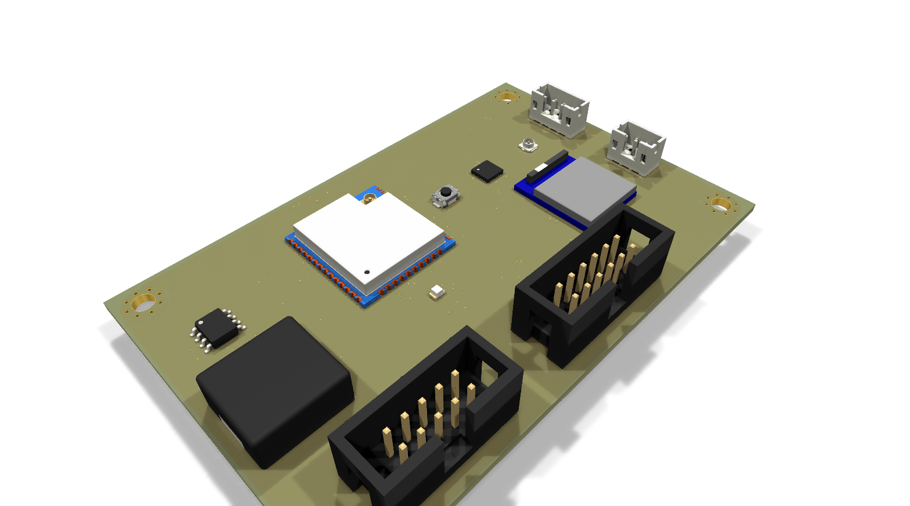
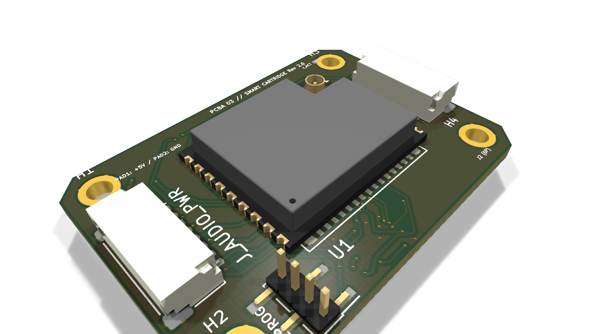
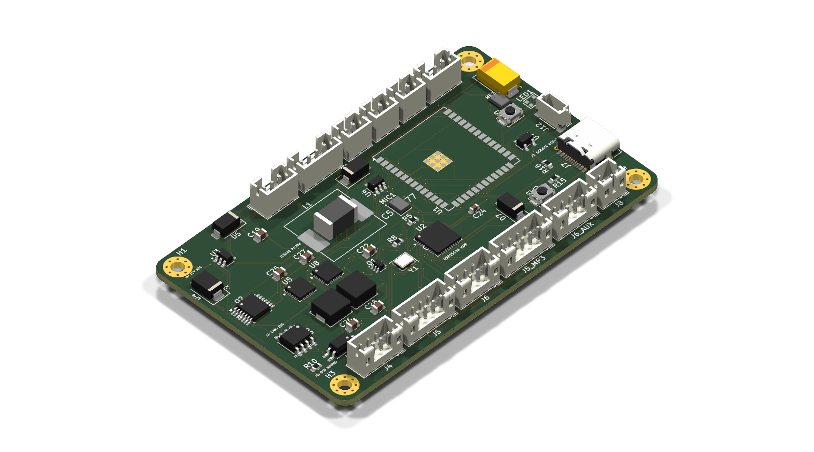
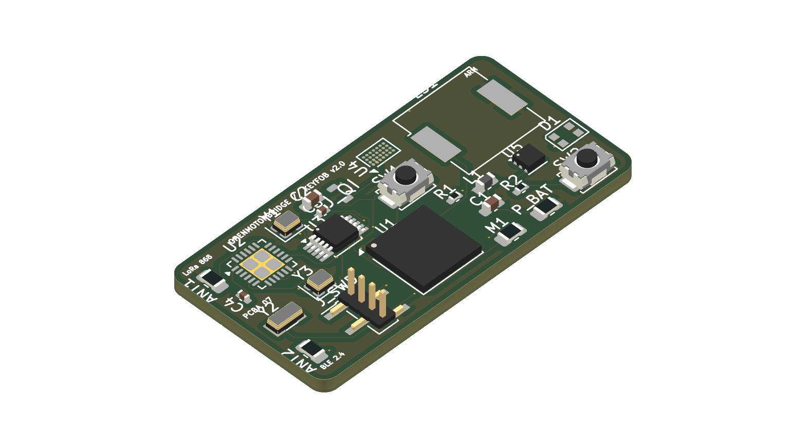
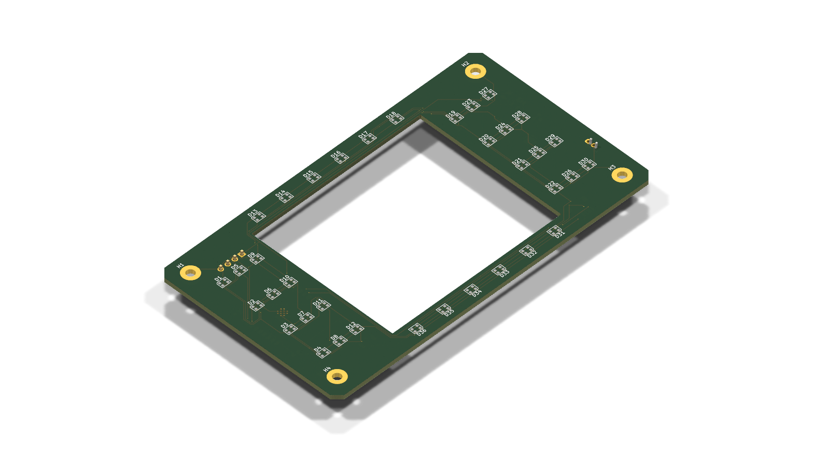

# 07 - Hardware-Architektur & Platinen-Pinouts (Das bereinigte 5-PCBA-Lineup)

Dieses Dokument bildet die **zentrale, autoritative Hardware-Spezifikation aller 5 aktiven Platinen-Baugruppen (`PCBA 01`, `03`, `05`, `07`, `08`)** des OpenMotorBridge Gesamtsystems (v9.6 Clean All-UWB Architecture), einschließlich Lagenaufbau, Impedanzkontrolle, Net-Klassen, Funktionszonen und vollständigen Pinout-Tabellen.

---

## 1. Systemübersicht des 5-Platinen-Lineups

Das Hardwaredesign von OpenMotorBridge folgt dem Grundsatz der radikalen Entflechtung: Daten- und Audioströme werden zu 100 % drahtlos über ein synchrones Ultra-Wideband-Backbone (UWB 6.5 GHz) geführt, während der fahrzeuggebundene Kabelbaum auf reine 2-Draht-Gleichspannung (12V DC) und CAN-Bus reduziert ist.

```
+----------------------------------------------------------------------------------------+
|                   DAS 5-PLATINEN-LINEUP DER OPENMOTORBRIDGE v9.6                       |
+-------+-------------------------------+---------------+---------+----------------------+
| Baugruppe | Name & Funktion           | Platinenmaße  | Lagen   | Kern-ICs / Bauteile  |
+-------+-------------------------------+---------------+---------+----------------------+
| **PCBA 01**| **Zentralbox Main Controller** | 85 x 55 mm    | 4 Lagen | ESP32-S3, QCC3084 BT,|
|       | (Unter der Sitzbank, Audio/USV)| (77x47 mm M3) | (ENIG)  | LM5164, BQ24075,     |
|       |                                |               |         | ES8388, SX1262 LoRa, |
|       |                                |               |         | DW3110 UWB, DTM-12   |
+-------+-------------------------------+---------------+---------+----------------------+
| **PCBA 03**| **Universal Smart Cartridge** | 35 x 25 mm    | 2 Lagen | Qorvo DW3110 UWB,    |
|       | (Kassettenträger Bucht 1 & 2) | (29x19 mm M2) | (ENIG)  | ESP32-C6, ES8388,    |
|       |                                | 2-seitig SMT  |         | 4x AO3400A, J_ACT    |
+-------+-------------------------------+---------------+---------+----------------------+
| **PCBA 05**| **Universal Front-Knoten**    | 82 x 50 mm    | 4 Lagen | ESP32-S3, DW3110 UWB,|
|       | (Cockpit, GNSS, Sensoren, UWB)| (4x M2.5)     | (ENIG)  | SAM-M10Q, USB2514B,  |
|       |                               |               |         | SC8102 PD20W, TPS2051|
+-------+-------------------------------+---------------+---------+----------------------+
| **PCBA 07**| **2-in-1 LoRa Smart-Keyfob**  | 38 x 19 mm    | 2 Lagen | Nordic nRF52840 SoC, |
|       | (Silent Pager, N52 Key & Qi)  | (Tasche M2)   | (ENIG)  | SX1262 LoRa, DRV2605L|
|       |                               |               |         | BQ51003 Qi, JST-ACH  |
+-------+-------------------------------+---------------+---------+----------------------+
| **PCBA 08**| **Radar 2.0 Sub-MCU & Wings** | 115 x 65 mm   | 2 Lagen | ESP32-C5, DW3110 UWB,|
|       | (Wheeltec 77GHz & V2X Patch)  | (Flügel M2.5) | (ENIG)  | Wheeltec MR20,       |
|       |                               |               |         | 36x WS2812B, JWPF 12V|
+-------+-------------------------------+---------------+---------+----------------------+
```

### 1.1 Gliederung nach Systemkomponenten
1. **Kern-Baugruppen (Standard-Ausstattung jedes Bikes):**
   * **`PCBA 01` (Zentralbox Main Controller):** Zentrale Recheneinheit unter der Sitzbank für Energie-Management, USV, DSP-Mischung, Dual-Bluetooth-Headsets, LoRa-Schwarm und UWB-Koordination.
   * **`PCBA 03` (Universal Smart Cartridge):** Universelle Trägerplatine für Bucht 1 und Bucht 2. Beherbergt wahlweise Sena SPIDER X Slim, Cardo Packtalk Edge, Midland PMR446 oder das OMM 2.4 GHz Intercom Modul.
   * **`PCBA 05` (Universal Front-Knoten):** Cockpit-Einheit für Multi-GNSS (SAM-M10Q), Kaltluft-Sensorik, Ambient-Mikrofon, USB-Hub und Headless CarPlay/Android Auto Bridge.
2. **Empfohlene Erweiterungen & Peripherie:**
   * **`PCBA 07` (2-in-1 LoRa Smart-Keyfob & Silent Pager):** Tragbarer Schlüsselanhänger für 4,5 km Weitbereichs-Alarmierung, N52-Magnetschlüssel und induktive Qi-Ladung.
   * **`PCBA 08` (Radar 2.0 Sub-MCU & Warnflügel):** Heckmodul mit 77-GHz-mmWave-Sensorik, autonomem Brems- und Kollisionsstrobe sowie 5.9 GHz V2X-Uplink.
3. **Ersatzlos entfallene Baugruppen (Architektur-Bereinigung v9.6):**
   * **`PCBA 02` (Pod-Basisplatine):** Ersatzlos gestrichen. Die Zuleitung führt direkt auf zwei vergoldete Federkontakte im Schachtboden.
   * **`PCBA 04` (Heck-Pod 3):** Ersatzlos gestrichen. Heck-Pod 3 entfällt vollständig; LoRa sitzt auf `PCBA 01`, GNSS auf `PCBA 05`.
   * **`PCBA 06` (MagSafe Frame Dock Platine):** Ersatzlos gestrichen. Die elektrische Verbindung bei Koffer-Pods erfolgt über einen handelsüblichen industriellen 2-Pin Magnet-Pogo-Steckverbinder (IP68 COTS).

---

## 2. Fertigungsstandard & JLCPCB 4-Lagen Stackup (JLC04161H-7628)

Für alle 4-Lagen-Platinen (`PCBA 01` und `PCBA 05`) wird der identische, streng impedanzkontrollierte Lagenaufbau verwendet:

```
+-------------------------------------------------------------+
| Layer 1 (F.Cu - Top): High-Speed Signale, USB-Diff, Bauteile|  (35 µm / 1 oz Cu)
+-------------------------------------------------------------+
| -- Prepreg 7628 (Dielektrikum, Er = 4.4, Dicke 0.2 mm) --   |
+-------------------------------------------------------------+
| Layer 2 (In1.Cu): Durchgängige Massefläche (GND_PWR / AGND) |  (17.5 µm Standard)
+-------------------------------------------------------------+
| -- FR4 Core (Isolationskern, Dicke 1.0 mm) --------------   |
+-------------------------------------------------------------+
| Layer 3 (In2.Cu): Power-Planes (VCC_3V3, VCC_5V Polygone)   |  (17.5 µm Standard)
+-------------------------------------------------------------+
| -- Prepreg 7628 (Dielektrikum, Er = 4.4, Dicke 0.2 mm) --   |
+-------------------------------------------------------------+
| Layer 4 (B.Cu - Bottom): Sekundär-Routing, DW3110 UWB       |  (35 µm / 1 oz Cu)
+-------------------------------------------------------------+
```

### 2.1 Standardisierte Net-Klassen & Leiterbahn-Geometrien
* **`Default`:** Leiterbahnbreite $0{,}20\,\text{mm}$, Mindestabstand $0{,}20\,\text{mm}$ (Logiksignale, GPIOs).
* **`Power_5V_12V`:** Leiterbahnbreite $0{,}60\,\text{mm}$ (Stromtragfähigkeit bis $2{,}2\,\text{A}$ bei $\Delta T < 10\,^\circ\text{C}$).
* **`RF_50R`:** Leiterbahnbreite $0{,}35\,\text{mm}$, Koplanarabstand $0{,}20\,\text{mm}$ zur Massefläche (50 Ohm Wellenwiderstand für 868 MHz LoRa und DW3110 UWB 6.5 GHz).
* **`USB_90R_DIFF`:** Leiterbahnbreite $0{,}20\,\text{mm}$, differentieller Leiterbahnabstand $0{,}15\,\text{mm}$ ($90\,\Omega \pm 10\,\%$ Differenzimpedanz für USB 2.0 High-Speed 480 Mbps).
* **`Audio_Sensitive`:** Leiterbahnbreite $0{,}25\,\text{mm}$, Abstand $0{,}30\,\text{mm}$ (abgeschirmt durch flankierende GND-Leiterbahnen).

---

## 3. PCBA 01: Zentralbox Main Controller (`openmotorbridge_central_box`)



*Abbildung 7.1: KiCad 3D-Render der Zentralbox-Hauptplatine (PCBA 01, 85 x 55 mm, 4 Lagen) mit ESP32-S3 WROOM-1, Qualcomm QCC3084 BT 5.4 Audio SoC, LM5164-Q1 72V Buck, BQ24075 USV, ES8388 DSP-Codec, Semtech SX1262 LoRa, Qorvo DW3110 UWB Transceiver und automotiven Deutsch DTM-12 Header.*

### 3.1 Technische Platinen-Kenndaten & Top/Bottom-Aufteilung
* **Abmessungen:** $85{,}0 \times 55{,}0\,\text{mm}$ (Außenkontur mit 4x M2.5 Montagebohrungen, $77{,}0 \times 47{,}0\,\text{mm}$ Lochabstand).
* **Lagenaufbau:** 4 Lagen FR-4 High-TG150 ($1{,}6\,\text{mm}$ Gesamtdicke, ENIG-Goldfinish).
* **Bestückung Top-Layer (F.Cu):**
  * **Hauptcontroller:** Espressif `ESP32-S3-WROOM-1` (Dual-Core @ 240 MHz, 16 MB Flash, 8 MB Octal-PSRAM) für Systemsteuerung, CAN-Bus, FreeRTOS DSP-Pipeline und PWA-Webserver.
  * **Dedizierter Helm-Audio-SoC:** **Qualcomm QCC3084** Bluetooth 5.4 Audio-SoC für Dual-A2DP (aptX HD, Low Latency), LE Audio Auracast Broadcast und kristallklare Hands-Free Telefonie (HFP 1.8 mit Wideband Speech).  
    *(Wichtige Entkopplung: Der interne BLE-Stack des ESP32-S3 dient rein dem WebApp-Dashboard und Sensordaten, während der QCC3084 das Helm-Audio völlig unbeeinflusst von CPU-Spitzen abwickelt).*
  * **Weitbereichsfunk:** Semtech `SX1262` LoRa Transceiver (+22 dBm PA) mit U.FL-Buchse zur Taoglas FXP895 Antenne in der Gehäusedeckeltasche.
  * **Audio-Codec:** Everest Semi `ES8388` 24-Bit / 48 kHz Low-Power Stereo-Audio-Codec.
  * **Bordnetz-Speisung:** Texas Instruments `LM5164-Q1` synchroner 72V-Buck-Converter und TI `BQ24075` Power-Path-Controller mit Ladeschaltung für die interne 2.200-mAh-USV-Zelle.
  * **eFuse-Schutzschalter:** 3x Texas Instruments `TPS25921` elektronische Sicherungen für die getrennte Absicherung der externen Abgänge (Bucht 1, Bucht 2, Front-Knoten/Radar).
  * **Bedienelemente & Interface:** Hardware-Taster `SW1` (Pairing / Werkseinstellung) und 12-poliger automotiver Deutsch DTM-12 Buchsenleiste `J1`.
* **Bestückung Bottom-Layer (B.Cu):**
  * **UWB-Funkknoten:** Qorvo `DW3110` Ultra-Wideband IEEE 802.15.4z Transceiver (Kanal 5 @ 6.489 GHz) mit ultrakurzer U.FL-Zuleitung zur Taoglas FXUWB10 Antenne in der Gehäusebodentasche.
  * **Sensoren:** 6-Achs-IMU (ICM-42688P / LIS3DH) zur Wake-on-Motion Diebstahlüberwachung und Bosch BMP390 Barometer.
  * Durchgehende thermische Massevias zur Wärmeabfuhr des LM5164 und der eFuses.

### 3.2 Pinbelegung des 12-poligen Deutsch DTM-12 Steckverbinders (`J1`)

```
+----------------------------------------------------------------------------------------+
| DEUTSCH DTM-12 PINBELEGUNG (ZENTRALBOX POWER, CAN & DC-PEITSCHEN)                      |
+-----+----------------+--------------------------+-------------+------------------------+
| Pin | Signalname     | Signalart / Pegel        | Querschnitt | Funktion & Schutz      |
+-----+----------------+--------------------------+-------------+------------------------+
|  1  | KL30_IN        | +9V...+72V DC Dauerplus  | AWG20 0.50² | Bordnetz Dauerplus     |
|  2  | KL15_IGN       | +9V...+72V DC Zündungspl.| AWG22 0.34² | Zündungssignal (KL15)  |
|  3  | VEHICLE_GND    | Power-Masse (0V)         | AWG20 0.50² | Zentrale Bordnetzmasse |
|  4  | CAN_H          | CAN-FD High (ISO 11898-2)| AWG24 0.22² | Fahrzeug-CAN Bus High  |
|  5  | CAN_L          | CAN-FD Low (ISO 11898-2) | AWG24 0.22² | Fahrzeug-CAN Bus Low   |
|  6  | POD1_VCC       | +12V geschaltet (0,5A)   | AWG22 0.34² | DC-Power Bucht 1 (eFuse|
|  7  | POD1_GND       | Power-Masse (0V)         | AWG22 0.34² | Masse Bucht 1 (Links)  |
|  8  | POD2_VCC       | +12V geschaltet (0,5A)   | AWG22 0.34² | DC-Power Bucht 2 (eFuse|
|  9  | POD2_GND       | Power-Masse (0V)         | AWG22 0.34² | Masse Bucht 2 (Rechts) |
| 10  | RADAR_PWR_12V  | +12V geschaltet (1,0A)   | AWG22 0.34² | DC-Power Heck-Radar    |
| 11  | RADAR_GND      | Power-Masse (0V)         | AWG22 0.34² | Masse Heck-Radar       |
| 12  | CHASSIS_EARTH  | Schirmmasse              | AWG20 0.50² | Gehäuse- & Schirmschutz|
+-----+----------------+--------------------------+-------------+------------------------+
```

### 3.3 Pinbelegung & Systemanbindung: Qualcomm QCC3084 BT 5.4 Audio SoC (`U9`)

Der auf der Oberseite (`F.Cu` bei $X=175{,}0, Y=106{,}0$) platzierte **Qualcomm QCC3084** ($13 \times 18\,\text{mm}$ Modul mit integrierter Keramik-Chipantenne) verbindet die Helme drahtlos über hardware-beschleunigtes Dual-A2DP (aptX HD / Adaptive) und HFP 1.8:

```
+----------------------------------------------------------------------------------------+
| QUALCOMM QCC3084 PINBELEGUNG & SCHNITTSTELLEN ZUM ESP32-S3 / ES8388                    |
+-----+----------------+--------------------+-------------------+------------------------+
| Pin | Signalname     | Signalart          | Verbunden mit     | Funktion & Protokoll   |
+-----+----------------+--------------------+-------------------+------------------------+
|  1  | VCC_3V3        | Power In (+3.3V)   | LM5164 3.3V Bus   | Modul-Betriebsspannung |
|  2  | GND            | Masse (0V)         | GND_PWR Plane     | HF- und Systemmasse    |
|  3  | I2S_MCLK       | Digital In (Clock) | ESP32-S3 (GPIO 9) | Master-Clock (12.288M) |
|  4  | I2S_BCLK       | Digital In (BitClk)| ESP32-S3 (GPIO 10)| Bit-Clock (3.072 MHz)  |
|  5  | I2S_WS         | Digital In (LRCK)  | ESP32-S3 (GPIO 11)| Word-Select (48 kHz)   |
|  6  | I2S_DOUT       | Digital In (Audio) | ESP32-S3 (GPIO 12)| Stereo-PCM zum QCC3084 |
|  7  | I2S_DIN        | Digital Out (Mic)  | ESP32-S3 (GPIO 13)| HFP-Mikrofon zum DSP   |
|  8  | GND            | Masse (0V)         | GND_PWR Plane     | HF-Schirmmasse         |
|  9  | BT_UART_TX     | Digital Out (UART) | ESP32-S3 (GPIO 18)| QCC3084 Telemetrie/AT  |
| 10  | BT_UART_RX     | Digital In (UART)  | ESP32-S3 (GPIO 17)| ESP32 AT-Steuerbefehle |
| 11  | BT_EN          | Digital In (Reset) | ESP32-S3 (GPIO 16)| Kaltstart & Power-Down |
| 12  | GND            | Masse (0V)         | GND_PWR Plane     | HF-Schirmmasse         |
+-----+----------------+--------------------+-------------------+------------------------+
```

* **Integrierte Keramik-Chipantenne:** 2.402–2.480 GHz, Gewinn $+2{,}0\,\text{dBi}$, omnidirektionale Charakteristik nach oben/vorn zum Cockpit und Fahrer-/Sozius-Helm.
* **Keine Koax-Zuleitung:** Durch die direkte Abstrahlung vom Modulsubstrat bleibt das Innere der Zentralbox aufgeräumt und störungsarm.

---

## 4. Satelliten Pod-Gehäuse & Entfall von PCBA 02 (Monolithisches Gehäuse)

Die frühere Pod-Basisplatine (`PCBA 02`) ist in v9.6 **vollständig und ersatzlos entfallen**:
1. **Monolithischer Gehäusekörper:** Das Pod-Gehäuse (`pod_base_housing.stl`) ist ein 100 % passives 3D-Druck-Präzisionsteil (MJF PA12).
2. **Direkte 2-Draht DC-Federkontaktierung:** Die 2-adrige DC-Leitung vom Deutsch DTM-12 Stecker führt über eine rückseitige Formdichtung direkt in den Schacht und endet an zwei massiven, vergoldeten Federkontakten (Mill-Max).
3. **Null Ausfallrisiko:** Keine Schalter, keine aktiven ICs und keine empfindlichen Buchsen im Spritzwasserbereich der Kofferträger.

---

## 5. PCBA 03: Universal Smart Cartridge (`openmotorbridge_pod_cartridge` Rev 3.0)



*Abbildung 7.3: KiCad 3D-Render der Universal Smart Cartridge (PCBA 03 Rev 3.0, 35 x 25 mm, 2 Lagen ENIG, 2-seitig SMT) mit Qorvo DW3110 UWB Transceiver, ESP32-C6 Host-MCU, ES8388 Stereo-Codec, 4x AO3400A MOSFETs, 8-Pin Mechatronik-Header J_ACT und 6-Pin Audio-Power-Header J_AUDIO_PWR.*

### 5.1 Technische Platinen-Kenndaten & Funktionale Lagen-Aufteilung
* **Abmessungen:** $35{,}0 \times 25{,}0\,\text{mm}$ (Raster $29{,}0 \times 19{,}0\,\text{mm}$ mit 4x M2 Befestigungsbohrungen).
* **Lagenaufbau:** 2 Lagen FR-4 High-TG150 ($1{,}2\,\text{mm}$ Dicke, $35\,\mu\text{m}$ Cu beidseitig, ENIG-Goldfinish).
* **Bestückung Top-Layer (F.Cu - Mechatronik, Steuerung & Audio):**
  * `U2`: Espressif `ESP32-C6` RISC-V Host-MCU (verwaltet Kassetten-Profile, UWB-Kommunikation und Aktuator-Timings).
  * `U3`: Everest Semi `ES8388` 24-Bit / 48 kHz Stereo-Audio-Codec. Wandelt das analoge Mikrofon- und Lautsprechersignal von Sena, Cardo oder Midland direkt auf der Kassette und streamt es digital via UWB.
  * `Q1` - `Q4`: 4x N-Kanal MOSFETs (`AO3400A`, SOT-23, $30\,\text{V} / 5{,}7\,\text{A}$) samt Freilaufdioden `D1`-`D4`. Platziert unmittelbar neben dem Header `J_ACT` für kürzeste Leiterbahnwege zu den Taster-Aktuatoren.
  * `J_ACT`: 8-poliger $1{,}0\,\text{mm}$ JST-SH Header zur Ansteuerung der 4 Miniatur-Hubmagnete.
  * `J_AUDIO_PWR`: 6-poliger $1{,}0\,\text{mm}$ JST-SH Header zur Anbindung des Adapterkabelstrangs an das jeweilige OEM-Headset.
* **Bestückung Bottom-Layer (B.Cu - HF & Stromaufnahme):**
  * `U1`: Qorvo `DW3110` Ultra-Wideband Transceiver (6.489 GHz Ch. 5) mit integrierter PCB-Antenne. Strahlungsrichtung zeigt nach unten durch den Kunststoffboden der Kassette für optimale Funkverbindung zur Zentralbox.
  * `PAD1` & `PAD2`: Stirnseitige, massive vergoldete Kontaktflächen (ENIG) für die 2-Draht DC-Federkontakte des Pods.
  * `F1`: Selbstrückstellende 500mA PPTC-Sicherung.

### 5.2 Pinbelegung des Audio-Power-Headers (`J_AUDIO_PWR` / 6-Pin JST-SH 1.0mm)
| Pin | Signalname | Richtung | Funktion & OEM-Verbindung |
| :---: | :--- | :---: | :--- |
| **1** | `GND` | Power / Masse | Schirm- und Systemmasse |
| **2** | `VCC_HEADSET` | Power Out (+5V/+3.8V)| Geregelte Betriebsspannung für das Intercom-Modul |
| **3** | `AUDIO_R+` | Audio In $\leftarrow$ OEM | Line-Out Lautsprecher Rechts vom Headset zum ES8388 ADC |
| **4** | `AUDIO_R-` | Audio In $\leftarrow$ OEM | Lautsprecher Massebezug |
| **5** | `MIC_IN+` | Audio Out $\rightarrow$ OEM| Mikrofonsignal vom ES8388 DAC in das Headset |
| **6** | `OPTO_PTT` | Bidir / Open-Drain | PTT-Tastung gegen Masse (Midland PMR446 / Aux) |

### 5.3 Pinbelegung des Aktuator-Headers (`J_ACT` / 8-Pin JST-SH 1.0mm)
| Pin | Signalname | Ansteuerung | Mapping: Sena SPIDER X Slim | Mapping: Cardo Packtalk Edge |
| :---: | :--- | :---: | :--- | :--- |
| **1 & 2** | `VCC_5V` | Dauer-5V | Gemeinsame Versorgungs-Schiene für alle 4 Aktuatoren |
| **3** | `ACT1_OUT` | MOSFET `Q1` | **Plus (+)** (Lauter / Menü vor) | **Media Button** (Front/Top) |
| **4** | `ACT2_OUT` | MOSFET `Q2` | **Minus (-)** (Leiser / Menü zurück)| **Mobile Button** (Phone/Pairing) |
| **5** | `ACT3_OUT` | MOSFET `Q3` | **Center / Phone** (Bestätigen)   | **Intercom Button** (DMC Grouping) |
| **6** | `ACT4_OUT` | MOSFET `Q4` | **Mesh Button** (45° seitlich)    | **Control Wheel Center-Press** |
| **7 & 8** | `GND` | Power-Masse | Massebezug für Rückstrom | Massebezug für Rückstrom |

---

## 6. PCBA 04: Heck-Pod 3 (Ersatzlos entfallen)

Die Heckplatine `PCBA 04` und das zugehörige Heckgehäuse Pod 3 sind **vollständig gestrichen**:
* Der Semtech SX1262 LoRa-Transceiver arbeitet direkt auf der Zentralbox (`PCBA 01`).
* Das u-blox SAM-M10Q GNSS-Modul arbeitet im Fahrtwindeinlass des Front-Knotens (`PCBA 05`).

---

## 7. PCBA 05: Universal Front-Knoten (`openmotorbridge_front_node`)



*Abbildung 7.5: KiCad 3D-Render des Universal Front-Knotens (PCBA 05, 82 x 50 mm, 4 Lagen) mit ESP32-S3-WROOM-1U, Qorvo DW3110 UWB Transceiver (Unterseite), u-blox SAM-M10Q GNSS, Microchip USB2514B Hub, Southchip SC8102 USB-PD 20W Fast-Charge, TI TPS2051B Power-Gate, Knowles I2S MEMS Mikrofon und WS2812B RGB-Status-LED.*

### 7.1 Technische Platinen-Kenndaten
* **Abmessungen:** $82{,}0 \times 50{,}0\,\text{mm}$ (Gehäuseaußenmaß $98 \times 68 \times 25\,\text{mm}$ mit 4-in-1 Halterung).
* **Lagenaufbau:** 4 Lagen FR-4 High-TG150 ($1{,}6\,\text{mm}$, ENIG-Goldfinish).
* **Top-Layer:** ESP32-S3 Controller, USB2514B USB-Hub, u-blox SAM-M10Q Multi-GNSS mit integrierter Patchantenne, Knowles SPH0645LM4H I2S MEMS Akustiksensor, WS2812B-2020 RGB-LED und 5 GHz Wi-Fi Anbindung für Headless CarPlay / Android Auto.
* **Bottom-Layer:** Qorvo DW3110 UWB Transceiver (6.489 GHz Ch. 5), TI LMR36015 Buck, SC8102 USB-PD 20W Fast-Charger, TI TPS2051B Lastschalter für automatischen Dongle-Kaltstart und Auto-Café-Modus.

---

## 8. PCBA 06: MagSafe Frame Dock (Ersatzlos entfallen)

Die separate Platine `PCBA 06` ist in v9.6 **vollständig und ersatzlos entfallen**:
* Da über die fahrzeugseitige Koffer-Trennstelle ausschließlich 2-Draht DC-Gleichspannung geführt wird, kommt anstelle einer proprietären Leiterplatte ein **industrieller 2-Pin Magnet-Pogo-Steckverbinder (IP68 COTS)** zum Einsatz.
* Kurzschlussschutz und Überlastbegrenzung erfolgen zentral auf `PCBA 01` durch die jeweiligen **TI TPS25921 eFuses**.

---

## 9. PCBA 07: 2-in-1 LoRa Smart-Keyfob (`openmotorbridge_smart_keyfob`)



*Abbildung 7.7: 3D-Render der ultrakompakten PCBA 07 Trägerplatine (38,0 x 19,0 mm, 2 Lagen) mit Nordic nRF52840 SoC, Semtech SX1262 LoRa Transceiver, TI DRV2605L Haptik-Treiber, BQ51003 Qi-Ladecontroller und 2-Pin JST-ACH Induktions-Spulenanschluss.*

### 9.1 Technische Platinen-Kenndaten & Lötfreie Qi-Montage
* **Abmessungen:** $38{,}0 \times 19{,}0 \times 1{,}0\,\text{mm}$ (2-Lagen FR-4, ENIG-Goldfinish).
* **Kern-Chips:**
  * Nordic `nRF52840` SoC (Bluetooth Low Energy 5.4, ARM Cortex-M4F @ 64 MHz, Hardware-Crypto).  
    *(BLE gewährleistet einen extrem sparsamen Ruhestrom von $< 25\,\mu\text{A}$, sodass die 200-mAh-Zelle monatelang betriebsbereit bleibt).*
  * Semtech `SX1262` LoRa Transceiver (868.5 MHz Kanal 3, empfängt Alarme bis zu 4,5 km Reichweite).
  * Texas Instruments `DRV2605L` Haptiktreiber für Vybronics 10x3.6mm LRA Linearmotor.
  * Texas Instruments `BQ51003` Qi Wireless Power Receiver Controller.
* **100 % Lötfreie Induktionsspulen-Montage (`J_QI`):**
  * Die 28-mm-Qi-Empfängerspule wird über einen ultrakompakten **2-poligen JST-ACH SMD-Header (`J_QI`)** vibrationsfest angesteckt.
  * Beim Zusammenbau sind keinerlei manuelle Lötarbeiten erforderlich.

---

## 10. PCBA 08: 77 GHz mmWave Radar Sub-MCU & Warnflügel (`openmotorbridge_radar_submcu`)



*Abbildung 7.8: 3D-CAD-Ansicht der PCBA 08 mit symmetrischem 115 x 65 mm Flügelkörper, zentralem 61 x 51 mm Radardurchbruch für das Wheeltec MR20 mmWave Radar, 36x WS2812B-2020 LEDs, ESP32-C5 Sub-MCU und integriertem Qorvo DW3110 UWB Transceiver.*

### 10.1 Technische Platinen-Kenndaten & All-UWB Backbone
* **Abmessungen:** $115{,}0 \times 65{,}0 \times 1{,}6\,\text{mm}$ (2 Lagen FR-4 High-TG150, ENIG-Goldfinish).
* **Zentraler Radardurchbruch:** $61{,}0 \times 51{,}0\,\text{mm}$ rechteckiges Sichtfenster für das Wheeltec MR20 77-GHz-Sensormodul.
* **Bestückung:**
  * Espressif `ESP32-C5` Dual-Band RISC-V SoC (2.4/5 GHz Wi-Fi 6, BLE 5.0, 5.9 GHz V2X-Uplink).
  * Qorvo `DW3110` Ultra-Wideband Transceiver (`U3`) mit U.FL-Buchse `J4` für eine Taoglas FXUWB10 Flexantenne. Sämtliche Radar-Rohdatenvektoren werden drahtlos über UWB an die Zentralbox gestreamt (**Null Kupfer-Datenleitungen zum Fahrzeug**).
  * 36x SMD `WS2812B-2020` RGB-LEDs auf den symmetrischen Warnflügeln (18 links / 18 rechts).
* **Steckverbinder:**
  * `J1`: Wasserdichter 2-poliger 12V Automotive-Stecker (JST JWPF) für Zuleitung (`RADAR_PWR_12V` / `RADAR_GND`). Der frühere Binder M5 Stecker entfällt ersatzlos.
  * `J2`: 4-Pin JST-SH Header zum Wheeltec MR20 mmWave Radar (UART1 @ 115.200 Baud).
* **Autonome Notfall-Strobe-Steuerung:**
  * Erkennt der lokale ESP32-C5 einen herannahenden Auffahrunfall (Time-to-Collision $\text{TTC} < 1{,}5\,\text{s}$), löst er den hochfrequenten Notfall-Strobe der 36 LEDs **lokal in $< 1\,\text{ms}$** aus - völlig unabhängig vom Funkverkehr zur Zentralbox.
