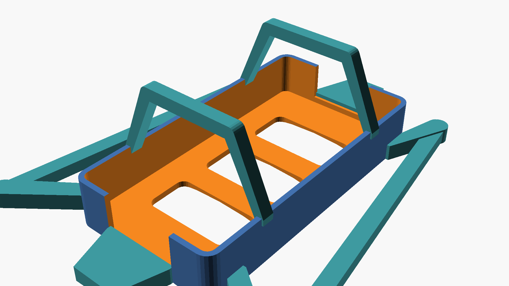
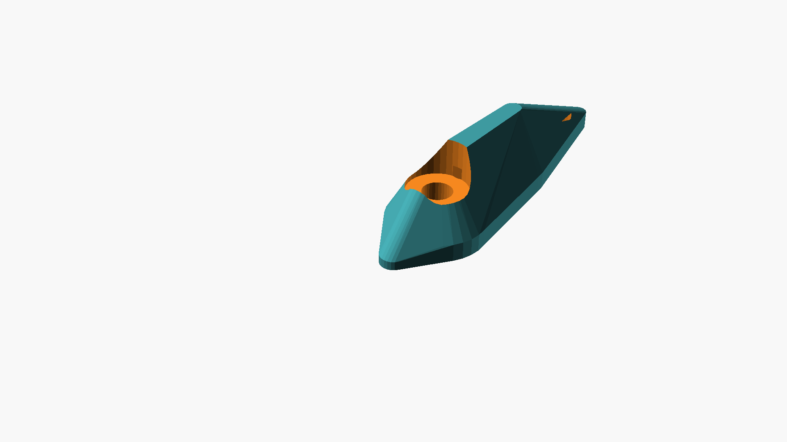
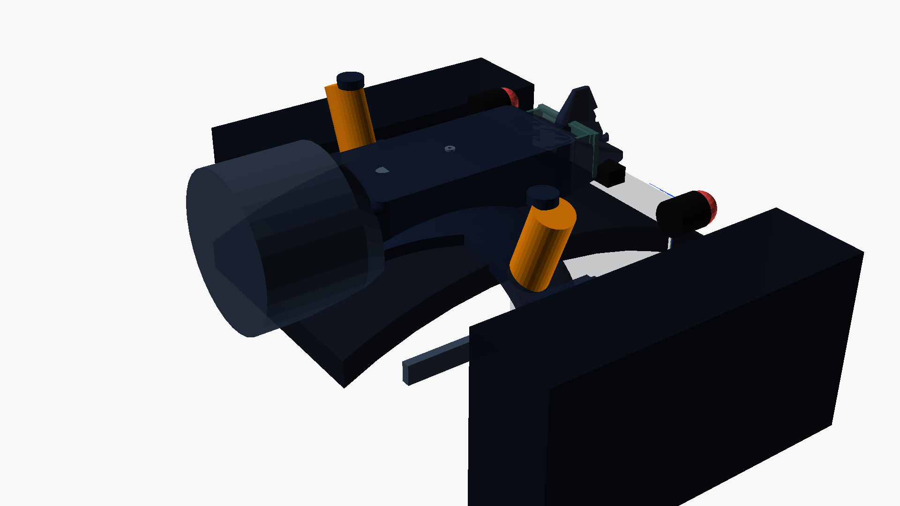
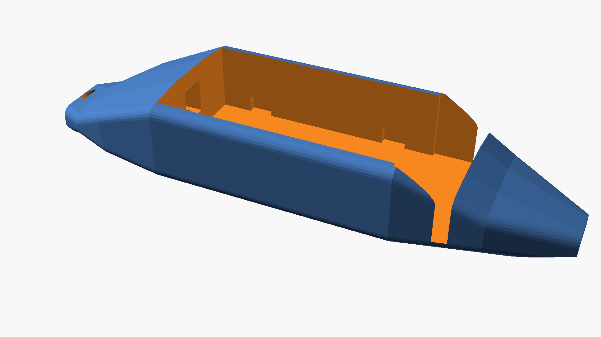
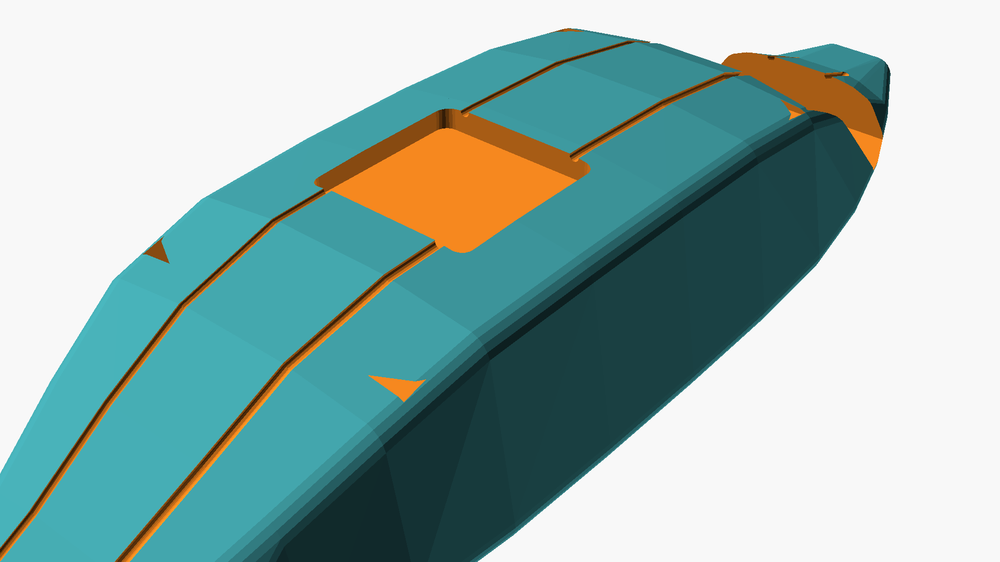
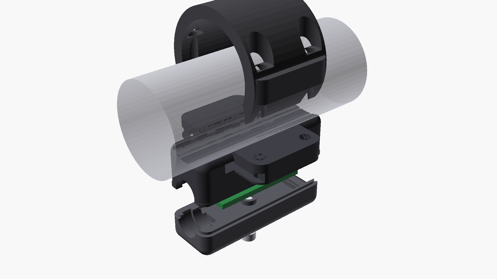

# 08 - Mechanische Gehäuse, CAD-Konstruktion & Dichtungssystem (Alle Baugruppen)

Dieses Dokument spezifiziert die mechanische Konstruktion, das Thermomanagement, das IP67/IP69K-Gehäusedesign, die Kinematik des Auto-Eject-Schnellwechselsystems sowie alle CAD- und STL-Modelle aller Gehäuse-Baugruppen der OpenMotorBridge v8.0:
1. **Zentrale Steuerbox (Typ A):** 3-teiliges Sandwich-Gehäuse mit Zwischenboden, integrierter Akku-Wanne, stirnseitiger Schnittstellenleiste (HD26, USB-C, RGB-LED) und planarem 4-Layer Kupfer-Wärmespreader.
2. **Universelle Satelliten-Pods (Typ B):** Baugleiches 5-seitiges Monocoque-Schachtgehäuse für Pod 1, 2 und 3 mit $120^\circ$-V-Nut Rohrbett, M8 6-Pin IP67-Rückanschluss, Schutz-Schottwand und federbelastetem Auto-Eject.
3. **Modulare Wechselkassetten (Typ C):** Generischer 2-teiliger Universal-Basisschlitten mit asymmetrischer Poka-Yoke Nut-und-Feder-Führung für Sena 50S/60S, Cardo Packtalk Edge/Bold, OMM-Transceiver und hermetische IP67 Blindkassette (Dry Box).
4. **Heck-Pod 3 & Radar-Ausleger (Typ D):** Strömungsgünstiger Heckbürzel-Transceiver mit dielektrischem Antennenradom für 868 MHz LoRa und Multi-GNSS sowie winkelverstellbarem Halter für Totwinkel-Radar (Garmin Varia).
5. **Universal Front-Knoten (Typ E):** Ultrakompakter Cockpit- & Sensor-Hub ($84 \times 60 \times 23\,\text{mm}$) mit **4-in-1 Universal-Befestigungssystem** (AMPS, Rohrbügel-Prisma, Silentblöcke, 3M Dual-Lock), EPDM-Kabelkämmen und Knowles MEMS Akustikkanal.
6. **Fahrzeugspezifische Referenz-Montagekits (Zero-Drill):** Vollständig konstruierte, zerstörungsfreie Bolt-On Montagekits für CVO Road Glide ST (Kit 1), Road King Special (Kit 2), Classic Bagger & Cruiser (Kit 3) sowie Adventure & Touring Enduros (BMW GS, KTM Adventure, Africa Twin – Kit 4).

---

## 1. Gehäuse Typ A: Zentrale Steuerbox (3-Teiliges Sandwich-Design)

Das Basisgehäuse der Zentralbox ist als modulares, 3-teiliges IP67/IP69K-Sandwichgehäuse aus **PA12 (MJF-Verfahren)** oder **Aluminium-Druckguss** konzipiert, das speziell für raue Motorrad-Bedingungen (Vibrationen bis $20\,\text{g}$, Spritzwasser, Hitzestau unter der Sitzbank) ausgelegt ist:

- **Außenabmessungen:** $110{,}0 \times 74{,}0 \times 38{,}0\,\text{mm}$ (L x B x H; Unterwanne $17{,}0\,\text{mm}$, Oberwanne $15{,}0\,\text{mm}$, Deckel $6{,}0\,\text{mm}$).
- **Befestigung:** 4x integrierte Ecklaschen an der Unterwanne mit **Lochabstand $128{,}0 \times 56{,}0\,\text{mm}$** für schwingungsdämpfende **M4 Silentblöcke (Shore 50A EPDM)** zur Entkopplung hochfrequenter Motorvibrationen.
- **Lichte Innenmaße:** $102{,}0 \times 66{,}0 \times 32{,}0\,\text{mm}$ (optimiert für die $85{,}0 \times 55{,}0\,\text{mm}$ 4-Layer Hauptplatine).
- **Material & Fertigung:** PA12 im HP Multi Jet Fusion (MJF) 3D-Druck (min. $3{,}0\,\text{mm}$ Wandstärke), kugelgestrahlt, im Heißbad chemisch geglättet und hydrophob versiegelt.
- **Schutzart:** IP67 / IP69K (strahlwasser- und tauchdicht bis $1\,\text{m}$ Wassertiefe sowie dampfstrahlbeständig).

### 1.1 3D-CAD-Modell & 3-Schichten-Sandwichaufbau


*Abbildung 8.1: Photorealistischer 3D-CAD-Schräganschnitt der zentralen Steuerbox. Sichtbar sind die 3 Schichten im geschlossenen Verbund: Unterwanne mit 4-Layer-Platine (ENIG) auf M2.5 Dämpfern, Zwischenboden mit 11 Konvektionsschlitzen, oberes Akku-Fach mit 1S LiPo-USV-Batterie und EPDM-Spannband, HD26-Flansch, USB-C Servicekappe sowie Deckel mit Gore-Membran.*


*Abbildung 8.2: 3D-CAD-Konstruktionsübersicht der zentralen Steuerbox (Typ A).*

```
┌────────────────────────────────────────────────────────────┐  ▲
│ 1. GEHÄUSEDECKEL (6,0 mm Höhe / 3,0 mm Wandstärke)         │  │
│    • Gore ePTFE Druckausgleichsmembran (Ø 7,0 mm)          │  │ 38,0 mm
│    • Umlaufende Nut mit Shore 40A Silikon-Profildichtung   │  │ Gesamt-
│    • 100% homogener, geschlossener Vollkunststoff-Deckel   │  │ höhe
├────────────────────────────────────────────────────────────┤  │
│ 2. OBERWANNE MIT ZWISCHENBODEN (15,0 mm Höhe)              │  │
│    • Stirnwand (Alle Anschlüsse & Anzeige):                │  │
│      - HD26 D-Sub Flansch (Haupt-Kabelbaum)                │  │
│      - Wasserdichter USB-C Service-Port (Alu-Schraubkappe) │  │
│      - Wasserdichtes RGB-Status-LED-Sichtfenster (Ø 3 mm)  │  │
│    • Oberes Fach (auf dem Zwischenboden):                  │  │
│      - 1S LiPo-USV-Pufferakku (52x36x6.5mm) in Akkuwanne   │  │
│      - EPDM-Gummispannband zur vibrationsfesten Fixierung  │  │
│    • Zwischenboden (Optimierte Zirkulationsebene):         │  │
│      - 25,0 x 4,0 mm Kabeldurchbruchsschlitz               │  │
│      - 11x Konvektions- & Druckausgleichsschlitze          │  │
├────────────────────────────────────────────────────────────┤  │
│ 3. UNTERWANNE (17,0 mm Höhe - Geschlossene Monocoque-Wanne)│  │
│    • 4-Layer Hauptplatine (85 x 55 mm) auf M2.5 Dämpfern   │  │
│    • 2x 35 µm massive Kupfer-Innenlagen als Wärmespreader  │  │
│    • 4x M4 Silentblock-Befestigungsohren (vibrationsfest)  │  │
│    • 100% geschlossener PA12-Boden ohne Gehäusedurchbrüche │  │
└────────────────────────────────────────────────────────────┘  ▼
```

### 1.2 3D-Explosionsdarstellung & Schichtaufbau (1:1:1 CAD Fitting)


*Abbildung 8.3: 1:1:1 euklidische CAD-Explosionsdarstellung der Zentralbox entlang der vertikalen Z-Achse.*

### 1.3 3D-Röntgenansicht & Zusammenbau-Fitting


*Abbildung 8.4: Transparente 3D-Röntgenansicht der vollständig geschlossenen Zentralbox. Erkennbar sind die spielfreien Bauteilfreiräume, die geschützte Akku-Lagerung auf dem Zwischenboden, die durchgängige Konvektion über die 11 Zwischenbodenschlitze und der scheuerfreie Kabelverlauf zum HD26-Flansch.*

### 1.4 Maßstabsgetreuer Längs- & Querschnitt (X-Z Thermik & Y-Z Kabelführung)


*Abbildung 8.5: Exakte 2D-Schnittansichten der Zentralbox (X-Z und Y-Z Ebenen).*

---

## 2. Thermomanagement & Planare PCB-Entwärmung (Kupferbolzenfrei)

Die Gesamtabwärme der Zentralbox liegt im normalen Fahrbetrieb bei lediglich **$\approx 1{,}5\,\text{W}$** (Peak bei maximaler Schnellladung: $2{,}45\,\text{W}$).

```
       4-LAYER LEITERPLATTE (PLANARER KUPFER-WÄRMESPREADER)
┌────────────────────────────────────────────────────────┐
│ [ LM5164 Buck ]     [ BQ24075 UPS ]     [ ESP32-S3 ]   │ ◄── Bauelemente (SMD)
│   (100V DCDC)       (Power-Path)        (Dual-Core)    │
├────────────────────────────────────────────────────────┤
│ ▓▓▓▓▓▓▓▓▓▓▓▓▓▓▓▓▓▓▓▓▓▓▓▓▓▓▓▓▓▓▓▓▓▓▓▓▓▓▓▓▓▓▓▓▓▓▓▓▓▓▓▓▓▓▓ │ ◄── Layer 2: 35 µm Solid GND Plane
├────────────────────────────────────────────────────────┤
│ ▓▓▓▓▓▓▓▓▓▓▓▓▓▓▓▓▓▓▓▓▓▓▓▓▓▓▓▓▓▓▓▓▓▓▓▓▓▓▓▓▓▓▓▓▓▓▓▓▓▓▓▓▓▓▓ │ ◄── Layer 3: 35 µm Solid PWR/GND Plane
└──────────────────────────┬─────────────────────────────┘     (λ = 390 W/m·K, 93.5 cm² Fläche)
                           │
 ┌─────────────────────────▼─────────────────────────────┐
 │ 11x ZWISCHENBODEN-KONVEKTIONSSCHLITZE & INNENLUFT     │ ◄── Freie Zirkulation in 210 cm³
 │ (Wärme verteilt sich homogen im gesamten Gehäuse)     │     Luftvolumen & Gore ePTFE-Vent
 └─────────────────────────┬─────────────────────────────┘
                           ▼
          Abgabe über PA12-Gehäuseoberfläche (300 cm²) an Fahrtwind
```

1. **Planarer 4-Layer Kupfer-Wärmespreader ($85 \times 55\,\text{mm}$):** Die beiden massiven $35\,\mu\text{m}$ Innenlagen der FR4-Platine leiten die Wärme blitzschnell ab ($\lambda = 390\,\text{W/(m}\cdot\text{K)}$).
2. **11x Optimierte Konvektionsschlitze im Zwischenboden:** 5 Schlitze an der Rückkante ($Y = 58\,\text{mm}$), 4 an den Flanken und 2 an der Front lassen die Luft ungehindert in die Deckelkammer aufsteigen.
3. **Thermische Sicherheitsmargen im Extrem-Stresstest (Stau bei $45\,^\circ\text{C}$ Hitze + $13\,^\circ\text{C}$ Motorwärme = $58\,^\circ\text{C}$ unter Sitz):**
   * **LM5164-Q1:** $T_j = 93{,}8\,^\circ\text{C}$ (Zulässig bis $+150\,^\circ\text{C}$ $\rightarrow$ $+56{,}2\,^\circ\text{C}$ Reserve).
   * **ESP32-S3:** $T_j = 90{,}2\,^\circ\text{C}$ (Zulässig bis $+105\,^\circ\text{C}$ $\rightarrow$ $+14{,}8\,^\circ\text{C}$ Reserve).
   * **3.3V LDO:** $T_j = 110{,}4\,^\circ\text{C}$ (Zulässig bis $+125\,^\circ\text{C}$).
   * **1S LiPo Akku:** Verbleibt in der oberen Kammer sicher unter $60\,^\circ\text{C}$ (JEITA-NTC pausiert Ladevorgang bei $> 45\,^\circ\text{C}$).

### 2.2 Oberwanne: 1S LiPo-Akkuaufnahme & Zwischenboden-Durchführungen
* **Integrierte LiPo-Akkutasche:** Auf der Oberseite des Zwischenbodens sitzt eine formschlüssige Aussparung ($55{,}0 \times 32{,}0 \times 8{,}5\,\text{mm}$) für eine 1000 mAh 1S LiPo-Pufferzelle (Typ 103040 oder 803048).
* **Vibrationssicherung:** Eine $1{,}0\,\text{mm}$ dämpfende EPDM-Schaumstoffmatte an der Unterseite und ein quer verlaufendes EPDM-Gummispannband ($35 \times 10\,\text{mm}$) über seitliche Einhängenocken halten die Zelle auch bei $20\,\text{g}$ Stößen absolut spielfrei.
* **4-Poliger JST-PH Akkuanschluss (`J3`):**
  * Pin 1: `VBAT+` ($+3{,}7\,\text{V}$ LiPo Pluspol über BQ24075)
  * Pin 2: `NTC_10K` (Murata 10k NTC Temperaturfühler für JEITA-Ladeüberwachung)
  * Pin 3: `GND` (LiPo Masse)
  * Pin 4: `NC` / Schirmung
* **Zwischenboden-Durchführungen:**
  * Zentraler Kabeldurchbruch ($14{,}0 \times 4{,}0\,\text{mm}$) mit beidseitig verrundeten Kanten ($R = 1{,}5\,\text{mm}$) zur knickfreien Führung des internen 2x13 Flachbandkabels von der Hauptplatine zum HD26-Flansch in der Stirnwand.
  * 2x Montagefenster für den Zugriff auf die M2.5 Befestigungsschrauben der Hauptplatine.

---

## 3. Stirnseitige Anschlüsse & Anzeige in der Oberwanne

```
                  VORDERE STIRNWAND DER OBERWANNE
┌─────────────────────────────────────────────────────────────┐
│ ┌────────────┐     ┌────────┐      ┌──────────────────────┐ │
│ │ 1. USB-C   │     │ 2. RGB │      │ 3. HD26 D-Sub Flansch│ │
│ │    Service │     │    LED │      │    (Kabelbaum-Buchse)│ │
│ │    Alukappe│     │    Ø3mm│      │    2x M3 Jackscrews  │ │
│ └────────────┘     └────────┘      └──────────────────────┘ │
└─────────────────────────────────────────────────────────────┘
```

1. **HD26 D-Sub Flansch:** Amphenol LTW / NorComp SEAL-D mit EPDM-Flachdichtung ($1{,}5\,\text{mm}$, Shore 60A).
2. **USB-C Service-Port:** Wasserdichte Buchse mit blau eloxierter Aluminium-Schraubkappe und O-Ring.
3. **RGB-Status-LED Sichtfenster:** Diffuser PMMA-Linsenkörper ($\varnothing\,3{,}0\,\text{mm}$) mit umlaufendem O-Ring.

---

## 4. Gehäuse Typ B: Universeller Satelliten-Pod (Pod 1, 2 und 3)

Alle 3 Pod-Positionen nutzen dasselbe 5-seitige Monocoque-Schachtgehäuse im erweiterten Envelope ($135{,}0 \times 70{,}0 \times 38{,}0\,\text{mm}$):


*Abbildung 8.6: Photorealistischer 3D-CAD-Schräganschnitt des Satelliten-Pods mit eingeschobener Wechselkassette. Gut zu erkennen sind die 120°-V-Nut mit EPDM-Spannringen um das Motorrad-Rahmenrohr, die M8 6-Pin-Buchse, die innere Schottwand mit den beiden komprimierten V4A-Edelstahlfedern, die asymmetrischen Poka-Yoke Gleitschienen mit 8 mm Höhenversatz, der 6-polige Goldkontakt-Eingriff (4,8 mm Wipe-Weg) und die formbündige Dichtung an der Frontblende.*


*Abbildung 8.7: 3D-CAD-Explosionsdarstellung des universellen Satelliten-Pods.*


*Abbildung 8.8: 3D-Röntgen- und Transparenzdarstellung des geschlossenen Satelliten-Pods.*

### 4.1 Rohrbett-Prisma ($120^\circ$) & EPDM-Spannbefestigung
* **An der Unterseite:** $120^\circ$-V-Nut ($R = 15\,\text{mm}$) schmiegt sich formschlüssig an alle Rohre von $\varnothing 18\dots 35\,\text{mm}$ an ($1"$ Sturzbügel, $7/8"$ Heckrahmen).
* **4x Einhängenasen:** Blitzschnelle Montage mit 2 UV-beständigen EPDM-Gummiringen bei gleichzeitiger Schwingungsdämpfung.

### 4.2 Kinematik des Auto-Eject & Snap-Fit Systems

```
                       AUTO-EJECT & SNAP-FIT KINEMATIK (DRAUFSICHT X-Y)
┌──────────────────────────────────────────────────────────────────────────────────────────────┐
│ POD-GEHÄUSE-TUNNEL (PA12, 100 x 60 mm)                                                       │
│                                                                                              │
│   ┌──────────────┐                                                     ┌─────────────────┐   │
│   │ Schutz-      │  ◄── V4A Auswerferfeder (k = 1.2 N/mm)              │ Rasttasche      │   │
│   │ Schottwand   ├───[§§§§§§§§§]───────────────┐                       │ in Tunnelwand   │   │
│   │ (x = 22 mm)  │   F_preload = 7.2 N         │                       │ (x = 86 mm)     │   │
│   │              │                             │                       │    ┌───────┐    │   │
│   │              │   6-Pin Vergoldeter         │ KASSETTEN-SCHLITTEN   │    │ 85°   │    │   │
│   │   ┌──────┐   │   Steckverbinder-Eingriff   │ (openmotorbridge_     │    │ Zahn  │    │   │
│   │   │6-Pin ├───┼════════════════════════════►│  cartridge_sled)      ├────┴┤ ▲    │    │   │
│   │   │Stift ├───┤   Wipe = 4.8 mm             │                       │  ┌──┘ │    └───┐│   │
│   │   └──────┘   │                             │                       │  │30° │        ││   │
│   │              │                             │                       │  │Ein-│        ││   │
│   │              ├───[§§§§§§§§§]───────────────┘                       │  │lauf│        ││   │
│   │              │  ◄── V4A Auswerferfeder                             │  └──┬─┘        ││   │
│   └──────────────┘                                                     │     │          ││   │
│                                                                        │  ┌──▼────────┐ ││   │
│                                                   Federnder PA12-Arm   │  │DRUCKTASTE │ ││   │
│                                                   (L=14 mm, b=10 mm) ──┴──┤(Geriffelt)│ ◄┼───┼── Daumen-/Zeigefinger-
│                                                                           └───────────┘ ││   │   Druck (F_squeeze = 10 N)
│                                                                           FRONTBLENDE   ││   │
└─────────────────────────────────────────────────────────────────────────────────────────┴┴───┘
```

| Parameter | Berechneter Wert | Funktion & Sicherheitsnachweis |
| :--- | :---: | :--- |
| **Federrate (2x V4A Federn)** | **$2{,}4\,\text{N/mm}$** | Parallelschaltung zweier Edelstahl-Druckfedern (DIN EN 13906-1) |
| **Vorspannfederweg** | **$6{,}0\,\text{mm}$** | Kompression von $L_0 = 15\,\text{mm}$ auf $L_{\text{mated}} = 9\,\text{mm}$ |
| **Axiale Haltekraft (Preload)** | **$7{,}2\,\text{N}$** | Hält Dichtsitz permanent unter Druck gegen $20\,\text{g}$ Vibration |
| **Dichtungs-Gegenkraft** | **$4{,}5\,\text{N}$** | $30\,\%$ Kompression der umlaufenden $1{,}5\,\text{mm}$ Silikon-Dichtschnur |
| **Auszugskraft (Rückhalt)** | **$> 65\,\text{N}$** | Verhindert unbeabsichtigtes Lösen durch Zugbelastung am Kabel |
| **Entriegelungskraft (Squeeze)**| **$9{,}8\,\text{N}$** | Ergonomisch optimierter Daumen-Zeigefinger-Druck ($\approx 1\,\text{kg}$) |
| **Automatischer Auswurfhub** | **$9{,}0\,\text{mm}$** | Trennt 6-Pin Wipe ($4{,}8\,\text{mm}$) mit **$+4{,}2\,\text{mm}$ Überhub** |

#### 4.2.1 Die 4 kinematischen Bewegungsphasen des Kassetteneinschubs
1. **Phase 1 - Vorzentrierung ($x = 0\dots 80\,\text{mm}$):** Asymmetrische Führungsrippen greifen in die Gehäusenuten ein. Seitliches Spiel wird auf $\pm 0{,}2\,\text{mm}$ eingeengt.
2. **Phase 2 - Feder-Kompression ($x = 80\dots 86\,\text{mm}$):** Die Stirnseite des Schlittens trifft auf die beiden V4A-Auswerferfedern in der Schottwand. Die Federn bauen die $7{,}2\,\text{N}$ Vorspannkraft auf.
3. **Phase 3 - 6-Pin Kontakt-Eingriff & Schnapp-Rastung ($x = 86\dots 91\,\text{mm}$):** Die 6 Hartgold-Stifte dringen $4{,}8\,\text{mm}$ tief in die Doppelschenkel-Buchsenleiste ein (Wipe). Die $30^\circ$-Einlaufschrägen der Rastnasen spreizen die federnden PA12-Arme nach innen.
4. **Phase 4 - Formbündige Verriegelung ($x = 91\,\text{mm}$):** Die $85^\circ$-Sperrkanten der Rastarme schnappen mit hörbarem Klick in die Rasttaschen der Gehäusewand. Die Silikon-Dichtung wird um $30\,\%$ komprimiert.

#### 4.2.2 Spannungs- & Ermüdungsnachweis des PA12-Biegebalkens
* **Abmessungen:** Länge $L = 14{,}0\,\text{mm}$, Breite $b = 10{,}0\,\text{mm}$, Dicke $h = 1{,}8\,\text{mm}$, Auslenkung $\delta = 1{,}8\,\text{mm}$.
* **Maximale Randfaserdehnung:**
  $$\epsilon_{\max} = \frac{3 \cdot h \cdot \delta}{2 \cdot L^2} = \frac{3 \cdot 1{,}8\,\text{mm} \cdot 1{,}8\,\text{mm}}{2 \cdot (14{,}0\,\text{mm})^2} = \mathbf{1{,}38\,\%}$$
* **Zulässige Dauerdehnung für MJF PA12:** $\epsilon_{\text{zul}} \le 2{,}0\,\%$.
* **Biegespannung:** $\sigma_b = \epsilon_{\max} \cdot E_{\text{PA12}} = 0{,}0138 \times 1.700\,\text{MPa} = \mathbf{23{,}5\,\text{MPa}}$ (Weit unterhalb der PA12-Streckgrenze von $48\,\text{MPa} \rightarrow$ **Sicherheitsfaktor $S = 2{,}04$**).
* **Dauerfestigkeit:** Ausgelegt für $> 10.000$ Ver- und Entriegelungszyklen ohne plastische Verformung.

#### 4.2.3 Kontaktsicherheit & Wipe-Länge
* **Freie Stiftlänge:** $6{,}5\,\text{mm}$ Vierkant-Prägestifte ($0{,}64 \times 0{,}64\,\text{mm}$, $0{,}76\,\mu\text{m}$ Hartgold über Nickel).
* **Effektiver Wipe-Weg:** **$4{,}8\,\text{mm}$** Eingriff in die Buchsenleiste (übertrifft die USCAR-2 Kfz-Norm von $\ge 1{,}5\,\text{mm}$ um den **Faktor 3,2**).
* **Prellfreiheit:** $7{,}2\,\text{N}$ permanente Vorspannung verhindert Kontaktprellen selbst bei Vibrationen bis $20\,\text{g}$.

### 4.3 Asymmetrisches Poka-Yoke Nut-und-Feder Führungskonzept


*Abbildung 8.9: 3D-CAD-Querschnitt (Y-Z Ebene) durch das Satelliten-Pod-Gehäuse und den Kassetten-Grundschlitten. Sichtbar ist der $8{,}0\,\text{mm}$ Höhenversatz der Führungsnuten (Links: $Z=10{,}0\,\text{mm}$, Rechts: $Z=18{,}0\,\text{mm}$). Ein $180^\circ$-Falscheinbau ist mechanisch ausgeschlossen.*

### 4.4 Dual-Port Anschluss-Architektur der Pod-Basis (Entflechtung & Koffer-Integration)

Um sowohl exponierte Outdoor-Einsätze (z. B. Sturzbügel-Montage bei Adventure-Bikes oder Heckradar Pod 3) als auch geschützte Koffer-Innenmontagen ohne selbstgelötete Adapterkabel abzudecken, verfügt die Pod-Bodenplatine ([`openmotorbridge_pod_base.kicad_pcb`](file:///Users/schmidtm/openMotorBridge/hardware/kicad_pod_base/openmotorbridge_pod_base.kicad_pcb)) über eine **Dual-Port-Architektur**:

```
                       POD-BASISPLATINE (DRAUFSICHT / LAYOUT)
 ┌────────────────────────────────────────────────────────────────────────┐
 │                                                                        │
 │   [ PORT A: M8 6-Pin ]                   [ PORT B: USB-C Slim ]        │
 │   (Outdoor / Heckradar)                  (Koffer / Innenmontage)       │
 │   Robuste Schraubbuchse                  Hinter TPU-Schutzstopfen      │
 │            │                                         │                 │
 │            └───► [ AUTOMATISCHER POWER-MUX / ] ◄─────┘                 │
 │                  [ IDEAL-DIODEN (LM66100)    ]                         │
 │                                │                                       │
 │                                ▼                                       │
 │                    [ SP3012 ESD-Array ]                                │
 │                                │                                       │
 │                                ▼                                       │
 │                    [ J1: Mill-Max 6-Pin Pogo ]                         │
 │                    (Zentriert zum Kassetten-Eingriff)                  │
 │                                                                        │
 └────────────────────────────────────────────────────────────────────────┘
```

1. **Mechanische Entflechtung von `J1` und `J2`:**
   * Bisher saß die M8-Buchse (`J2`) auf der Unterseite der Platine direkt axial hinter der 6-poligen Mill-Max Pogo-Pin-Leiste (`J1`), was zu einem engen vertikalen Bauraumkonflikt entlang der Z-Achse führte.
   * Durch die Aufteilung in **Port A (M8, links)** und **Port B (Slim-Port, rechts)** liegt die Pogo-Pin-Leiste in der Mitte frei. Die mechanische Aufbauhöhe entspannt sich signifikant.
2. **100 % Erhalt der Gehäuse- & Platinenabmessungen (Null Längenzuwachs):**
   * Die Pod-Basisplatine behält ihre kompakten Abmessungen von **$36{,}0 \times 20{,}0\,\text{mm}$** bei.
   * Das äußere 5-seitige Monocoque-Gehäuse verbleibt exakt im standardisierten Envelope von **$135{,}0 \times 70{,}0 \times 38{,}0\,\text{mm}$**. Die Abmessungen wurden historisch exakt auf das ungeöffnete Originalgehäuse des Sena +Mesh Adapters (B2M-01) mit seinen Clip-Führungen kalibriert und bleiben für 100 % OEM-Garantieerhalt unverändert.
   * **Port A Quadratischer Durchbruch ($11{,}5 \times 11{,}5\,\text{mm}$):** Damit der Pod für die massive Basis des M8-Printsteckers nicht künstlich um mehrere Millimeter verlängert werden muss, besitzt die Heckwand eine exakt angepasste quadratische Öffnung mit $R = 1{,}5\,\text{mm}$ Verrundung. Die quadratische Basis der Buchse taucht vollständig durch die $3{,}5\,\text{mm}$ Wand nach außen durch; das M8-Messinggewinde liegt für die Überwurfmutter des Motorrad-Kabelbaums frei zugänglich außen.
   * **Planare Platinenabstützung ohne Wipp-Effekt (2x M2-Verschraubung an H1 & H2):** An der Schottwand bei $X = 18{,}0\,\text{mm}$ sind zwei präzise M2-Schraubdome angeformt, die exakt auf die Platinenbohrungen **H1 ($Y = 20\,\text{mm}$)** und **H2 ($Y = 50\,\text{mm}$)** bei $Z = 19{,}0\,\text{mm}$ treffen. Beim Verschrauben wird die Platine absolut plan gegen die Schottwand gezogen. Da die M8-Basis frei durch die Heckwand tritt, gibt es keinen einseitigen Hochpunkt – ein Verkippen oder Wackeln der Platine ist mechanisch ausgeschlossen.
3. **Hardware-Arbitrierung (Prioritäts- & Rückspeiseschutz):**
   * Ein integrierter Ideal-Dioden-Power-Multiplexer (z. B. TI LM66100 / P-Kanal MOSFETs) schaltet automatisch die jeweils aktive Versorgungsspannung durch.
   * Wird Port A (M8) mit Bordnetz versorgt, wird Port B (Slim-Port) rückspeisefest gesperrt. Wird im Koffer Port B versorgt, ist Port A inaktiv. Ein versehentlicher Kurzschluss oder Parallelbetrieb ist physikalisch ausgeschlossen.
4. **Axiale Ausrichtung & Eingelassene Stecktasche (Tiefenkompensation):**
   * **Senkrechte Buchsenausrichtung:** Die USB-C-Buchse (`J3`) auf `B.Cu` steht wie die M8-Buchse **senkrecht** (normal zur Platinenoberfläche) in axialer Steckrichtung.
   * **Tiefen-Kompensation ($7{,}0\,\text{mm}$ Stecktasche):** Da die Platine durch die $116\,\text{mm}$ Kassettenlänge an der Schottwand bei $X = 18{,}0\,\text{mm}$ ($X = 16{,}4\,\text{mm}$ Platinenrückseite `B.Cu`) fixiert ist, reicht eine standardmäßige vertikale USB-C-Buchse ($H \approx 9{,}5 \dots 10{,}0\,\text{mm}$) bis $X \approx 6{,}9\,\text{mm}$. An der Gehäuserückwand ist daher eine **$7{,}0\,\text{mm}$ tiefe Stecktasche** ($14{,}0 \times 8{,}5\,\text{mm}$) mit $45^\circ$ Einlaufschräge und innenliegendem Dichtkragen (`pod_rear_usbc_internal_sleeve`) eingeformt.
   * **Mechanischer Schlagschutz & Querkraft-Entlastung:** Durch das tiefe Einlassen im Gehäuse fängt die Gehäusewand sämtliche Biege- und Hebelkräfte des Kabels ab. Der Stecker wird seitlich geführt, die filigrane Kontaktzunge der USB-Buchse ist vor Abreißen und Stoß geschützt.
   * **Passgenauigkeit:** Die Buchsenöffnung schließt am Grund der Stecktasche exakt bündig ab. Handelsübliche USB-C-Kabelstecker finden kollisionsfreien Halt und rasten spürbar ein.
   * **TPU-Versiegelung:** Bei Außenbetrieb über Port A dichtet der formangepasste TPU-Schutzstopfen ([`008_pod_base_usbc_cap_tpu.scad`](file:///Users/schmidtm/openMotorBridge/hardware/cad/scad/02_pod_base/parts/008_pod_base_usbc_cap_tpu.scad)) die $7{,}0\,\text{mm}$ tiefe Stecktasche mit doppelten Dichtlippen hermetisch (IP67) und gehäusebündig ab.
5. **Universelle Multi-Plattform-Nutzung (Begleitfahrzeug / Pkw-Cockpit / Werkbank):**
   * Derselbe Pod kann ohne Modifikation oder zusätzliche Adapterplatinen in einem Begleitfahrzeug (Support-Van, Tour-Guide-Pkw, Besenfahrzeug) eingesetzt werden: Statt starre, schwere Industrie-M8-Kabelbäume durch den Fahrzeuginnenraum zum Armaturenbrett zu verlegen, wird der Pod einfach über Port B mit einem handelsüblichen, extrem flexiblen Slim-USB-C-Kabel an einen 12V-USB-Adapter oder eine Bordbuchse angeschlossen.
   * **100 % Universalität:** Ein einziges physikalisches Pod-Design deckt somit nahtlos **Outdoor-Motorrad** (Port A, M8 IP67), **Koffer-Innenraum** (Port B, MagSafe-Kupplung) und **Begleitfahrzeug / Testbench** (Port B, Standard-Slim-Kabel) ab.

---

## 5. Gehäuse Typ C: Modulare Wechselkassetten


*Abbildung 8.10: Die modularen Wechselkassetten-Varianten im Überblick: OMM Heck-Transceiver (vorne links), Sena 50S/60S Quick-Snap Cradle (vorne rechts), Cardo Magnetic Air Mount (hinten links) und wasserdichte IP67 Blindkassette (hinten rechts).*

### 5.1 Benutzerzentrierte Plug & Play Docking-Architektur (0 Lötaufwand)
Um Signale vom 90°-abgewinkelten **JST-SH 1.0 mm 6-Pin SMD-Steckverbinder (`J2`)** auf der Kassetten-Trägerplatine verwechslungs- und knickfrei zu den Kontaktpunkten des jeweiligen Adapters zu führen, besitzt der Kassetten-Schlitten:
* **Geschützten Unterflur-Kabelkanal:** Im Boden des PA12-Schlittens ist eine **$1{,}5\,\text{mm}$ tiefe und $8{,}0\,\text{mm}$ breite Kabelführung** direkt unterhalb des Konturbetts integriert.
* **Zwischenboden-Durchführung:** Ein präziser **$10{,}0 \times 3{,}0\,\text{mm}$ Durchbruch mit beidseitig $R=1{,}0\,\text{mm}$ verrundeten Kanten** führt das Flachbandkabel von Header `J2` auf der unteren Platine nach oben ins Nest.
* **Standardisierte Pin-Belegung am JST-SH 6P Header (`J2`):**

| Pin | Signal-Name | Funktion am Headset-Adapter | Sena 50S/60S Pad | Cardo Edge Pad | Midland XT / PMR |
| :---: | :--- | :--- | :--- | :--- | :--- |
| **1** | `GND` | Gemeinsamer Massebezug | Pin 1 (GND) | Pin 1 (GND) | Masse / Shield |
| **2** | `5V_VBUS` | Gefilterte Ladespeisung (500mA PTC) | Pin 2 (USB-5V) | Pin 2 (5V Charge)| 5V DC In |
| **3** | `AUDIO_R+` | Audio Diff-Out + (zum Lautsprecher-In) | Pin 4 (Spk R+) | Pin 3 (Spk +) | Speaker In + |
| **4** | `AUDIO_R-` | Audio Diff-Out - (Lautsprecher-Rückleiter)| Pin 5 (Spk R-) | Pin 4 (Spk -) | Speaker In - |
| **5** | `MIC_IN+` | Audio Diff-In + (vom Mikrofon-Out) | Pin 6 (Mic +) | Pin 5 (Mic +) | Mic Out + |
| **6** | `OPTO_PTT` | Optokoppler PTT / Button Synthesis | Pin 7 (Mesh-Btn)| N/C (Aux) | PTT Switch |

### 5.2 Sena 50S / 60S Kontur-Nest & Snap-Cradle


*Abbildung 8.11: CAD-Visualisierung der Sena 50S/60S Wechselkassette mit federnder 7-Pin Pogo-Kontaktleiste.*

### 5.3 Sena +Mesh & Universal Slide-Inlay (Klasse A mit externem Antennenanschluss)
Für das Sena +Mesh (oder andere OEM-Adapter mit Antennen- und Ladeanschluss) bietet die Kassetten-Frontblende (`00_base_sled.scad` & `01_insert_sena.scad`):
* **100 % zerstörungsfreie Nutzung des ungeöffneten OEM-Geräts:** Das Sena +Mesh wird im Originalgehäuse belassen.
* **Formschlüssiges Schlitten-Inlay:** Bildet exakt die OEM-Rahmenbefestigungsplatte mit 2x Quer-Schiebestegen (Hakenabstand $30\,\text{mm}$) und federnder Rastzunge ab.
* **Integrierte SMA-Flansch-Bohrung ($\varnothing\,6{,}5\,\text{mm}$):** Mit zylindrischer O-Ring-Dichtsenkung ($\varnothing\,9{,}5 \times 1{,}2\,\text{mm}$) an der Deckelstirnseite für eine IP67 SMA-Flansch-Doppelbuchse (Female-to-Female).
* **Interner Koax-Kabelkanal:** Ausgesparter Durchbruch im Schlittenboden für die biege- und knickfreie Führung des internen $8\,\text{cm}$ RG-178 Pigtails (mit 90°-SMA-Winkelstecker zum Sena +Mesh).
* **EPDM-Spannband-Aufnahme:** Einhängehaken für ein elastisches EPDM-Gummiband ($35 \times 10\,\text{mm}$), das den Adapter vibrationsfest im Negativbett sichert.
* **Elektrische Speisung:** Flaches 90° Micro-USB / USB-C Pigtail von Pin 1 (`GND`) und Pin 2 (`5V_VBUS`) des JST-SH Headers `J2`.

### 5.4 Cardo Packtalk Edge / Pro Magnetic Air Mount


*Abbildung 8.12: CAD-Visualisierung der Cardo Packtalk Edge Wechselkassette mit N52-Neodym-Magnetsitz und 5 gefederten Kontaktpads.*

### 5.5 Cardo Packtalk Bold / Black Edition
Nutzt die formschlüssigen Schiebe-Gegenkontakte der originalen Cardo-Audiokit-Basisplatte. Das Gerät wird von oben in die mechanische Führung geschoben und federnd arretiert.

### 5.6 Midland BT Mini / BTR1 Advanced & XT30 Slide
* **Midland Intercom Edition (BTR1 / Rush / BT Mini):** Kontur-Aufnahme für Midland Bluetooth- und Wave-Mesh-Intercoms ($70\dots 85\,\text{mm}$ Baubreite).
* **Midland XT Bare-Board Edition:** Nimmt die entkernte Platine eines kompakten Handfunkgeräts (XT10/XT30/G5, $\approx 68 \times 42 \times 10\,\text{mm}$) direkt auf.

### 5.7 PMR446 Transceiver & Bare-Board Modul (SA818S / RDA1846)
Vollständig integriertes 500 mW PMR446-Analogfunkmodul ($38 \times 20\,\text{mm}$) direkt auf der Kassetten-Trägerplatine – wahlweise mit interner 446-MHz-Helix oder robuster SMA-Frontbuchse für große Distanzen.

### 5.8 Längsschnitt-Vergleich Sena & Cardo


*Abbildung 8.13: 2D-Längsschnitt (X-Z Ebene) durch die Sena 50S (oben) und Cardo Packtalk Edge (unten) Kassetten im geschlossenen Pod.*

### 5.9 IP67 Blind- / Leerkassette (Dry Box Dummy)


*Abbildung 8.14: Formidentische IP67 Blindkassette mit integriertem $80 \times 46 \times 16\,\text{mm}$ Notfall-Trockenstaufach.*

---

## 6. Belegung der 6-Pin M8 / Pogo-Schnittstelle & PUR-Kabelbaum-Farbcodierung

| M8 / Pogo-Pin | Leitungsfarbe (PUR-Kabel) | Querschnitt | Signal Pod 1 & 2 (Audio & Intercom) | Signal Pod 3 (Heck-Transceiver) | Schirmung & Verdrillung |
| :---: | :--- | :---: | :--- | :--- | :--- |
| **Pin 1** | **Rot (RD)** | $0{,}34\,\text{mm}^2$ (AWG22) | **`VCC`** (5V geschaltete Speisung via MOSFET) | **`VCC`** (5V Versorgung) | Einzelader (Power) |
| **Pin 2** | **Schwarz (BK)** | $0{,}34\,\text{mm}^2$ (AWG22) | **`GND`** (Dedizierte Power- & Signalmasse) | **`GND`** (Dedizierte Power- & Signalmasse) | Einzelader (Power Ground) |
| **Pin 3** | **Weiß (WH)** | $0{,}14\,\text{mm}^2$ (AWG26) | **`NF_P`** (Symmetrisches Audio + via Bourns) | **`UART_TX`** (Heck-Co-Prozessor $\rightarrow$ Box) | **Paar 1 verdrillt** (mit Pin 4) |
| **Pin 4** | **Blau (BU)** | $0{,}14\,\text{mm}^2$ (AWG26) | **`NF_N`** (Symmetrisches Audio - via Bourns) | **`UART_RX`** (Box $\rightarrow$ Heck-Co-Prozessor) | **Paar 1 verdrillt** (mit Pin 3) |
| **Pin 5** | **Gelb (YE)** | $0{,}14\,\text{mm}^2$ (AWG26) | **`OPTO`** (TLP222A Tastensimulations-Trigger) | **`GNSS_PPS`** (1-PPS Hardware-Zeitnormal) | Einzelader (Steuersignal) |
| **Pin 6** | **Grün (GN)** | $0{,}14\,\text{mm}^2$ (AWG26) | **`1-WIRE_ID`** (DS2401 Silicon Serial Number) | **`1-WIRE_ID`** (DS2401 Heck-Kassetten-ID) | Einzelader (1-Wire Bus) |
| **M8-Gehäuse**| **Kupfergeflecht (BL)**| $> 85\,\%$ Geflecht | **`GND_SHIELD`** (360° Gehäuseschirmung) | **`GND_SHIELD`** (360° Gehäuseschirmung) | Gesamtschirm über M8-Metallkragen |

---

## 7. Gehäuse Typ D: Heck-Pod 3 Transceiver (Backbone & Telemetrie)

Der Heck-Pod 3 vereint den OMM-Transceiver, 868 MHz LoRa und Multi-GNSS (`PCBA 04`, RP2040) in geschützter Heckposition. 

> [!IMPORTANT]
> **Architektonische Modularität (Typ-B-Unantastbarkeit):**
> Das universelle Schachtgehäuse von Pod 3 (Typ B, $135 \times 70 \times 38{,}5\,\text{mm}$ Außenmaße, $100 \times 60 \times 28\,\text{mm}$ Innenraum) bleibt über alle Motorradtypen hinweg **zu 100 % baugleich und unverändert**. Die Aufnahme der Telemetrie- und Funkhardware erfolgt über die standardisierte OMM-Transceiver-Wechselkassette (`cartridge_antenna_bracket_omm.stl` / `04_antenna_bracket_omm.scad`). Die fahrzeugspezifische Adaption an Kotflügel, Gepäckbrücken oder Heckrahmen erfolgt ausschließlich über externe Montagekonsolen oder Haltesysteme.


*Abbildung 8.15: CAD-Explosionsdarstellung des Heck-Pods 3 mit Antennen-Radom, Platine und M8-Bajonettsockel.*


*Abbildung 8.16: Längsschnitt durch den Heck-Pod 3 mit koaxial geschirmter Antennenkammer und $25 \times 25\,\text{mm}$ GNSS-Groundplane.*

---

## 8. Gehäuse Typ E: Universal Front-Knoten (Cockpit- & Sensor-Hub)

Das Gehäuse des Front-Knotens wurde speziell für die geschützte Montage in Motorrad-Frontverkleidungen (Batwing, Sharknose, BMW GS/RT Schnabel) oder an Sturzbügeln entwickelt:

- **Außenabmessungen:** Ultrakompakte **$84{,}0 \times 60{,}0 \times 23{,}0\,\text{mm}$** (L x B x H).
- **Material:** HP Multi Jet Fusion (MJF) PA12, schwarz kugelgestrahlt und chemisch geglättet.
- **Schutzart:** IP67 (tauch- und strahlwasserdicht).


*Abbildung 8.17: Geschlossenes Front-Node IP67-Gehäuse.*


*Abbildung 8.18: 3D-Explosionsdarstellung des Front-Knotens entlang der Z-Achse.*


*Abbildung 8.19: Transparente 3D-Schnittansicht des Front-Knotens mit Knowles MEMS Schallkanal und VBUS-Lastschalter.*

### 8.1 Das 4-in-1 Universal-Befestigungssystem des Front-Knotens


*Abbildung 8.20: Gehäuseunterseite des Front-Knotens mit AMPS-Bohrbild, $120^\circ$ V-Nut Rohrbett, EPDM-Spannnasen, Silentblock-Lochungen und 3M Dual-Lock Klettnuten.*

```
┌────────────────────────────────────────────────────────────────────────────────────────┐
│                   DAS 4-IN-1 UNIVERSAL-BEFESTIGUNGSSYSTEM (BODENANSICHT)               │
├────────────────────────────────────────────────────────────────────────────────────────┤
│ 1. AMPS-LOCHBILD (30 x 38 mm):                                                         │
│    • 4x M4 Messing-Gewindeeinsätze (Ruthex) im Standard-AMPS-Raster                    │
│    • Kompatibel mit allen RAM-Mount Kugeladaptern, Garmin-Haltern & Cockpitstreben     │
├────────────────────────────────────────────────────────────────────────────────────────┤
│ 2. ROHRBÜGEL-PRISMA (120° V-Nut):                                                      │
│    • Integrierte Hohlkehle passend für Rohrdurchmesser von Ø 22 mm bis Ø 32 mm         │
│    • 4x Einhängenasen für 2x wetterfeste EPDM-Spannringe (BMW GS / Sturzbügel)         │
│    • 100 % werkzeuglose Schnellmontage ohne Lackkratzer                                │
├────────────────────────────────────────────────────────────────────────────────────────┤
│ 3. SILENTBLOCK-SCHWINGUNGSENTKOPPLUNG:                                                 │
│    • Eckbohrungen für M4 Silentblöcke (Shore 50A EPDM)                                 │
│    • Isoliert hochfrequente Vibrationen im Verkleidungsschnabel von Einzylinder- / V2  │
├────────────────────────────────────────────────────────────────────────────────────────┤
│ 4. 3M DUAL-LOCK KLETTNUTEN:                                                            │
│    • 2x eingefräste 20 mm Nuten für selbstklebendes 3M Dual-Lock Pilzkopfband          │
│    • Perfekt für ebene Kunststoff-Innenflächen in Batwing- oder Sharknose-Verkleidungen │
└────────────────────────────────────────────────────────────────────────────────────────┘
```

### 8.2 Schnittstellen- & Flankenlayout des Front-Knotens

Die Anordnung der Steckverbinder und Durchführungen an den Gehäuseflanken ist exakt auf das 4-Layer-Platinenlayout der PCBA 05 (`openmotorbridge_front_node.kicad_pcb`) und die Cockpit-Kabelführung abgestimmt:

```
                  FRONT-KNOTEN FLANKEN- & SCHNITTSTELLENLAYOUT
┌─────────────────────────────────────────────────────────────────────────────┐
│                                HINTERSEITE                                  │
│             (Vollwandig geschlossenes HP MJF PA12 Gehäuse, Y = 60 mm)       │
├─────────────────────────────────────────────────────────────────────────────┤
│ LINKE SCHMALSEITE (X = 0 mm)   │ INNENRAUM (PCBA 05)  │ RECHTE SCHMALSEITE (X = 84) │
│                                │                      │                             │
│ • J1: 12V ACC Speisung (Y=38)  │ • ESP32-C3 Controller│ • Geschlossene Wandung (hinten)│
│ • Flansch-Ohr (M4, Y=30 mm)    │ • Knowles MEMS Mic   │ • Flansch-Ohr (M4, Y=30 mm) │
│ • J2: CAN-Bus (Y=25.75 mm)     │ • USB2512B Hub IC    │                             │
│ • J3: PTT-Taster (Y=17.75 mm)  │ • Status-LED D1 (rot)│ • J7: USB-C Service (Y=21.2)│
│   (3-fach EPDM-Dichtkamm)      │                      │   (IP67 TPU-Schutzstopfen)  │
├─────────────────────────────────────────────────────────────────────────────┤
│                                VORDERSEITE                                  │
│        (4-fach EPDM-Dichtkamm für Cockpit- & Sensor-Kabel, Y = 0 mm)        │
│    J6: CarPlay      J5: Handschuhfach      J4: USB-Host      J8: Action-Cam │
│    (X = 23.75 mm)   (X = 37.50 mm)         (X = 51.25 mm)    (X = 64.00 mm) │
└─────────────────────────────────────────────────────────────────────────────┘
```

1. **Vorderseite / Südflanke ($Y = 0\,\text{mm}$):**
   - **4-fach EPDM-Dichtkamm (`south_epdm_cable_comb`):** Führt vier USB-Kabel verwechslungs- und vibrationsfest nach vorne heraus:
     - `J6` ($X = 23{,}75\,\text{mm}$): Apple CarPlay / Android Auto Smartphone-Kabel.
     - `J5` ($X = 37{,}50\,\text{mm}$): Handschuhfach-USB-Ladeport.
     - `J4` ($X = 51{,}25\,\text{mm}$): USB-Host-Schnittstelle.
     - `J8` ($X = 64{,}00\,\text{mm}$): Action-Cam 5V-Lade- und Triggerleitung.
2. **Rechte Schmalseite / Ostflanke ($X = 84{,}0\,\text{mm}$):**
   - **Vordere Flanke ($Y = 21{,}18\,\text{mm}$):** Wasserdichter USB-C Service-Port (`J7`), positioniert auf der rechten Schmalseite **vorne** (unmittelbar neben der Frontkante und der grünen Status-LED `D1`, exakt $13{,}18\,\text{mm}$ von der vorderen Platinenkante entfernt). Ermöglicht bequemes Anstecken eines USB-C Datenkabels für Firmware-Flashen und Diagnose im eingebauten Zustand. Geschützt durch den bündig sitzenden TPU-Dichtstopfen (`front_node_usbc_cap_tpu.stl`) mit integrierter Haltekollier-Lasche.
   - **Mitte ($Y = 30{,}0\,\text{mm}$):** M4/M5 Silentblock-Flanschbefestigungslasche ($Z = 0\dots 5\,\text{mm}$).
   - **Hintere Flanke ($Y = 37\dots 60\,\text{mm}$):** Vollwandig geschlossene Schutzwand.
3. **Linke Schmalseite / Westflanke ($X = 0\,\text{mm}$):**
   - **3-fach EPDM-Dichtkamm (`west_epdm_cable_comb`):** Führt Signal- und Bordnetzleitungen zur Fahrzeugfront:
     - `J3` ($Y = 17{,}75\,\text{mm}$, vorne): PTT-Lenkertaster für Sprechfunk.
     - `J2` ($Y = 25{,}75\,\text{mm}$, mitte): Zweidraht-CAN-Bus zur Zentralbox bzw. zum Fahrzeugnetz.
     - `J1` ($Y = 38{,}0\,\text{mm}$, hinten): 12V Zündungsplus (KL15) Speisung.
   - **Mitte ($Y = 30{,}0\,\text{mm}$):** M4/M5 Silentblock-Flanschbefestigungslasche ($Z = 0\dots 5\,\text{mm}$).
4. **Gehäuseunterseite ($Z = 0\,\text{mm}$):**
   - Schwingungsdämpfender Knowles SPH0645 MEMS Akustikkanal ($\varnothing\,2{,}5\,\text{mm}$) mit wasserdichter, ölabweisender Gore ePTFE-Schutzmembran ($\varnothing\,6{,}0 \times 0{,}8\,\text{mm}$) zur Windgeräusch- und Sprachpegelanalyse.

---

## 9. Fahrzeugspezifische Referenz-Montagekits (Zero-Drill / Bolt-On)

Während die 5 Hardware-Gehäuse (Typ A bis E) zu **100 % universell und einheitlich standardisiert** sind, liefert OpenMotorBridge für ausgewählte Motorradplattformen komplett durchentwickelte, schraub- und klebefreie Referenz-Montagekits. Diese nutzen originale Werksbefestigungspunkte oder elastische Spannsysteme, um das Gesamtsystem ohne Lackschäden oder irreversible Karosseriebohrungen perfekt ins Fahrzeug zu integrieren.

---

### 9.1 Referenz-Kit 1: Harley-Davidson CVO Road Glide ST (2024+) & New Touring Platform

Für High-Performance Bagger mit werkseitiger Einzelsitzbank und Forged-Carbon-Hutze (FLTRXSTSE):
Aufgrund der werkseitigen Showa Inverted-Remote-Reservoir-Stoßdämpfer mit dicken Hydraulikleitungen und des neuen 2024er Heckabschlusses scheiden externe Strut-Konsolen mechanisch aus. Das ST-Referenzkit integriert die 5 Knoten daher zu 100 % unsichtbar und zerstörungsfrei:

```
          CVO ROAD GLIDE ST (2024+) GESAMTSYSTEM-INTEGRATION
┌─────────────────────────────────────────────────────────────────────────────┐
│ 1. COCKPIT (Vorne, unsichtbar hinter Außenhaut):                            │
│    • Front-Node (PCBA 05) + Ottocast am Alu-Geweihträger montiert           │
│    • 12V Zündungsplus direkt vom internen Fairing-Zubehörstecker            │
│    • Funkverbindung (ESP-NOW) zur Zentralbox -> 0 Kabel über den Lenkkopf   │
├─────────────────────────────────────────────────────────────────────────────┤
│ 2. MITTE (Unter Sitzbank):                                                  │
│    • Zentralbox mittig im Batteriefach                                      │
├─────────────────────────────────────────────────────────────────────────────┤
│ 3. HECK (Unter Forged Carbon Hutze & Kennzeichen):                          │
│    • Pod 3 aufrecht im Skeleton Dock (cvo_st_undercowl_skeleton_dock.scad)  │
│      Gegen Fahrbahnschläge nach oben verspannt, 0 Bohrungen, 0 Lackkleber   │
│    • Externe 2.4 GHz Telemetrie-Finne (cvo_st_telemetry_fin.scad) am Tab    │
│    • Radar mittig unter dem Kennzeichen (radar_license_plate_bracket.scad)  │
├─────────────────────────────────────────────────────────────────────────────┤
│ 4. KOFFER (Gruppenfunk-Brücke Sena & Cardo):                                │
│    • Pod 1 (Sena Mesh) im linken Kofferdeckel                               │
│    • Pod 2 (Cardo DMC) im rechten Kofferdeckel                              │
│    • Montage an originalen Scharnier-/Fangbandschrauben (Zero-Drill)        │
│    • Kabelführung am Fangband, wetterfeste Schnellkupplung außen am Spalt   │
└─────────────────────────────────────────────────────────────────────────────┘
```

#### A. Heck-Integration: Das Under-Cowl Skeleton Dock & Telemetrie-Finne
* **Skeleton Dock (`cvo_st_undercowl_skeleton_dock.scad`):** Nimmt das Standard-Pod-3-Gehäuse ($135 \times 70 \times 38{,}5\,\text{mm}$) aufrecht auf. Zwei nach oben gewölbte Federbögen stützen sich an der Innendecke der Carbonhutze ab und verhindern jedes Aufbäumen oder Klappern über Schlaglöchern und Kopfsteinpflaster.
* **Telemetrie-Finne (`cvo_st_telemetry_fin.scad`):** Sitzt auf der originalen hinteren Schraublasche der Hutze. Sie führt die 2,4-GHz-Mesh-Antenne des ESP32-C3 nach draußen an die frische Luft und leitet das Koaxialkabel unsichtbar unter der Lasche in die Hutze.



*Abbildung 8.21: 3D-CAD-Ansicht des Under-Cowl Skeleton Docks (`cvo_st_undercowl_skeleton_dock.scad`). Monolithische Halbschale mit nach oben gewölbten Federbögen zur Abstützung an der Innendecke der Carbonhutze, seitlichen Dämpfungsflügeln und formschlüssigem Einschubschacht für Pod 3.*



*Abbildung 8.22: 3D-CAD-Modell der externen 2,4-GHz-Telemetrie-Finne (`cvo_st_telemetry_fin.scad`). Aerodynamisch geformte Finne zur Montage auf der werksseitigen Hecklasche der Forged-Carbon-Hutze mit geschützter Koaxialkabel-Durchführung und Knickschutz.*



*Abbildung 8.23: Fotorealistische Gesamtheck-Montage an der CVO Road Glide ST: Unsichtbare, rüttelfeste Integration von Pod 3 im Skeleton Dock unter der Forged-Carbon-Hutze, strömungsgünstige Telemetrie-Finne auf der Hecklasche und vollständige Freigängigkeit zu den Showa Inverted-Remote-Reservoirs.*

#### B. Kofferdeckel-Integration: Pod 1 (Links) & Pod 2 (Rechts)
* **Top-Lid Montage:** Beide Pods sitzen im vorderen Drittel der Kofferdeckel, verschraubt an den originalen Torx-Punkten der Scharnier- bzw. Fangbandhalterung (siehe [Abschnitt 9.5](#95-universal-kofferdeckel-dock-saddlebag_lid_dockscad)).
* **Gepäck- und Getränke-Sicherheit:** Liegen ca. $30\,\text{cm}$ über dem Kofferboden. Schwere Kaltgetränke, Werkzeug oder feuchte Kleidung am Boden liegen vollständig unterhalb der Funk-Fresnel-Zone.
* **Maximale HF-Isolation ($> 40\,\text{dB}$):** Sena (links) und Cardo (rechts) sind über $60\,\text{cm}$ voneinander getrennt, mit Heckfender und Rahmen als HF-Schild.

---

### 9.2 Referenz-Kit 2: Harley-Davidson Road King Special (FLHRXS / Classic Naked Touring)

Für klassische Touring-Modelle ohne Frontverkleidung und mit 2-Up-Komfortsitzbank oder klassischem Heckfender:

```
             ROAD KING SPECIAL (RKS) GESAMTSYSTEM-INTEGRATION
┌─────────────────────────────────────────────────────────────────────────────┐
│ 1. COCKPIT (Nacelle, unsichtbar hinter 7" LED-Scheinwerfer):                │
│    • Front-Node (PCBA 05) im Hohlraum der Aluminium-Headlight-Nacelle       │
│    • Speist Garmin Navi / Smartphone-Halterung & Action-Cam am Lenker       │
│    • PTT-Lenkertaster & Knowles Windgeräusch-Mikrofon                       │
│    • 100 % drahtlos via ESP-NOW zur Zentralbox -> 0 Kabel am Tank nach hinten│
├─────────────────────────────────────────────────────────────────────────────┤
│ 2. MITTE (Unter Sitzbank):                                                  │
│    • Zentralbox mittig im Batteriefach                                      │
├─────────────────────────────────────────────────────────────────────────────┤
│ 3. HECK (Kotflügel-Konsole & Kennzeichen):                                  │
│    • Pod 3 in der Touring Fender Console (pod3_touring_fender_console.scad)  │
│      Formvollendet auf Kotflügel geschraubt an 1/4"-20 Soziussitz-Mutter    │
│    • Radar mittig unter dem Kennzeichen                                     │
├─────────────────────────────────────────────────────────────────────────────┤
│ 4. KOFFER:                                                                  │
│    • Pod 1 (Sena) & Pod 2 (Cardo) in den Kofferdeckeln (analog ST)          │
└─────────────────────────────────────────────────────────────────────────────┘
```

* **Touring Fender Console (`pod3_touring_fender_console.scad`):** Organische Tropfenform ($R = 6\dots 7\,\text{mm}$), die das Pod 3 formschlüssig aufnimmt. Nutzt die originale $1/4"-20$ Rändelmutter im Kotflügel. M8-Kabel taucht unsichtbar nach vorne unter die Sitzbank ab.
* **Headlight Nacelle Front-Knoten:** Nutzt den gigantischen Raum hinter dem 7"-LED-Scheinwerfer. Stromversorgung über den dort liegenden Harley-Zubehörstecker.



*Abbildung 8.24: Isolierte 3D-CAD-Ansicht der Touring Fender Console (`pod3_touring_fender_console.scad`) für Road King Special. Organisch fließende Tropfenform mit Heck-Einschuböffnung für Pod 3 und Kassetten-Schnellwechsel.*



*Abbildung 8.25: Unterseite der Touring Fender Console CAD: Konkav gewölbter 195-mm-Kotflügel-Sattel, vordere $1/4"-20$-Schraublasche für die Soziussitz-Mutter und vertiefter Kabelkanal zur scheuerfreien Durchführung des M8-Kabels unter die Sitzbank.*

---

### 9.3 Referenz-Kit 3: Classic Bagger & Cruiser (Touring Stealth Console)

Für Harley-Davidson Street Glide, Electra Glide und Ultra Limited mit 2-Up-Komfortsitzbank:


*Abbildung 8.26: Isolierte 3D-CAD-Ansicht der Touring Stealth Console (`pod3_touring_stealth_console.scad`). Vollständig organisch verrundete Konturen ($R = 6\dots 7\,\text{mm}$) ohne harte Boxkanten. Vordere Montagelasche für die originale $1/4"-20$ Soziussitz-Schraube im Schutzblech, anschmiegende Sitzbankkontur mit M8-Kabelkanal nach vorne unter die Bank, Anbindung der Frontschräge auf halber Einschubhöhe ($Z = 22\,\text{mm}$), offenes zentrales Dock und sanft abfallender Teardrop-Heckbürzel mit integrierter Einklips-Nut für die Heckantenne.*


*Abbildung 8.27: Fotorealistische Gesamtheck-Montage an der Classic Touring-Maschine: Nahtlose Anschmiegung an die Beifahrersitzbank, M8-Kabel unsichtbar nach vorne geführt, freiliegendes Pod-Dach für ungestörten GNSS-Empfang, Kassetteneinschub von hinten und entkoppeltes Garmin Varia Radar unter dem Kennzeichen.*

---

### 9.4 Referenz-Kit 4: Adventure & Touring Enduros (BMW GS / GSA, KTM Adventure, Africa Twin)

Für großvolumige Reiseenduros und Offroad-Tourer mit offenem Gitterrohr-Heckrahmen, Rohrgepäckbrücke und optionalem Aluminium-3-Koffersystem (z. B. Touratech Zega Pro/Evo, BMW Adventure oder Wunderlich):

```
            ADVENTURE BIKE (BMW GS / KTM / AFRICA TWIN) INTEGRATION
┌─────────────────────────────────────────────────────────────────────────────┐
│ 1. COCKPIT (Windschild / Navigationsstrebe / Schnabel):                     │
│    • Front-Node (PCBA 05) via AMPS-Bohrbild (30 x 38 mm) an Navigationsstrebe│
│      oder vibrationsentkoppelt mit M4 Silentblöcken im Schnabel             │
│    • Direkte Speisung von Garmin Navi / Smartphone & Action Cam am Lenker   │
│    • Knowles MEMS Mikrofon misst turbulenten Windpegel hinter der Scheibe    │
├─────────────────────────────────────────────────────────────────────────────┤
│ 2. MITTE (Unter Fahrersitz / Batteriefach):                                 │
│    • Zentralbox spritzwassergeschützt im Batteriefach / Werkzeugraum        │
│    • Abgriff Bordnetz-Dauerplus (Kl. 30), Zündungsplus (Kl. 15) und CAN-Bus │
├─────────────────────────────────────────────────────────────────────────────┤
│ 3. VORDERER HECKRAHMEN / SEITENBEREICH (Kassetten-Pods 1 & 2):             │
│    • Variante A (GSA & Heavy Duty): An der Innenseite der Rundrohr-         │
│      Kofferträger (Ø 18 mm) im geschützten Rahmendreieck ("Überrollkäfig")  │
│    • Variante B (Standard-GS ohne Koffer): Im "Transition Dock" unter der   │
│      Sitzbank in der optischen "Bügelfalte" am Fahrer-/Sozius-Übergang       │
│    • Raumdiversität > 45 cm; 100 % frei von Koffer-Abschattung nach oben/vorn│
├─────────────────────────────────────────────────────────────────────────────┤
│ 4. HECK (Gepäckbrücken-Ausleger "Heck-Balkon" hinter Alu-Topcase):          │
│    • Universeller "Rack-Tail Mount" an Gepäckbrücke hinter Topcase-Rückwand │
│    • Pod 3 horizontal mit freiem 140°-Zenit-Blick (u-blox MAX-M10S GNSS)   │
│    • Integrierter 2.4 GHz Antennen-Astabweiser (+5 dBi Stabantenne geschützt│
│      in PA12-CF Gleitrippe mit 45°-Abweiser gegen Ast-Abriss im Unterholz)  │
│    • Schwenkbarer M5-GoPro-Radarausleger unten für Garmin Varia mmWave      │
│      (in 90..95 cm Höhe optimal vor Steinschlag/Roost und Wasser geschützt) │
│    • Topcase bleibt in 5 Sekunden per Original-Schnellverschluss abnehmbar  │
└─────────────────────────────────────────────────────────────────────────────┘
```

#### 9.4.1 Kassetten-Pods 1 & 2 (Seitenmodule) – Die zwei Montage-Varianten

Auf Reiseenduros existieren je nach Einsatzzweck und Koffersystem zwei grundverschiedene Fahrzeughecks. OpenMotorBridge bietet dafür zwei perfekt abgestimmte Montagevarianten:

* **Variante A: BMW F850 GSA / R 1250 GSA / R 1300 GS Adventure & Heavy-Duty-Modelle mit Rohr-Kofferträgern**
  * **Montage:** An den Innenseiten der robusten Stahl- bzw. Edelstahl-Kofferträger (z. B. Touratech, BMW OEM GSA) im geschützten Rahmendreieck unter Verwendung von formschlüssigen Halbschellen (`adventure_pannier_rack_clamp.scad`).
  * **Vorteile:**
    1. **Mechanischer Überrollkäfig:** Nutzt die ohnehin vorhandene, extrem verwindungssteife $\varnothing 18\,\text{mm}$ Rundrohr-Struktur. Bei Umfallern, Felskontakten oder Stürzen im Gelände absorbiert das Trägerrohr alle Stoßkräfte; der Pod bleibt unberührt.
    2. **Thermische Entkopplung:** Natürlicher Abstand zum tieferliegenden Endschalldämpfer; keine Hitzestaus.
    3. **Optimale HF-Diversität:** Pod 1 (Sena Mesh, links) und Pod 2 (Cardo DMC, rechts) besitzen einen lateralen Abstand von $> 45\,\text{cm}$ mit Heckrahmen und Sitzbank als HF-Trennwand ($> 40\,\text{dB}$ Entkopplung).
    4. **Extrem kurze Kabelwege:** Lediglich $20\dots 25\,\text{cm}$ M8-PUR-Kabelweg direkt in die Zentralbox unter der Sitzbank.

* **Variante B: Standard-BMW GS und nackte Reiseenduros (ohne Rohr-Kofferträger)**
  * **Montage:** Über ein formschönes "Transition Dock" (`adventure_transition_dock.scad`), das als geschwungene Brücke direkt an den oberen Heckrahmenrohren unter der Sitzbank verschraubt oder mit EPDM-Spannbändern fixiert wird.
  * **Positionierung:** Exakt in der optischen "Bügelfalte" am Übergang von der Fahrer- zur Soziussitzbank.
  * **Vorteile:**
    1. **100 % unabhängig von Koffersystemen:** Funktioniert auch dann perfekt, wenn das Motorrad komplett "nackt" ohne Träger, mit Vario-Koffern oder mit leichten Soft-Bags / Hufeisen-Taschen gefahren wird.
    2. **Ergonomisch geschützt:** Vollständig außerhalb des dynamischen Bewegungsbereichs von Fahrerstiefeln und Sozius-Fersen platziert; kein Hängenbleiben beim Aufsteigen.
    3. **Freie Abstrahlcharakteristik:** Ungestörte $180^\circ$-HF-Sichtachse zur Seite und schräg nach oben zum Fahrer- und Soziushelm.

---

#### 9.4.2 Heck-Pod 3 (Transceiver) – Das universelle "Rack-Tail Mount" & Heck-Balkon-Konzept

Wird eine Reiseenduro mit einem Aluminium-Topcase (z. B. Touratech Zega Evo 38L oder BMW Adventure Topcase) bestückt, schirmt das massive $1{,}5\,\text{mm}$ Aluminiumblech Funkwellen nach oben ab (Faraday-Käfig). Das universelle "Rack-Tail Mount" (`adventure_rack_tail_mount.scad`) löst diesen Konflikt als stabiler Heck-Balkon, der fest an der Gepäckbrücke des Motorrads verschraubt wird und ca. $65\,\text{mm}$ hinter die senkrechte Rückwand des Topcases kragt:

```
        SEITENANSICHT (SCHNITT): GS-HECK MIT ALU-TOPCASE & HECK-BALKON
═════════════════════════════════════════════════════════════════════════════════

                 ┌──────────────────────────────────────┐
                 │                                      │
                 │         ALU-TOPCASE (STARR)          │
                 │      (z. B. Touratech Zega Evo /     │
                 │       BMW Adventure Alukoffer)       │
                 │                                      │
                 │   [Deckel öffnet nach vorn/oben!]    │
                 │                                      │
                 └──────────────────┬───────────────────┘
                                    │ Koffer-Bodenfuge (starr)
  ════╦═════════════════════════════╧═════════════════════╦════════════════════
      │     BMW GS EDELSTAHL-GEPÄCKBRÜCKE (Ø 18 mm)       │
  ════╩═══════════════════════════════════════════════════╩══════════╗
                                                                      ║
                                    "HECK-BALKON" (AUSLEGER)          ║
                           ┌──────────────────────────────────────────╜
                           │
       Freier 140°-Zenit   │           ┌────────────────────────┐
       nach oben & hinten  ▼           │ 45°-ASTABWEISER-KEIL   │
               \       /               │ (Äste & Gurte gleiten  │
                \  ▲  /                │  glatt nach oben ab!)  │
                 \ │ /                 └───────────┬────────────┘
        ┌──────────┴──────────┐                    │
        │    POD 3 GEHÄUSE    │       ┌────────────┴───────────┐
        │ (MAX-M10S GNSS oben,│       │ 2.4 GHz +5 dBi ANTENNE │  ◄── Voll versenkt
        │  SX1262 LoRa intern,│──────►│ (Integrierte Klemmnut, │      im PA12-Kanal,
        │  6-Achs IMU BMI270) │       │  RG178-Koax 100% intern│      kein Ast-Abriss!
        └──────────┬──────────┘       └────────────────────────┘
                   │                               │
                   ▼                               ▼
          ┌────────────────────────────────────────────────────┐
          │  UNTERSEITE: M5 GOPRO-SCHWENKARM (2-AUGEN-GABEL)   │
          └────────────────────────┬───────────────────────────┘
                                   │
                                   ▼
                      ┌────────────────────────┐
                      │   GARMIN VARIA RADAR   │  ◄── In 90..95 cm Höhe:
                      │   24 GHz mmWave Sensor │      100 % freier Erfassungskegel,
                      │ (±20° Neigungsjustage) │      geschützt vor Steinschlag/Roost,
                      └────────────────────────┘      Schlamm & Wasserdurchfahrten!
```

```
           DRAUFSICHT: HECK-BALKON MIT INTEGRIERTER 2.4 GHz ANTENNE
═════════════════════════════════════════════════════════════════════════════════

                     [SENKRECHTE RÜCKWAND ALU-TOPCASE]
 ═══════════════════════════════════════════════════════════════════════════════
        ▲                                                              ▲
        │  2x M6 Trägerplatten-Verschraubung oder Ø 18 mm Halbschellen │
 ───────┴──────────────────────────────────────────────────────────────┴───────
 │  ┌───────────────────────────────────────────────────────────────────────┐  │
 │  │                                                                       │  │
 │  │                      POD 3 GEHÄUSEAUFNAHME                            │  │
 │  │         (Formbündige Wanne für Pod 3: 135 x 70 x 38 mm)               │  │
 │  │       • u-blox MAX-M10S Keramik-Patchantenne blickt frei nach oben    │  │
 │  │       • M8-Zuleitung (Port A) läuft verdeckt von unten ein            │  │
 │  │                                                                       │  │
 │  └───────────────────────────────────┬───────────────────────────────────┘  │
 │                                      │ Interner Koax-Kanal (RG178 pigtail)  │
 │                                      ▼                                      │
 │                     ┌─────────────────────────────────┐                     │
 │                     │   ASTABWEISER-FINNE (PA12-CF)   │                     │
 │                     │  ┌───────────────────────────┐  │                     │
 │                     │  │  2.4 GHz +5 dBi ANTENNE   │  │                     │
 │                     │  │  (Eingeclipster Dipol     │  │                     │
 │                     │  │   in geschützter Nut)     │  │                     │
 │                     │  └───────────────────────────┘  │                     │
 │                     └────────────────┬────────────────┘                     │
 ───────────────────────────────────────┼───────────────────────────────────────
                                        ▼
                           (GoPro M5-Zweiaugen-Gabel)
                                        │
                            [GARMIN VARIA RADAR UNTEN]
```

##### Die mechanischen & funktechnischen Kernvorteile:
1. **100 % Erhalt des Topcase-Schnellverschlusses (5-Sekunden-Klick):**
   * Der Ausleger stützt sich an den tragenden Edelstahlrohren ($\varnothing 18\,\text{mm}$) der Gepäckbrücke oder den hinteren M6-Verschraubungen der Adapterplatte ab – **nicht am Koffer selbst**.
   * Das Topcase kann jederzeit sekundenschnell verriegelt und abgenommen werden. Pod 3, Antenne und Radar verbleiben einsatzbereit am Motorrad (Schutz und Tracking auch bei Solofahrten ohne Gepäck).
2. **Kollisionsfreie Deckelöffnung:**
   * Da der Ausleger direkt unterhalb der Koffer-Bodenfuge auskragt und die Rückwand des Koffers starr bleibt, lässt sich der Topcase-Deckel uneingeschränkt nach oben oder nach vorne schwenken sowie vollständig aushängen.
3. **Plattformübergreifende Schnittstelle:**
   * Identische Geometrie für Standard-GS, GS Adventure, Africa Twin und KTM 1290 Super Adventure.
4. **Offroad-Schutz der Sensoren (90..95 cm Höhe über Grund) & Dualer Lock-Mechanismus:**
   * Anders als bei Cruisern liegt das Garmin Varia mmWave-Radar weit außerhalb der Wurfparabel von Grobstollenreifen (Tire Roost).
   * Bei tiefen Fluss- und Schlammdurchfahrten taucht das Heck nicht ins Wasser ein.
   * Keine Gefahr des Aufsetzens oder Abreißens an Felskanten bei steilen Bergab-Stufen.
   * **Dualer Lock-Mechanismus (Neigungssicherung + Diebstahlschutz):**
     Standardmäßige GoPro-Reibgelenke und Garmin-Vierteldreh-Halterungen sind auf extremen Rüttelstrecken (Wellblech/Waschbrett auf TET-Tracks) oder bei Raststätten-Zwischenstopps unzureichend. OpenMotorBridge implementiert daher ein doppeltes Verriegelungssystem:

```
           DUALER RADAR-LOCK: HIRTH-VERZAHNUNG & DIEBSTAHLSICHERES DOCK
═════════════════════════════════════════════════════════════════════════════════

    A. HIRTH-FORMSCHLUSS (10°-RASTUNG)          B. GARMIN DIEBSTAHL-VERRIEGELUNG
    ----------------------------------          --------------------------------
      (Kein Absacken bei Wellblech!)              (Kein Abziehen bei Zwischenstopp!)

              M5-Klemmschraube                            Garmin Varia Radar
             (Torx-TR Security)                         (RTL515 / RCT715 / eRTL615)
                     │                                            │
                     ▼                                            ▼
               ┌───────────┐                            ┌───────────────────┐
     Gabel-    │ ▓▓▓▓▓▓▓▓▓ │                            │  [Varia Gehäuse]  │
     wange     │ ▓▓ 10° ▓▓ │                            │   Drehung um 90°  │
     links ───►│ ▓▓Hirth▓▓ │                            └─────────┬─────────┘
               │ ▓▓Zähne▓▓ │                                      │
               └───┬───┬───┘                       Bajonett-Flügel│(verriegelt)
                   │   │                                          ▼
     ┌─────────────┘   └─────────────┐              ┌───────────────────────────┐
     │ 6 mm GoPro-Zunge mit beid-    │              │ █ 90°-Bajonett-Kammer   █ │
     │ seitiger Hirth-Rosette        │◄────────────►│ █                       █ │
     │ (100% formschlüssig arretiert)│              │ █   [M3 Madenschraube] ◄──┼── Torx-TR / Inbus
     └─────────────┬───┬─────────────┘              │ █  (sperrt Rückdrehung) █ │   verhindert Drehen
                   │   │                            └─────────────┬─────────────┘   im Parkzustand!
               ┌───┴───┴───┐                                      │
     Gabel-    │ ▓▓Zähne▓▓ │                                      ▼
     wange ───►│ ▓▓Hirth▓▓ │                             M8 PUR Signalkabel
     rechts    │ ▓▓ 10° ▓▓ │                            (verdeckte Zugentlastung)
               │ ▓▓▓▓▓▓▓▓▓ │
               └───────────┘
```

     - **Schwingungs- & Neigungsschutz (Radiale Hirth-Verzahnung):**
       Anstelle reiner Reibung besitzen die Gabelwangen und die zentrale GoPro-Zunge eine formschlüssige 36-Zahn-Hirth-Rosette ([`011_gopro_hirth_lock.scad`](file:///Users/schmidtm/openMotorBridge/hardware/cad/scad/02_pod_base/parts/011_gopro_hirth_lock.scad)). Durch Lösen der M5-Sicherheitsschraube um 1–2 Umdrehungen kann die Radar-Neigung in feinen $10^\circ$-Schritten präzise nivelliert werden (Ausgleich von Sozius- und Gepäckzuladung). Nach Festziehen der Schraube ist ein Absacken des Radars selbst bei härtestem Offroad-Pistenrütteln physikalisch unmöglich.
     - **Garmin Varia Diebstahlschutz-Dock ([`radar_varia_gopro_lock_dock.scad`](file:///Users/schmidtm/openMotorBridge/hardware/cad/scad/02_pod_base/radar_varia_gopro_lock_dock.scad)):**
       Das Garmin Radar wird mit seinem originalen Quarter-Turn Bajonett um $90^\circ$ in das Dock eingedreht. Eine integrierte Sperrklinke rastet formschlüssig ein. Zusätzlich wird eine verdeckte M3-Sicherheits-Madenschraube (Inbus oder Torx-TR mit Innenstift) tangential hinter die Bajonettflanke gedreht. Das Radar kann ohne Spezialbit nicht mehr entriegelt oder entwendet werden. Die M5-Drehachse wird ebenfalls durch eine Torx-TR-Schraube oder M5-Sicherungsmutter geschützt.
5. **Astabweiser-Schutz der externen 2.4 GHz Antenne:**
   * Keine ungeschützte SMA-Stabantenne, die im dichten Unterholz von Zweigen abgeschert wird.
   * Die Antenne liegt geschützt in einer formschlüssigen Klemmnut hinter einem $45^\circ$-Gleitkeil aus zähem PA12-CF. Äste und Packgurte gleiten rückstandsfrei ab.
   * Die Koaxialzuleitung (RG178/U.FL) verläuft zu $100\,\%$ verdeckt im Bauteilinneren mit O-Ring-Dichtung.

---

#### 9.4.3 Unsichtbarer Magnet-Diebstahlschutz für Wechselkassetten

Auf frei zugänglichen Reiseenduros und bei Zwischenstopps auf Fernreisen müssen die modularen Einschubkassetten (Sena, Cardo, Transceiver) zuverlässig gegen schnellen Gelegenheitsdiebstahl geschützt werden. Während die Pod-Gehäuse selbst durch feste M8-Verschraubungen und Halteklammern fahrzeugfest montiert sind, wurde für den Kassettenmechanismus ein innovatives, vollkommen unsichtbares Verriegelungskonzept entwickelt:

```
        MAGNETISCHER DIEBSTAHL-SCHUTZ: 2-ARM-WIPPE (KINEMATIK-SCHNITT)
═════════════════════════════════════════════════════════════════════════════════

                 POD-GEHÄUSEWAND (PA12-MJF, NICHT-MAGNETISCH)
 ─────────────────────────┬───────────────────────┬──────────────────────────────
  [EXTERNER NEODYM-KEY]   │                       │ [GEHÄUSE-FÜHRUNGSNUT]
   (Zielkreis bei X=64)   │                       │  (Rastkerbe bei X=88 mm)
            ▼             │                       │            ▲
      ┌───────────┐       │                       │            │ 90° Sperrflanke:
      │ NEODYM-   │       │                       │            │ blockiert Auszug!
      │ MAGNET N52│       │                       │            │
      └─────┬─────┘       │                       │            │
 ═══════════╪═════════════╪═══════════════════════╪════════════╪═════════════════
  KASSETTE  │             │                       │            │
            ▼ Zieht nach  │   M2 SCHWENKACHSE     │            ▼
      ┌───────────┐ außen!│    (DREHPUNKT)        │   ┌─────────────────┐
      │STAHLANKER ├───────┴─────────⊙─────────────┴───┤ SÄGEZAHN-KRALLE │
      │(Ø 6.2 mm) │   Hinterarm     │     Vorderarm   │ (30° Ein / 90°)|
      └─────┬─────┘   (X = 46 mm)   │    (X = 70 mm)  └─────────────────┘
            ▲                       │                          ▲
     [V4A-FEDER] █ Drückt           │                          │ Schwenkt nach
     (Normalst.)   nach innen       │                          │ innen frei!
```

##### Funktionsweise & Konstruktionsmerkmale:
1. **Keine Gehäusevergrößerung & plane Kassettenfront:**
   * Der Mechanismus nutzt die bestehenden seitlichen Wandstärken des Kassetten-Basisschlittens (`00_base_sled.scad`, Parameter `magnetic_lock = true`). Das Außenvolumen der Pods ($135 \times 70 \times 38{,}5\,\text{mm}$) bleibt unverändert.
   * **Diebstahlsichere Front:** Die außenliegenden Squeeze-Buttons der Standardkassette entfallen im Anti-Theft-Modus; die Flanken der Frontplatte schließen glatt und bündig ab, sodass ein manuelles Aushebeln per Hand unmöglich ist.
2. **Kinetische 2-Arm-Wippe (`parts/05_magnetic_lock_latch.scad`):**
   * Die Verriegelung arbeitet als Hebel 1. Ordnung mit zentralem Drehpunkt (M2-Schwenkachse auf $X = 58\,\text{mm}$).
   * **Vorderer Arm ($X = 70\,\text{mm}$):** Trägt die Sägezahn-Rastkralle, die durch einen Schlitz der linken Führungsfeder $2{,}5\,\text{mm}$ nach außen in die Gehäusenut ragt. Beim Einschieben gleitet die $30^\circ$-Anlaufschräge butterweich über die Schiene und schnappt am Endanschlag mit einem satten Klick in die Gehäuseraste bei $X = 88\,\text{mm}$ ein.
   * **Hinterer Arm ($X = 46\,\text{mm}$):** Trägt den eingepressten, ferromagnetischen Stahlanker ($\varnothing 6{,}2 \times 8\,\text{mm}$). Eine V4A-Druckfeder stützt sich gegen die innere Schlittenwand ab und hält die vordere Kralle im Ruhezustand permanent unter formschlüssiger Sperrung.
3. **Kontaktlose Neodym-Entriegelung & Taktiler Zielkreis:**
   * Auf der linken Gehäuseaußenwand von `pod_base_housing.scad` ist bei $X = 64\,\text{mm}$ ein dezenter Zielkreis ($\varnothing 18\,\text{mm} \times 0{,}6\,\text{mm}$) eingelassen.
   * Hält der Fahrer einen handlichen Neodym-Magnetschlüssel (N52 am Schlüsselbund) an diesen Zielkreis, zieht das Magnetfeld den Stahlanker um ca. $2\,\text{mm}$ nach außen an die Innenwand.
   * Durch die Wippen-Kinematik schwenkt die vordere Rastkralle nach innen in den Schlitten und gibt die Gehäuseraste frei.
   * Die im Gehäusegrund sitzende Auswerffeder stößt die Kassette sofort definiert um $15\dots 20\,\text{mm}$ nach vorne aus.
4. **Hermetischer Offroad-Schutz (Sand-, Schlamm- & Eissicher):**
   * Herkömmliche Zylinderschlösser oder Schieberiegel versagen im Geländeeinsatz schnell durch eindringenden Staub, Schlamm oder Frost.
   * Der magnetische Kassettenverschluss besitzt keinerlei Öffnungen nach außen, ist vollständig gekapselt und arbeitet wartungsfrei unter härtesten Witterungsbedingungen.

---

### 9.5 Universal Kofferdeckel-Dock (`saddlebag_lid_dock.scad`)

Das universelle Kofferdeckel-Dock ([`saddlebag_lid_dock.scad`](file:///Users/schmidtm/openMotorBridge/hardware/cad/scad/02_pod_base/saddlebag_lid_dock.scad)) wurde speziell für die geschützte, vibrationsfeste und 100 % zerstörungsfreie Innenmontage der Satelliten-Pods 1 (Sena Mesh) und 2 (Cardo DMC) in Motorrad-Seitenkoffern entwickelt (Referenz: Harley-Davidson One-Touch Hartschalenkoffer 2014–2024+):


*Abbildung 8.29: 3D-CAD-Visualisierung des Kofferdeckel-Docks (`saddlebag_lid_dock.scad`). Sichtbar sind der inboard gerichtete Torx-Montageflansch für die originalen Scharnierschrauben, die frontale Dual-Port-Kabelschnauze mit Zugentlastung (Port B USB-C Durchgang & Port A M8 Freisparung), die umlaufende Halbschale mit EPDM-Spannbandschlitzen und die obere Tropfkante über dem Kassetteneinschub.*

#### 9.5.1 Zero-Drill-Befestigung & Mechanisches Konzept
1. **Nutzung originaler Befestigungspunkte (Zero-Drill):**
   * Der $4\,	ext{mm}$ dicke Montageflansch greift die beiden werksseitigen M5 / Torx T20-Schrauben des Scharnier- bzw. Fangbandbeschlags ab (Lochabstand $52\,	ext{mm}$).
   * Großzügige Langlöcher ($arnothing 5{,}6 	imes 9{,}0\,	ext{mm}$) ermöglichen den Ausgleich von Fertigungstoleranzen der ABS-Koffer.
   * **Keine Bohrungen im Koffer:** Das Motorrad und die Koffer bleiben zu 100 % im unversehrten Originalzustand (Werterhalt & Dichtigkeit garantiert).
2. **Alternative / Zusätzliche Klebemontage (3M VHB):**
   * Auf der Unterseite sind vier definierte Taschen ($18 	imes 12 	imes 0{,}8\,	ext{mm}$) für 3M VHB Hochleistungs-Acrylatschaum-Klebebänder eingelassen, um eine optionale Montage an glatten Kofferinnenwänden anderer Hersteller (z. B. BMW Vario- oder Alukoffer) zu ermöglichen.
3. **Halbschalen-Architektur ($H = 26\,	ext{mm}$):**
   * Die $3\,	ext{mm}$ dicke PA12-Wanne umschließt das Pod 3-Gehäuse ($135 	imes 70 	imes 38\,	ext{mm}$) formschlüssig bis auf halbe Höhe.
   * Die modulare Wechselkassette bleibt von hinten voll zugänglich und kann mit Daumen und Zeigefinger in Sekunden entriegelt und gewechselt werden, ohne das Dock zu demontieren.
4. **Schutz vor Tropfwasser (Overhead Drip Lip):**
   * Über dem Kassetteneingang kragt eine integrierte **Tropfkante ($16 	imes 2\,	ext{mm}$ mit $30^\circ$-Dachschräge)** aus. Sie leitet Kondenswasser oder herablaufende Regentropfen beim Öffnen des Kofferdeckels zuverlässig seitlich an der Kassetten-Dichtfuge vorbei.
5. **Vibrationsfeste EPDM-Sicherung:**
   * Zwei seitliche Durchbrüche ($25 	imes 3\,	ext{mm}$) nehmen ein elastisches Spannband auf, das den Pod bei harten Fahrbahnschlägen spielfrei in der Wanne arretiert.

#### 9.5.2 Kabelführung, Zündungsplus & Werkstattsichere MagSafe-Abreißkupplung

Die Verkabelung der Kofferdeckel-Pods löst das fundamentale Praxiskriterium des Alltags- und Werkstattbetriebs: **Zündungsgesteuerter Dauerstrom ohne Akku-Sorgen bei gleichzeitiger 100 % zerstörungsfreier Kofferdemontage („Mechaniker-Sicherheit“)**.

```
                  KOFFER-VERKABELUNG & MAGSAFE-ABREISS-SCHNITTSTELLE
 ═════════════════════════════════════════════════════════════════════════════════
  AM MOTORRADRAHMEN (Fest verlegt, wetter- & steinschlaggeschützt)
 ─────────────────────────────────────────────────────────────────────────────────
  [Central Box unter der Sitzbank]
         │ • KL15 Zündungsplus-Erkennung (Wake-Up) & LM5164 DCDC 5.0V
         │ • BQ24075 LiPo-USV (puffert 6,5V Cold-Crank-Spannungseinbrüche)
         │ • TLP222A Optokoppler (automatisierter OEM-Headset-Boot & PTT)
         ▼
  [ M8-Automotive-Systemkabel ]
         ▼
  [ Stationäres MagSafe-Rahmen-Dock (009_magsafe_frame_dock.scad) ]
         │ (Fixiert am Rahmenrohr, mit PCBA 06 TVS-ESD-Schutzdioden)
         ▼
  [ 6-Pin MagSafe-Buchse (IP67) ] ──► Unter Sitzbankkante am Rahmen befestigt
 ═════════════════════════════════════════════════════════════════════════════════
         ▲
    ═══ KLACK! ═══  (Selbstzentrierende N52-Neodym-Magnetkupplung)
    ═══ PLOPP! ═══  (Zerstörungsfreie Abreißtrennung bei Kofferabnahme: ~10-15 N)
         ▼
 ═════════════════════════════════════════════════════════════════════════════════
  IM KOFFER (Trocken, sauber, geschützt – 0 Adapter im Koffer)
 ─────────────────────────────────────────────────────────────────────────────────
  [ 6-Pin MagSafe-Pigtail ] ────────► An Koffer-Vorderkante (Kabel < 2 mm)
         │
         ▼
  [ 19-mm-Bodendurchführung ] ──────► Asymmetrische Split-Dichtung (EPDM/TPU)
         │
         ▼
  [ Stufe-1-Zugentlastung am Boden ] ► Integrierter Klemmturm fängt 100 % Abreißkraft ab
         │
         │ (Schlankes, hochflexibles Flach-/Silikonkabel, völlig last- & zugfrei)
         ▼
  [ Führung am Deckel-Fangband ] ──► Steigt geschützt in den Kofferdeckel auf
         │
         ▼
  [ Stufe-2-Zugentlastung am Dock ] ─► Kabelbinder-Tunnel im 46-mm-Schnauz klemmt Kabel
         │
         ▼
  [ Direktanschluss an PORT B ] ────► USB-C Slim-Port der Pod-Basis (100 % lastfrei)
  [ (Kein M8-Adapter im Koffer!) ]
 ═════════════════════════════════════════════════════════════════════════════════
```

1. **Intelligente Stromversorgung & USV-Pufferung über die Zentralbox (Klemme 15 / BQ24075):**
   * Die Koffer-Pods werden **nicht direkt unreguliert** aus dem Bordnetz gespeist, sondern zentral und konditioniert von der **Zentralbox** unter der Sitzbank versorgt.
   * **Zündungsgesteuerter Wake-Up & USV-Pufferung:** Die Zentralbox erfasst das Zündungsplus (Klemme 15, z. B. am Harley P&A-Zubehörstecker). Bei Zündung EIN regelt der LM5164-Q1 Step-Down auf saubere $5{,}0\,\text{V}$ herunter und der integrierte **LiPo-USV-Pufferakku (BQ24075)** fängt selbst härteste Startspannungseinbrüche (Cold Crank bis $6{,}5\,\text{V}$) unterbrechungsfrei in $8{,}5\,\mu\text{s}$ ab – die Koffer-Pods und Funkmodule rebooten niemals beim Anlassen des Motors.
   * **Automatisierter OEM-Boot per Optokoppler:** Sobald die Versorgungsspannung steht, triggert die Zentralbox über galvanisch getrennte **Toshiba TLP222A Optokoppler** die Tasten-/Power-Einschaltsequenz der OEM-Headset-Adapter (Sena Mesh / Cardo DMC) in den Kassetten.
   * **Null Akku-Wartung & automatischer Shutdown:** Die Intercom-Module schalten vollautomatisch mit der Fahrzeugzündung ein und aus. Das Risiko, vor der Fahrt das Laden zu vergessen oder mit leerem Headset-Akku dazustehen, ist zu 100 % eliminiert.
2. **Werkstattsichere 6-Pin MagSafe-Abreißkupplung (IP67):**
   * In Vertragswerkstätten lösen Mechaniker bei Inspektionen, Reifen- oder Bremsenwechseln die Kofferbefestigungen und heben den Koffer in Sekunden ab, ohne nach nachgerüsteten Kabeln zu suchen. Eine feste Schraub- oder Klickverbindung würde hier unweigerlich abreißen.
   * Die **6-polige IP67-Magnetkupplung mit N52-Neodym-Magneten und vergoldeten Pogo-Pins** trennt sich bei ca. $10\dots 15\,\text{N}$ axialer Zugkraft **völlig verschleiß- und zerstörungsfrei**.
   * Beim Wiedereinsetzen des Koffers zieht sich die Kupplung durch die magnetische Polung vollautomatisch zentrierend zusammen (*Klack*) – Zündungsplus und Signale stehen sofort wieder zur Verfügung.
3. **Zwei-Zonen-Kabelarchitektur:**
   * **Zone 1 (Außen am Bike):** Vollwertiger Automotive-Standard (M8-PUR-Kabel) von der Central Box zum Rahmenadapter.
   * **Zone 2 (Im Koffer):** Da der Kofferinnenraum trocken, sauber und witterungsgeschützt ist, kommt ein schlankes, leichtes Consumer-Silikon- oder Flachbandkabel ($< 2\,\text{mm}$ Außendurchmesser) zum Einsatz. Es trägt nicht auf, nimmt kein Koffervolumen weg und beansprucht die Dichtkanten nicht.
4. **Adapterfreier Direktanschluss an Port B des Pods:**
   * Das schlanke Koffer-Kabel läuft parallel zum textilen Deckel-Fangband in den Kofferdeckel und wird **direkt in den Slim-Port B der Pod-Basis** eingesteckt.
   * Port A (M8-Stutzen) wird im Koffer mit einer Schutzkappe verschlossen. Im Kofferinneren befinden sich **keinerlei zusätzliche Adapterplatinen oder Lötstellen**.
5. **2-Stufen-Zugentlastung & Zero-Drill-Bodendichtung ([`010_saddlebag_hole_grommet_split.scad`](file:///Users/schmidtm/openMotorBridge/hardware/cad/scad/02_pod_base/parts/010_saddlebag_hole_grommet_split.scad)):**
   * Das Kabel tritt zusammen mit der M8-Stützhülse durch das serienmäßige $19\,\text{mm}$-Bodenloch ein.
   * **Stufe 1 (Kofferboden):** Ein direkt an den Innenflansch der TPU-Dichtung angeformter Zugentlastungsturm klemmt das Kabel per Mini-Kabelbinder fest. Externe MagSafe-Abreißkräfte ($10\dots 15\,\text{N}$) und Stoßbelastungen durch herumrutschendes Gepäck werden zu 100 % in den Kofferboden eingeleitet.
   * **Stufe 2 (Kofferdeckel):** Im Schnauz des Kofferdeckel-Docks ([`saddlebag_lid_dock.scad`](file:///Users/schmidtm/openMotorBridge/hardware/cad/scad/02_pod_base/saddlebag_lid_dock.scad)) wird das Kabel $15\,\text{mm}$ vor dem Stecker erneut formschlüssig abgefangen.
   * **Ergebnis an Port B:** Der USB-C-Stecker im Pod ist vollständig mechanisch entkoppelt und unterliegt **0 Newton dynamischer oder statischer Zugkraft**.

#### 9.5.3 HF-Physik: Warum Kofferdeckel statt Kofferboden?

Die Platzierung der Intercom-Pods im Kofferdeckel ($pprox 70\dots 75\,	ext{cm}$ über Fahrbahnniveau) löst fundamentale hochfrequenztechnische Probleme:

| Kriterium | Montage am Kofferboden / Seitenwand | Montage im Kofferdeckel (OpenMotorBridge) | Physikalische Begründung |
| :--- | :--- | :--- | :--- |
| **Flüssigkeitsdämpfung** | **Massive Dämpfung ($> 20\,	ext{dB}$)** | **Keine Dämpfung ($0\,	ext{dB}$)** | 2,4 GHz ist die Resonanzfrequenz von Wasser ($2\dots 4\,	ext{dB/cm}$ Verlust). Kalte Getränkedosen / Wasserflaschen liegen am Boden und blockieren die Line-of-Sight (LOS). Im Deckel liegt der Pod weit über dem Gepäck. |
| **Fresnel-Zonen-Höhe** | Bodennah ($30\,	ext{cm}$), starke Reflexion an Asphalt | Optimal ($70\dots 75\,	ext{cm}$ über Asphalt) | Die erste Fresnel-Zone zu Gruppenmitgliedern (Helme auf $1{,}2\dots 1{,}5\,	ext{m}$) bleibt frei von Bodenhindernissen und Fahrbahninterferenzen. |
| **Gehäuse-Dämpfung** | ABS-Kofferwand ($< 0{,}2\,	ext{dB}$) | ABS-Kofferdeckel ($< 0{,}2\,	ext{dB}$) | ABS-Kunststoff ist für 2,4 GHz dielektrisch nahezu transparent ($\epsilon_r pprox 2{,}6$, $	an\delta pprox 0{,}005$). |
| **Schließgestänge** | Im Schwenkbereich | $> 15\,	ext{cm}$ Abstand zum Gestänge | Die metallische One-Touch Striker Bar reflektiert nur lokal und verursacht bei $\lambda = 12{,}5\,	ext{cm}$ keinerlei Abschattung nach vorne/oben. |
| **HF-Entkopplung** | $< 20\,	ext{dB}$ bei benachbarter Montage | **$> 40\,	ext{dB}$ Raumdiversität** | Sena (linker Koffer) und Cardo (rechter Koffer) sind $> 60\,	ext{cm}$ getrennt; Heckfender und Rahmen dienen als HF-Schirm $\implies$ 0 De-Sensing. |

---

### 9.6 Entkoppeltes Kennzeichen-Radar-Bracket & Rechtliche Konformität

Auf Cruisern und Baggern wird das Garmin Varia mmWave-Radar von Pod 3 **entkoppelt** und mittig unter dem Kennzeichen montiert:


*Abbildung 8.30: 3D-CAD-Modell des entkoppelten Kennzeichen-Radarhalters mit M6-Klemmung, M5-Schwenkscharnier und verdecktem rückseitigem M8-Kabelkanal.*

* **Rechtliche Vorschrift (§ 10 Abs. 6 FZV / ECE R138):**
  Das Kennzeichen muss von oben in einem vertikalen Winkel von **mindestens $+30^\circ$ vollständig und ohne Verdeckung** einsehbar sein.
* **Vermeidung des Dachüberstand-Problems:**
  Durch die Platzierung des Radars **unter** dem Kennzeichen muss die obere Pod-Konsole nicht weit nach hinten auskragen. Der $+30^\circ$-Sichtbereich auf die Zulassungs- und TÜV-Plaketten bleibt zu $100\,\%$ frei.
* **Schwingungs- und Vibrationsfestigkeit (Formschluss-Hirth-Gelenk):**
  Das Radar sitzt direkt an der massiven Grundplatte ohne langen Hebelarm. Die Gabelwangen besitzen eine integrierte formschlüssige 36-Zahn Hirth-Rosette ([`011_gopro_hirth_lock.scad`](file:///Users/schmidtm/openMotorBridge/hardware/cad/scad/02_pod_base/parts/011_gopro_hirth_lock.scad)), die zusammen mit dem diebstahlhemmenden Garmin Varia Dock ([`radar_varia_gopro_lock_dock.scad`](file:///Users/schmidtm/openMotorBridge/hardware/cad/scad/02_pod_base/radar_varia_gopro_lock_dock.scad)) ein unbeabsichtigtes Absacken durch die harten Vibrationen des Milwaukee-Eight 117 cui Motors zuverlässig verhindert.
* **Diebstahlschutz:**
  Die Bajonettaufnahme fixiert das Radar mit einer verdeckten M3-Sicherheitsmadenschraube und M5-Sicherheits-Torx-TR Schraube am Hirth-Gelenk gegen Entwendung im Straßenverkehr.
* **Verdeckte Kabelführung:**
  Das M8-Signalkabel des Radars verläuft unsichtbar in einem rückseitig eingeformten Schacht hinter dem Kennzeichen nach oben und vereinigt sich hinter der Blinkerbrücke mit dem Heckkabelbaum.

---

## 10. CAD-Dateistruktur & OpenSCAD-Modulbaukasten (STL-Bibliothek)

Die CAD-Dateistruktur von OpenMotorBridge folgt einer strengen hierarchischen CSG-Architektur (Constructive Solid Geometry):
- **Hauptverzeichnisse (`01_main_box/`, `02_pod_base/`, `03_pod_cartridges/`, `04_front_node/`)**: Enthalten **ausschließlich monolithische, direkt 3D-druckbare Produktions-STLs** (100 % single-manifold, wasserdicht, 0 frei schwebende Körper).
- **Unterordner (`components/`)**: Enthalten die parametrischen CSG-Einzelkomponenten (z. B. unbeschnittene Basiskörper, Flansche, Schraubdome, Dichtkämme und PCB-/Akku-Dummies) für Baugruppenmontagen und modulare Adaptionen.

#### 9.5.4 Stationäres MagSafe-Rahmendock (`009_magsafe_frame_dock.scad`) & Horizontale Clamshell-Architektur

Das stationäre MagSafe-Rahmendock ([`009_magsafe_frame_dock.scad`](file:///Users/schmidtm/openMotorBridge/hardware/cad/scad/02_pod_base/parts/009_magsafe_frame_dock.scad)) wird fahrzeugfest am Rahmenrohr unter dem Sitzüberhang montiert (passend für Harley Touring / Softail / CVO ST Rahmenrohre mit $\varnothing 25{,}4\dots 28{,}6\,\text{mm}$ bzw. $1"\dots 1{,}125"$):



*Abbildung 8.30: 3D-CAD-Explosionsansicht des MagSafe-Rahmendocks (`009_magsafe_frame_dock.scad`). Sichtbar sind das Obergehäuse mit integrierter Ø 26 mm Rahmensattelwiege und M3-Gewindeeinsätzen, die mittige PCBA 06 Schutzplatine, das Untergehäuse mit Halbschalen-Cradles für M8 und MagSafe, der obere Halbschellen-Rohrbügel (`009_magsafe_frame_clamp.stl`) sowie die zentrale M2.5 Zylinderkopf-Klemmschraube.*

1. **Horizontale Clamshell-Teilung & Zugfreie Drop-In Montage:**
   * **Horizontale Teilungsebene ($Z = 8{,}5\,\text{mm}$):** Das Gehäuse ist entlang der Stecker- und Platinen-Mittelebene in zwei formschlüssige Halbschalen getrennt:
     - **Obergehäuse (`009_magsafe_frame_dock.stl`):** Beinhaltet die obere Halbschale für den M8-Kabelkonus und das MagSafe-Kupplungsnest, die $\varnothing 26\,\text{mm}$ Rohrwiege mit M3-Klemmflügeln sowie den oberen massiven Schraubdom mit Ruthex M2.5 Messing-Gewindeeinsatz ($\varnothing 3{,}6 \times 4{,}5\,\text{mm}$).
     - **Untergehäuse (`009_magsafe_frame_lid.stl`):** Beinhaltet die untere Halbschale für M8 und MagSafe, die umlaufende PCB-Auflagekante ($Z = 7{,}7\,\text{mm}$) sowie den unteren Schraubdom mit M2.5 Durchgangsbohrung ($\varnothing 2{,}8\,\text{mm}$) und DIN 912 Innensechskant-Senkung ($\varnothing 5{,}2 \times 2{,}8\,\text{mm}$).
   * **Stressfreie Montage:** Die vorkonfektionierte und verlötete Baugruppe (M8-Kabel + PCBA 06 + MagSafe-Kupplung) wird von oben spannungsfrei in die untere Halbschale eingelegt. Kein axiales Hineinschieben, kein Biegedruck auf Adern oder Lötpads!
2. **Schlanke Monocoque-Bauform OHNE seitliche Schraublaschen ($B = 16{,}0\,\text{mm}$):**
   * Statt auftragender seitlicher Schraubohren, die das Dock unnötig verbreitern würden, wird das Gehäuse über **eine einzige zentrale M2.5 Edelstahlschraube (DIN 912 M2.5x12)** im PCB-Zentrum verklemmt.
   * Das Gehäuse bleibt mit exakt $16{,}0\,\text{mm}$ Außenbreite extrem filigran und verschwindet optisch nahtlos unter dem Sitzrahmenrohr.
3. **Zentrale M2.5 Klemmsäule durch PCB-Bohrung:**
   * Die beiden Halbschalen treffen sich in einem inneren $\varnothing 4{,}4\,\text{mm}$ Dom direkt durch die $\varnothing 2{,}7\,\text{mm}$ Zentralbohrung (`H1`) der PCBA 06.
   * Der obere Dom ist mit einer $3{,}2\,\text{mm}$ Entformungsschräge massiv in die Gehäusedecke ($Z \le 16\,\text{mm}$) angebunden.
   * Das Anziehen der Schraube spannt Untergehäuse, PCBA 06 und Obergehäuse vibrationsfest, spielfrei und formschlüssig zusammen.
4. **Labyrinth-Dichtfalz & IP67-Verguss:**
   * Entlang der $Z = 8{,}5\,\text{mm}$ Teilungsebene greift eine $0{,}8\,\text{mm}$ umlaufende Feder des Oberteils in eine korrespondierende Nut des Unterteils ein.
   * Vor dem Fügen eingebrachte elastische Dichtmasse (z. B. neutralvernetzendes Silikon) oder abschließender Verguss dichten den Innenraum zuverlässig gegen Hochdruck-Wasserstrahlen und Straßengischt nach IP67 ab.
5. **Rahmen-Klemmung & Kabelbinder-Option:**
   * **Halbschelle:** Der obere Bügel (`009_magsafe_frame_clamp.stl`) fixiert das Dock über 4x M3 Schrauben bombenfest am Rahmenrohr. Vier $0{,}6\,\text{mm}$ Reibungsrippen verhindern jedes Verdrehen.
   * **Kabelbinder-Slots:** Zwei integrierte $5{,}2 \times 2{,}8\,\text{mm}$ Kanäle ermöglichen zusätzlich oder alternativ die Sicherung mit Schwerlast-Kabelbindern.

---

### 10.1 Druckfertige Produktions-STLs (Hauptverzeichnisse)

| Baugruppe | Funktion / Bauteil | Druckfertige STL-Datei | Parametrischer OpenSCAD Code |
| :--- | :--- | :--- | :--- |
| **Zentralbox** | Unterwanne mit Dichtnut & Halteohren | `01_main_box/main_box_lower_case.stl` | `01_main_box/00_lower_deck.scad` |
| **Zentralbox** | Oberwanne mit Zwischenboden | `01_main_box/main_box_mid_tray.stl` | `01_main_box/01_upper_deck.scad` |
| **Zentralbox** | Gehäusedeckel mit Gore-Vent | `01_main_box/main_box_lid.stl` | `01_main_box/02_colsure.scad` |
| **Satelliten-Pod**| 5-seitiges Monocoque-Gehäuse (Tunnel) | `02_pod_base/pod_base_housing.stl` | `02_pod_base/pod_base_housing.scad` |
| **Satelliten-Pod**| CVO ST Under-Cowl Skeleton Dock | `02_pod_base/cvo_st_undercowl_skeleton_dock.stl` | `02_pod_base/cvo_st_undercowl_skeleton_dock.scad` |
| **Satelliten-Pod**| CVO ST Telemetrie-Finne (2.4 GHz Mesh) | `02_pod_base/cvo_st_telemetry_fin.stl` | `02_pod_base/cvo_st_telemetry_fin.scad` |
| **Satelliten-Pod**| Road King Special Touring Fender Console | `02_pod_base/pod3_touring_fender_console.stl` | `02_pod_base/pod3_touring_fender_console.scad` |
| **Satelliten-Pod**| Touring Kofferdeckel-Halter (Pod 1 & 2) | `02_pod_base/saddlebag_lid_dock.stl` | `02_pod_base/saddlebag_lid_dock.scad` |
| **Adventure Pod 3**| Rack-Tail Mount (Heck-Balkon mit Astabweiser & Radar-Gabel) | `02_pod_base/adventure_rack_tail_mount.stl` | `02_pod_base/adventure_rack_tail_mount.scad` |
| **Adventure Pods 1/2**| GS Transition Dock (Sitzbank-Bügelfalten-Brücke) | `02_pod_base/adventure_transition_dock.stl` | `02_pod_base/adventure_transition_dock.scad` |
| **Adventure Pods 1/2**| GSA Rohrträger-Klemmschelle (Ø 18 mm Rahmendreieck) | `02_pod_base/adventure_pannier_rack_clamp.stl` | `02_pod_base/adventure_pannier_rack_clamp.scad` |
| **Rahmendock** | MagSafe Rahmen-Dock Gehäuseoberteil (Rohrsattel, Flügel & M2.5 Insert) | `02_pod_base/components/009_magsafe_frame_dock.stl` | `02_pod_base/parts/009_magsafe_frame_dock.scad` |
| **Rahmendock** | MagSafe Rohrschellen-Bügel (Ø 26 mm) | `02_pod_base/components/009_magsafe_frame_clamp.stl` | `02_pod_base/parts/009_magsafe_frame_dock.scad` |
| **Rahmendock** | MagSafe Rahmen-Dock Gehäuseunterteil (PCB-Ledge & M2.5 Senkung) | `02_pod_base/components/009_magsafe_frame_lid.stl` | `02_pod_base/parts/009_magsafe_frame_dock.scad` |
| **Radarhalter** | Entkoppelte Kennzeichen-Radarhalterung | `02_pod_base/radar_license_plate_bracket.stl` | `02_pod_base/radar_license_plate_bracket.scad` |
| **Radar-Zubehör** | Garmin Varia Quarter-Turn Anti-Theft Lock Dock | `02_pod_base/radar_varia_gopro_lock_dock.stl` | `02_pod_base/radar_varia_gopro_lock_dock.scad` |
| **Kassette** | Universeller Basisschlitten mit Dichtung | `03_pod_cartridges/cartridge_base_sled.stl` | `03_pod_cartridges/00_base_sled.scad` |
| **Kassette** | Magnetischer Diebstahlschutz-Rastbolzen (Sägezahn-Mechanik) | `03_pod_cartridges/cartridge_magnetic_lock_latch.stl` | `03_pod_cartridges/parts/05_magnetic_lock_latch.scad` |
| **Kassette** | Sena 50S/60S Adapterkassette | `03_pod_cartridges/cartridge_insert_sena.stl` | `03_pod_cartridges/parts/01_insert_sena.scad` |
| **Kassette** | Cardo Packtalk Edge Adapterkassette | `03_pod_cartridges/cartridge_insert_cardo.stl` | `03_pod_cartridges/parts/02_insert_cardo.scad` |
| **Kassette** | IP67 Blindkassette (wasserdichte Dry Box)| `03_pod_cartridges/cartridge_insert_blindkassette.stl` | `03_pod_cartridges/parts/03_insert_blindkassette.scad` |
| **Kassette** | OMM Dipol-Antennenhalterung | `03_pod_cartridges/cartridge_antenna_bracket_omm.stl` | `03_pod_cartridges/parts/04_antenna_bracket_omm.scad` |
| **Front-Knoten** | Unterwanne mit 4-in-1 Boden & Ohren | `04_front_node/front_node_lower_tub.stl` | `04_front_node/00_front_node_tub.scad` |
| **Front-Knoten** | Gehäusedeckel mit LED & FPC-Tasche | `04_front_node/front_node_upper_lid.stl` | `04_front_node/01_front_node_lid.scad` |
| **Front-Knoten** | EPDM/TPU Dichtkamm-Paar mit Steg | `04_front_node/front_node_cable_glands_tpu.stl` | `04_front_node/02_front_node_cable_glands.scad` |
| **Front-Knoten** | TPU USB-C Staubschutzstopfen | `04_front_node/front_node_usbc_cap_tpu.stl` | `04_front_node/03_front_node_usbc_plug.scad` |

### 10.2 Baukasten-Komponenten & Dummies (`components/`-Verzeichnisse)

In den `components/`-Verzeichnissen liegen die isolierten Basiskörper (vor Differenzoperationen) und Zubehörteile:
- **`01_main_box/components/`**: `01_lower_tub_empty.stl`, `02_corner_screws_enclosure.stl`, `03_pcb_standoffs.stl`, `04_mounting_ears.stl`, `05_sealing_groove.stl`, `06_mid_tray_frame.stl`, `07_mid_partition_floor.stl`, `08_lid_plate.stl`, `dummy_main_pcb.stl`, `dummy_lipo_battery.stl`.
- **`02_pod_base/components/`**: `01_pod_tunnel_base.stl`, `02_pod_rear_m8_gland.stl`, `03_pod_bulkhead_partition.stl`, `04_pod_guide_grooves.stl`, `05_pod_strap_hooks.stl`, `06_fender_curved_saddle.stl`, `07_pod_slide_dock_core.stl`, `011_gopro_hirth_lock.scad` (Radiale Formschluss-Verzahnung), `dummy_m8_connector.stl`.
- **`03_pod_cartridges/components/`**: `dummy_adapter_pcb.stl`, `dummy_omm_transceiver_pcb.stl`.
- **`04_front_node/components/`**:
  - `01_front_node_base_tub.stl`: Monolithischer, abgerundeter Basiskörper mit ausgehöhlter Innenkammer (Grundquader im CSG-Verfahren).
  - `02_pcb_standoffs.stl`: 4x M2.5 Schraubdome für PCBA05.
  - `03_mounting_ears.stl`: 2x M4/M5 Schwingungsdämpfer-Flanschohren.
  - `dummy_front_node_pcb.stl`: 3D-Prüfdummy der PCBA05 mit Steckverbinder-Höhenprofilen.

---

## 11. Fertigungsspezifikation & 3D-Druck Parameter (HP MJF vs. FDM)

### 11.1 Industrieller 3D-Druck (HP MJF PA12)
* **Verfahren:** HP Multi Jet Fusion (MJF), schwarz eingefärbt, kugelgestrahlt und chemisch dampfgeglättet.
* **Toleranzen:** $\pm 0{,}15\,\text{mm}$ (DIN ISO 2768-m).
* **Eigenschaften:** Isotrope Zugfestigkeit $48\,\text{MPa}$, temperaturbeständig bis $+95\,^\circ\text{C}$, $100\,\%$ porenfrei.

### 11.2 Heimischer FDM-Druck (Bambu Lab / Prusa / Voron)
* **Materialien:** ASA oder PETG (niemals Standard-PLA!).
* **Wandlinien:** 4 bis 5 Perimeter ($1{,}6\dots 2{,}0\,\text{mm}$ massiv).
* **Infill:** $25\dots 40\,\%$ Gyroid.
* **Flow:** $102\dots 104\,\%$ zur Mikroporenabdichtung.
