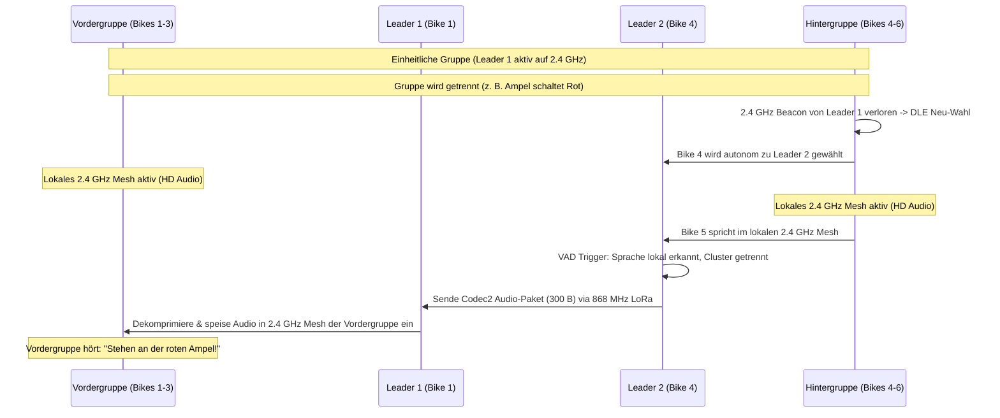

# 11 - OpenMotorMesh (OMM) - Protokoll-Stack, DLE, Adaptive QoS & Cluster-Relay

OpenMotorMesh (OMM) ist ein hierarchisches, latenzoptimiertes Mesh-Routing-Protokoll, das speziell fuer hochdynamische Fahrzeugverbaende im Ad-hoc-Betrieb (868 MHz LoRa & 2.4 GHz IEEE 802.15.4 / LTE-Sidelink PHY) entwickelt wurde. Es adaptiert Prinzipien aus dem Mobilfunkbereich (**3GPP LTE/5G Sidelink C-V2X / ProSe**) und **IEEE 802.11s Mesh** zur lueckenlosen Sprach- und Datenweiterleitung auch bei getrennten Gruppen.

---

## 1. Physical Layer (PHY) & Dual-PHY Architektur (2.4 GHz & 868 MHz)

OpenMotorMesh nutzt eine intelligente **Dual-PHY-Hierarchie**, die hohe Bandbreite im Nahbereich mit extremer Reichweite im Weitbereich kombiniert:

```
┌─────────────────────────────────────────────────────────────────────────────┐
│                    DUAL-PHY HIERARCHIE IN OPENMOTORBRIDGE                   │
├──────────────────────────────────────┬──────────────────────────────────────┤
│ 1. NAHBEREICH: 2.4 GHz LTE-Sidelink  │ 2. WEITBEREICH: 868 MHz LoRa (Pod 3) │
│ (Intra-Cluster / Proximity < 500m)   │ (Inter-Cluster & Fallback 1 - 15 km) │
├──────────────────────────────────────┼──────────────────────────────────────┤
│ • 10 ms Superframe (SC-FDMA TDMA)    │ • Semtech SX1262 LoRa (+22 dBm PA)   │
│ • Full-Duplex HiFi-Voice (Opus SILK) │ • Schmalband PTT-Sprache (Codec2)    │
│ • Stereo Music-Sharing & Navi-Ducking│ • Lueckenloses GPS-Gruppenradar      │
│ • 100 % Duty-Cycle erlaubt           │ • ETSI 1 % / 10 % Duty-Cycle konform │
└──────────────────────────────────────┴──────────────────────────────────────┘
```

### 1.1 2.4-GHz Proximity High-Speed PHY (SC-FDMA TDMA)
Das Nahbereichs-Mesh adaptiert die Architektur des LTE-ProSe/PC5-Sidelinks fuer das weltweit lizenzfreie 2,4-GHz-ISM-Band (100 mW EIRP):
1. **Modulation & Wellenform (SC-FDMA / DFT-s-OFDM):**
   * Zur Minimierung des Peak-to-Average-Power-Ratio (PAPR) nutzt der Sender Single-Carrier-FDMA.
   * Geringer PAPR entlastet die Endstufen (PA), reduziert die thermische Verlustleistung im wasserdichten IP67-Gehaeuse und maximiert die Reichweite im Randbereich.
2. **Kanalraster & TDMA-Zeitschlitz-Struktur:**
   * **Superframe (10 ms):** Angelehnt an LTE-Funkrahmen, unterteilt in 10 Subframes a 1 ms (Slotted TDMA).
   * **Synchronisation (Sync Beacon / SLSS):** Der gewaehlte Cluster Leader sendet alle 100 ms ein primaeres Synchronisationssignal (Sidelink Synchronization Signal), auf das sich alle Slaves zeitlich einrasten.
   * **Kontrollkanal (PSCCH-Light):** Uebertraegt in Subframe 0 die Sidelink Control Information (SCI) zur Ankuendigung aktiver Sprecher und Kanalzuweisungen.
   * **Nutzdatenkanal (PSSCH-Light):** Transportiert in Subframe 1–9 die komprimierten Opus-Audio-Pakete.
   
   ```
   [Subframe 0: Sync/PSCCH Leader] ──► [Subframes 1..9: PSSCH Opus Audio Slots]
   ```
3. **Kollisionsfreier Mehrfachzugriff:**
   * Slaves fordern bei Sprechwunsch (VOX oder Hardware-PTT) per kurzem Burst im Kontrollschlitz ein Zeitfenster an.
   * Der Cluster Leader teilt kollisionsfreie Subframes zu, wodurch selbst bei Kolonnen von 30+ Bikes kein Kanal-Jitter oder Paket-Clash entsteht.

### 1.2 868-MHz Sub-GHz Long-Range PHY (SX1262 LoRa im Heck-Pod 3)
* **Weitbereichs-Kanal:** 868.0 – 868.6 MHz (EU ISM Band, bis zu +22 dBm PA).
* **Zweck:** Dient als lueckenloser Weitbereichs-Backbone bei Abriss des 2.4-GHz-Signals und als Sprachtunnel zwischen getrennten Gruppen.
* **Effizienz:** Uebertraegt Telemetrie und ultrakompakte Codec2-Sprachpakete (1200 bps) extrem stromsparend und unter strikter Einhaltung der gesetzlichen Duty-Cycle-Limits.

---

## 2. Layer 2: 802.11s-Light Loop-Prevention & Managed Forwarding
Das OpenMotorMesh implementiert Kernmechanismen aus IEEE 802.11s (HWMP / Airtime Metric) direkt auf Layer 2:

```
 0                   1                   2                   3
 0 1 2 3 4 5 6 7 8 9 0 1 2 3 4 5 6 7 8 9 0 1 2 3 4 5 6 7 8 9 0 1
+-+-+-+-+-+-+-+-+-+-+-+-+-+-+-+-+-+-+-+-+-+-+-+-+-+-+-+-+-+-+-+-+
| Mesh Control  |   Hop Limit   |     Mesh Sequence Number      |
+-+-+-+-+-+-+-+-+-+-+-+-+-+-+-+-+-+-+-+-+-+-+-+-+-+-+-+-+-+-+-+-+
|                     Originator Node MAC                       |
|                       (Bytes 0..3)                            |
+-+-+-+-+-+-+-+-+-+-+-+-+-+-+-+-+-+-+-+-+-+-+-+-+-+-+-+-+-+-+-+-+
|  Originator MAC (4..5)        |      Target Node MAC (0..1)   |
+-+-+-+-+-+-+-+-+-+-+-+-+-+-+-+-+-+-+-+-+-+-+-+-+-+-+-+-+-+-+-+-+
|                      Target MAC (2..5)                        |
+-+-+-+-+-+-+-+-+-+-+-+-+-+-+-+-+-+-+-+-+-+-+-+-+-+-+-+-+-+-+-+-+
| Payload: 6LoWPAN / IPv6 Multicast / RTP / Opus Audio ...      |
```

### Layer-2 Frame-Header Definition (C++ Struct)
```cpp
struct MeshHeader_t {
    uint8_t  meshFlags;     // Priority & Type Flags
    uint8_t  hopLimit;      // TTL Dekrement pro Hop (Loop-Schutz)
    uint16_t meshSeqNum;    // Fortlaufende ID des Senders
    uint8_t  originMac[6];  // Erzeuger-Node MAC
    uint8_t  targetMac[6];  // Multicast (ff:ff:...) oder Unicast
} __attribute__((packed));

void onRawPacketReceived(uint8_t* rawData, size_t len) {
    if (len < sizeof(MeshHeader_t)) return;
    
    MeshHeader_t* meshHdr = (MeshHeader_t*)rawData;
    uint8_t* payload = rawData + sizeof(MeshHeader_t);
    size_t payloadLen = len - sizeof(MeshHeader_t);

    // 1. Layer-2 Loop & Duplicate Filter (802.11s Mesh Seq Filter)
    if (meshHdr->hopLimit == 0) return;
    if (checkAndRegisterL2Duplicate(meshHdr->originMac, meshHdr->meshSeqNum)) {
        return; // Duplikat verworfen -> Spart CPU- und Stack-Aufwand
    }

    // 2. Lokale Verarbeitung (Audio Playout)
    processL3Payload(payload, payloadLen);

    // 3. 802.11s Managed Forwarding: Weiterleitung wenn wir Relay-Master sind
    if (currentRideMode == MODE_RELAY_AR) {
        meshHdr->hopLimit--;
        broadcastForward(rawData, len);
    }
}
```

---

## 3. Layer 3 & Layer 4: 6LoWPAN, IPv6 Multicast & Audio-Streaming
- **Multicast-Routing:** Sprachdaten werden via IPv6-Multicast an Gruppen-Adressen (z. B. `ff02::1`) gesendet. Ein einziges Paket erreicht alle Gruppen-Teilnehmer ohne Unicast-Duplikation.
- **Header-Kompression (6LoWPAN, RFC 6282):** Komprimiert den 40-Byte IPv6-Header auf 2 bis 4 Bytes.
- **Adressierung (SLAAC):** Jeder Node generiert seine eigene Link-Local-Adresse (`fe80::/64`) autonom aus der 64-Bit DS2401 Chip-UID.
- **Failover-Routing (RPL):** Das Routing Protocol for Low-Power and Lossy Networks steuert das dynamische Re-Parenting bei Ausfall des Master-Knotens.
- **Audio-Streaming Standard (Opus over RTP):**
  - **Codec:** Opus Audio (RFC 6716) mit VBR von 8 kbps bis 24 kbps und integriertem Packet Loss Concealment (PLC).
  - **Transport:** Kapselung in RTP-Frames mit 20 bis 50 ms adaptivem Jitter-Buffer.
  - **Weitbereichs-Fallback:** Codec2 (1200 / 2400 bps) fuer schmalbandige 868-MHz-LoRa-Tunnel.

---

## 4. Dynamic Leader Election (DLE) Algorithmus
Innerhalb jeder 2.4-GHz-Funkzelle wird autonom genau ein zentraler Gateway-Master (Cluster Head) gewaehlt:

$$\text{Score}_{\text{DLE}} = S_{\text{HW}} + S_{\text{PWR}} + S_{\text{GNSS}} + S_{\text{LORA}} + S_{\text{UPTIME}}$$

| Parameter | Bedingung | Punkte |
| :--- | :--- | :---: |
| **S_HW (Hardware Tier)** | Sena Apex (Mesh 3.0) ODER Cardo Edge (DMC Gen2) gesteckt | **+60 Pkt.** |
| | Sena Legacy / Cardo DMC Gen1 gesteckt | +30 Pkt. |
| **S_PWR (Stromversorgung)** | Zuendung aktiv (KL15 > 12.5 V via LM5164) | **+20 Pkt.** |
| | Pufferbetrieb (USV-Akku > 3.8 V) | +5 Pkt. |
| **S_GNSS (Positionsstabilitaet)** | 3D Fix mit PDOP < 1.5 & 1-PPS Lock | **+10 Pkt.** |
| **S_LORA (Link-Qualitaet)** | Durchschnittlicher Nachbar-RSSI > -85 dBm | **+10 Pkt.** |
| **S_UPTIME (Hysterese-Schutz)** | Bereits aktiver Leader (verhindert Flattern) | **+15 Pkt.** |

---

## 5. Adaptive Tiered QoS (Stufenweises Bandbreiten- & Reichweiten-Modell)
Um Verbindungsabrisse im Keim zu ersticken, greift ein 3-stufiges Kaskaden-Modell:
1. **Stufe 1 - Nahbereich (< 500 m, 2.4 GHz):** Full-Duplex HD-Voice, A2DP Music-Sharing und Navi-Ducking aktiv. LoRa sendet im Hintergrund Pings (Duty-Cycle < 0.1 %).
2. **Stufe 2 - Randbereich (500 m - 1.2 km):** Bei sinkendem Link-Quality-Index wird Music-Sharing automatisch pausiert, um die volle Kanalbandbreite der Sprache zu widmen.
3. **Stufe 3 - Weitbereich / Abgerissen (1 km - 15 km, 868 MHz LoRa):**
   - Music-Sharing: AUS.
   - GPS-Gruppenradar & Telemetrie: 100 % aktiv auf dem Dashboard.
   - Sprache: Automatischer Fallback auf Codec2 (1200 bps PTT-Funk).

---

## 6. Cluster Partitioning & Inter-Cluster Gateway Relay (LTE-Sidelink Adaption)
Wird eine Gruppe durch aeussere Einfluesse (rote Ampel, Bahnuebergang, Passkuppe) in zwei Teilgruppen getrennt, greift die automatische Cluster-Teilung:



1. **Autonome Sub-Leader Wahl:** Die Hintergruppe erkennt den Verlust des primaeren Leaders (Beacon-Timeout > 500 ms) und waehlt sofort Bike 4 zum lokalen Leader 2.
2. **Lokale HD-Sprache bleibt aktiv:** Innerhalb der Vordergruppe (Bikes 1-3) und innerhalb der Hintergruppe (Bikes 4-6) laeuft das 2.4-GHz-Mesh ununterbrochen weiter.
3. **LoRa Cross-Gateway Voice Tunnel:** Sprudelt in einer Teilgruppe Sprache auf, encodiert der lokale Leader diese in Codec2 (1200 bps) und sendet sie ueber 868 MHz LoRa an den entfernten Leader, welcher sie lokal wieder in das 2.4-GHz-Mesh einspeist.
4. **Cluster-Fusion (Re-Merge):** Sobald die Hintergruppe aufschliesst (< 400 m), erkennt Leader 2 den primaeren Leader 1, tritt in den Normalmodus zurueck und schliesst den LoRa-Tunnel.
