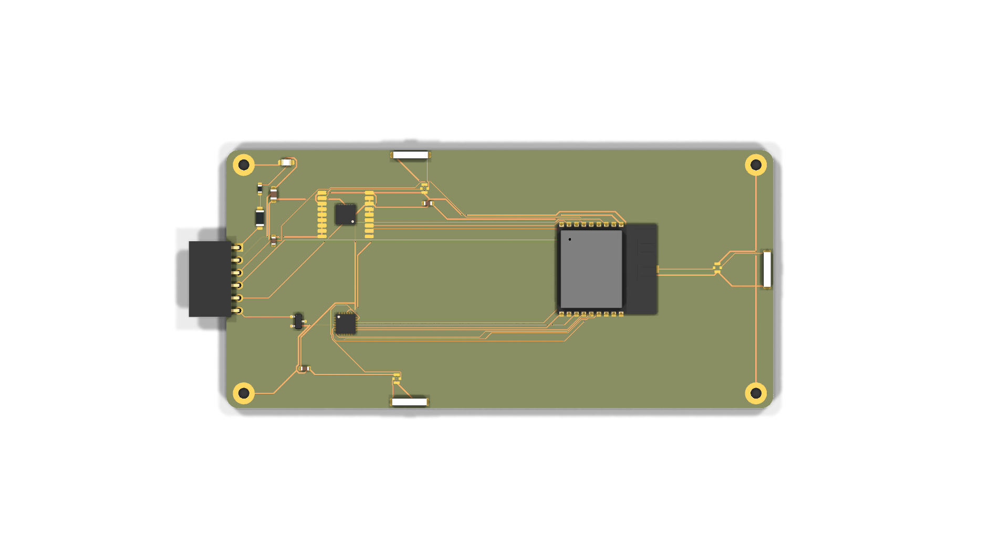
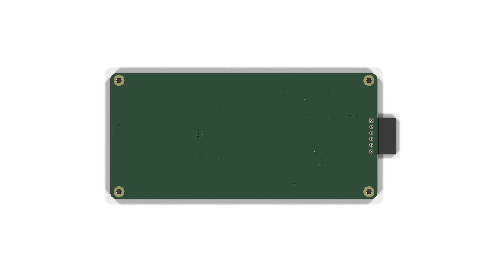
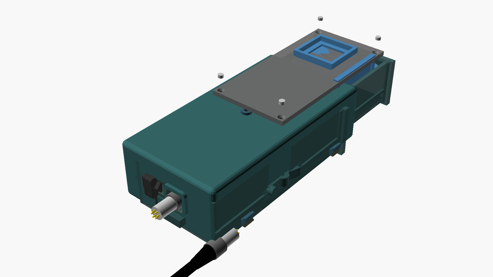

# 13 - Heck-Pod 3: GNSS & Dual-PHY OpenMotorMesh Transceiver-Architektur

Der **Heck-Pod 3** (Position: Heckbürzel / Gepäckbrücke) ist das zentrale Funk- und Navigations-Gateway des OpenMotorBridge-Systems. Er nutzt das identische, universelle **Maximal-Envelope Pod-Gehäuse ($120{,}0 \times 64{,}0 \times 32{,}0\,\text{mm}$)** und beherbergt auf seinem offenen Einschubschlitten das Multi-Konstellations-GNSS-Modul (**u-blox MAX-M10S**), das vollständige **Dual-PHY OpenMotorMesh (2.4 GHz High-Speed + 868 MHz LoRa Long-Range)** sowie einen dedizierten **ESP32-C3 RISC-V Co-Prozessor**.

---

## 1. 3D-Board-Visualisierung & Photorealistische Renders

Die Heck-Pod-Platine vereint auf großzügigen **$110{,}0 \times 52{,}0\,\text{mm}$** das Multi-Konstellations-GNSS, das Dual-PHY Mesh-Modem, die drei mechanischen HF-Umschaltbuchsen (Murata MM8030), drei Pulse W3000 Keramik-Chipantennen, die 500mA PTC-Schutzstufe sowie den RISC-V Co-Prozessor mit horizontaler Stirnseiten-Steckung:

#### Oberansicht (Zentrierte 6-Pin Front-Buchsenleiste, PTC-Sicherung, ESP32-C3, 3x MM8030 RF-Switches & 3x Pulse W3000 Antennen):


#### Unteransicht (Kompakte 4-Lagen Massefläche & 4x M2 Montagebohrungen):


*Abbildung 13.1: Photorealistisches 3D-Raytracing-Render der OpenMotorBridge Heck-Pod 3 Platine (KiCad 10, 4-Lagen FR4 TG150 ENIG, $110{,}0 \times 52{,}0\,\text{mm}$, mit stirnseitig nach vorne öffnender zentrierter 6-Pin Präzisionsbuchsenleiste, 500mA PTC-Schutzstufe, 5V Power-LED, u-blox GNSS, SX1262 LoRa, ESP32-C3 Mesh Transceiver sowie 3x Murata MM8030 Umschaltern für externe SMA-Antennen).*

### 1.1 3D-CAD-Gesamtbaugruppe & Direkter 1-Tier Einschub (Keine Adapterplatine erforderlich!)

Im Gegensatz zu den Audio- & Intercom-Kassetten (Pod 1 & Pod 2), die einen 2-teiligen Aufbau mit unterer Adapter-Trägerplatine (`openmotorbridge_pod_cartridge`) und oberem Headset-Dockingschacht nutzen, besitzt der **Heck-Pod 3 eine direkte 1-Tier-Architektur**:



*Abbildung 13.2: 3D-CAD-Explosionsdarstellung der Heck-Pod 3 Gesamtkassette mit universellem Pod-Gehäuse (integriertes V-Rohrbett mit EPDM-Spannbandnasen), rückseitigem M8 6-Pin IP67 Kabelstutzen und dem 1-teiligen Transceiver-Schlitten ([cartridge_omm_transceiver.scad](file:///Users/schmidtm/openMotorBridge/hardware/cad/scad/03_pod_cartridges/cartridge_omm_transceiver.scad)), in den die Transceiver-Platine ($110 \times 52\,\text{mm}$) direkt ohne Zwischen-Adapter verschraubt ist.*

#### Warum wird für Pod 3 keine Adapterplatine benötigt?
1. **Vollintegriertes Single-Board Design:** Die Platine `openmotorbridge_rear_transceiver` ist bereits das vollständige Funk-, Navigations- und Co-Prozessor-Modul. Sie trägt den Maxim DS2401 ID-Chip, die 6-Pin Präzisionsbuchse `J1`, das SX1262 LoRa-Modem, das u-blox MAX-M10S GNSS, das ESP32-C3-Modul, drei Pulse W3000 Keramik-Chipantennen (`ANT1` LoRa, `ANT2` GNSS, `ANT3` 2.4 GHz) sowie drei Murata MM8030 mechanische Umschaltbuchsen (`J3`, `J4`, `J5`) mit direkter, verlustfreier $50\,\Omega$-Microstrip-Anbindung direkt auf ihrem 4-Layer FR4-Board.
2. **Direkte Verschraubung im Grundschlitten:** Die Platine wird mit 4x M2 Schrauben direkt auf die Schraubdome des Kassetten-Schlittens ([cartridge_omm_transceiver.scad](file:///Users/schmidtm/openMotorBridge/hardware/cad/scad/03_pod_cartridges/cartridge_omm_transceiver.scad)) montiert und mit dem wetterfesten, HF-transparenten PA12-Deckel ([cartridge_insert_blindkassette.scad](file:///Users/schmidtm/openMotorBridge/hardware/cad/scad/03_pod_cartridges/parts/03_insert_blindkassette.scad)) verschraubt.
3. **Volle $23{,}5\,\text{mm}$ Innenhöhe:** Ohne Zwischenboden oder Adapterplatine steht den Antennen die volle lichte Bauhöhe unter der HF-transparenten PA12-Haube zur Verfügung – für maximalen Gewinn ohne störende Gehäusedämpfung.
4. **100 % mechanische Kompatibilität:** Die Kassette nutzt exakt denselben [00_base_sled.scad](file:///Users/schmidtm/openMotorBridge/hardware/cad/scad/03_pod_cartridges/00_base_sled.scad) wie alle anderen Kassetten und gleitet formschlüssig in dasselbe universelle Pod-Gehäuse ([pod_base_housing.scad](file:///Users/schmidtm/openMotorBridge/hardware/cad/scad/02_pod_base/pod_base_housing.scad)).

---

## 2. Hardware-Architektur & Stirnwand-Steckschnittstelle

```
                      ┌─────────────────────────────────────────────────────────────┐
                      │          HECK-POD 3 OPENMOTORMESH TRANSCEIVER-MODUL         │
                      │         (110 x 52 mm im offenen Kassetten-Einschubschlitten)│
                      │                                                             │
                      │   • J1: Zentrierte 6-Pin Winkelbuchsenleiste (Stirnseite)   │
                      │   • F1: 500mA PTC-Sicherung & D1: 5V Power-Status-LED       │
                      │   • U4: DS2401 1-Wire ID ROM (openmotormesh_pod3.json)      │
                      │   • J3..J5: 3x Murata MM8030 automatische HF-Umschalter     │
                      │                                                             │
                      │   ┌─────────────────────────────────────────────────────┐   │
                      │   │  ESP32-C3 RISC-V Co-Prozessor (32-Bit @ 160 MHz)    │   │
                      │   │  • Primary PHY: 2.4 GHz IEEE 802.15.4 / SC-FDMA     │   │
                      │   │  • HiFi Audio (Opus 24k) & Nahbereichs-Mesh         │   │
                      │   └──────────┬───────────────────────────┬──────────────┘   │
                      │              │ SPI Master (8 MHz)        │ UART1 (115.2k)   │
                      │              ▼                           ▼                  │
                      │   ┌──────────────────────┐    ┌─────────────────────────┐   │
                      │   │ Semtech SX1262 LoRa  │    │ u-blox MAX-M10S GNSS    │   │
                      │   │ • Fallback PHY 868MHz│    │ • 10 Hz Multi-GNSS PVT  │   │
                      │   │ • Codec2 & Radar     │    │ • 1-PPS Zeitnormal      │   │
                      │   └──────────────────────┘    └─────────────────────────┘   │
                      └──────────────────────────────┬──────────────────────────────┘
                                                     │ Horizontaler Kassetteneinschub (Auto-Eject)
                                                     ▼
                      ┌─────────────────────────────────────────────────────────────┐
                      │ SCHUTZ-SCHOTTWAND MIT DUALEN AUSWERFER-FEDERN (2x M2)       │
                      │  • PA12-Trennwand (56 x 24 mm) kapselt Pod-Base hermetisch  │
                      │  • 6-Pin Stiftleiste in PA12-Schutzkragen mit 45° Trichter  │
                      │  • Duale V4A Edelstahlfedern werfen Schlitten 10mm aus      │
                      └──────────────────────────────┬──────────────────────────────┘
                                                     │
                                                     ▼
                      ┌─────────────────────────────────────────────────────────────┐
                      │ POD-BASISPLATINE (openmotorbridge_pod_base, 48 x 24 mm)     │
                      │  • U1: SP3012 TVS-Schutzmatrix                              │
                      │  • J2: Zentrierte M8 6-Pin IP67 Buchse nach außen (B.Cu)    │
                      └──────────────────────────────┬──────────────────────────────┘
                                                     │ Geschirmtes 6-adriges PUR-Kabel
                                                     ▼
                      ┌─────────────────────────────────────────────────────────────┐
                      │ HD26 Flanschbuchse -> Zentralbox ESP32-S3 Hauptrechner      │
                      └─────────────────────────────────────────────────────────────┘
```

---

## 2. Das Dual-PHY OpenMotorMesh im Heck-Pod 3

| Merkmal | **Primary PHY (2.4 GHz High-Speed Mesh)** | **Secondary Fallback PHY (868 MHz LoRa)** |
| :--- | :--- | :--- |
| **Hardware-Treiber** | **ESP32-C3 Internes 2.4-GHz-Radio** | **Semtech SX1262 Transceiver (+22 dBm)** |
| **Standard / Protokoll** | IEEE 802.15.4 / SC-FDMA TDMA (2 Mbps) | LoRa Chirp Spread Spectrum (BW 250 kHz, SF7) |
| **Antenne im Pod 3** | Pulse W3000 2.4 GHz Keramikantenne (`ANT3`) + Murata MM8030 Umschalter (`J3`) auf SMA | Pulse W3000 868-MHz-Keramik-Chipantenne (`ANT1`) + Murata MM8030 Umschalter (`J4`) auf SMA |
| **Audio-Codec** | **Opus Speech/Full-Band (24 kbps / 12 kbps)** | **Codec2 (1200 bps / 700 bps PTT Bursts)** |
| **Audio-Modus** | **Vollduplex kontinuierlich (HiFi Sprache)** | **Halbduplex PTT-Bursts (220 ms max.)** |
| **Musik-Sharing** | Ja (A2DP Dynamic Forwarding @ 64 kbps) | Nein (Bandbreite reserviert fuer Sprache) |
| **Telemetrie-Rate** | 10 Hz Echtzeit-Lage & Dynamik-Stream | 1 Hz komprimiertes Gruppenradar (12 Bytes) |
| **Typische Reichweite**| $150\,\text{m}$ bis $300\,\text{m}$ (Sichtverbindung) | **$1{,}0\,\text{km}$ bis $15{,}0\,\text{km}$ (Multi-Hop)** |
| **Hauptzweck** | Primaeres Gruppen-Intercom & Audiobruecke | **Automatischer Fallback bei Gruppenabriss** |

---

## 3. Kern-Bauelemente im Heck-Pod 3

1. **Haupt-Co-Prozessor (ESP32-C3-WROOM-02U mit HF-Schaltbuchse):**
   * 32-Bit RISC-V Single-Core @ 160 MHz mit 4 MB Embedded Flash.
   * Sendet und empfaengt das **2.4 GHz Primary High-Speed Mesh** (Opus 24k HiFi-Audio & 10 Hz Telemetrie).
   * Uebernimmt lokales 10 Hz NMEA/UBX-Parsing vom MAX-M10S und SPI-Steuerung des LoRa-Modems.
2. **GNSS Engine (u-blox MAX-M10S):**
   * Multi-Konstellation 4-System Parallelbetrieb (GPS, GLONASS, Galileo, BeiDou).
   * 1-PPS Hardware-Zeitsignal (Jitter $< 15\,\text{ns}$ RMS) an ESP32-C3 GPIO 6 und ueber Buchsenkontakt 5 an Zentralbox.
3. **OpenMotorMesh LoRa Transceiver (Semtech SX1262):**
   * Frequenzbereich: 868.0 – 868.6 MHz (EU ISM Band) / 915 MHz (US Band).
   * Sendeleistung: bis zu $+22\,\text{dBm}$ ($160\,\text{mW}$ EIRP).
   * Integrierter HF-Schalter, Tiefpassfilter und automatische Antennenumschaltung.
4. **1-Wire Identifikation (Maxim / ADI DS2401Z+):**
   * Liefert die 64-Bit Silicon Serial Number fuer die automatische Kassetten- und Steckplatzerkennung an der Zentralbox.
5. **Spannungsregelung (TI TPS7A0533):**
   * Ultra-Low-Noise Automotive LDO (5.0V Eingang $\rightarrow$ saubere 3.3V / 200mA fuer GNSS & LoRa).

---

### 3.1 Universelle HF-Schaltbuchsen-Architektur: Automatische Antennenumschaltung

Um maximale Flexibilität zu gewährleisten, sind **alle 3 Funk- und Navigationspfade** der Transceiver-Platine mit miniaturisierten **mechanischen HF-Schaltbuchsen (z. B. Murata MM8030-2610 / SWG-Serie)** ausgestattet.

```
                  FUNKTIONSPRINZIP DER HF-SCHALTBUCHSEN
  1. NORMALZUSTAND (Kein Kabel gesteckt)   2. GESTECKT (Pigtail zur SMA-Frontbuchse)
┌──────────────────────────────────────┐ ┌──────────────────────────────────────┐
│  HF-Chip ──► [Federkontakt] ──► Ant  │ │  HF-Chip ──► [Koax-Stecker] ──► SMA  │
│              (Geschlossen)   (Intern)│ │              (Offen!)         (Aussen)│
│                                      │ │              [Getrennt] ─X─► Ant     │
└──────────────────────────────────────┘ └──────────────────────────────────────┘
```

#### Das mechanische Umschaltprinzip:
* **Ohne Stecker (Normalbetrieb):** Eine federnde Beryllium-Kupfer-Zunge in der Buchse leitet das HF-Signal verlustfrei ($< 0{,}08\,\text{dB}$ Dämpfung) direkt auf die interne Onboard-Antenne (Pulse W3000 Keramik-Chip bzw. PCB-Antenne).
* **Mit Stecker (Koax-Pigtail eingeklinkt):** Beim Einschieben des Pigtail-Steckers drückt der Mittelkontakt die interne Feder mechanisch zur Seite:
  * Die Verbindung zur internen Onboard-Antenne wird **vollständig und automatisch unterbrochen** ($> 20\,\text{dB}$ Isolation).
  * 100 % der HF-Leistung werden verlustfrei auf das Koaxialkabel zur externen SMA-Frontblendenbuchse geleitet.
* **Beim Abziehen:** Die Federzunge schnappt sofort zurück – die interne Antenne ist ohne Löt- oder Konfigurationsaufwand augenblicklich wieder aktiv!

#### Die 3 Schaltbuchsen auf der Platine & das Steck-Szenario:
1. **Buchse `J3` (2.4 GHz Primary High-Speed Mesh – ESP32-C3) ──► [WERKSEITIGER DEFAULT]:**
   * Das interne Pigtail zur SMA-Frontblendenbuchse ist **ab Werk auf `J3` gesteckt**.
   * **Warum 2.4 GHz die Default-Wahl ist:** Der 2.4-GHz-Kanal überträgt das bandbreitenintensive **Opus-HiFi-Vollduplex-Audio** und hat mit interner Antenne physikalisch die kürzeste Reichweite ($150\dots 300\,\text{m}$). Durch Anschrauben einer winzigen 2,4-GHz-Stummelantenne ($\approx 30\,\text{mm}$ kurz) an der Kassettenblende springt die HiFi-Sprachreichweite auf **$600\dots 1.000\,\text{m}$**. Die Gruppe bleibt dauerhaft im glasklaren Stereo-Chat, ohne vorzeitig auf den schmalbandigen LoRa-Notfunk zurückzufallen!
2. **Buchse `J4` (868 MHz LoRa Fallback – Semtech SX1262):**
   * Läuft standardmäßig autark über die interne Pulse W3000 Keramik-Chipantenne ($1\dots 2{,}5\,\text{km}$ LoRa-Reichweite).
   * **Expeditions-Option:** Für Extrem-Touren im Gebirge oder in der Wüste kann der Fahrer das Pigtail werkzeuglos von `J3` auf `J4` umstecken. `J3` reaktiviert sofort seine interne 2.4-GHz-Antenne, während LoRa auf die externe Antenne geschaltet wird (**$> 25\,\text{km}$ LoRa-Reichweite**).
3. **Buchse `J5` (Multi-GNSS – u-blox MAX-M10S):**
   * Läuft standardmäßig autark über die interne GNSS-Keramikantenne.
   * **Alukoffer- / Gepäck-Option:** Falls schwere Alukoffer oder wasserdichte Zeltrollen direkt über dem Heck-Pod 3 montiert sind und die Satellitensicht abschirmen, kann das Pigtail auf `J5` gesteckt werden, um eine externe aktive GNSS-Patchantenne an der Heckspitze zu speisen.

---

## 4. Interne ESP32-C3 GPIO-Belegung

| ESP32-C3 GPIO | Peripherie / Signal | Richtung | Funktion |
| :--- | :--- | :---: | :--- |
| **GPIO 21** | `BRIDGE_TXD` | Output | High-Speed UART0 Tx zur Zentralbox (460.800 Baud) |
| **GPIO 20** | `BRIDGE_RXD` | Input | High-Speed UART0 Rx von Zentralbox (460.800 Baud) |
| **GPIO 4** | `GNSS_TXD` | Output | UART1 Tx zum u-blox MAX-M10S (115.200 Baud) |
| **GPIO 5** | `GNSS_RXD` | Input | UART1 Rx vom u-blox MAX-M10S (115.200 Baud) |
| **GPIO 6** | `GNSS_PPS` | Input (IRQ) | 1-PPS Hardware-Zeitsignal Interrupt |
| **GPIO 8** | `LORA_SCK` | Output | SX1262 SPI Clock (8 MHz) |
| **GPIO 9** | `LORA_MISO`| Input | SX1262 SPI Master-In Slave-Out |
| **GPIO 10** | `LORA_MOSI`| Output | SX1262 SPI Master-Out Slave-In |
| **GPIO 7** | `LORA_NSS` | Output | SX1262 SPI Chip Select |
| **GPIO 3** | `LORA_NRST`| Output | SX1262 Hardware-Reset |
| **GPIO 2** | `LORA_BUSY`| Input | SX1262 Status Busy |
| **GPIO 1** | `LORA_DIO1`| Input (IRQ) | SX1262 Packet Received / Transmit Done Interrupt |

---

## 5. Belegung der 6-Pin Pogo-Kontaktleiste

| Pogo-Pin | Signalname | Elektrische Spezifikation | Beschreibung |
| :---: | :--- | :--- | :--- |
| **Pin 1** | `POD3_VCC` | 5.0 V DC (max. 250 mA) | Dauer-Versorgung ueber Zentralbox |
| **Pin 2** | `POD3_GND` | Power- & Signalmasse | Dedizierte Rueckleitung |
| **Pin 3** | `POD3_UART_TX` | 3.3 V LVTTL (460.800 Baud) | Datenstrom vom ESP32-C3 zur Zentralbox |
| **Pin 4** | `POD3_UART_RX` | 3.3 V LVTTL (460.800 Baud) | Steuerkommandos von Zentralbox zum ESP32-C3 |
| **Pin 5** | `POD3_GNSS_PPS`| 3.3 V Impuls (100 ms Breite) | 1-PPS Hardware-Zeitnormal-Synchronisation |
| **Pin 6** | `POD3_1WIRE_ID`| 1-Wire Open-Drain (3.3 V) | DS2401 Kassetten-Identifikationsbus |

---

## 6. Protokoll-Spezifikation (Heck-Pod $\leftrightarrow$ Zentralbox)

Die Kommunikation ueber die 460.800-Baud-Schnittstelle erfolgt paketorientiert mit CRC16-CCITT-Pruefsumme:

```
┌──────┬──────┬──────┬──────┬─────────────────┬──────┬──────┐
│ SYNC │ TYPE │ LEN  │ SEQ  │ PAYLOAD (0..n)  │ CRC16-CCITT  │
│ 0xAA │ 0x55 │ 1 B  │ 1 B  │ Variable        │ 2 Bytes      │
└──────┴──────┴──────┴──────┴─────────────────┴──────┴──────┘
```

### Nachrichtentypen (Message Types):
* **`0x01` - GNSS PVT Telemetrie (10 Hz):** Vorkomprimierter Binaervektor mit Latitude, Longitude, Altitude, Speed, Heading, PDOP und Satellitenstatus.
* **`0x02` - OMM 2.4 GHz Primary Audio Frame:** Opus 24k/12k Frame aus dem 2.4 GHz Proximity Mesh.
* **`0x03` - OMM 868 MHz LoRa Fallback Frame:** Codec2 Audio- oder Radar-Paket aus dem Long-Range Fallback.
* **`0x04` - OMM Tx Request (Dual-PHY):** Sendeauftrag der Zentralbox an das 2.4 GHz Mesh oder den SX1262 LoRa Transceiver.
* **`0x05` - DLE Status & Link Quality:** Signal-to-Noise Ratio (SNR), RSSI, PHY-Modus (2.4G vs 868M) und DLE Gateway-Score des Knotens.
* **`0xFE` - Firmware Update Bootloader Command:** `0xAA 0x55 0xFE 0x01 "BOOT"` leitet den ESP32-C3 ROM-Bootloader für das High-Speed UART Push-Flashen ein.

---

## 7. Firmware-Update & Fertigungs-Prüfschnittstelle

### 7.1 In-System UART-Push-Flashen (Fahrbetrieb)
* **Kein Gehäuseöffnen:** Updates werden transparent über die bestehende 6-Pin Kontaktleiste (`UART_TX` / `UART_RX`) eingespielt.
* **Synchroner Bootloader-Sprung:** Die Zentralbox steuert über `0xFE` und einen 100-ms Power-Cycle auf `POD3_VCC` den Download-Modus.
* **Übertragungsrate:** 460.800 Baud SLIP-Protokoll mit automatischer MD5-Prüfung ($< 6\,\text{s}$).

### 7.2 Fertigungs- & Entwicklungs-Testpunkte (Bottom Layer `B.Cu`)
Für die Erstprogrammierung und EOL-Prüfung in der Fertigung befinden sich auf der Unterseite standardisierte 1,0 mm SMD-Prüfpads:
* **`TP1` (TP_BOOT):** ESP32-C3 GPIO9 (Low-Aktiv für Bootloader)
* **`TP2` (TP_RST):** CHIP_PU (Hardware Reset)
* **`TP3` (TP_TX):** ESP32-C3 UART0 TX (GPIO21)
* **`TP4` (TP_RX):** ESP32-C3 UART0 RX (GPIO20)

