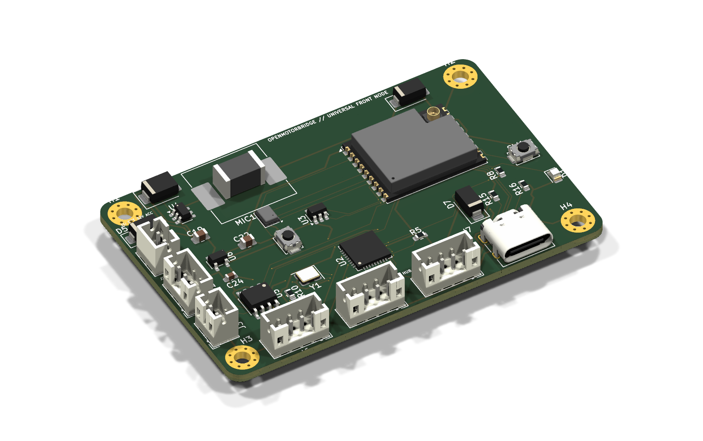
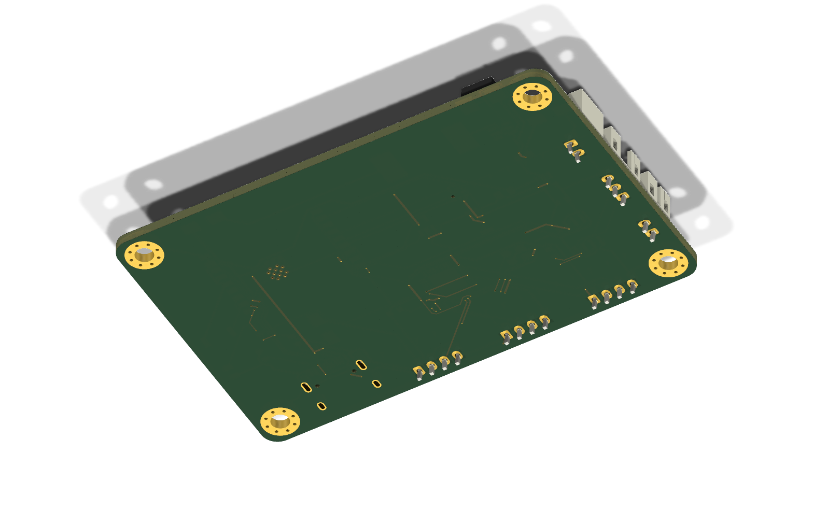

# 20. Smart Fairing Controller & Wireless USB-Hub Architektur

## 1. Systemübersicht & Motivation

Bei modernen Motorrädern (insbesondere Harley-Davidson Touring mit Batwing/Sharknose-Verkleidung, BMW RT/K1600, Honda Gold Wing/Africa Twin oder Reiseenduros) stellt das Cockpit das zentrale Nervenzentrum für Infotainment, Navigation und Zubehörstrom dar.

Bisherige Installationskonzepte litten unter gravierenden Nachteilen:
1. **Mechanischer Kabelstress am Lenkkopf:** Signalleitungen für CAN-Bus und analoge Mikrofone mussten durch die Gabelbrücke zum Fahrzeugheck verlegt werden – eine ständige Fehlerquelle für Scheuerstellen und Kabelbrüche bei Lenkbewegungen.
2. **Analoge Störeinkopplung:** Ein über 1,5 Meter langes analoges Mikrofonkabel quer durch das Motorrad fängt Zündfunken- und Generatorstörungen ein.
3. **Unzuverlässige PTT-Knopfzellen:** Batteriebetriebene BLE-Lenkertaster (mit CR2032-Knopfzellen) fallen bei Minusgraden im Winter regelmäßig aus.
4. **Wireless CarPlay Ärgernis & Verkleidungsbeschädigung:** Drahtlose CarPlay-Adapter (*Ottocast / CarlinKit*) bleiben nach dem Abstellen des Motorrads im Carport oder vor dem Café permanent mit dem Smartphone verbunden und blockieren mobiles Internet. Die bisherige Notlösung – das Bohren eines Lochs in das Handschuhfach für einen mechanischen Wippschalter – beschädigt den originalen Fahrzeugzustand.

Das Subsystem **OpenMotorBridge Smart Fairing Controller (`openmotorbridge_smart_fairing`)** löst all diese Probleme durch eine hochintegrierte, autarke Front-Elektronik mit **integriertem Automotive USB-2.0-Hub, softwaregesteuertem Ottocast-Power-Switching, digitalem I2S-MEMS-Mikrofon, batteriefreier Lenker-PTT und Ultra-Low-Latency-Funkbrücke (ESP-NOW)** zur Zentralbox.

---

## 2. Blockschaltbild & Topologie

```
┌─────────────────────────────────────────────────────────────────────────────────────────────┐
│                 OPENMOTORBRIDGE SMART FAIRING CONTROLLER & USB-HUB (PCBA 05)                │
├─────────────────────────────────────────────────────────────────────────────────────────────┤
│                                                                                             │
│  [ Harley Boom! Box USB-Host ]                                                              │
│                │                                                                            │
│                ▼                                                                            │
│   ┌───────────────────────────┐                                                             │
│   │ AUTOMOTIVE USB 2.0 HUB-IC │                                                             │
│   │ (Microchip USB2512B-AEZG) │                                                             │
│   └─────────────┬─────────────┘                                                             │
│                 │                                                                           │
│                 ├─► Downstream Port 1: Handschuhfach / Jukebox USB-A (USB-Stick / Kabel)    │
│                 │                                                                           │
│                 └─► Downstream Port 2: Interner Ottocast / CarlinKit Wireless-Dongle        │
│                           ▲                                                                 │
│                           │ [ VBUS High-Side Power Switch TI TPS2051B ]                     │
│                           │ (Gesteuert durch ESP32-C3 GPIO6 mit Fault-Reporting an GPIO7)   │
│                                                                                             │
│   ┌──────────────────────────────────────────────────────────────────────────────────────┐  │
│   │ ESPRESSIF ESP32-C3-WROOM-02 CONTROLLER (160 MHz RISC-V, 4MB Flash)                   │  │
│   │                                                                                      │  │
│   │ • 2.4 GHz ESP-NOW Funkbrücke (< 3 ms Latenz) & BLE 5.0 2M-PHY zur Zentralbox         │  │
│   │ • Knowles SPH0645LM4H Digital I2S MEMS Ambient-Mikrofon (Edge-RMS dB-A Berechnung)  │  │
│   │ • Hardware-entprellter Eingang für kabelgebundenen Lenker-PTT (100 % batteriefrei)   │  │
│   │ • TI TCAN334G 3.3V CAN-Transceiver (Lokaler Abgriff für Verkleidungs-/TFT-CAN-Bus)   │  │
│   │ • I2C / GPIO Status-Management & automatischer Ottocast Power-Cycle                  │  │
│   └──────────────────────────────────────────────────────────────────────────────────────┘  │
│                                                                                             │
│   POWER MANAGEMENT:                                                                         │
│   • 12V Bordnetz-Eingang (geschützt nach ISO 7637-2 gegen Load Dump & Spikes)               │
│   • TI LMR36015 36V Synchron-Buck-Converter ──► 5.0 V / 2.0 A (Hub, USB-Ports & Logic)      │
│   • TI TLV75533P Low-Noise LDO ──────────────► 3.3 V / 500 mA (ESP32-C3, MEMS & TCAN334G)   │
└─────────────────────────────────────────────────────────────────────────────────────────────┘
                                  │
                                  ▼ 2.4 GHz ESP-NOW Funkverbindung (< 3 ms Latenz)
┌─────────────────────────────────────────────────────────────────────────────────────────────┐
│                 ZENTRALBOX UNTER DER SITZBANK (ESP32-S3 HOST ENGINE)                        │
└─────────────────────────────────────────────────────────────────────────────────────────────┘
```

---

## 3. Schaltungsauslegung & Schlüsselkomponenten

### 3.1 Automotive USB 2.0 Hub Controller (Microchip USB2512B)
* **Bauteil:** **Microchip USB2512B-AEZG** (36-Pin QFN, $6 \times 6\,\text{mm}$, Automotive AEC-Q100 qualifiziert, Temperaturbereich $-40\,^\circ\text{C} \dots +85\,^\circ\text{C}$).
* **Upstream-Anschluss:** Verbindet sich mit dem 4-poligen USB-Kabelbaum der Boom! Box GTS / Skyline OS (`D+`, `D-`, `VBUS`, `GND`).
* **Integrierte Terminierung:** Interne $45\,\Omega$ Abschlusswiderstände und Phasenregelung für maximale Signalintegrität auch bei langen Zuleitungen.
* **Downstream Port 1 (Handschuhfach):**
  * Versorgt die originale USB-A Buchse im Handschuhfach.
  * Dauerhaft aktiv mit strombegrenztem $V_{\text{BUS}}$ ($1{,}0\,\text{A}$).
  * Dient für USB-Flash-Laufwerke mit Musik, kabelgebundenes Notladen des Smartphones oder offizielle Harley-System-Updates.
* **Downstream Port 2 (Interner Wireless CarPlay Adapter):**
  * Verbindet sich verdeckt mit dem *Ottocast U2-Air* oder *CarlinKit 5.0*.
  * Die $+5\,\text{V}$ Versorgungsspannung ($V_{\text{BUS}}$) läuft über den softwaregesteuerten Leistungsschalter `U3`.

### 3.2 Softwaregesteuerter $V_{\text{BUS}}$-Trennschalter (TI TPS2051B)
* **Bauteil:** **Texas Instruments TPS2051BDBVR** (SOT-23-5) Automotive High-Side Power Distribution Switch mit Überstromabschaltung ($0{,}5\,\text{A} \dots 1{,}0\,\text{A}$) und aktivem High-Enable.
* **Steuerung:**
  * `EN` (Pin 4) liegt an **ESP32-C3 GPIO6**. Ein logisches `HIGH` schaltet den Ottocast ein, `LOW` schaltet ihn vollständig stromlos ($I_{\text{off}} < 1\,\mu\text{A}$).
  * `FAULT_N` (Pin 3, Open-Drain) liegt an **ESP32-C3 GPIO7** mit $10\,\text{k}\Omega$ Pull-up. Meldet thermische Überlast oder Kurzschluss im CarPlay-Dongle sofort an den Controller.

---

## 4. Smarte Betriebsmodi & Automatisierungs-Logik

Durch die Verknüpfung des Leistungsschalters mit der Firmware des ESP32-C3 entfallen manuelle Schalter vollständig:

### 4.1 Automatischer Café- & Carport-Schutz (Auto-WLAN-Release)
1. **Problem:** Ein Wireless-CarPlay-Adapter spannt ein eigenes 5-GHz-WLAN-Netz auf. Steht das Motorrad vor dem Hotel, Café oder im Carport, bleibt das Smartphone des Fahrers im Gebäude oft stundenlang mit dem Motorrad verbunden – WhatsApp, mobile Daten und Telefonate sind blockiert.
2. **Automatisierte Lösung:**
   * Bei Zündung AUS (`KL15 = 0V`) startet der Smart Fairing Controller einen **60-Sekunden-Nachlauftimer**.
   * Nach Ablauf von 60 Sekunden (oder sofort bei Bluetooth-Signalverlust zum Fahrerhelm) schaltet die MCU `GPIO6 = LOW`.
   * Der Ottocast wird stromlos. Das Smartphone bucht sich sofort nahtlos in das Heim-/Café-WLAN ein.

### 4.2 1-Klick Hard-Reset via WebApp / PWA
* Wireless-CarPlay-Dongles können sich bei Funkstörungen gelegentlich aufhängen.
* **Lösung:** Im OpenMotorBridge WebApp-Dashboard existiert die Kachel **„Wireless CarPlay Adapter“** mit den Zuständen `[Aktiv] [Aus] [Neustart]`.
* Ein Klick auf **„Neustart“** schaltet $V_{\text{BUS}}$ für exakt $2{,}5\,\text{Sekunden}$ ab und wieder an. Der Dongle führt einen sauberen Kaltstart durch – ohne Anhalten, ohne Werkzeug, ohne Abklemmen der Batterie.

### 4.3 Automatische Host-Kollisionsvermeidung
* Erkennt der USB2512B-Hub an Port 1 (Handschuhfach) einen Datenverbindungsaufbau (z. B. Einstecken eines USB-Sticks für Harley-Navigationskarten-Updates oder Boom! Box Firmware-Flashes), schaltet der ESP32-C3 Port 2 (Ottocast) automatisch für die Dauer der Verbindung stromlos.
* Dadurch sind USB-Host-Adresskonflikte oder Update-Abbrüche der Boom! Box physikalisch ausgeschlossen.

---

## 5. Digitales I2S-MEMS Ambient-Mikrofon & Edge-DSP

Das Cockpit-Subsystem erfasst Umwelt-, Motor- und Windgeräusche direkt an der Fahrzeugfront:

```
    ┌──────────────────────┐
    │  SPH0645LM4H-B MEMS  │
    │  I2S Digital Micro   │
    └──────────┬───────────┘
               │ 24-Bit Digital Audio @ 16 kHz (BCLK, WS, DATA)
               ▼
    ┌──────────────────────┐
    │  ESP32-C3 EDGE-DSP   │ ──► A-Weighting Filter (400 Hz .. 4 kHz)
    │  (Algorithmus)       │ ──► RMS-Pegelberechnung (dB-A) alle 20 ms
    └──────────┬───────────┘
               │
               ▼ Telemetrie-Telegramm via ESP-NOW (1 Byte: z. B. 68 dBA)
    ┌──────────────────────┐
    │  ZENTRALBOX DSP      │ ──► Stufenlose Lautstärkenachführung im Helm
    └──────────────────────┘
```

1. **Bauteil:** **Knowles SPH0645LM4H-B** (Miniatur-SMD, $3{,}5 \times 2{,}65 \times 0{,}98\,\text{mm}$), digitaler I2S-Ausgang, $65\,\text{dB(A)}$ SNR.
2. **Akustischer Eintritt:** An der Unterseite des Fairing-Gehäuses liegt ein $\varnothing 2{,}5\,\text{mm}$ Schallkanal, hermetisch abgedichtet durch eine hydrophobe **Gore ePTFE-Schallmembran** (wasserdicht nach IP67, staubdicht).
3. **Bandbreitenschonendes Edge-Computing:**
   * Statt unkomprimiertes Audio über Funk zu streamen, berechnet der ESP32-C3 den RMS-Schallpegel in Echtzeit direkt vor Ort.
   * Alle $20\,\text{ms}$ wird ein winziges 4-Byte Telemetriepaket per ESP-NOW an die Zentralbox gesendet.
   * **Bandbreitenbedarf:** $< 1{,}5\,\text{kbps}$!
4. **Transparenzmodus bei Stillstand ($< 30\,\text{km/h}$):**
   * Steht das Motorrad an der Ampel oder Mautstelle, kann das Audiosignal per LC3-Codec komprimiert mit $24\,\text{kbps}$ gestreamt und im Helm eingeblendet werden, um Außengespräche ohne Helmabsetzen zu ermöglichen.

---

## 6. Kabelgebundene Lenker-PTT (100 % Batteriefrei)

* **Anschluss:** Wasserdichter 2-Pin Steckverbinder (JST-JWPF oder Schraubklemme) an der Gehäuseseite.
* **Schutzbeschaltung:**
  * $10\,\text{k}\Omega$ Pull-Up auf $+3{,}3\,\text{V}$.
  * Hardware-RC-Tiefpass ($R = 1\,\text{k}\Omega, C = 100\,\text{nF}, \tau = 100\,\mu\text{s}$) zur prellfreien Tastenerkennung.
  * **Bourns CDSOT23-SM05U** bidirektionale TVS-Diode zum Schutz gegen elektrostatische Entladungen (ESD $\pm 30\,\text{kV}$).
* **Latenz:** Der GPIO-Flanken-Interrupt triggert sofort ein prioritäres ESP-NOW Broadcast-Paket. Die Gesamtlatenz vom Tastendruck am Lenker bis zum Schalten des TLP222A-Optokopplers in der Heckkassette beträgt **unter $4\,\text{ms}$**!
* **Zuverlässigkeit:** Keine leere Knopfzelle, keine Funkverbindung am Lenkerarmatur-Taster, 100 % winterfest bis $-30\,^\circ\text{C}$.

---

## 7. Pinbelegung des ESP32-C3 Controller-Knotens

| Pin / GPIO | Signal-Name | Richtung | Angeschlossene Funktion |
| :---: | :--- | :---: | :--- |
| **IO0** | `PTT_INPUT_N` | IN (Interrupt) | Kabelgebundener Lenker-PTT-Taster (Low-Aktiv, RC-entprellt) |
| **IO1** | `MIC_I2S_WS` | OUT | Word Select / Frame Sync für Knowles SPH0645 MEMS |
| **IO2** | `MIC_I2S_BCLK` | OUT | Bit Clock für Knowles SPH0645 MEMS ($512\,\text{kHz}$) |
| **IO3** | `MIC_I2S_DATA` | IN | Serieller 24-Bit PDM/I2S Audio-Datenstrom |
| **IO4** | `TWAI_RX` | IN | CAN-Bus Empfangsleitung von TCAN334G Transceiver |
| **IO5** | `TWAI_TX` | OUT | CAN-Bus Sendeleitung an TCAN334G Transceiver |
| **IO6** | `OTTOCAST_PWR_EN`| OUT | High-Side Switch Enable für Ottocast $V_{\text{BUS}}$ (TPS2051B) |
| **IO7** | `OTTOCAST_FAULT_N`| IN | Überstrom- & Kurzschluss-Meldesignal von TPS2051B |
| **IO8** | `LED_STATUS_G` | OUT | Grüne Betriebs- & Funk-Status-LED |
| **IO9** | `BOOT_SW` | IN | Interner Boot-/Flash-Taster |
| **IO18** | `USB_D-` | BIDI | Native USB-Schnittstelle für Firmware-Flash & Diagnose |
| **IO19** | `USB_D+` | BIDI | Native USB-Schnittstelle für Firmware-Flash & Diagnose |

---

## 8. Leiterplatten-Spezifikation (`05_front_node_pcba`)

| Parameter | Spezifikation | Begründung |
| :--- | :--- | :--- |
| **Abmessungen** | **$68{,}0 \times 44{,}0 \times 1{,}6\,\text{mm}$** ($R = 2{,}5\,\text{mm}$) | Kompakt zur universellen Montage (Fairing, Cockpit, Gabel) |
| **Befestigung** | **4x M2.5 Schraubbohrungen** ($61{,}0 \times 37{,}0\,\text{mm}$) | 4x M2.5 Schraubdome mit Messing-Gewindeeinsätzen |
| **Lagenanzahl** | **4 Lagen (JLC04161H-7628)** | L1: Signale/RF, L2: Solid GND-Plane, L3: 5V/3V3 Power, L4: Signale |
| **Basismaterial** | **FR-4 TG150** | Hochtemperaturfest gegen Sommerhitze im geschlossenen Cockpit |
| **Oberflächenveredelung**| **ENIG (Electroless Nickel Immersion Gold)** | Korrosionsbeständig gegen Feuchte und Temperaturschwankungen |
| **Kupferauflage** | **$35\,\mu\text{m}$ (1 oz)** alle Lagen | Robuste Stromtragfähigkeit für DCDC-Schaltregler und USB-Ports |
| **Bordspannungsschutz** | TVS-Diode **SMCJ36CA** (1500W Peak) | Blockt Automotive Load-Dump und Induktionsspitzen der Lichtmaschine |
| **DRC-Status** | **100 % Geroutet / 0 Fehler** | 0 Unconnected, 0 Clearance Errors, 90 $\Omega$ USB-Differenzialpaare |

---

## 9. Fotorealistische 3D-Leiterplatten-Renderings

### 9.1 Platinen-Oberseite (Top Layer Assembly)



*Abbildung 20.1: Fotorealistisches 3D-Rendering der bestückten Front-Node-Leiterplatte (Oberseite). Zu sehen sind der Automotive USB 2.0 Hub IC (Microchip USB2512B), der ESP32-C3-WROOM-02U Controller mit goldenem U.FL-Koaxialanschluss, der TI TPS2051B USB-Leistungsschalter, der Automotive Buck-Converter (LMR36015) mit Ringkern-Speicherdrossel, die 3x JST-PH Steckverbinder an der Südkante (CarPlay, Glovebox, Host), die 3x Steckverbinder an der Westkante (12V, CAN, PTT) sowie der bündige USB-C Service-Port.*

### 9.2 Platinen-Unterseite (Bottom Layer Assembly)



*Abbildung 20.2: Fotorealistisches 3D-Rendering der Platinen-Unterseite mit durchgehender Solid-Ground-Plane, Entkopplungskondensatoren und der akustischen Eintrittsöffnung für das Knowles SPH0645 I2S MEMS Ambient-Mikrofon.*

---

## 10. Wasserdichtes IP67-Gehäuse & 4-in-1 Universal-Befestigungssystem

Um den Front-Knoten sowohl hinter Verkleidungen (Harley Batwing/Sharknose) als auch universell an BMW GS/RT, Reiseenduros oder Naked-Bikes montieren zu können, wurde ein hochintegriertes HP MJF PA12 Gehäuse mit einem **4-in-1 Befestigungskonzept** entwickelt:

### 10.1 Geschlossenes Gehäusemodell (IP67 Closed Assembly)


*Abbildung 20.3: Geschlossenes Gehäuse ($84{,}0 \times 60{,}0 \times 23{,}0\,\text{mm}$) aus UV-beständigem HP MJF PA12. Sichtbar sind die 4x M3 Eckverschraubungen, die EPDM-Kammleisten an Süd- und Westkante, der versenkte USB-C Service-Port mit Silikonschutzkappe, das Sichtfenster für die Status-LED sowie die seitlichen M4 Silentblock-Ohren.*

### 10.2 Explosionszeichnung & Montageebenen (Exploded View)


*Abbildung 20.4: Explosionsdarstellung aller mechanischen Komponenten: Unterteil mit M2.5 Schraubdomen, PCB-Baugruppe, 2x EPDM-Dichtkämme für Süd- und Westkabel, umlaufende Silikon-Dichtschnur (blau), USB-C Schutzkappe, Gehäusedeckel mit Dichtlippe und 4x M3 Edelstahlschrauben.*

### 10.3 4-in-1 Universal-Befestigungssystem (Unterseite)


*Abbildung 20.5: Detailansicht des 4-in-1 Montagebodens: 1. Standard AMPS 4-Loch-Muster ($38{,}0 \times 30{,}0\,\text{mm}$) mit M4 Messingeinsätzen für BMW GS/RT Navibügel (12/16 mm Rohr) und RAM-Mounts; 2. 90° gekreuzte Kabelbinder- & Schellen-Tunnel ($5{,}5 \times 2{,}2\,\text{mm}$) zum scheuerfreien Verzurren an Gabel- und Rahmenrohren; 3. 2x M4/M5 Silentblock-Flanschohren; 4. Plane $50 \times 28\,\text{mm}$ Vertiefung für 3M Dual-Lock Klettband.*

### 10.4 3D-Schnittansicht & Einbaukontrolle (Internal Seating Cutaway)


*Abbildung 20.6: 3D-Schnittansicht der Baugruppe zur Überprüfung der internen Freigänge, der gleichmäßigen Verpressung der Dichtelemente und der exakten Fluchtung der Steckverbinder.*

---

## 11. Fertigungspakete & Produktionsstatus

Alle produktionsreifen Fertigungsdaten stehen im Verzeichnis `hardware/production_packages/` zur Verfügung:

1. **PCBA Fertigungspaket (`05_front_node_pcba/`):**
   * `05_front_node_pcba_gerbers_jlcpcb.zip`: RS-274X 4-Layer Gerberdaten inkl. Excellon Bohrdaten.
   * `05_front_node_pcba_bom_jlcpcb.csv`: Vollständige Stückliste mit validierten LCSC-Bestellnummern.
   * `05_front_node_pcba_cpl_jlcpcb.csv`: Pick & Place Bestückungskoordinaten für die SMT-Fertigung.
2. **3D-Druck Fertigungspaket (`06_3d_print_mjf_stls/`):**
   * `04_front_node_3d_print_mjf.zip`: Produktions-STLs für Unterteil (`front_node_lower_tub.stl`), Deckel (`front_node_upper_lid.stl`), Kabelkämme (`front_node_cable_glands_tpu.stl`) und USB-C Staubkappe (`front_node_usbc_cap_tpu.stl`).

