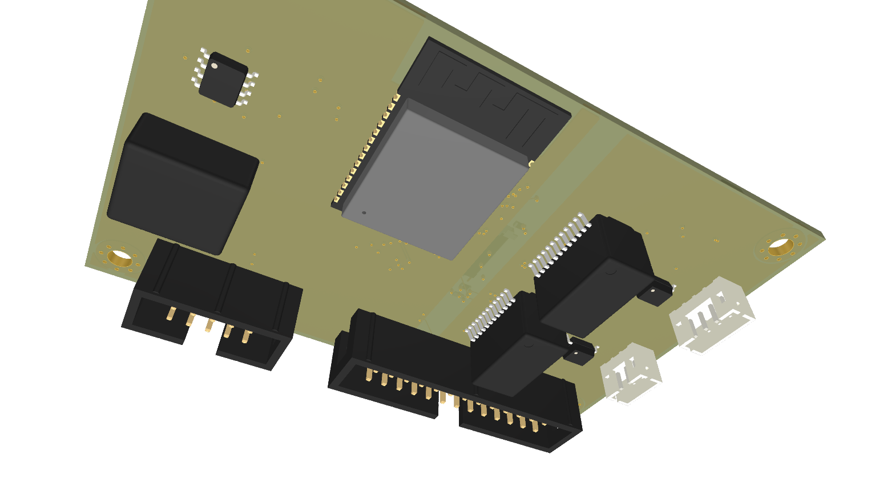

# 02 - PCB Hardware, Layout & Pinout Specification

This document specifies the 4-layer PCB layout of the central control box (`openmotorbridge_main_box`), EMC zoning, the 10 mm barrier-free insertion corridor, silicone vibration isolation, and complete connector and ESP32-S3 GPIO mappings.

---

## 1. 3D Board Visualization & Photorealistic Raytracing Render

The central box mainboard integrates the full automotive power supply, uninterruptible LiPo UPS, digital DSP host core, and galvanically isolated audio frontend onto a compact **$85.0 \times 55.0\,\text{mm}$** footprint:



*Figure 2.1: Photorealistic 3D raytracing render of the OpenMotorBridge Central Box PCB (KiCad 8.0, 4-layer FR4 TG150 ENIG).*

---

## 2. Board Dimensions, Layer Stackup & Manufacturing Specifications

| Parameter | Specification | Standard / Norm |
| :--- | :--- | :--- |
| **Dimensions** | $85.0\,\text{mm} \times 55.0\,\text{mm} \times 1.6\,\text{mm}$ | DIN ISO 2768-m (Tolerance $\pm 0.1\,\text{mm}$) |
| **Layer Count** | **4 Copper Layers** | Symmetrical stackup |
| **Base Substrate** | FR4 High-TG ($T_g \ge 150\,^\circ\text{C}$) | Automotive-grade thermal stability |
| **Surface Finish** | **ENIG (Electroless Nickel Immersion Gold)** | Corrosion-resistant, planar SMD pads |
| **Copper Thickness** | $35\,\mu\text{m}$ (1.0 oz) Outer / $35\,\mu\text{m}$ Inner | High current capacity for buck & power-path |
| **Solder Mask** | Matte Black | Low-reflection, UV-stabilized |
| **Silkscreen** | Crisp White High-Res | Crisp component and connector designations |
| **Min. Trace / Space** | $0.127\,\text{mm}$ (5 mil) / $0.127\,\text{mm}$ (5 mil) | JLCPCB Standard / Prototype compatible |
| **Min. Via Size** | $0.30\,\text{mm}$ Hole / $0.50\,\text{mm}$ Pad | Tented on all vias |

### 2.1 4-Layer Stackup Architecture
```
┌─────────────────────────────────────────────────────────────┐
│ Layer 1 (F.Cu - Top): High-Speed Signals, I2S, Components   │  (35 µm Cu)
├─────────────────────────────────────────────────────────────┤
│ ── Prepreg 7628 (Dielectric, Er = 4.4, Thickness 0.2 mm) ── │
├─────────────────────────────────────────────────────────────┤
│ Layer 2 (In1.Cu): Solid Ground Plane (GND_PWR / AGND)       │  (35 µm Cu)
├─────────────────────────────────────────────────────────────┤
│ ── FR4 Core (Isolation Core, Thickness 1.0 mm) ──────────── │
├─────────────────────────────────────────────────────────────┤
│ Layer 3 (In2.Cu): Power Planes (5.0V, 3.3V, VBAT Polygons)  │  (35 µm Cu)
├─────────────────────────────────────────────────────────────┤
│ ── Prepreg 7628 (Dielectric, Er = 4.4, Thickness 0.2 mm) ── │
├─────────────────────────────────────────────────────────────┤
│ Layer 4 (B.Cu - Bottom): Secondary Routing & Ground Pour    │  (35 µm Cu)
└─────────────────────────────────────────────────────────────┘
```

---

## 3. PCB Zoning Architecture (Zero-Cross-Talk Topology)

To eliminate cross-talk between the $2.1\,\text{MHz}$ switching converter, $2.4\,\text{GHz}$ Bluetooth RF frontend, and sensitive analog audio lines, the PCB is partitioned into **5 physically isolated functional zones**:

```
┌────────────────────────────────────────────────────────────────────────┐
│ ZONE 1: CONNECTOR ROW & 10-MM BARRIER-FREE INSERTION CORRIDOR (TOP)    │
│ [ J4: BAT ]   [ J1: 2x13 IDC26 SHROUDED HEADER ]   [ J2: SD ]  [J3:LED]│
├───────────────────┬──────────────────────────┬─────────────────────────┤
│ ZONE 2: POWER &   │ ZONE 3: DIGITAL CORE     │ ZONE 4: AUDIO ISOLATION │
│ AUTOMOTIVE UPS    │                          │ & CODEC FRONTEND        │
│                   │ • ESP32-S3 Dual-Core     │                         │
│ • PPTC 500mA      │ • Cantilevered 2.4 GHz   │ • 2x Bourns Transformer │
│ • SMBJ33CA TVS    │   PCB Antenna (Overhang) │   (1500V RMS Isolation) │
│ • P-FET Reverse   │ • 16MB Flash / 8MB PSRAM │ • Everest ES8388 Codec  │
│ • TI LM5164 Buck  ├──────────────────────────┤ • 2x TLP222A PhotoMOS   │
│ • TI BQ24075 UPS  │ ZONE 5: MOTION SENSORS   │ • Analog Star Ground    │
│ • LC-PI Filter    │ • Bosch BMI270 6-Axis    │   (Isolation Moat)      │
│                   │   (Center of Gravity)    │                         │
└───────────────────┴──────────────────────────┴─────────────────────────┘
```

1. **Zone 1 (Top Edge – Connector Alignment & 10 mm Corridor):**
   * All chassis interfaces are aligned in a **unified horizontal row**:
     * `J4`: 2-Pin JST-PH LiPo battery socket ($2.0\,\text{mm}$ pitch)
     * `J1`: 2x13 Pin IDC26 shrouded header with locking latches ($2.54\,\text{mm}$ pitch)
     * `J2`: MicroSD card socket (Push-Push SMD)
     * `J3`: 3-Pin JST-XH RGB LED connector ($2.54\,\text{mm}$ pitch)
   * **10 mm Insertion Corridor:** The area surrounding and below the connectors is a strict keep-out zone for tall components or electrolytic capacitors, ensuring comfortable tool-free ribbon cable insertion.
2. **Zone 2 (Left Flank – Automotive Power & UPS):**
   * Accepts raw motorcycle electrical voltages (KL30/KL15). Contains the Bourns PPTC fuse, SMBJ33CA TVS diode, reverse-polarity MOSFET, $10\,\mu\text{H}$ PI filter, TI LM5164-Q1 synchronous buck converter, and TI BQ24075 UPS battery management.
3. **Zone 3 (Center – Digital Host Core):**
   * Houses the ESP32-S3-WROOM-1 module (240 MHz dual-core). The meandering 2.4 GHz PCB antenna overhangs the board edge with copper keep-out on all 4 layers.
4. **Zone 4 (Right Flank – Galvanically Isolated Audio Frontend):**
   * Fully isolated audio domain. Dual Bourns LM-NP-1001-B1L transformers and Toshiba TLP222A optocouplers provide $1500\,\text{V}_{\text{RMS}}$ galvanic isolation. Analog ground `AGND` is separated from power ground `GND_PWR` via an isolation moat.
5. **Zone 5 (Center – IMU Motion Fusion):**
   * The Bosch BMI270 6-axis IMU sits exactly at the physical center of gravity to eliminate lever-arm centripetal offsets during lean angle estimation.

---

## 4. Mechanical Mounting & Vibration Decoupling

* **4× Corner Mounting Holes ($\varnothing\,3.2\,\text{mm}$ for M3 Hardware):**
  * Positioned at $(4.0\,\text{mm}, 4.0\,\text{mm})$, $(81.0\,\text{mm}, 4.0\,\text{mm})$, $(4.0\,\text{mm}, 51.0\,\text{mm})$, and $(81.0\,\text{mm}, 51.0\,\text{mm})$.
  * **$6.0\,\text{mm}$ Circular Keep-Out Zones:** Accommodate **Shore 50A silicone vibration damping rings**, isolating the board against motorcycle engine harmonics ($50\dots 500\,\text{Hz}$, up to $20\,\text{g}$).

---

### 5.1 Central HD26 Harness & Modular M8 Breakout Pigtail

The central 26-pin interface of the control box branches out via a flame-retardant automotive breakout harness into **5 standardized, waterproof M8 circular sockets**:

```
                                  ┌───────────────────────────────┐
                                  │ CENTRAL BOX HD26 / IDC26 PORT │
                                  └───────────────┬───────────────┘
                                                  │ (26 Conductors Bundled)
                                                  ▼
                         ┌─────────────────────────────────────────────────┐
                         │ AUTOMOTIVE BREAKOUT PIGTAIL (Overmolded IP67)   │
                         └──────┬──────────┬──────────┬──────────┬─────────┘
                                │          │          │          │
           ┌────────────────────┘          │          │          └────────────────────┐
           ▼                               ▼          ▼                               ▼
    ┌──────────────┐                ┌──────────────┐ ┌──────────────┐          ┌──────────────┐
    │ RECEPTACLE 1:│                │ RECEPTACLE 2:│ │ RECEPTACLE 3:│          │ RECEPTACLE 4:│
    │ POD 1 LEFT   │                │ POD 2 RIGHT  │ │ POD 3 REAR   │          │ POWER SUPPLY │
    │ (M8 6-Pin)   │                │ (M8 6-Pin)   │ │ (M8 6-Pin)   │          │ (M8 4-Pin)   │
    │ • Pins 1..6  │                │ • Pins 7..12 │ │ • Pins 13..18│          │ • KL30, KL15 │
    │ • Audio Sena │                │ • Audio Cardo│ │ • GNSS / OMM │          │ • GND, Shield│
    └──────────────┘                └──────────────┘ └──────────────┘          └──────────────┘
                                                                                      │
                                                                                      ▼
                                                                               ┌──────────────┐
                                                                               │ RECEPTACLE 5:│
                                                                               │ TELEMETRY    │
                                                                               │ (M8 4-Pin)   │
                                                                               │ • CAN_H/L    │
                                                                               │ • Mic-In     │
                                                                               │ • Reserve    │
                                                                               └──────────────┘
```

* **Modular Installation Concept:** Standardized **M8 6-Pin male-to-male PUR cables** are routed individually through the motorcycle frame. No rigid or bulky wiring harness needs to be pulled through tight cavities.
* **Serviceability:** If a cable suffers mechanical or thermal damage, it can be replaced in minutes without tools.

---

## 6. ESP32-S3 GPIO Mapping

| GPIO | Signal Name | Direction | Function & Connected Peripheral |
| :--- | :--- | :---: | :--- |
| **GPIO 1** | `ADC_BAT` | Input (ADC) | UPS battery voltage sense via 1:2 divider (TI BQ24075) |
| **GPIO 2** | `POD1_1WIRE_ID`| Bidir (OD) | 1-Wire bus for Port 1 cartridge detection (DS2401) |
| **GPIO 3** | `ADC_LINE_LVL` | Input (ADC) | Audio peak level sense & acknowledgement tone detect |
| **GPIO 4** | `ADC_VIGN` | Input (ADC) | Ignition KL15 monitoring via precision 1:11 divider |
| **GPIO 5** | `PORT1_KEY` | Output | TLP222A trigger Port 1 (Sena Intercom toggle) |
| **GPIO 6** | `PORT1_VCC_EN` | Output | High-Side MOSFET Port 1 power gate |
| **GPIO 7** | `PORT2_KEY` | Output | TLP222A trigger Port 2 (Cardo channel advance) |
| **GPIO 8** | `PORT2_VCC_EN` | Output | High-Side MOSFET Port 2 power gate |
| **GPIO 9** | `I2S_MCLK` | Output | Master clock for Everest ES8388 audio codec (12.288 MHz) |
| **GPIO 10** | `I2S_BCLK` | Output | Bit clock audio (3.072 MHz) |
| **GPIO 11** | `I2S_WS` | Output | Word select / LRCLK (48 kHz) |
| **GPIO 12** | `I2S_DOUT` | Output | Audio data out (DSP to ES8388 DAC) |
| **GPIO 13** | `I2S_DIN` | Input | Audio data in (From ES8388 ADC to DSP) |
| **GPIO 14** | `I2C_SDA` | Bidir (OD) | I2C data bus (Bosch BMI270 IMU & ES8388 control) |
| **GPIO 15** | `I2C_SCL` | Output | I2C clock (400 kHz Fast-Mode) |
| **GPIO 16** | `CHG_STAT_N` | Input | BQ24075 charging status monitor (Low = charging) |
| **GPIO 17** | `GNSS_RX` | Input (UART) | u-blox MAX-M10S UART RX (from Rear Pod 3 coprocessor) |
| **GPIO 18** | `GNSS_TX` | Output (UART)| u-blox MAX-M10S UART TX (to Rear Pod 3 coprocessor) |
| **GPIO 19** | `CAN_TX` | Output (TWAI)| TWAI / CAN-Bus TX to TI TCAN334G |
| **GPIO 20** | `CAN_RX` | Input (TWAI) | TWAI / CAN-Bus RX from TI TCAN334G |
| **GPIO 21** | `GNSS_PPS` | Input (IRQ) | 1-PPS hardware time sync interrupt (< 1 µs jitter) |
| **GPIO 22** | `POD2_1WIRE_ID`| Bidir (OD) | 1-Wire bus for Port 2 cartridge detection (DS2401) |
| **GPIO 38** | `RESERVE_A` | Input/Output| Multifunction I/O Pin A (HD26 Pin 25) |
| **GPIO 39** | `RESERVE_B` | Output | Multifunction I/O Pin B (HD26 Pin 26) |
| **GPIO 48** | `STATUS_LED` | Output | WS2812B RGB status indicator (enclosure lid) |
