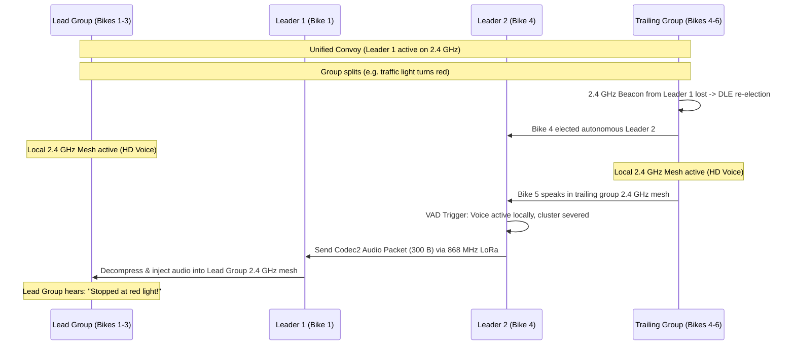

# 04 - Mesh Network, LoRa & GNSS Navigation

This document specifies the communication and positioning architecture of OpenMotorBridge v8.0: the OpenMotorMesh (OMM) protocol with **Dynamic Leader Election (DLE)**, large group convoy partitioning, the **868 MHz LoRa Long-Range fallback**, and the **10 Hz Multi-GNSS engine (u-blox NEO-M9N)** with dead-reckoning and video telemetry synchronization.

---

## 1. Dual-PHY Hybrid Mesh Architecture (2.4 GHz HiFi & 868 MHz LoRa)

To balance wide audio bandwidth with long-range offroad resilience, OpenMotorBridge combines two complementary radio layers:

```
┌────────────────────────────────────────────────────────────────────────┐
│                   HYBRID DUAL-PHY RADIO ARCHITECTURE                   │
├───────────────────────────────────┬────────────────────────────────────┤
│ LAYER 1: 2.4 GHz Proximity Mesh   │ LAYER 2: 868 MHz LoRa Backbone     │
├───────────────────────────────────┼────────────────────────────────────┤
│ • Frequency: 2.402 - 2.480 GHz    │ • Frequency: 868.0 - 868.6 MHz     │
│ • Full-Duplex Intercom & OMM Sled │ • Modulation: LoRa CSS (BW 125/250)│
│ • Codec: Opus 24k / Intercom Mesh │ • Codec: Codec2 1200 bps PTT Voice │
│ • Range: Up to 1.2 km line-of-sight│ • Range: Up to 15.0 km non-LOS/Pass│
│ • Dedicated Pod 1 & 2 RF Flanks   │ • Tactical 25-Byte GPS Radar Ping  │
└───────────────────────────────────┴────────────────────────────────────┘
```

### 1.1 Universal, Clean RF & Spectrum Architecture
The system cleanly separates all frequency bands to completely prevent receiver desensitization (De-Sensing):
* **6.489 GHz (UWB Channel 5):** Vehicle backbone link between Front Node (PCBA 05) and Central Box (PCBA 01) via Qorvo DW3110 ($< 0.4\,\text{ms}$ latency, zero duty-cycle restriction under ETSI EN 302 065-3). Taoglas FXUWB10 flex antennas mounted in dedicated floor pockets ($11 \times 11 \times 0.6\,\text{mm}$) ensure uninterrupted PCB ground planes and tether-free lid opening.
* **868 MHz LoRa (Central Box PCBA 01):** Integrated directly on the Central Box mainboard and powered by the UPS battery rail for 24/7 theft sentry and emergency group-split fallback. Uses an internal Taoglas FXP895 flex antenna in the enclosure lid.
* **Multi-GNSS & Cockpit Sensors (Front Node PCBA 05):** u-blox SAM-M10Q (with integrated $15 \times 15\,\text{mm}$ patch antenna), TI TMP117 ($\pm 0.1^\circ\text{C}$ precision temp), and TI OPT3001 ambient light sensor mounted in the cold air scoop via Qwiic port `J12`.
* **2.4 GHz:** Exclusively reserved for helmet audio links (Pod 1 Sena SPIDER X Slim, Pod 2 Cardo Packtalk Edge) and smartphone BLE. OMM 2.4 GHz operates as an optional swap cartridge in Pod 1 or Pod 2 (never co-located in the same enclosure with Sena/Cardo).

---

## 2. Layer 2: 802.11s-Light Loop Prevention & Managed Forwarding

OpenMotorMesh implements routing and loop-prevention mechanisms adapted from IEEE 802.11s directly on Layer 2:

```
 0                   1                   2                   3
 0 1 2 3 4 5 6 7 8 9 0 1 2 3 4 5 6 7 8 9 0 1 2 3 4 5 6 7 8 9 0 1
+-+-+-+-+-+-+-+-+-+-+-+-+-+-+-+-+-+-+-+-+-+-+-+-+-+-+-+-+-+-+-+-+
| Mesh Control  |   Hop Limit   |     Mesh Sequence Number      |
+-+-+-+-+-+-+-+-+-+-+-+-+-+-+-+-+-+-+-+-+-+-+-+-+-+-+-+-+-+-+-+-+
|                     Originator Node MAC                       |
|                       (Bytes 0..3)                            |
+-+-+-+-+-+-+-+-+-+-+-+-+-+-+-+-+-+-+-+-+-+-+-+-+-+-+-+-+-+-+-+-+
|  Originator MAC (4..5)        |      Target Node MAC (0..1)   |
+-+-+-+-+-+-+-+-+-+-+-+-+-+-+-+-+-+-+-+-+-+-+-+-+-+-+-+-+-+-+-+-+
|                      Target MAC (2..5)                        |
+-+-+-+-+-+-+-+-+-+-+-+-+-+-+-+-+-+-+-+-+-+-+-+-+-+-+-+-+-+-+-+-+
| Payload: 6LoWPAN / IPv6 Multicast / RTP / Opus Audio ...      |
```

* **Hop Limit (TTL):** Decremented at each relay hop ($T_{\text{max}} = 5$).
* **Sequence Cache:** Each node maintains a 64-entry sequence cache; duplicates are discarded immediately in hardware.

### 2.1 Layer-2 Frame Header C++ Struct & Duplicate Filter
```cpp
struct MeshHeader_t {
    uint8_t  meshFlags;     // Priority & Type Flags (Bit 0..2: Prio, Bit 3..7: Type)
    uint8_t  hopLimit;      // TTL decrement per hop (Loop prevention, Default = 5)
    uint16_t meshSeqNum;    // Monotonic transmission ID
    uint8_t  originMac[6];  // Originator node MAC (derived from DS2401 UID)
    uint8_t  targetMac[6];  // Multicast (ff:ff:...) or Unicast Node MAC
} __attribute__((packed));

void onRawPacketReceived(uint8_t* rawData, size_t len) {
    if (len < sizeof(MeshHeader_t)) return;
    
    MeshHeader_t* meshHdr = (MeshHeader_t*)rawData;
    uint8_t* payload = rawData + sizeof(MeshHeader_t);
    size_t payloadLen = len - sizeof(MeshHeader_t);

    // 1. Layer-2 Loop & Duplicate Filter
    if (meshHdr->hopLimit == 0) return;
    if (checkAndRegisterL2Duplicate(meshHdr->originMac, meshHdr->meshSeqNum)) {
        return; // Duplicate discarded -> Saves CPU and DMA overhead
    }

    // 2. Local Processing (Audio playout or radar decoding)
    processL3Payload(payload, payloadLen);

    // 3. Managed Forwarding: Relay transmission if node is elected master
    if (currentRideMode == MODE_RELAY_AR) {
        meshHdr->hopLimit--;
        broadcastForward(rawData, len);
    }
}
```

---

## 3. Layer 3 & 4: 6LoWPAN, IPv6 Multicast & Audio Streaming

* **Multicast Routing:** Voice payloads are transmitted via IPv6 Multicast to group addresses (e.g. `ff02::1`). A single packet reaches all convoy participants without unicast duplication.
* **Header Compression (6LoWPAN per RFC 6282):** Compresses the 40-byte IPv6 header down to 2 to 4 bytes for minimal RF airtime overhead.
* **Autonomous Addressing (SLAAC):** Each node derives its Link-Local address (`fe80::/64`) autonomously from the 64-bit DS2401 silicon UID.

---

## 4. Dynamic Leader Election (DLE) Algorithm

The mesh dynamically and autonomously elects the optimal gateway master (Cluster Head) within each RF cell:

$$\text{Score}_{\text{DLE}} = S_{\text{HW}} + S_{\text{PWR}} + S_{\text{GNSS}} + S_{\text{LORA}} + S_{\text{UPTIME}} + S_{\text{MIC}}$$

| Parameter | Condition | Points |
| :--- | :--- | :---: |
| **S_HW (Hardware Tier)** | Sena Apex (Mesh 3.0) OR Cardo Edge (DMC Gen2) docked | **+60 Pts** |
| | Sena Legacy / Cardo DMC Gen1 docked | +30 Pts |
| **S_PWR (Power Supply)** | Ignition Active (KL15 > 12.5 V via LM5164) | **+20 Pts** |
| | UPS Battery Buffer Mode (> 3.8 V) | +5 Pts |
| **S_GNSS (Position Lock)**| 3D Fix with PDOP < 1.5 & 1-PPS Lock | **+10 Pts** |
| **S_LORA (Link Quality)** | Average neighbor RSSI > -85 dBm | **+10 Pts** |
| **S_MIC (Acoustic Sensor)**| IP67 Front Ambient Mic active (`FEAT_ENV_MIC`) | **+5 Pts** |
| **S_UPTIME (Hysteresis Guard)**| Currently active leader (prevents thrashing) | **+15 Pts** |

### 4.1 Node Capability Vector & Smart Convoy Functions
Nodes announce their hardware feature set in periodic DLE beacon frames:

```cpp
enum OmmFeatureBits : uint8_t {
    FEAT_DUAL_MESH_BRIDGE  = (1 << 0), // Sena + Cardo active (+60 Pts)
    FEAT_LORA_HIGH_POWER   = (1 << 1), // SX1262 +22 dBm PA
    FEAT_GNSS_1PPS_LOCK    = (1 << 2), // Hardware timecode reference
    FEAT_CAN_TELEMETRY     = (1 << 3), // OBD2 / CAN-Bus active
    FEAT_ENV_MIC_ACTIVE    = (1 << 4), // Front Ambient Mic active (+5 Pts)
    FEAT_USV_BAT_BUFFER    = (1 << 5)  // UPS battery buffer capable
};
```

1. **🚨 Convoy Siren Early Warning:**
   * When the front mic of the lead motorcycle detects emergency sirens ($350\dots 1000\,\text{Hz}$ warble from an approaching emergency vehicle at an intersection), the node transmits an `ALERT_SIREN_APPROACHING` broadcast packet.
   * Following riders receive an acoustic warning beep in their helmet before the vehicle is directly audible to them.
2. **🎙️ Guide Pass-Through (Toll / Border Control Channel):**
   * At toll booths or checkpoints, the convoy leader can route their front ambient mic into the group mesh for 10 seconds via handlebar button, broadcasting instructions clearly to all group members.

### 4.2 Adaptive Tiered QoS (Bandwidth & Range Cascades)
To prevent sudden communication dropouts, OMM operates a 3-tier cascade:
1. **Tier 1 - Proximity (< 500 m, 2.4 GHz):** Full-Duplex HD Voice, A2DP Music Sharing, and Nav Ducking active. LoRa sends background pings (Duty Cycle $< 0{,}1\,\%$).
2. **Tier 2 - Edge Range (500 m - 1.2 km):** As Link Quality drops, Music Sharing pauses automatically to dedicate 100% of RF channel bandwidth to speech.
3. **Tier 3 - Extended / Severed (1 km - 15 km, 868 MHz LoRa):**
   * Music Sharing: OFF.
   * GPS Convoy Radar & Telemetry: 100% active on cockpit dashboard.
   * Voice: Automatic fallback to Codec2 (1200 bps narrow-band PTT radio).

### 4.3 Cluster Partitioning & Inter-Cluster Gateway Relay
When a convoy is divided by terrain or traffic lights, automatic cluster partitioning activates:



1. **Sub-Leader Election:** The trailing group detects lost sync beacons ($T_{\text{timeout}} > 500\,\text{ms}$) and instantly elects Bike 4 as local Leader 2.
2. **Local HD Audio Maintained:** Both clusters maintain local high-bandwidth 2.4 GHz intercom without interruption.
3. **LoRa Cross-Gateway Bridge:** When voice is spoken in either sub-group, the local leader compresses it to Codec2 (1200 bps) and beams it across the 868 MHz LoRa link to the remote leader for local re-injection.
4. **Cluster Fusion (Re-Merge):** When the trailing group closes distance ($< 400\,\text{m}$), Leader 2 detects Leader 1, yields master role, and closes the LoRa bridge seamlessly.

### 4.4 OpenMotorMesh Packet Formats & Binary Specification

#### Compact 16-Byte Group Radar Packet (`TYPE_RADAR = 0x03`)
```cpp
struct __attribute__((packed)) OmmRadarPacket_t {
    uint8_t  packet_type;       // 0x03 = TYPE_RADAR
    uint8_t  node_id_short;     // Lower 8-bit of DS2401 UID
    int32_t  latitude_1e7;      // Latitude * 10,000,000
    int32_t  longitude_1e7;     // Longitude * 10,000,000
    int16_t  altitude_m;        // Altitude AMSL (-500 .. +8000 m)
    uint8_t  speed_kmh;         // 0 .. 255 km/h
    uint8_t  heading_div2;      // Heading / 2 (0..179 corresponds to 0..358 deg)
    int8_t   lean_angle_deg;    // Lean angle (-60..+60 deg)
    uint8_t  status_flags;      // Bit 0: 1-PPS Lock, Bit 1: KL15, Bit 2..7: Batt%
};
```

#### Emergency & Siren Early Warning Packet (`TYPE_EMERGENCY = 0xFF`)
```cpp
struct __attribute__((packed)) OmmEmergencyAlert_t {
    uint8_t  packet_type;       // 0xFF = TYPE_EMERGENCY
    uint8_t  alert_subtype;     // 0x01: Siren warble, 0x02: Crash detection (eCall)
    uint64_t sender_uid;        // 64-bit silicon UID of originating motorcycle
    int32_t  event_lat_1e7;     // GPS coordinates of incident
    int32_t  event_lon_1e7;
    uint16_t alert_duration_ms; // Validity window (e.g. 10,000 ms)
    uint8_t  crc8_checksum;     // CRC-8/AUTOSAR checksum
};
```

---

## 5. Universal Group-Split LoRa Fallback Engine & OMM 2.4 GHz Swap Cartridge

OpenMotorBridge solves the critical problem of convoy separations during alpine rides through an autonomous, multi-tier fallback engine:

### 5.1 Automatic Tiered Failover (Group-Split Rescue Engine)
1. **Heartbeat Link Supervision:**
   * The Central Box continuously monitors the connection health of the active intercom mesh (Pod 1 Sena, Pod 2 Cardo, or OMM).
   * If the RF link to any group member drops for **$> 5.0\,\text{s}$** (e.g. falling behind a mountain pass ridge or engine breakdown), OMB instantly executes Tier 1:
2. **Tier 1 – Tactical 25-Byte GPS Compact Ping (LoRa 868 MHz):**
   * Transmits a highly compressed emergency telemetry packet with 25 bytes payload (airtime only **$\approx 15\,\text{ms}$**, 100% compliant with ETSI 1% duty-cycle caps).
   * Contents: Node ID, precision GNSS coordinates (SAM-M10Q), speed, heading, battery status, and vehicle stop flag.
3. **Tier 2 – Acoustic Text-to-Speech (TTS) In-Helmet Announcement:**
   * The Central Box of the remaining convoy members synthesizes a clear voice alert directly into the headsets of the road captain and group:
     > *„🚨 Alert: Lukas 1.4 km behind, vehicle stopped.“*
   * Zero-Distraction: The lead rider does not need to pull over or divert attention to an LCD screen.
4. **Tier 3 – Tactical PTT Voice Burst via Codec2 (1200 bps):**
   * If the separated rider requires immediate assistance, pressing the handlebar PTT keys a voice burst:
   * OpenMotorBridge compresses a **3-second voice message** using the ultra-low-bitrate **Codec2 (1200 bps)** speech codec into just **450 bytes**.
   * Transmission over LoRa 868 MHz takes only **$\approx 120\,\text{ms}$ airtime** — legally compliant, highly resilient, penetrating $1\dots 15\,\text{km}$ through mountainous terrain.

### 5.2 OMM 2.4 GHz as an Optional Swap Cartridge (Pod 1 / Pod 2)
* For pure OpenMotorMesh group rides or support vehicle convoys (Mode B), riders can insert the **OMM 2.4 GHz Cartridge** (PCBA 03 variant with ESP32-C3 / CH32V003 ID `0x03`) into Pod 1 or Pod 2.
* Power and audio are supplied through the symmetric PCBA 02 base board. It is never co-located with Sena or Cardo in the same pod.

### 5.3 Architectural Decision: Why Decentralized LoRa Mesh over Cellular (LTE-M / Cloud)?

Conventional telematics systems rely on cellular modems (LTE-M / NB-IoT) connected to centralized cloud backends. For motorcycle group touring, this paradigm was intentionally rejected:

| Criterion | Centralized Cloud Architecture (LTE-M / NB-IoT) | OpenMotorBridge Decentralized (UWB + 868 MHz LoRa) |
| :--- | :--- | :--- |
| **Mountain Pass Coverage** | **Frequently 0%** (Dead zones across Alpine passes, gorges, remote trails) | **100% Autonomous** (Direct vehicle-to-vehicle peer-to-peer radio) |
| **Recurring Cost** | Monthly SIM subscriptions, cloud server fees | **Permanently $0 / 0 €** (License-free ISM band, zero operating expenses) |
| **Privacy & GDPR** | Live location profiles logged on remote corporate servers | **100% Sovereign** (Local SD storage, zero external tracking vectors) |
| **Emergency Alert Latency** | 400–1500 ms (round-trip through cellular base stations & broker) | **< 35 ms** (Instant direct RF broadcast to nearby transceivers) |
| **Long-Term Viability** | Bricked if startup server shuts down or API changes | **Indefinite Lifespan** (100% open-source local embedded firmware) |

---

## 6. Automotive Dead Reckoning (ADR) & Sensor Fusion

The GNSS subsystem in the Front Node (**u-blox SAM-M10Q** on `J12` in the cold air scoop) is coupled to the 6-axis IMU (**Bosch BMI270**) and motorcycle wheel speed sensors via a **15-State Error-State Kalman Filter (ES-EKF)**:

```
[ u-blox SAM-M10Q GNSS (10 Hz) ] ──(I2C / UWB)──────┐
[ CAN-Bus Wheel Speed / Velocity ] ───(10-20 Hz)─────┼─► [ 15-State Extended Kalman Filter ] ──► [ MicroSD: tour.gpx ]
[ Bosch BMI270 Gyro / Accel (I2C) ] ──(50-100 Hz)────┘        (Dead Reckoning Engine)            (With Lean Angle & G-Force)
```

### 6.1 Continuous Tunnel and Mountain Gorge Tracking
* When satellite signals are lost in tunnels or deep alpine canyons, the Kalman filter continuously integrates wheel velocity and angular yaw/pitch rates.
* Prevents route freezing or erratic map snapping.

### 6.2 MotoGP-Style Telemetry in GPX 2.0 Format
Each trackpoint records comprehensive vehicle dynamics:
* **Lean Angle Left/Right (°):** $\text{Lean\_Angle} = \arctan\left(\frac{v \cdot \dot{\psi}}{g}\right)$
* **Longitudinal and Lateral Acceleration (Braking and acceleration G-forces)**
* **Vehicle Battery Voltage and Satellite Metrics**

```xml
<trkpt lat="47.3769" lon="8.5417">
  <ele>408.2</ele>
  <time>2026-08-23T09:15:00.100Z</time>
  <extensions>
    <omb:telemetry>
      <omb:lean_angle>44.2</omb:lean_angle>
      <omb:speed_kmh>84.6</omb:speed_kmh>
      <omb:accel_g_lon>-0.72</omb:accel_g_lon>
      <omb:battery_v>12.6</omb:battery_v>
      <omb:satellites>18</omb:satellites>
    </omb:telemetry>
  </extensions>
</trkpt>
```

---

## 7. Actioncam Control & 1-PPS Precision Video Synchronization

OpenMotorBridge controls mounted action cameras wirelessly via handlebar controls and embeds sensor telemetry into video containers:

1. **1-PPS Hardware Timestamping:** The GNSS receiver outputs a 1 Hz pulse on `PIN_GNSS_PPS` with $< 15\,\text{ns}$ jitter, keeping video footage and lean angle logs synchronized frame-accurately over multiple hours.
2. **Supported Camera Protocols:**
   * **GoPro (Hero 9/10/11/12/13):** Open GoPro BLE API (GATT Service `0xFEA6`).
   * **Insta360 (X3 / X4 / Ace Pro):** Emulates official Insta360 GPS Smart Remote; telemetry is written natively into GPMF/INSV streams.
   * **DJI (Osmo Action 3/4/5 Pro):** DJI BLE Remote protocol.
3. **Handlebar Switch Gestures (Dual-Input: OEM CAN TRIP Button or Hardware Switch on `J3`):**
   * **Short Tap (< 300 ms):** Start / Stop recording (wakes camera from BLE deep standby; double-beep audio confirmation in helmet).
   * **Press & Hold (> 300 ms):** PTT Push-to-Talk (mesh intercom speech channel active while held).
   * **Double-Click:** Video highlight marker (HiLight tag in MP4/INSV metadata and GPX track).
   * **Apex Auto-Trigger:** Lean angles exceeding $45^\circ$ automatically generate a highlight tag.
