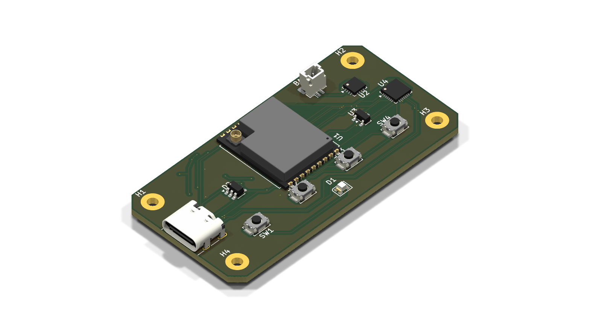
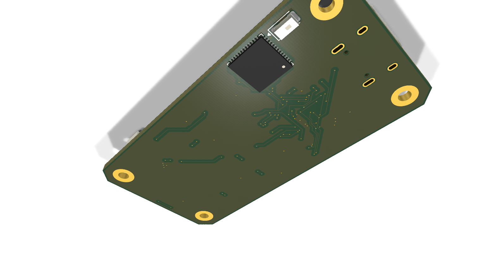
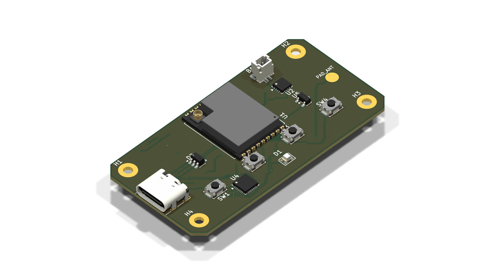
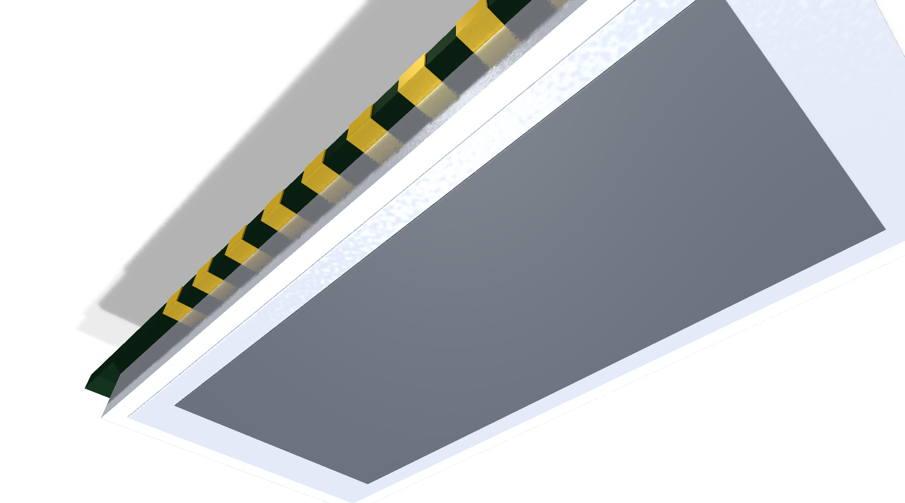
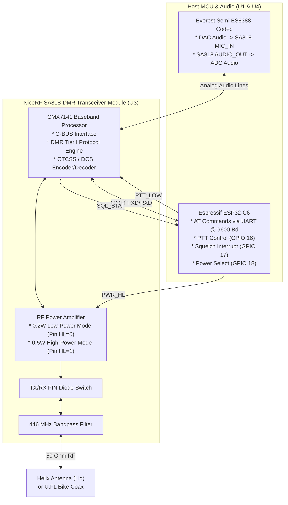

# 04b - OpenMotorMesh (OMM) Intercom Modules & Autonomous OEM Cartridges: 2.4 GHz HD-Mesh & 446 MHz PMR/DMR Tier I

This document serves as the binding architectural specification for the **two native, open-source OpenMotorMesh (OMM) intercom modules**:
1. **OMM 2.4 GHz HD-Mesh Intercom (`PCBA 09`):** High-Definition ad-hoc mesh over 2.4 GHz Wi-Fi 6 / 802.15.4 TDMA with 6LoWPAN/IPv6 multicast and Opus audio for up to 32 riders.
2. **OMM 446 MHz Analog & Digital PMR446 / DMR Tier I Radio Module (`PCBA 10`):** Universal two-way radio module based on the NiceRF SA818-DMR transceiver for 100% interoperability with analog handheld radios (e.g., Midland G7/G9 Pro) and digital DMR handhelds (e.g., Midland D-10).

Both assemblies share the standardized **ECE 22.06 UCS form factor** ($68.0 \times 36.0 \times 9.5\,\text{mm}$) and can be operated either as **standalone helmet headsets** or form-fit docked as **swappable cartridges in Bay 1 or Bay 2 (`PCBA 03`)** on the motorcycle.

---

# PART A: System Overview & The Two Native OMM Modules

## 1. Module Concept, ECE 22.06 UCS Form Factor & Subsystem Decoupling

To prevent architectural confusion between motorcycle carrier mechatronics and intercom modules, OpenMotorBridge v9.6 strictly decouples **two physical functional tiers**:

```
+---------------------------------------------------------------------------------------------------+
|                     ARCHITECTURAL DECOUPLING: CARRIER BOARD VS. OMM MODULES                       |
+----------------------------------------------------+----------------------------------------------+
| 1. CARTRIDGE CARRIER BOARD (PCBA 03 in Pod)        | 2. OMM INTERCOM MODULES (PCBA 09 / PCBA 10)  |
+----------------------------------------------------+----------------------------------------------+
| * Remains permanently inside the pod sled on bike  | * Detachable, standardized UCS modules       |
| * Qorvo DW3110 UWB Transceiver (6.5 GHz Ch. 5)     | * Standardized dimensions: 68 x 36 mm        |
| * Deterministic backbone link to Central Box       | * ECE 22.06 helmet compliant retention claws |
|   (latency < 0.4 ms, jitter-free)                  | * Integrated 600 mAh LiPo battery (UPS)      |
| * Everest Semi ES8388 24-Bit / 48 kHz Audio Codec  | * 4x tactile IP67 pushbuttons on top face    |
| * 4x AO3400A MOSFETs + mechatronic plungers (J_ACT)| * Waterproof front USB-C interface port      |
| * 12V -> 3.8V/5V DC-DC vehicle power supply        | * Module A: OMM 2.4 GHz Mesh (PCBA 09)       |
| * 8-Pin Kelvin Audio & Power Interface (J_AUDIO)   | * Module B: OMM 446 PMR/DMR Radio (PCBA 10)  |
| * Zero 2.4-GHz/446-MHz RF on carrier board!        | * Zero UWB on module (Backbone in pod sled)  |
+----------------------------------------------------+----------------------------------------------+
```

### 1.1 Comparison of the Two Native OMM Modules

| Specification | OMM 2.4 GHz HD-Mesh (`PCBA 09`) | OMM 446 MHz PMR/DMR Radio Module (`PCBA 10`) |
| :--- | :--- | :--- |
| **Architecture** | **Dual-Engine ("OMB Lite")** | **Dual-Engine ("OMB Lite")** |
| **Mesh / Radio Engine** | Espressif ESP32-C6-MINI-1U (Wi-Fi 6 / ESP-NOW) | NiceRF SA818-DMR (CMX7141 Baseband DSP + PA) |
| **Bluetooth Co-Processor** | **ESP32-PICO-V3-02** (Dual-Core 240 MHz, 8 MB Flash, 2 MB PSRAM) | **ESP32-PICO-V3-02** (Dual-Core 240 MHz, 8 MB Flash, 2 MB PSRAM) |
| **Bluetooth Standards** | **BT Classic (BR/EDR)**: HFP 1.7 mSBC, OMI, A2DP + **BLE 5.3** | **BT Classic (BR/EDR)**: HFP 1.7 mSBC, OMI, A2DP + **BLE 5.3** |
| **Bridge Capability** | **Cardo DMC-Bridge, Sena Mesh-Bridge, Universal Intercom** | **Cardo DMC-Bridge, Sena Mesh-Bridge, Universal Intercom** |
| **Operating Modes** | TDMA Slotted Mesh (Open / Private) | **Dual-Mode:** Analog FM (PMR446) + Digital (DMR Tier I) |
| **Channels / Subtones** | 6 Multicast Channels + AES-128 Private Groups | 16x PMR446 (38 CTCSS / 83 DCS) + 16x DMR (Color 1-16) |
| **RF Power Output** | $+20\,\text{dBm}$ ($100\,\text{mW}$ EIRP) | **Dual-Power:** $0.2\,\text{W}$ (Helmet) / $0.5\,\text{W}$ (Bike) |
| **Interoperability** | Autonomous OMM Ecosystem + Sena/Cardo Bridge | **100% compatible with Midland G7/G9 Pro & Midland D-10** |
| **Voice Quality** | Opus HD ($24\,\text{kHz}$ Wideband, $< 18\,\text{ms}$) | Analog FM ($300\dots 3000\,\text{Hz}$) / DMR AMBE+2 ($2450\,\text{bps}$) |
| **Antenna System** | U.FL Dipole (C6 Mesh) + 2.45 GHz Chip Antenna (PICO BT) | $\lambda/4$ Helix / U.FL (DMR) + 2.45 GHz Chip Antenna (PICO BT) |
| **PCB Dimensions** | $60.0 \times 30.0 \times 1.0\,\text{mm}$ (2/4-Layer FR4) | $60.0 \times 30.0 \times 1.0\,\text{mm}$ (4-Layer FR4 TG150) |
| **Enclosure** | ECE 22.06 UCS ($68 \times 36 \times 9.5\,\text{mm}$) | ECE 22.06 UCS ($68 \times 36 \times 9.5\,\text{mm}$) |

---

## 2. Mechanical Design & ECE 22.06 UCS Enclosure

The mechanical enclosures for both OMM modules are 100% identical and precisely fulfill the international **Universal Communication Solution (UCS) specification** under **ECE 22.06**.


```
+-----------------------------------------------------------------------------------------+
|                  UCS ENCLOSURE ENVELOPE & ECE 22.06 RETENTION CLAWS                     |
+-----------------------------------------------------------------------------------------+
|                                                                                         |
|       |<--------------------------- 68.0 mm -------------------------->|                |
|       +----------------------------------------------------------------+  ^             |
|       | [Claw L]                                          [Claw R]     |  |             |
|       |   |                                                    |       |  |             |
|       |   v                                                    v       |  | 36.0 mm     |
|   (=) |   +---+   [BTN 1]       [BTN 2]      [BTN 3]      [BTN 4]  +---+   |  |             |
|   USB |   |   |     (o)          (o)          (+)          (-)     |   |   |  |             |
|   -C  |   +---+                                                +---+   |  v             |
|       +----------------------------------------------------------------+                |
|                                                                                         |
|       |<----------------- 9.5 mm Ultra-Slim Enclosure ----------------->|                |
|       +----------------------------------------------------------------+                |
|       | 1. TOP SHELL (PA12 MJF, Seal Groove & 4x DIN 934 M2 Nut Pockets)               |
|       | ~~~~~~~~~~~~~~~~~ Shore 40A Silicone Gasket Bead (IP67) ~~~~~~~~               |
|       | 2. PCBA 09 / PCBA 10 & 600 mAh LiPo with EPDM Damping Cushion                  |
|       | 3. BOTTOM SHELL (PA12 MJF with 4x M2 Screws & ECE 22.06 Retention Claws)       |
|       +----------------------------------------------------------------+                |
+-----------------------------------------------------------------------------------------+
```

### 2.1 Fastener Integrity: Form-Fitting DIN 934 Nut Pockets
> [!IMPORTANT]
> **Strict Prohibition of Self-Tapping Screws:**
> Self-tapping screws in plastic bosses inevitably strip threads after minimal maintenance cycles, causing fatal IP67 seal failure.
> 
> Both OMM enclosures exclusively use **form-fitting DIN 934 M2 captive hex nut pockets** inside the top shell. The module can be disassembled and reassembled infinitely without thread degradation (ideal for battery replacements or hardware servicing).

### 2.2 Multi-Use USB-C Interface Architecture

```
+-----------------------------------------------------------------------------------------+
|                  OMM MULTI-USE USB-C INTERFACE ARCHITECTURE (J1)                        |
+-----------------------------------------------------------------------------------------+
|                                                                                         |
|  [ OMM UCS Module: PCBA 09 or PCBA 10 ]                                                 |
|        |                                                                                |
|        +---> 1x IP67-Sealed 16-Pin USB-C Port (Device Front J1)                         |
|                    |                                                                    |
|                    +--- MODE A: HELMET STANDALONE OPERATION                             |
|                    |    USB-C to Helmet Pigtail Cable:                                  |
|                    |    * Speakers: Standard 3.5 mm TRS Audio Jack                      |
|                    |      - Tip (CC1): Audio Left (ES8388 LOUT1)                        |
|                    |      - Ring (CC2): Audio Right (ES8388 ROUT1)                      |
|                    |      - Sleeve (SBU2): Zero-current audio ground (AGND_SPK, I=0 mA) |
|                    |    * Microphone: Waterproof 2-Pin Locking Connector (JST-JWPF)     |
|                    |      - Pin 1 (SBU1): MIC_IN+ (ES8388 MIC1P)                        |
|                    |      - Pin 2 (SBU2): Zero-current mic ground (AGND_SPK, I=0 mA)    |
|                    |                                                                    |
|                    +--- MODE B: BIKE POD OPERATION (SMART CARTRIDGE PCBA 03)            |
|                    |    USB-C to 8-Pin JST-SH Adapter Cable (5 cm length, 90° angle):   |
|                    |    * Pin 1: PGND (High-current return, up to 600 mA RF burst)      |
|                    |    * Pin 2: VCC_5V (Vehicle DC power & BQ24075 UPS charging)       |
|                    |    * Pin 3 & 6: AGND_SPK (Audio ground reference, zero-current)    |
|                    |    * Pin 4 & 5: Stereo Audio Line-In Left / Right (CC1 & CC2)      |
|                    |    * Pin 7: MIC_OUT (Rider voice signal into module < 1 ms, SBU1)  |
|                    |    * Pin 8: PTT_IO (Hardware PTT keying to GND / UART Config)      |
|                    |                                                                    |
|                    +--- MODE C: FLASHING, DFU & MAINTENANCE (SERVICE)                   |
|                         Standard USB-C Data Cable to PC / Web Browser (WebUSB):         |
|                         * VBUS (A4/B4/A9/B9) & GND (A1/B1/A12/B12): 5V Power / Charging|
|                         * D+ (A6/B6) & D- (A7/B7): ESP32-C6 Native USB PHY (GPIO 13/12)|
|                           Full WebUSB / DFU firmware flashing, logging & debug updates! |
+-----------------------------------------------------------------------------------------+
```

---

# PART B: OMM 2.4 GHz HD-Mesh Intercom (`PCBA 09`)

## 3. OMM 2.4 GHz Hardware & Protocol Architecture (`PCBA 09`)

The digital 2.4 GHz mesh node is driven by `openmotorbridge_omm_ucs` (**`PCBA 09`**):


*Figure 4.1a: PCBA 09 Top 3D (Current Routing & Placement) -- ESP32-C6 Host MCU (U1), ES8388 Audio Codec (U4), BQ24075 PMIC (U2), ME6211 3.3V LDO (U3), IP67 USB-C (J1), and 4-Button Inline Array.*


*Figure 4.1b: PCBA 09 Bottom 3D (Dual-Engine OMB Lite) -- Dedicated ESP32-PICO-V3-02 Bluetooth Classic/BLE Co-Processor (U5) and Johanson 2450AT Chip Antenna (ANT1) for CoEx-free RF separation.*

* **Microcontroller (`U1`):** Espressif ESP32-C6-MINI-1U (RISC-V @ 160 MHz, Wi-Fi 6 / 802.15.4 / BLE 5.3).
* **Audio Codec (`U4`):** Everest Semi ES8388 (24-bit 96 kHz stereo codec with $2 \times 45\,\text{mW}$ headphone amp).
* **Power Management (`U2`):** Texas Instruments BQ24075 dynamic power-path manager ($500\,\text{mA}$ charging, zero-reboot battery switchover in $< 10\,\mu\text{s}$).
* **Battery (`BAT1`):** 600 mAh LiPo ($3.7\,\text{V}$, $2.22\,\text{Wh}$) delivering 12–14 hours of continuous full-duplex operation.
* **TDMA Protocol Stack:** 10 ms Superframe cycle with collision-free audio slots for up to 6 concurrent full-duplex speakers, 802.11s L2 duplicate filtering, 6LoWPAN/IPv6 multicast, and Opus HD voice streaming ($< 18\,\text{ms}$ overall latency).

### 3.2 Bluetooth 5.3 LE Audio (LC3 Codec) & BLE GATT Remote Control

Beyond its 2.4 GHz IEEE 802.15.4 mesh engine, the ESP32-C6 features a complete Bluetooth 5.3 subsystem that handles two vital functions:

1. **Digital BLE GATT Control (Primary Path vs. Mechatronic Fallback):**
   * The module exposes the native **OpenMotorMesh GATT Service** (`0x00MB`). Handlebar controls, Central Box, or Smart Cartridge issue runtime commands with sub-$5\,\text{ms}$ latency:
     - `PTT_CONTROL` (Char `0x0001`): Push-to-Talk and VOX triggering.
     - `MESH_MODE` (Char `0x0002`): Open Convoy vs. Private Group switching.
     - `CHANNEL_SELECT` (Char `0x0003`): Mesh channels 1 through 16.
     - `VOLUME_LEVEL` (Char `0x0004`): Master playback volume 0 to 100%.
     - `TELEMETRY` (Char `0x0005`): Live state reporting (battery %, VBUS mV, charging bit, RSSI).
   * **Mechatronics as Boot & Fallback Only:** The 4 physical button actuators on `PCBA 03` are strictly reserved for unpowered cold boots (**Power ON / Power OFF**) or as emergency fallbacks if BLE disconnects. During standard operation, 100% of controls are wear-free digital BLE commands!

### 3.2 The Dual-Engine Architecture: Eliminating Shared Radio Contention ("OMB Lite")

> [!IMPORTANT]
> **The Single-Chip "Shared Radio" Bottleneck:**
> The ESP32-C6 possesses only **one physical 2.4 GHz RF transceiver (LNA/PA/mixer)**, which must time-slice between Wi-Fi 6 (ESP-NOW Mesh) and Bluetooth Low Energy (BLE 5.3). Furthermore, the ESP32-C6 hardware **does not support Bluetooth Classic (BR/EDR)**.
> 
> When a single chip handles both real-time voice mesh (Opus frames every 10–20 ms) and BLE (companion phone PWA, telemetry, scanning), the internal coexistence arbiter forces antenna time-slicing. In real-world mesh networks, this produces **micro-jitter, buffer under-runs, and audio clicks/dropouts**.

To eliminate this bottleneck completely, OpenMotorBridge v9.6 implements an uncompromising **Dual-Engine Architecture** across both modules (`PCBA 09` and `PCBA 10`):

```
+---------------------------------------------------------------------------------------------------+
|                        DUAL-ENGINE ARCHITECTURE: OMM 2.4 GHz & OMM 446 ("OMB LITE")                |
+----------------------------------------------------+----------------------------------------------+
| 1. HOST / MESH ENGINE: ESP32-C6-MINI-1U            | 2. BLUETOOTH CO-PROCESSOR: ESP32-PICO-V3-02  |
+----------------------------------------------------+----------------------------------------------+
| * 100% dedicated Wi-Fi 6 / ESP-NOW Mesh (PCBA 09)  | * Dual-Core 240 MHz Xtensa LX6 MCU           |
| * Or DMR Tier I / PMR446 Controller (PCBA 10)      | * Integrated: 8 MB SPI Flash + 2 MB PSRAM    |
| * Bluetooth in C6 firmware COMPLETELY disabled     | * Bluetooth Classic (BR/EDR) + BLE 4.2 / 5.x |
|   (`CONFIG_BT_ENABLED=0`)                          | * Universal Intercom (HFP 1.7 mSBC HD Voice) |
| * Transceiver permanently locked to mesh channel   | * Cardo DMC-Bluetooth Bridge & Sena Bridge   |
| * Zero radio contention, zero CoEx time-slicing    | * A2DP HiFi Stereo Streaming (Music/Nav)     |
| * Guaranteed voice audio latency < 15 ms           | * Smartphone PWA Companion App (BLE GATT)    |
| * External U.FL dipole antenna (Taoglas Flex)      | * Dedicated 2.45 GHz ceramic chip antenna    |
+----------------------------------------------------+----------------------------------------------+
                         |                                          |
                         +------------ High-Speed UART (3 Mbps) ----+
                         |             (Hardware Flow Control)      |
                         v                                          v
                   +------------------------------------------------------+
                   | Everest Semi ES8388 HiFi Stereo Audio Codec (U4)     |
                   | * Hardware & Digital Audio Mixing                    |
                   | * Full-Duplex Stereo Headset & Mic Preamp            |
                   +------------------------------------------------------+
```

### 3.3 Simultaneous Dual-Radio Operation & Cross-Over Bridge (Cardo DMC / Sena)

Because the ESP32-C6 and ESP32-PICO-V3-02 utilize **two completely separate physical RF frontends and antennas**, the system achieves true **Dual-Radio Full-Duplex operation**:

1. **Simultaneous Conversation Without Switching:**
   * The rider communicates continuously in the OpenMotorMesh group (2.4 GHz ESP-NOW or 446 MHz DMR).
   * **Simultaneously**, the Bluetooth Universal Intercom link to an external headset (e.g., Sena or non-mesh Cardo) remains active. Both audio streams are mixed distortion-free in the codec/DSP.

2. **OpenMotorBridge as a Universal Mesh Gateway:**
   * **Cardo DMC-Bluetooth Bridge Integration:** A Cardo Packtalk rider taps *"DMC-Bluetooth Bridge"* in the Cardo Connect app. The OMB Lite module pairs via Bluetooth with that Packtalk. The audio stream of the entire Cardo DMC mesh is routed live into OpenMotorMesh—and the OMM mesh back into Cardo!
   * **Sena Mesh Intercom Bridge:** The exact same principle connects Sena Mesh groups via a bridged Bluetooth connection into OpenMotorMesh.
   * **Native OMM Bridge for Guest Riders:** Any rider with a standard Bluetooth headset is paired to the helmet module via Bluetooth Classic Universal Intercom and broadcast to all OMM mesh participants.

3. **Autonomous "OMB Lite" for Travel & Rental Bikes (e.g., USA Tour):**
   * The helmet module requires **no motorcycle and no Central Box** to operate.
   * With its integrated 600 mAh LiPo battery, BQ24075 PMIC, ES8388 codec, and dual RF stages, the helmet module functions as a standalone, pocket-sized high-end intercom for rental bikes, bicycles, or cars.

### 3.4 Inter-MCU Pinout (ESP32-C6 <-> ESP32-PICO-V3-02)

| Signal | ESP32-C6 (`U1`) | ESP32-PICO-V3-02 (`U5/U6`) | Function |
| :--- | :--- | :--- | :--- |
| `BT_UART_TX` | GPIO 16 (Pad 18) | IO1 / U0TXD (Pad 41) | Serial telemetry & audio data stream (PICO -> C6) |
| `BT_UART_RX` | GPIO 17 (Pad 19) | IO3 / U0RXD (Pad 40) | Serial telemetry & audio data stream (C6 -> PICO) |
| `BT_UART_RTS` | GPIO 15 (Pad 17) | IO15 / MTDO (Pad 21) | Hardware Flow Control RTS |
| `BT_UART_CTS` | GPIO 14 (Pad 16) | IO13 / MTCK (Pad 20) | Hardware Flow Control CTS |
| `BT_RESET` | GPIO 18 (Pad 20) | EN / CHIP_PU (Pad 9) | Hardware reset & co-processor wakeup |
| `BT_BOOT` | GPIO 2 (Pad 8) | IO0 (Pad 23) | Boot-strap for WebUSB DFU in-circuit flashing |
| `BT_ANT` | – | LNA_IN (Pad 2) | $50\,\Omega$ RF feed to Johanson 2450AT18 chip antenna |

---

# PART C: OMM 446 MHz Analog & Digital PMR/DMR Module (`PCBA 10`)

## 4. OMM 446 Motivation & System Architecture

The **OMM 446 MHz Intercom Module (`PCBA 10`)** eliminates the dilemma of bulky handheld two-way radios on motorcycles:

```
+-----------------------------------------------------------------------------------------+
|                  THE HANDHELD TWO-WAY RADIO MOTORCYCLE DILEMMA                          |
+----------------------------------------------------+------------------------------------+
| CONVENTIONAL HAND RADIOS (Midland G9 / D-10)       | OPENMOTORBRIDGE SOLUTION: PCBA 10  |
+----------------------------------------------------+------------------------------------+
| * Bulky brick enclosure (122 x 58 x 34 mm)         | * Ultra-slim UCS form: 68 x 36 mm  |
| * Protruding knobs, dials & belt clips             | * Fits inside standard helmet slot |
| * Cannot physically fit into cartridge sleds!      | * Form-fit docks into Bay 1/Bay 2  |
| * Awkward 12 to 24 cm whip antennas                |   cartridge sleds on bike          |
| * Teardown destroys warranty, IP seals & value     | * Dual-Mode: Analog FM + DMR Tier I|
| * Zero integration with motorcycle cockpit display | * 100% digital control via UART    |
+----------------------------------------------------+------------------------------------+
```


*Figure 4.2a: PCBA 10 Top 3D (Current Routing & Placement) -- ESP32-C6 Host MCU (U1), ES8388 Audio Codec (U4), BQ24075 PMIC (U2), ME6211 3.3V LDO (U5), IP67 USB-C (J1), and 4-Button Inline Array.*


*Figure 4.2b: PCBA 10 Bottom 3D (NiceRF SA818 & Dual-Engine) -- NiceRF SA818-DMR Transceiver (U3), ESP32-PICO-V3-02 Bluetooth Co-Processor (U6), and Johanson 2450AT Chip Antenna (ANT1).*

### 4.1 PCB Specifications & Stackup (`PCBA 10`)
* **PCB Identifier:** `openmotorbridge_omm446_ucs` (**`PCBA 10`**).
* **Dimensions:** $60.0 \times 30.0 \times 1.0\,\text{mm}$ ($R = 2.5\,\text{mm}$ corner radius) -- identical to `PCBA 09`.
* **Stackup:** 4-Layer FR4 TG150 ($1.0\,\text{mm}$ core thickness):
  - Top Layer ($35\,\mu\text{m}$ Cu): ESP32-C6 Host MCU (`U1`), ES8388 Stereo Audio Codec (`U4`), TI BQ24075 PMIC (`U2`), ME6211C33 LDO (`U5`), 4x Tactical Switches (`SW1`--`SW4`), IP67 USB-C (`J1`), WS2812B RGB (`D1`), LiPo Header (`BAT1`), Helical Contact (`PAD_ANT`).
  - Inner Layer 1 ($17.5\,\mu\text{m}$ Cu): Solid ground shield plane (`AGND` & `GND` shielding beneath the SA818 transceiver).
  - Inner Layer 2 ($17.5\,\mu\text{m}$ Cu): Low-impedance power planes ($3.3\,\text{V}$ system, $4.4\,\text{V}$ PA supply).
  - Bottom Layer ($35\,\mu\text{m}$ Cu): NiceRF SA818-DMR module (`U3`), ESP32-PICO-V3-02 Bluetooth Co-Processor (`U6`), Johanson 2450AT Chip Antenna (`ANT1`), U.FL coaxial receptacle (`J_RF`).
* **Surface Finish:** ENIG (Electroless Nickel Immersion Gold).

---

## 5. NiceRF SA818-DMR Transceiver & Dual-Mode Radio

The RF core of `PCBA 10` is the **NiceRF SA818-DMR SMD module** ($38 \times 16 \times 3.2\,\text{mm}$):



### 5.1 The Two Operating Modes: Analog PMR446 vs. Digital DMR Tier I

#### Mode 1: Analog PMR446 (Class 3a Compatibility)
* **Frequency Range:** $446.00625\,\text{MHz}$ to $446.19375\,\text{MHz}$ (16 channels at $12.5\,\text{kHz}$ spacing).
* **Modulation:** Narrowband FM (11K0F3E) with $\pm 2.5\,\text{kHz}$ peak deviation.
* **Subtone Squelch Encoding:**
  - **38 CTCSS Tones:** $67.0\,\text{Hz}$ to $250.3\,\text{Hz}$ continuous sub-audible tone.
  - **83 DCS Codes:** Digital 23-bit framing for selective squelch.
* **100% Interoperability:** Communicates with all standard PMR446 radios in the field (**Midland G7 Pro, G9 Pro, G11, G13, G15, G18**, Motorola TLKR / T82, Retevis, Baofeng).

#### Mode 2: Digital DMR Tier I (Class 3b Compatibility)
* **Standard:** ETSI TS 102 361-1 compliant (license-free digital radio in the 446 MHz band).
* **Modulation:** 2-Slot TDMA with 4FSK modulation ($4.8\,\text{kbaud} / 9.6\,\text{kbps}$ gross bit rate).
* **Voice Vocoder:** AMBE+2 ($2450\,\text{bps}$ vocoder + $1150\,\text{bps}$ FEC protection).
* **Addressing & Filtering:**
  - 16 digital pre-programmed channels.
  - **Color Codes 1 to 16:** Digitally separates groups on identical frequencies.
  - **DMO Direct Mode (Peer-to-Peer):** Fully digital communication without repeaters.
* **Crucial Advantage over Analog:** **Crystal clear, noise-free voice transmission right up to the fringe limit.** While analog signals get progressively noisier with distance, DMR stays clean until the signal cuts out completely.
* **100% Interoperability:** Communicates with digital handhelds like the **Midland D-10**, Retevis RT3S, TyT MD-380.

---

## 6. RF Power Output, Antennas & SAR Safety

### 6.1 Dual-Power Output Switching (0.2 W vs. 0.5 W ERP)
The SA818-DMR module provides a dedicated power-select pin `HL` (`SA818_PWR_HL`, controlled via ESP32-C6 `GPIO 18`):

| Operating Mode | Control Pin `SA818_PWR_HL` | ERP Power Output | Range (Line-of-Sight) | Scope & Regulatory Compliance |
| :--- | :--- | :--- | :--- | :--- |
| **Helmet Mode (Standalone)** | **`LOW` (0 V)** | **$0.2\,\text{W}$ ($200\,\text{mW}$)** | **$1.5\dots 2.5\,\text{km}$** | **SAR-Safe:** Minimal head absorption; protects 600 mAh battery (8–10 h runtime). |
| **Bike Mode (Cartridge in Pod)**| **`HIGH` ($3.3\,\text{V}$)** | **$0.5\,\text{W}$ ($500\,\text{mW}$)** | **$3.0\dots 6.0\,\text{km}$** | **Maximum Legal PMR446 Power:** Powered via 5V bike DC rail; maximum range across open country. |

### 6.2 Antenna System: Integrated Helmet Helix vs. External Bike Coax
1. **Helmet Standalone Mode (Internal Helix):**
   - Tuned copper helical antenna ($\lambda/4$ shortened, $32\,\text{mm}$ length, $\varnothing 5\,\text{mm}$) molded into the top shell labyrinth.
   - Potted in shock-resistant polyurethane resin.
   - Gold compression contact mates directly with `PCBA 10` upon enclosure assembly.
2. **Pod Cartridge Mode (External Vehicle Antenna):**
   - `PCBA 10` features an onboard **U.FL coaxial receptacle (`J_RF`)**.
   - An RG-178 coaxial pigtail routes to a waterproof SMA chassis connector on the pod.
   - **Performance Advantage:** Antennas mounted at the bike tail or handlebars eliminate human body RF shadowing entirely.

---

## 7. Complete Pinout & Schematic Interconnect (`PCBA 10`)

| Pad / Pin | Signal Name | Direction | Periphery / Function | Electrical Parameters |
| :---: | :--- | :---: | :--- | :--- |
| **`GPIO 2`** | `BTN_PTT` | Input | SW1: Push-To-Talk / MFB (Active-Low) | Internal pullup $45\,\text{k}\Omega$, boot pin |
| **`GPIO 3`** | `BTN_MODE` | Input | SW2: Mode Toggle (Analog FM <-> DMR) | Internal pullup $45\,\text{k}\Omega$ |
| **`GPIO 4`** | `BTN_CH_UP` | Input | SW3: Channel Up (CH 1–16) | Internal pullup $45\,\text{k}\Omega$ |
| **`GPIO 5`** | `BTN_CH_DOWN` | Input | SW4: Channel Down (CH 16–1) | Internal pullup $45\,\text{k}\Omega$ |
| **`GPIO 6`** | `WS2812_DATA` | Output | D1: WS2812B RGB Status LED | $800\,\text{kHz}$ NZR protocol, 3.3V logic |
| **`GPIO 7`** | `CHG_STAT` | Input | BQ24075 /STAT Charge Indication | Open-drain, pullup to 3.3V |
| **`GPIO 8`** | `I2C_SDA` | I/O | ES8388 Audio Codec I2C Control SDA | $4.7\,\text{k}\Omega$ pullup to 3.3V |
| **`GPIO 9`** | `I2C_SCL` | Output | ES8388 Audio Codec I2C Control SCL | $4.7\,\text{k}\Omega$ pullup to 3.3V ($400\,\text{kHz}$) |
| **`GPIO 12`** | `USB_DN` | I/O | USB-C D- Line | Native USB 2.0 Full-Speed PHY (DFU Flashing) |
| **`GPIO 13`** | `USB_DP` | I/O | USB-C D+ Line | Native USB 2.0 Full-Speed PHY (DFU Flashing) |
| **`GPIO 14`** | `SA818_TXD` | Output | UART TX -> SA818 RXD (AT Commands) | $9600\,\text{Bd}$, 8N1, 3.3V CMOS |
| **`GPIO 15`** | `SA818_RXD` | Input | UART RX <- SA818 TXD (Telemetry/Status)| $9600\,\text{Bd}$, 8N1, 3.3V CMOS |
| **`GPIO 16`** | `SA818_PTT` | Output | SA818 Transmit Enable | **Low = TX Transmitting**, High = RX Idle |
| **`GPIO 17`** | `SA818_SQL` | Input | SA818 Carrier Squelch Status | **Low = Carrier Detected (Receiving)** |
| **`GPIO 18`** | `SA818_PWR_HL`| Output | SA818 RF Power Mode Select | **Low = 0.2W (Helmet)**, High = 0.5W (Bike) |
| **`GPIO 19`** | `I2S_MCLK` | Output | ES8388 Master Clock | $12.288\,\text{MHz}$ ($256 \times f_s$) |
| **`GPIO 20`** | `I2S_BCLK` | Output | ES8388 Bit Clock | $1.536\,\text{MHz}$ ($32 \times f_s$) |
| **`GPIO 21`** | `I2S_WS` | Output | ES8388 Frame Sync | $48.0\,\text{kHz}$ audio frame rate |
| **`GPIO 22`** | `I2S_DOUT` | Output | ES8388 DAC Out (Spoken Audio Stream) | I2S Standard Format |
| **`GPIO 23`** | `I2S_DIN` | Input | ES8388 ADC In (Microphone Capture) | I2S Standard Format |

---

## 8. Audio Frontend, PTT Keying & 8-Pin Kelvin Grounding

### 8.1 Common-Impedance Coupling Prevention
During $0.5\,\text{W}$ transmissions, the SA818 RF power amplifier draws pulses of up to **$600\,\text{mA}$**.
* Sharing power ground with audio return would induce an $I \times R$ drop of $48\,\text{mV}$ across the microphone line ($5\dots 15\,\text{mV}$ signal), causing unbearable buzzing and motorboating noise.
* **Solution: 8-Pin Kelvin Grounding on `J_AUDIO_PWR`:**
  - `Pin 1: PGND` routes all $600\,\text{mA}$ power transients directly back to the DC-DC converter.
  - `Pin 3: AGND_SPK` and `Pin 6: AGND_MIC` carry strictly zero return current ($I = 0\,\text{mA}$), guaranteeing $\Delta V = 0\,\text{mV}$ and crystal-clear audio!

```
+---------------------------------------------------------------------------------------------------+
|               8-PIN KELVIN GROUNDING DURING PCBA 10 TRANSMISSION (SA818-DMR TX BURST)              |
+---------------------------------------------------------------------------------------------------+
|                                                                                                   |
|  [ PCBA 10 OMM 446 MODULE ]                                         [ SMART CARTRIDGE PCBA 03 ]   |
|                                                                                                   |
|  SA818 PA Return (600 mA Peak) ----(Pin 1: PGND)------------------> LM5164 DC-DC Return Plane      |
|  5V UPS Charging & PA Supply <-----(Pin 2: VCC_5V)----------------- 5V Vehicle Supply (1.5 A)     |
|                                                                                                   |
|  ES8388 Speaker DAC Ground --------(Pin 3: AGND_SPK, I = 0 mA)----> Clean Audio Ground (ES8388)   |
|  ES8388 Demodulated Audio Left ----(Pin 4: AUDIO_L_IN)------------> ES8388 Codec Line-In Left     |
|  ES8388 Demodulated Audio Right ---(Pin 5: AUDIO_R_IN)------------> ES8388 Codec Line-In Right    |
|                                                                                                   |
|  ES8388 Mic ADC Ground ------------(Pin 6: AGND_MIC, I = 0 mA)----> Low-Noise Mic Ground Plane    |
|  Mic Voice from Central DSP -------(Pin 7: MIC_OUT)---------------> Differential Preamp Input    |
|                                                                                                   |
|  SA818 Hardware PTT Keying --------(Pin 8: PTT_IO)----------------- Q4 Open-Drain PTT MOSFET     |
|                                                                                                   |
+---------------------------------------------------------------------------------------------------+
```

---

## 9. Cockpit & UI Integration: CarPlay, Android Auto & PWA Radio Dashboard

When docked in the bike pod, all physical knobs are eliminated. Configuration is handled entirely from the handlebar buttons or CarPlay/Android Auto touchscreens:

```
+-----------------------------------------------------------------------------------------+
|                  CARPLAY / PWA DASHBOARD: PMR446 & DMR CONTROL CENTER                   |
+-----------------------------------------------------------------------------------------+
|                                                                                         |
|   +---------------------------------------------------------------------------------+   |
|   |  MODE:   [ (o) ANALOG PMR446 ]   [ ( ) DIGITAL DMR TIER I ]                     |   |
|   +---------------------------------------------------------------------------------+   |
|                                                                                         |
|   CHANNEL:    < [ CHANNEL 08 : 446.09375 MHz ] >    (Mountain Rescue / Public Convoy)   |
|                                                                                         |
|   SUBTONE:   [ CTCSS: 16 (114.8 Hz) v ]             SQUELCH LEVEL: [----||-------] 3/8  |
|                                                                                         |
|   RF POWER:  [ 0.5 W HIGH (BIKE) ]                  STATUS:        [ RX: RSSI -82 dBm ] |
|                                                                                         |
|   +---------------------------------------------------------------------------------+   |
|   |                   [  PUSH TO TALK (HANDLEBAR BUTTON ACTIVE)  ]                  |   |
|   +---------------------------------------------------------------------------------+   |
|                                                                                         |
+-----------------------------------------------------------------------------------------+
```

---

# PART D: Cross-Bridging & Hardware Comparison Matrix

## 10. Cross-Bridging Matrix: OMM 446 to Sena, Cardo, and OMM 2.4 GHz

When Bay 1 hosts a Sena SPIDER X Slim and Bay 2 hosts the OMM 446 module (`PCBA 10`), OpenMotorBridge acts as a seamless gateway:

```mermaid
flowchart LR
    subgraph PMR["446 MHz Radio Cell (Public Handheld Radios)"]
        G9["Midland G9 Pro\n(Analog FM Handheld)"] <-->|446.09375 MHz| P10["OMM 446 Module\n(PCBA 10 in Bay 2)"]
        D10["Midland D-10\n(Digital DMR Handheld)"] <-->|DMR TDMA 4FSK| P10
    end

    subgraph Central["Central Box (PCBA 01) DSP Routing Matrix"]
        P10 <-->|UWB Backbone Ch. 5 (< 0.4 ms)| DSP["ESP32-S3 Audio DSP\n* Raised-Cosine Filter\n* Ducking (-12 dB)\n* Voice Activity Detection (VAD)"]
    end

    subgraph SenaNet["Motorcycle Riding Group (Sena Mesh 3.0)"]
        DSP <-->|UWB Backbone Ch. 5| SLED["Sena SPIDER X Slim\n(PCBA 03 in Bay 1)"]
        SLED <-->|2.4 GHz Sena Mesh| BIKES["Group (15 Riders on Sena 50S / 60S / Spider)"]
    end
```

* An analog **Midland G9 Pro** or digital **Midland D-10** user transmits on Channel 8.
* `PCBA 10` demodulates the signal in $< 4\,\text{ms}$ and streams digital audio across the Qorvo DW3110 UWB backbone to the Central Box (`PCBA 01`).
* The central DSP applies bandpass filtering and injects the voice into the Sena SPIDER X Slim cartridge with $< 1\,\text{ms}$ latency.
* **The Entire Group Hears the Transmission in Sena Mesh 3.0** without any rider needing to mount a handheld radio!

---

## 11. Hardware Comparison Matrix: OMM 2.4 GHz vs. OMM 446 vs. OEM

| Feature | OEM Systems (Sena Spider / Cardo Edge) | OMM 2.4 GHz HD-Mesh (`PCBA 09`) | OMM 446 PMR/DMR Radio (`PCBA 10`) |
| :--- | :--- | :--- | :--- |
| **Primary Purpose** | Interoperability with legacy brands | Open-source HD group mesh | Universal public radio interoperability |
| **RF Frequency** | $2.4\,\text{GHz}$ (ISM) | $2.4\,\text{GHz}$ (Wi-Fi 6 / 802.15.4) | **$446.0\dots 446.2\,\text{MHz}$ (PMR446)** |
| **Protocol** | Proprietary (Sena Mesh 2/3, Cardo DMC) | **Standard: 6LoWPAN / IPv6 Multicast** | **Standard: Analog FM + DMR Tier I** |
| **RF Power Output** | $100\,\text{mW}$ ($+20\,\text{dBm}$) | $100\,\text{mW}$ ($+20\,\text{dBm}$) | **$200\,\text{mW}$ (Helmet) / $500\,\text{mW}$ (Bike)** |
| **Range** | $800\dots 1200\,\text{m}$ per hop | $400\dots 800\,\text{m}$ (Mesh-Relay) | **$1.5\dots 6.0\,\text{km}$ (Narrowband)** |
| **Third-Party Devices** | Strictly brand-locked | OMM nodes & ESP32-C6 devices | **All PMR446 & DMR handhelds!** |
| **Audio Quality** | Wideband HD ($16\dots 24\,\text{kHz}$) | **Opus HD ($24\,\text{kHz}$, $< 18\,\text{ms}$)** | Analog voice ($3\,\text{kHz}$) / DMR AMBE+2 |
| **Connector** | Proprietary terminal pins | IP67 USB-C Port | IP67 USB-C Port |
| **Form Factor** | Brand-specific, incompatible | **ECE 22.06 UCS ($68 \times 36 \times 9.5\,\text{mm}$)** | **ECE 22.06 UCS ($68 \times 36 \times 9.5\,\text{mm}$)** |
| **Fasteners** | Glued or plastic clip tabs | **4x DIN 934 M2 captive hex nuts** | **4x DIN 934 M2 captive hex nuts** |
| **Serviceability** | E-waste upon battery degradation | **100% repairable, swappable LiPo** | **100% repairable, swappable LiPo** |
