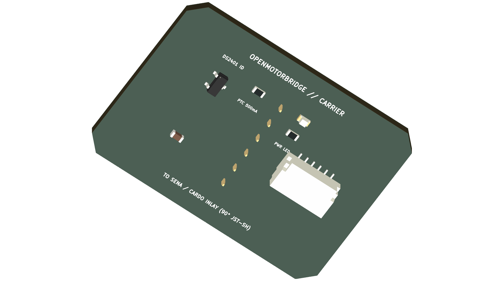

# 05 - Mechanical Construction: Central Box, Sealing Concept, HD26 Flange & Status Light Pipe

This document specifies the IP67 enclosure design for the central main box (Type A) featuring the **HD26 wall flange in the upper tray**, **mid-tray pass-through apertures**, and **waterproof RGB light pipe**, alongside the universal satellite pod system (Type B) with modular cartridge bays.

---

## 1. Enclosure Type A: Central Main Box (Under Seat)
- **External Dimensions:** 96.0 x 66.0 x 43.5 mm (L x W x H).
- **Internal Clearance:** 88.0 x 58.0 mm (PCB footprint 85.0 x 55.0 mm).
- **Material & Manufacturing:** PA12 via HP Multi Jet Fusion (MJF) 3D printing (or UV/fuel resistant ASA via FDM with min. 6 perimeters / 2.4 mm solid walls), glass-bead blasted, black vapor-smoothed, and hydrophobic sealed.
- **Ingress Protection:** IP67 (dust tight, immersion proof up to 1 m water depth).

```
┌────────────────────────────────────────────────────────────┐  ▲
│ 1. LID (3.0 mm wall thickness + M8 ePTFE Vent + LED Pipe)  │  │
├────────────────────────────────────────────────────────────┤  │ 43.5 mm
│ 2. UPPER TRAY: HD26 Wall Flange (Front) + Mid Baffle Floor │  │ Total
│    • Ribbon Cable Slot (38 x 6 mm chamfered)               │  │ Height
│    • LED Light Shaft (Ø 5.0 mm) & 4x Pressure Equal. Slots │  │
├────────────────────────────────────────────────────────────┤  │
│ 3. LOWER CASE: Closed Immersion Tray (20 mm int. height)   │  │
│    • 4x M2.5 PCB Standoffs + Recessed LiPo Battery Pocket  │  │
└────────────────────────────────────────────────────────────┘  ▼
```

### 1.1 Sandwich Construction & Layer Breakdown
1. **Lower Case (20.0 mm Internal Height - Closed Immersion Tray):**
   * Fully sealed, solid-wall enclosure (no penetrations below PCB level).
   * Recessed battery pocket (52.0 x 36.0 x 6.5 mm) for LiPo buffer pack (vibration-damped with *3M VHB 4910* foam tape) and NTC thermistor.
   * Four Ruthex M3 x 5.7 mm brass heat-set inserts in the lower floor for through-bolts.
   * 4-layer PCB (85.0 x 55.0 mm) mounted on four 4.0 mm cylinder standoffs with M2.5 x 5 mm screws and NBR O-rings for vibration isolation.
2. **Upper Tray / Mid Frame (15.0 mm Internal Height):**
   * Houses the bolted **HD26 D-Sub wall flange** on the front panel.
   * Provides $12\,\text{mm}$ clearance for connector depth and a smooth loop for the ribbon cable.
3. **Enclosure Lid (3.0 mm Wall Thickness):**
   * Integrates the M8 x 1.25 ePTFE pressure equalization vent and the $\varnothing\,3.0\,\text{mm}$ PMMA light pipe for the WS2812B RGB LED.
   * Bolted through with four M3 x 40/45 mm stainless steel socket head screws (DIN 912 / ISO 4762) into bottom Ruthex M3 brass inserts ($0.8\,\text{Nm}$ torque, secured with *Loctite 243*).

---

## 2. Mid Baffle Pass-Throughs & Cable Routing

The mid baffle separates the PCB/battery compartment mechanically from the connector chamber while providing precise pass-through cutouts:

```
┌─────────────────────────────────────────────────────────────┐
│                 UPPER TRAY MID BAFFLE (Top View)            │
│                                                             │
│   ┌─────────────────────────────┐     ┌─────────────────┐   │
│   │ 1. Ribbon Cable Slot        │     │ 2. LED Shaft    │   │
│   │    (38.0 x 6.0 mm)          │     │    (Ø 5.0 mm)   │   │
│   │    Chamfered Edge R1.5 mm   │     │    Clearance    │   │
│   └─────────────────────────────┘     └─────────────────┘   │
│                                                             │
│   [Slot 1]                 [Slot 2]                 [Slot 3]│
│   (15 x 2 mm)              (15 x 2 mm)              (15 x 2)│
│   ◄──────── 4x Internal Pressure Equalization Slots ───────►│
└─────────────────────────────────────────────────────────────┘
```

### 2.1 Pass-Through Specifications
1. **Ribbon Cable Slot:**
   * **Dimensions:** $38.0 \times 6.0\,\text{mm}$ with $R=1.5\,\text{mm}$ full perimeter chamfer on top and bottom faces (prevents insulation abrasion on the 26-conductor AWG28 ribbon cable).
   * **Position:** Aligned directly above the 2x13 box header `J1` on the main PCB.
2. **Optical LED Light Shaft:**
   * **Geometry:** $\varnothing\,5.0\,\text{mm}$ clearance hole, coaxially positioned above SMD LED `LED1` (WS2812B, GPIO 48).
   * **Function:** Allows the lid-mounted PMMA light pipe to extend down to within $0.8\,\text{mm}$ of the LED emitter surface.
3. **Pressure Equalization & Venting Slots:**
   * 4x Labyrinth ventilation slots ($15.0 \times 2.0\,\text{mm}$) allow unimpeded airflow between lower tray and the M8 ePTFE vent in the lid while keeping cables organized.

---

## 3. HD26 D-Sub Enclosure Wall Flange (Upper Tray)

```
    OUTSIDE (IP67 Environment)                 UPPER TRAY (Main Box)
┌─────────────────────────┐               ┌─────────────────────────────────┐
│ IP67 HD26 Plug          │  Flange       │ 26-cond. Ribbon Cable (45 mm)   │
│ (Main Harness)          ├── Gasket ─────┤ with 2x13 Box Header (J1)       │
│ 2x M3 Jackscrews O-Ring │  (EPDM 1.5mm) │ ──► Through Mid-Baffle Slot     │
└─────────────────────────┘               │ ──► Plugs onto Main PCB Header  │
                                          └─────────────────────────────────┘
```

### 3.1 Mechanical Flange Specification
* **Cutout Geometry:** D-Sub High-Density 26-pin cutout ($31.0 \times 13.0\,\text{mm}$) with $2.0\,\text{mm}$ corner radii in the **upper tray** front wall.
* **Flange Gasket:** Precision-molded EPDM flat gasket ($1.5\,\text{mm}$ thickness, 60 Shore A) between metal collar of the Amphenol LTW / NorComp SEAL-D socket and enclosure wall.
* **Fastening:** 2x stainless steel jackscrews (UNC 4-40 or M3 with O-ring sealing washers) torqued to $0.6\,\text{Nm}$ for a watertight seal.
* **Strain-Relieved Interconnect:** A $45\,\text{mm}$ ultra-flexible 26-conductor ribbon cable (AWG28, 1.27 mm pitch) connects through the baffle slot to the 2x13 box header (J1) on the PCB.

---

## 4. Waterproof Light Pipe for WS2812B RGB Status LED

```
┌─────────────────────────────────────────────────────────────┐
│ ENCLOSURE LID (3.0 mm Wall Thickness)                       │
│                  ┌──────────────────┐                       │
│                  │  PMMA Light Pipe │ ◄── O-Ring Gasket     │
│                  │  (Ø 3.0 mm Matt) │     (IP67 Sealed)     │
│                  └────────┬─────────┘                       │
├───────────────────────────┼─────────────────────────────────┤
│ MID BAFFLE                │ Passes through Ø 5.0 mm shaft
├───────────────────────────┼─────────────────────────────────┤
│                           │ Optical Air Gap 0.8 mm          │
│                           ▼                                 │
│                  ┌──────────────────┐                       │
│                  │ WS2812B RGB LED  │                       │
│  MAIN PCB        │ (ESP32 GPIO 48)  │                       │
│  (LOWER TRAY)    └──────────────────┘                       │
└─────────────────────────────────────────────────────────────┘
```

### 4.1 Optical & Mechanical Specification
* **Light Pipe Component:** PMMA optical light pipe with diffuse matte lens (*Bivar PLPC3-3MM* or *Mentor 1292.1101*), $\varnothing\,3.0\,\text{mm}$.
* **Sealing:** NBR O-ring ($\varnothing\,3.0\,\text{mm}$ ID, $1.0\,\text{mm}$ cord thickness) inside stepped lid aperture, flush-mounted and sealed with optical-grade polyurethane.
* **Visibility:** 120° viewing angle, clearly discernible under direct sunlight beneath seat / inside side cover.

### 4.2 Status LED Color Code (State Machine)

| LED Color & Pattern | Operational State | Meaning |
| :--- | :--- | :--- |
| 🟢 **Green Pulsing (1 Hz)** | **Normal Operation (Online)** | Main power active, all plugged pods operational, DLE OK |
| 🔵 **Blue Blinking (2 Hz)** | **BLE Dashboard / Pairing** | WebApp PWA actively connected / data transfer |
| 🟡 **Yellow Pulsing (0.5 Hz)**| **UPS Battery Mode (KL15 OFF)**| Shutdown rundown: GPX Tour-Close & WebDAV upload |
| 🔴 **Red Fast Blinking** | **Warning / Error** | Starter battery under-voltage ($< 11.8\,\text{V}$) / Cartridge short |
| 🟣 **Solid Purple** | **OMM DLE Leader** | Current motorcycle is coordinating the group mesh |
| ⚪ **White Double Flash** | **Actioncam Marker** | Handlebar button pressed: GPS highlight marker saved |

---

## 5. Enclosure Type B: Universal Satellite Pod (Identical for Pods 1, 2, and 3)

- **100% Universal Design:** All 3 pod locations on the motorcycle use the identical enclosure body.
- **Bay Dimensions:** 64.0 x 46.0 x 23.5 mm.
- **Cartridge Module:** 54.0 x 37.5 x 17.0 mm (PA12 MJF).

### 5.1 Cartridge Carrier PCB & 3D Board Render

The cartridge carrier PCB (`openmotorbridge_pod_cartridge`) adapts internal Sena or Cardo OEM inlays via a low-profile right-angle JST-SH connector to the 6 gold-plated pogo contact target pads:



*Figure 5.1: Photorealistic 3D raytracing render of the Universal Pod Cartridge Carrier PCB (KiCad 8.0, 35.0 x 25.0 mm, ENIG Gold with right-angle JST-SH 1.0 mm connector, 6 pogo contact target pads, and Maxim DS2401 ID chip).*

- **Contact Array:** Mill-Max 6-pin pogo pin array (Series 824-22-006-00-001101, 2.54 mm pitch, 1.4 mm working stroke) with silicone boot gasket mating against ENIG pads on the cartridge bottom.
- **Ultra-Low-Profile Design:** 
  * Internal OEM inlay interface utilizes a **right-angle low-profile SMD connector (JST-SH 1.0 mm, 1.8 mm total height)** – prevents vertical stacking and enables ultra-slim cartridge enclosures ($17.0\,\text{mm}$ total thickness including OEM inlay).
- **Vibration Damping & Mechanical Decoupling:**
  * **Floating Cartridge Suspension:** The cartridge PCB is suspended inside the PA12 shell via a perimeter **Shore 40A silicone molded gasket** and two **M2 silicone decoupling bushings**.
  * **Vibration Resistance:** Damps high-frequency single-cylinder and V-twin engine harmonics up to $20\,\text{g}$ across $50\dots 500\,\text{Hz}$.
  * **Contact Stability:** The 1.4 mm pogo pin compression stroke with $60\,\text{g}$ preload per pin guarantees uninterrupted contact ($\Delta R < 5\,\text{m}\Omega$) without audio pops during severe potholes.
- **3-Stage Locking:** Snap-lock POM-C latches with acoustic click, 90-degree rotating cam-lock against $> 20\,\text{g}$ shock loads, push-to-eject lever.
- **Universal Mounting:** Integrated M5 backplate for flat mounting or CNC aluminum tube clamps (22.0 mm, 28.6 mm, 1.0 inch, 25–32 mm crash bars).

### 5.2 Pod Pressure Equalization Membrane (ePTFE)
* **Problem:** Internal thermal dissipation (SX1262 LoRa $+22\,\text{dBm}$ PA, charging circuits) and direct solar radiation create pressure differentials in small pod volumes.
* **Specification:** The rear of the pod body (recessed beneath the M5 mounting bracket) integrates an **adhesive $\varnothing\,7.0\,\text{mm}$ ePTFE venting membrane** (*Schreiner Air Vent* / *Gore Automotive Adhesive Vent*).
* **Function:** Airflow $> 25\,\text{ml/min}$ @ 70 mbar, water intrusion pressure $> 1.5\,\text{bar}$ (IP67). Eliminates vacuum-induced moisture ingress during sudden rain cooling.

### 5.3 Harness Strain Relief & Anti-Kink Protection
* **Interface:** Bottom cable entry uses an **M12 x 1.5 IP67 cable gland with integrated spiral anti-kink boot** molded from UV/oil-resistant polyamide (PA6) with NBR seal.
* **Protection:** Guarantees bend radius $> 30\,\text{mm}$ and robust tensile strain relief ($> 100\,\text{N}$) during full steering lock and road shocks.

### 5.4 IP67 Dummy Cartridge (Slot Blank)
* **Partial Population:** When a pod bay is temporarily unpopulated (e.g. single-intercom setups or disabled slots), the identical-footprint **IP67 Dummy Cartridge (`Pod_Dummy_Cartridge_IP67.stl`)** seals the bay completely.
* **Sealing Concept:** Dual perimeter silicone gaskets isolate the internal Mill-Max pogo pins from road grime, water spray, and salt.
* **Locking Mechanism:** Employs the identical POM-C snap-lock and 90° cam-lock as active cartridges.
* **Hardware State:** Host MCU detects empty/open pins and maintains slot in zero-power, zero-noise isolation via `disabled.json`.

### 5.5 Pod Base Pogo Interface, ESD Protection & Cable Transition

The physical interface transition from the inserted cartridge to the flexible motorcycle harness occurs within the sealed bottom chamber of the satellite pod:

```
┌─────────────────────────────────────────────────────────────────────────┐
│                    COMPLETE INTERFACE TRANSITION CHAIN                  │
├─────────────────────────────────────────────────────────────────────────┤
│ 1. CARTRIDGE (Top):                                                     │
│    • 6 gold-plated ENIG contact pads (2.54 mm pitch)                    │
│    • Perimeter Shore 40A silicone boot gasket                           │
│                               ▲                                         │
│                               ▼ (1.4 mm working stroke, 60g preload)    │
│ 2. POD HOUSING FLOOR (Interface):                                       │
│    • Mill-Max 6-Pin Pogo-Pin Array (824-22-006-00-001101)               │
│    • Press-fitted flush into housing floor & O-ring sealed              │
│    • Integrated ESD protection array (Littelfuse SP3012, 6x TVS < 0.5pF)│
│                               ▼                                         │
│ 3. CABLE ENTRY & STRAIN RELIEF (Housing Bottom):                        │
│    • M12 x 1.5 IP67 cable gland with spiral bend relief boot            │
│    • Tensile strain relief > 100 N, NBR seal against chassis wall       │
│                               ▼                                         │
│ 4. PUR HARNESS (To Central Box):                                        │
│    • Shielded 6-conductor PUR cable (Halogen-free, oil & UV resistant)  │
│    • 2x Power (0.34 mm²) + 2x Audio/UART twisted (0.14 mm²) + 2x Signal │
│    • Copper braided overall shield (> 85 % coverage) on GND_SHIELD      │
└─────────────────────────────────────────────────────────────────────────┘
```

---

## 6. 6-Pin Pogo Pinout & PUR Harness Color Coding

| Pin | Wire Color (PUR Cable) | Wire Gauge | Signal Pods 1 & 2 (Audio & Intercom) | Signal Pod 3 (Rear Transceiver) | Shielding & Twisting |
| :---: | :--- | :---: | :--- | :--- | :--- |
| **Pin 1** | **Red (RD)** | $0.34\,\text{mm}^2$ (AWG22) | **`VCC`** (5V switched supply via P-FET) | **`VCC`** (5V continuous supply) | Single Conductor (Power) |
| **Pin 2** | **Black (BK)** | $0.34\,\text{mm}^2$ (AWG22) | **`GND`** (Dedicated power & signal ground) | **`GND`** (Dedicated power & signal ground) | Single Conductor (Power GND) |
| **Pin 3** | **White (WH)** | $0.14\,\text{mm}^2$ (AWG26) | **`NF_P`** (Balanced audio signal + via Bourns) | **`UART_TX`** (Rear MCU $\rightarrow$ Central Box) | **Pair 1 Twisted** (with Pin 4) |
| **Pin 4** | **Blue (BU)** | $0.14\,\text{mm}^2$ (AWG26) | **`NF_N`** (Balanced audio signal - via Bourns) | **`UART_RX`** (Central Box $\rightarrow$ Rear MCU) | **Pair 1 Twisted** (with Pin 3) |
| **Pin 5** | **Yellow (YE)** | $0.14\,\text{mm}^2$ (AWG26) | **`OPTO`** (TLP222A button simulation trigger) | **`GNSS_PPS`** (1-PPS hardware time sync) | Single Conductor (Control) |
| **Pin 6** | **Green (GN)** | $0.14\,\text{mm}^2$ (AWG26) | **`1-WIRE_ID`** (DS2401 Silicon Serial Number) | **`1-WIRE_ID`** (DS2401 rear cartridge ID) | Single Conductor (1-Wire Bus) |
| **Shield**| **Braided Copper (BL)**| $> 85\,\%$ Braid | **`GND_SHIELD`** (Chassis & overall shield) | **`GND_SHIELD`** (Chassis & overall shield) | Overall shield over all 6 wires |

