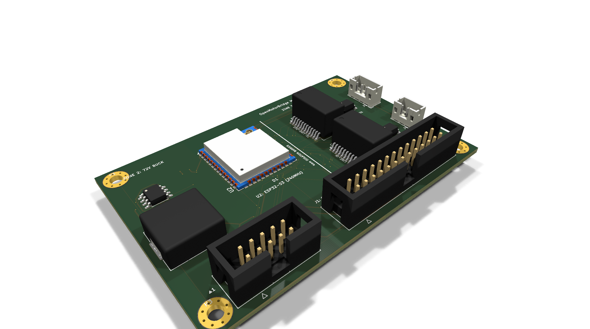
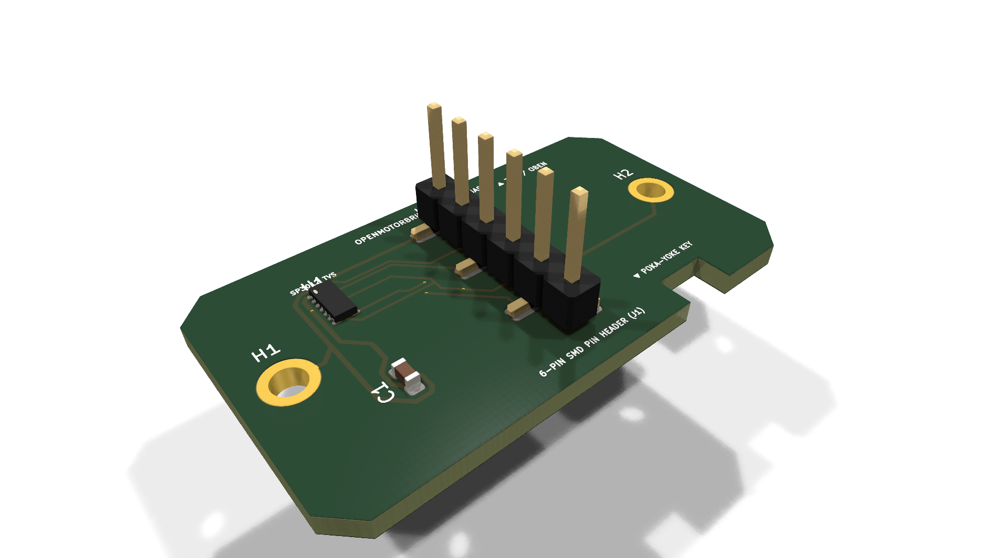
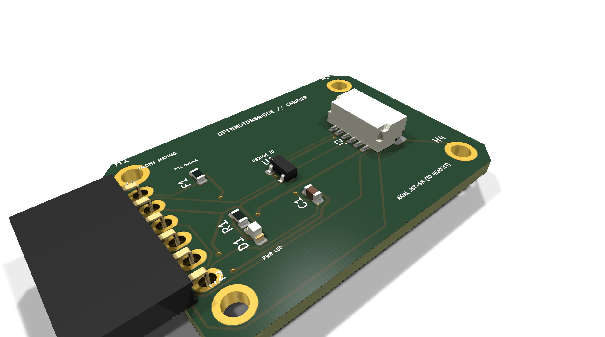
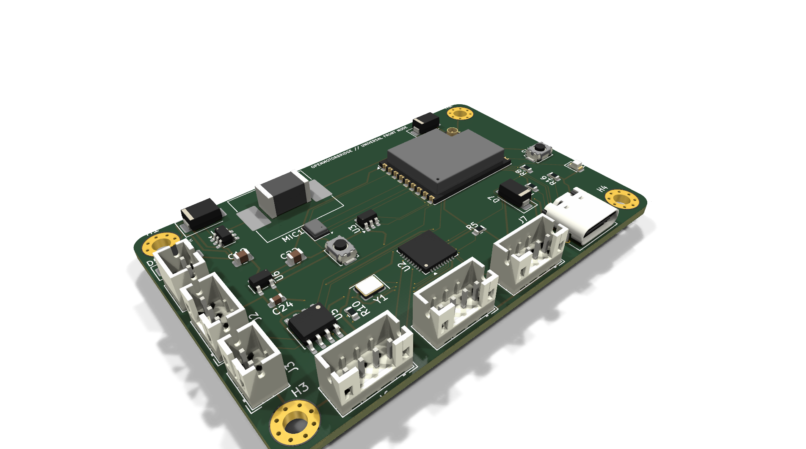

# 07 - Hardware Architecture & Board Pinouts (PCBA 01 to 05)

This document serves as the **authoritative hardware specification for all 5 printed circuit board assemblies (PCBA 01 through PCBA 05)** of the OpenMotorBridge v8.0 system, detailing layer stackups, controlled impedance classes, zoning concepts, and complete pinout tables.

---

## 1. Overview of the 5 Hardware Assemblies (PCBAs)

```
┌────────────────────────────────────────────────────────────────────────────────────────┐
│                   THE 5 HARDWARE ASSEMBLIES (PCBAs) OF OPENMOTORBRIDGE                 │
├───────┬───────────────────────────────┬───────────────┬─────────┬──────────────────────┤
│ Assy  │ Name & Function               │ Dimensions    │ Layers  │ Key ICs / Controller │
├───────┼───────────────────────────────┼───────────────┼─────────┼──────────────────────┤
│ **PCBA 01**│ **Central Box Main Controller**│ 85 x 55 mm    │ 4 Layer │ ESP32-S3, LM5164,    │
│       │ (Under-Seat, Audio / UPS / BT)│               │ (ENIG)  │ BQ24075, ES8388, IMU │
├───────┼───────────────────────────────┼───────────────┼─────────┼──────────────────────┤
│ **PCBA 02**│ **Satellite Pod Base Carrier** │ 52 x 32 mm    │ 2 Layer │ SP3012 TVS, M8 6-Pin,│
│       │ (Docking Base for Pod 1 & 2)  │               │         │ Cartridge Receptacle │
├───────┼───────────────────────────────┼───────────────┼─────────┼──────────────────────┤
│ **PCBA 03**│ **Universal Cartridge Carrier**│ 105 x 48 mm   │ 2 Layer │ DS2401 1-Wire ID,    │
│       │ (Sena, Cardo, PMR Inlay Sled) │               │         │ TLP222A PhotoMOS Opto│
├───────┼───────────────────────────────┼───────────────┼─────────┼──────────────────────┤
│ **PCBA 04**│ **Rear Pod 3 Transceiver Hub** │ 92 x 44 mm    │ 4 Layer │ RP2040 Coprocessor,  │
│       │ (Tail Pod: LoRa 868M & GNSS)  │               │ (ENIG)  │ SX1262 LoRa, NEO-M9N │
├───────┼───────────────────────────────┼───────────────┼─────────┼──────────────────────┤
│ **PCBA 05**│ **Universal Front Node**      │ 72 x 48 mm    │ 4 Layer │ ESP32-C3 RISC-V,     │
│       │ (Smart Fairing Hub & Ottocast)│               │ (ENIG)  │ USB2512B, TPS2051B   │
└───────┴───────────────────────────────┴───────────────┴─────────┴──────────────────────┘
```

---

## 2. JLCPCB 4-Layer Stackup & Controlled Impedances (JLC04161H-7628)

All 4-layer boards (PCBA 01, PCBA 04, and PCBA 05) utilize an identical controlled-impedance stackup:

```
┌─────────────────────────────────────────────────────────────┐
│ Layer 1 (F.Cu - Top): High-Speed Signals, USB Diff, SMDs    │  (35 µm Cu)
├─────────────────────────────────────────────────────────────┤
│ ── Prepreg 7628 (Dielectric, Er = 4.4, Thickness 0.2 mm) ── │
├─────────────────────────────────────────────────────────────┤
│ Layer 2 (In1.Cu): Solid Ground Plane (GND_PWR / AGND)       │  (35 µm Cu)
├─────────────────────────────────────────────────────────────┤
│ ── FR4 Core (Dielectric Core, Thickness 1.0 mm) ─────────── │
├─────────────────────────────────────────────────────────────┤
│ Layer 3 (In2.Cu): Power Planes (VCC_3V3, VCC_5V Polygons)   │  (35 µm Cu)
├─────────────────────────────────────────────────────────────┤
│ ── Prepreg 7628 (Dielectric, Er = 4.4, Thickness 0.2 mm) ── │
├─────────────────────────────────────────────────────────────┤
│ Layer 4 (B.Cu - Bottom): Secondary Routing & Sensors        │  (35 µm Cu)
└─────────────────────────────────────────────────────────────┘
```

### 2.1 Standardized Net Classes
* **`Default`:** Width $0{,}20\,\text{mm}$, Clearance $0{,}20\,\text{mm}$ (General I/O, logic).
* **`Power_5V_12V`:** Width $0{,}60\,\text{mm}$ (Up to $2{,}2\,\text{A}$ at $\Delta T < 10\,^\circ\text{C}$).
* **`RF_50R`:** Width $0{,}35\,\text{mm}$, Coplanar Gap $0{,}20\,\text{mm}$ to Ground ($50\,\Omega$ for 868 MHz LoRa & GNSS).
* **`USB_90R_DIFF`:** Width $0{,}20\,\text{mm}$, Differential Gap $0{,}15\,\text{mm}$ ($90\,\Omega \pm 10\,\%$ for USB 2.0 High-Speed 480 Mbps).
* **`Audio_Sensitive`:** Width $0{,}25\,\text{mm}$, Gap $0{,}30\,\text{mm}$ (Shielded by parallel ground guard traces).

---

## 3. PCBA 01: Central Box Main Controller (`openmotorbridge_central_box`)



*Figure 7.1: Precise KiCad 3D raytracing render of the Central Box main board (PCBA 01, 85 x 55 mm, 4 layers) with ESP32-S3 WROOM-1, LM5164-Q1 72V Buck, Bourns 1500V audio transformers, shrouded box headers, and gold ENIG pads.*

### 3.1 Pinout of Central 26-Pin Flange Connector (`J1` / HD26)

| Pin (HD26/J1) | Signal Name | Signal Type / Level | Function & Protection |
| :--- | :--- | :--- | :--- |
| **Pin 1** | `POD1_VCC` | $+5{,}0\,\text{V}$ switched (max. 300 mA) | Power Supply Pod 1 (High-Side Switch) |
| **Pin 2** | `POD1_NF_P` | Audio Line-Out ($1{,}0\,\text{V}_{\text{RMS}}$ diff.) | Galvanically isolated via Trafo `T1` (Pos) |
| **Pin 3** | `POD1_NF_N` | Audio Line-Out ($1{,}0\,\text{V}_{\text{RMS}}$ diff.) | Galvanically isolated via Trafo `T1` (Neg) |
| **Pin 4** | `POD1_OPTO_KEY` | Optocoupler PTT Keying | PhotoMOS `U7` Open-Collector / Switch |
| **Pin 5** | `POD2_VCC` | $+5{,}0\,\text{V}$ switched (max. 300 mA) | Power Supply Pod 2 (High-Side Switch) |
| **Pin 6** | `POD2_NF_P` | Audio Line-In ($1{,}0\,\text{V}_{\text{RMS}}$ diff.) | Galvanically isolated via Trafo `T2` (Pos) |
| **Pin 7** | `POD2_NF_N` | Audio Line-In ($1{,}0\,\text{V}_{\text{RMS}}$ diff.) | Galvanically isolated via Trafo `T2` (Neg) |
| **Pin 8** | `POD2_OPTO_KEY` | Optocoupler Mute / Keying | PhotoMOS `U8` Open-Collector / Switch |
| **Pin 9** | `POD3_VCC` | $+5{,}0\,\text{V}$ switched (max. 500 mA) | Power Supply Rear Transceiver Pod 3 |
| **Pin 10** | `POD3_UART_TX` | UART TX ($3{,}3\,\text{V}$, 115200 Baud) | Serial TX to Pod 3 (GNSS/Telemetry) |
| **Pin 11** | `POD3_UART_RX` | UART RX ($3{,}3\,\text{V}$, 115200 Baud) | Serial RX from Pod 3 (GNSS/Telemetry) |
| **Pin 12** | `GND_PWR` | Power Ground ($0\,\text{V}$) | Main Ground for Pod Power |
| **Pin 13** | `GND_PWR` | Power Ground ($0\,\text{V}$) | Parallel Ground Path |
| **Pin 14** | `KL30_IN` | $+9\,\text{V} \dots +72\,\text{V}$ DC (Constant+) | Battery Main Input (TVS Protected) |
| **Pin 15** | `KL15_IGN` | $+9\,\text{V} \dots +72\,\text{V}$ DC (Ignition+) | Ignition sense with Schmitt-Trigger |
| **Pin 16** | `GND_PWR` | Power Ground ($0\,\text{V}$) | Vehicle Chassis Ground |
| **Pin 17** | `CAN_H` | CAN High (ISO 11898-2) | CAN-FD Busline High ($120\,\Omega$ Termination) |
| **Pin 18** | `CAN_L` | CAN Low (ISO 11898-2) | CAN-FD Busline Low ($120\,\Omega$ Termination) |
| **Pin 19** | `ONEWIRE_ID` | 1-Wire Data Bus ($3{,}3\,\text{V}$) | Auto Pod Detection (DS2431 / DS2401) |
| **Pin 20** | `GND_SHIELD` | Enclosure & Shield Ground | Direct contact to Aluminum Shell |
| **Pin 21** | `AGND` | Analog Audio Ground | Quiet ground plane for ES8388 Codec |
| **Pin 22** | `RESERVE_GPIO_A`| Digital I/O ($3{,}3\,\text{V}$) | User-definable GPIO / PWM Output |
| **Pin 23** | `RESERVE_GPIO_B`| Digital I/O ($3{,}3\,\text{V}$) | User-definable GPIO / ADC Input |
| **Pin 24** | `I2S_DOUT` | I2S Data Out ($3{,}3\,\text{V}$) | Digital Audio Stream to external DSP |
| **Pin 25** | `I2S_BCLK` | I2S Bit Clock ($3{,}3\,\text{V}$) | Digital I2S Clock |
| **Pin 26** | `GND_SHIELD` | Enclosure & Shield Ground | Second shield contact for 360° bond |

---

## 4. PCBA 02: Satellite Pod Base Carrier (`openmotorbridge_pod_base`)



*Figure 7.2: KiCad 3D render of the Pod Base carrier board (PCBA 02, 52 x 32 mm, 2 layers) with 6-pin precision pin header, M8 6-pin IP67 socket interface, and SP3012 TVS protection array.*

Mounted securely in the socket of Pods 1 and 2:
* **Pin 1:** `+5V_VBUS` (Supplied from Main Controller, protected by 500mA PPTC)
* **Pin 2:** `NF_AUDIO_P` (Positive differential audio line)
* **Pin 3:** `NF_AUDIO_N` (Negative differential audio line)
* **Pin 4:** `OPTO_TRIGGER` (Optocoupler trigger line to intercom)
* **Pin 5:** `ONEWIRE_DATA` (1-Wire data line to DS2401 ROM-ID)
* **Pin 6:** `GND` (System Ground)

---

## 5. PCBA 03: Universal Cartridge Carrier (`openmotorbridge_pod_cartridge`)



*Figure 7.3: KiCad 3D render of the Universal Cartridge carrier (PCBA 03, 105 x 48 mm, 2 layers) with DS2401 1-Wire ID chip, horizontal mating socket, and headset JST-SH connector.*

The sled-mounted PCB providing headset adaptation:
* **DS2401 ID Chip:** Located on `B.Cu`, broadcasts 64-bit UID upon insertion.
* **Toshiba TLP222A:** Solid-state PhotoMOS relay for bounce-free PTT triggering.
* **JST-SH 6-Pin Header `J2`:** Connects to OEM headset pogo pins or audio socket.

---

## 6. PCBA 04: Rear Pod 3 Transceiver Hub (`openmotorbridge_rear_pod3`)


*Figure 7.4: KiCad 3D render of the Rear Pod 3 Transceiver PCB (PCBA 04, 110 x 52 mm, 4 layers) with RP2040 coprocessor, Semtech SX1262 LoRa, u-blox Multi-GNSS, and U.FL/Murata MM8030 RF switch ports.*

Integrated in the tail cowl:
* **RP2040 Dual-Cortex-M0+ Coprocessor:** 133 MHz, handles high-speed NMEA parsing (460.8k Baud) and OMM packet scheduling.
* **Semtech SX1262 LoRa Transceiver:** 868 MHz (+22 dBm PA) with $50\,\Omega$ coplanar waveguide.
* **u-blox NEO-M9N Multi-GNSS:** 10 Hz concurrent tracking with active 3.3V LNA bias-T.

---

## 7. PCBA 05: Universal Front Node (`openmotorbridge_front_node`)



*Figure 7.5: KiCad 3D render of the Universal Front Node (PCBA 05, 68 x 44 mm, 4 layers) with ESP32-C3 RISC-V, Microchip USB2512B High-Speed hub, TI TPS2051B power gate, and Knowles I2S MEMS microphone.*

The newly developed cockpit and fairing controller:
* **ESP32-C3-WROOM-02U:** 160 MHz RISC-V, external U.FL antenna, executes the < 1.8 ms ESP-NOW wireless bridge.
* **Microchip USB2512B:** USB 2.0 High-Speed 480 Mbps 2-port hub with $90\,\Omega$ differential pairs.
* **TI LMR36015 & TPS2051B:** 5.00V / 2.0A power stage with 1-click hard reboot and Auto-Café countdown.
* **Knowles SPH0645LM4H MEMS:** Digital I2S microphone for dynamic wind noise tracking.
* **Interfaces:** 2-Pin 12V supply (`J7`), USB-A Port 1 for CarPlay dongle (`J1`), USB-C Port 2 for glovebox/phone (`J2`), JST-GH for handlebar PTT (`J3`).
