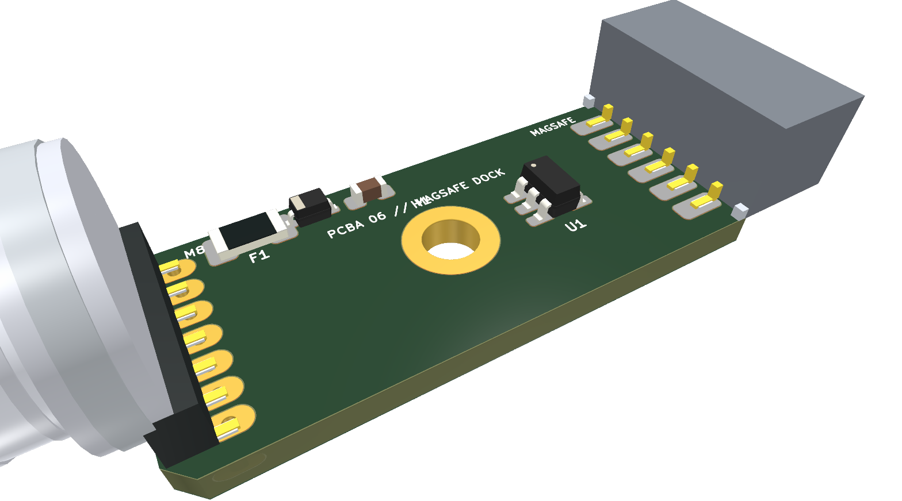

# 07 - Hardware Architecture & Board Pinouts (PCBA 01 to 06)

This document serves as the **authoritative hardware specification for all 6 printed circuit board assemblies (PCBA 01 through PCBA 06)** of the OpenMotorBridge v8.0 system, detailing layer stackups, controlled impedance classes, zoning concepts, and complete pinout tables.

---

## 1. Overview of the 6 Hardware Assemblies (PCBAs)

```
┌────────────────────────────────────────────────────────────────────────────────────────┐
│                   THE 6 HARDWARE ASSEMBLIES (PCBAs) OF OPENMOTORBRIDGE                 │
├───────┬───────────────────────────────┬───────────────┬─────────┬──────────────────────┤
│ Assy  │ Name & Function               │ PCB Outline   │ Layers  │ Key ICs / Components │
├───────┼───────────────────────────────┼───────────────┼─────────┼──────────────────────┤
│ **PCBA 01**│ **Central Box Main Controller**│ 85 x 55 mm    │ 4 Layer │ ESP32-S3, LM5164,    │
│       │ (Under-Seat, Audio / UPS / BT)│ (77x47 mm M3) │ (ENIG)  │ BQ24075, ES8388, IMU │
├───────┼───────────────────────────────┼───────────────┼─────────┼──────────────────────┤
│ **PCBA 02**│ **Satellite Pod Base Carrier** │ 36 x 20 mm    │ 2 Layer │ SP3012 TVS, M8 6-Pin,│
│       │ (Docking Base for Pod 1 & 2)  │ (30 mm M2)    │         │ Cartridge Receptacle │
├───────┼───────────────────────────────┼───────────────┼─────────┼──────────────────────┤
│ **PCBA 03**│ **Universal Cartridge Carrier**│ 35 x 25 mm    │ 2 Layer │ DS2401 1-Wire ID,    │
│       │ (Carrier PCB in 116x58 Sled)  │ (29x19 mm M2) │         │ TLP222A PhotoMOS Opto│
├───────┼───────────────────────────────┼───────────────┼─────────┼──────────────────────┤
│ **PCBA 04**│ **Rear Pod 3 Transceiver Hub** │ 55 x 48 mm    │ 4 Layer │ RP2040 Coprocessor,  │
│       │ (Tail Pod: LoRa 868M & GNSS)  │ (46x19 mm M2) │ (ENIG)  │ SX1262 LoRa, MAX-M10S│
├───────┼───────────────────────────────┼───────────────┼─────────┼──────────────────────┤
│ **PCBA 05**│ **Universal Front Node**      │ 82 x 50 mm    │ 4 Layers│ ESP32-S3 Xtensa,     │
│            │ (Cockpit & Sensor Hub)        │               │         │ USB2514B 4-Port Hub, │
│            │                               │               │         │ USB-PD 20W, Qi/BSD   │
├───────┼───────────────────────────────┼───────────────┼─────────┼──────────────────────┤
│ **PCBA 06**│ **MagSafe Frame Dock Adapter** │ 28 x 11.5 mm  │ 2 Layer │ 500mA PPTC Fuse, 5V  │
│       │ (Frame Dock: M8 to MagSafe)   │ (Central M2.5)│         │ TVS, USBLC6-4SC6 ESD │
└───────┴───────────────────────────────┴───────────────┴─────────┴──────────────────────┘
```

---

## 2. JLCPCB 4-Layer Stackup & Controlled Impedances (JLC04161H-7628)

All 4-layer boards (PCBA 01, PCBA 04, and PCBA 05) utilize an identical controlled-impedance stackup:

```
┌─────────────────────────────────────────────────────────────┐
│ Layer 1 (F.Cu - Top): High-Speed Signals, USB Diff, SMDs    │  (35 µm Cu)
├─────────────────────────────────────────────────────────────┤
│ ── Prepreg 7628 (Dielectric, Er = 4.4, Thickness 0.2 mm) ── │
├─────────────────────────────────────────────────────────────┤
│ Layer 2 (In1.Cu): Solid Ground Plane (GND_PWR / AGND)       │  (35 µm Cu)
├─────────────────────────────────────────────────────────────┤
│ ── FR4 Core (Dielectric Core, Thickness 1.0 mm) ─────────── │
├─────────────────────────────────────────────────────────────┤
│ Layer 3 (In2.Cu): Power Planes (VCC_3V3, VCC_5V Polygons)   │  (35 µm Cu)
├─────────────────────────────────────────────────────────────┤
│ ── Prepreg 7628 (Dielectric, Er = 4.4, Thickness 0.2 mm) ── │
├─────────────────────────────────────────────────────────────┤
│ Layer 4 (B.Cu - Bottom): Secondary Routing & Sensors        │  (35 µm Cu)
└─────────────────────────────────────────────────────────────┘
```

### 2.1 Standardized Net Classes
* **`Default`:** Width $0{,}20\,\text{mm}$, Clearance $0{,}20\,\text{mm}$ (General I/O, logic).
* **`Power_5V_12V`:** Width $0{,}60\,\text{mm}$ (Up to $2{,}2\,\text{A}$ at $\Delta T < 10\,^\circ\text{C}$).
* **`RF_50R`:** Width $0{,}35\,\text{mm}$, Coplanar Gap $0{,}20\,\text{mm}$ to Ground ($50\,\Omega$ for 868 MHz LoRa & GNSS).
* **`USB_90R_DIFF`:** Width $0{,}20\,\text{mm}$, Differential Gap $0{,}15\,\text{mm}$ ($90\,\Omega \pm 10\,\%$ for USB 2.0 High-Speed 480 Mbps).
* **`Audio_Sensitive`:** Width $0{,}25\,\text{mm}$, Gap $0{,}30\,\text{mm}$ (Shielded by parallel ground guard traces).

---

## 3. PCBA 01: Central Box Main Controller (`openmotorbridge_central_box`)


*Figure 7.1: Precise KiCad 3D raytracing render of the Central Box main board (PCBA 01, 85 x 55 mm, 4 layers) with ESP32-S3 WROOM-1, LM5164-Q1 72V Buck, Bourns 1500V audio transformers, shrouded box headers, and gold ENIG pads.*

### 3.1 Board Specifications & Stackup
* **Dimensions:** $85{,}0 \times 55{,}0\,\text{mm}$ (Outer contour with 4x M2.5 mounting holes, $77{,}0 \times 47{,}0\,\text{mm}$ grid spacing).
* **Layer Stackup:** 4 Layers FR-4 High-TG150 ($1{,}6\,\text{mm}$ thickness, $35\,\mu\text{m}$ Cu on all 4 layers).
  * Layer 1 (Top): Components, RF traces, and differential audio pairs.
  * Layer 2 (Inner 1): Continuous, unbroken ground plane (Solid GND).
  * Layer 3 (Inner 2): Split Power planes ($+3{,}3\,\text{V}$, $+5{,}0\,\text{V}$, `VBUS`, `VBAT_LIPO`) and quiet audio ground.
  * Layer 4 (Bottom): Secondary signal routing, shield copper, and thermal stitch vias.
* **Surface Finish:** ENIG (Electroless Nickel Immersion Gold, $0{,}05\dots 0{,}1\,\mu\text{m}$ Au over $3\dots 5\,\mu\text{m}$ Ni).
* **Galvanic Isolation Barrier:** $4{,}0\,\text{mm}$ clearance and creepage distance beneath Bourns transformers `T1` and `T2`.

### 3.2 Pinout of Central 26-Pin Flange Connector (`J1` / HD26)

| Pin (HD26/J1) | Signal Name | Signal Type / Level | Function & Protection |
| :--- | :--- | :--- | :--- |
| **Pin 1** | `POD1_VCC` | $+5{,}0\,\text{V}$ switched (max. 300 mA) | Power Supply Handlebar Pod 1 (High-Side Switch, 500mA PPTC) |
| **Pin 2** | `POD1_NF_P` | Audio Line-Out ($1{,}0\,\text{V}_{\text{RMS}}$ diff.) | Galvanically isolated via Trafo `T1` (Positive) |
| **Pin 3** | `POD1_NF_N` | Audio Line-Out ($1{,}0\,\text{V}_{\text{RMS}}$ diff.) | Galvanically isolated via Trafo `T1` (Negative) |
| **Pin 4** | `POD1_OPTO_KEY` | Optocoupler PTT Keying | PhotoMOS `U7` Open-Collector / Switch (< 1 ms bounce-free) |
| **Pin 5** | `POD2_VCC` | $+5{,}0\,\text{V}$ switched (max. 300 mA) | Power Supply Helmet Pod 2 (High-Side Switch, 500mA PPTC) |
| **Pin 6** | `POD2_NF_P` | Audio Line-In ($1{,}0\,\text{V}_{\text{RMS}}$ diff.) | Galvanically isolated via Trafo `T2` (Positive) |
| **Pin 7** | `POD2_NF_N` | Audio Line-In ($1{,}0\,\text{V}_{\text{RMS}}$ diff.) | Galvanically isolated via Trafo `T2` (Negative) |
| **Pin 8** | `POD2_OPTO_KEY` | Optocoupler Mute / Keying | PhotoMOS `U8` Open-Collector / Switch (< 1 ms bounce-free) |
| **Pin 9** | `POD3_VCC` | $+5{,}0\,\text{V}$ switched (max. 500 mA) | Power Supply Rear Transceiver Pod 3 |
| **Pin 10** | `POD3_UART_TX` | UART TX ($3{,}3\,\text{V}$, 460,800 Baud) | High-speed data link to Pod 3 (GNSS/Telemetry/LoRa) |
| **Pin 11** | `POD3_UART_RX` | UART RX ($3{,}3\,\text{V}$, 460,800 Baud) | High-speed data link from Pod 3 (GNSS/Telemetry/LoRa) |
| **Pin 12** | `GND_PWR` | Power Ground ($0\,\text{V}$) | Main ground return for Pod power supplies |
| **Pin 13** | `GND_PWR` | Power Ground ($0\,\text{V}$) | Parallel ground path for minimal loop resistance |
| **Pin 14** | `KL30_IN` | $+9\,\text{V} \dots +72\,\text{V}$ DC (Constant+) | Main battery input (LM5164 Buck, SMBJ33CA TVS protected) |
| **Pin 15** | `KL15_IGN` | $+9\,\text{V} \dots +72\,\text{V}$ DC (Ignition+) | Ignition sense line with voltage divider & Schmitt-trigger |
| **Pin 16** | `GND_PWR` | Power Ground ($0\,\text{V}$) | Vehicle chassis ground |
| **Pin 17** | `CAN_H` | CAN High (ISO 11898-2) | CAN-FD busline High ($120\,\Omega$ switchable termination) |
| **Pin 18** | `CAN_L` | CAN Low (ISO 11898-2) | CAN-FD busline Low ($120\,\Omega$ switchable termination) |
| **Pin 19** | `ONEWIRE_ID` | 1-Wire Data Bus ($3{,}3\,\text{V}$) | Automatic Pod & Cartridge detection (DS2431 / DS2401) |
| **Pin 20** | `GND_SHIELD` | Enclosure & Shield Ground | Direct contact to aluminum housing & braided harness shield |
| **Pin 21** | `AGND` | Analog Audio Ground | Clean, isolated ground plane for ES8388 Codec |
| **Pin 22** | `RESERVE_GPIO_A`| Digital I/O ($3{,}3\,\text{V}$) | User-configurable GPIO / PWM output (ESP32-S3) |
| **Pin 23** | `RESERVE_GPIO_B`| Digital I/O ($3{,}3\,\text{V}$) | User-configurable GPIO / ADC input (ESP32-S3) |
| **Pin 24** | `I2S_DOUT` | I2S Data Out ($3{,}3\,\text{V}$) | Digital audio stream to external DSP / amplifier |
| **Pin 25** | `I2S_BCLK` | I2S Bit Clock ($3{,}3\,\text{V}$) | Digital I2S serial bit clock |
| **Pin 26** | `GND_SHIELD` | Enclosure & Shield Ground | Second shield contact for $360^\circ$ circumferential bonding |

### 3.3 Internal Connectors & Service Interfaces

| Connector | Type / Package | Pins | Function & Signal Assignment |
| :--- | :--- | :---: | :--- |
| **`J2`** | MicroSD Push-Push | 9-Pin | 4-Bit SDIO High-Speed Bus (`CLK`, `CMD`, `DAT0`-`DAT3`, `CD`, `3V3`, `GND`) for forensic telemetry blackbox. |
| **`J3`** | IDC Shrouded Header ($2{,}54\,\text{mm}$) | 10-Pin | Service, flashing, and debug interface: Pin 1: `3V3`, Pin 2: `TXD0`, Pin 3: `RXD0`, Pin 4: `GND`, Pin 5: `USB_D-`, Pin 6: `USB_D+`, Pin 7: `EN`, Pin 8: `IO0`, Pin 9: `CAN_H`, Pin 10: `CAN_L`. |
| **`J_BAT`**| Molex Micro-Fit 3.0 | 2-Pin | UPS LiPo Backup Cell: Pin 1: `VBAT_LIPO` ($+3{,}7\dots 4{,}2\,\text{V}$), Pin 2: `GND` (monitored by BQ24075 TS NTC). |
| **`J_AUD`**| JST-XH ($2{,}50\,\text{mm}$) | 4-Pin | Optional internal audio test port: `LINE_L+`, `LINE_L-`, `LINE_R+`, `LINE_R-`. |

---

## 4. PCBA 02: Satellite Pod Base Carrier (`openmotorbridge_pod_base`)


*Figure 7.2: KiCad 3D render of the Pod Base carrier board (PCBA 02, 36 x 20 mm, 2 layers) with 6-pin precision pin header, M8 6-pin IP67 socket interface, and SP3012 TVS protection array.*

### 4.1 Board Specifications & Mechanical Fastening
* **Dimensions:** $36{,}0 \times 20{,}0\,\text{mm}$ (Rectangular PCB with 2x M2 mounting holes at $30{,}0\,\text{mm}$ spacing, seated inside the pod bulkhead chamber).
* **Layer Stackup:** 2 Layers FR-4 High-TG150 ($1{,}6\,\text{mm}$ thickness, $35\,\mu\text{m}$ copper).
  * Layer 1 (Top): Precision contact header `J1`, TVS array `U1`, decoupling capacitors.
  * Layer 2 (Bottom): Solid continuous GND plane for RF and transient suppression.
* **Surface Finish:** ENIG ($0{,}05\,\mu\text{m}$ gold plating for long-term corrosion resistance).

### 4.2 Pinout of Dual-Port Inputs (`J2` / Port A M8 & `J3` / Port B USB-C)

The pod base carrier board features two galvanically coupled input ports with automatic power multiplexing:
* **Port A (`J2`):** Rugged M8 circular receptacle (A-coded, 6-pin, IP67) for exposed outdoor mounting (e.g. rear radar Pod 3 or crash-bar clamps).
* **Port B (`J3`):** Ultra-flat 6-pin USB-C SMD receptacle for protected saddlebag interior mounting and tool-free chase/support vehicle deployment.

| Pin | Port A (`J2`, M8 6P) | Port B (`J3`, USB-C 6P) | Signal Type / Level | Function & Protection |
| :---: | :--- | :--- | :--- | :--- |
| **1** | `1_VCC_M8` | `A1/B12: GND` | Power Ground ($0\,\text{V}$) | Central low-impedance ground return |
| **2** | `2_GND` | `A4/B9: VCC_USBC` | $+5{,}0\,\text{V}$ DC (max. 500 mA) | Supply fed via LM66100 ideal-diode `U3` |
| **3** | `3_SIG_P` | `A6: SIG_P (D+)` | Audio Line Positive ($1{,}0\,\text{V}_{\text{RMS}}$ diff.) | Differential audio signal Positive (TVS Ch 2) |
| **4** | `4_SIG_N` | `A7: SIG_N (D-)` | Audio Line Negative ($1{,}0\,\text{V}_{\text{RMS}}$ diff.) | Differential audio signal Negative (TVS Ch 3) |
| **5** | `5_TRIGGER_PPS`| `A5: TRIGGER (CC1)` | Trigger / Timecode ($3{,}3\,\text{V}$ Logic) | Optocoupler PTT trigger or 1-PPS Timepulse (TVS Ch 4) |
| **6** | `6_1WIRE_ID` | `A8: 1WIRE_ID (SBU1)`| 1-Wire Data Bus ($3{,}3\,\text{V}$) | Auto-ID line for DS2401 cartridge recognition (TVS Ch 5) |
| **Collar**| `SHIELD` | `SH1/SH2: SHIELD` | Shield & Chassis Ground | $360^\circ$ circumferential contact to metal thread / shell |

### 4.3 Pinout of 6-Pin Precision Pin Header (`J1` / Cartridge Interface)

Vertical, gold-plated SMD pin header ($2{,}54\,\text{mm}$ pitch, $4{,}8\,\text{mm}$ wipe length, centered at $X=118\,\text{mm}$):

| Pin (J1) | Signal Name | Direction | Description |
| :---: | :--- | :---: | :--- |
| **Pin 1** | `1_VCC` | Output $\rightarrow$ Cartridge | $+5{,}0\,\text{V}$ DC power routed from active port via LM66100 power-mux |
| **Pin 2** | `2_GND` | Bidirectional | Ground reference for power and signals |
| **Pin 3** | `3_SIG_P` | Bidirectional | Differential audio signal Positive |
| **Pin 4** | `4_SIG_N` | Bidirectional | Differential audio signal Negative |
| **Pin 5** | `5_TRIGGER_PPS`| Bidirectional | Bounce-free PTT trigger line to headset |
| **Pin 6** | `6_1WIRE_ID` | Bidirectional | 1-Wire ROM-ID query line to DS2401 silicon chip |

* **ESD Protection Array:** Littelfuse `SP3012-06UTG` clamps all active signal lines against electrostatic discharges per IEC 61000-4-2 ($\pm 15\,\text{kV}$ air, $\pm 8\,\text{kV}$ contact) with $< 0{,}5\,\text{pF}$ parasitic capacitance.

### 4.4 Automatic Power-Mux & Modular Harness Architecture

1. **Hardware Arbitration (`U2`, `U3` / TI LM66100):**
   * Dual SC-70-6 ideal-diode ICs provide near-zero-latency automatic power selection with ultra-low on-resistance ($R_{\text{ON}} \approx 79\,\text{m}\Omega$, minimal millivolt drop).
   * Cross-conduction and reverse-current feeding between Port A and Port B are physically prevented.
2. **Modular Cable Harness Configurations:**
   * **Type A (Outdoor Motorcycle):** HD26 $\rightarrow$ 3x rugged M8 A-coded lines to the pod base screw receptacles.
   * **Type B (Saddlebag with MagSafe):** HD26 $\rightarrow$ M8 line to frame dock under the seat $\rightarrow$ 6-pin IP67 MagSafe breakaway coupling $\rightarrow$ slim cable entering saddlebag via 19 mm hole directly into Port B.
   * **Type C (Support Vehicle / Cabin / Lab):** HD26 $\rightarrow$ USB-C slim harness for tool-free, clean dashboard installation powered via standard automotive USB chargers.

---

## 5. PCBA 03: Universal Cartridge Carrier (`openmotorbridge_pod_cartridge`)


*Figure 7.3: KiCad 3D render of the Universal Cartridge carrier (PCBA 03, 35 x 25 mm, 2 layers) with DS2401 1-Wire ID chip, horizontal mating socket, and headset JST-SH connector.*

### 5.1 Board Specifications & Features
* **Dimensions:** $35{,}0 \times 25{,}0\,\text{mm}$ (compact carrier PCB with 4x M2 mounting holes in $29{,}0 \times 19{,}0\,\text{mm}$ grid, housed inside the $116 \times 58\,\text{mm}$ base sled with $105 \times 48\,\text{mm}$ contour bed).
* **Layer Stackup:** 2 Layers FR-4 High-TG150 ($1{,}6\,\text{mm}$ thickness, $35\,\mu\text{m}$ copper).
* **On-Board Components:** DS2401 1-Wire ID (`U1`), Toshiba TLP222A PhotoMOS relay (`U2`), PPTC 500mA fuse (`F1`), Green power LED (`D1`).

### 5.2 Pinout of Horizontal Docking Socket (`J1` / Pod Base Mating)

| Pin (J1) | Signal Name | Signal Type | Function & Protection |
| :---: | :--- | :--- | :--- |
| **Pin 1** | `1_VCC` | $+5{,}0\,\text{V}$ Input | Supply voltage from Pod Base via resettable PPTC fuse `F1` (500mA) |
| **Pin 2** | `2_GND` | Power Ground | System ground connection to Pod socket |
| **Pin 3** | `3_NF_P` | Audio Line In/Out | Differential audio Positive to isolation transformer |
| **Pin 4** | `4_NF_N` | Audio Line In/Out | Differential audio Negative to isolation transformer |
| **Pin 5** | `5_OPTO` | PTT Trigger Line | Controls Toshiba TLP222A PhotoMOS solid-state relay |
| **Pin 6** | `6_1WIRE` | 1-Wire Data Bus | Transmits unique 64-bit UID from `U1` (DS2401) |

### 5.3 Pinout of Internal 6-Pin JST-SH Header (`J2` / Headset Cradle Link)

The $1{,}0\,\text{mm}$ right-angle JST-SH connector links the cartridge board to the pogo-pin array or headset harness:

| Pin (J2) | Signal Name | Direction | Function by OEM Headset Class |
| :---: | :--- | :---: | :--- |
| **Pin 1** | `VCC_5V` | Output $\rightarrow$ Cradle | 5V charging power (Sena 50S Pogo 2, Cardo Edge Pad 2, USB 5V) |
| **Pin 2** | `GND` | Ground | Ground return (Sena 50S Pogo 1, Cardo Edge Pad 1, USB GND) |
| **Pin 3** | `AUDIO_R+` | Output $\rightarrow$ Headset | Speaker / Line-In Signal Positive (Sena Pogo 4, Cardo Pad 3) |
| **Pin 4** | `AUDIO_R-` | Output $\rightarrow$ Headset | Speaker / Line-In Signal Negative (Sena Pogo 5, Cardo Pad 4) |
| **Pin 5** | `MIC_IN+` | Input $\leftarrow$ Headset | Headset microphone signal to codec (Sena Pogo 6, Cardo Pad 5) |
| **Pin 6** | `OPTO_PTT` | Switch Output | TLP222A contact closing to GND (Sena Mesh button Pogo 7) |

### 5.4 Active Semiconductors & Circuit Identification
* **1-Wire Silicon Serial Number (`U1`):** Maxim/Analog Devices `DS2401Z+` in SOT-23 package. Broadcasts a factory-lasered 64-bit UID (`Family Code 0x01 + 48-Bit Serial + 8-Bit CRC`) for zero-touch configuration.
* **Solid-State PhotoMOS Relay (`U2`):** Toshiba `TLP222A` (Switching time $t_{\text{ON}} < 0{,}5\,\text{ms}$, galvanic isolation $1500\,\text{V}_{\text{RMS}}$, completely bounce-free).
* **Resettable PPTC Fuse (`F1`):** Bourns `MF-MSMF050-2` (1812 SMD, $I_{\text{hold}} = 500\,\text{mA}$, $I_{\text{trip}} = 1{,}0\,\text{A}$).

---

## 6. PCBA 04: Rear Pod 3 Transceiver Hub (`openmotorbridge_rear_pod3`)


*Figure 7.4: KiCad 3D render of the Rear Pod 3 Transceiver PCB (PCBA 04, 55 x 48 mm, 4 layers) with RP2040 coprocessor, Semtech SX1262 LoRa, u-blox Multi-GNSS, and U.FL/Murata MM8030 RF switch ports.*

### 6.1 Board Specifications & RF Layout
* **Dimensions:** $55{,}0 \times 48{,}0\,\text{mm}$ (4 Layers FR-4 High-TG150, 4x M2 mounting holes in $46{,}0 \times 19{,}0\,\text{mm}$ grid, housed inside aerodynamic tail cowl with dielectric RF radome).
* **Layer Stackup:** 4 Layers FR-4 High-TG150 ($1{,}6\,\text{mm}$, $35\,\mu\text{m}$ Cu) with controlled $50\,\Omega$ coplanar waveguides.
  * Layer 1 (Top): RF transceivers, GNSS module, Murata MM8030 switches, $50\,\Omega$ coplanar RF traces.
  * Layer 2 (Inner 1): Continuous, unslotted RF ground reference plane.
  * Layer 3 (Inner 2): Split Power planes ($+3{,}3\,\text{V}_{\text{RF}}$, $+3{,}3\,\text{V}_{\text{DIG}}$, $+5{,}0\,\text{V}$).
  * Layer 4 (Bottom): RP2040 coprocessor, SPI Flash, passives, and secondary logic traces.

### 6.2 Pinout of 6-Pin Interface to Central Box (`J1`)

| Pin (J1) | Signal Name | Signal Type / Level | Function & Description |
| :--- | :--- | :--- | :--- |
| **Pin 1** | `1_VCC_5V` | $+5{,}0\,\text{V}$ DC switched (max. 500 mA) | Main power supply from Central Box |
| **Pin 2** | `2_GND` | Power & RF Ground ($0\,\text{V}$) | Common reference ground for logic and RF |
| **Pin 3** | `3_UART_TX` | UART TX ($3{,}3\,\text{V}$, 460,800 Baud) | High-speed telemetry and NMEA stream to Central Box |
| **Pin 4** | `4_UART_RX` | UART RX ($3{,}3\,\text{V}$, 460,800 Baud) | Command packets and LoRa payloads from Central Box |
| **Pin 5** | `5_1PPS` | Digital Pulse ($3{,}3\,\text{V}$, active-high) | Sub-microsecond timepulse from NEO-M9N GNSS |
| **Pin 6** | `6_1WIRE_ID` | 1-Wire Data Bus ($3{,}3\,\text{V}$) | Pod hardware identification via on-board DS2401 |

### 6.3 Coaxial RF Switch Ports (`Murata MM8030-2610`)

The board features 3 automatic coaxial switch connectors (`Murata MM8030-2610`) that seamlessly switch to external antennas upon insertion ($< 0{,}15\,\text{dB}$ insertion loss, $> 25\,\text{dB}$ isolation up to 6 GHz):

| RF Port | Frequency Band | Internal Default Antenna | External Bypass Path (MM8030) |
| :--- | :--- | :--- | :--- |
| **`J3`** | $2{,}4\,\text{GHz}$ ISM | Internal Inverted-F PCB Antenna (IFA, $0\,\text{dBi}$) | External $+5\,\text{dBi}$ whip or sharkfin antenna |
| **`J4`** | $868\,\text{MHz}$ LoRa | Internal helical coil antenna ($+1{,}5\,\text{dBi}$) | External $\lambda/4$ monopole antenna for maximum range |
| **`J5`** | $1{,}575\,\text{GHz}$ GNSS | Internal $25 \times 25\,\text{mm}$ ceramic patch antenna | External active patch antenna with $+3{,}3\,\text{V}$ phantom power |

### 6.4 RP2040 Dual-Cortex-M0+ Coprocessor Pin Mapping

| RP2040 Pin | Net Name | Function & Peripheral Assignment |
| :--- | :--- | :--- |
| **GPIO 0 / 1** | `UART0_TX` / `RX` | High-Speed UART link to Central Box (460,800 Baud, DMA-buffered) |
| **GPIO 4 / 5** | `UART1_TX` / `RX` | High-Speed UBX/NMEA binary link to u-blox NEO-M9N GNSS module |
| **GPIO 6** | `TIMEPULSE_1PPS` | Hardware capture timer input for frame-accurate action cam synchronization |
| **GPIO 8** | `SPI0_SCK` | SPI Serial Clock to Semtech SX1262 LoRa transceiver |
| **GPIO 9** | `SPI0_MISO` | SPI Master-In Slave-Out from SX1262 |
| **GPIO 10** | `SPI0_MOSI` | SPI Master-Out Slave-In to SX1262 |
| **GPIO 11** | `SPI0_NSS` | SPI Chip Select (Active-Low) to SX1262 |
| **GPIO 2** | `LORA_BUSY` | SX1262 State Flag (hardware hold condition for SPI commands) |
| **GPIO 3** | `LORA_DIO1` | SX1262 IRQ (Packet Received / Packet Sent Interrupt) |
| **GPIO 16** | `WS2812B_LED` | Serial data stream to RGB status indicator LED |

---

## 7. PCBA 05: Universal Front Node (`openmotorbridge_front_node`)


*Figure 7.5: KiCad 3D render of the Universal Front Node (PCBA 05, 82 x 50 mm, 4 layers) with ESP32-S3-WROOM-1U (U.FL), Microchip USB2514B 4-Port hub, Southchip SC8102 USB-PD 20W Fast-Charge, TI TPS2051B power gate, Knowles I2S MEMS microphone, CPC1017N CAN auto-sensing relay, dual-MOSFET mirror BSD drivers, and WS2812B RGB status LED.*

### 7.1 Board Specifications & Features
* **Dimensions:** $82{,}0 \times 50{,}0\,\text{mm}$ (Fits $86 \times 56 \times 24\,\text{mm}$ internal cavity, $98 \times 68 \times 25\,\text{mm}$ outer enclosure with 4-in-1 mounting).
* **Layer Stackup:** 4 Layers FR-4 High-TG150 ($1{,}6\,\text{mm}$, $35\,\mu\text{m}$ copper).
  * Layer 1 (Top): ESP32-S3 controller, USB2514B hub, Knowles MEMS, WS2812B RGB, $90\,\Omega$ USB differential pairs.
  * Layer 2 (Inner 1): Continuous low-impedance ground plane (Solid GND).
  * Layer 3 (Inner 2): Split Power planes ($+5{,}0\,\text{V}_{\text{MAIN}}$, $+5{,}0\,\text{V}_{\text{DONGLE}}$, $+5{,}0\,\text{V}_{\text{CAM}}$, $+9\dots 12\,\text{V}_{\text{PD}}$, $+12\,\text{V}_{\text{SW}}$, $+3{,}3\,\text{V}$).
  * Layer 4 (Bottom): LMR36015 / TPS54302 buck, SC8102 USB-PD controller, TPS2051B load switch, CPC1017N relay, DMN63D8 dual-MOSFET, TVS diodes, and filters.
* **KL15 Buffer Capacitor (`C_BUF`):** $470\dots 1000\,\mu\text{F}$ 10V low-ESR polymer SMD (7343 / D-case) buffers the ESP32-S3 for $1\dots 2\,\text{s}$ upon ignition shutoff, ensuring clean transmission of the BLE shutter-stop command to action cameras.
* **RF Antenna Concept:** ESP32-S3-WROOM-1U with U.FL antenna jack; 2.4 GHz FPC dipole antenna mounted at the rear housing flank pointing along the frame tunnel toward the Central Box under the seat for maximal range and total decoupling from fairing electronics.

### 7.2 Vehicle & Sensor Interfaces (JST-PH Headers)

| Connector | Type | Pins | Signal Assignment & Function |
| :--- | :--- | :---: | :--- |
| **`J1`** | JST-PH / 2-Pin Terminal | 2-Pin | **12V Vehicle Input:** Pin 1: `KL15_12V_SW` ($+9\dots 36\,\text{V}$ DC Ignition+), Pin 2: `GND` (Vehicle chassis ground). Powered via LMR36015 buck converter. |
| **`J2`** | JST-PH ($2{,}00\,\text{mm}$) | 3-Pin | **Cockpit CAN Bus:** Pin 1: `CAN_H`, Pin 2: `CAN_L`, Pin 3: `GND`. Equipped with **electronic auto-sensing $120\,\Omega$ solid-state relay (`CPC1017N`)** (probes bus impedance at boot; enables termination only if $R_{\text{Bus}} > 100\,\Omega$) and hardware Listen-Only Mode pin (`S`). |
| **`J3`** | JST-PH ($2{,}00\,\text{mm}$) | 4-Pin | **Handlebar Multi-Button Interface:** Pin 1: `GND`, Pin 2: `PTT_INTERCOM` (Intercom transmit button), Pin 3: `CAM_ACTION` (Action-Cam bookmark/highlight), Pin 4: `MEDIA_VOICE` (Track Next / Siri / Google Assistant). All lines filtered with Schmitt-trigger, pull-ups, and 3.3V Zener/TVS overvoltage clamps against 12V shorts. (Standard 2-pin PTT switches fit directly onto Pins 1+2). |
| **`J9`** | JST-PH ($2{,}00\,\text{mm}$) | 3-Pin | **Blind-Spot Mirror LEDs (Radar BSD):** Pin 1: `+12V_PROT`, Pin 2: `BSD_LEFT_N` (switched via N-MOSFET Ch A), Pin 3: `BSD_RIGHT_N` (switched via N-MOSFET Ch B). Drives stealth amber/red LEDs on mirror stems (left/right independent; steady illumination on blind-spot approach, 8 Hz flashing on acute collision hazard). |
| **`J10`** | JST-PH ($2{,}00\,\text{mm}$) | 2-Pin | **12V Qi Smartphone Power:** Pin 1: `+12V_SW` (continuous switched power via ignition gate, up to $2{,}0\,\text{A}$ / $24\,\text{W}$), Pin 2: `GND`. Powers SP Connect / QuadLock Qi wireless charging heads on the handlebar with 0.0 µA quiescent drain at key-off. |
| **`J11`** | JST-PH ($2{,}00\,\text{mm}$) | 2-Pin | **Auxiliary Light / Fog (Adventure):** Pin 1: `+12V_AUX` (switched via smart high-side switch `TPS1H100`, up to $3{,}5\,\text{A}$ / $40\,\text{W}$), Pin 2: `GND`. Controls auxiliary fog/driving lights or automatic 4–5 Hz strobe flashing under panic braking. Left unpopulated/unused on Cruisers/Tourers. |
| **`J12`** | JST-SH ($1{,}00\,\text{mm}$) | 4-Pin | **I2C Sensor Expansion Port (Qwiic / STEMMA QT):** Pin 1: `GND`, Pin 2: `+3V3`, Pin 3: `I2C_SDA`, Pin 4: `I2C_SCL` with $4{,}7\,\text{k}\Omega$ pull-ups. Allows plug-and-play addition of ambient light sensors (`OPT3001` for automatic tunnel day/night display switching) or barometric altimeters. |

### 7.3 Automotive USB 2.0 Subsystem & Hub Architecture (`Microchip USB2514B`)

The Front Node integrates an automotive-grade 4-port High-Speed hub (`USB2514B`), completely eliminating port starvation:

| Port | Connector Type | Function & Performance Specifications |
| :--- | :--- | :--- |
| **`J4`** | JST-PH (4-Pin) | **Upstream Host Port:** Carries `USB_UP_VBUS` ($+5{,}0\,\text{V}$), `USB_UP_DM`, `USB_UP_DP`, `GND` linking the hub to the motorcycle infotainment (Harley Skyline OS / Boom! Box GTS USB input). |
| **`J5`** | JST-PH (4-Pin) | **Downstream Port 1 (Smartphone on Handlebar):** High-speed USB data line paired with **Automotive USB Power Delivery (USB-PD 20W, 9V/2.2A & QC 3.0)** via the `Southchip SC8102` fast-charge buck controller. Fast-charges smartphones even while navigating in full summer sunlight. |
| **`J6`** | JST-PH (4-Pin) | **Downstream Port 2 (Fairing Pigtail to CP2AA Dongle):** Switched $+5{,}0\,\text{V}$ VBUS via `TI TPS2051B` load switch with **1-Click Cold Restart** (2.5s power cut) and Auto-Café timer. Feeds via a shielded $25\dots 30\,\text{cm}$ cable to a commercial wireless adapter (Carlinkit / Ottocast) secured with **3M Dual-Lock** in the fairing cavity (guarantees $> 30\,\text{dB}$ RF isolation to the ESP32-S3 and zero-tool maintenance). |
| **`J5_MP3`**| JST-PH (4-Pin) | **Downstream Port 3 (Glovebox / Jukebox):** Runs as a dedicated USB lead into the bike's glovebox. Stays **100% free for local USB flash drives playing MP3/FLAC music** and official **dealer infotainment firmware updates**. |
| **`J6_AUX`**| JST-PH (4-Pin) | **Downstream Port 4 (Cockpit Accessories):** High-speed data port for dashcam storage, external Zūmo GPS, or Chigee/Carpuride displays. |
| **`J7`** | USB-C 16-Pin Receptacle | **Service & Flashing Port (right edge):** Native ESP32-S3 USB-JTAG / CDC-Serial interface for firmware upgrades and calibration (protected by TPU plug). |
| **`J8`** | JST-PH (2-Pin / 4-Pin) | **Action Cam Power Port (Charge-Only):** Dedicated $+5{,}0\,\text{V}$ DC power (up to $2{,}0\,\text{A}$) for GoPro / Insta360 / DJI — purposely without USB data to prevent headunit mass-storage lockouts. |

### 7.4 ESP32-S3 Controller Pin Mapping

| ESP32-S3 Pin | Signal Name | Direction | Function & Peripheral Assignment |
| :--- | :--- | :---: | :--- |
| **GPIO 0** | `BOOT_BTN_N` | Input | Boot mode button (Active-Low) |
| **GPIO 1** | `OTTOCAST_PWR_EN` | Output | Enable control signal for TPS2051B VBUS load switch (High = Active) |
| **GPIO 2** | `OTTOCAST_FAULT_N`| Input | Overcurrent & thermal fault flag from TPS2051B (Active-Low interrupt) |
| **GPIO 3** | `CAN_TERM_EN` | Output | Controls CPC1017N solid-state relay for 120-Ohm CAN termination (Auto-Sensing) |
| **GPIO 4** | `KL15_SENSE` | Input | Vehicle ignition monitoring via 10:1 voltage divider & Schmitt-trigger |
| **GPIO 5** | `CAN_SILENT` | Output | Drives Pin 8 (S) of CAN transceiver for hardware Listen-Only Mode |
| **GPIO 6** | `MIC_I2S_WS` | Output | I2S Word Select (LRCLK, 48 kHz) for Knowles SPH0645LM4H digital microphone |
| **GPIO 7** | `MIC_I2S_BCLK` | Output | I2S Bit Clock ($3{,}072\,\text{MHz}$) for Knowles SPH0645LM4H digital microphone |
| **GPIO 8** | `MIC_I2S_DATA` | Input | I2S Serial Audio Data from Knowles MEMS microphone (wind noise tracking) |
| **GPIO 9** | `I2C_SDA` | Bidir | I2C data line for Qwiic sensor port J12 (OPT3001 light sensor) |
| **GPIO 10** | `I2C_SCL` | Output | I2C clock line for Qwiic sensor port J12 |
| **GPIO 11** | `WS2812B_DIN` | Output | Data signal for onboard WS2812B-2020 RGB status LED (light pipe in lid) |
| **GPIO 12** | `BSD_LED_LEFT` | Output | Gate control for left blind-spot mirror LED MOSFET (J9) |
| **GPIO 13** | `BSD_LED_RIGHT` | Output | Gate control for right blind-spot mirror LED MOSFET (J9) |
| **GPIO 14** | `AUX_LIGHT_EN` | Output | Enable control for TPS1H100 high-side switch (J11 aux driving light / strobe) |
| **GPIO 15** | `PTT_IN1_N` | Input | Handlebar switch 1: PTT Intercom transmit (Active-Low, Schmitt-trigger) |
| **GPIO 16** | `PTT_IN2_N` | Input | Handlebar switch 2: Action-Cam bookmark / highlight (Active-Low) |
| **GPIO 17** | `PTT_IN3_N` | Input | Handlebar switch 3: Media Next / Siri / Voice Assist (Active-Low) |
| **GPIO 18** | `USB_SERV_DM` | Bidir | Native USB D- for JTAG / CDC flashing port (J7) |
| **GPIO 19** | `USB_SERV_DP` | Bidir | Native USB D+ for JTAG / CDC flashing port (J7) |
| **GPIO 20** | `TWAI_RX` | Input | CAN Bus receive line from TI TCAN334G transceiver |
| **GPIO 21** | `TWAI_TX` | Output | CAN Bus transmit line to TI TCAN334G transceiver |

### 7.5 Status & Diagnostic LED (WS2812B with Light Pipe)

Viewable through a flush polycarbonate light-pipe lens integrated into the top enclosure lid:
* **Green breathing (1 Hz):** Normal operation, 12V stable, CAN bus active, ESP-NOW synchronized to Central Box.
* **Blue blinking:** Bluetooth LE discovery/pairing active (Action-Cam search or PWA connection).
* **Yellow steady:** CP2AA CarPlay/Android Auto dongle currently booting on Port 2.
* **Red blinking (4 Hz):** USB overcurrent or cold restart in progress (dongle hard-reboot).
* **White flash:** Handlebar button clicked (tactile confirmation).

---

---

## 8. PCBA 06: MagSafe Frame Dock Adapter (`openmotorbridge_magsafe_dock`)



*Figure 7.6: KiCad 3D raytracing render of the MagSafe Frame Dock adapter board (PCBA 06, 28 x 11.5 mm, 2 layers) with 1206 PPTC self-resetting fuse (F1, 500 mA), SOD-323 TVS diode (D1), SOT-23-6 4-channel ESD protection array (U1, USBLC6-4SC6), 100nF decoupling capacitor (C1), horizontal M8 wire-to-board solder pad strip (J1), 6-pin MagSafe contact pad strip (J2), and central M2.5 mounting hole (H1).*

### 8.1 Purpose & Protection Architecture for Saddlebag Detachment
When the saddlebag is removed from the motorcycle (e.g. for cleaning, service, or hotel check-in), the bike-side MagSafe coupling sits exposed under the seat overhang. PCBA 06 isolates and protects the Central Box and vehicle electrical system against:
1. **Short Circuits on Exposed Pogo Pins:** Rainwater, road spray, loose keys, or metal tools trip the self-resetting **1206 PPTC polyfuse `F1`** ($I_{\text{hold}} = 500\,\text{mA}$, $I_{\text{trip}} = 1000\,\text{mA}$, $V_{\text{max}} = 16\,\text{V}$). As soon as the conductive object is removed or the contacts dry, power is automatically restored with zero fuse replacements.
2. **Inductive Switching Transients:** The **unidirectional 5V TVS diode `D1`** (SOD-323) clamps voltage spikes on the $+5\,\text{V}$ line to $< 7.0\,\text{V}$.
3. **Electrostatic Discharge (ESD):** The **4-channel ultra-low-capacitance TVS array `U1`** (USBLC6-4SC6 in SOT-23-6, $C_{\text{io}} < 0.8\,\text{pF}$) protects the differential audio lines (`SIG_P`, `SIG_N`), the optocoupler boot trigger (`TRIGGER_PPS`), and the 1-Wire ID bus (`1WIRE_ID`) to **IEC 61000-4-2 Level 4** ($\pm 15\,\text{kV}$ air discharge, $\pm 8\,\text{kV}$ contact discharge).

### 8.2 Technical PCB Specifications
* **Dimensions:** $28.0 \times 11.5 \times 1.6\,\text{mm}$ (FR-4 2 layers, $35\,\mu\text{m}$ Cu, ENIG gold finish).
* **Central M2.5 Mounting Hole:** Centered mounting hole $\varnothing 2.7\,\text{mm}$ (hole center at $X = 114.0\,\text{mm}, Y = 75.75\,\text{mm}$) with double-sided $\varnothing 4.5\,\text{mm}$ GND ring pad and keepout zone. The PCB is rigidly and torsion-free clamped between the upper and lower dock half-shells by a single central DIN 912 M2.5 screw boss.
* **Layout & Routing State:** All component footprints, 3D models (M8 horizontal receptacle, MagSafe dock connector, SMD components), net associations, and DRC clearance rules are fully defined and set up in the KiCad project, ready for manual interactive routing in the KiCad GUI.
* **Layer Stackup:**
  * **Top (F.Cu):** Component placement (F1, D1, U1, C1, J1, J2), signal and power traces.
  * **Bottom (B.Cu):** Continuous low-impedance ground plane (GND) with thermal relief and ground stitching vias.
* **DFM/DRC:** 100% compliant with JLCPCB standard 2-layer manufacturing rules.

### 8.3 Pinout & Interface Mapping

| Pin | Signal Name | Polarity / Type | Function & Protection Path |
| :---: | :--- | :--- | :--- |
| **`J1.1`** | `VCC_IN` | $+5.0\,\text{V}$ DC In | Raw power input from Central Box M8 harness (fed by LM5164 / BQ24075 UPS) |
| **`J1.2`** | `GND` | Power / Signal GND | Central ground reference, tied to solid B.Cu ground plane via thermal vias |
| **`J1.3`** | `SIG_P` | Audio Diff + / D+ | Differential Audio Positive (filtered via U1 Ch 1, protected up to $\pm 15\,\text{kV}$) |
| **`J1.4`** | `SIG_N` | Audio Diff - / D- | Differential Audio Negative (filtered via U1 Ch 2, protected up to $\pm 15\,\text{kV}$) |
| **`J1.5`** | `TRIGGER_PPS`| 3.3V Opto-Trigger | Boot/wake pulse from Central Box TLP222A PhotoMOS (filtered via U1 Ch 3) |
| **`J1.6`** | `1WIRE_ID` | Digital 1-Wire Bus| Cartridge identification bus for DS2401 Silicon Serial ROM (filtered via U1 Ch 4) |
| **`J1.7`** | `GND_SHIELD`| Cable Shield | M8 cable foil/braid shield, grounded directly to system ground on PCB |
| **`J2.1`** | `VCC_PROT` | $+5.0\,\text{V}$ DC Out | Protected MagSafe output: Post-PPTC fuse `F1`, TVS `D1`, and 100nF cap `C1` |
| **`J2.2`** | `GND` | Power / Signal GND | MagSafe ground contact (grounded via heavy B.Cu copper plane) |
| **`J2.3`** | `SIG_P` | Audio Diff + | MagSafe Pogo Pin 3: Differential audio output to saddlebag pod |
| **`J2.4`** | `SIG_N` | Audio Diff - | MagSafe Pogo Pin 4: Differential audio output to saddlebag pod |
| **`J2.5`** | `TRIGGER_PPS`| 3.3V Opto-Trigger | MagSafe Pogo Pin 5: Power-on and boot trigger to saddlebag pod cartridge |
| **`J2.6`** | `1WIRE_ID` | Digital 1-Wire Bus| MagSafe Pogo Pin 6: 1-Wire bus for detecting inserted OEM headset cartridge |

### 8.4 Bill of Materials (BOM) PCBA 06
| Ref | Component / Type | Package | Specification & Function | LCSC Part |
| :--- | :--- | :--- | :--- | :--- |
| **`F1`** | 0ZCG0050FF2C | SMD 1206 | 500 mA Hold / 1000 mA Trip, 16V PPTC Resettable Polyfuse | `C207936` |
| **`D1`** | ESD5Z5.0T1G | SOD-323 | 5.0V Unidirectional TVS Diode (VCC Transient Clamp) | `C2834585` |
| **`U1`** | USBLC6-4SC6 | SOT-23-6 | 4-Channel Low-Cap ($<0.8\,\text{pF}$, $\pm 15\,\text{kV}$) ESD Protection Array | `C7519` |
| **`C1`** | 100nF 50V X7R | SMD 0603 | Ceramic decoupling capacitor on VCC_PROT | `C14663` |
| **`J1`** | M8 Wire Pads | SMD/THT 1x07 | 7-pin wire-to-board solder pad array with 0.6mm through-holes for M8 leads | Custom |
| **`J2`** | MagSafe 6P Pads | SMD 1x06 | 6-pin gold-plated contact pads for MagSafe magnetic pogo coupling | `C224376` |
| **`H1`** | MountingHole_Pad | M2.5 (Ø 2.7 mm) | Hole Ø 2.7 mm, Pad Ø 4.5 mm, tied to System GND | Hardware |

