# 08 - Mechanical Enclosures, CAD Models & Sealing System (All Units)

This document specifies the mechanical engineering, thermal dissipation, IP67/IP69K sealing concepts, kinematics of the quick-change auto-eject system, and all CAD and STL assets of OpenMotorBridge v8.0:
1. **Central Control Box (Type A):** 3-piece sandwich enclosure with intermediate tray, battery cradle, front interface panel (HD26, USB-C, LED), and planar 4-layer copper heat spreader.
2. **Modular Satellite Pod & Cartridge System (Type B):** Mechanically identical 5-sided monocoque enclosure for all 3 satellite locations (Pods 1 & 2 Audio/Intercom, Pod 3 Telemetry/Backbone) with modular swap cartridges (OMM Transceiver, Sena, Cardo, Midland, PMR446, Dry Box), $120^\circ$ V-groove pipe saddle, Dual-Port M8/USB-C, Poka-Yoke tongue-and-groove guidance, spring-loaded auto-eject, and invisible neodymium magnetic anti-theft locking.
3. **Universal Front Node (Type C):** Ultra-compact Cockpit & Sensor Hub ($98.0 \times 68.0 \times 25.0\,\text{mm}$) tailored for the enlarged $82 \times 50\,\text{mm}$ 4-layer PCBA 05, featuring a **4-in-1 universal mounting system** (AMPS, pipe saddle, silentblocks, 3M Dual-Lock), dedicated EPDM cable combs for USB (South) and vehicle wiring (North), Dual SW3526 20W USB-PD, and Knowles MEMS acoustic channel.
4. **2-in-1 LoRa Smart-Keyfob & Pager (Type D):** Ultra-compact pocket companion ($58.0 \times 34.0 \times 13.0\,\text{mm}$) molded in PA12-MJF with perimeter TPU shock bumper, integrated N52 neodymium ejection key, $0.5\,\text{mm}$ Mu-metal magnetic flux shield, MagSafe/Qi inductive charging receiver, LRA haptic motor, and wireless SX1262 LoRa/BLE alert pager.
5. **Vehicle-Specific Reference Mounting Kits (Zero-Drill):** Fully engineered, non-destructive bolt-on mounting kits for CVO Road Glide ST (Kit 1), Road King Special (Kit 2), Classic Bagger & Cruiser (Kit 3), and Adventure & Touring Enduros (BMW GS, KTM Adventure, Africa Twin – Kit 4).

---


## 1. Type A: Central Control Box (3-Piece Sandwich Architecture)

The Central Box enclosure is engineered in **PA12 (HP Multi Jet Fusion)** for harsh motorcycle environments (up to 20 g vibration, direct spray, under-seat heat soak):

- **External Dimensions:** $110{,}0 \times 74{,}0 \times 38{,}0\,\text{mm}$ (L x W x H; lower case $17{,}0\,\text{mm}$, upper case $15{,}0\,\text{mm}$, lid $6{,}0\,\text{mm}$).
- **Mounting:** 4x corner ears on lower case with **hole spacing $128{,}0 \times 56{,}0\,\text{mm}$** for M4 EPDM silentblocks (Shore 50A).
- **Internal Clearance:** $102{,}0 \times 66{,}0 \times 32{,}0\,\text{mm}$ (optimized for the $85 \times 55\,\text{mm}$ 4-layer main PCB).
- **Ingress Protection:** IP67 / IP69K (dust-tight, submersible to 1 m, steam-jet resistant).


*Figure 8.1: Photorealistic 3D CAD diagonal cutaway render of the Central Control Box. The 3-tier sandwich is exposed: bottom tub with 4-layer PCB (ENIG) on M2.5 standoffs, intermediate tray with 11 convection cooling slots, upper LiPo UPS battery cradle with EPDM strap, HD26 flange, USB-C service port, and lid with Gore ePTFE vent.*

### 1.1 3D CAD Model & 3-Piece Sandwich Architecture


*Figure 8.2: 3D CAD visualization of the Central Control Box (Type A).*

```
┌────────────────────────────────────────────────────────────┐  ▲
│ 1. ENCLOSURE LID (6.0 mm Height / 3.0 mm Wall Thickness)   │  │
│    • Gore ePTFE pressure equalization vent (Ø 7.0 mm)      │  │ 38.0 mm
│    • Perimeter groove with Shore 40A silicone cord gasket  │  │ Total
│    • 100% monolithic solid polymer lid                     │  │ Height
├────────────────────────────────────────────────────────────┤  │
│ 2. UPPER CASE WITH INTERMEDIATE TRAY (15.0 mm Height)      │  │
│    • Front Panel: HD26 D-Sub flange, USB-C port, Status-LED│  │
│    • Upper Chamber: 1S LiPo battery (68x39x5.0mm, 2,200mAh)│  │
│    • Intermediate Tray: 11x convection vents & cable slot  │  │
├────────────────────────────────────────────────────────────┤  │
│ 3. LOWER CASE (17.0 mm Height - Monocoque Tub)             │  │
│    • 4-Layer Main PCB (85 x 55 mm) on M2.5 dampers         │  │
│    • Captive M3 hex nut pockets (IKEA assembly principle)  │  │
│    • 4x M4 silentblock mounting ears                       │  │
│    • 100% solid PA12 floor without through-holes           │  │
└────────────────────────────────────────────────────────────┘  ▼
```

### 1.2 3D Exploded View & Layer Architecture (1:1:1 CAD Fitting)


*Figure 8.3: 1:1:1 Euclidean CAD exploded view of the Central Box along the Z-axis.*

### 1.3 3D X-Ray Assembly & Component Clearance


*Figure 8.4: Transparent 3D X-ray view of the closed Central Box showing clean internal clearances.*

### 1.4 True-to-Scale Longitudinal & Cross Section (X-Z Thermal & Y-Z Cable Routing)


*Figure 8.5: True-to-scale 2D cross sections of the Central Box (X-Z and Y-Z planes).*

---

## 2. Thermal Dissipation & Planar PCB Heat Spreading

Total heat dissipation during standard riding is only **$\approx 1{,}5\,\text{W}$** (peaking at $2{,}45\,\text{W}$ during fast charging):

1. **Planar 4-Layer Copper Heat Spreader ($85 \times 55\,\text{mm}$):** Two continuous $35\,\mu\text{m}$ inner copper layers spread heat rapidly ($\lambda = 390\,\text{W/(m}\cdot\text{K)}$) across the entire board surface.
2. **11x Intermediate Convection Slots:** 5 rear slots, 4 side slots, and 2 front slots allow warm air to rise into the upper lid chamber.
3. **Worst-Case Thermal Margins ($45^\circ\text{C}$ ambient + $13^\circ\text{C}$ motor heat = $58^\circ\text{C}$ under seat):**
   * **LM5164-Q1:** $T_j = 93{,}8^\circ\text{C}$ (Max $+150^\circ\text{C}$ $\rightarrow$ $+56{,}2^\circ\text{C}$ margin).
   * **ESP32-S3:** $T_j = 90{,}2^\circ\text{C}$ (Max $+105^\circ\text{C}$ $\rightarrow$ $+14{,}8^\circ\text{C}$ margin, zero throttling).
   * **3.3V LDO:** $T_j = 110{,}4^\circ\text{C}$ (Max $+125^\circ\text{C}$).
   * **1S LiPo Battery:** Safely remains below $60^\circ\text{C}$ (JEITA NTC pauses charging above $45^\circ\text{C}$).

### 2.2 Upper Enclosure Tray: 1S LiPo Battery Cradle & Intermediate Pass-Throughs
* **Integrated LiPo Battery Pocket:** Form-fitting recess ($68{,}0 \times 39{,}0 \times 5{,}0\,\text{mm}$) molded into the top of the intermediate tray accommodating an ultra-flat **2,200 mAh 1S LiPo backup cell** (Type 504068 or 503870). By expanding horizontal footprint rather than vertical thickness, the overall Central Box height remains strictly at **$38{,}0\,\text{mm}$**, preserving crucial clearance beneath motorcycle seat pans.
* **100 % Free Cross-Section for all 11 Convective Slots:** The battery cradle is centrally located from $X = 17{,}0\dots 88{,}0\,\text{mm}$ and $Y = 13{,}0\dots 55{,}0\,\text{mm}$. This maintains a solid $2{,}5\dots 4{,}5\,\text{mm}$ clearance to all 11 perimeter ventilation slots (5 rear, 4 flanks, 2 front), preserving thermal chimney circulation for the LM5164-Q1 and BQ24075 regulators on the lower PCB.
* **Vibration Isolation:** A $1{,}0\,\text{mm}$ damping EPDM foam mat underneath and a transverse elastic EPDM strap ($40 \times 12\,\text{mm}$) anchored to molded retention lugs hold the cell securely under $20\,\text{g}$ shocks.
* **Molex Micro-Fit 3.0 Battery Header (`J_BAT`):**
  * Pin 1: `VBAT+` ($+3{,}7\,\text{V}$ LiPo positive via BQ24075)
  * Pin 2: `GND` (LiPo ground with embedded Murata 10k NTC thermistor for JEITA charging guard)
* **Pass-Through Slot & Cable Routing:**
  * Generous front cable aperture ($25{,}0 \times 4{,}0\,\text{mm}$ at $Y = 4\dots 8\,\text{mm}$) with radiused edges ($R = 1{,}5\,\text{mm}$) positioned $5{,}0\,\text{mm}$ ahead of the battery cradle.
  * Routes battery silicone wiring cleanly down to the `J_BAT` header on PCBA 01 alongside the internal 2x13 ribbon cable connecting to the front-panel HD26 flange.

---

## 3. Front Panel Interfaces in the Upper Tray

```
                      FRONT WALL OF UPPER TRAY
┌─────────────────────────────────────────────────────────────┐
│ ┌────────────┐     ┌────────┐      ┌──────────────────────┐ │
│ │ 1. USB-C   │     │ 2. RGB │      │ 3. HD26 D-Sub Flange │ │
│ │    Service │     │    LED │      │    (Harness Socket)  │ │
│ │    Alu Cap │     │    Ø3mm│      │    2x M3 Jackscrews  │ │
│ └────────────┘     └────────┘      └──────────────────────┘ │
└─────────────────────────────────────────────────────────────┘
```

1. **HD26 D-Sub Flange:** Amphenol LTW / NorComp SEAL-D with EPDM perimeter gasket ($1{,}5\,\text{mm}$, Shore 60A).
2. **USB-C Service Port:** Waterproof receptacle sealed by a blue anodized aluminum screw cap with captive O-ring.
3. **RGB Status LED Viewing Window:** Diffuse PMMA light guide ($\varnothing\,3{,}0\,\text{mm}$) with silicone O-ring seal.

---

---

## 4. Enclosure System Type B: Universal Satellite Pod & Modular Cartridges

OpenMotorBridge divides the mechanical enclosure of the satellites into two harmonized, interdependent system components:
1. **Type B (Pod Base Chassis):** A 100% mechanically identical 5-sided monocoque housing ($135.0 \times 70.0 \times 38.0\,\text{mm}$) permanently installed on the motorcycle (on frame tubes, inside saddlebag lids, or on the rear cowl).
2. **Type C (Modular Swap Cartridge):** A universal 2-piece base sled ($116.0 \times 58.0 \times 28.0\,\text{mm}$) that accommodates system-specific OEM intercoms (Sena 50S/60S, Cardo Packtalk Edge, Midland, PMR446) or a waterproof dry box, sliding into the pod without tools.


*Figure 8.6: Photorealistic 3D CAD diagonal cutaway render of the Satellite Pod with docked Cartridge. Clearly visible: 120° V-groove pipe saddle with EPDM O-rings around frame tube, M8 6-pin connector, internal bulkhead with dual compressed V4A springs, asymmetrical Poka-Yoke rails with 8mm height offset, 6-pin gold contact mating (4.8mm wipe length), and front bezel gasket.*

---

### 4.1 System Kinematics: Poka-Yoke, Auto-Eject & Invisible Magnetic Anti-Theft Lock

The interaction between Pod Chassis (Type B) and Swap Cartridge (Type C) is governed by a fully encapsulated, toolless, and theft-protected guidance and locking system:

#### 4.1.1 Asymmetrical Poka-Yoke Tongue-and-Groove Guidance


*Figure 8.7: 3D CAD cross-section (Y-Z plane) through the Satellite Pod housing and cartridge base sled. Visible is the $8.0\,\text{mm}$ vertical height offset of the guide rails (Left: $Z=10.0\,\text{mm}$, Right: $Z=18.0\,\text{mm}$). An inverted $180^\circ$ insertion is physically impossible.*

* **Guide Geometry:** The guide grooves in the pod inner walls and the corresponding ribs on the cartridge sled are vertically offset by $8.0\,\text{mm}$. Accidental upside-down insertion ($180^\circ$ flipped) is physically blocked before electrical contacts can make contact.
* **Pre-Centering Chamfer:** $30^\circ$ lead-in ramps narrow lateral play over the first $80\,\text{mm}$ to precisely $\pm 0.2\,\text{mm}$.

#### 4.1.2 Standard Invisible Magnetic Anti-Theft Lock (2-Arm Rocker Latch)

To effectively protect swap cartridges across all motorcycle types (from freely accessible adventure crash bars to naked bikes and cruisers) against unauthorized extraction and opportunist theft, **all pods and cartridges feature an invisible, magnetically unlatched locking mechanism as standard** (`parts/05_magnetic_lock_latch.scad`):

```
        MAGNETIC ANTI-THEFT LOCK: 2-ARM ROCKER LATCH (KINEMATIC CUTAWAY)
═════════════════════════════════════════════════════════════════════════════════

                 POD ENCLOSURE WALL (PA12-MJF, NON-MAGNETIC)
 ─────────────────────────┬───────────────────────┬──────────────────────────────
  [EXTERNAL NEODYMIUM KEY]│                       │ [HOUSING GUIDE GROOVE]
  (Target circle at X=64) │                       │  (Retention notch at X=88 mm)
            ▼             │                       │            ▲
      ┌───────────┐       │                       │            │ 90° locking flank:
      │ NEODYMIUM │       │                       │            │ blocks extraction!
      │ MAGNET N52│       │                       │            │
      └─────┬─────┘       │                       │            │
 ═══════════╪═════════════╪═══════════════════════╪════════════╪═════════════════
  CARTRIDGE │             │                       │            │
            ▼ Pulls       │   M2 PIVOT AXLE       │            ▼
      ┌───────────┐outward│     (FULCRUM)         │   ┌─────────────────┐
      │STEEL ANCHOR├──────┴─────────⊙─────────────┴───┤ SAWTOOTH CLAW   │
      │(Ø 6.2 mm) │   Rear Arm      │     Front Arm   │ (30° in / 90°)| │
      └─────┬─────┘   (X = 46 mm)   │    (X = 70 mm)  └─────────────────┘
            ▲                       │                          ▲
     [V4A SPRING] █ Pushes          │                          │ Swivels inward
     (Rest pos.)    inward          │                          │ to release!
```

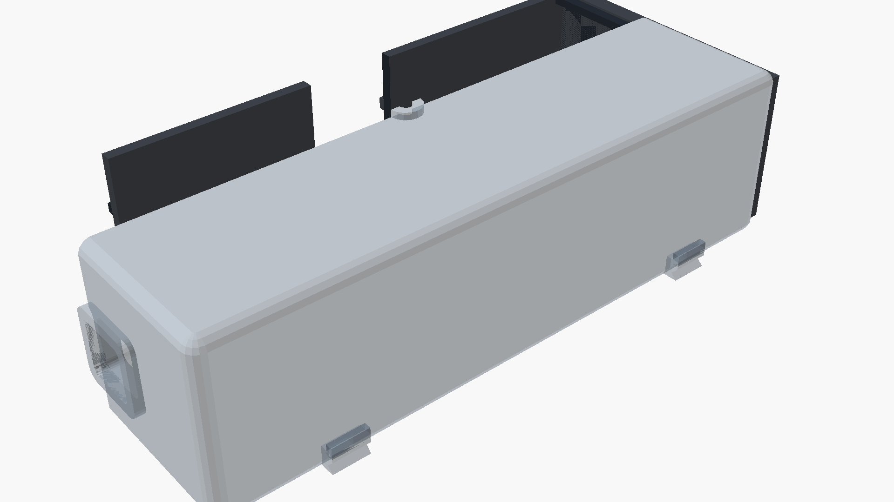

*Figure 8.8: Kinematic 3D cutaway view of the magnetic cartridge anti-theft lock (`98_magnetic_anti_theft_inspection.scad`). Visible: transparent pod housing, sled with 1st-class rocker arm (green), 90° sawtooth claw in housing notch ($X = 88\,\text{mm}$), $\varnothing\,6.2 \times 8\,\text{mm}$ steel anchor with V4A return spring ($X = 46\,\text{mm}$), M2 stainless pivot pin ($X = 58\,\text{mm}$), and bulkhead V4A ejection springs.*

1. **Flush, Tamper-Proof Cartridge Front:**
   * External squeeze buttons are completely eliminated. The front bezel of the cartridge sits entirely flush and gapless against the pod housing. Manual prying with fingers or screwdrivers is impossible without destroying the enclosure.
2. **Kinetic 2-Arm Rocker Latch (`parts/05_magnetic_lock_latch.scad`):**
   * Operates as a class 1 lever around a rust-free M2 pivot axle at $X = 58\,\text{mm}$.
   * **Front Arm ($X = 70\,\text{mm}$):** Carries the $90^\circ$ sawtooth retention claw with a $30^\circ$ lead-in ramp. Upon insertion, it slides smoothly over the rail and snaps positively into the housing notch at $X = 88\,\text{mm}$.
   * **Rear Arm ($X = 46\,\text{mm}$):** Houses the press-fit ferromagnetic steel anchor ($\varnothing\,6.2 \times 8\,\text{mm}$). A V4A compression spring braces against the inner sled wall, keeping the locking claw permanently engaged in the rest state.
3. **Contactless Neodymium Release & Tactile Target Circle:**
   * On the left outer wall of `pod_base_housing.scad` at $X = 64\,\text{mm}$, a subtle tactile target circle ($\varnothing\,18\,\text{mm} \times 0.6\,\text{mm}$) is molded.
   * When the rider approaches the [Smart Keyfob](../../hardware/cad/scad/05_accessories/smart_keyfob_pager.scad) (or an N52 magnet key) to this circle, the magnetic field pulls the internal steel anchor outward. The rocker swivels around the M2 pin, retracts the locking claw into the sled, and releases the latch.
4. **Automatic Spring Ejection (Auto-Eject):**
   * Simultaneously, the dual V4A compression springs in the bulkhead push the cartridge forward by a controlled **$15\dots 20\,\text{mm}$**, allowing easy single-handed removal.
5. **Hermetic Offroad & All-Weather Protection:**
   * Zero external slots, sliders, or push buttons. 100% impervious to sand, mud, rain, and winter road salt.

| Parameter | Calculated Value | Verification & Function |
| :--- | :---: | :--- |
| **Spring Rate (2x V4A Springs)** | **$2.4\,\text{N/mm}$** | Dual parallel stainless steel springs (DIN EN 13906-1) |
| **Preload Travel** | **$6.0\,\text{mm}$** | Compressed from $L_0 = 15\,\text{mm}$ to $L_{\text{mated}} = 9\,\text{mm}$ |
| **Axial Retention Force** | **$7.2\,\text{N}$** | Maintains constant seal compression against 20 g vibration |
| **Gasket Compression Force** | **$4.5\,\text{N}$** | $30\,\%$ compression of $1.5\,\text{mm}$ silicone seal cord |
| **Extraction Resistance** | **$> 120\,\text{N}$** | $90^\circ$ positive latch prevents unauthorized extraction |
| **Release Magnetic Field** | **$B_r \ge 1.2\,\text{T}$ (N52)** | Contactless deflection of the rocker at target circle $X = 64\,\text{mm}$ |
| **Auto-Eject Throw** | **$15\dots 20\,\text{mm}$** | Clears the $4.8\,\text{mm}$ 6-pin wipe with generous margin |

#### 4.1.3 The 4 Kinematic Phases of Cartridge Insertion
1. **Phase 1 - Pre-Centering ($x = 0\dots 80\,\text{mm}$):** Asymmetrical Poka-Yoke guide ribs engage housing channels. Lateral play is restricted to $\pm 0.2\,\text{mm}$.
2. **Phase 2 - Spring Compression ($x = 80\dots 86\,\text{mm}$):** Sled face contacts the two stainless steel ejection springs in the bulkhead, building the $7.2\,\text{N}$ preload.
3. **Phase 3 - 6-Pin Contact Mating & Snap Latch ($x = 86\dots 91\,\text{mm}$):** The 6 gold-plated square pins enter $4.8\,\text{mm}$ deep into the dual-beam female header (Wipe). The $30^\circ$ lead-in ramp deflects the rocker inward until it snaps into the notch at $X = 88\,\text{mm}$.
4. **Phase 4 - Flush Locking ($x = 91\,\text{mm}$):** The $90^\circ$ locking flank dead-locks positively. The perimeter silicone gasket compresses by $30\,\%$ (IP67 weather seal).

#### 4.1.4 Contact Reliability & Wipe Length
* **Header Geometry:** $6.5\,\text{mm}$ square pin extension ($0.64 \times 0.64\,\text{mm}$, $0.76\,\mu\text{m}$ hard gold over nickel).
* **Effective Wipe Length:** **$4.8\,\text{mm}$** engagement inside female socket (exceeds USCAR-2 automotive spec of $\ge 1.5\,\text{mm}$ by a **factor of 3.2**).
* **Contact Bounce Prevention:** $7.2\,\text{N}$ continuous axial spring preload completely prevents contact micro-chatter under vibrations up to $20\,\text{g}$.

---

### 4.2 Enclosure Type B: Universal Satellite Pod Housing (Pods 1, 2, and 3)

All 3 pod locations use the identical 5-sided monocoque enclosure ($135.0 \times 70.0 \times 38.0\,\text{mm}$):


*Figure 8.9: 3D CAD exploded view of the universal Satellite Pod.*


*Figure 8.10: 3D X-ray view of the closed Satellite Pod showing internal clearances.*

#### 4.2.1 V-Groove Pipe Saddle ($120^\circ$) & EPDM Strap Mounting
* **Underside Profile:** $120^\circ$-V-saddle ($R = 15\,\text{mm}$) contours snugly to frame tubes from $\varnothing 18\dots 35\,\text{mm}$ ($1"$ crash bars, $7/8"$ subframes).
* **4x Anchor Lugs:** Fast, scratch-free attachment using 2 UV-resistant EPDM O-rings providing vibration dampening.

#### 4.2.2 Dual-Port Pod Base Architecture (Z-Axis Decoupling & Saddlebag Integration)

To support both exposed outdoor deployments (e.g. crash-bar clamps on adventure bikes or rear radar Pod 3) and protected saddlebag internal installations without requiring DIY soldered adapter cables, the Pod Base PCB ([`openmotorbridge_pod_base.kicad_pcb`](../../hardware/kicad_pod_base/openmotorbridge_pod_base.kicad_pcb)) incorporates a **Dual-Port Architecture**:

```
                         POD BASE PCB (TOP VIEW / LAYOUT)
 ┌────────────────────────────────────────────────────────────────────────┐
 │                                                                        │
 │   [ PORT A: M8 6-Pin ]                   [ PORT B: USB-C Slim ]        │
 │   (Outdoor / Rear Radar)                 (Saddlebag / Interior Mount)  │
 │   Rugged threaded jack                   Sealed behind TPU dust cap    │
 │            │                                         │                 │
 │            └───► [ AUTOMATIC POWER-MUX /     ] ◄─────┘                 │
 │                  [ IDEAL DIODES (LM66100)    ]                         │
 │                                │                                       │
 │                                ▼                                       │
 │                    [ SP3012 ESD Array ]                                │
 │                                │                                       │
 │                                ▼                                       │
 │                    [ J1: Mill-Max 6-Pin Pogo ]                         │
 │                    (Centered for cartridge engagement)                 │
 │                                                                        │
 └────────────────────────────────────────────────────────────────────────┘
```

1. **Mechanical Decoupling of `J1` and `J2`:**
   * By placing **Port A (M8, left)** and **Port B (Slim-Port, right)** side-by-side, the central pogo-pin region remains completely unobstructed. Mechanical assembly clearances and stack heights relax significantly.
2. **100% Preservation of Enclosure & PCB Envelopes (Zero Length Increase):**
   * The Pod Base PCB strictly maintains its ultra-compact dimensions of **$36.0 \times 20.0\,\text{mm}$**.
   * The external 5-sided monocoque housing remains locked to its standardized envelope of **$135.0 \times 70.0 \times 38.0\,\text{mm}$**.
   * **Port A Square Pass-Through Cutout ($11.5 \times 11.5\,\text{mm}$):** The square solder base passes completely through the $3.5\,\text{mm}$ wall, leaving the external M8 brass thread exposed and fully accessible for the cable coupling nut.
   * **Planar PCB Seating without Wobble (Dual M2 Screws at H1 & H2):** The bulkhead partition at $X = 18.0\,\text{mm}$ features dual precision M2 screw bosses mating directly with board holes **H1 ($Y = 20\,\text{mm}$)** and **H2 ($Y = 50\,\text{mm}$)** at $Z = 19.0\,\text{mm}$, preventing any rocking effect.
3. **Hardware Arbitration (Priority & Reverse-Current Protection):**
   * An integrated ideal-diode power multiplexer (LM66100) automatically routes power from the active port while preventing reverse current feeding into the inactive port.
4. **Axial Alignment & Recessed Plug-Well (Depth Compensation & Mechanical Protection):**
   * Vertical USB-C receptacle on `B.Cu` recesses into a **$7.0\,\text{mm}$ deep plug-well** ($14.0 \times 8.5\,\text{mm}$) with $45^\circ$ lead-in chamfer.
   * The solid housing wall absorbs all lateral shear and bending forces from the cable.
   * When Port B is not in use, the molded TPU cap ([`008_pod_base_usbc_cap_tpu.scad`](../../hardware/cad/scad/02_pod_base/parts/008_pod_base_usbc_cap_tpu.scad)) seals it watertight (IP67).
5. **Universal Multi-Platform Deployment (Support Vehicles / Cabin / Lab Bench):**
   * Via Port B, the exact same pod operates with a standard slim USB-C cable in support vehicles or on the test bench.

---

### 4.3 Enclosure Type C: Modular Cartridges & Sleds


*Figure 8.11: The modular cartridge variants (OMM Transceiver, Sena 50S/60S, Cardo Packtalk Edge, IP67 Dry Box).*

#### 4.3.1 User-Centric Plug & Play Docking Architecture (Zero Solder)
To route signals from the right-angled **JST-SH 1.0 mm 6-pin SMD header (`J2`)** on the cartridge carrier PCB to adapter contact points without crimp or bend fatigue:
* **Under-Bed Cable Channel:** A recessed channel ($8.0 \times 1.5\,\text{mm}$) runs directly beneath the contoured cradle cavity.
* **Tray Pass-Through Slot:** A precision opening ($10.0 \times 3.0\,\text{mm}$ with $R = 1.0\,\text{mm}$ radiused edges) guides the flexible flat ribbon cable from header `J2` upward into the nest.
* **Standardized Pinout on JST-SH 6P Header (`J2`) for Audio & Direct-DC:**

| Pin | Signal Name | Adapter Function | Sena SPIDER X Slim | Sena 50S/60S Pad | Cardo Edge Pad | Midland XT / PMR |
| :---: | :--- | :--- | :--- | :--- | :--- | :--- |
| **1** | `VCC_DIRECT_DC` | Direct-DC Power (3.85V / 5V) | Battery Plug ⑧ (DC In) | Pin 2 (USB-5V) | Pin 2 (5V Charge)| 5V DC In |
| **2** | `GND` | Common Ground Reference | Battery Plug ⑧ (GND) | Pin 1 (GND) | Pin 1 (GND) | Ground / Shield |
| **3** | `AUDIO_R+` | Audio Diff-Out + (to speaker input) | Speaker ⑩ (Spk +) | Pin 4 (Spk R+) | Pin 3 (Spk +) | Speaker In + |
| **4** | `AUDIO_R-` | Audio Diff-Out - (speaker return) | Speaker ⑩ (Spk -) | Pin 5 (Spk R-) | Pin 4 (Spk -) | Speaker In - |
| **5** | `MIC_IN+` | Audio Diff-In + (from microphone out) | Microphone ⑨ (Mic +) | Pin 6 (Mic +) | Pin 5 (Mic +) | Mic Out + |
| **6** | `RESERVE_IO` | Diagnostics / Auxiliary / PTT | N/C | Pin 7 (Mesh-Btn)| N/C (Aux) | PTT Switch |

#### 4.3.2 OMM Transceiver Cartridge & Telemetry Backbone (Pod 3)

The OMM Transceiver swap cartridge ([`cartridge_antenna_bracket_omm.scad`](../../hardware/cad/scad/03_pod_cartridges/parts/04_antenna_bracket_omm.scad) / [`cartridge_omm_transceiver.scad`](../../hardware/cad/scad/03_pod_cartridges/cartridge_omm_transceiver.scad)) forms the data backbone of the OpenMotorBridge network. It combines the OMM Transceiver, 868 MHz LoRa, and Multi-GNSS (`PCBA 04`, ESP32-C3 32-bit RISC-V co-processor, Semtech SX1262 LoRa, u-blox MAX-M10S with $25 \times 25\,\text{mm}$ ground plane, and Bosch Sensortec BMI270 6-axis IMU) in a protected rear position.

> [!IMPORTANT]
> **Architectural Modularity (Type-B Inviolability):**
> Even for the rear telemetry node, the universal monocoque chassis (Type B, $135 \times 70 \times 38.0\,\text{mm}$) remains **100% identical and uncompromised**. Rear Pod 3 differs mechanically in no way from intercom Pods 1 and 2; it is simply configured by sliding in this OMM transceiver cartridge with its integrated dielectric antenna radome. Vehicle-specific adaptation to fenders, luggage bridges, or tubular subframes is handled exclusively by external mounting brackets (see [Chapter 6](#6-vehicle-specific-reference-mounting-kits-zero-drill--bolt-on)).


*Figure 8.12: 3D CAD exploded view of rear Pod 3 with antenna radome, internal PCB, and M8 bayonet socket.*


*Figure 8.13: Longitudinal cross-section through rear Pod 3 showing coaxially shielded antenna chamber and $25 \times 25\,\text{mm}$ GNSS ground plane.*

---

#### 4.3.3 Sena 50S / 60S Cradle


*Figure 8.14: 3D CAD visualization of the Sena 50S/60S swap cartridge with sprung 7-pin pogo pin interface.*

#### 4.3.4 Mechatronic Smart Cartridge: Form-Fit Retention & 4-Channel Actuator Guide (Sena SPIDER X Slim & Cardo Packtalk Edge)
For modern intercom cartridges such as the Sena SPIDER X Slim and Cardo Packtalk Edge, the cartridge mechanical architecture addresses the dual core challenges: **Absolute vibration resistance for the OEM adapter** and **accurate, permanent alignment of 4 discrete, independently positioned actuators onto the target button fields**.

```
    MECHATRONIC SMART CARTRIDGE – DISCRETE 4-CHANNEL ACTUATOR GUIDE
┌──────────────────────────────────────────────────────────────────────────────────┐
│ CARTRIDGE TOP COVER (PA12-MJF with model-specific guide domes):                  │
│                                                                                  │
│   TOP FACE (3x Vertical Domes):                   SIDE FLANK (1x 45° Angle):     │
│   [ Actuator 1 ]   [ Actuator 2 ]   [ Actuator 3 ]           [ Actuator 4 ]      │
│   (Sena: + /       (Sena: Center/   (Sena: - /               (Sena: Mesh 45° /   │
│    Cardo: Media)    Cardo: Mobile)   Cardo: Intercom)         Cardo: Wheel-Press)│
│         │                │                │                         │            │
│   ┌─────┴─────┐    ┌─────┴─────┐    ┌─────┴─────┐             ┌─────┴─────┐      │
│   │Spring 0.15│    │Spring 0.15│    │Spring 0.15│             │Spring 0.15│      │
│   └─────┬─────┘    └─────┬─────┘    └─────┬─────┘             └─────┬─────┘      │
│         ▼                ▼                ▼                         ▼            │
│   ┌───────────┐    ┌───────────┐    ┌───────────┐             ┌───────────┐      │
│   │Vertical   │    │Vertical   │    │Vertical   │             │45°-Angle  │      │
│   │Bushing H8 │    │Bushing H8 │    │Bushing H8 │             │Bushing H8 │      │
│   └─────┬─────┘    └─────┬─────┘    └─────┬─────┘             └─────┬─────┘      │
│         │ (TPU)          │ (TPU)          │ (TPU)                   │ (TPU)      │
│         ▼ (0.4mm)        ▼ (0.4mm)        ▼ (0.4mm)                 ▼ (0.4mm)    │
├─────────┼────────────────┼────────────────┼─────────────────────────┼────────────┤
│ OEM INTERCOM HOUSING (In vibration-dampened EPDM contour nest):                  │
│         ▼                ▼                ▼                         ▼            │
│   [ Button 1 ]     [ Button 2 ]     [ Button 3 ]              [ Button 4 / Wheel]│
│                                                                                  │
│ ┌──────────────────────────────────────────────────────────────────────────────┐ │
│ │ 3-Point EPDM Damping Liners (60° Shore A, 1.5 mm) resisting 20g shock/vibe  │ │
│ └──────────────────────────────────────────────────────────────────────────────┘ │
│ CARTRIDGE BASE SLED WITH MONOCOQUE LOCKING (PA12-MJF Negative Contour)           │
└──────────────────────────────────────────────────────────────────────────────────┘
```

* **1. Discrete, Modular Actuator Architecture:**
  * Instead of a rigid single-block actuator comb, OpenMotorBridge utilizes **4 miniaturized discrete actuators** (solenoids with return springs and elastomeric TPU tips), each wired via its own flexible 2-wire AWG30 silicone cable to the 8-pin `J_ACT` header on PCBA 03.
  * This allows the cartridge top cover inlay to be custom-tailored for any intercom geometry:
    * **Sena SPIDER X Slim:** 3 actuators arranged vertically in the top face guide row (Plus, Center, Minus) and 1 actuator mounted in a $45^\circ$-angled guide tower on the side flank to actuate the triangular Mesh button.
    * **Cardo Packtalk Edge:** 3 actuators for the primary buttons (Media, Mobile, Intercom) and 1 actuator driving the axial center push switch of the Control Wheel (Center-Press). Mechanically rolling the wheel while riding is rendered unnecessary, as system master volume and gain are adjusted digitally via the ES8388 DSP in the Central Box.
  * **Mechanical Retention via Clamping Plate:** The actuators slide from the interior into the monolithic guide towers and are securely seated against their shoulder by a shared PA12-CF retainer plate fastened with 4x M2 countersunk screws and backed by a $1.0\,\text{mm}$ EPDM vibration pad. Loosening or misalignment under 20g road vibration is physically prevented.
  * **Anti-Pinch Cable Routing:** Recessed $1.8 \times 2.0\,\text{mm}$ cable channels with integral retaining snap clips line the inner wall of the sled. The ultra-flexible AWG30 silicone leads of the 8-pin Y-harness route safely and pinch-free from `J_ACT` to the 4 actuators.

* **2. Form-Fit Negative Nest & Vibration Locking Resisting $20\,\text{g}$ Shock:**
  * **Precision Tolerancing:** The receiver cavity replicates the OEM SPIDER X Slim housing ($74.5 \times 31.0 \times 16.0\,\text{mm}$) with an engineered $0.2\,\text{mm}$ clearance in SLS/MJF PA12.
  * **3-Point EPDM Vibration Isolation:** Three profiled EPDM damping pads ($60^\circ$ Shore A, $1.5\,\text{mm}$ thickness) at the base and lateral flanks absorb high-frequency engine vibration ($50\dots 500\,\text{Hz}$) and road shocks up to $20\,\text{g}$ (ISO 16750-3).
  * **Form-Fit Quick-Release Clamp:** A pivoting hold-down bracket with captive M3 knurled thumbscrew and EPDM pressure pad clamps the OEM adapter into the nest with calibrated $15\dots 20\,\text{N}$ retention force. Creeping, shifting, or rattling under riding conditions is physically impossible.

* **3. Precision Actuator Guide Bridge & Pinpoint Button Alignment:**
  * **Monolithic Guide Bushings:** The cartridge top cover incorporates four laser-sintered guide cylinders ($\varnothing\,3.2\,\text{mm}$, H8 tolerance).
  * **Coaxial Alignment:** Each bushing axis is positioned exactly concentric to the target OEM rubber button (`ACT_PLUS`, `ACT_MINUS`, `ACT_CENTER`, `ACT_MESH`) with positional deviation $< \pm 0.15\,\text{mm}$.
  * **TPU / Silicone Plunger Tips (Shore 70A):** The plunger heads feature convex elastomeric tips. They eliminate slippage against the contoured rubber buttons, absorb lateral tolerance stack-up, and protect the factory button coating from frictional wear.
  * **Integrated Return Springs (Stainless Steel 1.4310):** Every actuator axis is suspended by a coil spring ($c \approx 0.15\,\text{N/mm}$). A defined $0.4\,\text{mm}$ air gap ensures that severe road shocks never cause unintended physical button contact in the unpowered state.
  * **Mechanical Travel Limiters ($1.1 \pm 0.1\,\text{mm}$):** Plunger travel is bounded by rigid mechanical stops. This ensures full tactile actuation of internal micro-switches while protecting the OEM internal PCB from over-compression.

* **4. Kink-Free Strain Relief for 3-Port Cable Whip:**
  * Sled base channels guide the factory cable whip of the SPIDER X Slim (DC Power ⑧, Microphone ⑨, Speaker ⑩) across smooth bend radii ($R \ge 5\,\text{mm}$) directly into headers `J2` and `J_ACT` on PCBA 03 Rev 2.0.

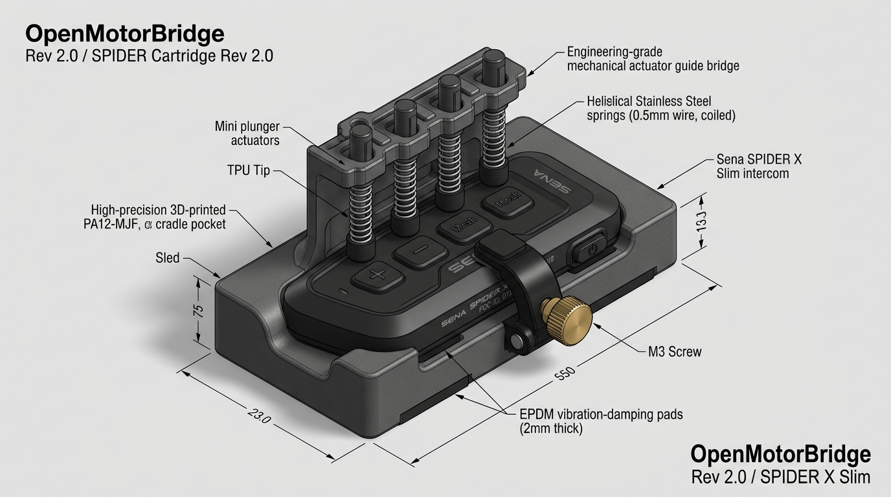

*Figure 8.14b: CAD visualization of the mechatronic Smart Modular Cartridge Rev 2.0 for Sena SPIDER X Slim: Form-fit PA12-MJF cradle, 3-point EPDM vibration damping resisting 20g shock/vibration, quick-release hold-down clamp, and monolithic actuator guide bridge with 4 independent solenoid plungers on PCBA 03.*

#### 4.3.5 Sena +Mesh & Universal Slide-Inlay (Class A with External RF Bulkhead)
* **100% Non-Destructive OEM Integration:** The Sena +Mesh remains unopened in its original housing.
* **Form-Fitting Sled Inlay:** Replicates the OEM frame mount with 2x sliding tabs (spacing $30\,\text{mm}$) and flexible snap tongue.
* **Integrated SMA Bulkhead Bore ($\varnothing\,6.5\,\text{mm}$):** With O-ring counterbore ($\varnothing\,9.5 \times 1.2\,\text{mm}$) on front bezel for an IP67 SMA female-female bulkhead adapter.
* **Internal Coax Duct:** Cutout in sled floor for kink-free routing of internal $8\,\text{cm}$ RG-178 pigtail (with 90° SMA plug to Sena +Mesh).
* **EPDM Retention Strap:** Anchor tabs for elastic EPDM band ($35 \times 10\,\text{mm}$) securing the unit vibration-free.
* **Power Feed:** Flat right-angle Micro-USB / USB-C pigtail from Pin 1 (`GND`) and Pin 2 (`5V_VBUS`) of JST-SH header `J2`.

#### 4.3.6 Cardo Packtalk Edge / Pro Magnetic Air Mount


*Figure 8.15: 3D CAD visualization of the Cardo Packtalk Edge swap cartridge with N52 neodymium magnetic seat and 5 sprung contact pads.*

#### 4.3.7 Cardo Packtalk Bold / Black Edition
Accommodates the sliding contacts of the original Cardo audio kit plate. The device slides down the guide rails and clicks positively into place.

#### 4.3.8 Midland BT Mini / BTR1 Advanced & XT30 Slide
* **Midland Intercom Edition (BTR1 / Rush / BT Mini):** Form-fitting nest for Midland Bluetooth and Wave Mesh intercoms ($70\dots 85\,\text{mm}$ width).
* **Midland XT Bare-Board Edition:** Directly houses the decased PCB of compact walkie-talkies (XT10/XT30/G5, $\approx 68 \times 42 \times 10\,\text{mm}$).

#### 4.3.9 PMR446 Transceiver & Bare-Board Module (SA818S / RDA1846)
Fully integrated 500 mW PMR446 analog RF module ($38 \times 20\,\text{mm}$) seated directly on the cartridge carrier PCB—optionally with internal 446 MHz helical antenna or robust SMA front socket.

#### 4.3.10 Longitudinal Cross-Section Comparison (Sena vs. Cardo)


*Figure 8.16: 2D longitudinal cross section (X-Z plane) through Sena 50S (top) and Cardo Packtalk Edge (bottom) cartridges docked inside the pod.*

#### 4.3.11 IP67 Blank Cartridge (Dry Box Dummy)


*Figure 8.17: Identically contoured IP67 blank cartridge providing an integrated $80 \times 46 \times 16\,\text{mm}$ emergency dry compartment.*

The IP67 Blank Cartridge (`cartridge_blindkassette.scad`) reliably protects the pod slot whenever no intercom is docked:
* **Identical Latching & Ejection Kinematics:** The blank cartridge integrates the exact same standardized 2-arm magnetic latch (`parts/05_magnetic_lock_latch.scad`), Poka-Yoke guide rails, and spring pockets for the V4A ejection springs. It engages with the same positive click and ejects contactlessly upon approaching the N52 magnetic key.
* **Hermetic Connector Protection (EPDM Dummy Seal):** On the rear face, an integrated molded EPDM sealing block seals the 6-pin socket on PCBA 02 against water, road salt, and dirt intrusion.
* **Emergency Dry Compartment:** The internal $80 \times 46 \times 16\,\text{mm}$ cavity functions as a sealed dry box for vehicle registration papers, cash, spare keys, or emergency O-rings.

---

### 4.4 Standardized 6-Pin M8 / PUR Harness Wire Color Coding

| M8 / Pogo Pin | Conductor Color (PUR Cable) | Cross Section | Signal Pods 1 & 2 (Audio & Intercom) | Signal Pod 3 (Rear Transceiver) | Shielding & Twisting |
| :---: | :--- | :---: | :--- | :--- | :--- |
| **Pin 1** | **Red (RD)** | $0.34\,\text{mm}^2$ (AWG22) | **`VCC`** (5V switched via MOSFET) | **`VCC`** (5V power supply) | Single core (Power) |
| **Pin 2** | **Black (BK)** | $0.34\,\text{mm}^2$ (AWG22) | **`GND`** (Dedicated power & signal ground)| **`GND`** (Dedicated power & signal ground)| Single core (Power GND) |
| **Pin 3** | **White (WH)** | $0.14\,\text{mm}^2$ (AWG26) | **`NF_P`** (Balanced Audio + via Bourns) | **`UART_TX`** (Rear Co-Processor $\rightarrow$ Box) | **Pair 1 twisted** (with Pin 4) |
| **Pin 4** | **Blue (BU)** | $0.14\,\text{mm}^2$ (AWG26) | **`NF_N`** (Balanced Audio - via Bourns) | **`UART_RX`** (Box $\rightarrow$ Rear Co-Processor) | **Pair 1 twisted** (with Pin 3) |
| **Pin 5** | **Yellow (YE)** | $0.14\,\text{mm}^2$ (AWG26) | **`TRIGGER_PPS`** (Single-Wire UART / Opto-Trigger) | **`GNSS_PPS`** (1-PPS Hardware Timebase) | Single core (Control) |
| **Pin 6** | **Green (GN)** | $0.14\,\text{mm}^2$ (AWG26) | **`1-WIRE_ID`** (Native Emulation / DS2401 ID) | **`1-WIRE_ID`** (Cartridge ID) | Single core (1-Wire Bus) |
| **M8 Shell** | **Tinned Copper (BL)** | $> 85\,\%$ Braid | **`GND_SHIELD`** (360° Chassis Shield) | **`GND_SHIELD`** (360° Chassis Shield) | Overall shield via M8 metal body |


## 5. Type C: Universal Front Node (Cockpit & Sensor Hub)

The Front Node enclosure was specially engineered for protected installation inside motorcycle front fairings (Batwing, Sharknose, BMW GS/RT beak) or on crash bars:

- **Outer Dimensions:** Compact **$98.0 \times 68.0 \times 25.0\,\text{mm}$** (L x W x H, tailored for the $82 \times 50\,\text{mm}$ 4-layer PCBA 05).
- **Material:** HP Multi Jet Fusion (MJF) PA12, black glass-bead blasted and chemically vapor smoothed.
- **Protection Class:** IP67 (submersion and high-pressure water jet proof) with integrated Gore-Tex pressure equalization vent (ePTFE vent) against condensation.


*Figure 8.18: Closed Front Node IP67 enclosure.*


*Figure 8.19: 3D exploded view of the Front Node along the vertical Z-axis.*


*Figure 8.20: Transparent 3D cutaway view of the Front Node showing Knowles MEMS acoustic duct and VBUS load switch.*

### 5.1 The 4-in-1 Universal Mounting System of the Front Node


*Figure 8.21: Enclosure bottom view of the Front Node showing AMPS hole pattern, $120^\circ$ V-groove tube saddle, EPDM strap anchor tabs, silentblock mounting holes, and 3M Dual-Lock hook-and-loop channels.*

```
┌────────────────────────────────────────────────────────────────────────────────────────┐
│                   THE 4-IN-1 UNIVERSAL MOUNTING SYSTEM (BOTTOM VIEW)                   │
├────────────────────────────────────────────────────────────────────────────────────────┤
│ 1. AMPS HOLE PATTERN (30 x 38 mm):                                                     │
│    • 4x form-fitting DIN 934 M4 captive hex nut pockets in AMPS layout (100% iron-free)│
│    • Compatible with all RAM-Mount ball adapters, Garmin brackets & cockpit crossbars  │
├────────────────────────────────────────────────────────────────────────────────────────┤
│ 2. TUBE SADDLE PRISM (120° V-Groove):                                                  │
│    • Integrated channel fitting tube diameters from Ø 22 mm to Ø 32 mm                 │
│    • 4x anchor tabs for 2x weatherproof EPDM elastic straps (BMW GS / crash bars)      │
│    • 100% toolless rapid mounting without scratching frame paint                       │
├────────────────────────────────────────────────────────────────────────────────────────┤
│ 3. SILENTBLOCK VIBRATION ISOLATION:                                                    │
│    • Corner holes for M4 silentblocks (Shore 50A EPDM)                                 │
│    • Isolates high-frequency engine vibrations inside the fairing beak of 1-cyl / V2   │
├────────────────────────────────────────────────────────────────────────────────────────┤
│ 4. 3M DUAL-LOCK VELCRO CHANNELS:                                                       │
│    • 2x recessed 20 mm channels for self-adhesive 3M Dual-Lock mushroom tape           │
│    • Perfect for flat plastic inner fairing surfaces in Batwing or Sharknose cowls     │
└────────────────────────────────────────────────────────────────────────────────────────┘
```

### 5.2 Front Node Connector & Flank Layout

The physical arrangement of connectors and cable entries on the enclosure flanks aligns with the enlarged 4-layer PCBA 05 PCB design ($82 \times 50\,\text{mm}$, `openmotorbridge_front_node.kicad_pcb`) and cockpit cable routing ergonomics:

```
                               FRONT NODE FLANK & CONNECTOR LAYOUT
┌─────────────────────────────────────────────────────────────────────────────────────────────────────────────────────────────┐
│                                                  REAR FACE / NORTH RIM (Y = 68 mm)                                          │
│                     (6-slot EPDM Cable Comb for Vehicle Harness & Sensors: north_epdm_cable_comb)                           │
│   U.FL Antenna     J9: Mirror BSD      J3: Handlebar PTT   J1: 12V KL15     J10: Qi Charger   J11: Aux Light     J2: CAN-Bus│
│   (2.4 GHz ESP)    (3-Pin Radar LED)   (4-Pin Switch)      (2-Pin Ignition) (2-Pin 12V Sw)    (2-Pin Headlight)  (3-Pin CAN)│
├──────────────────────────────────────┬─────────────────────────────────────────────────┬────────────────────────────────────┤
│ LEFT SHORT FLANK / WEST (X = 0 mm)   │              INTERNAL CHAMBER (82 x 50 mm PCB)  │ RIGHT SHORT FLANK / EAST (X = 98)  │
│                                      │                                                 │                                    │
│ • Solid MJF PA12 Monocoque Wall      │ • ESP32-S3-WROOM-1-N16R8 Dual-Core MC           │ • J7: Waterproof USB-C Service     │
│   (Zero penetrations)                │ • USB2514B Automotive 4-Port USB 2.0 Hub        │   Port with TPU sealing cap        │
│ • Shields internal power stage:      │ • Dual SW3526 Sync-Buck USB-PD (2x 20W)         │ • J12: Qwiic / Stemma QT I2C Port  │
│   - D4: SMCJ24CA 24V TVS Diode       │ • 2x L2 & L3 shielded power inductors           │ • SW1 (Boot) & SW2 (Reset) Buttons │
│   - U3 / L1: TPS54302 5V/3A Buck     │ • U3: TPS54302 5V System Buck Converter         │ • LED1: WS2812B RGB Status LED     │
│   - U6: TCAN334G CAN Transceiver     │ • MIC1: Knowles SPH0645 I2S MEMS Microphone     │   (Polycarbonate Light-Pipe Dome)  │
│   - K1: CPC1017N CAN Auto-Sensing    │ • K1: CPC1017N 120 Ohm Bus-Termination Relay    │                                    │
│   - Q2: DMP3017SFG Reverse-Polarity  │ • Q1: DMN63D8LDW Mirror BSD Driver Stage        │ • M4/M5 Silentblock Flange Ear     │
│ • M4/M5 Silentblock Flange Ear       │ • U4: TPS2051B USB Power Gate for Port 2        │   (Center Y = 34.0 mm, Z = 0..5 mm)│
│   (Center Y = 34.0 mm, Z = 0..5 mm)  │ • U7: TLV75533P 3.3V Ultra-Low-Noise LDO        │                                    │
├──────────────────────────────────────┴─────────────────────────────────────────────────┴────────────────────────────────────┤
│                                                  FRONT FACE / SOUTH RIM (Y = 0 mm)                                          │
│                         (6-slot EPDM Cable Comb for Cockpit & USB Cables: south_epdm_cable_comb)                            │
│   J4: USB Host       J5: Phone 20W PD    J6: CP2AA Dongle   J5_MP3: 20W PD + MP3     J6_AUX: Dashcam    J8: Action-Cam 5V   │
│   (Upstream Skyline) (Downstream 1, 5P)  (Downstream 2, 4P) (Downstream 3, 5P Data)  (Downstream 4, 4P) (2-Pin Switched 5V) │
└─────────────────────────────────────────────────────────────────────────────────────────────────────────────────────────────┘
```

1. **Front Face / South Flank ($Y = 0\,\text{mm}$):**
   - **6-Slot EPDM Cable Comb (`south_epdm_cable_comb`):** Directs USB and charging cables vibration-damped and strain-relieved through a 70 mm wide sealing chamber forwards towards the cockpit:
     - `J4` ($X_{\text{tub}} = 23.25\,\text{mm}$): JST-GH 4-Pin Upstream USB 2.0 connection to the motorcycle head unit (Harley Skyline OS / Boom! Box GTS).
     - `J5` ($X_{\text{tub}} = 37.00\,\text{mm}$): JST-GH 5-Pin Downstream Port 1 to handlebar-mounted smartphone with **20W USB-PD Fast Charging (5V/3A, 9V/2.22A, 12V/1.67A)** via synchronous buck controller `U5` (SW3526) and shielded high-current choke `L2`. Supports USB-PD 3.0, QC 3.0/4.0+, AFC, and FCP for uninterrupted rapid charging under navigation loads in blazing summer heat.
     - `J6` ($X_{\text{tub}} = 48.50\,\text{mm}$): JST-GH 4-Pin Downstream Port 2 with 25–30 cm fairing pigtail to the thermally decoupled CP2AA Wireless CarPlay / Android Auto dongle (Ottocast / Carlinkit, secured via 3M Dual-Lock inside fairing void).
     - `J5_MP3` ($X_{\text{tub}} = 61.75\,\text{mm}$): JST-GH 5-Pin Downstream Port 3 into glovebox / media bay. **Dual Role:** Full **20W USB-PD Fast Charging** via `U8` (SW3526) and choke `L3` for powerbanks, second phone, or camera batteries PLUS **High-Speed USB 2.0 Data** to the USB2514B hub for local MP3/FLAC music flash drives and official firmware updates.
     - `J6_AUX` ($X_{\text{tub}} = 73.25\,\text{mm}$): JST-GH 4-Pin Downstream Port 4 as an auxiliary cockpit data port for dashcams, Chigee AIO-5 display, Garmin Zūmo, or TPMS receivers.
     - `J8` ($X_{\text{tub}} = 80.75\,\text{mm}$): JST-GH 2-Pin switched 5V/1.5A power output for helmet or fairing action-cam (GoPro / Insta360).
2. **Rear Face / North Flank ($Y = 68.0\,\text{mm}$):**
   - **6-Slot EPDM Cable Comb (`north_epdm_cable_comb`):** Directs vehicle harness and sensor leads through a 58 mm wide sealing chamber rearwards towards the frame tunnel:
     - `J9` ($X_{\text{tub}} = 33.50\,\text{mm}$): JST-GH 3-Pin Blind Spot Detection mirror warning LEDs (radar BSD left / right individually driven via dual-MOSFET `Q1` DMN63D8LDW).
     - `J3` ($X_{\text{tub}} = 43.25\,\text{mm}$): JST-GH 4-Pin digital handlebar switch input (PTT intercom group call, camera bookmark, media-voice key, GND).
     - `J1` ($X_{\text{tub}} = 54.75\,\text{mm}$): JST-GH 2-Pin 12V switched ignition power (KL15) with reverse-polarity PMOS `Q2` (DMP3017SFG) and 24V SMCJ24CA TVS diode `D4`.
     - `J10` ($X_{\text{tub}} = 61.75\,\text{mm}$): JST-GH 2-Pin 12V switched power feed for inductive phone wireless charging heads (SP Connect / QuadLock Wireless Charging Head, zero quiescent current in standby).
     - `J11` ($X_{\text{tub}} = 68.75\,\text{mm}$): JST-GH 2-Pin 12V switched auxiliary output for adventure auxiliary lights or emergency brake-strobe flashers.
     - `J2` ($X_{\text{tub}} = 75.75\,\text{mm}$): JST-GH 3-Pin automotive CAN-Bus (CAN_H, CAN_L, GND) with TCAN334G transceiver `U6` and electronic $120\,\Omega$ bus-termination relay `K1` (`CPC1017N`).
   - **U.FL 2.4 GHz Antenna Exit:** Coaxial U.FL connector on PCBA 05 leads to an external 2.4 GHz dipole or patch antenna for reliable ESP-NOW / BLE wireless connection to the Central Box under the seat (completely unaffected by fairing electronics).
3. **Right Short Flank / East Flank ($X = 98.0\,\text{mm}$):**
   - **Service & Diagnostics:** IP67 waterproof USB-C service receptacle (`J7`, $Y_{\text{tub}} = 24.1\,\text{mm}$) with form-fitting TPU sealing cap (`front_node_usbc_cap_tpu.stl`) for direct on-bike flashing, debugging, and log extraction.
   - **Sensor Bus:** 4-Pin JST-SH Qwiic / Stemma QT $I^2C$ expansion port (`J12`, $Y_{\text{tub}} = 34.05\,\text{mm}$) for BME280 environmental sensors or cockpit IMU.
   - **Tactile Switches:** Miniature tactile switches `SW1` (Boot) and `SW2` (Reset) for MCU maintenance.
   - **Visual Status Display:** Polycarbonate light-pipe in enclosure lid for **WS2812B RGB Status LED** (`LED1`, $Y_{\text{tub}} = 40.05\,\text{mm}$): Green = Normal Operation, Blue = BLE/ESP-NOW Connected, Yellow = USB Enumeration / CP2AA Dongle Boot, Red = CAN Error / Failsafe.
   - **Flange Mount:** M4/M5 silentblock flange mounting ear at flank center ($Y_{\text{tub}} = 34.0\,\text{mm}$, $Z = 0\dots 5\,\text{mm}$).
4. **Left Short Flank / West Flank ($X = 0\,\text{mm}$):**
   - **Monocoque Shielding Wall:** Solid MJF PA12 wall without any penetrations. Provides maximum mechanical protection and splash resistance for the directly adjacent internal power stage (TVS diode `D4`, 12V main buck converter `U3` TPS54302 with inductor `L1`, CAN transceiver `U6`, opto-relay `K1`, PMOS reverse-polarity `Q2`).
   - **Flange Mount:** Symmetrical M4/M5 silentblock flange mounting ear at flank center ($Y_{\text{tub}} = 34.0\,\text{mm}$, $Z = 0\dots 5\,\text{mm}$).
5. **Bottom Face ($Z = 0\,\text{mm}$):**
   - Knowles SPH0645LM4H-B $I^2S$ MEMS microphone (`MIC1`) with continuous acoustic duct ($\varnothing\,2.5\,\text{mm}$) and waterproof, oleophobic Gore ePTFE protective membrane ($\varnothing\,6.0 \times 0.8\,\text{mm}$) for real-time wind noise and dynamic air pressure analysis (speed-dependent volume control).

---

---

## 6. Vehicle-Specific Reference Mounting Kits (Zero-Drill / Bolt-On)

While the 5 hardware units (Type A through E) are **100% universally standardized**, OpenMotorBridge delivers fully engineered, non-destructive bolt-on mounting kits for selected motorcycle platforms. These kits exploit OEM factory mounting points or elastic clamping systems to integrate the system into the vehicle without paint damage or irreversible body drilling.

---

### 6.1 Reference Kit 1: Harley-Davidson CVO Road Glide ST (2024+) & New Touring Platform

For high-performance baggers with factory solo seat and forged carbon tail cowl (FLTRXSTSE):
Due to factory Showa inverted remote-reservoir shock absorbers with heavy hydraulic lines and the redesigned 2024 tail section, external strut brackets are mechanically obstructed. The ST reference kit integrates all nodes 100% invisibly and non-destructively:

```
          CVO ROAD GLIDE ST (2024+) COMPLETE SYSTEM INTEGRATION
┌─────────────────────────────────────────────────────────────────────────────┐
│ 1. COCKPIT (Forward, invisible behind outer fairing skin):                  │
│    • Front Node (PCBA 05) + Ottocast mounted on aluminum fairing bracket   │
│    • 12V switched power tapped from internal fairing accessory port         │
│    • ESP-NOW wireless link to Central Box -> 0 cables across steering stem  │
├─────────────────────────────────────────────────────────────────────────────┤
│ 2. CENTER (Under Rider Seat):                                               │
│    • Central Box centered in battery well                                   │
├─────────────────────────────────────────────────────────────────────────────┤
│ 3. REAR (Beneath Forged Carbon Cowl & License Plate):                       │
│    • Pod 3 vertical in Skeleton Dock (cvo_st_undercowl_skeleton_dock.scad)  │
│      Braced upward against road shocks, 0 drilling, 0 paint tape            │
│    • External 2.4 GHz Telemetry Fin (cvo_st_telemetry_fin.scad) on cowl tab │
│    • Radar centered below license plate (radar_license_plate_bracket.scad)  │
├─────────────────────────────────────────────────────────────────────────────┤
│ 4. SADDLEBAGS (Intercom Bridge Sena & Cardo):                               │
│    • Pod 1 (Sena Mesh) inside left saddlebag lid                            │
│    • Pod 2 (Cardo DMC) inside right saddlebag lid                           │
│    • Mounted on OEM hinge / check-strap Torx screws (Zero-Drill)            │
│    • Cable along check strap, weatherproof MagSafe breakaway connector     │
└─────────────────────────────────────────────────────────────────────────────┘
```

#### A. Rear Integration: Under-Cowl Skeleton Dock & Telemetry Fin
* **Skeleton Dock (`cvo_st_undercowl_skeleton_dock.scad`):** Accommodates the standard Pod 3 housing ($135 \times 70 \times 38.5\,\text{mm}$) vertically. Two upward-arched leaf springs brace against the inner ceiling of the forged carbon cowl, preventing rattle or pitch motion over potholes.
* **Telemetry Fin (`cvo_st_telemetry_fin.scad`):** Sleek aerodynamic shark-fin bolted to the OEM tail tab, housing a high-efficiency 2.4 GHz dipole with internal coax pass-through.


*Figure 8.22: 3D CAD model of the Under-Cowl Skeleton Dock (`cvo_st_undercowl_skeleton_dock.scad`). Monolithic cradle with arched leaf springs for ceiling bracing, lateral vibration wings, and form-fitting vertical slot for Pod 3.*


*Figure 8.23: 3D CAD model of the external 2.4 GHz Telemetry Fin (`cvo_st_telemetry_fin.scad`). Aerodynamic fin mounting onto the factory cowl tab with sealed internal coax conduit and strain relief.*


*Figure 8.24: Photorealistic complete rear assembly on the CVO Road Glide ST: Invisible, vibration-proof integration of Pod 3 in the Skeleton Dock beneath the forged carbon cowl, streamlined telemetry fin on the rear tab, and complete clearance to the Showa inverted remote reservoirs.*

#### B. Saddlebag Lid Integration: Pod 1 (Left) & Pod 2 (Right)
* **Top-Lid Mounting:** Both pods sit inside the forward third of the saddlebag lids, bolted to OEM Torx mounting points of the hinge / check-strap bracket (see [Section 6.5](#65-universal-saddlebag-lid-dock-saddlebag_lid_dockscad)).
* **Luggage & Beverage Safety:** Positioned approx. $30\,\text{cm}$ above the bag floor. Heavy cold drinks, tools, or wet gear at the bottom remain entirely below the RF Fresnel zone.
* **Maximum RF Isolation ($> 40\,\text{dB}$):** Sena (left) and Cardo (right) are separated by over $60\,\text{cm}$, using rear fender and chassis as an RF shield.
Pods 1 and 2 mount inside the saddlebag lids using the [Universal Saddlebag Lid Dock](#75-universal-saddlebag-lid-dock-saddlebag_lid_dockscad).

---

### 6.2 Reference Kit 2: Harley-Davidson Touring, Bagger & Cruiser (Road King Special, Street Glide, Electra Glide)

For classic touring and bagger models with 2-Up comfort seats or exposed rear fenders, OpenMotorBridge provides a universal, sculpted fender integration:

The fender integration is available in two aerodynamically optimized styles, both utilizing the factory $1/4"-20$ pillion seat retention nut in the rear fender and routing the M8 signal cable invisibly forward beneath the seat:

#### Option A: Touring Fender Console (`pod3_touring_fender_console.scad` / RKS & Naked Touring)
Organic teardrop form tailored specifically to the exposed rear fender of naked touring models like the Road King Special (FLHRXS):


*Figure 8.25: Isolated 3D CAD view of the Touring Fender Console (`pod3_touring_fender_console.scad`) for Road King Special. Organic teardrop form with rear insertion opening for Pod 3 and quick cartridge swapping.*


*Figure 8.26: Underside of the Touring Fender Console CAD: Concave $195\,\text{mm}$ fender saddle, forward $1/4"-20$ screw tab for the OEM pillion seat nut, and recessed cable channel for chafing-free routing of the M8 harness beneath the seat.*

#### Option B: Touring Stealth Console (`pod3_touring_stealth_console.scad` / Classic Bagger & Cruiser)
For Street Glide, Electra Glide, and Ultra Limited with 2-Up comfort passenger seats. Hugs the rear contour of the passenger seat:


*Figure 8.27: Isolated 3D CAD view of the Touring Stealth Console (`pod3_touring_stealth_console.scad`). Completely organic smoothed contours ($R = 6\dots 7\,\text{mm}$) without hard box edges. Forward mounting tab for the OEM $1/4"-20$ pillion seat screw in the fender, form-fitting seat transition with M8 cable duct heading forward under the seat, front slope integration at mid-insertion height ($Z = 22\,\text{mm}$), open central dock, and gently sloping teardrop rear tail with integrated clip-in slot for the rear antenna.*


*Figure 8.28: Photorealistic complete rear assembly on the Classic Touring bike: Seamless transition against passenger seat, M8 cable routed invisibly forward, unobstructed pod roof for uncompromised GNSS reception, rearward cartridge insertion, and decoupled Garmin Varia radar below the license plate.*

---

### 6.3 Reference Kit 3: Adventure & Touring Enduros (BMW GS, KTM Adventure, Africa Twin)

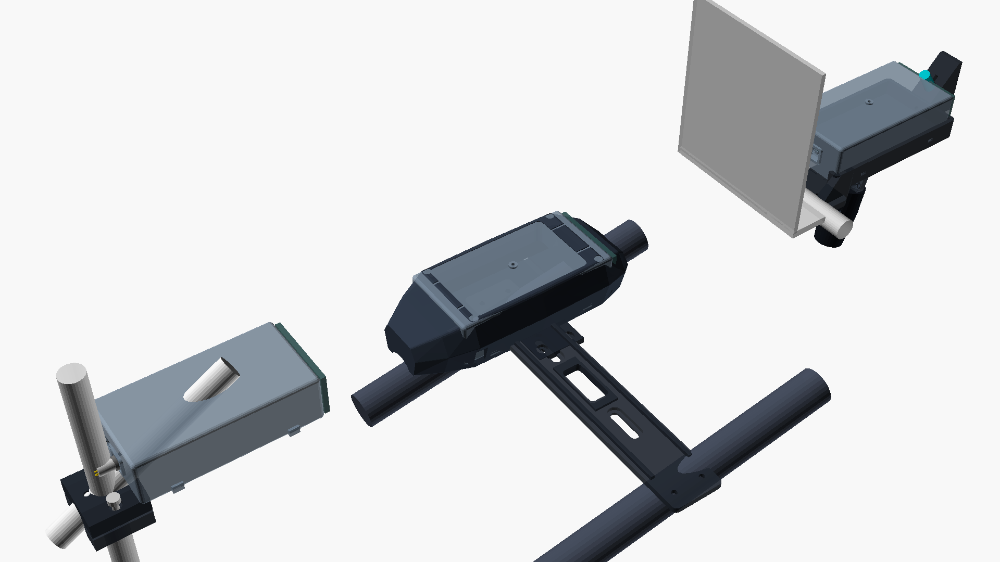

*Figure 8.29: Photorealistic 3D CAD studio render of the modular Adventure Kit (`99_adventure_kit_assembly.scad`). Left: GSA pannier rack clamp in the protected frame triangle (Pod 1 & Sena). Center: Standard GS Transition Dock in the seat crease (Pod 2 & Cardo). Right: Luggage bridge extension "Tail Balcony" behind aluminum topcase with 45° deflector fin for 2.4 GHz dipole antenna, Pod 3 transceiver, and Garmin Varia radar with 36-tooth Hirth coupling.*

#### 6.4.1 Cartridge Pods 1 & 2 (Lateral Modules) – The Dual Mounting Strategy

Depending on luggage configurations, adventure bikes deploy two specialized mounting options:
* **Option A: Tubular Pannier Racks (BMW GS Adventure, Touratech, Hepco&Becker, Givi Outback): The "GSA Cage Dock"**
  * **Mounting:** Mounted on the inside of the massive $\varnothing 18\,\text{mm}$ stainless steel pannier rack structure inside the protected frame triangle via the heavy-duty **GSA Cage Dock** ([`adventure_gsa_cage_dock.scad`](../../hardware/cad/scad/02_pod_base/adventure_gsa_cage_dock.scad)).
  * **Design Philosophy (Expedition Armor + Stealth Niche):**
    Blends the indestructible aesthetic of professional rally raid and overland gear (reminiscent of the iconic Touratech GSA aluminum toolboxes) with stealth niche packaging: The pod is deeply recessed into the approx. $45\,\text{mm}$ wide dead space between the aluminum pannier case inner wall and the motorcycle subframe/wheel arch.

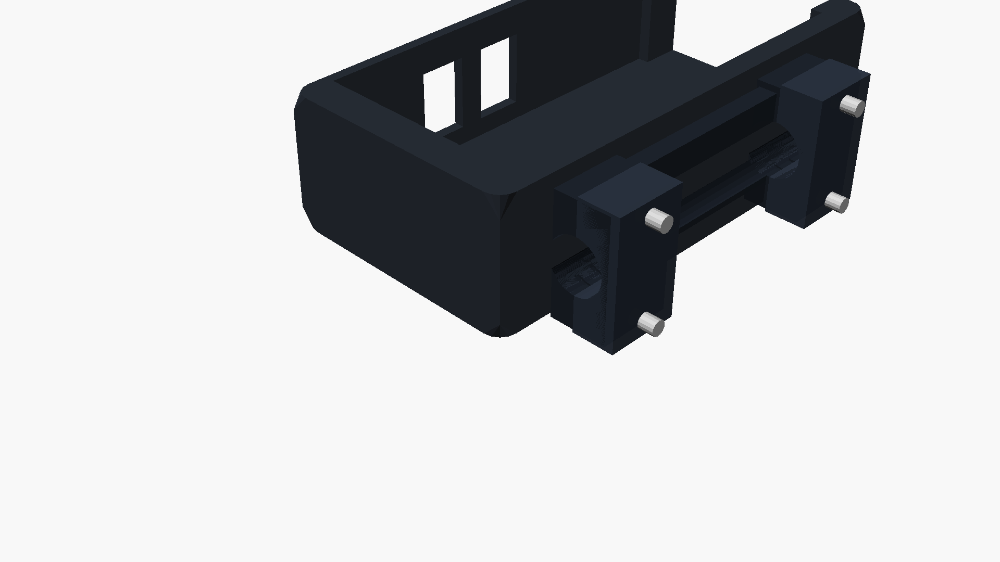

*Figure 8.29-A: CAD detailed view of the heavy-duty GSA Cage Dock (`adventure_gsa_cage_dock.scad`). Depicted are the deeply recessed Sena 50S Pod 1 nestled within the protective PA12-CF armor cage, the broad 85 mm dual-saddle clamping base for Ø 18 mm stainless steel tubes with 4x M5 V4A socket bolts and DIN 985 locknut retention pockets, the 45° faceted deflection skid plate shielding against gravel roost from the rear wheel, and the concealed M8 cable conduit routed in the tube's aerodynamic shadow.*

  * **Engineering Features & Advantages:**
    1. **Dual-Saddle Clamping with 85 mm Support Span:** Rather than pivoting on a single narrow clamp, the Cage Dock engages the $\varnothing 18\,\text{mm}$ rack tube across a broad $85\,\text{mm}$ baseline with two separate saddles. This delivers $> 120\,\text{Nm}$ of torsional stiffness, entirely preventing twist and lever fatigue under extreme corrugated off-road vibrations.
    2. **4x M5 V4A Bolting with Captive Locknuts:** 4x M5 DIN 912 stainless bolts clamp the cap ([`adventure_gsa_clamp_cap.stl`](../../hardware/cad/stl/02_pod_base/adventure_gsa_clamp_cap.stl)) securely to the body. Integrated rear hex pockets capture DIN 985 nylon locknuts to ensure zero vibration loosening.
    3. **Stealth Integration within Pannier Dead Space (100% Hidden):** When aluminum panniers are locked in place, the pod is 100% invisible from the outside. There is zero interference with case mounting pucks, latches, or lid opening arcs.
    4. **Faceted Roost Deflection Skid Plate:** Facing the rear wheel, a $45^\circ$ angled, $3.5\,\text{mm}$ thick armor shield made of carbon-fiber reinforced polyamide (PA12-CF) deflects flying rocks, mud, and water spray kicked up by knobby off-road tires.
    5. **Concealed M8 Cable Conduit:** The M8 harness exits the rear of the pod nest directly into the shadow of the tubular frame, running loop-free and chafing-protected straight under the seat.
    6. **Clear RF Line-of-Sight:** The antenna radiates forward-upward unobstructed through the open subframe triangle toward the rider helmet.
    7. *(Minimalist Alternative:)* For ultra-tight tube geometries, the compact half-clamps ([`adventure_pannier_rack_clamp_base.stl`](../../hardware/cad/stl/02_pod_base/adventure_pannier_rack_clamp_base.stl) / `cap.stl`) remain fully supported.
* **Option B: Standard GS & Naked Adventure Bikes (Without Luggage Racks):**
  * **Mounting:** Mounted via a two-piece, aerodynamically sculpted **Transition Dock** ([`adventure_transition_dock.scad`](../../hardware/cad/scad/02_pod_base/adventure_transition_dock.scad)) in combination with a concealed **Under-Seat Saddle Bridge** ([`adventure_underseat_cross_rail.scad`](../../hardware/cad/scad/02_pod_base/adventure_underseat_cross_rail.scad)).
  * **Positioning:** Directly inside the optical waist crease ("Bügelfalte") at the transition between rider and passenger seats along the $\varnothing 28\,\text{mm}$ subframe tube.

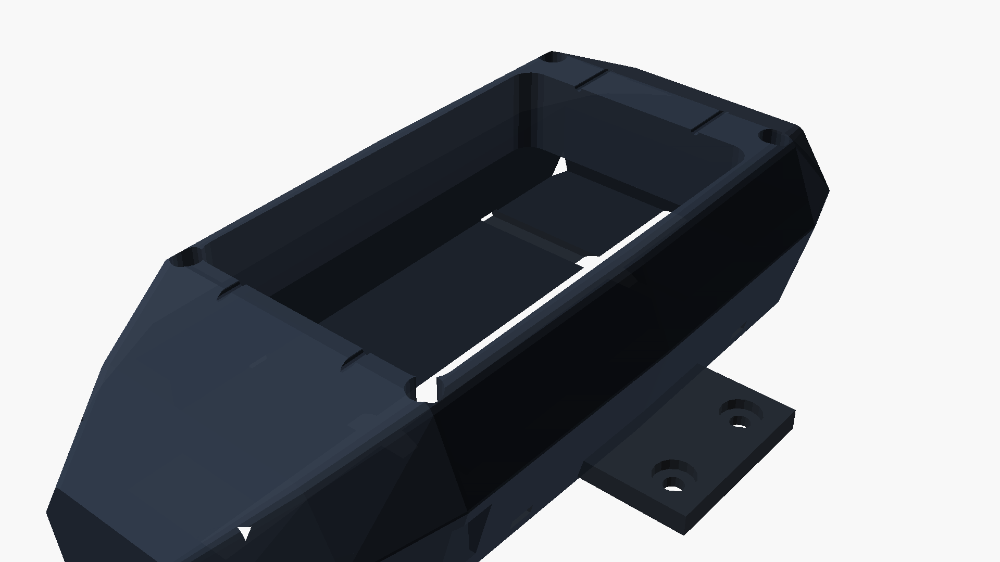

*Figure 8.29-B: CAD detailed view of the GS Transition Dock with Under-Seat Saddle Bridge. Displayed are the two-piece console enclosure (base cradle with subframe saddle and upper sculpted bodywork cowl parting along the sharp waist crease line), the recessed Cardo Packtalk Edge Pod 2, and the flat U-ribbed saddle bridge rail (`adventure_underseat_cross_rail.scad`) linking left and right flanks under the seat to neutralize rotation torque and route the M8 harness invisibly into the battery tray.*

  * **Key Mechanical Advantages:**
    1. **100% Anti-Rotation Stability via Under-Seat Saddle Bridge:** Instead of clamping loosely to a single round tube, a rigid PA12-CF cross-rail ($7.5\,\text{mm}$ low-profile U-channel) spans under the seat between both subframe tubes, locking both sides into a rigid U-portal.
    2. **Zero-Drill & 100% Invisible Mounting from Outside:** Zero exposed clamps, zip-ties, or screw heads on the visible subframe tube. Fastening utilizes existing OEM under-seat bracket points inside the dry battery tray.
    3. **Seamless Bodywork Integration & Top Cowl:** Styled after the Touring Fender Console, the dock forms a closed aerodynamic fairing rather than an open tray. The parting line sits inside the crisp waist crease, and the $22^\circ$ leading wedge blends flush against the rider seat flank (zero boot/knee snag).
    4. **Integrated Connector Service Bay & Concealed Under-Seat Cable Ingress:**
       * **Hollow Chamber in 22° Leading Wedge:** Ahead of the Pod front bulkhead ($X = 0$), the aerodynamic nose contains a spacious $24 \times 50 \times 26\,\text{mm}$ hollow **connector and service bay**. This easily accommodates an M8 industrial screw plug (straight or 90° angled) and a strain-free cable bend.
       * **Form-Fitting Inboard Cable Port:** An oval pass-through port (Ø 10 mm) on the inboard flank of the service bay routes the cable directly under the overhanging seat foam into the dry subframe / battery tray area. Alternatively, the cable can route along the underside channel of the under-seat cross-rail.
       * **Effortless "Top-Access" Assembly:** With the top cowl removed, the M8 cable is pushed through from the inside and threaded onto Port A of the Pod from above with full hand clearance. The Pod is then dropped into the cradle and secured by closing the top cowl with 4x M3 Torx screws—**100% hidden, anti-chafing, and zero blind installation struggle**.
    5. **100% Luggage-Independent:** Usable naked, with BMW Vario cases, or with soft horseshoe bags.
    6. **Clear RF Horizon:** Unobstructed $180^\circ$ lateral and upward line-of-sight to rider and passenger helmets.

---

#### 6.4.2 Rear Pod 3 (Transceiver) – Universal "Rack-Tail Mount" & Rallye Aero-Balcony Concept

When aluminum topcases (e.g. Touratech Zega Evo or BMW Adventure) are installed, the solid $1.5\,\text{mm}$ aluminum wall blocks RF radiation upward (Faraday cage). The universal "Rack-Tail Mount" ([`adventure_rack_tail_mount.scad`](../../hardware/cad/scad/02_pod_base/adventure_rack_tail_mount.scad)) resolves this as a rigid, two-piece **Rallye Aero-Balcony** bolted to the bike rack, cantilevering approx. $68\,\text{mm}$ behind the rear wall of the topcase:

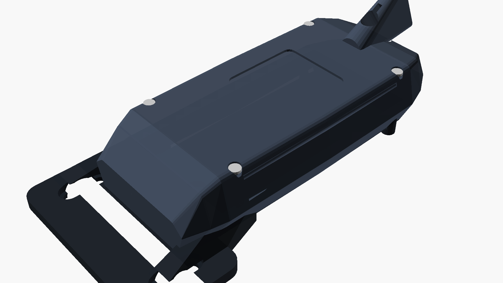

*Figure 8.29-Aero: CAD detailed view of the redesigned two-piece Rallye Aero-Balcony (`adventure_rack_tail_mount.scad`). Displayed are the rising wedge silhouette, 15° tumblehome with 45° stone-deflector undercuts, the form-fitting bodywork cowl (`adventure_rack_tail_cowl.stl`) with integrated 45° Shark-Fin for the 2.4 GHz dipole antenna, 140° zenith window for GNSS/LoRa, and the bionic teardrop radar pylon on the underside.*

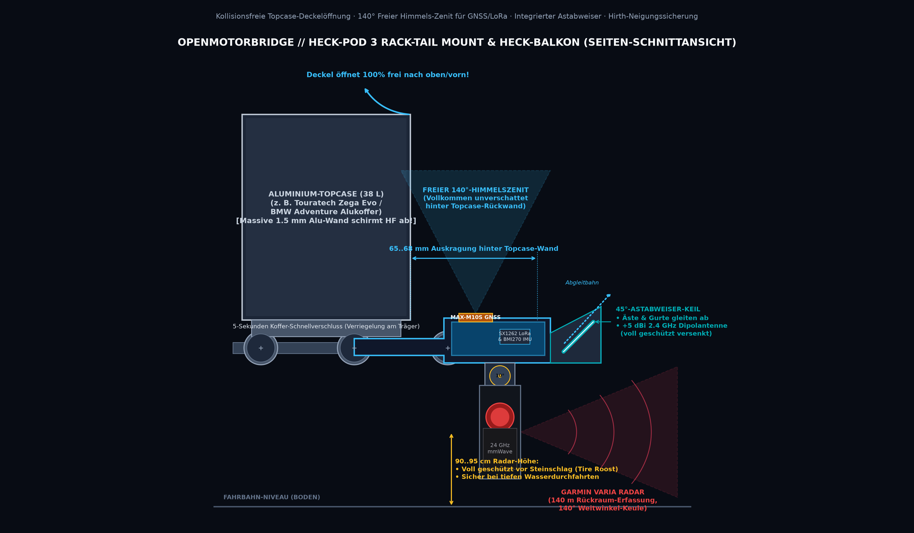

*Figure 8.29a: CAD cutaway cross-section of the Rear Pod 3 Rack-Tail Mount ("Tail Balcony") on the BMW GS luggage rack. Depicted are the secure mounting to the Ø 18 mm stainless steel tubes, 100% full lid clearance of the 38L aluminum topcase, 65..68 mm cantilever overhang ensuring clear 140° sky zenith coverage (MAX-M10S GNSS / LoRa), 45° deflector fin with recessed 2.4 GHz +5 dBi dipole antenna, and underside mounting of the Garmin Varia mmWave radar at 90..95 cm road clearance.*

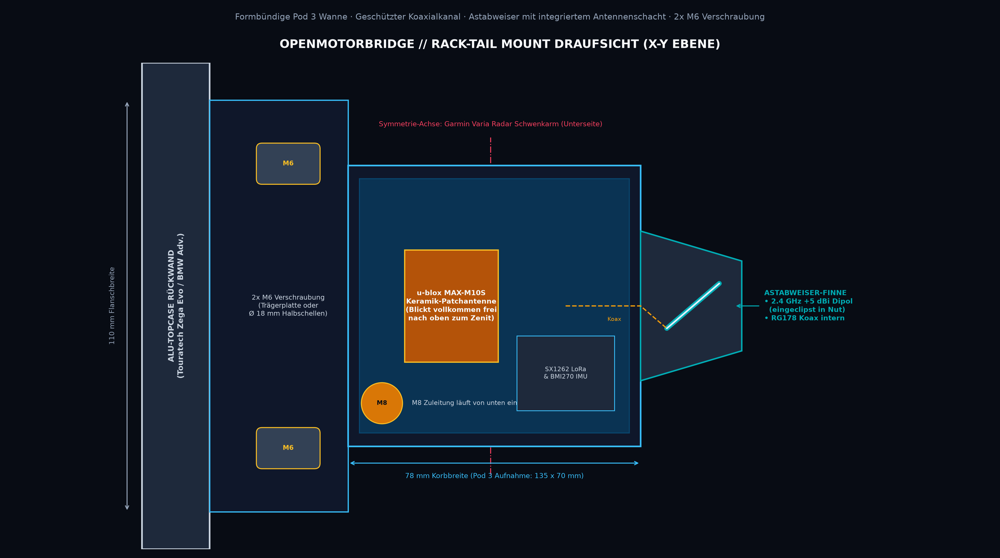

*Figure 8.29b: CAD top view (X-Y plane) of the Tail Balcony with 110 mm mounting flange, 2x M6 slotted holes for tube clamps, form-fitting Pod 3 tub (136.5 x 71.5 mm), concealed underside M8 cable entry, internal RG178 coaxial duct, and 45° PA12-CF deflector fin with snap-in groove for the 2.4 GHz antenna.*

##### Mechanical & RF Core Advantages:
1. **100% Preservation of Topcase Quick-Release (5-Second Latch):**
   * The cantilever bolts to the luggage rack or adapter plate—**not to the topcase itself**.
   * The topcase can be removed in seconds. Pod 3, antenna, and radar stay on the motorcycle for full tracking during solo rides without luggage.
2. **Collision-Free Lid Opening:**
   * Because the bracket cantilevers immediately below the lower case seam, topcase lids open forward or swing sideways without contact.
3. **Platform-Independent Interface:**
   * Identical geometry for standard GS, GS Adventure, Africa Twin, and KTM 1290 Super Adventure.
4. **Sensor Protection & Dual Lock Mechanism:**
   * Radar sits at 90..95 cm height, far above tire spray and roost.
   * **Dual Lock Mechanism (Vibration Lock + Theft Deterrence):**
     Standard GoPro friction joints and Garmin quarter-turn mounts are insufficient on severe washboard or during roadside parking. OpenMotorBridge implements a dual locking system:

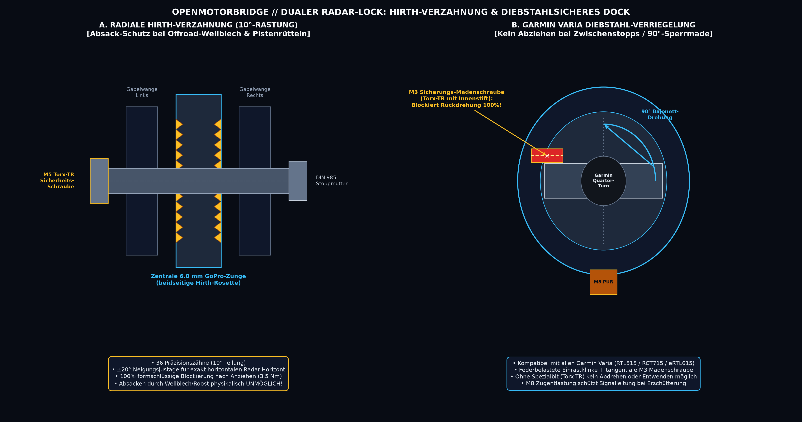

*Figure 8.29c: Dual Radar Lock featuring a positive 36-tooth radial Hirth rosette (10° indexing pitch preventing vibration-induced tilt sag on washboard tracks) and anti-theft Garmin quarter-turn bayonet dock with concealed M3 security grub screw (preventing quick grab-and-run theft at roadside stops).*

* **Vibration & Sagging Protection (Radial Hirth Coupling):** Clevis cheeks and GoPro tongue feature a 36-tooth radial Hirth rosette ([`011_gopro_hirth_lock.scad`](../../hardware/cad/scad/02_pod_base/parts/011_gopro_hirth_lock.scad)). Loosening the M5 security screw by 1–2 turns enables $10^\circ$ pitch leveling (compensating passenger and baggage sag). Once clamped, radar droop on corrugated washboard tracks is physically impossible.
* **Garmin Varia Anti-Theft Dock ([`radar_varia_gopro_lock_dock.scad`](../../hardware/cad/scad/02_pod_base/radar_varia_gopro_lock_dock.scad)):** Standard quarter-turn bayonet twists 90° into the dock. An internal retention pawl snaps in, and a concealed M3 Torx-TR grub screw blocks counter-rotation.

#### 6.4.3 Field Deployment of Magnetic Anti-Theft Lock on Expeditions

On exposed adventure bikes and remote expedition tracks (e.g. TET routes, alpine gravel passes, unattended fuel stops), the invisible magnetic locking mechanism specified in [Section 4.1](#41-system-kinematics-poka-yoke-auto-eject--invisible-magnetic-anti-theft-lock) safeguards swap cartridges:
* **100% Dust, Mud & Ice Proof:** Lacking keyholes or external sliding latches, the mechanism is hermetically sealed inside the pod wall and immune to mud pack, river crossings, dust storms, and freezing rain.
* **Concealed Fast Release:** The rider touches the N52 keyfob to target circle $X = 64\,\text{mm}$, instantly ejecting the cartridge $15\dots 20\,\text{mm}$.

#### 6.4.4 Contactless Anti-Theft Protection & Emergency Release
* The contactless magnetic release and the silent pocket alarm pager are implemented globally in the universal [2-in-1 LoRa Smart-Keyfob (Enclosure Type D)](#7-type-d-2-in-1-lora-smart-keyfob--pager-smart_keyfob_pagerscad).

---

### 6.5 Universal Saddlebag Lid Dock (`saddlebag_lid_dock.scad`)

The universal Saddlebag Lid Dock ([`saddlebag_lid_dock.scad`](../../hardware/cad/scad/02_pod_base/saddlebag_lid_dock.scad)) was specifically developed for protected, vibration-proof, and 100% non-destructive interior mounting of satellite Pods 1 (Sena Mesh) and 2 (Cardo DMC) in hard saddlebags (Reference: Harley-Davidson One-Touch hard saddlebags 2014–2024+):


*Figure 8.30: 3D CAD visualization of the Saddlebag Lid Dock (`saddlebag_lid_dock.scad`). Visible are the inboard-oriented Torx mounting flange for OEM hinge screws, forward Dual-Port cable snout with strain relief (Port B USB-C pass-through & Port A M8 clearance), perimeter half-shell with EPDM strap slots, and upper drip lip shielding the cartridge entrance.*

#### 6.5.1 Zero-Drill Mounting & Mechanical Design
1. **OEM Mounting Point Utilization (Zero-Drill):**
   * The $4\,\text{mm}$ thick mounting flange picks up the two factory M5 / Torx T20 screws of the hinge/check-strap bracket (hole center spacing $52\,\text{mm}$).
   * Generous slotted holes ($\varnothing 5.6 \times 9.0\,\text{mm}$) accommodate manufacturing tolerances across ABS saddlebags.
   * **Zero holes drilled in the saddlebag:** The motorcycle and luggage remain 100% unmarred in original factory condition.
2. **Alternative / Additional Adhesive Mounting (3M VHB):**
   * Underside features four defined pockets ($18 \times 12 \times 0.8\,\text{mm}$) for 3M VHB acrylic foam tape.
3. **Half-Shell Architecture ($H = 26\,\text{mm}$):**
   * The $3\,\text{mm}$ thick PA12 cradle encloses the Pod 3 housing ($135 \times 70 \times 38\,\text{mm}$) form-fittingly up to half its height.
4. **Overhead Drip Lip Protection:**
   * An integrated **drip lip ($16 \times 2\,\text{mm}$ with $30^\circ$ roof angle)** deflects condensation or rainwater sideways when opening the lid in rain.

#### 6.5.2 Cable Routing, Switched Power & Mechanic-Proof MagSafe Breakaway

Wiring the saddlebag lid pods resolves the quintessential operational requirement of daily riding and dealership maintenance: **Switched continuous power without battery anxiety coupled with 100% non-destructive saddlebag removal ("Mechanic Safety")**.

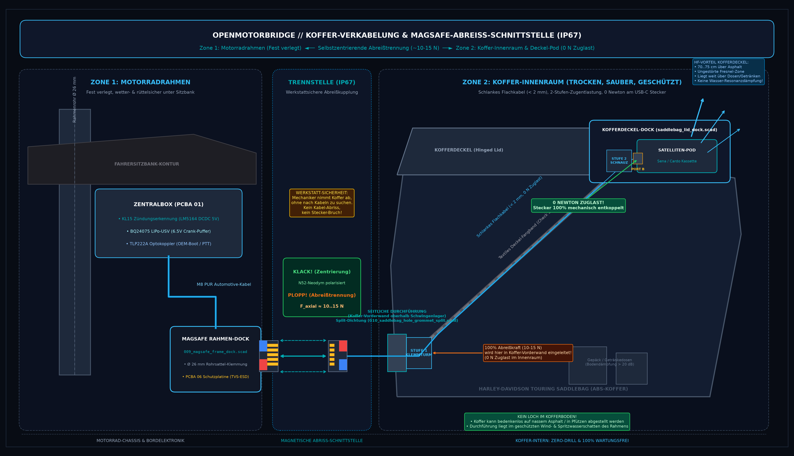

*Figure 8.30b: CAD system architecture of the saddlebag cable routing with self-centering MagSafe breakaway interface (IP67). Depicted are the switched 5V power supply from the Central Box (KL15/BQ24075 UPS), the stationary frame dock (`009_magsafe_frame_dock.scad`) with PCBA 06 TVS protection, the non-destructive magnetic breakaway separation (~10–15 N) during bag detachment, the side-wall pass-through on the forward bag wall (above the swingarm pivot) with split TPU grommet (`010_saddlebag_hole_grommet_split.scad`) and Stage 1 clamp tower (leaving the saddlebag floor 100% intact and puddle-proof), the zero-load ribbon cable routing along the check strap, and the Stage 2 strain relief at the lid dock ensuring 0 Newton dynamic load on USB-C Port B.*

1. **Intelligent Power Delivery & UPS Buffering via Central Box (Ignition KL15 / BQ24075):**
   * Saddlebag pods are not fed unregulated 12V bike power directly, but conditioned 5.0V from the Central Box beneath the seat.
   * **Ignition-Switched Wake-Up & Cold-Crank Buffering:** The Central Box senses switched 12V (KL15). The onboard LM5164-Q1 regulates clean 5.0V, while the integrated **LiPo UPS (BQ24075)** absorbs severe starter crank dips (down to 6.5V) within $8.5\,\mu\text{s}$—pods and transceivers never reboot during engine start.
   * **Automated OEM Headset Boot via Optocouplers:** Toshiba TLP222A solid-state optocouplers trigger the power-on sequences of the Sena/Cardo modules inside the cartridges automatically upon ignition.
2. **Mechanic-Proof 6-Pin MagSafe Breakaway Coupling (IP67):**
   * During routine service (tires, brakes, belt tensioning), dealership technicians unbolt the saddlebags and lift them off in seconds without checking for aftermarket wiring. A rigid plug would shear or tear immediately.
   * The **6-pin IP67 magnetic coupling with N52 neodymium magnets and gold-plated pogo pins** releases cleanly at approx. $10\dots 15\,\text{N}$ axial tension with **zero mechanical damage**.
   * Re-installing the saddlebag pulls the coupling self-centering back together with a magnetic snap (*"Klack"*), instantly restoring power and data links.
3. **Two-Zone Cable Architecture:**
   * **Zone 1 (External Bike Chassis):** Heavy-duty automotive-grade M8 PUR cable from Central Box to the frame dock.
   * **Zone 2 (Inside Saddlebag):** Ultra-slim, flexible silicone/ribbon wire ($< 2\,\text{mm}$ outer profile) running in the dry interior, taking zero luggage space.
4. **Adapter-Free Direct Connection to Pod Port B:**
   * The internal saddlebag cable routes along the textile check strap straight into the **USB-C Slim Port B** of the Pod baseboard. Port A (M8) remains capped inside the bag—zero redundant adapter boards or intermediate solder joints inside the bag.
5. **Two-Stage Strain Relief & Zero-Drill Floor Grommet ([`010_saddlebag_hole_grommet_split.scad`](../../hardware/cad/scad/02_pod_base/parts/010_saddlebag_hole_grommet_split.scad)):**
   * **Stage 1 (Floor Grommet):** A clamp tower molded into the split EPDM/TPU grommet anchors the cable at the 19 mm OEM hole, transferring 100% of magnetic breakaway forces ($10\dots 15\,\text{N}$) and luggage shifting shocks directly into the saddlebag floor.
   * **Stage 2 (Lid Dock):** A zip-tie tunnel in the 46 mm snout of the lid dock secures the cable $15\,\text{mm}$ before the plug.
   * **Result at Port B:** The USB-C connector experiences strictly **0 Newton dynamic or static strain**.

#### 6.5.3 RF Physics: Why Saddlebag Lids Beat Bag Floors
Mounting in the lid provides a $> 25\,\text{cm}$ elevated ground clearance, line-of-sight radiation through composite bag lids, and complete isolation from road heat.

#### 6.5.4 Stationary MagSafe Frame Dock (`009_magsafe_frame_dock.scad`) & Horizontal Clamshell Architecture


*Figure 8.31: 3D CAD view of the MagSafe Frame Dock (`009_magsafe_frame_dock.scad`). Visible: Upper case with integrated Ø 26 mm frame tube saddle and DIN 934 M3 nut pockets, center PCBA 06 protection board, lower case with half-shell cradles for M8 and MagSafe, upper clamp bracket (`009_magsafe_frame_clamp.stl`), and central M2.5 clamp bolt.*

1. **Stationary Bike-Side Docking:** Fixed to the frame tube beneath the side cover, providing safe pogo breakaway whenever the saddlebag is detached.
2. **Horizontal Clamshell Design:** Split along the central horizontal plane for water-tight assembly.

---

### 6.6 Decoupled License Plate Radar Bracket & Legal Compliance


*Figure 8.32: 3D CAD model of the decoupled license plate radar bracket with M6 clamping, M5 swivel hinge, and concealed rear M8 cable channel.*

---

### 6.7 Custom Bikes & Bobbers: Stealth Center Under-Fender Mount vs. Side License Plate Bracket

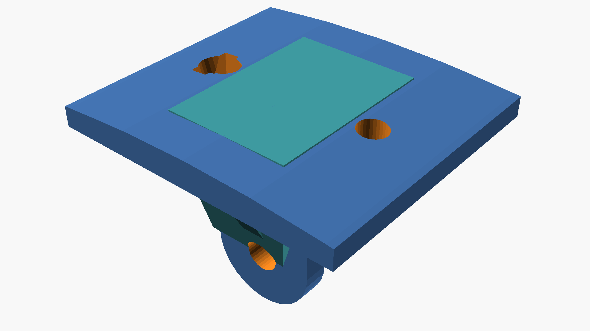

*Figure 8.33: 3D CAD model of the Stealth Center Under-Fender Mount (`radar_center_underfender_mount.scad`). Visible: curved base flange saddle plate ($R = 210\,\text{mm}$), ultra-compact clevis fork with radial 36-tooth Hirth coupling ($10^\circ$ indexing), and concealed M8 cable pass-through.*

#### 6.7.1 Why Side-Mounted Radar Is Inherently Hazardous (The 3 Critical Flaws)
1. Asymmetric detection blind spots on the offside.
2. Severe lean-angle ground dip (multipath reflections and false alarms in left-hand turns).
3. Extreme vibration amplification on long unsprung bracket arms.

#### 6.7.2 OpenMotorBridge Architecture: Rigid Centerline Alignment & Stealth Under-Fender Mount
The radar is strictly centered on the vehicle longitudinal symmetry axis and attached to the sprung chassis.

---

### 6.8 Support Vehicle, Van & Rally Kit (Reference Kit 5: Car Support Kit)

For professional deployment in support vehicles (sweep vans on guided motorcycle tours, breakdown service vehicles, organizer vans on Alpine passes) and automotive convoys (e.g., sports car rallies), **Reference Kit 5** constitutes a fully autonomous fleet management setup. It enables real-time monitoring of all participating motorcycles via the 868 MHz LoRa mesh without requiring cellular reception or cloud services.

Mechanically and ergonomically, the Car Support Kit relies on two custom-engineered CAD components:
1. The **Universal Sun Visor Clip for Pod 3** ([`car_sun_visor_pod3_clip.scad`](../../hardware/cad/scad/05_accessories/car_sun_visor_pod3_clip.scad) / [`car_sun_visor_pod3_clip.stl`](../../hardware/cad/stl/05_accessories/car_sun_visor_pod3_clip.stl))
2. The **Dashboard Wedge Dock for Central Control Box** ([`car_dashboard_wedge_dock.scad`](../../hardware/cad/scad/05_accessories/car_dashboard_wedge_dock.scad) / [`car_dashboard_wedge_dock.stl`](../../hardware/cad/stl/05_accessories/car_dashboard_wedge_dock.stl))

---

#### 6.8.1 Universal Sun Visor Clip for Pod 3 (`car_sun_visor_pod3_clip.scad`)

Modern passenger cars (wagons, SUVs, sedans, vans) rarely feature rigid rear parcel shelves, and their closed metal bodywork attenuates RF signals like a Faraday cage. Furthermore, the central windshield zone behind the rearview mirror is congested with massive ADAS camera and sensor modules (emergency brake radar, lane keep assist, rain sensors), preventing central windshield suction mounting.

The Universal Sun Visor Clip circumvents these obstacles via an asymmetric mount on the **passenger sun visor**:

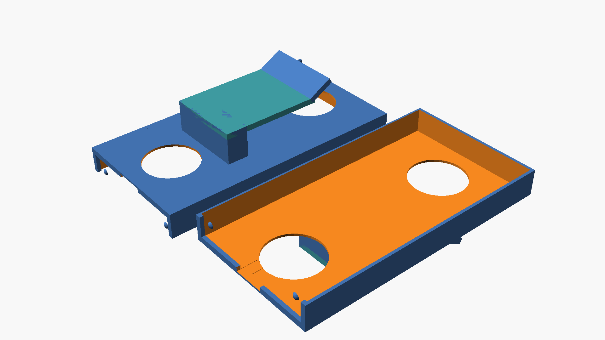

*Figure 8.33b: 3D CAD dual-perspective view of the Universal Sun Visor Clip for Pod 3 (`car_sun_visor_pod3_clip_cad.png`). Right: Upper Pod 3 docking cradle ($139 \times 73\,\text{mm}$) with lateral retention walls, corner spherical snap detents for positive vibration-proof retention, and forward cable exit channel. Left: Underside view depicting the solid U-channel bridge, compliant spring clamp tongue (14.5 mm rest gap for 14–22 mm visor thickness), transverse non-marring grip ribs, and 30° flared lead-in lip.*

* **Strict Separation of Docking Cavity and Clamp Tongue (100% Unobstructed Cavity):**
  * In the corrected geometry, the compliant spring clamp tongue is located strictly on the **exterior underside** ($Z \le 0$).
  * The upper receiving bed for Pod 3 is 100% open and unobstructed. Pod 3 presses into the cradle from above and locks securely into the lateral retaining lips and snap detents.
* **Universal Fit for All Automobile Sun Visors ($14\dots 22\,\text{mm}$):**
  * Printed in ductile PETG or tough PA12-MJF, the clamping tongue provides a $58\,\text{mm}$ reach and $42\,\text{mm}$ width.
  * A flared $30^\circ$ lead-in lip permits effortless one-handed sliding onto the visor.
  * Three rounded grip ridges guarantee zero slippage under chassis vibration without damaging delicate leather or fabric upholstery.
* **Hemispherical Skyward RF View ($180^\circ$ Line-of-Sight):**
  * Stationed at the upper windshield margin, Pod 3's antennas (u-blox MAX-M10S GNSS, 868 MHz LoRa SX1262, and 5.9 GHz V2X) transmit unobstructed through the windshield glass forward and upward.
  * No attenuation or reflections from metal roof skins or roof racks.
* **Stealth Anti-Theft Profile:**
  * Viewed from outside through tinted automotive glass, Pod 3 on the sun visor resembles a standard toll transponder (Telepass / FasTrak) or factory garage door opener, offering zero temptation to opportunistic thieves.

---

#### 6.8.2 Dashboard Wedge Dock for Central Control Box (`car_dashboard_wedge_dock.scad`)

For securing the Central Control Box ($110 \times 74 \times 32\,\text{mm}$) inside the vehicle cockpit, a form-fitting, vibration-isolated wedge dock was engineered:

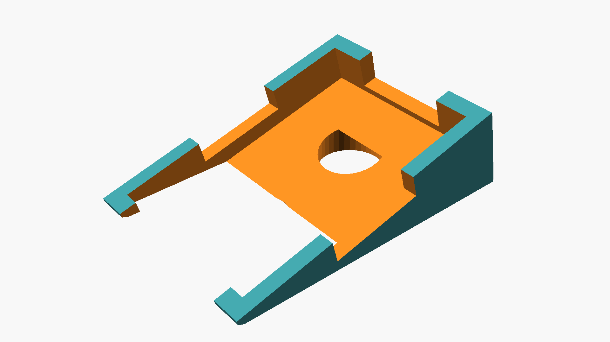

*Figure 8.33c: 3D CAD view of the Dashboard Wedge Dock for the Central Control Box (`car_dashboard_wedge_dock_cad.png`). Depicted are the ergonomic 15° forward tilt angle for glare-free LED visibility, the form-fitting dock pocket ($111 \times 75\,\text{mm}$), dual lateral finger extraction notches, rear passthrough for the 12V automotive power harness, and underside recesses for anti-slip silicone feet.*

* **Ergonomic $15^\circ$ Viewing & Operating Angle:**
  * When rested on horizontal dashboards or center console trays, the $15^\circ$ forward slope directs status LEDs and connector ports glare-free toward the driver/passenger.
* **Rapid Tool-Free Extraction (Dual Finger Notches):**
  * Two lateral finger notches ($40 \times 12\,\text{mm}$) enable instant one-handed insertion and removal of the Central Box—ideal when alternating between motorcycle and support vehicle.
* **Concealed Harness Routing & Convective Cooling:**
  * The rear wall features a generous $44\,\text{mm}$ harness cutout accommodating the 12V cigarette lighter PD adapter and HD26 harness whip.
  * Two underside openings ($\varnothing 28\,\text{mm}$) promote passive convective heat dissipation from the Central Box heatsink.
* **Vibration-Damped Non-Marring Base:**
  * The flat bottom features 4 circular pockets ($\varnothing 12 \times 1.5\,\text{mm}$) designed for standard 3M Bumpon silicone rubber bumpers or 3M VHB tape, preventing sliding and scuff marks on sensitive dashboard trim.

---

#### 6.8.3 Full System Architecture & Zero-Damage 5-Minute Vehicle Integration

The synchronized design of Reference Kit 5 enables quick, tool-free installation and removal in any rental car, support van, or chase vehicle:

```text
         OPENMOTORBRIDGE REFERENCE KIT 5 (CAR & SUPPORT-VAN TOPOLOGY)
 ┌────────────────────────────────────────────────────────────────────────┐
 │ Windshield Upper Zone:                                                 │
 │ [Passenger Sun Visor] ──> [car_sun_visor_pod3_clip] ──> [Pod 3 PCBA]   │
 │                            (100% Unshielded View Forward & Up)         │
 └───────────────────────────────────┬────────────────────────────────────┘
                                     │ Ultra-Thin Flat USB-C Cable
                                     ▼ (Concealed in Headliner & A-Pillar)
 ┌────────────────────────────────────────────────────────────────────────┐
 │ Dashboard / Center Console:                                            │
 │ [car_dashboard_wedge_dock (15°)] ──> [Central Box (ESP32-S3)]         │
 │       ▲                                   │                            │
 │       │ 12V/24V PD (30W)                  ├─► USB-C / BLE Offline PWA  │
 │ [Cigarette Lighter]                       │   (iPad / Android Tablet)  │
 │                                           ▼                            │
 │                                      [CarPlay / Android Auto Audio]    │
 └────────────────────────────────────────────────────────────────────────┘
```

1. **Concealed Flat-Ribbon Cable Routing (Zero-Damage):**
   * The thin 3 m flat USB-C cable tucks into the soft **headliner seam** above the windshield with fingertip pressure.
   * Runs down behind the soft rubber weatherstripping of the passenger A-pillar into the glovebox space and center console.
   * **Result:** Zero exposed wiring, zero drill holes, 100% reversible in under 3 minutes (perfect for rental or leased vans).
2. **Autonomous Power Supply:**
   * Powered directly via a standard 12V/24V cigarette lighter socket using a compact 30W USB-PD adapter.
3. **Off-Grid Fleet Live Tracking (PWA Fleet Dashboard):**
   * An iPad or Android tablet mounted on the passenger dashboard runs the OpenMotorBridge PWA in offline map mode.
   * Receiving real-time 868 MHz LoRa mesh telemetry, the sweep team tracks motorcycle positions, speeds, tire pressures, and crash/SOS alerts up to $15\,\text{km}$ away without cellular infrastructure.
4. **Infotainment & Vehicle Audio Integration:**
   * Connecting the Central Box to the vehicle's USB media port activates wired Apple CarPlay / Android Auto. Group voice intercom and audible safety alerts stream directly through the car's sound system.

---

## 7. Type D: 2-in-1 LoRa Smart-Keyfob & Pager (`smart_keyfob_pager.scad`)

The **OpenMotorBridge 2-in-1 Smart-Keyfob** ([`smart_keyfob_pager.scad`](../../hardware/cad/scad/05_accessories/smart_keyfob_pager.scad)) eliminates the drawbacks of traditional motorcycle transponders (weak coin cells, cold susceptibility, lack of return channel, and the need for separate mechanical release tools). It combines an ultra-strong N52 neodymium release key with an autonomous 868 MHz LoRa alarm pager inside an ergonomic, pocket-sized enclosure:

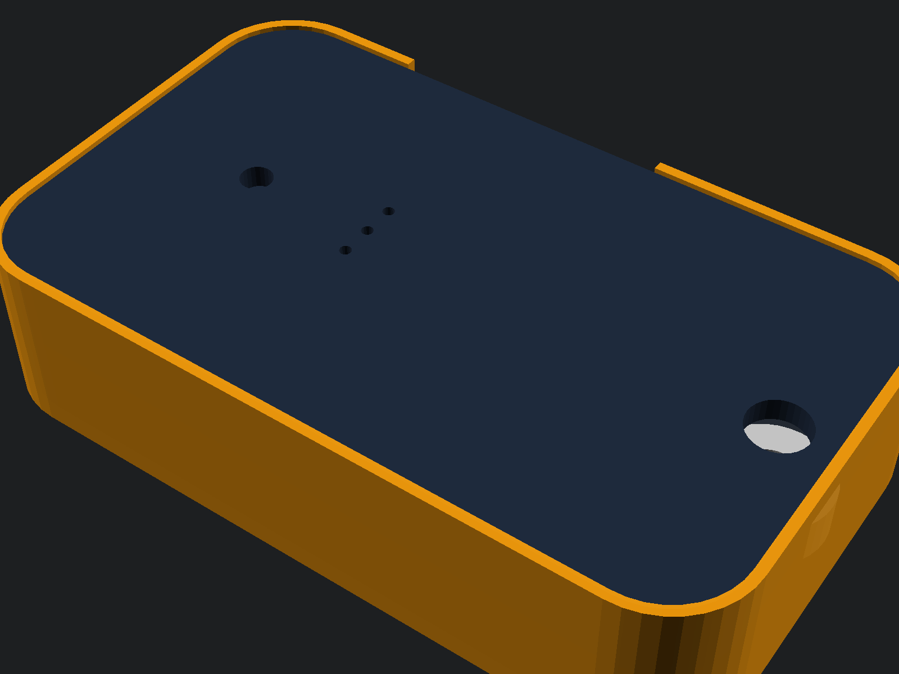

*Figure 8.34: 3D CAD overall view of the 2-in-1 LoRa Smart-Keyfob (`smart_keyfob_pager.scad`). Visible: ergonomically rounded PA12-MJF housing ($58 \times 34 \times 13\,\text{mm}$), perimeter orange TPU shock-absorbing bumper, 316L stainless keyring eyelet, and side-mounted N52 neodymium ejection key with tactile orientation rib.*

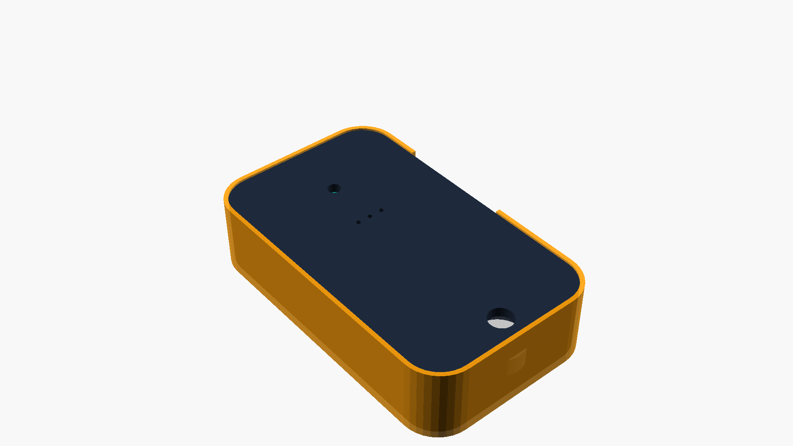

*Figure 8.35: 3D CAD exploded view of the Smart-Keyfob. From bottom to top: PA12-MJF lower shell with rear MagSafe alignment pocket, 180–200 mAh LiPo pouch cell ($25 \times 18 \times 3.8\,\text{mm}$), PCBA 07 carrier board ($38 \times 19\,\text{mm}$), Semtech SX1262 LoRa transceiver, LRA haptic motor, Mu-metal magnetic flux shield ($0.5\,\text{mm}$), N52 neodymium key block ($20 \times 10 \times 5\,\text{mm}$), and upper shell with optical diffuser aperture for the RGB status LED.*

### 7.1 Mechanical Architecture & Enclosure Parameters
* **Outer Dimensions:** $58.0 \times 34.0 \times 13.0\,\text{mm}$ (Length x Width x Thickness; lower shell $6.5\,\text{mm}$, upper shell $6.5\,\text{mm}$).
* **Materials & Manufacturing:** High-strength PA12 printed via HP Multi Jet Fusion (MJF), glass-bead blasted, chemically smoothed, and hydrophobically sealed.
* **Shock-Absorbing TPU Bumper:** Perimeter $0.8\,\text{mm}$ TPU-95A protective rim (Orange `#ff9f0a`) with side clearance for magnet contact. Reliably protects housing and internal electronics during drops onto asphalt from up to $2\,\text{m}$.
* **316L Stainless Steel Eyelet:** Solid keyhole bushing ($\varnothing 4.5\,\text{mm}$ ID, $3.5\,\text{mm}$ wall thickness) for standard motorcycle keyrings and carabiners.
* **Integrated N52 Neodymium Key Block ($20 \times 10 \times 5\,\text{mm}$):**
  * Press-fitted flush into the narrow lateral edge with a corrosion-resistant Ni-Cu-Ni triple plating (bright metallic finish, clearly depicted in the CAD renders) and equipped with a tactile North-pole index rib.
  * When brought within proximity of the $X = 64\,\text{mm}$ target circle on the Pod housing, the concentrated B-field ($B_r \approx 1.48\,\text{T}$) attracts the internal steel rocker anchor and trips the ejection springs.
* **0.5 mm Mu-Metal / Soft Iron Flux Shield:**
  * Positioned immediately behind the N52 magnet. Hermetically shields internal RF and battery components (SX1262 LoRa, Nordic BLE, LiPo cell) against magnetic flux saturation, directing 100% of magnetic force outward.
* **Silent Alarm Pager with LRA Haptic Motor:**
  * A $\varnothing 10 \times 3.6\,\text{mm}$ Linear Resonant Actuator (LRA) vibrates silently in the rider's jacket pocket upon tamper detection, jacking attempts, or unauthorized cassette prying.
* **MagSafe / Qi Inductive Charging:**
  * Rear face integrates a magnetic alignment ring ($\varnothing 28\,\text{mm}$ OD, $\varnothing 22\,\text{mm}$ ID). Snaps onto the cockpit dock (PCBA 06) during rides for automated wireless replenishment.
* **Zero-False-Alarm Presence Token:**
  * Proximity BLE beacon authenticates the legitimate owner. Tamper alarms are suppressed when the owner ejects the cartridge, triggering only during unauthorized physical prying attempts.

### 7.2 Architectural Decision: Why N52 Neodymium + LoRa + MagSafe over UWB / Active Servos?

| Criterion | Active Bluetooth / UWB Lock | N52 Permanent Magnet + LoRa Pager (OpenMotorBridge) |
| :--- | :--- | :--- |
| **Emergency Release with Dead Battery** | **Impossible** (Cartridge locked inside bike) | **100% Fail-Safe** (Permanent magnet requires zero battery power) |
| **Standby Current Consumption** | 15–45 mA (UWB drains keyfob cell in weeks) | **< 50 nA Standby** (Months of runtime, recharges on cockpit dock) |
| **Mechanical Reliability** | Miniature electric servo jams from road grime/grit | **Solid N52 Neodymium Block** (Indestructible, zero moving parts in key) |
| **Tamper Alarm Pager Range** | 10–30 m (BLE fails through hotel/garage walls) | **Up to 4.5 km** (Semtech SX1262 868 MHz penetrates reinforced concrete) |
| **False-Alarm Mitigation** | Pure shock sensors trigger false alerts | **Zero-False-Alarm:** Presence beacon verifies owner intent |

---

## 8. Cockpit Accessories & Ergonomic Controls (`05_accessories/`)

### 8.1 Under-Perch Tactile Switch Bracket (`under_perch_switch_bracket.scad`)

The **Under-Perch Switch Bracket** ([`under_perch_switch_bracket.scad`](../../hardware/cad/scad/05_accessories/under_perch_switch_bracket.scad)) resolves the critical space and ergonomic challenge on the left handlebar of cruisers and touring bikes:

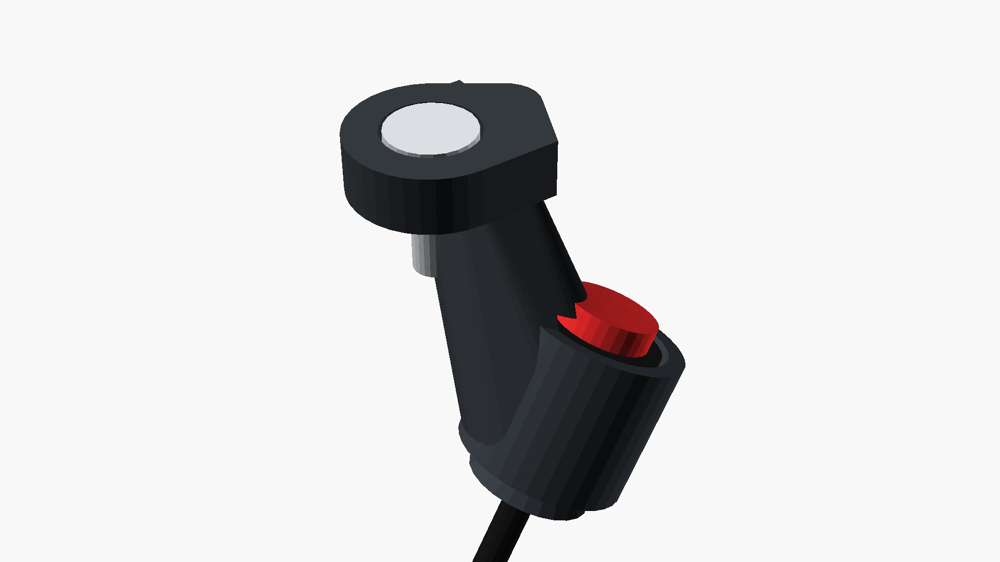

*Figure 8.36: 3D CAD view of the Under-Perch Tactile Switch Bracket (`under_perch_switch_bracket_cad.png`). Depicted are the M4 mounting flange with anti-rotation locating shoulder to the Harley switchgear, the bionic drop rib, the switch barrel angled 28° toward the rider's thumb pad with protective bezel, the red IP67 tactile micro-button, and the rear PUR cable exit conduit.*

* **Mechanical & Ergonomic Highlights:**
  * **0 mm Handlebar Space:** Consumes zero straight handlebar tubing. The upper master cylinder perch clamp remains **100% unobstructed for valved exhaust switches** (Dr. Jekill & Mr. Hyde / KessTech).
  * **Continuous 2-Finger Lever Covering:** Index and middle fingers remain uninterruptedly covering the clutch lever. The button is positioned exactly 15 mm below the left turn signal switch in the thumb's natural downward sweep.
  * **Universal Mounting:** Anchored either via the factory lower M4 Torx bolt of the Harley switch housing or through the M8/M10 mirror stem adapter plate ([`under_perch_mirror_plate.stl`](../../hardware/cad/stl/05_accessories/under_perch_mirror_plate.stl)).

### 8.2 Blind Spot Detection (BSD) Mirror Indicator Pod (`bsd_mirror_indicator_pod.scad`)

The **BSD Mirror Indicator Pod** ([`bsd_mirror_indicator_pod.scad`](../../hardware/cad/scad/05_accessories/bsd_mirror_indicator_pod.scad)) aerodynamically integrates rear radar alerts (Port `J9` on Front Node PCBA 05) into the rider's peripheral cockpit vision:

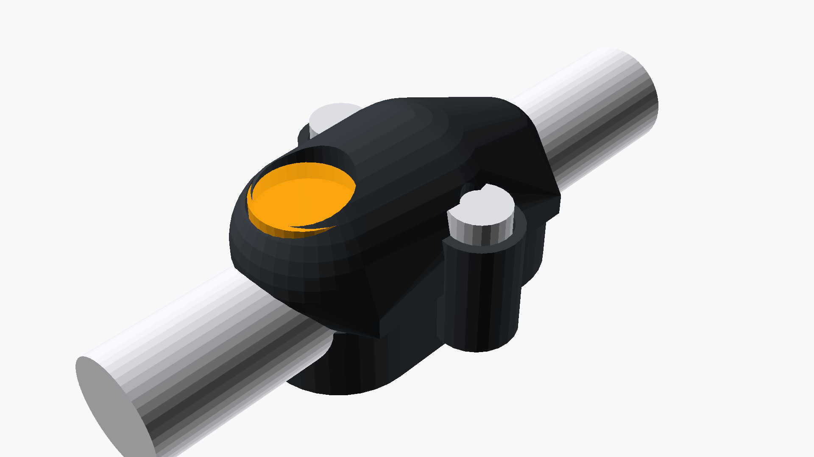

*Figure 8.37: 3D CAD view of the aerodynamic BSD Mirror Indicator Pod (`bsd_mirror_indicator_pod_cad.png`). Visible: low-drag teardrop shape on the Ø 10 mm mirror stem, 2-point M3 stainless clamp collar, 38° inward-angled anti-glare visor hood, and amber translucent diffuser lens.*

### 8.3 Radar 2.0 mmWave Winged Housing & Garmin Bayonet (`radar_mr20_housing.scad`)

The **Radar 2.0 Winged Housing** ([`radar_mr20_housing.scad`](../../hardware/cad/scad/05_accessories/radar_mr20_housing.scad)) integrates the Wheeltec MR20 77-GHz mmWave radar transceiver, the routed carrier board PCBA 08 (featuring 36-LED visual warning wings and ESP32-C5 Dual-Band Sub-MCU), the Garmin Quarter-Turn Bayonet interface, and an autonomous 5.9 GHz ITS-G5 (V2X) ceramic patch antenna:

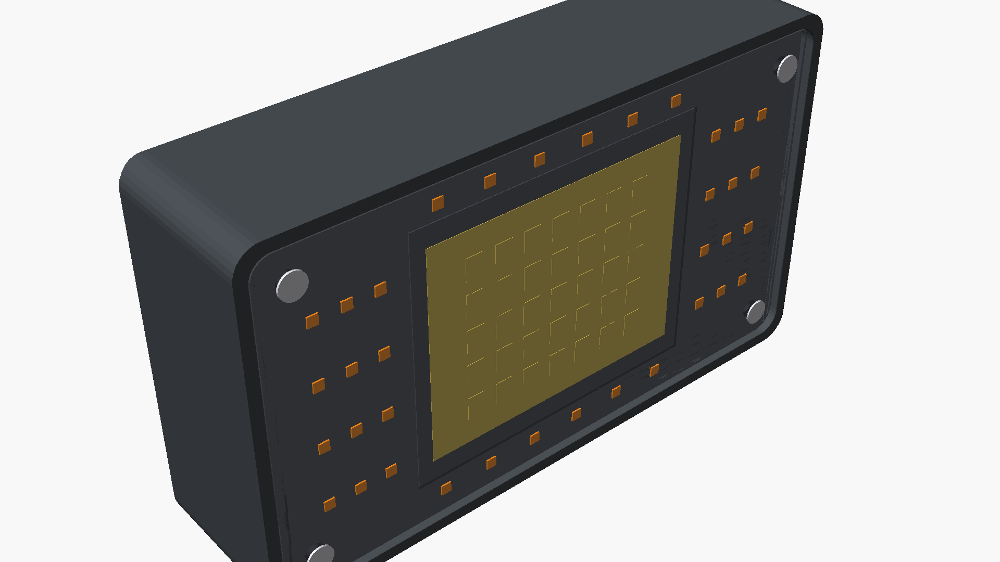

*Figure 8.38: 3D CAD front view of the Radar 2.0 Winged Housing (`radar_mr20_housing_cad.png`). Visible: symmetrical $121 \times 71 \times 34\,\text{mm}$ PA12-MJF monocoque enclosure, flat optical polycarbonate radome window ($116 \times 66 \times 1.6\,\text{mm}$) with 4x M2.5 Torx corner fasteners, centered $61 \times 51\,\text{mm}$ radar cutout for the MR20 77-GHz horn array, dual-side LED warning wing chambers, and left-side dedicated antenna cradle for the 5.9 GHz V2X ceramic patch antenna.*

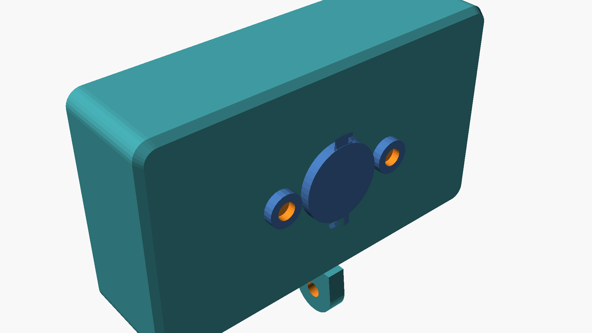

*Figure 8.38b: 3D CAD rear view of the Radar 2.0 Housing (`radar_mr20_housing_bayonet_cad.png`). Depicted are the monolithic Garmin Quarter-Turn male bayonet lug (compatible with `radar_varia_gopro_lock_dock.scad` and standard Garmin Varia mounts), the compliant snap-lock anti-theft detent, the symmetrical M4 threaded insert bolt pattern ($40\,\text{mm}$ center spacing), and the centered Binder Series 707 M5 IP67 bulkhead connector bore on the floor.*

* **Key Architectural & RF Features:**
  * **Symmetrical Winged Rectangle ($121.0 \times 71.0 \times 34.0\,\text{mm}$):** Aerodynamic airfoil profile blending seamlessly with motorcycle license plate brackets and rear fender arches.
  * **Garmin Quarter-Turn Bayonet with Anti-Theft Snap Lock:** Tool-free 90° twist lock. An integrated compliant latch detent prevents accidental road-vibration twist-off and deters casual opportunistic theft.
  * **5.9 GHz V2X Ceramic Patch Antenna Chamber:** Monolithically molded cradle on the left flank houses either $20 \times 20\,\text{mm}$ or $25 \times 25\,\text{mm}$ ceramic patch antennas. Guarantees maximum antenna gain with zero enclosure attenuation and zero internal PCB antenna ground detuning.
  * **Generous Cavity for Cable Adapter & Harness Loops ($112 \times 62 \times 17\,\text{mm}$):** Seamlessly encloses the original MR20 in-line breakout board and harness loops with zero wire pinching.
  * **Optical Polycarbonate Radome & IP67 Sealing:** Flat, untextured PC radome ($116 \times 66 \times 1.6\,\text{mm}$) with perimeter EPDM cord groove provides zero RF insertion loss at 77 GHz and IK08 impact resistance.

### 8.4 Road Glide ST Sharknose: Through-Fairing Inductive Cam Dock (`road_glide_inductive_cam_dock.scad`)

The **Through-Fairing Inductive Cam Dock** ([`road_glide_inductive_cam_dock.scad`](../../hardware/cad/scad/05_accessories/road_glide_inductive_cam_dock.scad)) solves the problem of continuous power delivery to action cams (Insta360 X3/X4, GoPro Hero, DJI Osmo Action) mounted on Harley Sharknose fairings **with zero drilled holes and zero visible external wiring**:

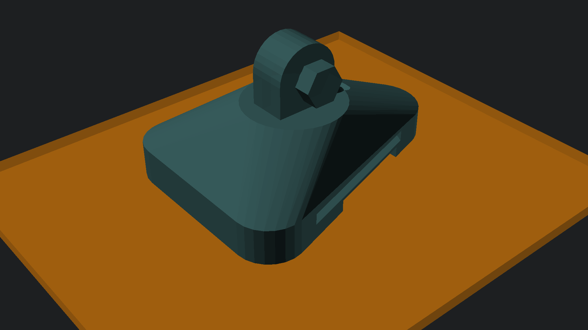

*Figure 8.39: 3D CAD system view of the Through-Fairing Inductive Cam Dock (`road_glide_inductive_cam_dock_cad.png`). Visible: 15W Qi transmitter tray (underside, concealed inside inner fairing), dielectric ABS fairing deck (center amber shell), aerodynamic teardrop outer dock with 3M Dual Lock base, integrated TI BQ51013B Qi receiver, and universal 3-prong camera mounting clevis.*

#### 8.4.1 Two-Piece Architecture & Action Cam Interfaces

```text
 ┌────────────────────────────────────────────────────────┐
 │ Action Cam (Insta360 X3/X4 / GoPro Hero / DJI Action)  │
 │ [USB-C Charge Port] ◄──────────────────────────────┐   │
 └────────┬───────────────────────────────────────────│───┘
          │ Standard 2-Prong Action Cam Base          │
          ▼                                           │ 30 mm USB-C
 ┌────────────────────────────────────────────────────│───┐
 │ ROAD GLIDE INDUCTIVE CAM DOCK (EXTERIOR)           │   │
 │ • Monolithic 3-prong clevis (M5 clamping bolt)     │   │
 │ • TI BQ51013B step-down converter (5V / 2A) ───────┘   │
 │ • Qi receiver coil (RX) with ferrite shield            │
 └────────────────────────┬───────────────────────────────┘
                          │ 3M Dual-Lock SJ3550 interlocking tape
                          ▼ (instant tool-free release)
 ══════════════════════════════════════════════════════════
  Harley-Davidson ABS Fairing Deck (2.8 mm, zero drill holes!)
   ~ ~ ~ Alternating Magnetic Flux (15W Qi Inductive IPT) ~ ~ ~
 ══════════════════════════════════════════════════════════
                          ▲ (3M VHB 5952 interior bonding)
 ┌────────────────────────┴───────────────────────────────┐
 │ INNER CRADLE (Concealed inside fairing behind headlamp)│
 │ • 15W Qi transmitter coil (TX)                         │
 │ • Power lead to Front Node Port 1 (12V PD)             │
 └────────────────────────────────────────────────────────┘
```

1. **Mechanical Camera Attachment:**
   * **Monolithic 3-Prong Clevis (Universal Action Cam / GoPro Standard):** Directly molded atop the teardrop dock tower is the standard 3-prong action-cam hinge. Any common camera (GoPro Hero 10–13, DJI Osmo) or 360° cage (e.g. Insta360 X3/X4 utility frame) locks into place with a standard M5 thumbscrew.
   * **Captive M5 Acorn Nut Pocket:** A hexagonal recess on the left flank holds an M5 nut firmly in place, allowing one-handed tilt adjustment and locking.
   * **Optional 1/4"-20 Tripod Bushing:** The center core includes a pilot hole for an optional 1/4"-20 threaded brass insert, allowing cameras or ball heads to screw directly into the base.
2. **Electrical Continuous Power Interface:**
   * **Inductive Energy Conversion:** The embedded Qi receiver coil couples magnetically through the $2.8\,\text{mm}$ factory ABS fairing. The internal TI BQ51013B controller rectifies and steps down the power to clean, stable $5\,\text{V} / 2\,\text{A} = 10\,\text{W}$ DC.
   * **Ultra-Short USB-C Pigtail ($30\dots 50\,\text{mm}$):** An upward-angled exit port routes a thin, flexible USB-C ribbon cable with a 90° right-angle connector directly into the camera's weather door.
   * **Zero Wind Flutter:** Because the cable spans only $\approx 3\,\text{cm}$ directly beneath the camera port, it hugs the housing snugly—preventing buffeting, slapping against paint, or wind noise in the microphone.
3. **Field Experience & Benefits on Tour:**
   * **100% Factory Paint Preserved:** Completely drill-free, zero paint damage, 100% weatherproof (IP67).
   * **Infinite Recording Time:** Keeps the internal camera battery at 100% even during continuous high-bitrate 5.7K/60fps 360° recording (e.g., functioning as an always-on dashcam).
   * **Quick Tool-Free Detachment:** Unplug the USB-C right-angle jack, pull the dock firmly upward off the 3M Dual-Lock mushrooms, and pocket the camera and dock in seconds when parked.

---

## 9. CAD File Structure & OpenSCAD Parametric Library (STL Library)
 
The OpenMotorBridge CAD repository follows a strict hierarchical Constructive Solid Geometry (CSG) architecture:
- **Root Directories (`01_main_box/`, `02_pod_base/`, `03_pod_cartridges/`, `04_front_node/`, `05_accessories/`)**: Contain **exclusively monolithic, directly 3D-printable production STLs** (100% single-manifold, watertight, 0 disconnected bodies).
- **Subdirectories (`components/`)**: Contain parametric modular subcomponents (e.g. un-cut solid base bodies, mounting ears, screw bosses, EPDM sealing combs, and PCB/battery inspection dummies) for assembly visualization and custom adaptations.

### 9.1 Ready-to-Print Production STLs (Root Folders)

| Assembly | Component / Function | Ready-to-Print STL | Parametric OpenSCAD Source |
| :--- | :--- | :--- | :--- |
| **Central Box** | Lower tub with seal groove & mounting ears | `01_main_box/main_box_lower_case.stl` | `01_main_box/00_lower_deck.scad` |
| **Central Box** | Upper case with mid-tray partition | `01_main_box/main_box_mid_tray.stl` | `01_main_box/01_upper_deck.scad` |
| **Central Box** | Enclosure lid with Gore vent recess | `01_main_box/main_box_lid.stl` | `01_main_box/02_colsure.scad` |
| **Satellite Pod**| 5-sided monocoque housing (tunnel) | `02_pod_base/pod_base_housing.stl` | `02_pod_base/pod_base_housing.scad` |
| **Satellite Pod**| CVO ST Under-Cowl Skeleton Dock | `02_pod_base/cvo_st_undercowl_skeleton_dock.stl` | `02_pod_base/cvo_st_undercowl_skeleton_dock.scad` |
| **Satellite Pod**| CVO ST Telemetry Fin (2.4 GHz Mesh) | `02_pod_base/cvo_st_telemetry_fin.stl` | `02_pod_base/cvo_st_telemetry_fin.scad` |
| **Satellite Pod**| Road King Special Touring Fender Console | `02_pod_base/pod3_touring_fender_console.stl` | `02_pod_base/pod3_touring_fender_console.scad` |
| **Satellite Pod**| Touring Saddlebag Lid Dock (Pods 1 & 2) | `02_pod_base/saddlebag_lid_dock.stl` | `02_pod_base/saddlebag_lid_dock.scad` |
| **Adventure Pod 3**| Rallye Aero-Balcony Base Cradle (Cantilever Tray) | `02_pod_base/adventure_rack_tail_mount_base.stl` | `02_pod_base/adventure_rack_tail_mount.scad` |
| **Adventure Pod 3**| Rallye Aero-Balcony Bodywork Cowl (with Shark-Fin) | `02_pod_base/adventure_rack_tail_cowl.stl` | `02_pod_base/adventure_rack_tail_mount.scad` |
| **Adventure Pods 1/2**| GS Transition Dock Base Cradle (Waist Crease Lower Tub) | `02_pod_base/adventure_transition_dock_base.stl` | `02_pod_base/adventure_transition_dock.scad` |
| **Adventure Pods 1/2**| GS Transition Dock Bodywork Cowl (Waist Crease Top Lid) | `02_pod_base/adventure_transition_dock_lid.stl` | `02_pod_base/adventure_transition_dock.scad` |
| **Adventure Pods 1/2**| GSA Heavy-Duty Cage Dock Body (Ø 18 mm Tube) | `02_pod_base/adventure_gsa_cage_dock_body.stl` | `02_pod_base/adventure_gsa_cage_dock.scad` |
| **Adventure Pods 1/2**| GSA Heavy-Duty Clamp Cap (Ø 18 mm Tube) | `02_pod_base/adventure_gsa_clamp_cap.stl` | `02_pod_base/adventure_gsa_cage_dock.scad` |
| **Adventure Pods 1/2**| GSA Pannier Rack Clamp Base (Minimal Option) | `02_pod_base/adventure_pannier_rack_clamp_base.stl` | `02_pod_base/adventure_pannier_rack_clamp.scad` |
| **Adventure Pods 1/2**| GSA Pannier Rack Clamp Cap (Minimal Option) | `02_pod_base/adventure_pannier_rack_clamp_cap.stl` | `02_pod_base/adventure_pannier_rack_clamp.scad` |
| **Frame Dock** | MagSafe Frame Dock Upper Shell (Tube Saddle, Wings & M2.5 Nut-Pocket) | `02_pod_base/components/009_magsafe_frame_dock.stl` | `02_pod_base/parts/009_magsafe_frame_dock.scad` |
| **Frame Dock** | MagSafe Tube Clamp Strap (Ø 26 mm) | `02_pod_base/components/009_magsafe_frame_clamp.stl` | `02_pod_base/parts/009_magsafe_frame_dock.scad` |
| **Frame Dock** | MagSafe Frame Dock Lower Shell (PCB Ledge & M2.5 Counterbore) | `02_pod_base/components/009_magsafe_frame_lid.stl` | `02_pod_base/parts/009_magsafe_frame_dock.scad` |
| **Radar Mount** | Decoupled License-Plate Radar Bracket | `02_pod_base/radar_license_plate_bracket.stl` | `02_pod_base/radar_license_plate_bracket.scad` |
| **Radar Mount** | Stealth Center Under-Fender Radar Mount (Custom / Bobber) | `02_pod_base/radar_center_underfender_mount.stl` | `02_pod_base/radar_center_underfender_mount.scad` |
| **Cartridge** | Universal base sled with O-ring groove | `03_pod_cartridges/cartridge_base_sled.stl` | `03_pod_cartridges/00_base_sled.scad` |
| **Cartridge** | Sena 50S/60S adapter sled | `03_pod_cartridges/cartridge_insert_sena.stl` | `03_pod_cartridges/parts/01_insert_sena.scad` |
| **Cartridge** | Cardo Packtalk Edge adapter sled | `03_pod_cartridges/cartridge_insert_cardo.stl` | `03_pod_cartridges/parts/02_insert_cardo.scad` |
| **Cartridge** | IP67 Blank dry box insert dummy | `03_pod_cartridges/cartridge_insert_blindkassette.stl` | `03_pod_cartridges/parts/03_insert_blindkassette.scad` |
| **Cartridge** | OMM Dipole Antenna Bracket | `03_pod_cartridges/cartridge_antenna_bracket_omm.stl` | `03_pod_cartridges/parts/04_antenna_bracket_omm.scad` |
| **Front Node** | Lower tub with 4-in-1 base & mounting ears | `04_front_node/front_node_lower_tub.stl` | `04_front_node/00_front_node_tub.scad` |
| **Front Node** | Upper lid with LED tunnel & FPC antenna pocket | `04_front_node/front_node_upper_lid.stl` | `04_front_node/01_front_node_lid.scad` |
| **Front Node** | EPDM/TPU cable glands (pair with sprue runner) | `04_front_node/front_node_cable_glands_tpu.stl` | `04_front_node/02_front_node_cable_glands.scad` |
| **Front Node** | TPU USB-C protective sealing plug | `04_front_node/front_node_usbc_cap_tpu.stl` | `04_front_node/03_front_node_usbc_plug.scad` |
| **Smart-Keyfob** | PA12-MJF Lower Shell with MagSafe Pocket | `05_accessories/smart_keyfob_lower_shell.stl` | `05_accessories/smart_keyfob_pager.scad` |
| **Smart-Keyfob** | PA12-MJF Upper Shell with Diffuser Bore | `05_accessories/smart_keyfob_upper_shell.stl` | `05_accessories/smart_keyfob_pager.scad` |
| **Smart-Keyfob** | TPU Shock Bumper Rim (Orange) | `05_accessories/smart_keyfob_tpu_rim.stl` | `05_accessories/smart_keyfob_pager.scad` |
| **Switch Bracket**| Under-Perch Switch Bracket for M4 Harley Switchgear | `05_accessories/under_perch_switch_bracket.stl` | `05_accessories/under_perch_switch_bracket.scad` |
| **Switch Bracket**| Mirror Stem Adapter Plate (M8/M10) | `05_accessories/under_perch_mirror_plate.stl` | `05_accessories/under_perch_switch_bracket.scad` |
| **Mirror Radar** | BSD Mirror Indicator Pod Upper Cowl (38° Tunnel) | `05_accessories/bsd_mirror_upper_pod.stl` | `05_accessories/bsd_mirror_indicator_pod.scad` |
| **Mirror Radar** | BSD Mirror Clamp Strap Lower Halfshell (Ø 10 mm) | `05_accessories/bsd_mirror_lower_clamp.stl` | `05_accessories/bsd_mirror_indicator_pod.scad` |
| **Mirror Radar** | BSD Diffuser Lens Disc (Amber / Translucent) | `05_accessories/bsd_mirror_lens.stl` | `05_accessories/bsd_mirror_indicator_pod.scad` |

### 9.2 Modular Component Breakdowns & Dummies (`components/` Folders)

The `components/` directories host isolated base bodies (prior to CSG difference operations) and inspection parts:
- **`01_main_box/components/`**: `01_lower_tub_empty.stl`, `02_corner_screws_enclosure.stl`, `03_pcb_standoffs.stl`, `04_mounting_ears.stl`, `05_sealing_groove.stl`, `06_mid_tray_frame.stl`, `07_mid_partition_floor.stl`, `08_lid_plate.stl`, `dummy_main_pcb.stl`, `dummy_lipo_battery.stl`.
- **`02_pod_base/components/`**: `01_pod_tunnel_base.stl`, `02_pod_rear_m8_gland.stl`, `03_pod_bulkhead_partition.stl`, `04_pod_guide_grooves.stl`, `05_pod_strap_hooks.stl`, `06_fender_curved_saddle.stl`, `07_pod_slide_dock_core.stl`, `011_gopro_hirth_lock.stl` (Radial Hirth lock), `dummy_m8_connector.stl`.
- **`03_pod_cartridges/components/`**: `dummy_adapter_pcb.stl`, `dummy_omm_transceiver_pcb.stl`.
- **`04_front_node/components/`**:
  - `01_front_node_base_tub.stl`: Monolithic solid base tub with hollowed inner chamber (CSG base cube).
  - `02_pcb_standoffs.stl`: 4x M2.5 threaded boss standoffs for PCBA05.
  - `03_mounting_ears.stl`: 2x M4/M5 silentblock flange mounting ears.
  - `dummy_front_node_pcb.stl`: 3D inspection dummy of PCBA05 with component envelope heights.

---

## 10. Manufacturing Specifications & 3D Printing Parameters (HP MJF vs. FDM)

### 10.1 Industrial Production (HP MJF PA12)
* **Process:** HP Multi Jet Fusion (MJF), dyed black, glass-bead blasted, and chemically vapor smoothed.
* **Tolerances:** $\pm 0{,}15\,\text{mm}$ (DIN ISO 2768-m).
* **Mechanical Properties:** Isotropic tensile strength $48\,\text{MPa}$, heat deflection temperature $+95\,^\circ\text{C}$, 100% airtight and watertight.

### 9.2 Prototyping on Desktop FDM (Bambu Lab / Prusa / Voron)
* **Filaments:** ASA or PETG (PLA strictly prohibited due to heat distortion under seat).
* **Perimeters:** 4 to 5 wall lines ($1{,}6\dots 2{,}0\,\text{mm}$ solid shell).
* **Infill:** $25\dots 40\,\%$ Gyroid pattern.
* **Extrusion Multiplier:** $102\dots 104\,\%$ to seal layer micro-porosity.
