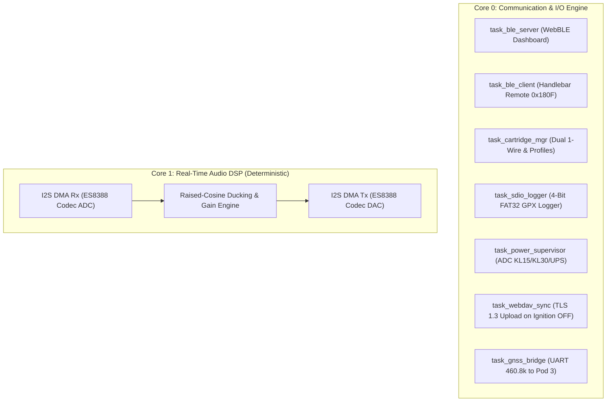

# 09 - Firmware Architecture (C++ / FreeRTOS / ESP-IDF v5.x)

## 1. Dual-Core Task Distribution

## 2. Deterministic FreeRTOS Priorities
- `task_audio_dsp` (Priority 24, Core 1): Dedicated real-time processing.
- `task_gnss_bridge` (Priority 18, Core 0): Fast UART ring buffer drain.
- `task_power_supervisor` (Priority 15, Core 0): 100 ms ADC telemetry sampling.
- `task_sdio_logger` (Priority 10, Core 0): Block writes to SDIO card.
- `task_ble_server` & `task_ble_client` (Priority 8, Core 0): NimBLE event pump.
