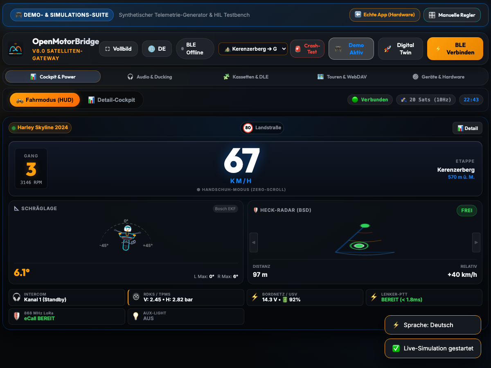
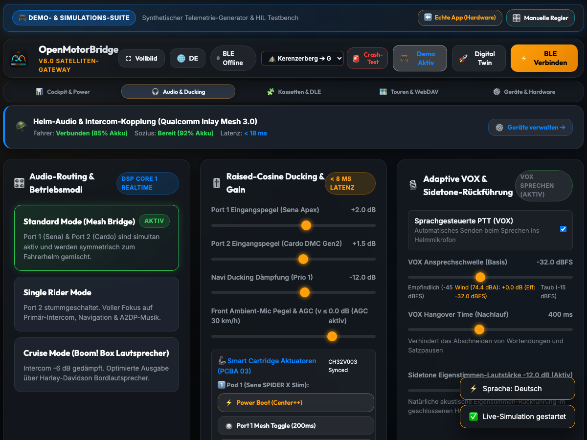
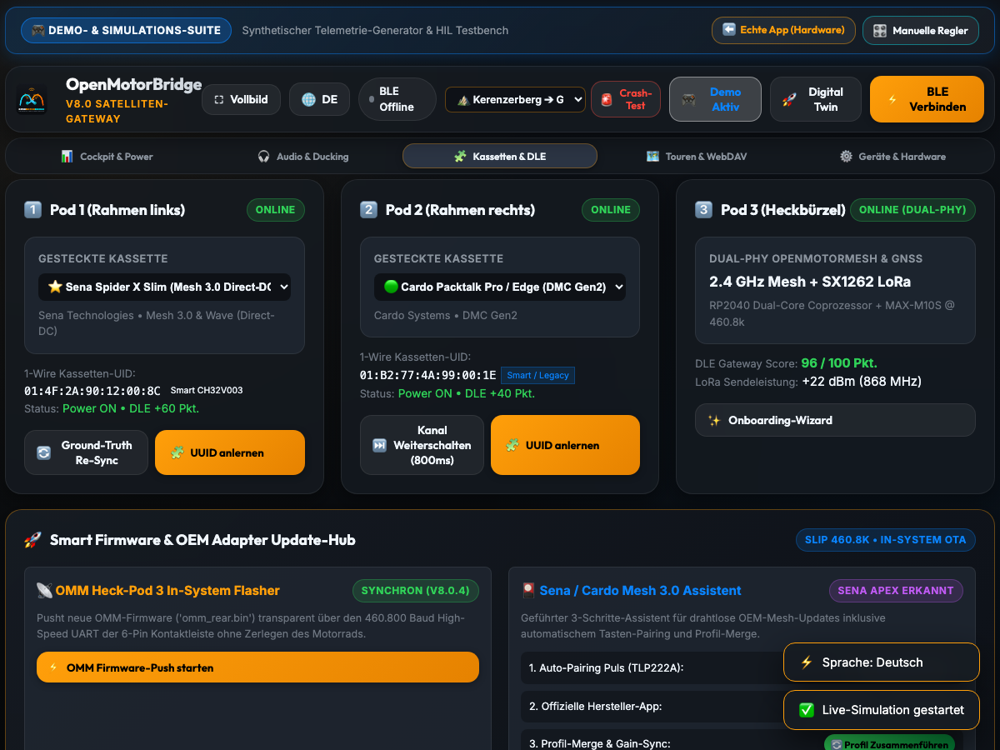
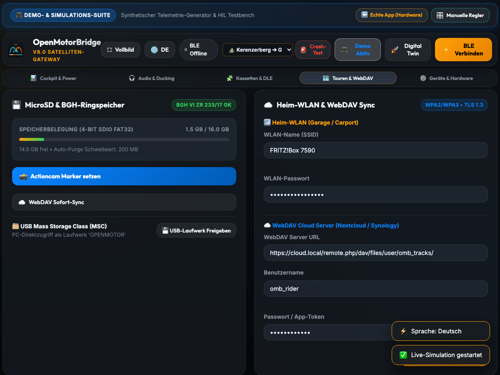
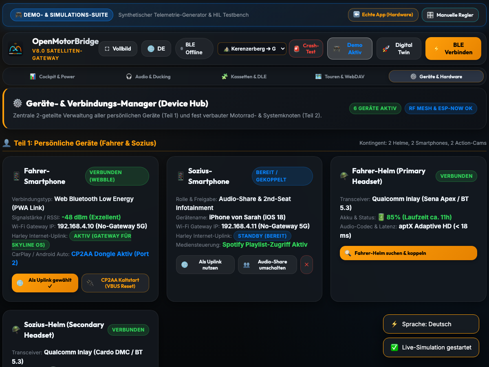

# 10 - WebApp PWA & Dashboard Operation

This document specifies the architecture of the standalone **Progressive Web App (PWA) Dashboard**, the Web Bluetooth (WebBLE) communication layer, local **IndexedDB offline storage**, the control interface for the **Universal Front Node** (1-click CarPlay hard reboot, wind noise VU meter, Auto-Café countdown), and the **advanced GPX export engine** (Navi Shaping Points & Video Telemetry).

---

## 1. Architecture & Offline Capability

The dashboard is a fully self-contained Progressive Web App (PWA) built with standard HTML5, modern vanilla CSS3 (Glassmorphism theme), and modular ES6 JavaScript. The application communicates directly with the ESP32-S3 via the Web Bluetooth API (WebBLE)—completely free of cloud dependencies:

- **Local Offline Storage (IndexedDB):** GPX rides can be downloaded via BLE directly from the internal MicroSD card and stored persistently in the browser's `omb_tours_db`.
- **Service Worker Caching:** Employs a cache-first strategy for smooth offline operation on iOS and Android.

### 1.1 Platform Compatibility

| Platform | Recommended Browser | Connection Details |
| :--- | :--- | :--- |
| **Android / PC / Mac / Linux** | **Google Chrome, MS Edge, Opera** | **Native:** Direct Web Bluetooth support under HTTPS or `http://localhost`. |
| **Apple iOS / iPadOS** (iPhone, iPad) | **[Bluefy – Web BLE Browser](https://apps.apple.com/app/bluefy-web-ble-browser/id1492822055)** | **Required:** Apple restricts WebBLE in WebKit/Safari. Bluefy provides a standard-compliant bridge using Apple CoreBluetooth. |

### 1.2 Native Android Companion App & Google Play Store (TWA / Native Companion)
For riders who prefer installation directly via the Google Play Store, automated background services, or zero-touch Bluetooth reconnection, the official Android application identity is reserved in the Google Play Console:
* **App Name:** `OpenMotorBridge`
* **Package Name / Application ID:** `bar.f0o.omb`
* **Integration & Architecture Paths:**
  1. **Trusted Web Activity (TWA):** Lightweight Android wrapper package leveraging Chrome Custom Tabs and Google Digital Asset Links (`.well-known/assetlinks.json`). Delivers 1-click Google Play installation, full-screen immersive rendering without browser chrome, and native Web Bluetooth performance with zero maintenance overhead compared to the PWA.
  2. **Native Foreground Service (BLE Auto-Reconnect & Background Sync):** Optional native companion service with a persistent sticky notification (*"OpenMotorBridge Active"*). Maintains a rock-solid BLE GATT link to the Central Box even when the smartphone is locked in a riding jacket pocket, initiates automated GPX trip logging upon ignition ON, and dispatches eCall crash telemetry without foreground app launch requirements.
  3. **Integrated Internet Uplink Proxy (Layer-5 SOCKS5 / HTTP Relay):** Functions as a transparent local uplink proxy for the Front Node (PCBA 05) and OEM head units (such as Harley Skyline OS / Boom! Box GTS for HERE real-time traffic data).
     * **Zero VPN Conflicts:** Operates strictly at application layer (L5 POSIX sockets) and consumes **no** Android `VpnService` slot. Always-on VPNs such as **Tailscale** (used for smart home access / *Homesphere* / Home Assistant) remain 100% active and unhindered.
     * **No Hotspot Requirement:** Eliminates the need to manually toggle the battery-draining phone Wi-Fi hotspot; head unit telemetry requests route silently through the companion app via 4G/5G cellular data.
     * **Automated Cloud & WebDAV Synchronization:** Telemetry data, battery health, and completed GPX tours can be synced automatically to private clouds or MQTT brokers live during rides or upon ignition cutoff.

---

## 2. Dashboard Navigation & Functional Tabs

```
┌────────────────────────────────────────────────────────────────────────────────────────┐
│                        OPENMOTORBRIDGE PWA DASHBOARD NAVIGATION                        │
├─────────────────┬─────────────────┬──────────────────┬────────────────┬────────────────┤
│ 📊 Cockpit &    │ 🎧 Audio &      │ 🧩 Cartridges &  │ 🗺️ Tours &     │ ⚙️ Hardware &   │
│    Power        │    Ducking      │    DLE           │    WebDAV      │    Reserve     │
└─────────────────┴─────────────────┴──────────────────┴────────────────┴────────────────┘
```

### 2.1 Tab 1: Cockpit & Power (`#tab-cockpit`)



* **Vehicle Dynamics & Lean Angle:** Real-time animated motorcycle attitude indicator (15-state EKF with Bosch BMI270).
* **Universal Front Node Dashboard Card:**
  * **Link Status:** Live 2.4 GHz ESP-NOW wireless status badge.
  * **Subsystem Tiles:**
    1. **📱 Wireless CarPlay / AA (Ottocast):** Live voltage & current (`5.00 V · 380 mA`), operating status (`ACTIVE`, `REBOOT`, `STANDBY`).
    2. **⚡ Handlebar PTT (Zero-Latency):** Status indicator (`< 1.8 ms Latency`) with glowing pulse animation when keying (1x = radio, 2x = cam toggle, long = HiLight tag).
    3. **🎙️ Cockpit Noise (Knowles MEMS):** Real-time sound pressure level in $\text{dB(A)}$ and dynamic AGC helmet boost (`+0.0 dB` to `+6.0 dB Boost`).
    4. **🎥 Action Cam BLE Bridge (GoPro / Insta360 / DJI):** Camera model (`GoPro Hero 12` / `Insta360 X4`), battery level (%), remaining SD time, pulsing red REC badge.
  * **Wind Noise VU Meter:** Color-coded level bar ($35\,\text{dB(A)}$ idle to $115\,\text{dB(A)}$ highway).
  * **Interactive Controls:**
    * **`⚡ CarPlay 1-Click Hard Reboot (2.5s)`:** Triggers a hardware power cycle on the TI TPS2051B switch (2.5s VBUS cutoff with countdown animation).
    * **`🔘 Test Handlebar PTT`:** Simulates mechanical button presses with tactile feedback.
    * **`🎥 Cam Start/Stop & HiLight`:** Manual touch shutter toggle and highlight tag button for action cameras.
    * **`Fuel-Stop Filter (KL15)` Toggle:** Automatically cuts recording upon ignition off to avoid empty parking/fuel stop footage.
    * **`Auto-Café Mode (60s)` Toggle:** Automatically cuts VBUS after ignition OFF to release smartphone Wi-Fi for café/hotel networks.
* **Rear Radar & Blind-Spot Assistant (BSD HUD Card):**
  * **Status Badges:** Real-time threat classification (`CLEAR`, `⚠️ VEHICLE CLOSING IN`, `🚨 COLLISION RISK!`) and hardware link (`GARMIN VARIA / 24 GHz M8`).
  * **Virtual Mirror Warning LEDs (BSD):** Left (`#bsd-mirror-left`) and right (`#bsd-mirror-right`) mirror indicators with live distance readout and pulsing animations (Amber / Red) when an approaching vehicle enters the close-range blind-spot zone ($d < 15\,\text{m}$).
  * **Central Rear Radar Sector (HTML5 Canvas):** $40^\circ$ downward fanning radar beam with range rings ($25\,\text{m}$, $50\,\text{m}$, $100\,\text{m}$, $140\,\text{m}$), animated sweep ray, and dynamically tracked vehicle blips showing distance and $\Delta v$ tags.
  * **4 Telemetry Metric Tiles:** Closest object distance ($d$), relative approach speed ($\Delta v$), Time-To-Collision ($\text{TTC}$), and helmet audio ducking status ($-18\,\text{dB}$ Prio-1).
  * **Interactive Controls:**
    * **`🚗 Simulate Approach`:** Triggers a 10-second overtaking simulation of an approaching car ($120\,\text{m} \rightarrow 8\,\text{m}$, $+42\,\text{km/h}$) with automated threat escalation and helmet chime.
    * **`🔔 Test Warning Chime`:** Synthesizes the dual-tone alert ping ($880\,\text{Hz} / 1760\,\text{Hz}$) via the Web Audio API.
    * **`Acoustic Helmet Alert` Toggle:** Mutes/unmutes the radar warning chimes.

### 2.2 Tab 2: Audio & Ducking (`#tab-audio`)



* **Mode Selector:** Standard Mode (Mesh Bridge), Single Rider Mode, Cruise Mode.
* **Sliders:** Input sensitivity for Port 1 (Sena) and Port 2 (Cardo), Ducking depth, and Transparency volume.
* **🦾 Smart Cartridge Mechatronic Control Panel (PCBA 03 Rev 2.0):**
  * Live status indicator of the Cartridge MCU (CH32V003 Synced).
  * `⚡ Power Boot`: Dispatches Opcode `0x01` (`Center + (+)` held for 1,000 ms) for automatic cold-booting after storage $> 3$ days.
  * `🔘 Mesh On/Off`: Opcode `0x05` (200 ms short pulse).
  * `⏭️ Channel +1 / ⏮️ Channel -1`: Autonomous cartridge macros (`0x07` / `0x08`, 2x Mesh + 1x Plus/Minus).
  * `🔊 Vol Up / 🔉 Vol Down`: Single-button pulses (`0x03` / `0x04`, 100 ms) via dedicated actuators `ACT_PLUS` / `ACT_MINUS`.
  * `👥 Group Mesh`: 3,000 ms hold pulse (`0x06`) toggling between Open Mesh and private Group Mesh.

### 2.3 Tab 3: Cartridges & DLE (`#tab-cartridges`)



* **Live Slot Status:** Visual display of active cartridges in Slot 1 and Slot 2 with 1-Wire UIDs (emulated by MCU or physical DS2401).
* **Smart Cartridge Badging:** Highlights hardware architecture (RISC-V CH32V003, 4x MOSFETs, In-System Flashing active).
* **Cartridge Onboarding Wizard:** 3-step interactive pairing guide for newly detected cartridges.
* **Ground-Truth Sync & ISP Flashing:** Autonomous re-flashing of profile tables directly into the Cartridge MCU EEPROM via Pin 5 single-wire UART.

### 2.4 Tab 4: Tours & WebDAV (`#tab-tours`)



* **Tour History:** Tabular list of all recorded GPX rides with dates, distances, and peak lean angles.
* **GPX Export Engine:** Download rides in 4 optimized formats (Moto-Navi Shaping, Video-Sync, Clean Track, Raw EKF).
* **WebDAV Configuration:** Server credentials and automatic background sync for Nextcloud/Synology NAS.

### 2.5 Tab 5: Device & Connection Manager (Device Hub • `#tab-hardware`)



The Device Manager is organized into two distinct sections:

#### Part 1: Personal Devices (Rider & Pillion)
* **Rider & Pillion Smartphones:** WebBLE connection status, signal strength (RSSI), 1-click cold restart of the CarPlay/AA dongle (TPS2051B VBUS power-cycle), and pillion audio sharing toggle.
* **Dual-Headset Hub (Rider & Pillion):** Bluetooth audio manager for Schuberth/Sena, Cardo DMC, and generic BT headsets (LC3/aptX codecs, battery level, discovery scan).
* **Dual Action Cam Hub:** Management for GoPro (Hero 11/12/13), Insta360 (X3/X4/Ace), and DJI cameras with auto-REC, fuel-stop pause filter, and PTT-triggered HiLight tagging.
* **2-in-1 LoRa Smart-Keyfob (Alarm Pager & Cartridge Key):**
  * AES-128 GCM encryption verification & monotonic sequence counter.
  * BLE near-field presence detection (zero false alarms during legitimate cartridge swaps).
  * `[Test Alarm (LRA)]`: Dispatches an emergency haptic vibration pattern to the pager.
  * `[Re-pair Keyfob]`: Initiates fresh cryptographic key exchange over docking contacts/BLE.
  * `[Buddy Alarm]`: Forwards theft alerts automatically over the decentralized LoRa group mesh.

#### Part 2: Motorcycle & OpenMotorBridge System Nodes
* **Universal Front Node (Cockpit Hub • PCBA 05):** ESP-NOW wireless status, Wi-Fi SoftAP fallback toggle, and proximity-rescue beacon.
* **Rear Radar & Mirror Blind-Spot LEDs (BSD):** Master power switch and mirror indicator controls (Header `J9` via MOSFET `Q1`) with a 2-second diagnostic flash.
* **Safety Lighting Management:**
  * **ESS Emergency Brake Strobing:** Master toggle for 4.5 Hz hazard flashing (Garmin Varia UART2 & `RESERVE_GPIO_B`), configurable deceleration threshold ($-0.45\,\text{g}$, $-0.60\,\text{g}$, $-0.75\,\text{g}$), and `[Brake Strobe Test]` button.
  * **Auxiliary Driving Lights (J11 on Front Node via TPS1H100):** Modes `[OFF]`, `[ALWAYS-ON]`, and `[AUTO-STROBE ON ESS]`.
* **Tire Pressure Monitoring System (TPMS):** Real-time pressure and temperature telemetry from BLE valve caps (FOBO / Deelife) with an interactive learning wizard.
* **Vehicle CAN Profile Manager & Hex Sniffer:** Community vehicle profile selector (Harley, BMW, KTM, Ducati, OBD2) and interactive live sniffer with ID filtering and CSV export.
### 2.6 Smart Docking & Single-Edge Ride Mode Transition (User Override Protection)

When the rider's smartphone is plugged in or mounted to the cockpit dock (Qi `J10`, Handlebar USB `J5`, or Glove Box `J5_MP3`), the WebApp intelligently transitions the dashboard:

* **Single-Edge Transition:**
  * Auto-switching to `#tab-cockpit` (Ride Mode) triggers **strictly on the rising edge** of the charging status (transition from `charging == false` to `charging == true`).
  * **User Override Protection:**
    * If the rider deliberately taps Settings, Media, or Diagnostics after docking, the WebApp remembers this manual selection and **never forces a redirect back to the Cockpit** while the phone remains docked. The state machine never fights the user!
    * Only upon a full undock-and-redock cycle or upon ride departure (speed $v > 5\,\text{km/h}$) does auto-focusing re-engage.
* **App Settings Configurable Toggle:**
  * Configurable under Tab 5 (Settings): `[x] Automatically switch to Cockpit on smartphone docking (Default: Active)`.
* **"Phone Left-Behind" Alert Logic (Handlebars & Glove Box):**
  * If the Central Box detects `KL15 == 0` (Ignition OFF) while the Qi dock or USB port still senses a seated device, and the rider's BLE signal fades ($d > 3\,\text{m}$), the system alerts immediately:
  * Two rapid horn chirps on the motorcycle and a vigorous LRA tactile vibration pattern on the Smart-Keyfob notify the rider before walking away.

### 2.7 Architectural Division: Hardware Cockpit (`index.html`) vs Simulation Suite (`demo.html`)
* **`index.html` (Production Cockpit):** Clean instrument dashboard for actual motorcycle rides (`window.OMB_MODE = 'hardware'`). Fully stripped of simulation controls; all telemetry widgets cleanly display `Standby` / `--` when disconnected.
* **`demo.html` (Interactive Simulation Suite):** Dedicated presentation and HIL testbench (`window.OMB_MODE = 'demo'`) with sticky banner, alpine route selector (Wil SG $\rightarrow$ Ricken Pass, Kerenzerberg), eCall crash simulation, and expandable **live injection panel** (real-time sliders for speed, lean angle, radar blips, TPMS, and emergency braking).

### 2.8 Cognitive Cockpit Decluttering & Strict Riding Display Silence (v > 0)

A smartphone screen mounted to a motorcycle handlebar (6.1" to 6.7") offers severely constrained screen real estate compared to a 10.25" automotive cluster. An inadvertent banner popup in the rider's peripheral vision immediately triggers an involuntary glance reflex (*saccade*). At high lean angles in a curve's apex or under hard braking, this causes hazardous blind flight and target fixation.

* **Zero-Distraction Principle in Motion ($v > 0$):**
  * **Strict Ban on Non-Safety Push Notifications:**
    * Traffic jam alerts, road closures, weather radar text summaries, and group fuel alerts are **strictly forbidden** from displaying as pop-ups or animated banners while moving.
    * No modal dialogs ever overlay speed, lean angle, or rear radar widgets.
* **Division of Responsibility: Navigation vs. Cockpit Telemetry:**
  * Turn-by-turn routing, dynamic traffic rerouting, and road closure handling belong exclusively inside the **dedicated navigation application** (Apple CarPlay / Android Auto via PCBA 05 Front Node, Kurviger, Calimoto, or Garmin).
  * The navigation engine calculates alternate routes silently in the background and delivers concise voice cues over the helmet intercom (*"In 300 meters, turn right"*). The rider never needs to parse text congestion reports while riding.
* **Information Delivery Exclusively at Standstill ($v = 0\,\text{km/h}$):**
  * Only when the motorcycle comes to a **complete stop for at least 5 seconds** ($v = 0\,\text{km/h}$ at a red traffic light, railroad crossing, or scenic stop) does the PWA present a calm, static informational summary card (local weather trend, upcoming regional closures).
  * The instant the motorcycle begins rolling ($v > 3\,\text{km/h}$), the display immediately and silently reverts to the minimalist primary ride cockpit.

---

## 3. Advanced GPX Export & Navigation Formatting

The integrated export engine transforms raw 10 Hz telemetry logs into 4 specialized destination formats:

```
┌─────────────────────────────────────────────────────────────────────────────┐
│                       OMB GPX EXPORT ENGINE FORMATS                         │
├───────────────────┬───────────────────────────────┬─────────────────────────┤
│ Format Profile    │ Target Applications           │ Key Features            │
├───────────────────┼───────────────────────────────┼─────────────────────────┤
│ **1. Moto-Navi**  │ Garmin Zūmo XT/XT2, BMW CRN,  │ • Road-Snapping (OSM)   │
│    **(Shaping)**  │ Kurviger, Calimoto, TomTom    │ • Strategic shaping pts │
│                   │                               │ • Garmin `<gpxx:>` Ext  │
├───────────────────┼───────────────────────────────┼─────────────────────────┤
│ **2. Video-Sync** │ Telemetry Overlay, VIRB Edit, │ • 10 Hz 1-PPS Timecode  │
│    **(HiFi EKF)** │ Dashware, Insta360, GoPro     │ • Lean angle (degrees)  │
│                   │                               │ • Video highlight tags  │
├───────────────────┼───────────────────────────────┼─────────────────────────┤
│ **3. Clean Track**│ Google Earth, Komoot, Relive, │ • Douglas-Peucker RDP   │
│    **(Visual)**   │ Strava, Apple/Google Maps     │ • Compact file size     │
├───────────────────┼───────────────────────────────┼─────────────────────────┤
│ **4. Raw EKF**    │ Engineering Analysis, MATLAB, │ • Complete IMU & CAN    │
│    **(Diagnose)** │ RaceChrono                    │   sensor logs unfiltered│
└───────────────────┴───────────────────────────────┴─────────────────────────┘
```
