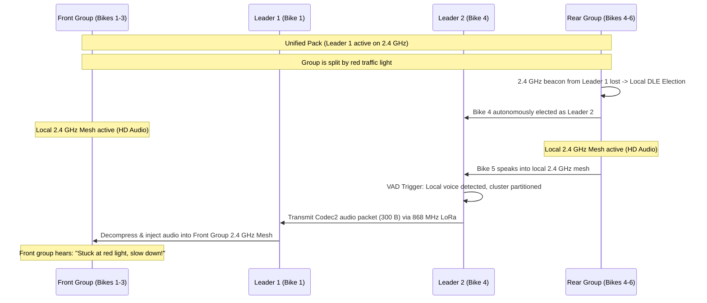

# 11 - OpenMotorMesh (OMM) - Protocol Stack, DLE, Adaptive QoS & Cluster Relay

OpenMotorMesh (OMM) is a hierarchical, low-latency mesh routing protocol designed for highly dynamic motorcycle groups in ad-hoc operation (868 MHz LoRa & 2.4 GHz IEEE 802.15.4 / LTE-Sidelink PHY). It adapts cellular principles from **3GPP LTE/5G Sidelink (C-V2X / ProSe)** and **IEEE 802.11s Mesh** to provide seamless voice and telemetry forwarding even across partitioned riding groups.

---

## 1. Physical Layer (PHY) & Dual-PHY Architecture (2.4 GHz & 868 MHz)

OpenMotorMesh employs an intelligent **Dual-PHY hierarchy** combining high bandwidth in close proximity with extreme range across terrain:

```
┌─────────────────────────────────────────────────────────────────────────────┐
│                   DUAL-PHY HIERARCHY IN OPENMOTORBRIDGE                     │
├──────────────────────────────────────┬──────────────────────────────────────┤
│ 1. PROXIMITY: 2.4 GHz LTE-Sidelink   │ 2. LONG-RANGE: 868 MHz LoRa (Pod 3)  │
│ (Intra-Cluster / Proximity < 500m)   │ (Inter-Cluster & Fallback 1 - 15 km) │
├──────────────────────────────────────┼──────────────────────────────────────┤
│ • 10 ms Superframe (SC-FDMA TDMA)    │ • Semtech SX1262 LoRa (+22 dBm PA)   │
│ • Full-Duplex HiFi Voice (Opus SILK) │ • Narrowband PTT Voice (Codec2)      │
│ • Stereo Music-Sharing & Navi-Ducking│ • Continuous GPS Group Radar         │
│ • 100% Duty-Cycle allowed            │ • ETSI 1% / 10% Duty-Cycle compliant │
└──────────────────────────────────────┴──────────────────────────────────────┘
```

### 1.1 2.4-GHz Proximity High-Speed PHY (SC-FDMA TDMA)
Proximity mesh adapts the architecture of LTE-ProSe/PC5 Sidelink for globally license-free 2.4 GHz ISM operation (100 mW EIRP):
1. **Modulation & Waveform (SC-FDMA / DFT-s-OFDM):**
   * Employs Single-Carrier FDMA to minimize Peak-to-Average-Power-Ratio (PAPR).
   * Low PAPR eases power amplifier (PA) strain, reduces thermal dissipation inside the IP67 enclosure, and maximizes fringe range.
2. **Channel Grid & TDMA Time Slotting:**
   * **Superframe (10 ms):** Modeled after LTE radio frames, divided into 10 subframes of 1 ms each (Slotted TDMA).
   * **Synchronization (Sync Beacon / SLSS):** The elected Cluster Leader transmits a Sidelink Synchronization Signal every 100 ms for slave clock alignment.
   * **Control Channel (PSCCH-Light):** Carries Sidelink Control Information (SCI) in Subframe 0 to announce active speakers and channel assignments.
   * **Payload Channel (PSSCH-Light):** Carries compressed Opus audio packets in Subframes 1 through 9.

   ```
   [Subframe 0: Sync/PSCCH Leader] ──► [Subframes 1..9: PSSCH Opus Audio Slots]
   ```
3. **Collision-Free Multiple Access:**
   * Slaves request transmit grants via short bursts in the control slot upon VOX or hardware PTT trigger.
   * The Cluster Leader allocates collision-free subframes, eliminating packet collisions even in packs of 30+ bikes.

### 1.2 868-MHz Sub-GHz Long-Range PHY (SX1262 LoRa in Rear Pod 3)
* **Long-Range Channel:** 868.0 – 868.6 MHz (EU ISM band, up to +22 dBm PA).
* **Purpose:** Serves as a continuous long-range backbone when 2.4 GHz mesh is out of reach and acts as a cross-gateway voice tunnel between partitioned riding groups.
* **Efficiency:** Transmits telemetry and ultra-compact Codec2 voice packets (1200 bps) with minimal power and strict ETSI duty-cycle compliance.

---

## 2. Layer 2: 802.11s-Light Loop-Prevention & Managed Forwarding
OpenMotorMesh implements core mechanisms from IEEE 802.11s (HWMP / Airtime Metric) directly on Layer 2:

```
 0                   1                   2                   3
 0 1 2 3 4 5 6 7 8 9 0 1 2 3 4 5 6 7 8 9 0 1 2 3 4 5 6 7 8 9 0 1
+-+-+-+-+-+-+-+-+-+-+-+-+-+-+-+-+-+-+-+-+-+-+-+-+-+-+-+-+-+-+-+-+
| Mesh Control  |   Hop Limit   |     Mesh Sequence Number      |
+-+-+-+-+-+-+-+-+-+-+-+-+-+-+-+-+-+-+-+-+-+-+-+-+-+-+-+-+-+-+-+-+
|                     Originator Node MAC                       |
|                       (Bytes 0..3)                            |
+-+-+-+-+-+-+-+-+-+-+-+-+-+-+-+-+-+-+-+-+-+-+-+-+-+-+-+-+-+-+-+-+
|  Originator MAC (4..5)        |      Target Node MAC (0..1)   |
+-+-+-+-+-+-+-+-+-+-+-+-+-+-+-+-+-+-+-+-+-+-+-+-+-+-+-+-+-+-+-+-+
|                      Target MAC (2..5)                        |
+-+-+-+-+-+-+-+-+-+-+-+-+-+-+-+-+-+-+-+-+-+-+-+-+-+-+-+-+-+-+-+-+
| Payload: 6LoWPAN / IPv6 Multicast / RTP / Opus Audio ...      |
```

### Layer-2 Frame Header Definition (C++ Struct)
```cpp
struct MeshHeader_t {
    uint8_t  meshFlags;     // Priority & Type Flags
    uint8_t  hopLimit;      // TTL Decrement per Hop (Loop Prevention)
    uint16_t meshSeqNum;    // Monotonic Sender Sequence ID
    uint8_t  originMac[6];  // Originator Node MAC
    uint8_t  targetMac[6];  // Multicast (ff:ff:...) or Unicast
} __attribute__((packed));

void onRawPacketReceived(uint8_t* rawData, size_t len) {
    if (len < sizeof(MeshHeader_t)) return;
    
    MeshHeader_t* meshHdr = (MeshHeader_t*)rawData;
    uint8_t* payload = rawData + sizeof(MeshHeader_t);
    size_t payloadLen = len - sizeof(MeshHeader_t);

    // 1. Layer-2 Loop & Duplicate Filter (802.11s Mesh Seq Filter)
    if (meshHdr->hopLimit == 0) return;
    if (checkAndRegisterL2Duplicate(meshHdr->originMac, meshHdr->meshSeqNum)) {
        return; // Duplicate discarded -> Saves CPU & Stack resources
    }

    // 2. Local Processing (Audio Playout)
    processL3Payload(payload, payloadLen);

    // 3. 802.11s Managed Forwarding: Relay packet if node is Relay Master
    if (currentRideMode == MODE_RELAY_AR) {
        meshHdr->hopLimit--;
        broadcastForward(rawData, len);
    }
}
```

---

## 3. Layer 3 & Layer 4: 6LoWPAN, IPv6 Multicast & Audio Streaming
- **Multicast Routing:** Voice packets are sent via IPv6 Multicast to group addresses (e.g. `ff02::1`). A single packet reaches all group members without unicast duplication overhead.
- **Header Compression (6LoWPAN, RFC 6282):** Compresses the 40-byte IPv6 header down to 2 to 4 bytes.
- **Addressing (SLAAC):** Every node autonomously derives its link-local address (`fe80::/64`) from its 64-bit DS2401 chip UID.
- **Failover Routing (RPL):** Routing Protocol for Low-Power and Lossy Networks handles dynamic re-parenting if the group leader drops out.
- **Audio Streaming Standard (Opus over RTP):**
  - **Codec:** Opus Audio (RFC 6716) with VBR from 8 kbps to 24 kbps and integrated Packet Loss Concealment (PLC).
  - **Transport:** Encapsulation in RTP frames with a 20 to 50 ms adaptive jitter buffer.
  - **Long-Range Fallback:** Codec2 (1200 / 2400 bps) for narrowband 868 MHz LoRa tunnels.

---

## 4. Dynamic Leader Election (DLE) Algorithm
Within each 2.4 GHz mesh cell, an autonomous scoring algorithm elects exactly one central group gateway master (Cluster Head):

$$\text{Score}_{\text{DLE}} = S_{\text{HW}} + S_{\text{PWR}} + S_{\text{GNSS}} + S_{\text{LORA}} + S_{\text{UPTIME}} + S_{\text{MIC}}$$

| Parameter | Condition | Points |
| :--- | :--- | :---: |
| **S_HW (Hardware Tier)** | Sena Apex (Mesh 3.0) OR Cardo Edge (DMC Gen2) installed | **+60 pts** |
| | Sena Legacy / Cardo DMC Gen1 installed | +30 pts |
| **S_PWR (Power Supply)** | Ignition active (KL15 > 12.5 V via LM5164) | **+20 pts** |
| | Battery operation (UPS LiPo > 3.8 V) | +5 pts |
| **S_GNSS (Position Stability)** | 3D-Fix with PDOP < 1.5 & 1-PPS lock | **+10 pts** |
| **S_LORA (Link Quality)** | Average neighbor RSSI > -85 dBm | **+10 pts** |
| **S_MIC (Acoustic Sensor)** | IP67 Front Ambient Microphone active (`FEAT_ENV_MIC`) | **+5 pts** |
| **S_UPTIME (Hysteresis Guard)**| Currently active leader (prevents flapping) | **+15 pts** |

### 4.1 Node Capability Vector & Smart Group Features
Nodes announce their hardware feature set in periodic DLE beacon frames:

```cpp
enum OmmFeatureBits : uint8_t {
    FEAT_DUAL_MESH_BRIDGE  = (1 << 0), // Sena + Cardo active (+60 pts)
    FEAT_LORA_HIGH_POWER   = (1 << 1), // SX1262 +22 dBm PA
    FEAT_GNSS_1PPS_LOCK    = (1 << 2), // Precision Time Master
    FEAT_CAN_TELEMETRY     = (1 << 3), // OBD2 / CAN telemetry active
    FEAT_ENV_MIC_ACTIVE    = (1 << 4), // Front ambient mic active (+5 pts)
    FEAT_USV_BAT_BUFFER    = (1 << 5)  // UPS battery buffer capable
};
```

1. **🚨 Group Siren Early Warning:**
   * When the lead bike's front microphone detects an emergency siren (350–1000 Hz sweeping tones of police/ambulance/fire engines), it broadcasts an `ALERT_SIREN_APPROACHING` packet across the mesh.
   * Trailing riders receive an audible warning beep in their helmet before the emergency vehicle is audible to them directly.
2. **🎙️ Guide Pass-Through (Toll / Border Control Channel):**
   * While stationary at toll gates or borders, the leader can push-to-broadcast their front microphone feed to the group for 10 seconds to share toll instructions or route directions.

---

## 5. Adaptive Tiered QoS (Range-Aware Quality Degradation)
To eliminate sudden audio cut-offs when a rider falls behind, a 3-tier cascade takes effect:
1. **Tier 1 - Proximity (< 500 m, 2.4 GHz):** Full-duplex HD voice, A2DP music sharing, and navigation ducking. LoRa operates in low-rate heartbeat mode (Duty Cycle < 0.1%).
2. **Tier 2 - Fringe Zone (500 m - 1.2 km):** As link quality degrades, music sharing is automatically paused to dedicate all 2.4 GHz bandwidth to voice clarity.
3. **Tier 3 - Out-of-Mesh / Partitioned (1 km - 15 km, 868 MHz LoRa):**
   - Music Sharing: OFF.
   - GPS Group Radar & Telemetry: 100% active on the dashboard.
   - Voice: Autonomous fallback to Codec2 (1200 bps PTT voice bursts).

---

## 6. Cluster Partitioning & Inter-Cluster Gateway Relay (LTE Sidelink Adaption)
When external road events (red traffic lights, railway crossings, mountain passes) split a pack into two sub-groups:



1. **Autonomous Sub-Leader Election:** The rear group detects the loss of the primary leader (beacon timeout > 500 ms) and immediately elects Bike 4 as local Leader 2.
2. **Local HD Voice Maintained:** Within the front pack (Bikes 1-3) and within the rear pack (Bikes 4-6), 2.4 GHz full-duplex mesh remains fully active.
3. **LoRa Cross-Gateway Voice Tunnel:** When a rider in either pack speaks, the local gateway leader compresses the voice via Codec2 (1200 bps) and transmits it over 868 MHz LoRa to the remote leader, which injects the audio directly into the other pack's 2.4 GHz mesh.
4. **Cluster Fusion (Auto-Merge):** Once the rear pack catches up (< 400 m), Leader 2 detects Leader 1's primary beacon, gracefully yields the coordinator role, and closes the LoRa voice tunnel.

---

## 7. OpenMotorMesh Packet Formats & Binary Specification

All OMM frames utilize a compact, byte-aligned packed format to maximize airtime efficiency:

### 7.1 Compact 16-Byte Group Radar Telemetry Packet (`TYPE_RADAR = 0x03`)
Transmitted 10 times per second (10 Hz) for cockpit live radar rendering:

```
 0                   1                   2                   3
 0 1 2 3 4 5 6 7 8 9 0 1 2 3 4 5 6 7 8 9 0 1 2 3 4 5 6 7 8 9 0 1
+-+-+-+-+-+-+-+-+-+-+-+-+-+-+-+-+-+-+-+-+-+-+-+-+-+-+-+-+-+-+-+-+
| Type (0x03)   |  Node ID LSB  |    Latitude (int32_t, 1e-7°)  |
+-+-+-+-+-+-+-+-+-+-+-+-+-+-+-+-+-+-+-+-+-+-+-+-+-+-+-+-+-+-+-+-+
|       Latitude (Cont.)        |   Longitude (int32_t, 1e-7°)  |
+-+-+-+-+-+-+-+-+-+-+-+-+-+-+-+-+-+-+-+-+-+-+-+-+-+-+-+-+-+-+-+-+
|       Longitude (Cont.)       | Altitude (int16_t, Meters WGS)|
+-+-+-+-+-+-+-+-+-+-+-+-+-+-+-+-+-+-+-+-+-+-+-+-+-+-+-+-+-+-+-+-+
| Speed (km/h)  | Head (0..180) | Lean (-60..60)| Bat/Flags (8) |
+-+-+-+-+-+-+-+-+-+-+-+-+-+-+-+-+-+-+-+-+-+-+-+-+-+-+-+-+-+-+-+-+
```

```cpp
struct __attribute__((packed)) OmmRadarPacket_t {
    uint8_t  packet_type;       // 0x03 = TYPE_RADAR
    uint8_t  node_id_short;     // Lower 8-bit of DS2401 ID
    int32_t  latitude_1e7;      // Latitude * 10,000,000
    int32_t  longitude_1e7;     // Longitude * 10,000,000
    int16_t  altitude_m;        // Altitude AMSL (-500 .. +8000 m)
    uint8_t  speed_kmh;         // 0 .. 255 km/h
    uint8_t  heading_div2;      // Heading / 2 (0..179 maps to 0..358 degrees)
    int8_t   lean_angle_deg;    // Lean angle (-60..+60 deg)
    uint8_t  status_flags;      // Bit 0: 1-PPS Lock, Bit 1: KL15, Bit 2..7: Batt%
};
```

### 7.2 Emergency & Siren Alert Packet (`TYPE_EMERGENCY = 0xFF`)
```cpp
struct __attribute__((packed)) OmmEmergencyAlert_t {
    uint8_t  packet_type;       // 0xFF = TYPE_EMERGENCY
    uint8_t  alert_subtype;     // 0x01: Siren Early Warning, 0x02: Crash eCall
    uint64_t sender_uid;        // 64-Bit Chip UID of triggering motorcycle
    int32_t  event_lat_1e7;     // GPS coordinates of incident
    int32_t  event_lon_1e7;
    uint16_t alert_duration_ms; // Expiration lifetime (e.g., 10,000 ms)
    uint8_t  crc8_checksum;     // CRC-8/AUTOSAR checksum
};
```

---

## 8. OpenMotorMesh Developer Tooling & Wireshark Dissector

For protocol verification and cross-vendor analysis, the repository provides:

1. **Wireshark Lua Dissector (`tools/omm/omm_dissector.lua`):**
   * Decodes 2.4 GHz IEEE 802.15.4 and LoRa frames in real time.
   * Visualizes DLE scoring, capability bitmasks, radar positions, and siren alerts in the Wireshark UI.
2. **Mesh Network Simulator (`tools/omm/omm_network_sim.py`):**
   * Simulates up to 20 virtual motorcycles with realistic riding dynamics, cornering lean angles, and topology shifts.
   * Validates DLE elections, mountain pass partitioning, and auto-merge scenarios.
